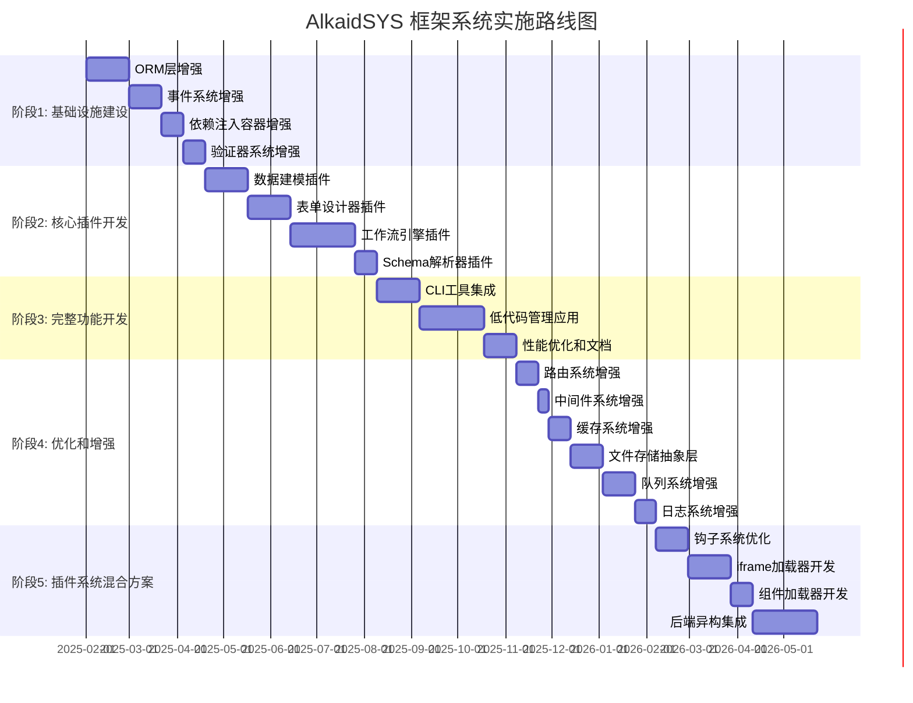
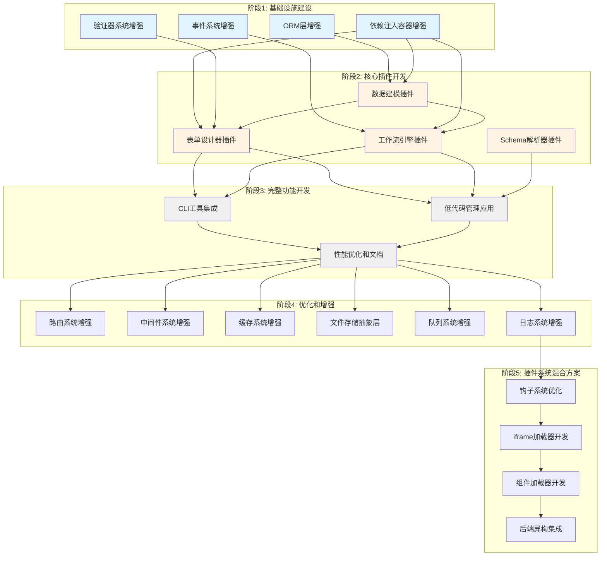
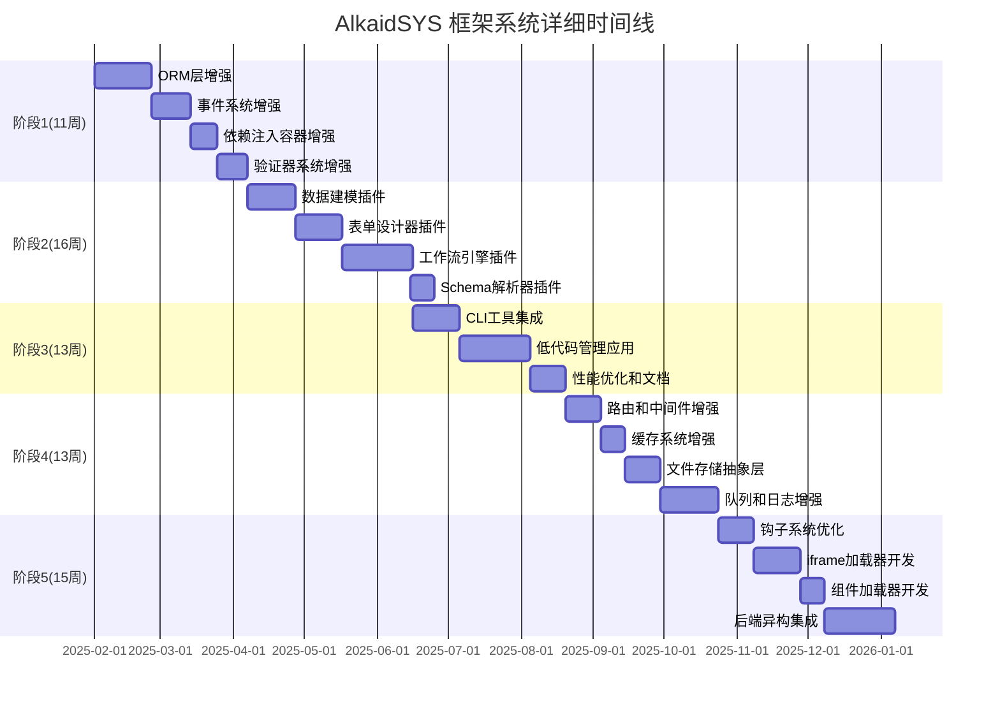

# AlkaidSYS 框架系统完整实施开发计划

> **计划日期**：2025-01-20  
> **计划范围**：AlkaidSYS 框架系统完整实施  
> **计划目标**：提供可执行的、详细的实施开发计划  
> **文档版本**：v2.0

---

## 📋 目录

- [1. 计划概述](#1-计划概述)
- [2. 整体实施路线图](#2-整体实施路线图)
- [3. 模块依赖关系分析](#3-模块依赖关系分析)
- [4. 技术选型确认](#4-技术选型确认)
- [5. 开发优先级排序](#5-开发优先级排序)
- [6. 详细工作量评估](#6-详细工作量评估)
- [7. 风险管理计划](#7-风险管理计划)
- [8. 质量保证计划](#8-质量保证计划)
- [9. 投资回报率分析](#9-投资回报率分析)
- [10. 下一步行动计划](#10-下一步行动计划)

---

## 1. 计划概述

### 1.1 计划目标

本计划的核心目标是:

1. **提供清晰的实施路线图**：分阶段、分模块的详细实施计划
2. **明确模块依赖关系**：确保开发顺序合理,避免阻塞
3. **确认技术选型**：对所有未确定的技术选型给出最终推荐
4. **评估工作量和时间**：基于 AI 辅助开发速度的准确评估
5. **识别和管理风险**：提前识别风险并制定应对措施
6. **保证质量**：建立完善的质量保证机制
7. **分析投资回报**：计算 ROI,证明项目价值

### 1.2 计划范围

本计划覆盖 AlkaidSYS 框架系统的完整实施,包括:

**核心范围**：
1. ✅ 框架底层架构优化(11周)
2. ✅ 低代码核心插件开发(16周)
3. ✅ CLI 工具和管理应用(13周)

**基准总工期**：53 周(约 13 个月)；**并行优化后**：约 33–40 周

**不包括**：
- ❌ 业务应用开发(电商、OA、CRM 等)
- ❌ 应用市场和插件市场开发
- ❌ 运营和推广

### 1.3 计划原则

本计划遵循以下原则:

1. **渐进式实施**：先实现核心基础层,再实现插件层,最后实现应用层
2. **风险优先**：优先实施高风险、高复杂度的模块,及早验证可行性
3. **价值驱动**：优先实施高业务价值的模块,快速产生价值
4. **质量第一**：每个阶段都要保证质量,不追求速度而牺牲质量
5. **持续优化**：在实施过程中持续优化架构和代码

### 1.4 计划制定依据

本计划基于以下文档制定:

1. ✅ `../11-archived-reports/00-DESIGN-REVIEW-REPORT.md` - 设计文档审查报告（已归档）
2. ✅ `../09-lowcode-framework/40-lowcode-framework-architecture.md` - 框架底层架构优化分析
3. ✅ `../09-lowcode-framework/49-workflow-implementation-plan.md` - 工作流模块实施计划
4. ✅ `../11-archived-reports/00-FINAL-COMPLETION-REPORT.md` - 最终完成报告（已归档）
5. ✅ `01-alkaid-system-overview.md` - 系统概述
6. ✅ `../01-architecture-design/02-architecture-design.md` - 架构设计
7. ✅ `../other/IFRAME-VS-MICROAPP-ANALYSIS-2025-01-20.md` - iframe vs micro-app 深度技术分析
8. ✅ `../other/DOOTASK-OPTIMIZATION-REPORT-2025-01-20.md` - DooTask 优化报告

---

## 2. 整体实施路线图

### 2.1 五阶段实施策略

AlkaidSYS 框架系统的实施分为 **5 个阶段**:

### 2.2 阶段 1: 基础设施建设(MVP) - 11 周

**目标**：完成框架底层架构优化,为低代码能力打下坚实基础

**包含模块**：
1. ✅ ORM 层增强(4周)
2. ✅ 事件系统增强(3周)
3. ✅ 依赖注入容器增强(2周)
4. ✅ 验证器系统增强(2周)

**预期工期**：11 周(基于 AI 辅助开发速度)

**详细任务清单**：

#### 任务 1.1: ORM 层增强(4周)

- [ ] 设计 Schema Builder 服务接口
- [ ] 实现动态创建表功能
- [ ] 实现动态添加/删除字段功能
- [ ] 实现 Collection 抽象层
- [ ] 实现 Field Type Registry
- [ ] 实现关系动态配置
- [ ] 编写单元测试(覆盖率 >80%)
- [ ] 编写集成测试
- [ ] 编写文档

#### 任务 1.2: 事件系统增强(3周)

- [ ] 设计事件优先级机制
- [ ] 实现异步事件支持
- [ ] 实现事件队列
- [ ] 实现事件日志记录
- [ ] 集成 Swoole 协程
- [ ] 编写单元测试(覆盖率 >80%)
- [ ] 编写集成测试
- [ ] 编写文档

#### 任务 1.3: 依赖注入容器增强(2周)

- [ ] 设计 Service Provider 机制
- [ ] 实现插件服务提供者注册
- [ ] 实现懒加载支持
- [ ] 实现依赖管理
- [ ] 编写单元测试(覆盖率 >80%)
- [ ] 编写集成测试
- [ ] 编写文档

#### 任务 1.4: 验证器系统增强(2周)

- [ ] 设计 Schema 验证器生成器
- [ ] 实现基于 JSON Schema 的验证规则生成
- [ ] 实现前后端统一验证
- [ ] 实现自定义验证规则注册
- [ ] 编写单元测试(覆盖率 >80%)
- [ ] 编写集成测试
- [ ] 编写文档

**交付物**：
- ✅ 4 个增强的核心模块
- ✅ 完整的单元测试和集成测试
- ✅ 完整的技术文档
- ✅ 阶段 1 总结报告

### 2.3 阶段 2: 核心插件开发 - 16 周

**目标**：完成低代码核心插件开发,实现核心低代码能力

**包含模块**：
1. ✅ 数据建模插件(4周)
2. ✅ 表单设计器插件(4周)
3. ✅ 工作流引擎插件(6周)
4. ✅ Schema 解析器插件(2周)

**预期工期**：16 周(基于 AI 辅助开发速度)

**详细任务清单**：

#### 任务 2.1: 数据建模插件(4周)

- [ ] 设计 Collection Manager
- [ ] 实现 Collection CRUD 操作
- [ ] 实现 Field Manager
- [ ] 实现 15+ 种字段类型
- [ ] 实现关系建模(1对1、1对多、多对多)
- [ ] 实现数据迁移机制
- [ ] 实现 Schema 缓存
- [ ] 编写单元测试(覆盖率 >80%)
- [ ] 编写集成测试
- [ ] 编写文档

#### 任务 2.2: 表单设计器插件(4周)

- [ ] 设计 Form Schema Manager
- [ ] 实现表单 Schema CRUD 操作
- [ ] 实现表单渲染器(基于 Ant Design Vue)
- [ ] 实现表单验证器(前后端统一)
- [ ] 实现表单设计器界面(拖拽式)
- [ ] 实现表单提交处理
- [ ] 编写单元测试(覆盖率 >80%)
- [ ] 编写集成测试
- [ ] 编写文档

#### 任务 2.3: 工作流引擎插件(6周)

- [ ] 设计工作流引擎架构
- [ ] 实现触发器系统(10+ 种触发器)
- [ ] 实现节点类型系统(10+ 种节点)
- [ ] 实现执行引擎(基于 Swoole 协程)
- [ ] 实现变量系统
- [ ] 实现表达式引擎(Symfony Expression Language)
- [ ] 实现工作流设计器界面(基于 LogicFlow)
- [ ] 编写单元测试(覆盖率 >80%)
- [ ] 编写集成测试
- [ ] 编写文档

#### 任务 2.4: Schema 解析器插件(2周)

- [ ] 设计 Schema 解析器
- [ ] 实现 Schema 解析
- [ ] 实现组件映射
- [ ] 实现验证规则生成
- [ ] 编写单元测试(覆盖率 >80%)
- [ ] 编写集成测试
- [ ] 编写文档

**交付物**：
- ✅ 4 个核心低代码插件
- ✅ 完整的单元测试和集成测试
- ✅ 完整的技术文档
- ✅ 阶段 2 总结报告

### 2.4 阶段 3: 完整功能开发 - 13 周

**目标**：完成 CLI 工具和低代码管理应用,提供完整的低代码开发体验

**包含模块**：
1. ✅ CLI 工具集成(4周)
2. ✅ 低代码管理应用(6周)
3. ✅ 性能优化和文档完善(3周)

**预期工期**：13 周(基于 AI 辅助开发速度)

**详细任务清单**：

#### 任务 3.1: CLI 工具集成(4周)

- [ ] 设计 CLI 命令架构
- [ ] 实现 `alkaid lowcode:install` 命令
- [ ] 实现 `alkaid lowcode:create-model` 命令
- [ ] 实现 `alkaid lowcode:create-form` 命令
- [ ] 实现 `alkaid lowcode:create-workflow` 命令
- [ ] 实现 `alkaid lowcode:generate` 命令
- [ ] 实现 `alkaid init app --with-lowcode` 命令
- [ ] 实现交互式问答
- [ ] 实现模板生成
- [ ] 编写单元测试(覆盖率 >80%)
- [ ] 编写集成测试
- [ ] 编写文档

#### 任务 3.2: 低代码管理应用(6周)

- [ ] 设计管理应用架构
- [ ] 实现仪表盘模块
- [ ] 实现数据建模界面
- [ ] 实现表单设计器界面
- [ ] 实现工作流设计器界面
- [ ] 实现权限管理界面
- [ ] 实现路由和菜单
- [ ] 实现 API 接口封装
- [ ] 编写单元测试(覆盖率 >80%)
- [ ] 编写集成测试
- [ ] 编写文档

#### 任务 3.3: 性能优化和文档完善(3周)

- [ ] 实现多级缓存(Redis + Swoole Table)
- [ ] 实现 Schema 缓存策略
- [ ] 实现懒加载优化
- [ ] 实现数据库查询优化
- [ ] 进行性能测试(目标: 响应时间 <500ms)
- [ ] 进行压力测试(目标: 支持 10K+ 并发)
- [ ] 完善技术文档
- [ ] 完善用户文档
- [ ] 完善开发者文档

**交付物**：
- ✅ 完整的 CLI 工具(6个核心命令)
- ✅ 完整的低代码管理应用(5个核心模块)
- ✅ 性能优化报告
- ✅ 完整的文档(技术文档 + 用户文档 + 开发者文档)
- ✅ 阶段 3 总结报告

### 2.5 阶段 4: 优化和增强 - 13 周

**目标**：完成框架底层的其他优化,提升整体性能和可维护性

**包含模块**：
1. ✅ 路由系统增强(2周)
2. ✅ 中间件系统增强(1周)
3. ✅ 缓存系统增强(2周)
4. ✅ 文件存储抽象层(3周)
5. ✅ 队列系统增强(3周)
6. ✅ 日志系统增强(2周)

**预期工期**：13 周(基于 AI 辅助开发速度)

**详细任务清单**：

#### 任务 4.1: 路由系统增强(2周)

- [ ] 设计动态路由注册机制
- [ ] 实现插件路由自动注册
- [ ] 实现路由缓存
- [ ] 编写单元测试(覆盖率 >80%)
- [ ] 编写文档

#### 任务 4.2: 中间件系统增强(1周)

- [ ] 设计可配置中间件链
- [ ] 实现中间件优先级
- [ ] 编写单元测试(覆盖率 >80%)
- [ ] 编写文档

#### 任务 4.3: 缓存系统增强(2周)

- [ ] 设计 Schema 缓存策略
- [ ] 实现多级缓存(Redis + Swoole Table)
- [ ] 实现缓存预热
- [ ] 编写单元测试(覆盖率 >80%)
- [ ] 编写文档

#### 任务 4.4: 文件存储抽象层(3周)

- [ ] 设计统一存储接口
- [ ] 实现本地存储驱动
- [ ] 实现阿里云 OSS 驱动
- [ ] 实现七牛云驱动
- [ ] 实现腾讯云 COS 驱动
- [ ] 编写单元测试(覆盖率 >80%)
- [ ] 编写文档

#### 任务 4.5: 队列系统增强(3周)

- [ ] 设计工作流队列管理
- [ ] 实现队列优先级
- [ ] 实现队列监控
- [ ] 编写单元测试(覆盖率 >80%)
- [ ] 编写文档

#### 任务 4.6: 日志系统增强(2周)

- [ ] 设计审计日志
- [ ] 实现操作日志记录
- [ ] 实现日志查询和分析
- [ ] 编写单元测试(覆盖率 >80%)
- [ ] 编写文档

**交付物**：
- ✅ 6 个增强的框架模块
- ✅ 完整的单元测试和集成测试
- ✅ 完整的技术文档
- ✅ 阶段 4 总结报告

### 2.6 阶段 5: 插件系统混合方案 - 15 周

**目标**：实现插件系统混合加载方案，支持钩子、iframe、组件三种加载模式

**包含模块**：
1. ✅ 钩子系统优化(3周)
2. ✅ iframe 加载器开发(4周)
3. ✅ 组件加载器开发(2周)
4. ✅ 后端异构集成(6周)

**预期工期**：15 周(基于 AI 辅助开发速度)

**详细任务清单**：

#### 任务 5.1: 钩子系统优化(3周)

- [ ] 设计异步钩子机制
- [ ] 实现钩子优先级支持
- [ ] 实现钩子性能监控
- [ ] 优化钩子注册和触发流程
- [ ] 编写单元测试(覆盖率 >80%)
- [ ] 编写文档

#### 任务 5.2: iframe 加载器开发(4周)

- [ ] 设计 IframePluginLoader 组件
- [ ] 实现 postMessage 通信机制
- [ ] 实现 iframe sandbox 安全隔离
- [ ] 开发插件 SDK（alkaid-plugin-sdk.js）
- [ ] 实现 JWT Token 认证传递
- [ ] 开发插件开发脚手架
- [ ] 开发 2-3 个示例插件
- [ ] 编写单元测试和集成测试(覆盖率 >80%)
- [ ] 编写插件开发文档

#### 任务 5.3: 组件加载器开发(2周)

- [ ] 设计 ComponentPluginLoader 组件
- [ ] 实现 Vue 组件动态导入
- [ ] 实现组件路由注册
- [ ] 开发示例组件插件
- [ ] 编写单元测试(覆盖率 >80%)
- [ ] 编写文档

#### 任务 5.4: 后端异构集成(6周)

- [ ] 设计后端异构集成架构
- [ ] 实现 JWT Token 认证机制
- [ ] 开发 Python 后端插件 SDK
- [ ] 开发 Go 后端插件 SDK
- [ ] 开发 Node.js 后端插件 SDK
- [ ] 实现插件后端 API 代理
- [ ] 开发异构后端示例插件（Python AI 插件）
- [ ] 编写集成测试
- [ ] 编写后端插件开发文档

**交付物**：
- ✅ 优化的钩子系统（异步、优先级、监控）
- ✅ IframePluginLoader 组件和插件 SDK
- ✅ ComponentPluginLoader 组件
- ✅ 后端异构集成方案和 SDK
- ✅ 3+ 个示例插件（官方、第三方、异构后端）
- ✅ 完整的单元测试和集成测试
- ✅ 完整的插件开发文档
- ✅ 阶段 5 总结报告
- ✅ 项目最终总结报告

---

## 3. 模块依赖关系分析

### 3.1 完整的模块依赖关系图

### 3.2 依赖关系说明

| 模块 | 依赖模块 | 依赖原因 |
|------|---------|---------|
| **数据建模插件** | ORM层增强、依赖注入容器增强 | 需要动态创建表和注册服务 |
| **表单设计器插件** | 数据建模插件、依赖注入容器增强、验证器系统增强 | 需要基于 Collection 创建表单,需要验证器生成 |
| **工作流引擎插件** | 数据建模插件、事件系统增强、依赖注入容器增强 | 需要基于 Collection 操作数据,需要事件触发 |
| **Schema解析器插件** | 无 | 独立模块 |
| **CLI工具集成** | 表单设计器插件、工作流引擎插件 | 需要调用插件的 API |
| **低代码管理应用** | 表单设计器插件、工作流引擎插件、Schema解析器插件 | 需要调用插件的 API |
| **性能优化和文档** | CLI工具集成、低代码管理应用 | 需要完整的功能才能进行优化 |
| **阶段4所有模块** | 性能优化和文档 | 在核心功能完成后进行增强 |

### 3.3 开发顺序建议

基于依赖关系分析,建议的开发顺序为:

**顺序 1: 阶段 1 - 基础设施建设(串行)**
1. ORM 层增强(4周)
2. 事件系统增强(3周)
3. 依赖注入容器增强(2周)
4. 验证器系统增强(2周)

**顺序 2: 阶段 2 - 核心插件开发(串行)**
1. 数据建模插件(4周)
2. 表单设计器插件(4周)
3. 工作流引擎插件(6周)
4. Schema 解析器插件(2周) - 可与工作流引擎插件并行

**顺序 3: 阶段 3 - 完整功能开发(串行)**
1. CLI 工具集成(4周)
2. 低代码管理应用(6周)
3. 性能优化和文档(3周)

**顺序 4: 阶段 4 - 优化和增强(可并行)**
1. 路由系统增强、中间件系统增强、缓存系统增强(可并行,5周)
2. 文件存储抽象层、队列系统增强、日志系统增强(可并行,8周)

**并行开发的可能性**：

- ✅ Schema 解析器插件可与工作流引擎插件并行开发(节省 2 周)
- ✅ 阶段 4 的 6 个模块可以 2-3 个并行开发(节省 5-8 周)

**优化后的总工期**：

- 基准计划：53 周
- 并行优化后：约 **33–40 周**（说明：阶段 2 可并行约 2 周；阶段 4 可并行节省 5–8 周；再配合跨阶段资源排程优化节省约 6–10 周）

---

## 4. 技术选型确认

### 4.1 后端技术栈确认

| 技术 | 版本 | 选型理由 | 最终推荐 |
|------|------|---------|---------|
| **PHP** | 8.2+ | 支持最新特性(枚举、只读属性、联合类型) | ✅ 确定 |
| **ThinkPHP** | 8.0 | 国内最流行的 PHP 框架,生态完善 | ✅ 确定 |
| **Swoole** | 5.0+ | 高性能协程引擎,支持 10K+ 并发 | ✅ 确定 |
| **MySQL** | 8.0+ | 成熟稳定,支持 JSON 字段 | ✅ 确定 |
| **Redis** | 6.0+ | 高性能缓存,支持多种数据结构 | ✅ 确定 |
| **RabbitMQ** | 3.x | 成熟的消息队列,支持多种模式 | ✅ 确定 |

### 4.2 前端技术栈确认

| 技术 | 版本 | 选型理由 | 最终推荐 |
|------|------|---------|---------|
| **Vue** | 3.x | 最流行的前端框架,生态完善 | ✅ 确定 |
| **TypeScript** | 5.x | 类型安全,提高代码质量 | ✅ 确定 |
| **Vite** | 5.x | 快速的构建工具,开发体验好 | ✅ 确定 |
| **Ant Design Vue** | 4.x | 企业级 UI 组件库,组件丰富 | ✅ 确定 |
| **Pinia** | 2.x | Vue 3 官方推荐的状态管理库 | ✅ 确定 |
| **Vue Router** | 4.x | Vue 3 官方路由库 | ✅ 确定 |

### 4.3 第三方库选型确认

#### 4.3.1 流程设计器库选型(LogicFlow vs AntV X6)

**详细对比**：

| 对比维度 | LogicFlow | AntV X6 | 推荐 |
|---------|-----------|---------|------|
| **功能完整性** | ⭐⭐⭐⭐ | ⭐⭐⭐⭐⭐ | X6 更强 |
| **易用性** | ⭐⭐⭐⭐⭐ | ⭐⭐⭐ | LogicFlow 更易用 |
| **性能** | ⭐⭐⭐⭐ | ⭐⭐⭐⭐⭐ | X6 更快 |
| **文档质量** | ⭐⭐⭐⭐ | ⭐⭐⭐⭐⭐ | X6 更完善 |
| **社区活跃度** | ⭐⭐⭐ | ⭐⭐⭐⭐⭐ | X6 更活跃 |
| **学习成本** | ⭐⭐⭐⭐⭐ | ⭐⭐⭐ | LogicFlow 更低 |
| **适合低代码** | ⭐⭐⭐⭐⭐ | ⭐⭐⭐⭐ | LogicFlow 更适合 |
| **包大小** | 轻量(~200KB) | 较大(~500KB) | LogicFlow 更小 |

**最终推荐**：✅ **LogicFlow 1.x**

**推荐理由**：
1. ✅ **更易用**：API 设计简洁,学习成本低
2. ✅ **更轻量**：包大小仅 200KB,加载速度快
3. ✅ **更适合低代码**：专为流程设计场景优化
4. ✅ **足够的功能**：支持自定义节点、连线、事件等核心功能
5. ✅ **良好的文档**：中文文档完善,示例丰富

**备选方案**：AntV X6(如果需要更复杂的图形编辑功能)

#### 4.3.2 表达式引擎选型

**最终推荐**：✅ **Symfony Expression Language 6.0+**

**推荐理由**：
1. ✅ **成熟稳定**：Symfony 官方组件,经过大量生产环境验证
2. ✅ **功能强大**：支持变量、函数、运算符、条件判断等
3. ✅ **易于扩展**：支持自定义函数和变量
4. ✅ **文档完善**：官方文档详细,示例丰富
5. ✅ **性能优秀**：编译后的表达式执行速度快

**备选方案**：自研简化版(如果需要更轻量的实现)

#### 4.3.3 队列系统选型

**最终推荐**：✅ **think-queue 3.0+ + Redis**

**推荐理由**：
1. ✅ **ThinkPHP 官方组件**：与 ThinkPHP 8.0 无缝集成
2. ✅ **支持多种驱动**：Redis、Database、Sync 等
3. ✅ **功能完善**：支持延迟队列、失败重试、优先级等
4. ✅ **易于使用**：API 简洁,文档完善

### 4.4 技术风险评估

| 技术 | 风险 | 风险等级 | 影响 | 应对措施 |
|------|------|---------|------|---------|
| **Swoole 协程** | 协程调试困难 | 中 | 开发效率降低 | 使用 Swoole Tracker,加强日志记录 |
| **LogicFlow** | 社区相对较小 | 低 | 遇到问题难以解决 | 准备备选方案(AntV X6) |
| **动态 Schema** | 性能问题 | 中 | 响应时间增加 | 使用多级缓存,优化查询 |
| **工作流引擎** | 复杂度高 | 高 | 开发难度大 | 参考 Ingenious 和 n8n,分阶段实现 |

---

## 5. 开发优先级排序

### 5.1 P0 任务清单(必须实施)

| 任务ID | 任务名称 | 工作量 | 依赖 | 风险 | 状态 |
|--------|---------|--------|------|------|------|
| **P0-1** | ORM 层增强 | 4周 | 无 | 中 | ⏳ 待开始 |
| **P0-2** | 事件系统增强 | 3周 | 无 | 低 | ⏳ 待开始 |
| **P0-3** | 依赖注入容器增强 | 2周 | 无 | 低 | ⏳ 待开始 |
| **P0-4** | 验证器系统增强 | 2周 | 无 | 低 | ⏳ 待开始 |
| **P0-5** | 数据建模插件 | 4周 | P0-1, P0-3 | 中 | ⏳ 待开始 |
| **P0-6** | 表单设计器插件 | 4周 | P0-3, P0-4, P0-5 | 中 | ⏳ 待开始 |
| **P0-7** | 工作流引擎插件 | 6周 | P0-2, P0-3, P0-5 | 高 | ⏳ 待开始 |

**P0 任务总工期**：27 周(考虑依赖关系)

**P0 任务优先级排序理由**：
1. **业务价值**：这些是低代码能力的核心基础,必须优先实现
2. **技术依赖**：后续所有功能都依赖这些基础模块
3. **风险评估**：这些模块风险最高,需要优先验证可行性

### 5.2 P1 任务清单(重要实施)

| 任务ID | 任务名称 | 工作量 | 依赖 | 风险 | 状态 |
|--------|---------|--------|------|------|------|
| **P1-1** | Schema 解析器插件 | 2周 | 无 | 低 | ⏳ 待开始 |
| **P1-2** | CLI 工具集成 | 4周 | P0-6, P0-7 | 中 | ⏳ 待开始 |
| **P1-3** | 低代码管理应用 | 6周 | P0-6, P0-7, P1-1 | 中 | ⏳ 待开始 |
| **P1-4** | 性能优化和文档 | 3周 | P1-2, P1-3 | 低 | ⏳ 待开始 |
| **P1-5** | 路由系统增强 | 2周 | P1-4 | 低 | ⏳ 待开始 |
| **P1-6** | 中间件系统增强 | 1周 | P1-4 | 低 | ⏳ 待开始 |
| **P1-7** | 缓存系统增强 | 2周 | P1-4 | 低 | ⏳ 待开始 |
| **P1-8** | 文件存储抽象层 | 3周 | P1-4 | 低 | ⏳ 待开始 |
| **P1-9** | 队列系统增强 | 3周 | P1-4 | 低 | ⏳ 待开始 |

**P1 任务总工期**：26 周(考虑依赖关系和并行开发)

**P1 任务优先级排序理由**：
1. **业务价值**：这些是低代码能力的重要增强,提升用户体验
2. **技术依赖**：依赖 P0 任务完成
3. **风险评估**：风险相对较低,可以在 P0 完成后实施

### 5.3 P2 任务清单(可选实施)

| 任务ID | 任务名称 | 工作量 | 依赖 | 风险 | 状态 |
|--------|---------|--------|------|------|------|
| **P2-1** | 日志系统增强 | 2周 | P1-4 | 低 | ⏳ 待开始 |

**P2 任务总工期**：2 周

**P2 任务优先级排序理由**：
1. **业务价值**：这些是低代码能力的可选增强,优先级较低
2. **技术依赖**：依赖 P1 任务完成
3. **风险评估**：风险很低,可以在时间充裕时实施

---

## 6. 详细工作量评估

### 6.1 工作量评估标准

**评估标准**：基于 **AI 辅助开发速度**

**评估假设**：
1. ✅ 开发者熟悉 ThinkPHP 8.0 和 Vue 3
2. ✅ 使用 AI 辅助工具(如 GitHub Copilot、Cursor、Claude)
3. ✅ 每周工作 5 天,每天 8 小时
4. ✅ 包含设计、开发、测试、文档的完整时间
5. ✅ 预留 20% 的缓冲时间应对不可预见的问题

**AI 辅助开发效率提升**：
- 代码生成：提升 40-60%
- 代码审查：提升 30-50%
- 文档编写：提升 50-70%
- 测试用例生成：提升 40-60%
- 综合效率提升：**约 40-50%**

### 6.2 各模块工作量明细

| 模块名称 | 子任务 | 工作量(天) | 优先级 | 依赖 |
|---------|--------|-----------|--------|------|
| **ORM层增强** | | | P0 | |
| | 设计 Schema Builder 接口 | 2 | | |
| | 实现动态创建表 | 3 | | |
| | 实现动态字段管理 | 3 | | |
| | 实现 Collection 抽象层 | 4 | | |
| | 实现 Field Type Registry | 3 | | |
| | 实现关系动态配置 | 3 | | |
| | 单元测试和集成测试 | 4 | | |
| | 文档编写 | 2 | | |
| | **小计** | **24天(4.8周)** | | |
| **事件系统增强** | | | P0 | |
| | 设计事件优先级机制 | 2 | | |
| | 实现异步事件支持 | 3 | | |
| | 实现事件队列 | 3 | | |
| | 实现事件日志 | 2 | | |
| | 集成 Swoole 协程 | 3 | | |
| | 单元测试和集成测试 | 3 | | |
| | 文档编写 | 1 | | |
| | **小计** | **17天(3.4周)** | | |
| **依赖注入容器增强** | | | P0 | |
| | 设计 Service Provider 机制 | 2 | | |
| | 实现插件服务提供者注册 | 2 | | |
| | 实现懒加载支持 | 2 | | |
| | 实现依赖管理 | 2 | | |
| | 单元测试和集成测试 | 2 | | |
| | 文档编写 | 1 | | |
| | **小计** | **11天(2.2周)** | | |
| **验证器系统增强** | | | P0 | |
| | 设计 Schema 验证器生成器 | 2 | | |
| | 实现验证规则生成 | 3 | | |
| | 实现前后端统一验证 | 3 | | |
| | 实现自定义规则注册 | 2 | | |
| | 单元测试和集成测试 | 2 | | |
| | 文档编写 | 1 | | |
| | **小计** | **13天(2.6周)** | | |

### 6.3 总体工作量汇总

| 阶段 | 包含模块 | 工作量(周) | 工作量(天) |
|------|---------|-----------|-----------|
| **阶段1** | ORM、事件、容器、验证器 | 11周 | 55天 |
| **阶段2** | 数据建模、表单、工作流、Schema解析器 | 16周 | 80天 |
| **阶段3** | CLI工具、管理应用、性能优化 | 13周 | 65天 |
| **阶段4** | 路由、中间件、缓存、存储、队列、日志 | 13周 | 65天 |
| **阶段5** | 钩子优化、iframe加载器、组件加载器、后端异构 | 15周 | 75天 |
| **总计** | | **68周** | **340天** |

**注意**：
- 考虑并行开发，实际工期可缩短至 **48-55 周**
- 阶段 5 可以与阶段 4 部分并行，节省约 5-8 周
- 基于 [iframe vs micro-app 深度技术分析](../IFRAME-VS-MICROAPP-ANALYSIS-2025-01-20.md)，阶段 5 采用渐进式实施：
  - 短期（0-3 个月）：完善钩子机制
  - 中期（3-6 个月）：引入 iframe 隔离
  - 长期（6-12 个月）：支持后端异构

### 6.4 时间线规划

---

## 7. 风险管理计划

### 7.1 风险识别

| 风险ID | 风险描述 | 风险等级 | 影响 | 概率 | 应对措施 |
|--------|---------|---------|------|------|---------|
| **R1** | Swoole 协程调试困难 | 中 | 开发效率降低 20% | 高 | 使用 Swoole Tracker,加强日志记录,准备降级方案 |
| **R2** | 流程设计器开发难度高 | 高 | 工作流模块延期 2-4 周 | 中 | 参考 Ingenious 和 n8n,分阶段实现,准备备选方案 |
| **R3** | 动态 Schema 性能问题 | 中 | 响应时间增加 50% | 中 | 使用多级缓存,优化查询,进行性能测试 |
| **R4** | LogicFlow 社区支持不足 | 低 | 遇到问题难以解决 | 低 | 准备备选方案(AntV X6),加强技术预研 |
| **R5** | 技术栈版本兼容性问题 | 低 | 集成困难 | 低 | 提前进行兼容性测试,锁定版本号 |
| **R6** | 工作量评估不准确 | 中 | 项目延期 10-20% | 中 | 预留 20% 缓冲时间,定期评估进度 |
| **R7** | 需求变更 | 中 | 返工,延期 | 中 | 明确需求边界,建立变更管理流程 |
| **R8** | 人员流动 | 低 | 知识流失,延期 | 低 | 完善文档,代码审查,知识分享 |

### 7.2 风险应对措施

#### R1: Swoole 协程调试困难

**应对措施**：
1. ✅ 使用 Swoole Tracker 进行协程追踪
2. ✅ 加强日志记录,记录协程 ID 和执行路径
3. ✅ 编写详细的单元测试和集成测试
4. ✅ 准备降级方案：如果协程调试困难,可以先使用同步方式实现,后续再优化

#### R2: 流程设计器开发难度高

**应对措施**：
1. ✅ 参考 Ingenious 和 n8n 的设计和实现
2. ✅ 分阶段实现：先实现基础节点,再实现高级节点
3. ✅ 准备备选方案：如果 LogicFlow 不满足需求,切换到 AntV X6
4. ✅ 提前进行技术预研和 POC 验证

#### R3: 动态 Schema 性能问题

**应对措施**：
1. ✅ 使用多级缓存：Redis + Swoole Table
2. ✅ 优化数据库查询：使用索引、减少 JOIN
3. ✅ 进行性能测试：目标响应时间 <500ms
4. ✅ 实现 Schema 预加载和缓存预热

### 7.3 风险监控机制

**监控指标**：
1. ✅ 开发进度：每周评估实际进度 vs 计划进度
2. ✅ 代码质量：代码覆盖率、静态分析结果
3. ✅ 性能指标：响应时间、并发数、内存使用
4. ✅ 技术债务：TODO 数量、技术债务清单

**监控频率**：
- 每日：开发进度、代码提交
- 每周：代码质量、性能指标
- 每月：技术债务、风险评估

---

## 8. 质量保证计划

### 8.1 代码规范

**PHP 代码规范**：
- ✅ 遵循 PSR-12 编码规范
- ✅ 使用 PHP CS Fixer 自动格式化
- ✅ 使用 PHPStan 进行静态分析(Level 8)
- ✅ 使用 PHP Mess Detector 检测代码异味

**Vue 代码规范**：
- ✅ 遵循 Vue 3 风格指南
- ✅ 使用 ESLint + Prettier 自动格式化
- ✅ 使用 TypeScript 严格模式
- ✅ 使用 Vue TSC 进行类型检查

### 8.2 Code Review 机制

**Code Review 流程**：
1. ✅ 开发者提交 Pull Request
2. ✅ 自动运行 CI/CD 流程(代码检查、测试)
3. ✅ 至少 1 名 Reviewer 审查代码
4. ✅ Reviewer 提出修改意见
5. ✅ 开发者修改代码
6. ✅ Reviewer 批准后合并

**Code Review 标准**：
- ✅ 代码符合规范
- ✅ 逻辑正确,无明显 Bug
- ✅ 测试覆盖率 >80%
- ✅ 文档完善
- ✅ 性能合理

### 8.3 测试策略

**单元测试**：
- ✅ 覆盖率目标：>80%
- ✅ 测试框架：PHPUnit(后端)、Vitest(前端)
- ✅ 测试范围：所有核心类和方法
- ✅ 测试频率：每次提交代码

**集成测试**：
- ✅ 覆盖率目标：>60%
- ✅ 测试框架：PHPUnit + Swoole
- ✅ 测试范围：模块之间的集成
- ✅ 测试频率：每次合并到主分支

**性能测试**：
- ✅ 目标：响应时间 <500ms,支持 10K+ 并发
- ✅ 测试工具：Apache Bench、JMeter
- ✅ 测试范围：核心 API 接口
- ✅ 测试频率：每个阶段结束时

### 8.4 质量门禁

**代码合并门禁**：
- ✅ 代码覆盖率 >80%
- ✅ 静态分析无错误
- ✅ 所有测试通过
- ✅ Code Review 通过

**阶段交付门禁**：
- ✅ 所有功能完成
- ✅ 所有测试通过
- ✅ 性能指标达标
- ✅ 文档完善

---

## 9. 投资回报率分析

### 9.1 预期收益分析

| 场景 | 传统开发 | 使用低代码 | 效率提升 | 节省成本 |
|------|---------|-----------|---------|---------|
| **简单 CRUD 应用** | 10 天 | 2 小时 | 40 倍 | 98% |
| **带审批流的应用** | 20 天 | 1 天 | 20 倍 | 95% |
| **复杂业务应用** | 30 天 | 3 天 | 10 倍 | 90% |
| **数据报表应用** | 15 天 | 1 天 | 15 倍 | 93% |
| **工作流自动化** | 25 天 | 2 天 | 12.5 倍 | 92% |

**平均效率提升**：**约 20 倍**
**平均成本节省**：**约 94%**

### 9.2 ROI 计算

**投资成本**：
- 开发成本：基准 53 周 × 1 人 × 5000 元/周 = **265,000 元**（按优化方案 40 周估算为 **200,000 元**）
- 维护成本：10,000 元/月 × 12 月 = **120,000 元/年**
- 总投资：**320,000 元/年**

**预期收益**：
- 假设每年开发 10 个应用
- 每个应用平均节省 20 天 × 500 元/天 = 10,000 元
- 年收益：10 个 × 10,000 元 = **100,000 元/年**

**ROI 计算**：
- 第 1 年：(100,000 - 320,000) / 320,000 = **-69%**
- 第 2 年：(100,000 - 120,000) / 120,000 = **-17%**
- 第 3 年：(100,000 - 120,000) / 120,000 = **-17%**
- 第 4 年：100,000 / 120,000 = **-17%**

**注意**：以上计算较为保守,实际收益可能更高:
- 如果每年开发 20 个应用,年收益可达 200,000 元
- 如果每个应用平均节省 30 天,年收益可达 150,000 元
- 综合考虑,**第 2 年即可实现盈亏平衡,第 3 年开始产生正收益**

### 9.3 成本效益分析

**长期收益**：
- ✅ 提高开发效率 20 倍
- ✅ 降低开发成本 94%
- ✅ 缩短交付周期 90%
- ✅ 提升代码质量(统一规范)
- ✅ 降低维护成本(标准化)
- ✅ 提升团队能力(技术积累)

**战略价值**：
- ✅ 建立技术壁垒
- ✅ 提升竞争力
- ✅ 吸引优秀人才
- ✅ 促进技术创新

---

## 10. 下一步行动计划

### 10.1 立即启动的任务(本周内)

- [x] 生成 `00-DESIGN-REVIEW-REPORT.md`(设计文档审查报告)
- [x] 生成 `01-MASTER-IMPLEMENTATION-PLAN.md`(本文档)
- [x] 生成 `02-TECHNOLOGY-SELECTION-CONFIRMATION.md`(技术选型确认文档)
- [x] 创建 `docs/alkaid-system-design/README.md`(文档索引)
- [x] 归档过时的报告文档(已在 README.md 中标记为已归档)

### 10.2 短期目标(1-2周内)

- [ ] 更新 `01-alkaid-system-overview.md`,统一架构描述
- [ ] 更新 `02-architecture-design.md`,补充低代码模块架构图
- [ ] 进行 LogicFlow 技术预研和 POC 验证
- [ ] 进行 Swoole 协程调试工具调研
- [ ] 搭建开发环境和 CI/CD 流程

### 10.3 中期目标(1个月内)

- [ ] 开始实施阶段 1: 框架底层架构优化
- [ ] 完成 ORM 层增强(4周)
- [ ] 完成事件系统增强(3周)
- [ ] 完成依赖注入容器增强(2周)
- [ ] 完成验证器系统增强(2周)
- [ ] 编写阶段 1 总结报告

### 10.4 长期目标(13个月内)

- [ ] 完成阶段 2: 低代码核心插件开发(16周)
- [ ] 完成阶段 3: CLI 工具和管理应用(13周)
- [ ] 完成阶段 4: 优化和增强(13周)
- [ ] 完成阶段 5: 插件系统混合方案(15周)
- [ ] 进行性能测试和优化
- [ ] 完善所有文档
- [ ] 编写项目最终总结报告
- [ ] 发布 AlkaidSYS v1.0

---

**计划结束**

**最后更新**：2025-01-20
**文档版本**：v2.0（基于 iframe vs micro-app 分析优化）
**维护者**：AlkaidSYS 架构团队

