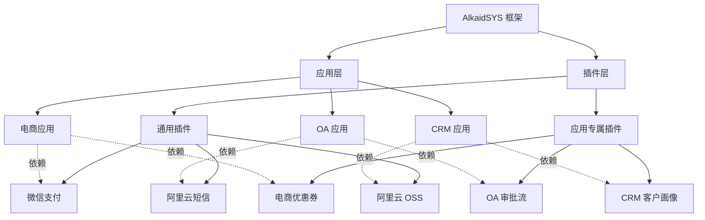
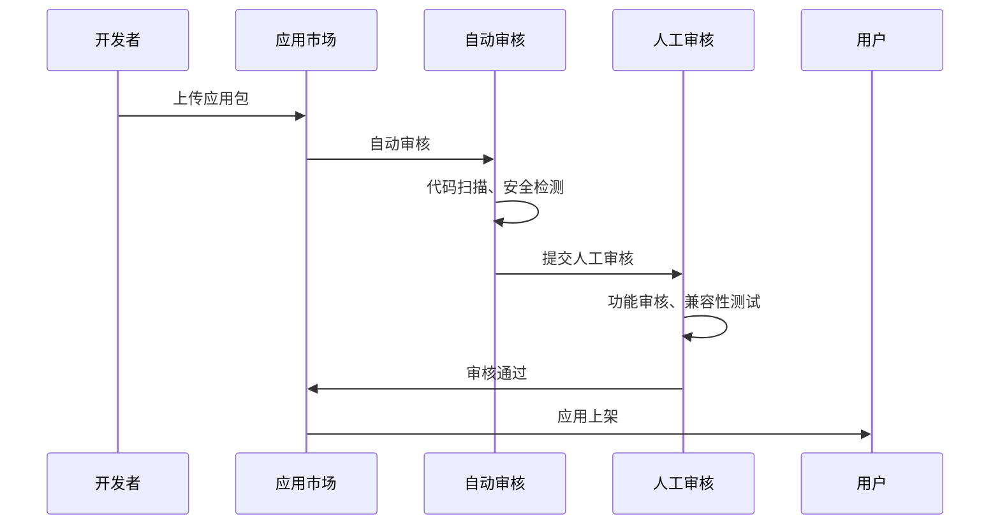
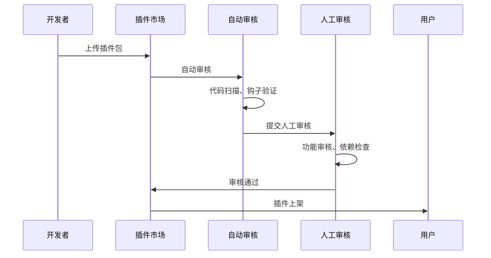

# AlkaidSYS（瑶光系统）系统概览

## 📋 项目基本信息

| 项目信息 | 内容 |
|---------|------|
| **项目名称** | AlkaidSYS（瑶光系统） |
| **英文名称** | Alkaid System |
| **版本** | 1.0.0 (设计阶段) |
| **开源协议** | MIT |
| **项目定位** | 强大、现代、低代码的企业级 SAAS 系统框架 |
| **开发语言** | PHP 8.2+ / TypeScript 5.8+ |
| **目标用户** | 企业级 SAAS 应用开发者 |

## 🎯 命名寓意

**瑶光（Alkaid）** 是北斗七星斗柄最末端的恒星，象征着：
- ✨ **开创** - 开创新的企业级 SAAS 框架
- 🔄 **变动** - 灵活的架构设计，适应业务变化
- 🚀 **冒险** - 勇于采用最新技术，突破传统框架限制
- 💡 **创新** - 融合 NIUCLOUD 和 Vue Vben Admin 的优势并创新

## 🌟 系统定位

AlkaidSYS 是一个**强大、现代、低代码（高效开发）**的企业级 SAAS 系统框架，旨在为企业提供：

1. **快速开发能力** - 低代码设计，提高开发效率 10 倍
2. **高性能架构** - 基于 Swoole 协程，支持 10K+ 并发
3. **灵活扩展性** - 插件化架构，易于添加新功能
4. **完善的多租户** - 支持共享数据库和独立数据库模式
5. **现代化前端** - 直接使用 Vue Vben Admin 5.x
6. **多端支持** - 覆盖 Admin、PC、小程序、App、H5 所有终端

## 🏗️ 核心架构特性

### 1. 整体架构（包含应用层、插件层和低代码层）

```mermaid
graph TB
    subgraph "客户端层"
        A1[Admin 管理端<br/>Vben Admin 5.x]
        A2[PC 客户端<br/>Vue 3 + Vite]
        A3[移动端<br/>UniApp]
    end

    subgraph "API 网关层"
        B[Nginx + Swoole<br/>路由分发 | 限流 | 认证]
    end

    subgraph "应用层 Application Layer"
        E1[电商应用]
        E2[OA 应用]
        E3[CRM 应用]
        E4[ERP 应用]
        E5[CMS 应用]
        E6[AI 应用]
        E7[低代码管理应用<br/>可选安装]
    end

    subgraph "插件层 Plugin Layer"
        F1[通用插件<br/>支付/短信/存储]
        F2[应用专属插件<br/>优惠券/审批流]
        F3[低代码插件<br/>数据建模/表单/工作流]
    end

    subgraph "低代码基础层 Lowcode Foundation"
        LC1[Schema Manager<br/>Schema 管理]
        LC2[Collection Manager<br/>Collection 管理]
        LC3[Field Type Registry<br/>字段类型注册表]
        LC4[Validator Generator<br/>验证器生成器]
    end

    subgraph "核心服务层"
        C1[用户服务]
        C2[租户服务]
        C3[权限服务]
        C4[应用服务]
        C5[插件服务]
    end

    subgraph "应用市场和插件市场"
        G1[应用市场]
        G2[插件市场]
        G3[开发者中心]
    end

    subgraph "数据层"
        D1[(MySQL 8.0+)]
        D2[(Redis 6.0+)]
        D3[(RabbitMQ)]
    end

    A1 & A2 & A3 --> B
    B --> E1 & E2 & E3 & E4 & E5 & E6 & E7
    E1 & E2 & E3 & E4 & E5 & E6 --> F1 & F2
    E7 --> F3
    F3 --> LC1 & LC2 & LC3 & LC4
    E1 & E2 & E3 & E4 & E5 & E6 & E7 --> C1 & C2 & C3 & C4 & C5
    F1 & F2 & F3 --> C5
    LC1 & LC2 & LC3 & LC4 --> C5
    C4 & C5 --> G1 & G2 & G3
    C1 & C2 & C3 & C4 & C5 --> D1 & D2 & D3
```

**架构说明**：

AlkaidSYS 采用**7层整体架构**，从上到下依次为：

1. **客户端层（Client Layer）**：多终端用户界面（Admin管理端、PC客户端、移动端）
2. **API网关层（Gateway Layer）**：请求路由、负载均衡、限流认证（Nginx + Swoole）
3. **应用层（Application Layer）**：完整的业务应用模块（电商、OA、CRM、ERP、CMS、AI、低代码管理应用）
4. **插件层（Plugin Layer）**：功能扩展模块（通用插件、应用专属插件、低代码插件）
5. **低代码基础层（Lowcode Foundation）**：低代码核心服务（Schema Manager、Collection Manager、Field Type Registry、Validator Generator）
6. **核心服务层（Core Services）**：框架核心服务（用户、租户、权限、应用、插件）
7. **数据层（Data Layer）**：数据存储和缓存（MySQL、Redis、RabbitMQ）

**低代码模块的四层架构**：

低代码模块本身采用四层架构，嵌入在整体架构的第3-6层中：

1. **低代码应用层**：低代码管理应用（属于整体架构的第3层-应用层）
2. **低代码插件层**：数据建模、表单设计器、工作流引擎插件（属于整体架构的第4层-插件层）
3. **低代码基础层**：Schema Manager、Collection Manager等核心服务（整体架构的第5层）
4. **核心框架层**：Container、Event、Cache、Queue、Log（整体架构的第6层）

**低代码能力定位**：

- ✅ **开发者工具**：帮助开发者快速开发应用和插件，而非独立的低代码平台
- ✅ **插件化设计**：低代码能力以插件形式提供，可选安装
- ✅ **CLI 集成**：通过 CLI 命令快速创建数据模型、表单、工作流
- ✅ **可视化界面**：可选安装低代码管理应用，提供可视化设计器
- ✅ **效率提升**：开发效率提升 40-48 倍（10 天 → 2 小时）

详细设计请参考：
- [低代码能力概述](../09-lowcode-framework/41-lowcode-overview.md)
- [框架底层架构优化分析](../09-lowcode-framework/40-lowcode-framework-architecture.md)

### 2. 多租户架构

**支持三种隔离模式**：

| 模式 | 适用场景 | 数据量 | 成本 | 性能 |
|------|---------|--------|------|------|
| **共享数据库** | 中小型租户 | <100万/租户 | 低 | 中 |
| **独立数据库** | 大型租户 | >100万/租户 | 高 | 高 |
| **混合模式** | 灵活组合 | 不限 | 中 | 高 |

### 3. 多站点架构

- ✅ 支持多个独立站点
- ✅ 每个站点独立域名
- ✅ 每个站点独立配置
- ✅ 站点间数据隔离

### 4. 多应用架构

- ✅ 支持多个业务应用模块
- ✅ 应用间独立路由和中间件
- ✅ 清晰的目录结构
- ✅ 易于团队协作

### 5. 应用和插件两层架构

**AlkaidSYS 创新性地采用应用（Application）和插件（Plugin）两层架构**：

#### 第一层：应用系统（Applications）

应用是完整的业务模块，可以独立安装、卸载、启用、禁用。

| 应用类型 | 说明 | 示例 |
|---------|------|------|
| **电商应用** | 电子商务相关 | 商城、拼团、秒杀 |
| **OA 应用** | 办公自动化 | 审批、考勤、任务 |
| **CRM 应用** | 客户关系管理 | 客户、线索、商机 |
| **ERP 应用** | 企业资源计划 | 采购、库存、财务 |
| **CMS 应用** | 内容管理系统 | 文章、页面、媒体 |
| **AI 应用** | 人工智能应用 | 智能客服、数据分析 |

**应用特性**：
- ✅ 完整的业务功能模块
- ✅ 独立的数据库表
- ✅ 独立的路由和菜单
- ✅ 独立的前端界面
- ✅ 支持版本升级
- ✅ 支持配置管理

#### 第二层：插件系统（Plugins）

插件是功能扩展模块，为应用或框架提供额外功能。

**插件分类**：

1. **通用插件（Universal Plugins）** - 跨应用使用
   - 支付网关插件（微信支付、支付宝、Stripe）
   - 短信服务插件（阿里云短信、腾讯云短信）
   - 存储服务插件（阿里云 OSS、七牛云、腾讯云 COS）
   - 邮件服务插件（SMTP、SendGrid、Mailgun）

2. **应用专属插件（App-Specific Plugins）** - 特定应用使用
   - 电商应用插件（优惠券、拼团、秒杀、砍价）
   - OA 应用插件（审批流、考勤打卡、排班管理）
   - CRM 应用插件（客户画像、销售漏斗、邮件营销）

**插件特性**：
- ✅ 热插拔支持
- ✅ 完整的生命周期管理
- ✅ 强大的钩子系统（Action/Filter/Event Hooks）
- ✅ 插件依赖管理
- ✅ 插件版本管理
- ✅ 钩子优先级控制

#### 应用与插件的关系



### 6. 应用市场和插件市场

**AlkaidSYS 提供完整的应用市场和插件市场生态系统**：

#### 应用市场（Application Market）

**核心功能**：
- 📦 应用浏览和搜索（6 大分类）
- 🔍 应用详情展示（截图、介绍、评价）
- 💰 应用购买和下载（免费、付费、订阅）
- ⭐ 应用评价和反馈
- 📊 应用统计和排行
- 🔄 应用版本管理和更新

**发布流程**：


#### 插件市场（Plugin Market）

**核心功能**：
- 🔌 插件浏览和搜索（通用插件、应用专属插件）
- 🔍 插件详情展示（钩子列表、依赖关系）
- 💰 插件购买和下载
- ⭐ 插件评价和反馈
- 📊 插件统计和排行
- 🔄 插件版本管理和更新

**发布流程**：


### 7. 开发者生态系统

**AlkaidSYS 构建完整的开发者生态系统**：

#### 开发者等级体系

| 等级 | 名称 | 条件 | 权益 |
|------|------|------|------|
| **L1** | 普通开发者 | 完成开发者认证 | 发布免费应用/插件 |
| **L2** | 认证开发者 | 发布 3 个应用/插件 + 平均评分 ≥ 4.0 | 发布付费应用/插件 |
| **L3** | 金牌开发者 | 发布 10 个应用/插件 + 平均评分 ≥ 4.5 + 总下载量 ≥ 10000 | 更高分成比例 + 优先推荐 |
| **L4** | 钻石开发者 | 发布 30 个应用/插件 + 平均评分 ≥ 4.8 + 总下载量 ≥ 100000 | 最高分成比例 + 专属支持 |

#### 收益分成机制

**基础分成比例**：

| 价格区间 | 平台分成 | 开发者分成 |
|---------|---------|-----------|
| ≤ 49 元 | 30% | 70% |
| 50-199 元 | 25% | 75% |
| 200-499 元 | 20% | 80% |
| ≥ 500 元 | 15% | 85% |

**等级加成**：
- L3 金牌开发者：额外 +5% 分成
- L4 钻石开发者：额外 +10% 分成

#### 开发者工具

- 🛠️ **AlkaidSYS CLI** - 命令行工具（初始化、打包、发布）
- 📦 **AlkaidSYS SDK** - PHP SDK（API 调用、签名验证）
- 📚 **完整文档** - 应用开发指南、插件开发指南
- 💬 **开发者社区** - 技术交流、问题解答
- 📊 **开发者中心** - 应用管理、收益管理、数据统计

### 6. 多端支持

| 终端类型 | 技术栈 | 说明 |
|---------|--------|------|
| **Admin 管理端** | Vue Vben Admin 5.x | 直接使用，无需开发 |
| **PC 客户端** | Vue 3 + Vite | 借鉴 Vben 优化 NIUCLOUD Web 端 |
| **小程序客户端** | UniApp | 优化 NIUCLOUD UniApp 端 |
| **App 客户端** | UniApp | 优化 NIUCLOUD UniApp 端 |
| **H5 客户端** | UniApp | 优化 NIUCLOUD UniApp 端 |

## 🔧 技术栈选型

### 后端技术栈

| 技术 | 版本 | 用途 |
|------|------|------|
| **ThinkPHP** | 8.0+ | 核心框架 |
| **PHP** | 8.2+ | 开发语言 |
| **Swoole** | 5.0+ | 高性能引擎（明确不使用 Workerman） |
| **MySQL** | 8.0+ | 主数据库 |
| **Redis** | 6.0+ | 缓存 + 队列 |
| **RabbitMQ** | 3.12+ | 消息队列 |
| **PHP-Casbin** | 3.x | 权限管理 |
| **Think-ORM** | 3.x | ORM |

### 前端技术栈

#### Admin 管理端
| 技术 | 版本 | 用途 |
|------|------|------|
| **Vue Vben Admin** | 5.x | 直接使用 |
| **Vue** | 3.x | 前端框架 |
| **Vite** | 5.x | 构建工具 |
| **TypeScript** | 5.x | 开发语言 |
| **Ant Design Vue** | 4.x | UI 组件库 |
| **Pinia** | 2.x | 状态管理 |

#### PC 客户端
| 技术 | 版本 | 用途 |
|------|------|------|
| **Vue** | 3.x | 前端框架 |
| **Vite** | 5.x | 构建工具 |
| **Ant Design Vue** | 4.x | UI 组件库 |
| **Pinia** | 2.x | 状态管理 |

#### 移动端（小程序/App/H5）
| 技术 | 版本 | 用途 |
|------|------|------|
| **UniApp** | 3.x | 跨端框架 |
| **Vue** | 3.x | 前端框架 |
| **uView UI** | 3.x | UI 组件库 |

## 💡 核心创新点

### 1. ThinkPHP 8.0 + Swoole 微服务架构

**创新点**：
- ✅ 使用 Swoole HTTP Server 替代传统 PHP-FPM
- ✅ 使用协程实现高并发（10K+ 并发）
- ✅ 使用连接池优化数据库和 Redis 连接
- ✅ 使用 Swoole Table 实现共享内存缓存

**对比 NIUCLOUD**：
- ❌ NIUCLOUD 使用传统 PHP-FPM，并发能力有限
- ✅ AlkaidSYS 使用 Swoole 协程，并发能力提升 10 倍

### 2. 混合多租户模式

**创新点**：
- ✅ 支持共享数据库模式（成本低）
- ✅ 支持独立数据库模式（性能高）
- ✅ 支持混合模式（灵活组合）
- ✅ 租户级别的资源配额管理

**对比 NIUCLOUD**：
- ❌ NIUCLOUD 仅支持共享数据库模式
- ✅ AlkaidSYS 支持三种模式，灵活性更高

### 3. 应用和插件两层架构

**创新点**：
- ✅ **明确区分应用和插件** - 应用是完整业务模块，插件是功能扩展
- ✅ **两层架构设计** - 应用层 + 插件层，清晰的职责划分
- ✅ **通用插件和应用专属插件** - 插件可跨应用使用或专属于某个应用
- ✅ **完整的生命周期管理** - install/uninstall/upgrade/enable/disable
- ✅ **强大的钩子系统** - Action Hooks、Filter Hooks、Event Hooks
- ✅ **钩子优先级控制** - 支持多个插件按优先级执行
- ✅ **插件依赖管理** - 自动检查应用和框架依赖
- ✅ **插件版本管理** - 支持多版本共存和升级
- ✅ **插件热更新** - 无需重启即可更新插件

**对比 NIUCLOUD**：
- ❌ NIUCLOUD 只有"插件"概念，没有区分应用和插件
- ❌ NIUCLOUD 插件系统功能较弱，钩子机制简单
- ✅ AlkaidSYS 两层架构更清晰，插件系统更强大

### 4. 应用市场和插件市场生态

**创新点**：
- ✅ **完整的应用市场** - 6 大应用分类，支持浏览、搜索、购买、评价
- ✅ **完整的插件市场** - 通用插件和应用专属插件分类
- ✅ **两阶段审核机制** - 自动审核（代码扫描、安全检测）+ 人工审核
- ✅ **钩子验证机制** - 自动验证插件是否正确实现钩子
- ✅ **开发者等级体系** - 4 级等级（普通/认证/金牌/钻石）
- ✅ **阶梯式分成比例** - 根据价格和等级动态调整分成
- ✅ **完整的开发者工具** - CLI 工具、SDK、完整文档
- ✅ **开发者中心** - 应用管理、收益管理、数据统计

**对比 NIUCLOUD**：
- ❌ NIUCLOUD 没有应用市场和插件市场
- ❌ NIUCLOUD 没有开发者生态系统
- ✅ AlkaidSYS 提供完整的市场生态和开发者支持

### 5. 直接使用 Vue Vben Admin

**创新点**：
- ✅ 直接使用 Vben Admin 5.x，无需重新开发
- ✅ 享受 Vben 的 Monorepo 架构
- ✅ 享受 Vben 的状态管理（Pinia + AES 加密）
- ✅ 享受 Vben 的权限控制（三种模式）

**对比 NIUCLOUD**：
- ❌ NIUCLOUD 使用 Element Plus，功能较弱
- ✅ AlkaidSYS 使用 Vben，功能更强大

### 6. 统一的多端 API

**创新点**：
- ✅ 统一的 RESTful API 规范
- ✅ 统一的认证和权限控制
- ✅ 统一的错误处理
- ✅ 统一的数据格式

### 7. 低代码能力（开发者工具）

**创新点**：

AlkaidSYS 提供强大的低代码能力，作为开发者工具帮助快速开发应用和插件：

#### 7.1 Schema 驱动 UI

- ✅ **JSON Schema 标准**：基于 JSON Schema 定义表单和数据结构
- ✅ **动态组件渲染**：根据 Schema 自动渲染 Ant Design Vue 组件
- ✅ **前后端统一**：Schema 同时用于前端渲染和后端验证
- ✅ **可视化设计器**：拖拽式表单设计器，无需编写代码

**示例**：
```json
{
  "type": "object",
  "properties": {
    "name": {
      "type": "string",
      "title": "商品名称",
      "x-component": "Input",
      "x-decorator": "FormItem"
    },
    "price": {
      "type": "number",
      "title": "商品价格",
      "x-component": "InputNumber",
      "x-decorator": "FormItem"
    }
  }
}
```

#### 7.2 前后端验证统一

- ✅ **Schema 验证器生成器**：从 JSON Schema 自动生成前后端验证规则
- ✅ **ThinkPHP 验证器**：后端自动生成 ThinkPHP Validate 规则
- ✅ **Ant Design Vue 验证**：前端自动生成 a-form 验证规则
- ✅ **一致性保证**：前后端验证规则完全一致，避免不同步

**示例**：
```php
// 后端自动生成的验证规则
$rules = [
    'name' => 'require|min:2|max:100',
    'price' => 'require|number|>=:0',
];

// 前端自动生成的验证规则
const rules = {
  name: [
    { required: true, message: '商品名称不能为空' },
    { min: 2, message: '商品名称长度不能少于2个字符' },
  ],
  price: [
    { required: true, message: '商品价格不能为空' },
    { type: 'number', min: 0, message: '商品价格必须大于等于0' },
  ],
};
```

#### 7.3 CLI 工具集成

- ✅ **alkaid lowcode:install**：一键安装低代码插件
- ✅ **alkaid lowcode:create-model**：快速创建数据模型（Collection）
- ✅ **alkaid lowcode:create-form**：快速创建表单（支持交互式问答）
- ✅ **alkaid lowcode:create-workflow**：快速创建工作流
- ✅ **alkaid lowcode:generate crud**：自动生成 CRUD 代码（控制器、模型、视图）
- ✅ **alkaid init app --with-lowcode**：创建集成低代码的应用

**示例**：
```bash
# 创建商品数据模型
alkaid lowcode:create-model Product \
  --fields="name:string,price:decimal,stock:integer"

# 创建商品表单
alkaid lowcode:create-form product_form \
  --title="商品表单" \
  --collection=Product

# 生成 CRUD 代码
alkaid lowcode:generate crud Product
```

#### 7.4 Swoole 异步工作流

- ✅ **协程执行**：基于 Swoole 协程的异步工作流执行引擎
- ✅ **高性能**：支持并发执行多个工作流节点
- ✅ **10+ 触发器类型**：表单提交、数据创建、数据更新、定时触发、Webhook 等
- ✅ **10+ 节点类型**：条件判断、数据查询、数据创建、发送通知、HTTP 请求、延迟执行等

**示例**：
```php
// 基于 Swoole 协程的异步执行
if (function_exists('go')) {
    go(function () use ($workflow, $context) {
        $this->executeWorkflow($workflow, $context);
    });
}
```

**效率提升**：

| 场景 | 传统开发 | 使用低代码 | 效率提升 |
|------|---------|-----------|---------|
| **创建数据模型** | 2 小时 | 2 分钟 | **60 倍** |
| **创建表单** | 4 小时 | 5 分钟 | **48 倍** |
| **创建工作流** | 8 小时 | 10 分钟 | **48 倍** |
| **生成 CRUD** | 6 小时 | 5 分钟 | **72 倍** |
| **开发 OA 应用** | 10 天 | 2 小时 | **40 倍** |

详细设计请参考：
- [低代码能力概述](../09-lowcode-framework/41-lowcode-overview.md)
- [数据建模插件设计](../09-lowcode-framework/42-lowcode-data-modeling.md)
- [表单设计器插件设计](../09-lowcode-framework/43-lowcode-form-designer.md)
- [工作流引擎插件设计](../09-lowcode-framework/44-lowcode-workflow.md)
- [CLI 工具集成设计](../09-lowcode-framework/45-lowcode-cli-integration.md)

## 📊 系统能力指标

| 指标 | 目标值 | 说明 |
|------|--------|------|
| **租户规模** | 1000+ | 支持同时在线租户数 |
| **并发用户** | 10000+ | 单租户并发用户数 |
| **可用性** | 99.9% | 年度可用性保证 |
| **响应时间** | <500ms | P95 响应时间 |
| **QPS** | >1000 | 每秒查询数 |
| **数据隔离** | 100% | 租户间数据完全隔离 |

## 🆚 与 NIUCLOUD 和 Vben 的对比

### 与 NIUCLOUD 对比

| 特性 | AlkaidSYS | NIUCLOUD | 优势 |
|------|-----------|----------|------|
| **后端框架** | ThinkPHP 8.0 | ThinkPHP 6.x | ✅ 更新 |
| **高性能引擎** | Swoole 5.0+ | 无 | ✅ 10倍性能提升 |
| **多租户模式** | 三种模式 | 单一模式 | ✅ 更灵活 |
| **插件系统** | 增强版 | 基础版 | ✅ 更强大 |
| **Admin 端** | Vben Admin 5.x | Element Plus | ✅ 更现代 |
| **并发能力** | 10K+ | 1K | ✅ 10倍提升 |

### 与 Vue Vben Admin 对比

| 特性 | AlkaidSYS | Vue Vben Admin | 优势 |
|------|-----------|----------------|------|
| **定位** | 完整 SAAS 框架 | 前端框架 | ✅ 全栈解决方案 |
| **后端** | ThinkPHP 8.0 + Swoole | 无 | ✅ 完整后端 |
| **多租户** | 支持 | 不支持 | ✅ 企业级特性 |
| **插件系统** | 支持 | 不支持 | ✅ 可扩展性 |
| **低代码** | 支持 | 不支持 | ✅ 开发效率 |

## 🎓 学习价值

### 可以直接借鉴

**从 NIUCLOUD 借鉴**：
1. ✅ 插件化架构设计
2. ✅ 多租户实现方案
3. ✅ API 设计规范
4. ✅ 数据库设计模式

**从 Vue Vben Admin 借鉴**：
1. ✅ Monorepo 架构设计
2. ✅ 状态管理方案（Pinia + AES 加密）
3. ✅ 权限控制系统（三种模式）
4. ✅ 组件设计（Form、Table、Modal）
5. ✅ 性能优化（虚拟滚动、懒加载）

### 需要创新

1. 🔄 ThinkPHP 8.0 + Swoole 微服务架构
2. 🔄 混合多租户模式
3. 🔄 增强的插件系统
4. 🔄 统一的多端 API
5. 🔄 低代码平台设计

## 📅 开发时间线

```
阶段 1: 技术验证 (2-3 周)
阶段 2: 核心架构 (4-6 周)
阶段 3: 多租户实现 (4-6 周)
阶段 4: 插件系统 (3-4 周)
阶段 5: 前端开发 (6-8 周)
阶段 6: 测试与上线 (4-6 周)
```

**总工期**: 6-9 个月

## 👥 推荐团队

- 项目经理: 1 人
- 架构师: 1 人
- 后端开发: 3-4 人
- 前端开发: 2-3 人
- 测试工程师: 2 人
- 运维工程师: 1 人
- UI 设计师: 1 人 (可兼职)

**总计**: 11-13 人

## 🌟 下一步行动

1. **深入分析** - 完成所有 30 个设计文档
2. **技术验证** - 搭建 POC 验证核心技术
3. **团队组建** - 招募或分配开发团队
4. **培训准备** - 组织 Swoole、Casbin 等技术培训
5. **环境搭建** - 准备开发、测试、生产环境
6. **启动开发** - 按照路线图开始第一阶段开发

---

**最后更新**: 2025-01-19
**文档版本**：v1.0
**维护者**: AlkaidSYS 架构团队

