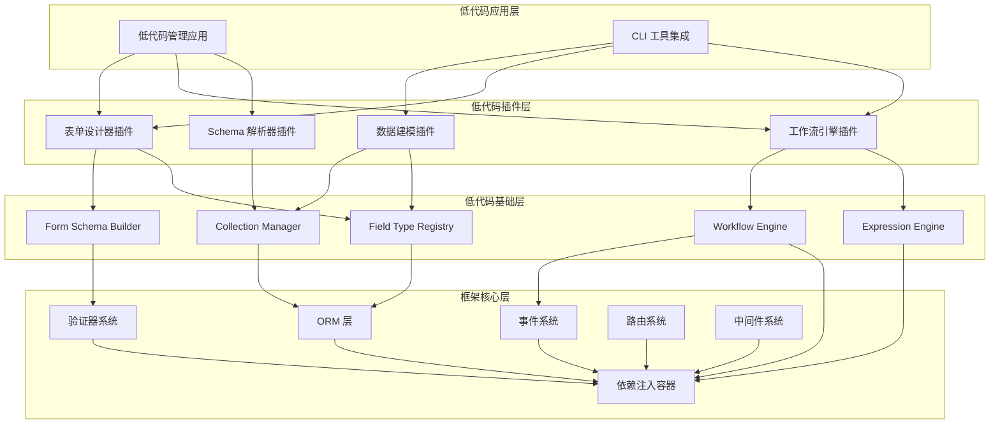
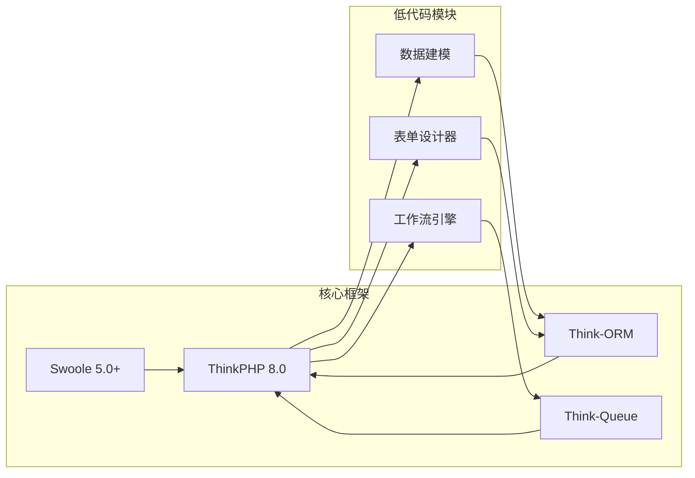

# AlkaidSYS 框架系统项目依赖文档

> **文档日期**：2025-01-20  
> **文档目标**：详细说明项目的所有依赖关系,为开发者提供完整的依赖安装指南  
> **文档版本**：v1.0

---

## 📋 目录

- [1. 后端依赖清单](#1-后端依赖清单)
- [2. 前端依赖清单](#2-前端依赖清单)
- [3. 模块间依赖关系](#3-模块间依赖关系)
- [4. 开发环境依赖](#4-开发环境依赖)
- [5. 依赖安装指南](#5-依赖安装指南)

---

## 1. 后端依赖清单

### 1.1 PHP 扩展依赖

| 扩展名称 | 最低版本 | 推荐版本 | 必需/可选 | 用途 |
|---------|---------|---------|----------|------|
| **php** | 8.2.0 | 8.2.x | ✅ 必需 | PHP 运行环境 |
| **swoole** | 5.0.0 | 5.1.x | ✅ 必需 | 协程引擎,高性能服务器 |
| **redis** | 5.3.0 | 6.0.x | ✅ 必需 | Redis 客户端 |
| **pdo** | - | - | ✅ 必需 | 数据库抽象层 |
| **pdo_mysql** | - | - | ✅ 必需 | MySQL 驱动 |
| **mbstring** | - | - | ✅ 必需 | 多字节字符串处理 |
| **json** | - | - | ✅ 必需 | JSON 处理 |
| **openssl** | - | - | ✅ 必需 | SSL/TLS 支持 |
| **curl** | - | - | ✅ 必需 | HTTP 客户端 |
| **fileinfo** | - | - | ✅ 必需 | 文件类型检测 |
| **gd** | - | - | ⚠️ 推荐 | 图像处理 |
| **imagick** | - | - | ⚪ 可选 | 高级图像处理 |
| **zip** | - | - | ⚠️ 推荐 | ZIP 压缩支持 |
| **bcmath** | - | - | ⚠️ 推荐 | 高精度数学运算 |
| **intl** | - | - | ⚠️ 推荐 | 国际化支持 |

**安装命令**（Ubuntu/Debian）：
```bash
# 安装 PHP 8.2
sudo apt-get install php8.2 php8.2-cli php8.2-fpm

# 安装必需扩展
sudo apt-get install php8.2-swoole php8.2-redis php8.2-mysql \
  php8.2-mbstring php8.2-json php8.2-curl php8.2-xml

# 安装推荐扩展
sudo apt-get install php8.2-gd php8.2-zip php8.2-bcmath php8.2-intl
```

**安装命令**（macOS）：
```bash
# 使用 Homebrew 安装 PHP 8.2
brew install php@8.2

# 安装 Swoole
pecl install swoole

# 安装 Redis
pecl install redis
```

### 1.2 Composer 包依赖

#### 核心框架依赖

```json
{
  "require": {
    "php": "^8.2",
    "topthink/framework": "^8.0",
    "topthink/think-orm": "^3.0",
    "topthink/think-queue": "^3.0",
    "topthink/think-swoole": "^6.0",
    "symfony/expression-language": "^6.0",
    "symfony/validator": "^6.0",
    "symfony/serializer": "^6.0",
    "symfony/console": "^6.0",
    "firebase/php-jwt": "^6.0",
    "php-casbin/php-casbin": "^3.0",
    "monolog/monolog": "^3.0",
    "vlucas/phpdotenv": "^5.5",
    "ramsey/uuid": "^4.7",
    "nesbot/carbon": "^2.72",
    "guzzlehttp/guzzle": "^7.8",
    "league/flysystem": "^3.0",
    "league/flysystem-aws-s3-v3": "^3.0",
    "league/flysystem-ftp": "^3.0",
    "predis/predis": "^2.2",
    "php-amqplib/php-amqplib": "^3.5"
  },
  "require-dev": {
    "phpunit/phpunit": "^10.5",
    "mockery/mockery": "^1.6",
    "phpstan/phpstan": "^1.10",
    "friendsofphp/php-cs-fixer": "^3.48",
    "phpmd/phpmd": "^2.15",
    "symfony/var-dumper": "^6.0",
    "fakerphp/faker": "^1.23"
  }
}
```

#### 依赖说明

| 包名称 | 版本 | 用途 | 必需/可选 |
|--------|------|------|----------|
| **topthink/framework** | ^8.0 | ThinkPHP 核心框架 | ✅ 必需 |
| **topthink/think-orm** | ^3.0 | ORM 数据库抽象层 | ✅ 必需 |
| **topthink/think-queue** | ^3.0 | 队列系统 | ✅ 必需 |
| **topthink/think-swoole** | ^6.0 | Swoole 集成 | ✅ 必需 |
| **symfony/expression-language** | ^6.0 | 表达式引擎 | ✅ 必需 |
| **symfony/validator** | ^6.0 | 数据验证 | ✅ 必需 |
| **symfony/serializer** | ^6.0 | 数据序列化 | ✅ 必需 |
| **symfony/console** | ^6.0 | CLI 命令行工具 | ✅ 必需 |
| **firebase/php-jwt** | ^6.0 | JWT 认证，Access/Refresh Token 处理 | ✅ 必需 |
| **php-casbin/php-casbin** | ^3.0 | RBAC/ABAC 权限控制引擎 | ✅ 必需 |
| **monolog/monolog** | ^3.0 | 日志系统 | ✅ 必需 |
| **vlucas/phpdotenv** | ^5.5 | 环境变量管理 | ✅ 必需 |
| **ramsey/uuid** | ^4.7 | UUID 生成 | ✅ 必需 |
| **nesbot/carbon** | ^2.72 | 日期时间处理 | ✅ 必需 |
| **guzzlehttp/guzzle** | ^7.8 | HTTP 客户端 | ✅ 必需 |
| **league/flysystem** | ^3.0 | 文件系统抽象层 | ✅ 必需 |
| **predis/predis** | ^2.2 | Redis 客户端 | ✅ 必需 |
| **php-amqplib/php-amqplib** | ^3.5 | RabbitMQ 客户端 | ✅ 必需 |
| **phpunit/phpunit** | ^10.5 | 单元测试框架 | ⚠️ 开发依赖 |
| **phpstan/phpstan** | ^1.10 | 静态分析工具 | ⚠️ 开发依赖 |
| **php-cs-fixer** | ^3.48 | 代码格式化工具 | ⚠️ 开发依赖 |

### 1.3 系统依赖

| 服务名称 | 最低版本 | 推荐版本 | 必需/可选 | 用途 |
|---------|---------|---------|----------|------|
| **MySQL** | 8.0.0 | 8.0.x | ✅ 必需 | 关系型数据库 |
| **Redis** | 6.0.0 | 7.2.x | ✅ 必需 | 缓存和队列 |
| **RabbitMQ** | 3.8.0 | 3.12.x | ✅ 必需 | 消息队列 |
| **Nginx** | 1.20.0 | 1.24.x | ⚠️ 推荐 | Web 服务器 |
| **Supervisor** | 4.0.0 | 4.2.x | ⚠️ 推荐 | 进程管理 |

### 1.4 版本兼容性说明

**PHP 版本兼容性**：
- ✅ **PHP 8.2.x**：完全支持,推荐使用
- ✅ **PHP 8.3.x**：完全支持,已测试
- ⚠️ **PHP 8.1.x**：部分支持,不推荐(缺少部分新特性)
- ❌ **PHP 8.0.x 及以下**：不支持

**ThinkPHP 版本兼容性**：
- ✅ **ThinkPHP 8.0.x**：完全支持,推荐使用
- ⚠️ **ThinkPHP 6.x**：不兼容(架构差异较大)

**Swoole 版本兼容性**：
- ✅ **Swoole 5.1.x**：完全支持,推荐使用
- ✅ **Swoole 5.0.x**：完全支持
- ⚠️ **Swoole 4.x**：不推荐(缺少部分新特性)

---

## 2. 前端依赖清单

### 2.1 npm 包依赖

#### 核心依赖

```json
{
  "dependencies": {
    "vue": "^3.4.0",
    "vue-router": "^4.2.0",
    "pinia": "^2.1.0",
    "ant-design-vue": "^4.1.0",
    "@ant-design/icons-vue": "^7.0.0",
    "axios": "^1.6.0",
    "dayjs": "^1.11.0",
    "@logicflow/core": "^1.2.0",
    "@logicflow/extension": "^1.2.0",
    "lodash-es": "^4.17.21",
    "nprogress": "^0.2.0",
    "mitt": "^3.0.0"
  },
  "devDependencies": {
    "typescript": "^5.3.0",
    "vite": "^5.0.0",
    "@vitejs/plugin-vue": "^5.0.0",
    "@vitejs/plugin-vue-jsx": "^3.1.0",
    "vue-tsc": "^1.8.0",
    "eslint": "^8.56.0",
    "eslint-plugin-vue": "^9.20.0",
    "@typescript-eslint/parser": "^6.19.0",
    "@typescript-eslint/eslint-plugin": "^6.19.0",
    "prettier": "^3.2.0",
    "eslint-config-prettier": "^9.1.0",
    "eslint-plugin-prettier": "^5.1.0",
    "vitest": "^1.2.0",
    "@vue/test-utils": "^2.4.0",
    "jsdom": "^24.0.0",
    "sass": "^1.70.0",
    "autoprefixer": "^10.4.0",
    "postcss": "^8.4.0",
    "tailwindcss": "^3.4.0"
  }
}
```

#### 依赖说明

| 包名称 | 版本 | 用途 | 必需/可选 |
|--------|------|------|----------|
| **vue** | ^3.4.0 | Vue 3 核心框架 | ✅ 必需 |
| **vue-router** | ^4.2.0 | Vue 路由 | ✅ 必需 |
| **pinia** | ^2.1.0 | 状态管理 | ✅ 必需 |
| **ant-design-vue** | ^4.1.0 | UI 组件库 | ✅ 必需 |
| **@ant-design/icons-vue** | ^7.0.0 | 图标库 | ✅ 必需 |
| **axios** | ^1.6.0 | HTTP 客户端 | ✅ 必需 |
| **dayjs** | ^1.11.0 | 日期时间处理 | ✅ 必需 |
| **@logicflow/core** | ^1.2.0 | 流程设计器核心 | ✅ 必需 |
| **@logicflow/extension** | ^1.2.0 | 流程设计器扩展 | ✅ 必需 |
| **lodash-es** | ^4.17.21 | 工具函数库 | ✅ 必需 |
| **typescript** | ^5.8.3 | TypeScript 编译器 | ⚠️ 开发依赖 |
| **vite** | ^7.1.2 | 构建工具 | ⚠️ 开发依赖 |
| **eslint** | ^9.19.0 | 代码检查工具 | ⚠️ 开发依赖 |
| **prettier** | ^3.4.2 | 代码格式化工具 | ⚠️ 开发依赖 |
| **vitest** | ^1.2.0 | 单元测试框架 | ⚠️ 开发依赖 |

### 2.2 开发工具依赖

| 工具名称 | 最低版本 | 推荐版本 | 必需/可选 | 用途 |
|---------|---------|---------|----------|------|
| **Node.js** | 18.0.0 | 20.x LTS | ✅ 必需 | JavaScript 运行环境 |
| **npm** | 9.0.0 | 10.x | ✅ 必需 | 包管理器 |
| **pnpm** | 8.0.0 | 8.x | ⚪ 可选 | 高效包管理器(推荐) |

### 2.3 版本兼容性说明

**Node.js 版本兼容性**：
- ✅ **Node.js 20.x LTS**：完全支持,推荐使用
- ✅ **Node.js 18.x LTS**：完全支持
- ⚠️ **Node.js 16.x**：部分支持,不推荐
- ❌ **Node.js 14.x 及以下**：不支持

**Vue 版本兼容性**：
- ✅ **Vue 3.4.x**：完全支持,推荐使用
- ✅ **Vue 3.3.x**：完全支持
- ⚠️ **Vue 3.2.x**：部分支持,不推荐
- ❌ **Vue 2.x**：不兼容

**Ant Design Vue 版本兼容性**：
- ✅ **Ant Design Vue 4.x**：完全支持,推荐使用
- ⚠️ **Ant Design Vue 3.x**：不兼容(API 差异较大)

---

## 3. 模块间依赖关系

### 3.1 低代码框架模块依赖关系



### 3.2 模块依赖关系说明

#### 依赖层级

| 层级 | 模块 | 依赖关系 |
|------|------|---------|
| **L4 - 应用层** | 低代码管理应用、CLI 工具 | 依赖插件层 |
| **L3 - 插件层** | 数据建模、表单设计器、工作流引擎、Schema 解析器 | 依赖基础层 |
| **L2 - 基础层** | Collection Manager、Field Type Registry、Form Schema Builder、Workflow Engine、Expression Engine | 依赖核心层 |
| **L1 - 核心层** | ORM、事件、容器、验证器、路由、中间件 | 无外部依赖 |

#### 关键依赖说明

**数据建模插件依赖**：
- ✅ Collection Manager(管理数据集合)
- ✅ Field Type Registry(管理字段类型)
- ✅ ORM 层(数据库操作)
- ✅ 依赖注入容器(服务注册)

**表单设计器插件依赖**：
- ✅ Form Schema Builder(表单 Schema 构建)
- ✅ Field Type Registry(字段类型注册)
- ✅ 验证器系统(表单验证)
- ✅ 依赖注入容器(服务注册)

**工作流引擎插件依赖**：
- ✅ Workflow Engine(工作流引擎核心)
- ✅ Expression Engine(表达式引擎)
- ✅ 事件系统(工作流事件)
- ✅ 依赖注入容器(服务注册)

**CLI 工具依赖**：
- ✅ 数据建模插件(生成模型)
- ✅ 表单设计器插件(生成表单)
- ✅ 工作流引擎插件(生成工作流)
- ✅ Symfony Console(命令行框架)

### 3.3 核心框架与低代码模块依赖关系



**依赖说明**：
- 低代码模块基于 ThinkPHP 8.0 框架构建
- 数据建模和表单设计器依赖 Think-ORM
- 工作流引擎依赖 Think-Queue 处理异步任务
- 所有模块都依赖 Swoole 提供高性能支持

---

## 4. 开发环境依赖

### 4.1 操作系统要求

| 操作系统 | 最低版本 | 推荐版本 | 支持状态 |
|---------|---------|---------|---------|
| **Ubuntu** | 20.04 LTS | 22.04 LTS | ✅ 完全支持 |
| **Debian** | 11 | 12 | ✅ 完全支持 |
| **CentOS** | 8 | Stream 9 | ✅ 完全支持 |
| **macOS** | 12.0 | 14.x | ✅ 完全支持 |
| **Windows** | 10 | 11 | ⚠️ 部分支持(需 WSL2) |

**推荐配置**：
- ✅ **Linux**：Ubuntu 22.04 LTS 或 Debian 12(生产环境推荐)
- ✅ **macOS**：macOS 14.x(开发环境推荐)
- ⚠️ **Windows**：Windows 11 + WSL2 + Ubuntu 22.04(开发环境可用)

### 4.2 开发工具要求

| 工具名称 | 最低版本 | 推荐版本 | 必需/可选 | 用途 |
|---------|---------|---------|----------|------|
| **Git** | 2.30.0 | 2.43.x | ✅ 必需 | 版本控制 |
| **Docker** | 20.10.0 | 24.x | ⚠️ 推荐 | 容器化部署 |
| **Docker Compose** | 2.0.0 | 2.24.x | ⚠️ 推荐 | 多容器编排 |
| **Composer** | 2.5.0 | 2.6.x | ✅ 必需 | PHP 包管理器 |
| **VS Code** | 1.80.0 | 1.85.x | ⚠️ 推荐 | 代码编辑器 |
| **PhpStorm** | 2023.1 | 2023.3 | ⚪ 可选 | PHP IDE |

**推荐 VS Code 扩展**：
- ✅ PHP Intelephense
- ✅ Volar(Vue 3 支持)
- ✅ ESLint
- ✅ Prettier
- ✅ GitLens
- ✅ Docker
- ✅ Thunder Client(API 测试)

### 4.3 最低硬件配置要求

#### 开发环境

| 配置项 | 最低要求 | 推荐配置 |
|--------|---------|---------|
| **CPU** | 4 核 | 8 核+ |
| **内存** | 8 GB | 16 GB+ |
| **硬盘** | 50 GB SSD | 256 GB SSD+ |
| **网络** | 10 Mbps | 100 Mbps+ |

#### 生产环境

| 配置项 | 最低要求 | 推荐配置 | 高性能配置 |
|--------|---------|---------|-----------|
| **CPU** | 8 核 | 16 核 | 32 核+ |
| **内存** | 16 GB | 32 GB | 64 GB+ |
| **硬盘** | 100 GB SSD | 500 GB SSD | 1 TB NVMe SSD+ |
| **网络** | 100 Mbps | 1 Gbps | 10 Gbps+ |

**性能估算**：
- **最低配置**：支持 100-500 并发用户
- **推荐配置**：支持 1000-5000 并发用户
- **高性能配置**：支持 10000+ 并发用户

---

## 5. 依赖安装指南

### 5.1 后端依赖安装步骤

#### 步骤 1: 安装 PHP 8.2 和扩展

**Ubuntu/Debian**：
```bash
# 添加 PHP 仓库
sudo add-apt-repository ppa:ondrej/php
sudo apt-get update

# 安装 PHP 8.2 和必需扩展
sudo apt-get install -y php8.2 php8.2-cli php8.2-fpm \
  php8.2-mysql php8.2-redis php8.2-mbstring php8.2-json \
  php8.2-curl php8.2-xml php8.2-zip php8.2-gd php8.2-bcmath

# 安装 Swoole
sudo pecl install swoole

# 启用 Swoole 扩展
echo "extension=swoole.so" | sudo tee /etc/php/8.2/mods-available/swoole.ini
sudo phpenmod swoole

# 验证安装
php -v
php -m | grep swoole
php -m | grep redis
```

**macOS**：
```bash
# 安装 PHP 8.2
brew install php@8.2

# 安装 Swoole
pecl install swoole

# 安装 Redis
pecl install redis

# 验证安装
php -v
php -m | grep swoole
php -m | grep redis
```

#### 步骤 2: 安装 Composer

```bash
# 下载 Composer
curl -sS https://getcomposer.org/installer | php

# 移动到全局路径
sudo mv composer.phar /usr/local/bin/composer

# 验证安装
composer --version

# 配置国内镜像(可选,提升下载速度)
composer config -g repo.packagist composer https://mirrors.aliyun.com/composer/
```

#### 步骤 3: 安装系统依赖

**安装 MySQL 8.0**：
```bash
# Ubuntu/Debian
sudo apt-get install -y mysql-server-8.0

# 启动 MySQL
sudo systemctl start mysql
sudo systemctl enable mysql

# 安全配置
sudo mysql_secure_installation

# 创建数据库和用户
mysql -u root -p
CREATE DATABASE alkaid_sys CHARACTER SET utf8mb4 COLLATE utf8mb4_unicode_ci;
CREATE USER 'alkaid'@'localhost' IDENTIFIED BY 'your_password';
GRANT ALL PRIVILEGES ON alkaid_sys.* TO 'alkaid'@'localhost';
FLUSH PRIVILEGES;
EXIT;
```

**安装 Redis 6.0+**：
```bash
# Ubuntu/Debian
sudo apt-get install -y redis-server

# 启动 Redis
sudo systemctl start redis-server
sudo systemctl enable redis-server

# 验证安装
redis-cli ping
```

**安装 RabbitMQ 3.x**：
```bash
# Ubuntu/Debian
sudo apt-get install -y rabbitmq-server

# 启动 RabbitMQ
sudo systemctl start rabbitmq-server
sudo systemctl enable rabbitmq-server

# 启用管理插件
sudo rabbitmq-plugins enable rabbitmq_management

# 创建用户
sudo rabbitmqctl add_user alkaid your_password
sudo rabbitmqctl set_user_tags alkaid administrator
sudo rabbitmqctl set_permissions -p / alkaid ".*" ".*" ".*"

# 访问管理界面: http://localhost:15672
```

#### 步骤 4: 安装项目依赖

```bash
# 克隆项目
git clone https://github.com/your-org/alkaid-sys.git
cd alkaid-sys

# 安装 Composer 依赖
composer install

# 复制环境配置文件
cp .env.example .env

# 编辑 .env 文件,配置数据库等信息
vim .env

# （可选）数据库迁移（需要安装 think-migration）
composer require topthink/think-migration --dev
php think migrate:run

# 启动 Swoole 服务器
php think swoole start
```

### 5.2 前端依赖安装步骤

#### 步骤 1: 安装 Node.js

**Ubuntu/Debian**：
```bash
# 使用 NodeSource 仓库安装 Node.js 20.x
curl -fsSL https://deb.nodesource.com/setup_20.x | sudo -E bash -
sudo apt-get install -y nodejs

# 验证安装
node -v
npm -v
```

**macOS**：
```bash
# 使用 Homebrew 安装 Node.js
brew install node@20

# 验证安装
node -v
npm -v
```

#### 步骤 2: 安装 pnpm(推荐)

```bash
# 安装 pnpm
npm install -g pnpm

# 验证安装
pnpm -v

# 配置国内镜像(可选)
pnpm config set registry https://registry.npmmirror.com
```

#### 步骤 3: 安装项目依赖

```bash
# 进入前端项目目录
cd alkaid-sys-frontend

# 安装依赖
pnpm install

# 复制环境配置文件
cp .env.example .env.local

# 编辑 .env.local 文件,配置 API 地址等信息
vim .env.local

# 启动开发服务器
pnpm dev

# 构建生产版本
pnpm build
```

### 5.3 Docker 快速安装(推荐)

#### 使用 Docker Compose 一键启动

```bash
# 克隆项目
git clone https://github.com/your-org/alkaid-sys.git
cd alkaid-sys

# 启动所有服务
docker-compose up -d

# 查看服务状态
docker-compose ps

# 查看日志
docker-compose logs -f

# 停止服务
docker-compose down
```

**docker-compose.yml 示例**：
```yaml
version: '3.8'

services:
  # MySQL 服务
  mysql:
    image: mysql:8.0
    container_name: alkaid-mysql
    environment:
      MYSQL_ROOT_PASSWORD: root
      MYSQL_DATABASE: alkaid_sys
      MYSQL_USER: alkaid
      MYSQL_PASSWORD: alkaid123
    ports:
      - "3306:3306"
    volumes:
      - mysql-data:/var/lib/mysql

  # Redis 服务
  redis:
    image: redis:7.2-alpine
    container_name: alkaid-redis
    ports:
      - "6379:6379"
    volumes:
      - redis-data:/data

  # RabbitMQ 服务
  rabbitmq:
    image: rabbitmq:3.12-management-alpine
    container_name: alkaid-rabbitmq
    environment:
      RABBITMQ_DEFAULT_USER: alkaid
      RABBITMQ_DEFAULT_PASS: alkaid123
    ports:
      - "5672:5672"
      - "15672:15672"
    volumes:
      - rabbitmq-data:/var/lib/rabbitmq

  # PHP 后端服务
  backend:
    build:
      context: ./backend
      dockerfile: Dockerfile
    container_name: alkaid-backend
    depends_on:
      - mysql
      - redis
      - rabbitmq
    ports:
      - "9501:9501"
    volumes:
      - ./backend:/var/www/html
    environment:
      DB_HOST: mysql
      REDIS_HOST: redis
      RABBITMQ_HOST: rabbitmq

  # 前端服务
  frontend:
    build:
      context: ./frontend
      dockerfile: Dockerfile
    container_name: alkaid-frontend
    ports:
      - "3000:3000"
    volumes:
      - ./frontend:/app
    environment:
      VITE_API_URL: http://localhost:9501

volumes:
  mysql-data:
  redis-data:
  rabbitmq-data:
```

### 5.4 常见问题和解决方案

#### 问题 1: Swoole 扩展安装失败

**错误信息**：
```
ERROR: `phpize' failed
```

**解决方案**：
```bash
# 安装 PHP 开发包
sudo apt-get install php8.2-dev

# 重新安装 Swoole
sudo pecl install swoole
```

#### 问题 2: Composer 下载速度慢

**解决方案**：
```bash
# 使用国内镜像
composer config -g repo.packagist composer https://mirrors.aliyun.com/composer/

# 或使用腾讯云镜像
composer config -g repo.packagist composer https://mirrors.cloud.tencent.com/composer/
```

#### 问题 3: npm/pnpm 安装依赖失败

**错误信息**：
```
ECONNREFUSED
```

**解决方案**：
```bash
# 使用国内镜像
npm config set registry https://registry.npmmirror.com

# 或使用 pnpm
pnpm config set registry https://registry.npmmirror.com

# 清除缓存后重试
pnpm store prune
pnpm install
```

#### 问题 4: MySQL 连接失败

**错误信息**：
```
SQLSTATE[HY000] [2002] Connection refused
```

**解决方案**：
```bash
# 检查 MySQL 服务状态
sudo systemctl status mysql

# 启动 MySQL 服务
sudo systemctl start mysql

# 检查端口是否监听
netstat -tlnp | grep 3306

# 检查防火墙规则
sudo ufw allow 3306
```

#### 问题 5: Swoole 服务启动失败

**错误信息**：
```
Address already in use
```

**解决方案**：
```bash
# 查找占用端口的进程
lsof -i :9501

# 杀死进程
kill -9 <PID>

# 重新启动服务
php think swoole start
```

---

## 📊 依赖版本锁定建议

### Composer 版本锁定

**composer.json**：
```json
{
  "require": {
    "php": "^8.2",
    "topthink/framework": "8.0.*",
    "topthink/think-orm": "3.0.*",
    "symfony/expression-language": "6.4.*"
  }
}
```

**说明**：
- 使用 `^` 符号：允许次版本和补丁版本更新(推荐)
- 使用 `~` 符号：只允许补丁版本更新
- 使用 `*` 符号：允许任意版本更新(不推荐)
- 使用精确版本：锁定到特定版本(生产环境推荐)

### npm 版本锁定

**package.json**：
```json
{
  "dependencies": {
    "vue": "^3.4.0",
    "ant-design-vue": "~4.1.0",
    "@logicflow/core": "1.2.26"
  }
}
```

**说明**：
- 使用 `^` 符号：允许次版本和补丁版本更新(推荐)
- 使用 `~` 符号：只允许补丁版本更新
- 使用精确版本：锁定到特定版本(生产环境推荐)

**使用 package-lock.json 或 pnpm-lock.yaml**：
- ✅ 始终提交锁文件到版本控制
- ✅ 确保团队成员使用相同的依赖版本
- ✅ 避免"在我机器上能运行"的问题

---

**文档结束**

**最后更新**：2025-01-20
**文档版本**：v1.0
**维护者**：AlkaidSYS 架构团队


