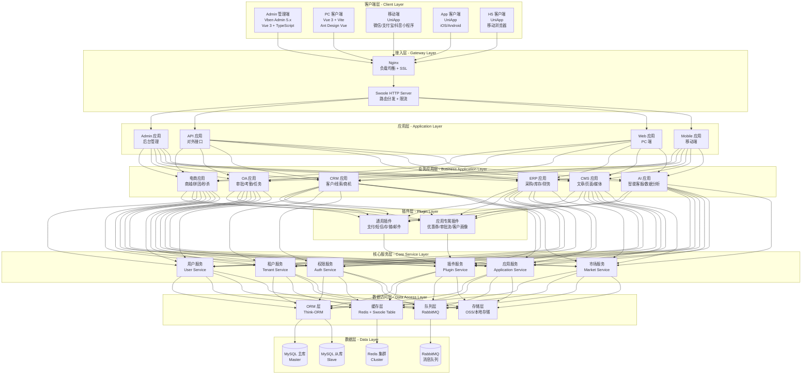
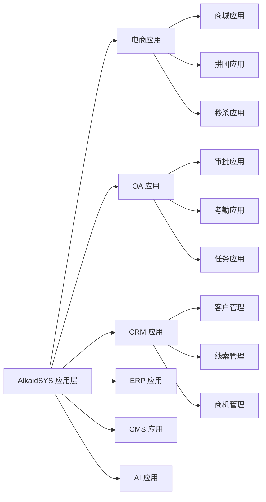
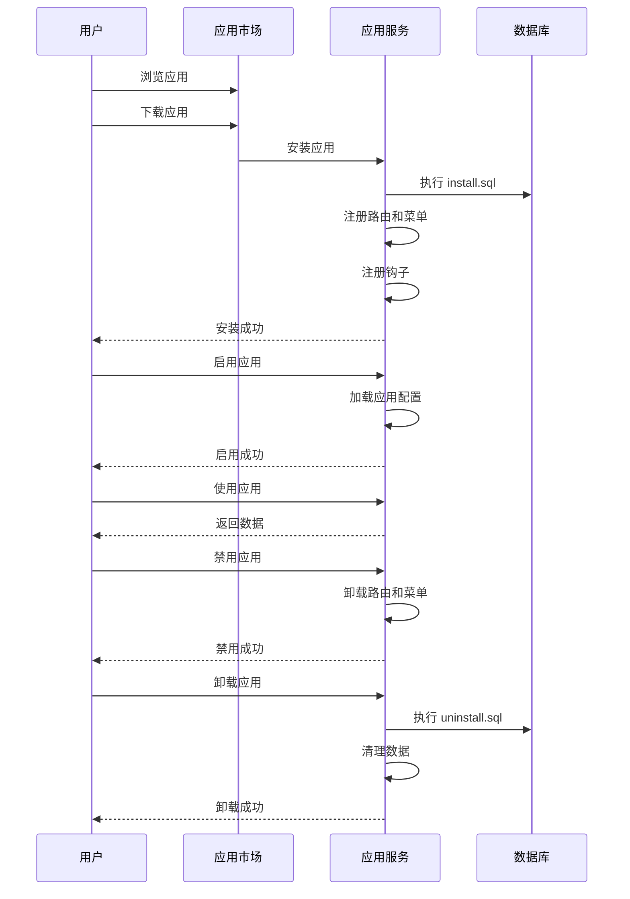
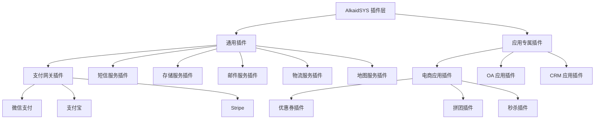
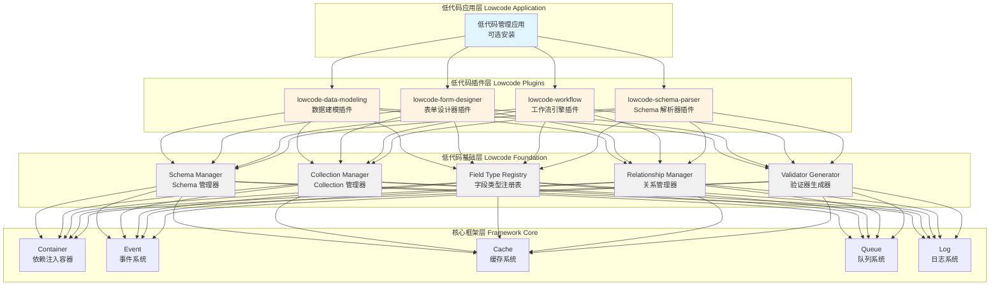
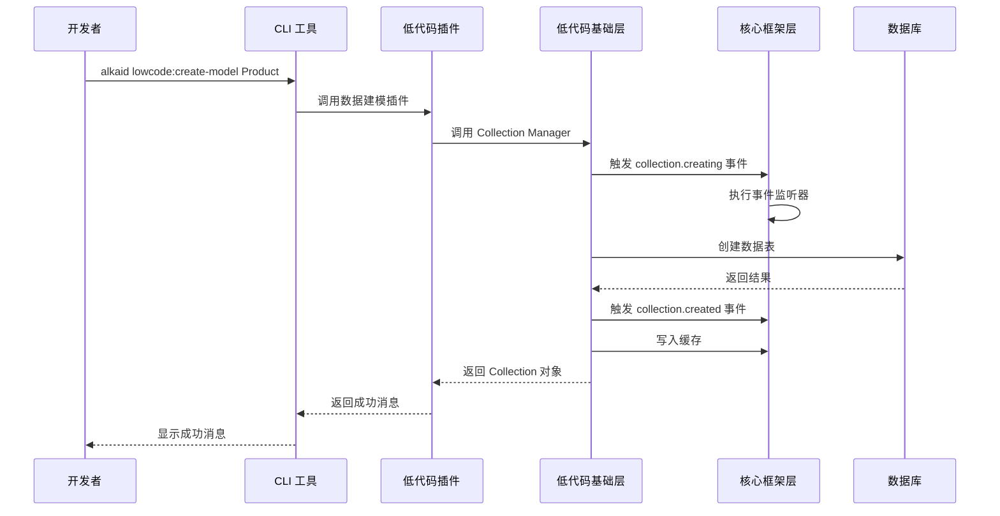
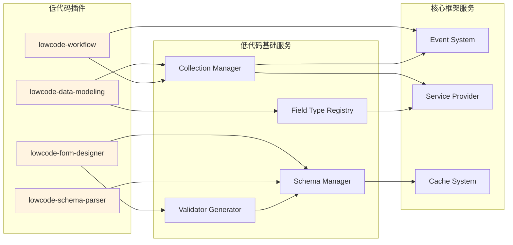
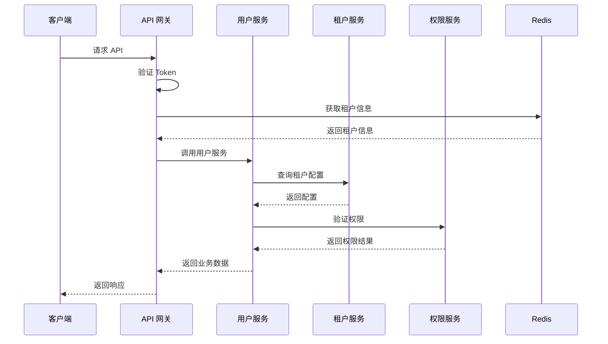
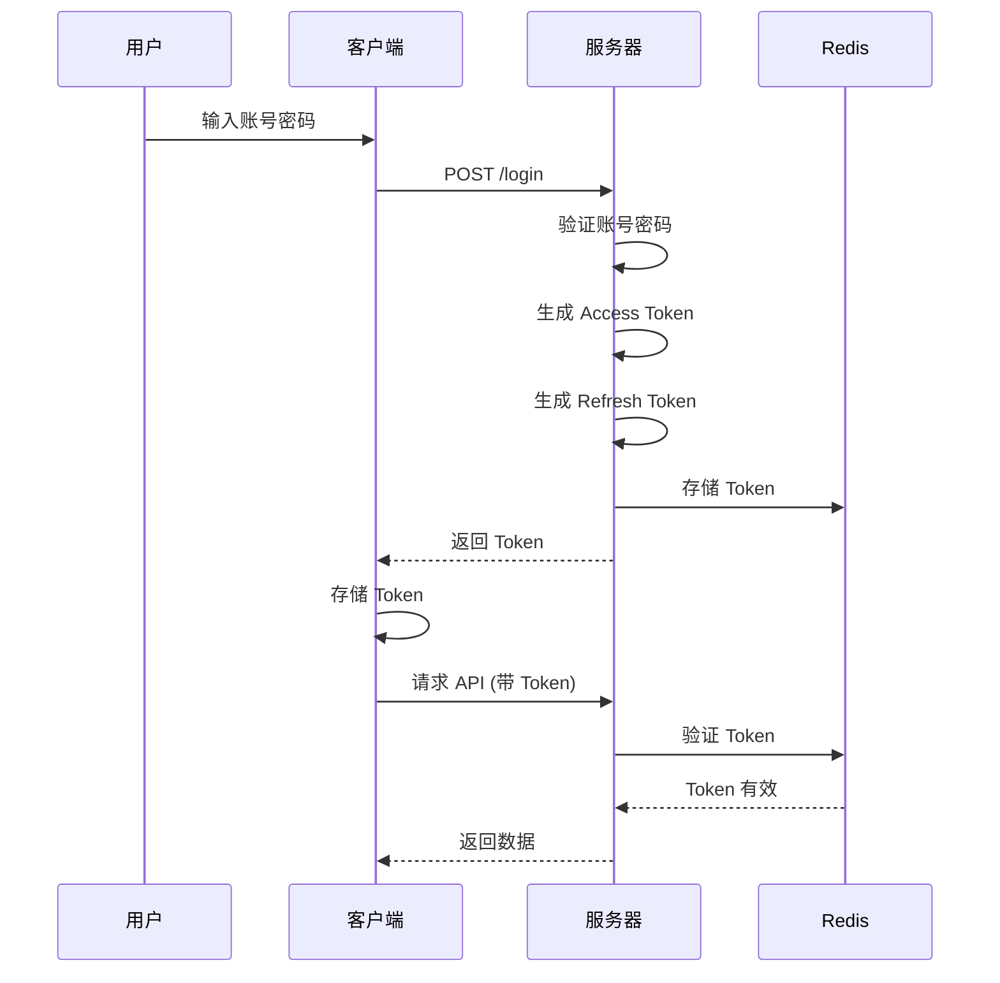

# AlkaidSYS 整体架构设计

## 📋 文档信息

| 项目 | 内容 |
|------|------|
| **文档名称** | AlkaidSYS 整体架构设计 |
| **文档版本** | v1.0 |
| **创建日期** | 2025-01-19 |
| **最后更新** | 2025-01-19 |
| **维护者** | AlkaidSYS 架构团队 |

## 🎯 架构设计目标

1. **高性能** - 支持 10K+ 并发，响应时间 <500ms
2. **高可用** - 99.9% 可用性保证
3. **可扩展** - 支持水平扩展和垂直扩展
4. **易维护** - 清晰的分层架构，易于理解和维护
5. **安全性** - 多租户数据隔离，完善的权限控制

## 🏗️ 整体架构图（包含应用层和插件层）



## 📊 架构分层设计

### 第 1 层：客户端层（Client Layer）

**职责**：
- 用户界面展示
- 用户交互处理
- 前端路由管理
- 前端状态管理

**技术栈**：

| 终端 | 框架 | UI 库 | 状态管理 |
|------|------|-------|---------|
| Admin | Vue 3 + Vben | Ant Design Vue | Pinia + AES 加密 |
| PC Web | Vue 3 + Vite | Ant Design Vue | Pinia |
| 移动端 | UniApp | uView UI | Vuex/Pinia |

### 第 2 层：接入层（Gateway Layer）

**职责**：
- 负载均衡
- SSL 终止
- 请求路由
- 限流控制
- 认证鉴权

**Nginx 配置示例**：

```nginx
# /etc/nginx/conf.d/alkaid.conf
upstream swoole_backend {
    server 127.0.0.1:9501 weight=1 max_fails=2 fail_timeout=30s;
    server 127.0.0.1:9502 weight=1 max_fails=2 fail_timeout=30s;
    server 127.0.0.1:9503 weight=1 max_fails=2 fail_timeout=30s;
    keepalive 64;
}

server {
    listen 80;
    listen 443 ssl http2;
    server_name alkaid.example.com;

    # SSL 配置
    ssl_certificate /path/to/cert.pem;
    ssl_certificate_key /path/to/key.pem;
    ssl_protocols TLSv1.2 TLSv1.3;

    # 日志配置
    access_log /var/log/nginx/alkaid_access.log;
    error_log /var/log/nginx/alkaid_error.log;

    # 静态资源
    location ~* \.(jpg|jpeg|png|gif|ico|css|js|woff|woff2|ttf)$ {
        root /var/www/alkaid/public;
        expires 30d;
        add_header Cache-Control "public, immutable";
    }

    # API 请求转发到 Swoole
    location / {
        proxy_pass http://swoole_backend;
        proxy_http_version 1.1;
        proxy_set_header Connection "";
        proxy_set_header Host $host;
        proxy_set_header X-Real-IP $remote_addr;
        proxy_set_header X-Forwarded-For $proxy_add_x_forwarded_for;
        proxy_set_header X-Forwarded-Proto $scheme;

        # 限流配置
        limit_req zone=api_limit burst=20 nodelay;
        limit_conn addr 10;
    }
}

# 限流配置
limit_req_zone $binary_remote_addr zone=api_limit:10m rate=100r/s;
limit_conn_zone $binary_remote_addr zone=addr:10m;
```

**Swoole HTTP Server 启动脚本**：

```php
<?php
// /app/server/HttpServer.php

namespace app\server;

use Swoole\Http\Server;
use Swoole\Http\Request;
use Swoole\Http\Response;
use think\App;

class HttpServer
{
    protected Server $server;
    protected App $app;

    public function __construct()
    {
        // 创建 Swoole HTTP Server
        $this->server = new Server('0.0.0.0', 9501);

        // 配置参数
        $this->server->set([
            'worker_num' => swoole_cpu_num() * 2,
            'max_request' => 10000,
            'max_conn' => 10000,
            'dispatch_mode' => 2,
            'open_tcp_nodelay' => true,
            'enable_coroutine' => true,
            'hook_flags' => SWOOLE_HOOK_ALL,

            // 日志配置
            'log_file' => runtime_path() . 'swoole.log',
            'log_level' => SWOOLE_LOG_INFO,

            // PID 文件
            'pid_file' => runtime_path() . 'swoole.pid',
        ]);

        // 注册事件回调
        $this->server->on('start', [$this, 'onStart']);
        $this->server->on('workerStart', [$this, 'onWorkerStart']);
        $this->server->on('request', [$this, 'onRequest']);
    }

    /**
     * Server 启动事件
     */
    public function onStart(Server $server): void
    {
        echo "Swoole HTTP Server started at http://0.0.0.0:9501\n";
        echo "Master PID: {$server->master_pid}\n";
        echo "Manager PID: {$server->manager_pid}\n";
    }

    /**
     * Worker 启动事件
     */
    public function onWorkerStart(Server $server, int $workerId): void
    {
        // 初始化 ThinkPHP 应用
        $this->app = new App();
        $this->app->initialize();

        echo "Worker #{$workerId} started\n";
    }

    /**
     * 请求处理事件
     */
    public function onRequest(Request $request, Response $response): void
    {
        try {
            // 设置请求上下文
            $this->app->bind('swoole.request', $request);
            $this->app->bind('swoole.response', $response);

            // 处理请求
            $thinkResponse = $this->app->http->run($request);

            // 发送响应
            $response->status($thinkResponse->getCode());
            foreach ($thinkResponse->getHeader() as $key => $val) {
                $response->header($key, $val);
            }
            $response->end($thinkResponse->getContent());

        } catch (\Throwable $e) {
            // 错误处理
            $response->status(500);
            $response->header('Content-Type', 'application/json');
            $response->end(json_encode([
                'code' => 500,
                'message' => $e->getMessage(),
                'data' => null,
            ]));
        }
    }

    /**
     * 启动服务器
     */
    public function start(): void
    {
        $this->server->start();
    }
}

// 启动服务器
$server = new HttpServer();
$server->start();
```

### 第 3 层：应用层（Application Layer）

**职责**：
- 路由管理
- 中间件处理
- 请求验证
- 响应格式化

**应用目录结构**：

```
app/
├── admin/              # Admin 管理端应用
│   ├── controller/     # 控制器
│   ├── middleware/     # 中间件
│   ├── route/          # 路由
│   └── validate/       # 验证器
├── api/                # API 应用
│   ├── controller/
│   ├── middleware/
│   ├── route/
│   └── validate/
├── web/                # Web 应用
│   ├── controller/
│   ├── middleware/
│   ├── route/
│   └── validate/
└── mobile/             # Mobile 应用
    ├── controller/
    ├── middleware/
    ├── route/
    └── validate/
```

**路由配置示例**：

```php
<?php
// /app/admin/route/app.php

use think\facade\Route;

// Admin 路由组
Route::group('admin', function () {
    // 登录路由（无需认证）
    Route::post('login', 'auth/login');
    Route::post('logout', 'auth/logout');

    // 需要认证的路由
    Route::group(function () {
        // 用户管理
        Route::resource('users', 'user');

        // 租户管理
        Route::resource('tenants', 'tenant');

        // 权限管理
        Route::resource('roles', 'role');
        Route::resource('permissions', 'permission');

        // 插件管理
        Route::get('plugins', 'plugin/index');
        Route::post('plugins/:name/install', 'plugin/install');
        Route::post('plugins/:name/enable', 'plugin/enable');
        Route::post('plugins/:name/disable', 'plugin/disable');
        Route::delete('plugins/:name', 'plugin/uninstall');

    })->middleware(['auth', 'permission']);

})->prefix('admin.')->middleware(['tenant', 'cors']);
```

### 第 3.5 层：应用层和插件层（Application & Plugin Layer）

**AlkaidSYS 创新性地在应用层和服务层之间增加了应用层和插件层**：

#### 应用层（Application Layer）

**职责**：
- 提供完整的业务功能模块
- 管理独立的数据库表
- 提供独立的路由和菜单
- 提供独立的前端界面
- 支持版本升级和配置管理

**应用分类**：



**应用目录结构**：

```
addons/applications/
├── ecommerce-shop/              # 电商商城应用
│   ├── manifest.json            # 应用元数据
│   ├── Application.php          # 应用主类
│   ├── controller/              # 控制器
│   ├── model/                   # 模型
│   ├── service/                 # 服务
│   ├── view/                    # 前端视图
│   ├── route/                   # 路由
│   ├── database/                # 数据库迁移
│   │   ├── install.sql          # 安装 SQL
│   │   ├── uninstall.sql        # 卸载 SQL
│   │   └── upgrade/             # 升级 SQL
│   └── config/                  # 配置文件
├── oa-approval/                 # OA 审批应用
└── crm-customer/                # CRM 客户管理应用
```

**应用生命周期**：



#### 插件层（Plugin Layer）

**职责**：
- 为应用或框架提供功能扩展
- 通过钩子机制与应用交互
- 支持热插拔和版本管理
- 支持依赖管理和优先级控制

**插件分类**：



**插件目录结构**：

```
addons/plugins/
├── universal/                   # 通用插件
│   ├── payment-wechat/          # 微信支付插件
│   │   ├── plugin.json          # 插件元数据
│   │   ├── Plugin.php           # 插件主类
│   │   ├── service/             # 服务
│   │   └── config/              # 配置文件
│   ├── sms-aliyun/              # 阿里云短信插件
│   └── storage-oss/             # 阿里云 OSS 插件
└── app-specific/                # 应用专属插件
    ├── ecommerce-coupon/        # 电商优惠券插件
    │   ├── plugin.json
    │   ├── Plugin.php
    │   └── service/
    ├── oa-approval-flow/        # OA 审批流插件
    └── crm-customer-portrait/   # CRM 客户画像插件
```

**插件钩子机制**：

AlkaidSYS 支持三种钩子类型：

1. **Action Hooks（动作钩子）** - 执行代码，无返回值
2. **Filter Hooks（过滤钩子）** - 修改数据，有返回值
3. **Event Hooks（事件钩子）** - 监听系统事件

```php
<?php
// 插件注册钩子
class Plugin extends BasePlugin
{
    protected function registerHooks(): void
    {
        // Action Hook - 订单创建后执行
        hook('OrderCreated', [$this, 'onOrderCreated'], 10);

        // Filter Hook - 修改订单金额
        hook('OrderAmount', [$this, 'filterOrderAmount'], 10);

        // Event Hook - 监听支付成功事件
        event('PaymentSuccess', [$this, 'onPaymentSuccess']);
    }

    // Action Hook 处理器
    public function onOrderCreated(array $order): void
    {
        // 订单创建后的处理逻辑
        Log::info('Order created: ' . $order['order_no']);
    }

    // Filter Hook 处理器
    public function filterOrderAmount(float $amount, array $order): float
    {
        // 应用优惠券折扣
        if ($order['coupon_id']) {
            $amount = $amount * 0.9; // 9 折
        }
        return $amount;
    }

    // Event Hook 处理器
    public function onPaymentSuccess(array $payment): void
    {
        // 支付成功后的处理逻辑
        Log::info('Payment success: ' . $payment['order_no']);
    }
}

// 应用触发钩子
class OrderService
{
    public function createOrder(array $data): array
    {
        // 创建订单
        $order = Order::create($data);

        // 触发 Action Hook
        do_action('OrderCreated', $order->toArray());

        // 触发 Filter Hook（修改订单金额）
        $order->amount = apply_filter('OrderAmount', $order->amount, $order->toArray());
        $order->save();

        return $order->toArray();
    }

    public function payOrder(int $orderId): bool
    {
        // 支付订单
        $payment = Payment::create(['order_id' => $orderId]);

        // 触发 Event Hook
        event('PaymentSuccess', $payment->toArray());

        return true;
    }
}
```

**钩子优先级**：

插件可以设置钩子优先级，数字越小优先级越高：

```php
// 优先级 10（先执行）
hook('OrderAmount', [$this, 'applyCoupon'], 10);

// 优先级 20（后执行）
hook('OrderAmount', [$this, 'applyMemberDiscount'], 20);
```

### 第 4 层：服务层（Service Layer）

**职责**：
- 业务逻辑处理
- 数据验证
- 事务管理
- 服务编排

**服务基类**：

```php
<?php
// /app/common/service/BaseService.php

namespace app\common\service;

use think\App;
use think\db\exception\DataNotFoundException;
use think\db\exception\DbException;
use think\db\exception\ModelNotFoundException;

abstract class BaseService
{
    protected App $app;
    protected int $tenantId;

    public function __construct(App $app)
    {
        $this->app = $app;
        $this->tenantId = $app->request->tenantId();
    }

    /**
     * 获取租户 ID
     */
    protected function getTenantId(): int
    {
        return $this->tenantId;
    }

    /**
     * 开始事务
     */
    protected function startTrans(): void
    {
        \think\facade\Db::startTrans();
    }

    /**
     * 提交事务
     */
    protected function commit(): void
    {
        \think\facade\Db::commit();
    }

    /**
     * 回滚事务
     */
    protected function rollback(): void
    {
        \think\facade\Db::rollback();
    }
}
```

**租户服务示例**：

```php
<?php
// /app/common/service/TenantService.php

namespace app\common\service;

use app\common\model\Tenant;
use think\db\exception\DataNotFoundException;
use think\db\exception\DbException;
use think\db\exception\ModelNotFoundException;

class TenantService extends BaseService
{
    /**
     * 创建租户
     */
    public function create(array $data): Tenant
    {
        $this->startTrans();
        try {
            // 创建租户
            $tenant = Tenant::create([
                'name' => $data['name'],
                'domain' => $data['domain'],
                'subdomain' => $data['subdomain'],
                'isolation_mode' => $data['isolation_mode'] ?? 'shared',
                'status' => 'active',
                'settings' => $data['settings'] ?? [],
            ]);

            // 如果是独立数据库模式，创建数据库
            if ($tenant->isolation_mode === 'database') {
                $this->createTenantDatabase($tenant);
            }

            // 初始化租户数据
            $this->initTenantData($tenant);

            $this->commit();
            return $tenant;

        } catch (\Exception $e) {
            $this->rollback();
            throw $e;
        }
    }

    /**
     * 创建租户数据库
     */
    protected function createTenantDatabase(Tenant $tenant): void
    {
        $dbName = 'alkaid_tenant_' . $tenant->id;

        // 创建数据库
        \think\facade\Db::execute("CREATE DATABASE IF NOT EXISTS `{$dbName}`
            CHARACTER SET utf8mb4 COLLATE utf8mb4_unicode_ci");

        // 更新租户数据库配置
        $tenant->db_name = $dbName;
        $tenant->db_host = config('database.connections.mysql.hostname');
        $tenant->db_user = config('database.connections.mysql.username');
        $tenant->db_pass = config('database.connections.mysql.password');
        $tenant->save();

        // 执行数据库迁移
        $this->runMigrations($dbName);
    }

    /**
     * 初始化租户数据
     */
    protected function initTenantData(Tenant $tenant): void
    {
        // 创建默认管理员
        // 创建默认角色和权限
        // 初始化系统配置
    }
}
```

### 第 5 层：数据访问层（Data Access Layer）

**职责**：
- ORM 操作
- 缓存管理
- 队列管理
- 文件存储

**模型基类：**

BaseModel 统一负责：
- 自动写入时间戳；
- 基于租户 ID 做数据隔离（全局查询作用域）；
- 在插入/更新/删除时校验当前请求上下文中的租户信息。

> 具体实现示例请参考《多租户架构设计》文档中的 `/app/common/model/BaseModel.php` 代码片段（该版本为统一的权威实现），本文件仅描述职责与约束，不再重复完整代码。

### 第 6 层：数据层（Data Layer）

**职责**：
- 数据持久化
- 数据备份
- 数据恢复

**MySQL 主从配置**：

```php
<?php
// /config/database.php

return [
    // 默认数据库连接
    'default' => env('database.driver', 'mysql'),

    // 数据库连接配置
    'connections' => [
        'mysql' => [
            // 数据库类型
            'type' => env('database.type', 'mysql'),
            // 服务器地址
            'hostname' => env('database.hostname', '127.0.0.1'),
            // 数据库名
            'database' => env('database.database', 'alkaid'),
            // 用户名
            'username' => env('database.username', 'root'),
            // 密码
            'password' => env('database.password', ''),
            // 端口
            'hostport' => env('database.hostport', '3306'),
            // 字符集
            'charset' => env('database.charset', 'utf8mb4'),
            // 数据库表前缀
            'prefix' => env('database.prefix', 'alk_'),

            // 主从配置
            'deploy' => 1,
            'rw_separate' => true,
            'master_num' => 1,
            'slave_no' => '',
            'fields_strict' => true,
            'break_reconnect' => true,

            // 从库配置
            'slave' => [
                [
                    'hostname' => env('database.slave1.hostname', '127.0.0.1'),
                    'hostport' => env('database.slave1.hostport', '3306'),
                ],
            ],
        ],
    ],
];
```

### 第 7 层：低代码层（Lowcode Layer）

**职责**：
- 提供低代码开发能力
- 数据建模和表单设计
- 工作流引擎
- Schema 驱动 UI

**低代码层架构图**：



**低代码层说明**：

AlkaidSYS 的低代码层采用**四层架构**，从下到上依次为：

1. **核心框架层（Framework Core）**：提供基础服务（容器、事件、缓存、队列、日志）
2. **低代码基础层（Lowcode Foundation）**：提供低代码核心服务（Schema Manager、Collection Manager、Field Type Registry、Relationship Manager、Validator Generator）
3. **低代码插件层（Lowcode Plugins）**：提供低代码功能插件（数据建模、表单设计器、工作流引擎、Schema 解析器）
4. **低代码应用层（Lowcode Application）**：提供可视化管理界面（可选安装）

**低代码与其他层的交互流程**：



**低代码插件依赖关系图**：



**低代码层核心类设计**：

```php
<?php
// /app/lowcode/foundation/SchemaManager.php

namespace app\lowcode\foundation;

use think\facade\Cache;

/**
 * Schema 管理器
 */
class SchemaManager
{
    /**
     * 获取 Schema
     */
    public function getSchema(string $name): ?array
    {
        // 从缓存获取
        $cacheKey = "lowcode:schema:{$name}";
        $schema = Cache::get($cacheKey);

        if ($schema === null) {
            // 从数据库加载
            $schema = $this->loadSchemaFromDatabase($name);

            if ($schema) {
                // 写入缓存
                Cache::set($cacheKey, $schema, 3600);
            }
        }

        return $schema;
    }

    /**
     * 保存 Schema
     */
    public function saveSchema(string $name, array $schema): void
    {
        // 保存到数据库
        $this->saveSchemaToDatabase($name, $schema);

        // 更新缓存
        $cacheKey = "lowcode:schema:{$name}";
        Cache::set($cacheKey, $schema, 3600);

        // 触发事件
        event('lowcode.schema.saved', ['name' => $name, 'schema' => $schema]);
    }
}
```

详细设计请参考：
- [框架底层架构优化分析](../09-lowcode-framework/40-lowcode-framework-architecture.md)
- [低代码能力概述](../09-lowcode-framework/41-lowcode-overview.md)
- [数据建模插件设计](../09-lowcode-framework/42-lowcode-data-modeling.md)
- [表单设计器插件设计](../09-lowcode-framework/43-lowcode-form-designer.md)
- [工作流引擎插件设计](../09-lowcode-framework/44-lowcode-workflow.md)

## 🔄 微服务架构设计

### 服务拆分原则

1. **按业务领域拆分** - 用户服务、租户服务、权限服务等
2. **按技术能力拆分** - 文件服务、消息服务、搜索服务等
3. **按访问频率拆分** - 高频服务独立部署

### 服务通信方式



## 📈 性能优化设计

### 1. 连接池设计

```php
<?php
// /app/common/pool/MySQLPool.php

namespace app\common\pool;

use Swoole\Coroutine\Channel;
use Swoole\Coroutine\MySQL;

class MySQLPool
{
    protected Channel $pool;
    protected array $config;
    protected int $size;

    public function __construct(array $config, int $size = 64)
    {
        $this->config = $config;
        $this->size = $size;
        $this->pool = new Channel($size);

        // 初始化连接池
        for ($i = 0; $i < $size; $i++) {
            $this->pool->push($this->createConnection());
        }
    }

    protected function createConnection(): MySQL
    {
        $mysql = new MySQL();
        $mysql->connect($this->config);
        return $mysql;
    }

    public function get(): MySQL
    {
        if ($this->pool->isEmpty()) {
            return $this->createConnection();
        }
        return $this->pool->pop();
    }

    public function put(MySQL $mysql): void
    {
        $this->pool->push($mysql);
    }
}
```

### 2. 缓存策略

- **L1 缓存** - Swoole Table（共享内存）
- **L2 缓存** - Redis（分布式缓存）
- **缓存更新** - 主动更新 + 被动失效


## 🛡️ 故障域与容错策略（补充）

> 目标：限制故障影响范围（故障域划分），通过熔断/降级/隔离舱/限流等手段提升可用性与稳定性。

### 1) 故障域划分建议
- 接入域：Nginx/网关（限流、熔断、灰度）
- 业务域：按服务/应用划分（用户/订单/支付等），跨域调用严格隔离
- 数据域：MySQL 主从、Redis 集群、消息队列独立域，避免级联故障
- 资源域：每类资源（DB、缓存、MQ、外部三方）单独连接池与重试策略

### 2) 熔断（Circuit Breaker）
```php
// 伪代码：基于失败率+半开探测的熔断
class CircuitBreaker {
  private int $failures = 0; private int $success = 0; private string $state = 'CLOSED'; private int $openedAt = 0;
  public function call(callable $fn, int $timeoutMs = 200) {
    if ($this->state === 'OPEN' && (time() - $this->openedAt) < 5) { throw new \RuntimeException('OPEN'); }
    try {
      $res = \Swoole\Coroutine\System::wait($fn, $timeoutMs);
      $this->onSuccess(); return $res;
    } catch (\Throwable $e) { $this->onFailure(); throw $e; }
  }
  private function onFailure(): void { $this->failures++; if ($this->failures >= 5) { $this->state='OPEN'; $this->openedAt=time(); } }
  private function onSuccess(): void { $this->success++; if ($this->state==='OPEN' && $this->success>=2) { $this->state='CLOSED'; $this->failures=0; $this->success=0; } }
}
```
- 推荐参数：失败阈值=5，半开探测=2 成功恢复，超时=200ms-500ms（依服务设定）

### 3) 降级（Fallback/Degrade）
```php
try {
  $detail = $breaker->call(fn() => $productService->getDetail($id));
} catch (\Throwable $e) {
  // 读取缓存/静态页/返回简版信息
  $detail = Cache::get("product:detail:$id") ?? ['id'=>$id,'name'=>'N/A','price'=>null,'status'=>'degraded'];
}
```
- 推荐策略：热点数据读缓存；非核心功能返回占位结果；延迟队列补偿

### 4) 隔离舱（Bulkhead）
```php
// 为外部依赖各自配置连接池与并发上限，避免相互拖垮
$mysqlPoolUsers = new MySQLPool($cfgUsers, size:32);
$mysqlPoolOrders = new MySQLPool($cfgOrders, size:32);
$redisPool = new RedisPool($cfgRedis, size:64);
// 网关层：per-route 并发/排队上限
# nginx: limit_req zone=api_limit burst=20 nodelay; limit_conn addr 10;
```
- 推荐参数：每域并发< CPU 核*2；外部依赖均设独立池与超时

### 5) 限流（Rate Limiting）
```nginx
# Nginx 令牌桶：100 r/s，突发 20
limit_req_zone $binary_remote_addr zone=api_limit:10m rate=100r/s;
server { location /api/ { limit_req zone=api_limit burst=20 nodelay; } }
```
```php
// 应用级滑动窗口计数
$key = sprintf('rl:%s', request()->ip());
$cnt = Redis::incr($key); Redis::expire($key, 1);
if ($cnt > 100) { return json(['code'=>429,'message'=>'Too Many Requests'],429); }
```
- 推荐参数：公共 API 100 r/s；管理 API 20 r/s；用户维度叠加细粒度限流

### 6) 重试与超时
- 外部调用统一超时：200-500ms；幂等操作允许指数退避重试（上限 2-3 次）
- 非幂等接口通过幂等键或去重表保障

### 7) 观测与告警
- 指标：熔断开启次数、失败率、P95/P99、限流命中数、降级比例
- 日志：记录故障域、调用链、原因分类（timeout/error/retry/open）
- 告警：阈值触发 + 自动降级开关（可通过配置中心调参）

## 🔐 安全架构设计

### 1. 认证流程



### 2. 权限控制

基于 **PHP-Casbin** 实现 RBAC 权限控制：

- **用户（User）** - 系统用户
- **角色（Role）** - 用户角色
- **权限（Permission）** - 操作权限
- **资源（Resource）** - 受保护的资源

## 📊 监控和日志

### 1. 日志分层

- **访问日志** - Nginx Access Log
- **应用日志** - ThinkPHP Log
- **错误日志** - Swoole Error Log
- **业务日志** - 自定义业务日志

### 2. 性能监控

- **QPS 监控** - 每秒查询数
- **响应时间** - P50/P95/P99
- **错误率** - 4xx/5xx 错误率
- **资源使用** - CPU/内存/磁盘

## 🆚 与 NIUCLOUD 架构对比

| 特性 | AlkaidSYS | NIUCLOUD | 优势 |
|------|-----------|----------|------|
| **Web 服务器** | Swoole HTTP Server | PHP-FPM + Nginx | ✅ 性能提升 10 倍 |
| **并发模型** | 协程 | 多进程 | ✅ 资源利用率更高 |
| **连接池** | 支持 | 不支持 | ✅ 减少连接开销 |
| **架构分层** | 6 层 | 3 层 | ✅ 更清晰 |
| **服务拆分** | 微服务 | 单体 | ✅ 更易扩展 |

---

**最后更新**: 2025-01-19
**文档版本**: v1.0
**维护者**: AlkaidSYS 架构团队

