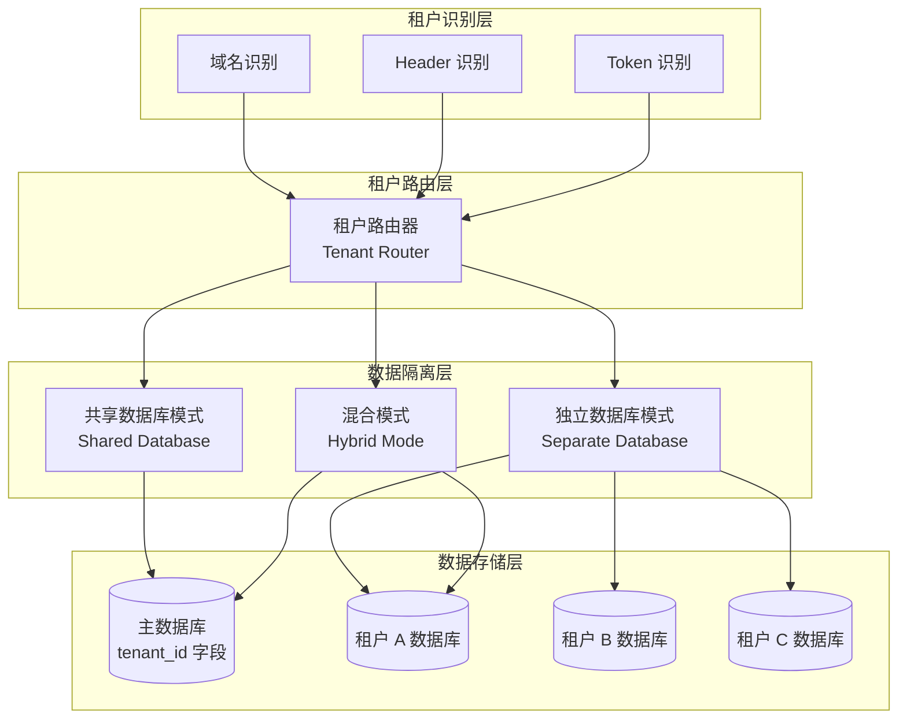
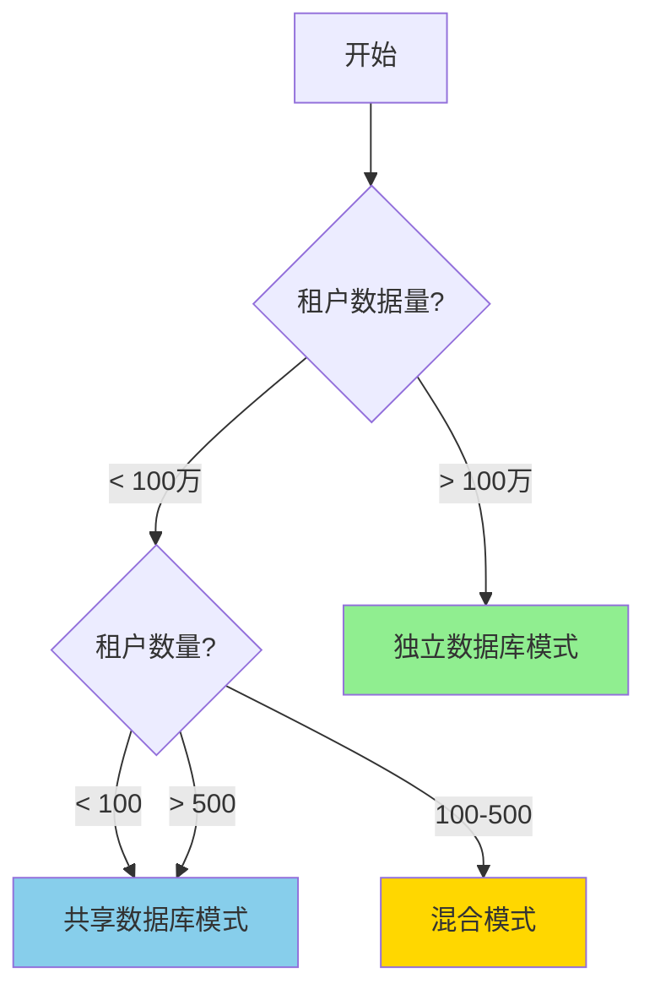

# AlkaidSYS 多租户架构设计

## 📋 文档信息

| 项目 | 内容 |
|------|------|
| **文档名称** | AlkaidSYS 多租户架构设计 |
| **文档版本** | v1.0 |
| **创建日期** | 2025-01-19 |
| **最后更新** | 2025-01-19 |
## 🔗 关联设计文档

- [术语表（Glossary）](../00-core-planning/99-GLOSSARY.md)
- [数据库设计](../03-data-layer/09-database-design.md)
- [数据库演进与迁移策略](../03-data-layer/11-database-evolution-and-migration-strategy.md)
- [安全架构设计](../04-security-performance/11-security-design.md)


## 🎯 多租户设计目标

1. **完全隔离** - 租户间数据、权限、资源完全隔离
2. **高性能** - 支持 1000+ 租户同时在线
3. **灵活性** - 支持不同级别的隔离策略
4. **可扩展** - 支持租户数量和数据量的水平扩展
5. **安全性** - 防止跨租户数据泄露

## 🏗️ 多租户架构图



## 📊 三种租户隔离模式

### 模式对比

| 特性 | 共享数据库 | 独立数据库 | 混合模式 |
|------|-----------|-----------|---------|
| **隔离级别** | 低 | 高 | 中-高 |
| **成本** | 低 | 高 | 中 |
| **性能** | 中 | 高 | 中-高 |
| **维护复杂度** | 低 | 高 | 中 |
| **扩展性** | 中 | 高 | 高 |
| **适用租户数** | 1000+ | 10-100 | 100-500 |
| **适用数据量** | <100万/租户 | 无限制 | <500万/租户 |
| **数据迁移** | 困难 | 容易 | 中等 |

### 模式选择决策树



## 🔧 模式 1：共享数据库模式

### 适用场景

- ✅ 中小型租户
- ✅ 数据量 < 100万条/租户
- ✅ 成本敏感型客户
- ✅ 租户数量 > 100

### 数据库设计

```sql
-- 租户表
CREATE TABLE `alkaid_tenants` (
    `id` BIGINT UNSIGNED AUTO_INCREMENT PRIMARY KEY COMMENT '租户ID',
    `name` VARCHAR(100) NOT NULL COMMENT '租户名称',
    `code` VARCHAR(50) UNIQUE NOT NULL COMMENT '租户代码',
    `domain` VARCHAR(100) UNIQUE COMMENT '独立域名',
    `subdomain` VARCHAR(50) UNIQUE COMMENT '子域名',
    `isolation_mode` ENUM('shared', 'database', 'hybrid') DEFAULT 'shared' COMMENT '隔离模式',
    `db_config` JSON COMMENT '数据库配置',
    `status` ENUM('active', 'suspended', 'deleted') DEFAULT 'active' COMMENT '状态',
    `settings` JSON COMMENT '租户配置',
    `quota` JSON COMMENT '资源配额',
    `expired_at` TIMESTAMP NULL COMMENT '过期时间',
    `created_at` TIMESTAMP DEFAULT CURRENT_TIMESTAMP,
    `updated_at` TIMESTAMP DEFAULT CURRENT_TIMESTAMP ON UPDATE CURRENT_TIMESTAMP,
    INDEX `idx_domain` (`domain`),
    INDEX `idx_subdomain` (`subdomain`),
    INDEX `idx_status` (`status`)
) ENGINE=InnoDB DEFAULT CHARSET=utf8mb4 COMMENT='租户表';

-- 用户表（带 tenant_id，满足分区要求：主键包含分区列）
CREATE TABLE `alkaid_users` (
    `id` BIGINT UNSIGNED AUTO_INCREMENT,
    `tenant_id` BIGINT UNSIGNED NOT NULL COMMENT '租户ID',
    `username` VARCHAR(50) NOT NULL,
    `email` VARCHAR(100) NOT NULL,
    `password` VARCHAR(255) NOT NULL,
    `status` TINYINT DEFAULT 1,
    `created_at` TIMESTAMP DEFAULT CURRENT_TIMESTAMP,
    `updated_at` TIMESTAMP DEFAULT CURRENT_TIMESTAMP ON UPDATE CURRENT_TIMESTAMP,
    PRIMARY KEY (`id`, `tenant_id`),
    INDEX `idx_tenant_id` (`tenant_id`, `id`),
    INDEX `idx_tenant_email` (`tenant_id`, `email`),
    UNIQUE KEY `uk_tenant_username` (`tenant_id`, `username`),
    FOREIGN KEY (`tenant_id`) REFERENCES `alkaid_tenants`(`id`) ON DELETE CASCADE
) ENGINE=InnoDB DEFAULT CHARSET=utf8mb4 COMMENT='用户表';

-- 订单表（带 tenant_id，满足分区要求：主键包含分区列）
CREATE TABLE `alkaid_orders` (
    `id` BIGINT UNSIGNED AUTO_INCREMENT,
    `tenant_id` BIGINT UNSIGNED NOT NULL COMMENT '租户ID',
    `user_id` BIGINT UNSIGNED NOT NULL,
    `order_no` VARCHAR(32) NOT NULL,
    `amount` DECIMAL(10,2) NOT NULL,
    `status` TINYINT DEFAULT 0,
    `created_at` TIMESTAMP DEFAULT CURRENT_TIMESTAMP,
    `updated_at` TIMESTAMP DEFAULT CURRENT_TIMESTAMP ON UPDATE CURRENT_TIMESTAMP,
    PRIMARY KEY (`id`, `tenant_id`),
    INDEX `idx_tenant_id` (`tenant_id`, `id`),
    INDEX `idx_tenant_user` (`tenant_id`, `user_id`),
    UNIQUE KEY `uk_tenant_order_no` (`tenant_id`, `order_no`),
    FOREIGN KEY (`tenant_id`) REFERENCES `alkaid_tenants`(`id`) ON DELETE CASCADE
) ENGINE=InnoDB DEFAULT CHARSET=utf8mb4 COMMENT='订单表';
```

### 模型实现

```php
<?php
// /app/common/model/BaseModel.php

namespace app\common\model;

use think\Model;
use think\model\concern\SoftDelete;

abstract class BaseModel extends Model
{
    use SoftDelete;

    // 自动时间戳
    protected $autoWriteTimestamp = true;

    // 软删除字段
    protected $deleteTime = 'deleted_at';

    // 租户字段
    protected string $tenantField = 'tenant_id';

    /**
     * 模型初始化
     */
    public static function init(): void
    {
        // 插入前自动添加租户 ID
        static::beforeInsert(function ($model) {
            if (!isset($model->{$model->tenantField})) {
                $tenantId = app('request')->tenantId();
                if ($tenantId > 0) {
                    $model->{$model->tenantField} = $tenantId;
                }
            }
        });

        // 更新前验证租户 ID
        static::beforeUpdate(function ($model) {
            $tenantId = app('request')->tenantId();
            if ($tenantId > 0 && $model->{$model->tenantField} != $tenantId) {
                throw new \Exception('无权修改其他租户数据');
            }
        });

        // 删除前验证租户 ID
        static::beforeDelete(function ($model) {
            $tenantId = app('request')->tenantId();
            if ($tenantId > 0 && $model->{$model->tenantField} != $tenantId) {
                throw new \Exception('无权删除其他租户数据');
            }
        });
    }

    /**
     * 全局查询作用域 - 租户隔离
     */
    public function scopeTenant($query)
    {
        $tenantId = app('request')->tenantId();
        if ($tenantId > 0) {
            $query->where($this->tenantField, $tenantId);
        }
        return $query;
    }

    /**
     * 忽略租户隔离（仅管理员使用）
     */
    public function scopeWithoutTenant($query)
    {
        return $query;
    }
}
```

```php
<?php
// /app/common/model/User.php

namespace app\common\model;

class User extends BaseModel
{
    protected $name = 'users';

    // 自动使用租户作用域
    protected $globalScope = ['tenant'];

    // 隐藏字段
    protected $hidden = ['password', 'deleted_at'];

    // 类型转换
    protected $type = [
        'status' => 'integer',
        'created_at' => 'datetime',
        'updated_at' => 'datetime',
    ];

## 🌐 多租户 / 多站点请求上下文契约（T0-MT-CONTEXT 冻结版）

> 本小节描述 AlkaidSYS-tp 在 T0 阶段冻结的「请求上下文」实现约定，
> 与以下实现保持一一对应：
> - `app/Request.php`
> - `app/middleware/TenantIdentify.php`
> - `app/middleware/SiteIdentify.php`
> - `app/middleware/Auth.php`
> - `app/model/BaseModel.php`
> - `infrastructure/Auth/JwtService.php`

### 1. 上下文字段定义

- `tenant_id`：租户 ID，用于数据隔离；
- `site_id`：站点 ID，用于同一租户下多站点区分；
- `user_id`：用户 ID，由认证中间件注入；
- `trace_id`：请求追踪 ID，由 Trace 中间件注入，用于日志与排错。

### 2. 上下文来源与优先级

#### 2.1 已认证请求（携带 JWT 且经过 Auth 中间件）

1. 客户端通过 `Authorization: Bearer <token>` 发送带有 `user_id/tenant_id/site_id` 的 JWT，生成逻辑见 `JwtService::generateAccessToken()`。
2. `Auth` 中间件成功验证后，将这些字段写入 `Request` 对象（`setUserId()/setTenantId()/setSiteId()`）。
3. 后续业务代码与模型**只通过** `request()->tenantId()/siteId()/userId()` 访问上下文，不自行解析 Token 或 Header。
4. 即使请求同时携带 `X-Tenant-ID` / `X-Site-ID` 头，最终有效值仍以 `Auth` 写入的值为准。

> 结论：认证场景下，**JWT 是唯一可信来源**，Header 仅在未登录场景下作为补充，不允许覆盖已认证用户的租户/站点。

#### 2.2 未认证请求或内部调用

1. 当未经过 `Auth` 中间件时，可以通过以下途径获取上下文：
   - `TenantIdentify`：从 `X-Tenant-ID` 读取租户 ID（默认 `1`）并调用 `setTenantId()`；
   - `SiteIdentify`：从 `X-Site-ID` 读取站点 ID（默认 `0`）并调用 `setSiteId()`。
2. 若既没有 JWT 也没有 Header，则 `Request::tenantId()/siteId()` 使用默认值（`tenant_id=1`，`site_id=0`）。
3. 默认值仅推荐在开发 / 单租户部署场景使用，生产环境应显式传入租户 / 站点。

### 3. 中间件职责与推荐执行顺序

- `Trace`：生成 `trace_id` 并注入 Request；
- `TenantIdentify`：在未认证场景下，从 Header 初始化 `tenant_id`；
- `SiteIdentify`：在未认证场景下，从 Header 初始化 `site_id`；
- `Auth`：验证 JWT，将 `user_id/tenant_id/site_id` 写入 Request；
- `Permission`：基于 `request()->userId()/tenantId()/siteId()` 做权限校验。

> 推荐全局执行顺序（在 T1-MW-ENABLE 阶段启用中间件时遵循）：
> `Trace` → `TenantIdentify` → `SiteIdentify` → `Auth` → 业务中间件（如 `Permission`）。

### 4. BaseModel 全局作用域行为

- `BaseModel::init()` 中注册了两个全局作用域：
  - `tenant`：若请求实现 `tenantId()` 且返回值大于 0，则为包含 `tenant_id` 列的模型自动追加 `where tenant_id = request()->tenantId()`；
  - `site`：若请求实现 `siteId()` 且返回值不为 `null`，则为包含 `site_id` 列的模型自动追加 `where site_id = request()->siteId()`。
- `BaseModel::withoutTenantScope(['tenant','site'])` 允许在少数内部场景下临时关闭作用域，用于管理端跨租户 / 跨站点查询。

### 5. 控制器使用示例

```php
// 在控制器或服务中获取当前上下文
$tenantId = request()->tenantId();
$siteId   = request()->siteId();
$userId   = request()->userId();

// 模型查询会自动带上 tenant_id / site_id 过滤（如果表中存在对应列）
$rows = SomeModel::select();
```

### 6. 安全注意事项

- 任何需要认证的接口必须经过 `Auth` 中间件，禁止仅依赖 `X-Tenant-ID` / `X-Site-ID` 头来识别用户租户。
- 业务代码不应绕过 `Request` / `BaseModel` 直接根据 Header 决定租户 / 站点。
- 使用 `withoutTenantScope()` 时必须在审计日志中记录实际的 `tenant_id/site_id` 与操作人信息。

    /**
     * 关联租户
     */
    public function tenant()
    {
        return $this->belongsTo(Tenant::class, 'tenant_id');
    }
}
```

### 使用示例

```php
<?php
// 查询当前租户的用户（自动添加 tenant_id 条件）
$users = User::select();
// SQL: SELECT * FROM alkaid_users WHERE tenant_id = 1

// 创建用户（自动添加 tenant_id）
$user = User::create([
    'username' => 'john',
    'email' => 'john@example.com',
    'password' => password_hash('123456', PASSWORD_DEFAULT),
]);
// SQL: INSERT INTO alkaid_users (tenant_id, username, email, password) VALUES (1, 'john', ...)

// 管理员查询所有租户的用户
$allUsers = User::withoutTenant()->select();
// SQL: SELECT * FROM alkaid_users
```

## 🔧 模式 2：独立数据库模式

### 适用场景

- ✅ 大型租户
- ✅ 数据量 > 100万条/租户
- ✅ 对性能和安全要求高
- ✅ 租户数量 < 100

### 数据库配置

```php
<?php
// /app/common/service/TenantDatabaseService.php

namespace app\common\service;

use app\common\model\Tenant;
use think\facade\Db;

class TenantDatabaseService
{
    /**
     * 创建租户数据库
     */
    public function createDatabase(Tenant $tenant): void
    {
        $dbName = 'alkaid_tenant_' . $tenant->id;

        // 1. 创建数据库
        Db::execute("CREATE DATABASE IF NOT EXISTS `{$dbName}`
            CHARACTER SET utf8mb4 COLLATE utf8mb4_unicode_ci");

        // 2. 创建数据库用户
        $dbUser = 'tenant_' . $tenant->id;
        $dbPass = $this->generatePassword();

        Db::execute("CREATE USER IF NOT EXISTS '{$dbUser}'@'%' IDENTIFIED BY '{$dbPass}'");
        Db::execute("GRANT ALL PRIVILEGES ON `{$dbName}`.* TO '{$dbUser}'@'%'");
        Db::execute("FLUSH PRIVILEGES");

        // 3. 更新租户数据库配置
        $tenant->db_config = [
            'hostname' => config('database.connections.mysql.hostname'),
            'database' => $dbName,
            'username' => $dbUser,
            'password' => $dbPass,
            'hostport' => config('database.connections.mysql.hostport'),
            'charset' => 'utf8mb4',
            'prefix' => 'alk_',
        ];
        $tenant->save();

        // 4. 执行数据库迁移
        $this->runMigrations($dbName);
    }

    /**
     * 获取租户数据库连接
     */
    public function getConnection(Tenant $tenant): \think\db\ConnectionInterface
    {
        $config = $tenant->db_config;

        return Db::connect([
            'type' => 'mysql',
            'hostname' => $config['hostname'],
            'database' => $config['database'],
            'username' => $config['username'],
            'password' => $config['password'],
            'hostport' => $config['hostport'],
            'charset' => $config['charset'],
            'prefix' => $config['prefix'],
        ]);
    }

    /**
     * 执行数据库迁移
     */
    protected function runMigrations(string $dbName): void
    {
        // 切换到租户数据库
        Db::execute("USE `{$dbName}`");

        // 执行迁移文件
        $migrations = glob(root_path() . 'database/migrations/*.php');
        foreach ($migrations as $migration) {
            require_once $migration;
            $class = basename($migration, '.php');
            if (class_exists($class)) {
                (new $class)->up();
            }
        }
    }

    /**
     * 生成随机密码
     */
    protected function generatePassword(int $length = 16): string
    {
        return bin2hex(random_bytes($length / 2));
    }
}
```

### 动态切换数据库

```php
<?php
// /app/common/middleware/TenantDatabase.php

namespace app\common\middleware;

use app\common\model\Tenant;
use app\common\service\TenantDatabaseService;
use Closure;

class TenantDatabase
{
    protected TenantDatabaseService $service;

    public function __construct(TenantDatabaseService $service)
    {
        $this->service = $service;
    }

    public function handle($request, Closure $next)
    {
        $tenantId = $request->tenantId();

        if ($tenantId > 0) {
            $tenant = Tenant::find($tenantId);

            if ($tenant && $tenant->isolation_mode === 'database') {
                // 切换到租户数据库
                $connection = $this->service->getConnection($tenant);
                app()->bind('db.connection', $connection);
            }
        }

        return $next($request);
    }
}
```

## 🔧 模式 3：混合模式

### 适用场景

- ✅ 灵活组合共享和独立模式
- ✅ 根据租户级别动态选择
- ✅ 支持租户升级/降级

### 实现策略

```php
<?php
// /app/common/service/TenantService.php

namespace app\common\service;

use app\common\model\Tenant;

class TenantService extends BaseService
{
    /**
     * 创建租户
     */
    public function create(array $data): Tenant
    {
        $this->startTrans();
        try {
            // 根据订阅计划选择隔离模式
            $isolationMode = $this->getIsolationMode($data['plan']);

            $tenant = Tenant::create([
                'name' => $data['name'],
                'code' => $data['code'],
                'domain' => $data['domain'] ?? null,
                'subdomain' => $data['subdomain'],
                'isolation_mode' => $isolationMode,
                'status' => 'active',
                'settings' => $data['settings'] ?? [],
                'quota' => $this->getQuota($data['plan']),
            ]);

            // 如果是独立数据库模式，创建数据库
            if ($isolationMode === 'database') {
                app(TenantDatabaseService::class)->createDatabase($tenant);
            }

            // 初始化租户数据
            $this->initTenantData($tenant);

            $this->commit();
            return $tenant;

        } catch (\Exception $e) {
            $this->rollback();
            throw $e;
        }
    }

    /**
     * 根据订阅计划获取隔离模式
     */
    protected function getIsolationMode(string $plan): string
    {
        return match($plan) {
            'free', 'basic' => 'shared',
            'pro', 'business' => 'hybrid',
            'enterprise' => 'database',
            default => 'shared',
        };
    }

    /**
     * 获取资源配额
     */
    protected function getQuota(string $plan): array
    {
        return match($plan) {
            'free' => [
                'users' => 10,
                'storage' => 1024 * 1024 * 100, // 100MB
                'api_calls' => 1000,
            ],
            'basic' => [
                'users' => 50,
                'storage' => 1024 * 1024 * 1024, // 1GB
                'api_calls' => 10000,
            ],
            'pro' => [
                'users' => 200,
                'storage' => 1024 * 1024 * 1024 * 10, // 10GB
                'api_calls' => 100000,
            ],
            'enterprise' => [
                'users' => -1, // 无限制
                'storage' => -1,
                'api_calls' => -1,
            ],
            default => [],
        };
    }
}
```

## 🔍 租户识别机制

### 1. 域名识别

```php
<?php
// /app/common/middleware/TenantIdentify.php

namespace app\common\middleware;

use app\common\model\Tenant;
use Closure;

class TenantIdentify
{
    public function handle($request, Closure $next)
    {
        $tenantId = 0;

        // 1. 通过独立域名识别
        $host = $request->host();
        $tenant = Tenant::where('domain', $host)->find();

        if ($tenant) {
            $tenantId = $tenant->id;
        } else {
            // 2. 通过子域名识别
            $subdomain = $this->getSubdomain($host);
            if ($subdomain) {
                $tenant = Tenant::where('subdomain', $subdomain)->find();
                if ($tenant) {
                    $tenantId = $tenant->id;
                }
            }
        }

        // 3. 通过 Header 识别（API 调用）
        if ($tenantId === 0) {
            $tenantCode = $request->header('X-Tenant-Code');
            if ($tenantCode) {
                $tenant = Tenant::where('code', $tenantCode)->find();
                if ($tenant) {
                    $tenantId = $tenant->id;
                }
            }
        }

        // 4. 通过 Token 识别
        if ($tenantId === 0) {
            $token = $request->header('Authorization');
            if ($token) {
                $tenantId = $this->getTenantIdFromToken($token);
            }
        }

        // 设置租户 ID
        $request->tenantId($tenantId);

        // 验证租户状态
        if ($tenantId > 0 && $tenant) {
            if ($tenant->status !== 'active') {
                return json(['code' => 403, 'message' => '租户已被禁用']);
            }

            if ($tenant->expired_at && $tenant->expired_at < time()) {
                return json(['code' => 403, 'message' => '租户已过期']);
            }
        }

        return $next($request);
    }

    /**
     * 获取子域名
     */
    protected function getSubdomain(string $host): ?string
    {
        $parts = explode('.', $host);
        if (count($parts) >= 3) {
            return $parts[0];
        }
        return null;
    }

    /**
     * 从 Token 中获取租户 ID
     */
    protected function getTenantIdFromToken(string $token): int
    {
        // 解析 JWT Token
        // ...
        return 0;
    }
}
```

### 2. Request 扩展

```php
<?php
// /app/Request.php

namespace app;

use think\Request as BaseRequest;

/**
 * 应用全局 Request 扩展
 *
 * 注意：在 Swoole 协程环境下，禁止使用 static 属性保存租户/站点信息，
 * 必须使用实例属性，确保每个请求上下文互不干扰。
 */
class Request extends BaseRequest
{
    protected int $tenantId = 0;
    protected int $siteId   = 0;
    protected ?int $userId  = null;

    /**
     * 设置/获取租户 ID
     */
    public function tenantId(?int $tenantId = null): int

## 🧩 多租户/多站点上下文协议（AlkaidSYS-tp 实现规范）

> 本小节从“请求 → 中间件 → Request 扩展 → 模型”的链路出发，固化 `tenant_id` / `site_id` / `user_id` 在 AlkaidSYS-tp 中的传递与使用方式，作为后续所有多租户实现的唯一依据。

### 1. 字段定义（Field definitions）

- `tenant_id` BIGINT UNSIGNED
  - 语义：租户 ID，> 0 表示有效租户；
  - 用途：所有需要按租户隔离的数据表必须包含该字段，详见《多租户 / 多站点数据建模规范》。
- `site_id` BIGINT UNSIGNED
  - 语义：站点 ID，>= 0；`0` 表示“无站点 / 默认站点”，> 0 表示具体站点；
  - 用途：在同一租户下进一步按站点维度隔离数据。
- `user_id` BIGINT UNSIGNED
  - 语义：用户 ID，> 0 表示已登录用户；
  - 用途：认证与权限判断、审计日志等。

> 说明：数据层字段命名与类型以 `design/03-data-layer/12-multi-tenant-data-model-spec.md` 为准，本节聚焦“如何将这些字段安全地传递到请求与模型”。

### 2. 上下文来源与优先级（Context sources & priority）

AlkaidSYS-tp 中多租户上下文的唯一权威来源是 **HTTP 请求 + 中间件链**：

1. **认证场景（有 Auth 中间件）**
   - `Authorization: Bearer <JWT>` 作为入口；
   - `Auth` 中间件验证 Token 后，从 JWT 载荷中读取 `user_id`、`tenant_id`、`site_id`，并写入 `app\Request`：
     - `$request->setUserId((int)$payload['user_id']);`
     - `$request->setTenantId((int)$payload['tenant_id']);`
     - `$request->setSiteId((int)$payload['site_id']);`
   - 此时：
     - `request()->userId()`、`request()->tenantId()`、`request()->siteId()` 都以 **JWT 中的值为准**；
     - Header 中的 `X-Tenant-ID` / `X-Site-ID` 不得覆盖已认证用户的上下文，仅可用于未认证场景或日志。

2. **未认证场景（无 Auth，或接口本身不需要登录）**
   - 由多租户识别中间件从 Header 中解析：
     - `TenantIdentify`：读取 `X-Tenant-ID`，默认值 `1`（仅开发 / 单租户环境使用），写入 `$request->setTenantId($tenantId)`；
     - `SiteIdentify`：读取 `X-Site-ID`，默认值 `0`，写入 `$request->setSiteId($siteId)`；
   - 若上述中间件未启用（如早期阶段或 CLI 脚本），`app\Request` 仍提供退化行为：
     - `tenantId()` 会直接从 `X-Tenant-ID` 读取，若无则退回默认值 `1`；
     - `siteId()` 会从 `X-Site-ID` 读取，若无则退回默认值 `0`。

3. **Request 内部优先级（统一约定）**

所有与上下文相关的 `Request` 方法都遵循同一优先级规则：

1. 已显式设置的属性（通常由中间件写入）；
2. 对应的 HTTP Header（如 `X-Tenant-ID` / `X-Site-ID`）；
3. 传入的默认值参数（dev/single-tenant/single-site 时可用）。

### 3. 中间件职责与执行顺序（Middleware responsibilities & order）

推荐的全局中间件执行顺序（T1 阶段启用后生效）：

1. `Trace`：生成并注入 `trace_id`，用于链路追踪；
2. `TenantIdentify`：识别当前租户并写入 `Request`；
3. `SiteIdentify`：在租户上下文内识别站点并写入 `Request`；
4. `Auth`：验证 JWT，设置最终的 `user_id` / `tenant_id` / `site_id`；
5. `Permission`：基于用户与多租户上下文进行权限判断。

> 说明：当前代码中 `TenantIdentify` / `SiteIdentify` 在 `app/middleware.php` 中暂时注释掉，仅 `Trace` 与 `Auth`/`Permission` 实际生效。T1-MW-ENABLE 任务会按本节约定重新启用并调整顺序。

各中间件的职责边界如下：

- `TenantIdentify`
  - 负责在“未认证场景”下识别租户：优先从 Header `X-Tenant-ID` 读取，必要时可扩展为域名识别；
  - 将解析结果写入 `$request->setTenantId($tenantId)`；
  - 不做复杂权限校验（租户是否存在、是否可用等交由后续阶段实现）。
- `SiteIdentify`
  - 在已识别的租户上下文内，读取 `X-Site-ID` 并写入 `$request->setSiteId($siteId)`；
  - 后续阶段可补充“站点是否属于当前租户”的校验逻辑。
- `Auth`
  - 作为 **唯一的 JWT 解析入口**：验证 Token、检查过期与撤销状态；
  - 校验通过后，将 JWT 载荷中的 `user_id` / `tenant_id` / `site_id` 写入 Request，覆盖之前由 Header 推断的值；
  - 校验失败时返回统一的 401 响应（见《安全架构设计》文档）。

### 4. Request 类接口语义（Request interface semantics）

`app\Request` 中与多租户上下文相关的核心方法约定如下：

- `tenantId(?int $default = 1): int`
  - 优先返回已通过中间件设置的租户 ID；
  - 若尚未设置，则尝试从 Header `X-Tenant-ID` 读取，> 0 则认为有效；
  - 否则使用 `$default ?? 1`，默认值 `1` 仅用于开发 / 单租户部署，不建议在正式多租户环境依赖；
  - 该方法不直接解析 JWT，JWT 解析由 `Auth` 中间件完成。

- `siteId(?int $default = 0): int`
  - 优先返回已通过中间件设置的站点 ID；
  - 若尚未设置，则尝试从 Header `X-Site-ID` 读取，>= 0 则认为有效（`0` 表示“默认站点 / 无站点”）；
  - 否则使用 `$default ?? 0` 作为站点 ID。

- `userId(): ?int`
  - 优先返回已通过 `Auth` 中间件设置的用户 ID；
  - 若尚未设置，则返回 `null`，不会在该方法内部再次解析 JWT；
  - 任何需要“是否已登录”判断的逻辑应通过 `isAuthenticated()` 或直接判断 `userId() !== null`。

- `getTenantContext(): array`
  - 返回当前请求的多租户上下文快照：
    - `['tenant_id' => tenantId(), 'site_id' => siteId(), 'user_id' => userId()]`；
  - 用于日志、中间件调试或跨层传递上下文信息。

### 5. BaseModel 全局作用域行为（Global scopes）

所有继承自 `app\model\BaseModel` 的模型自动启用以下全局作用域：

- `tenant` 作用域：
  - 通过 `request()->tenantId()` 获取当前租户 ID；
  - 当模型包含 `tenant_id` 字段且 `tenantId()` 返回 truthy 值时，自动追加 `where tenant_id = ?` 条件；
- `site` 作用域：
  - 通过 `request()->siteId()` 获取当前站点 ID；
  - 当模型包含 `site_id` 字段且 `siteId()` 不为 `null` 时，自动追加 `where site_id = ?` 条件；
- 提供 `BaseModel::withoutTenantScope(['tenant', 'site'])` 方法在极少数需要跨租户/站点查询的场景下显式关闭这些作用域。

> 关键约束：**任何业务代码不得绕过 Request 与 BaseModel 自行解析 Header 或 JWT 来决定 `tenant_id` / `site_id`**，否则会破坏统一的隔离策略。

### 6. 安全注意事项（Security considerations）

1. 一旦 `Auth` 中间件验证通过，后续所有数据访问必须以 JWT 中的 `tenant_id` / `site_id` 为准，Header 仅作为辅助信息；
2. 任何绕过 `BaseModel` 全局作用域、直接操作底层查询构造器的代码，都需要进行额外的安全评审（确保显式指定租户与站点条件）；
3. CLI 脚本或队列任务在需要访问多租户数据时，应显式构造 `Request` 上下文（或使用框架提供的模拟请求能力），避免依赖默认租户/站点；
4. 后续 T1/T2 阶段将补充“租户是否存在 / 站点是否属于租户”等校验逻辑，但本节冻结的“上下文来源与优先级”规则不再做破坏性调整。

    /**
     * 设置/获取站点 ID
     */
    public function siteId(?int $siteId = null): int
    {
        if ($siteId !== null) {
            $this->siteId = $siteId;
        }
        return $this->siteId;
    }

    /**
     * 设置/获取用户 ID
     */
    public function userId(?int $userId = null): ?int
    {
        if ($userId !== null) {
            $this->userId = $userId;
        }
        return $this->userId;
    }
}
```

## 📊 性能优化

### 1. 租户信息缓存

```php
<?php
// 使用 Redis 缓存租户信息
$cacheKey = 'tenant:' . $tenantId;
$tenant = cache($cacheKey);

if (!$tenant) {
    $tenant = Tenant::find($tenantId);
    cache($cacheKey, $tenant, 3600);
}
```

### 2. 数据库分区

```sql
-- 按租户 ID 分区（注意：MySQL 要求所有唯一索引/主键必须包含分区列 tenant_id）
-- 请确保表的主键定义为 PRIMARY KEY (id, tenant_id) 或包含 tenant_id
ALTER TABLE alkaid_users
    PARTITION BY HASH(tenant_id) PARTITIONS 16;
```

## 🆚 与 NIUCLOUD 多租户对比

| 特性 | AlkaidSYS | NIUCLOUD | 优势 |
|------|-----------|----------|------|
| **隔离模式** | 3 种 | 1 种 | ✅ 更灵活 |
| **租户识别** | 4 种方式 | 2 种方式 | ✅ 更全面 |
| **数据库切换** | 动态切换 | 不支持 | ✅ 更强大 |
| **资源配额** | 支持 | 不支持 | ✅ 更完善 |
| **租户升级** | 支持 | 不支持 | ✅ 更灵活 |

---

**最后更新**: 2025-01-19
**文档版本**: v1.0
**维护者**: AlkaidSYS 架构团队

