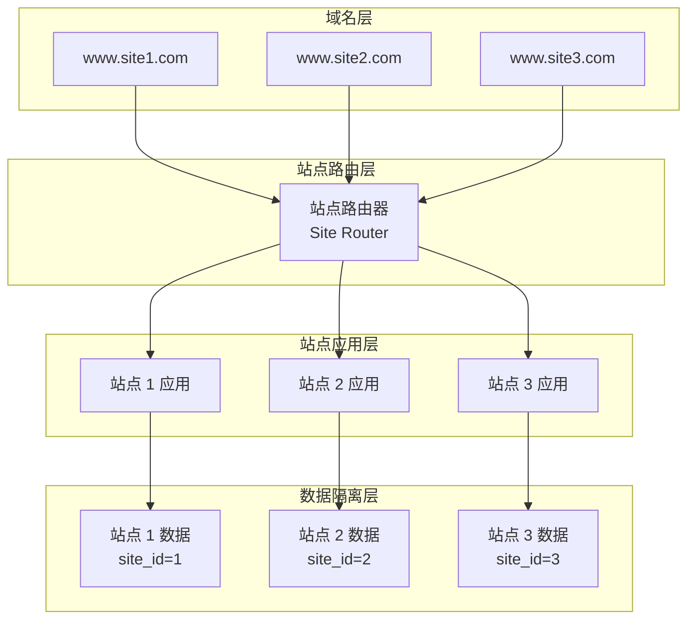
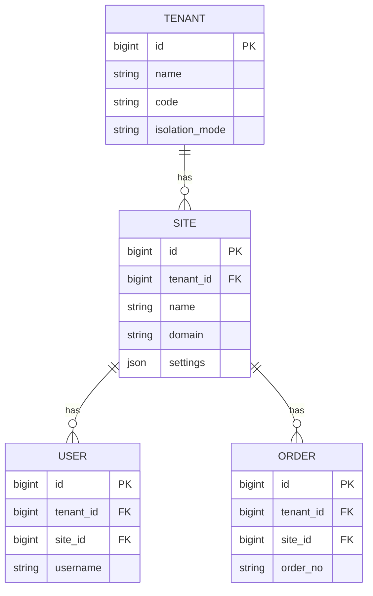

# AlkaidSYS 多站点架构设计

## 📋 文档信息

| 项目 | 内容 |
|------|------|
| **文档名称** | AlkaidSYS 多站点架构设计 |
| **文档版本** | v1.0 |
| **创建日期** | 2025-01-19 |

## 🎯 多站点设计目标

1. **独立性** - 每个站点独立域名、独立配置
2. **隔离性** - 站点间数据完全隔离
3. **灵活性** - 支持站点动态创建和管理
4. **可扩展** - 支持站点数量水平扩展

## 🏗️ 多站点架构图



## 📊 站点与租户的关系

### 关系模型



### 数据库设计

```sql
-- 站点表
CREATE TABLE `alkaid_sites` (
    `id` BIGINT UNSIGNED AUTO_INCREMENT PRIMARY KEY COMMENT '站点ID',
    `tenant_id` BIGINT UNSIGNED NOT NULL COMMENT '租户ID',
    `name` VARCHAR(100) NOT NULL COMMENT '站点名称',
    `code` VARCHAR(50) NOT NULL COMMENT '站点代码',
    `domain` VARCHAR(100) UNIQUE COMMENT '独立域名',
    `logo` VARCHAR(255) COMMENT 'Logo',
    `settings` JSON COMMENT '站点配置',
    `status` ENUM('active', 'suspended', 'deleted') DEFAULT 'active',
    `created_at` TIMESTAMP DEFAULT CURRENT_TIMESTAMP,
    `updated_at` TIMESTAMP DEFAULT CURRENT_TIMESTAMP ON UPDATE CURRENT_TIMESTAMP,
    
    INDEX `idx_tenant_id` (`tenant_id`),
    INDEX `idx_domain` (`domain`),
    UNIQUE KEY `uk_tenant_code` (`tenant_id`, `code`),
    
    FOREIGN KEY (`tenant_id`) REFERENCES `alkaid_tenants`(`id`) ON DELETE CASCADE
) ENGINE=InnoDB DEFAULT CHARSET=utf8mb4 COMMENT='站点表';

-- 用户表（带 site_id）
CREATE TABLE `alkaid_users` (
    `id` BIGINT UNSIGNED AUTO_INCREMENT PRIMARY KEY,
    `tenant_id` BIGINT UNSIGNED NOT NULL COMMENT '租户ID',
    `site_id` BIGINT UNSIGNED NOT NULL COMMENT '站点ID',
    `username` VARCHAR(50) NOT NULL,
    `email` VARCHAR(100) NOT NULL,
    `password` VARCHAR(255) NOT NULL,
    `status` TINYINT DEFAULT 1,
    `created_at` TIMESTAMP DEFAULT CURRENT_TIMESTAMP,
    `updated_at` TIMESTAMP DEFAULT CURRENT_TIMESTAMP ON UPDATE CURRENT_TIMESTAMP,
    
    INDEX `idx_tenant_site` (`tenant_id`, `site_id`),
    UNIQUE KEY `uk_site_username` (`site_id`, `username`),
    UNIQUE KEY `uk_site_email` (`site_id`, `email`),
    
    FOREIGN KEY (`tenant_id`) REFERENCES `alkaid_tenants`(`id`) ON DELETE CASCADE,
    FOREIGN KEY (`site_id`) REFERENCES `alkaid_sites`(`id`) ON DELETE CASCADE
) ENGINE=InnoDB DEFAULT CHARSET=utf8mb4 COMMENT='用户表';
```

## 🔧 站点识别机制

### 站点识别中间件

```php
<?php
// /app/common/middleware/SiteIdentify.php

namespace app\common\middleware;

use app\common\model\Site;
use Closure;

class SiteIdentify
{
    public function handle($request, Closure $next)
    {
        $siteId = 0;
        $tenantId = $request->tenantId();
        
        // 1. 通过域名识别
        $host = $request->host();
        $site = Site::where('domain', $host)
            ->where('tenant_id', $tenantId)
            ->find();
        
        if ($site) {
            $siteId = $site->id;
        } else {
            // 2. 通过 Header 识别
            $siteCode = $request->header('X-Site-Code');
            if ($siteCode) {
                $site = Site::where('code', $siteCode)
                    ->where('tenant_id', $tenantId)
                    ->find();
                if ($site) {
                    $siteId = $site->id;
                }
            }
        }
        
        // 3. 使用默认站点
        if ($siteId === 0 && $tenantId > 0) {
            $site = Site::where('tenant_id', $tenantId)
                ->where('code', 'default')
                ->find();
            if ($site) {
                $siteId = $site->id;
            }
        }
        
        // 设置站点 ID
        $request->siteId($siteId);
        
        // 验证站点状态
        if ($siteId > 0 && $site) {
            if ($site->status !== 'active') {
                return json(['code' => 403, 'message' => '站点已被禁用']);
            }
        }
        
        return $next($request);
    }
}
```

### Request 扩展

```php
<?php
// /app/Request.php

namespace app;

use think\Request as BaseRequest;

/**
 * 应用全局 Request 扩展
 *
 * 注意：在 Swoole 协程环境下，禁止使用 static 属性保存租户/站点信息，
 * 必须使用实例属性，确保每个请求上下文互不干扰。
 */
class Request extends BaseRequest
{
    protected int $tenantId = 0;
    protected int $siteId   = 0;
    protected ?int $userId  = null;

    /**
     * 设置/获取租户 ID
     */
    public function tenantId(?int $tenantId = null): int
    {
        if ($tenantId !== null) {
            $this->tenantId = $tenantId;
        }
        return $this->tenantId;
    }

    /**
     * 设置/获取站点 ID
     */
    public function siteId(?int $siteId = null): int
    {
        if ($siteId !== null) {
            $this->siteId = $siteId;
        }
        return $this->siteId;
    }

    /**
     * 设置/获取用户 ID
     */
    public function userId(?int $userId = null): ?int
    {
        if ($userId !== null) {
            $this->userId = $userId;
        }
        return $this->userId;
    }
}
```

## 🔧 站点数据隔离

### 模型基类

```php
<?php
// /app/common/model/BaseModel.php

namespace app\common\model;

use think\Model;

abstract class BaseModel extends Model
{
    protected $autoWriteTimestamp = true;
    protected string $tenantField = 'tenant_id';
    protected string $siteField = 'site_id';
    
    public static function init(): void
    {
        // 插入前自动添加租户 ID 和站点 ID
        static::beforeInsert(function ($model) {
            if (!isset($model->{$model->tenantField})) {
                $model->{$model->tenantField} = app('request')->tenantId();
            }
            if (!isset($model->{$model->siteField})) {
                $model->{$model->siteField} = app('request')->siteId();
            }
        });
    }
    
    /**
     * 全局查询作用域 - 站点隔离
     */
    public function scopeSite($query)
    {
        $tenantId = app('request')->tenantId();
        $siteId = app('request')->siteId();
        
        if ($tenantId > 0) {
            $query->where($this->tenantField, $tenantId);
        }
        if ($siteId > 0) {
            $query->where($this->siteField, $siteId);
        }
        
        return $query;
    }
}
```

### 使用示例

```php
<?php
// 查询当前站点的用户
$users = User::select();
// SQL: SELECT * FROM alkaid_users WHERE tenant_id = 1 AND site_id = 1

// 创建用户（自动添加 tenant_id 和 site_id）
$user = User::create([
    'username' => 'john',
    'email' => 'john@example.com',
    'password' => password_hash('123456', PASSWORD_DEFAULT),
]);
```

## 🔧 站点配置管理

### 站点配置结构

```json
{
  "basic": {
    "title": "站点标题",
    "keywords": "关键词",
    "description": "站点描述",
    "icp": "ICP备案号"
  },
  "theme": {
    "primary_color": "#1890ff",
    "logo": "/uploads/logo.png",
    "favicon": "/uploads/favicon.ico"
  },
  "seo": {
    "title_suffix": " - 站点名称",
    "keywords": "关键词1,关键词2",
    "description": "站点描述"
  },
  "payment": {
    "alipay": {
      "enabled": true,
      "app_id": "xxx",
      "private_key": "xxx"
    },
    "wechat": {
      "enabled": true,
      "app_id": "xxx",
      "secret": "xxx"
    }
  },
  "sms": {
    "provider": "aliyun",
    "access_key": "xxx",
    "secret_key": "xxx"
  }
}
```

### 站点配置服务

```php
<?php
// /app/common/service/SiteConfigService.php

namespace app\common\service;

use app\common\model\Site;
use think\helper\Arr;

class SiteConfigService
{
    protected Site $site;
    
    public function __construct()
    {
        $siteId = app('request')->siteId();
        $this->site = Site::find($siteId);
    }
    
    /**
     * 获取配置
     */
    public function get(string $key, $default = null)
    {
        $settings = $this->site->settings ?? [];
        return Arr::get($settings, $key, $default);
    }
    
    /**
     * 设置配置
     */
    public function set(string $key, $value): void
    {
        $settings = $this->site->settings ?? [];
        Arr::set($settings, $key, $value);
        $this->site->settings = $settings;
        $this->site->save();
        
        // 清除缓存
        cache('site:config:' . $this->site->id, null);
    }
    
    /**
     * 批量设置配置
     */
    public function setMany(array $data): void
    {
        $settings = $this->site->settings ?? [];
        foreach ($data as $key => $value) {
            Arr::set($settings, $key, $value);
        }
        $this->site->settings = $settings;
        $this->site->save();
        
        cache('site:config:' . $this->site->id, null);
    }
}
```

## 🔧 站点路由设计

### 路由配置

```php
<?php
// /app/web/route/app.php

use think\facade\Route;

// Web 路由组
Route::group('', function () {
    // 首页
    Route::get('/', 'index/index');
    
    // 商品
    Route::group('goods', function () {
        Route::get('/', 'goods/index');
        Route::get('/:id', 'goods/detail');
    });
    
    // 订单
    Route::group('order', function () {
        Route::get('/', 'order/index');
        Route::post('/', 'order/create');
        Route::get('/:id', 'order/detail');
    })->middleware(['auth']);
    
})->middleware(['site', 'cors']);
```

## 🔧 站点域名绑定

### Nginx 配置

```nginx
# /etc/nginx/conf.d/alkaid-sites.conf

# 站点 1
server {
    listen 80;
    server_name www.site1.com;
    
    location / {
        proxy_pass http://swoole_backend;
        proxy_set_header Host $host;
        proxy_set_header X-Real-IP $remote_addr;
        proxy_set_header X-Site-Domain $host;
    }
}

# 站点 2
server {
    listen 80;
    server_name www.site2.com;
    
    location / {
        proxy_pass http://swoole_backend;
        proxy_set_header Host $host;
        proxy_set_header X-Real-IP $remote_addr;
        proxy_set_header X-Site-Domain $host;
    }
}

# 泛域名支持
server {
    listen 80;
    server_name ~^(?<subdomain>.+)\.alkaid\.com$;
    
    location / {
        proxy_pass http://swoole_backend;
        proxy_set_header Host $host;
        proxy_set_header X-Real-IP $remote_addr;
        proxy_set_header X-Site-Subdomain $subdomain;
    }
}
```

## 📊 站点管理功能

### 站点服务

```php
<?php
// /app/common/service/SiteService.php

namespace app\common\service;

use app\common\model\Site;

class SiteService extends BaseService
{
    /**
     * 创建站点
     */
    public function create(array $data): Site
    {
        $this->startTrans();
        try {
            $site = Site::create([
                'tenant_id' => $this->getTenantId(),
                'name' => $data['name'],
                'code' => $data['code'],
                'domain' => $data['domain'] ?? null,
                'logo' => $data['logo'] ?? null,
                'settings' => $data['settings'] ?? [],
                'status' => 'active',
            ]);
            
            // 初始化站点数据
            $this->initSiteData($site);
            
            $this->commit();
            return $site;
            
        } catch (\Exception $e) {
            $this->rollback();
            throw $e;
        }
    }
    
    /**
     * 初始化站点数据
     */
    protected function initSiteData(Site $site): void
    {
        // 创建默认分类
        // 创建默认页面
        // 初始化站点配置
    }
    
    /**
     * 复制站点
     */
    public function copy(int $siteId, string $newName): Site
    {
        $sourceSite = Site::find($siteId);
        
        $newSite = Site::create([
            'tenant_id' => $sourceSite->tenant_id,
            'name' => $newName,
            'code' => $sourceSite->code . '_copy',
            'settings' => $sourceSite->settings,
            'status' => 'active',
        ]);
        
        // 复制站点数据
        $this->copySiteData($sourceSite, $newSite);
        
        return $newSite;
    }
}
```

## 🆚 与 NIUCLOUD 多站点对比

| 特性 | AlkaidSYS | NIUCLOUD | 优势 |
|------|-----------|----------|------|
| **站点隔离** | tenant_id + site_id | site_id | ✅ 更严格 |
| **域名绑定** | 支持 | 支持 | ✅ 相同 |
| **站点配置** | JSON 存储 | 数据库表 | ✅ 更灵活 |
| **站点复制** | 支持 | 不支持 | ✅ 更方便 |

---

**最后更新**: 2025-01-19  
**文档版本**: v1.0  
**维护者**: AlkaidSYS 架构团队

