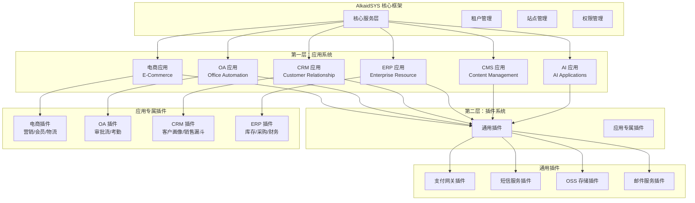
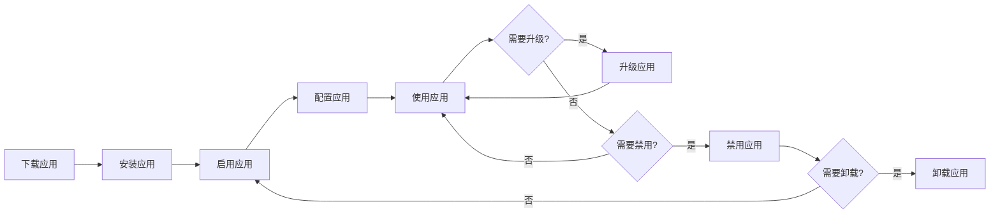
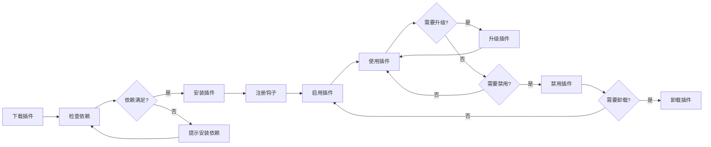

# AlkaidSYS 应用和插件系统设计

## 📋 文档信息

| 项目 | 内容 |
|------|------|
| **文档名称** | AlkaidSYS 应用和插件系统设计 |
| **文档版本** | v2.0 |
| **创建日期** | 2025-01-19 |
| **最后更新** | 2025-01-19 |

## 🎯 设计目标

AlkaidSYS 采用**两层架构**设计，明确区分**应用（Application）**和**插件（Plugin）**：

1. **应用层** - 提供完整的业务功能模块（如电商、OA、CRM、ERP、CMS、AI）
2. **插件层** - 提供功能扩展和增强（通用插件 + 应用专属插件）

## 🏗️ 两层架构设计

### 1. 架构总览



### 2. 应用与插件的关系

| 特性 | 应用（Application） | 插件（Plugin） |
|------|-------------------|---------------|
| **定义** | 完整的业务功能模块 | 功能扩展和增强 |
| **规模** | 大型（数十个表、数百个文件） | 小型（几个表、几十个文件） |
| **独立性** | 可独立运行 | 依赖应用或核心框架 |
| **数据库** | 独立的表结构 | 扩展现有表或新增少量表 |
| **路由** | 独立的路由系统 | 通过钩子扩展路由 |
| **前端** | 完整的前端页面 | 扩展现有页面或新增少量页面 |
| **示例** | 电商、OA、CRM、ERP | 支付插件、营销插件、审批流插件 |

## 📦 应用系统（Application）

### 1. 应用定义

**应用（Application）** 是提供完整业务功能的大型模块，具有以下特性：

- ✅ 独立的业务逻辑
- ✅ 独立的数据库表结构
- ✅ 独立的路由和控制器
- ✅ 独立的前端页面
- ✅ 可独立安装/卸载
- ✅ 可拥有专属插件生态

### 2. 应用分类

| 分类 | 应用名称 | 核心功能 | 典型场景 |
|------|---------|---------|---------|
| **电商类** | E-Commerce | 商品、订单、购物车、支付 | 在线商城、B2C、B2B |
| **办公类** | Office Automation | 审批、考勤、公告、文档 | 企业办公、协同工作 |
| **客户管理类** | CRM | 客户、线索、商机、跟进 | 销售管理、客户服务 |
| **企业资源类** | ERP | 库存、采购、财务、生产 | 制造业、供应链管理 |
| **内容管理类** | CMS | 文章、分类、标签、评论 | 新闻网站、博客平台 |
| **智能应用类** | AI | 模型、数据集、训练、预测 | AI 服务、机器学习 |

### 3. 应用目录结构

```
/addon/ecommerce/                    # 电商应用
├── manifest.json                    # 应用元数据
├── icon.png                         # 应用图标
├── cover.png                        # 应用封面
├── screenshots/                     # 应用截图
│   ├── screenshot1.png
│   └── screenshot2.png
├── app/                             # 后端代码
│   ├── adminapi/                    # Admin API
│   │   └── controller/
│   │       ├── Product.php
│   │       └── Order.php
│   ├── api/                         # 客户端 API
│   │   └── controller/
│   │       ├── Product.php
│   │       └── Cart.php
│   ├── model/                       # 模型
│   │   ├── Product.php
│   │   └── Order.php
│   ├── service/                     # 服务层
│   │   ├── ProductService.php
│   │   └── OrderService.php
│   └── validate/                    # 验证器
│       ├── Product.php
│       └── Order.php
├── admin/                           # Admin 前端
│   ├── views/
│   │   ├── product/
│   │   └── order/
│   └── api/
│       └── ecommerce.ts
├── web/                             # PC 客户端前端
│   ├── pages/
│   │   ├── product/
│   │   └── cart/
│   └── api/
│       └── ecommerce.ts
├── mobile/                          # 移动端前端
│   └── pages/
│       ├── product/
│       └── cart/
├── sql/                             # 数据库脚本
│   ├── install.sql                  # 安装脚本
│   └── uninstall.sql                # 卸载脚本
├── config/                          # 配置文件
│   └── config.php
└── Application.php                  # 应用主类
```

### 4. 应用元数据（manifest.json）

```json
{
  "key": "ecommerce",
  "name": "电子商城",
  "type": "app",
  "category": "ecommerce",
  "version": "1.0.0",
  "description": "功能完整的电子商城应用，支持商品管理、订单管理、购物车、支付等功能",
  "author": "AlkaidSYS Team",
  "author_url": "https://www.alkaidsys.com",
  "icon": "icon.png",
  "cover": "cover.png",
  "screenshots": [
    "screenshots/screenshot1.png",
    "screenshots/screenshot2.png"
  ],
  "min_framework_version": "1.0.0",
  "dependencies": [],
  "support_terminals": ["admin", "web", "mobile"],
  "price": 0,
  "license": "MIT",
  "tags": ["电商", "商城", "在线购物"],
  "install": {
    "sql": "sql/install.sql",
    "menu": true,
    "schedule": false
  },
  "uninstall": {
    "sql": "sql/uninstall.sql",
    "keep_data": false
  }
}
```

### 5. 应用生命周期



### 6. 应用主类（Application.php）

```php
<?php
namespace addon\ecommerce;

use app\service\core\addon\CoreAddonBaseService;

/**
 * 电商应用主类
 */
class Application extends CoreAddonBaseService
{
    /**
     * 应用安装
     */
    public function install(): void
    {
        // 1. 执行 SQL 安装脚本
        $this->executeSql('install.sql');
        
        // 2. 安装菜单
        $this->installMenu();
        
        // 3. 初始化配置
        $this->initConfig();
        
        // 4. 触发安装事件
        event('ApplicationInstalled', ['app_key' => 'ecommerce']);
    }
    
    /**
     * 应用卸载
     */
    public function uninstall(): void
    {
        // 1. 检查是否有依赖的插件
        $this->checkDependencies();
        
        // 2. 执行 SQL 卸载脚本
        $this->executeSql('uninstall.sql');
        
        // 3. 删除菜单
        $this->uninstallMenu();
        
        // 4. 清理配置
        $this->clearConfig();
        
        // 5. 触发卸载事件
        event('ApplicationUninstalled', ['app_key' => 'ecommerce']);
    }
    
    /**
     * 应用升级
     */
    public function upgrade(string $fromVersion, string $toVersion): void
    {
        // 1. 执行升级脚本
        $this->executeUpgradeScript($fromVersion, $toVersion);
        
        // 2. 更新菜单
        $this->updateMenu();
        
        // 3. 触发升级事件
        event('ApplicationUpgraded', [
            'app_key' => 'ecommerce',
            'from_version' => $fromVersion,
            'to_version' => $toVersion
        ]);
    }
    
    /**
     * 应用启用
     */
    public function enable(): void
    {
        // 触发启用事件
        event('ApplicationEnabled', ['app_key' => 'ecommerce']);
    }
    
    /**
     * 应用禁用
     */
    public function disable(): void
    {
        // 触发禁用事件
        event('ApplicationDisabled', ['app_key' => 'ecommerce']);
    }
}
```

## 🔌 插件系统（Plugin）

### 1. 插件定义

**插件（Plugin）** 是提供功能扩展和增强的小型模块，具有以下特性：

- ✅ 扩展现有功能
- ✅ 通过钩子（Hooks）机制集成
- ✅ 可独立安装/卸载
- ✅ 依赖应用或核心框架
- ✅ 轻量级设计

### 2. 插件分类

#### 2.1 通用插件（Universal Plugins）

跨应用使用的插件，为整个系统提供通用功能。

| 插件类型 | 插件名称 | 核心功能 | 适用场景 |
|---------|---------|---------|---------|
| **支付网关** | 微信支付、支付宝、Stripe | 支付处理、退款、对账 | 所有需要支付的应用 |
| **短信服务** | 阿里云短信、腾讯云短信 | 短信发送、验证码 | 所有需要短信的应用 |
| **存储服务** | 阿里云 OSS、七牛云 | 文件上传、存储、CDN | 所有需要文件存储的应用 |
| **邮件服务** | SMTP、SendGrid | 邮件发送、模板 | 所有需要邮件的应用 |

#### 2.2 应用专属插件（App-Specific Plugins）

只能在特定应用中使用的插件。

| 应用 | 插件类型 | 插件名称 | 核心功能 |
|------|---------|---------|---------|
| **电商** | 营销插件 | 优惠券、拼团、秒杀 | 营销活动管理 |
| **电商** | 会员插件 | 会员等级、积分、储值 | 会员体系管理 |
| **电商** | 物流插件 | 快递查询、电子面单 | 物流管理 |
| **OA** | 审批流插件 | 请假、报销、采购审批 | 审批流程管理 |
| **OA** | 考勤插件 | 打卡、排班、加班 | 考勤管理 |
| **CRM** | 客户画像插件 | 客户标签、行为分析 | 客户分析 |
| **CRM** | 销售漏斗插件 | 销售阶段、转化率 | 销售管理 |

### 3. 插件目录结构

```
/addon/ecommerce_coupon/             # 电商优惠券插件
├── plugin.json                      # 插件元数据
├── icon.png                         # 插件图标
├── app/                             # 后端代码
│   ├── adminapi/
│   │   └── controller/
│   │       └── Coupon.php
│   ├── api/
│   │   └── controller/
│   │       └── Coupon.php
│   ├── model/
│   │   └── Coupon.php
│   ├── service/
│   │   └── CouponService.php
│   └── hooks/                       # 钩子实现
│       ├── OrderHook.php
│       └── PaymentHook.php
├── admin/                           # Admin 前端
│   └── views/
│       └── coupon/
├── sql/
│   ├── install.sql
│   └── uninstall.sql
├── config/
│   └── config.php
└── Plugin.php                       # 插件主类
```

### 4. 插件元数据（plugin.json）

```json
{
  "key": "ecommerce_coupon",
  "name": "电商优惠券插件",
  "type": "plugin",
  "category": "app-specific",
  "app_key": "ecommerce",
  "version": "1.0.0",
  "description": "为电商应用提供优惠券功能，支持满减券、折扣券、兑换券等多种类型",
  "author": "AlkaidSYS Team",
  "author_url": "https://www.alkaidsys.com",
  "icon": "icon.png",
  "min_framework_version": "1.0.0",
  "min_app_version": "1.0.0",
  "dependencies": {
    "apps": ["ecommerce"],
    "plugins": []
  },
  "price": 99,
  "license": "Commercial",
  "tags": ["电商", "营销", "优惠券"],
  "hooks": [
    "OrderCalculate",
    "PaymentBefore",
    "PaymentAfter"
  ]
}
```

### 5. 插件生命周期



### 6. 插件主类（Plugin.php）

```php
<?php
namespace addon\ecommerce_coupon;

use app\service\core\addon\CorePluginBaseService;

/**
 * 电商优惠券插件主类
 */
class Plugin extends CorePluginBaseService
{
    /**
     * 插件安装
     */
    public function install(): void
    {
        // 1. 检查依赖的应用是否已安装
        $this->checkAppDependency('ecommerce');
        
        // 2. 执行 SQL 安装脚本
        $this->executeSql('install.sql');
        
        // 3. 注册钩子
        $this->registerHooks();
        
        // 4. 触发安装事件
        event('PluginInstalled', ['plugin_key' => 'ecommerce_coupon']);
    }
    
    /**
     * 插件卸载
     */
    public function uninstall(): void
    {
        // 1. 注销钩子
        $this->unregisterHooks();
        
        // 2. 执行 SQL 卸载脚本
        $this->executeSql('uninstall.sql');
        
        // 3. 触发卸载事件
        event('PluginUninstalled', ['plugin_key' => 'ecommerce_coupon']);
    }
    
    /**
     * 注册钩子
     */
    protected function registerHooks(): void
    {
        // 订单计算钩子
        hook('OrderCalculate', [$this, 'onOrderCalculate']);
        
        // 支付前钩子
        hook('PaymentBefore', [$this, 'onPaymentBefore']);
        
        // 支付后钩子
        hook('PaymentAfter', [$this, 'onPaymentAfter']);
    }
    
    /**
     * 订单计算钩子处理
     */
    public function onOrderCalculate(array $order): array
    {
        // 应用优惠券折扣
        if (!empty($order['coupon_code'])) {
            $coupon = $this->getCoupon($order['coupon_code']);
            $order['discount'] = $this->calculateDiscount($coupon, $order);
            $order['total'] -= $order['discount'];
        }
        
        return $order;
    }
    
    /**
     * 支付前钩子处理
     */
    public function onPaymentBefore(array $payment): void
    {
        // 锁定优惠券
        if (!empty($payment['coupon_code'])) {
            $this->lockCoupon($payment['coupon_code'], $payment['user_id']);
        }
    }
    
    /**
     * 支付后钩子处理
     */
    public function onPaymentAfter(array $payment): void
    {
        // 核销优惠券
        if (!empty($payment['coupon_code']) && $payment['status'] === 'success') {
            $this->useCoupon($payment['coupon_code'], $payment['user_id']);
        }
    }
}
```

## 🔗 钩子机制（Hooks）

### 1. 钩子定义

钩子（Hooks）是插件扩展应用功能的核心机制，允许插件在特定时机介入应用的执行流程。

### 2. 钩子类型

| 钩子类型 | 说明 | 示例 |
|---------|------|------|
| **Action Hooks** | 在特定动作执行时触发 | `OrderCreated`、`UserLogin` |
| **Filter Hooks** | 过滤和修改数据 | `OrderCalculate`、`ProductPrice` |
| **Event Hooks** | 事件监听 | `PaymentSuccess`、`EmailSent` |

### 3. 钩子注册和调用

```php
// 注册钩子
hook('OrderCalculate', function($order) {
    // 修改订单数据
    $order['total'] *= 0.9; // 打 9 折
    return $order;
});

// 调用钩子
$order = apply_hook('OrderCalculate', $order);
```

## 🆚 与 NIUCLOUD 对比

| 特性 | AlkaidSYS | NIUCLOUD | 优势 |
|------|-----------|----------|------|
| **应用和插件区分** | 明确区分两层架构 | 区分但不够清晰 | ✅ 更清晰 |
| **应用分类** | 6 大类（电商/OA/CRM/ERP/CMS/AI） | 主要是电商 | ✅ 更全面 |
| **插件分类** | 通用插件 + 应用专属插件 | 不明确 | ✅ 更合理 |
| **钩子机制** | 完整的钩子系统 | 基础钩子 | ✅ 更强大 |
| **元数据格式** | JSON 格式 | PHP 数组 | ✅ 更标准 |
| **生命周期管理** | 完整的生命周期 | 基础管理 | ✅ 更完善 |

---

## ⚙️ 事件系统统一规范：优先级 / 异步 / 队列（新增）

### 优先级（数字越小优先）
```php
// 注册
event()->listenWithPriority('OrderAmount', [CouponListener::class, 'handle'], 10);
event()->listenWithPriority('OrderAmount', [MemberLevelListener::class, 'handle'], 20);
```

### 异步事件
```php
// 触发异步
app(\alkaid\lowcode\event\EventDispatcher::class)->triggerAsync('OrderPaid', $order);
```

### 队列事件（延迟/重试）
```php
// 入队
app(\alkaid\lowcode\event\EventDispatcher::class)->queue('OrderPaid', $order, delay:30);
```

### 规范说明
- 所有监听器必须具备幂等性；失败重试具备上限与退避策略。
- 生产环境默认对高耗时监听器采用异步或队列。
- 在插件与应用文档中仅保留该规范，不再自定义私有顺序规则。

---

**最后更新**: 2025-01-19  
**文档版本**: v2.0  
**维护者**: AlkaidSYS 架构团队

