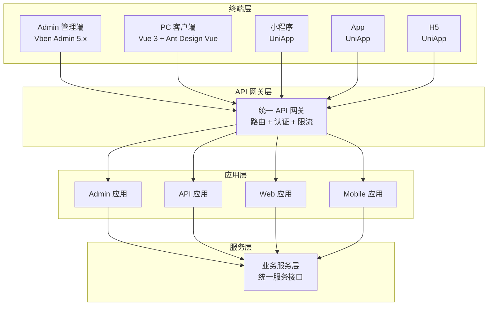

# AlkaidSYS 多端架构设计

## 📋 文档信息

| 项目 | 内容 |
|------|------|
| **文档名称** | AlkaidSYS 多端架构设计 |
| **文档版本** | v1.0 |
| **创建日期** | 2025-01-19 |

## 🎯 多端设计目标

1. **统一 API** - 所有终端使用统一的 RESTful API
2. **统一认证** - 统一的 Token 认证机制
3. **统一权限** - 统一的权限控制系统
4. **统一数据** - 统一的数据格式和错误处理

## 🏗️ 多端架构图



## 📱 终端详细设计

### 1. Admin 管理端（Vben Admin 5.x）

#### 技术栈

```json
{
  "name": "alkaid-admin",
  "version": "1.0.0",
  "dependencies": {
    "vue": "^3.5.17",
    "@vben/vite-config": "workspace:*",
    "ant-design-vue": "^4.2.6",
    "pinia": "^3.0.3",
    "vue-router": "^4.5.0",
    "axios": "^1.7.9"
  }
}
```

#### API 对接

```typescript
// /apps/admin/src/api/auth.ts

import { request } from '@/utils/request';

export interface LoginParams {
  username: string;
  password: string;
}

export interface LoginResult {
  access_token: string;
  refresh_token: string;
  expires_in: number;
  user: {
    id: number;
    username: string;
    email: string;
    roles: string[];
    permissions: string[];
  };
}

/**
 * 登录
 */
export function login(data: LoginParams) {
  return request<LoginResult>({
    url: '/admin/auth/login',
    method: 'POST',
    data,
  });
}

/**
 * 获取用户信息
 */
export function getUserInfo() {
  return request({
    url: '/admin/auth/user',
    method: 'GET',
  });
}

/**
 * 刷新 Token
 */
export function refreshToken(refreshToken: string) {
  return request({
    url: '/admin/auth/refresh',
    method: 'POST',
    data: { refresh_token: refreshToken },
  });
}
```

#### 权限对接

```typescript
// /apps/admin/src/store/modules/auth.ts

import { defineStore } from 'pinia';
import { login, getUserInfo } from '@/api/auth';
import { useAccessStore } from '@vben/stores';

export const useAuthStore = defineStore('auth', {
  state: () => ({
    user: null,
    roles: [],
    permissions: [],
  }),
  
  actions: {
    async login(params) {
      const result = await login(params);
      
      // 保存 Token 到 Vben 的 AccessStore
      const accessStore = useAccessStore();
      accessStore.setAccessToken(result.access_token);
      accessStore.setRefreshToken(result.refresh_token);
      
      // 保存用户信息
      this.user = result.user;
      this.roles = result.user.roles;
      this.permissions = result.user.permissions;
      
      // 设置权限码
      accessStore.setAccessCodes(result.user.permissions);
      
      return result;
    },
    
    async getUserInfo() {
      const result = await getUserInfo();
      this.user = result.user;
      this.roles = result.user.roles;
      this.permissions = result.user.permissions;
      
      const accessStore = useAccessStore();
      accessStore.setAccessCodes(result.user.permissions);
      
      return result;
    },
  },
});
```

### 2. PC 客户端（Vue 3 + Ant Design Vue）

#### 项目结构

```
web-client/
├── src/
│   ├── api/              # API 接口
│   ├── assets/           # 静态资源
│   ├── components/       # 组件
│   ├── layouts/          # 布局
│   ├── router/           # 路由
│   ├── store/            # 状态管理
│   ├── utils/            # 工具函数
│   ├── views/            # 页面
│   ├── App.vue
│   └── main.ts
├── package.json
└── vite.config.ts
```

#### API 封装

```typescript
// /web-client/src/utils/request.ts

import axios from 'axios';
import type { AxiosInstance, AxiosRequestConfig, AxiosResponse } from 'axios';
import { message } from 'ant-design-vue';
import { useAuthStore } from '@/store/modules/auth';

const service: AxiosInstance = axios.create({
  baseURL: import.meta.env.VITE_API_BASE_URL,
  timeout: 30000,
});

// 请求拦截器
service.interceptors.request.use(
  (config) => {
    const authStore = useAuthStore();
    const token = authStore.accessToken;
    
    if (token) {
      config.headers.Authorization = `Bearer ${token}`;
    }
    
    // 添加租户和站点信息
    config.headers['X-Tenant-Code'] = authStore.tenantCode;
    config.headers['X-Site-Code'] = authStore.siteCode;
    
    return config;
  },
  (error) => {
    return Promise.reject(error);
  }
);

// 响应拦截器
service.interceptors.response.use(
  (response: AxiosResponse) => {
    const res = response.data;
    
    if (res.code !== 200) {
      message.error(res.message || '请求失败');
      return Promise.reject(new Error(res.message || '请求失败'));
    }
    
    return res.data;
  },
  async (error) => {
    if (error.response?.status === 401) {
      // Token 过期，尝试刷新
      const authStore = useAuthStore();
      try {
        await authStore.refreshToken();
        // 重试原请求
        return service(error.config);
      } catch (e) {
        // 刷新失败，跳转登录
        authStore.logout();
        window.location.href = '/login';
      }
    }

    message.error(error.message || '请求失败');
    return Promise.reject(error);
  }
);

export default service;
```

### 3. 移动端（UniApp）

#### 项目结构

```
mobile-client/
├── pages/                # 页面
│   ├── index/
│   ├── goods/
│   ├── cart/
│   ├── order/
│   └── user/
├── components/           # 组件
├── static/               # 静态资源
├── store/                # 状态管理
├── utils/                # 工具函数
├── App.vue
├── main.js
├── manifest.json
└── pages.json
```

#### API 封装

```javascript
// /mobile-client/utils/request.js

const BASE_URL = process.env.VUE_APP_API_BASE_URL;

class Request {
  constructor() {
    this.baseURL = BASE_URL;
    this.timeout = 30000;
  }
  
  request(options) {
    return new Promise((resolve, reject) => {
      // 获取 Token
      const token = uni.getStorageSync('access_token');
      const tenantCode = uni.getStorageSync('tenant_code');
      const siteCode = uni.getStorageSync('site_code');
      
      uni.request({
        url: this.baseURL + options.url,
        method: options.method || 'GET',
        data: options.data || {},
        header: {
          'Content-Type': 'application/json',
          'Authorization': token ? `Bearer ${token}` : '',
          'X-Tenant-Code': tenantCode || '',
          'X-Site-Code': siteCode || '',
          ...options.header,
        },
        timeout: this.timeout,
        success: (res) => {
          if (res.statusCode === 200) {
            if (res.data.code === 200) {
              resolve(res.data.data);
            } else {
              uni.showToast({
                title: res.data.message || '请求失败',
                icon: 'none',
              });
              reject(res.data);
            }
          } else if (res.statusCode === 401) {
            // Token 过期
            this.refreshToken().then(() => {
              // 重试
              this.request(options).then(resolve).catch(reject);
            }).catch(() => {
              // 跳转登录
              uni.navigateTo({ url: '/pages/login/login' });
              reject(res);
            });
          } else {
            uni.showToast({
              title: '请求失败',
              icon: 'none',
            });
            reject(res);
          }
        },
        fail: (err) => {
          uni.showToast({
            title: '网络错误',
            icon: 'none',
          });
          reject(err);
        },
      });
    });
  }
  
  get(url, data, options = {}) {
    return this.request({ url, method: 'GET', data, ...options });
  }
  
  post(url, data, options = {}) {
    return this.request({ url, method: 'POST', data, ...options });
  }
  
  async refreshToken() {
    const refreshToken = uni.getStorageSync('refresh_token');
    const res = await this.post('/auth/refresh', { refresh_token: refreshToken });
    uni.setStorageSync('access_token', res.access_token);
    uni.setStorageSync('refresh_token', res.refresh_token);
  }
}

export default new Request();
```

## 🔧 统一 API 设计

### RESTful API 规范

```php
<?php
// API 路由设计

// 用户相关
GET    /api/users           # 获取用户列表
POST   /api/users           # 创建用户
GET    /api/users/:id       # 获取用户详情
PUT    /api/users/:id       # 更新用户
DELETE /api/users/:id       # 删除用户

// 商品相关
GET    /api/goods           # 获取商品列表
POST   /api/goods           # 创建商品
GET    /api/goods/:id       # 获取商品详情
PUT    /api/goods/:id       # 更新商品
DELETE /api/goods/:id       # 删除商品

// 订单相关
GET    /api/orders          # 获取订单列表
POST   /api/orders          # 创建订单
GET    /api/orders/:id      # 获取订单详情
PUT    /api/orders/:id      # 更新订单
DELETE /api/orders/:id      # 删除订单
```

### 统一响应格式

```php
<?php
// /app/common/controller/BaseController.php

namespace app\common\controller;

use think\App;
use think\Response;

abstract class BaseController
{
    protected App $app;
    
    public function __construct(App $app)
    {
        $this->app = $app;
    }
    
    /**
     * 成功响应
     */
    protected function success($data = null, string $message = '操作成功', int $code = 200): Response
    {
        return json([
            'code' => $code,
            'message' => $message,
            'data' => $data,
            'timestamp' => time(),
        ]);
    }
    
    /**
     * 失败响应
     */
    protected function error(string $message = '操作失败', int $code = 400, $data = null): Response
    {
        return json([
            'code' => $code,
            'message' => $message,
            'data' => $data,
            'timestamp' => time(),
        ]);
    }
    
    /**
     * 分页响应
     */
    protected function paginate($list, int $total, int $page, int $pageSize): Response
    {
        return json([
            'code' => 200,
            'message' => '获取成功',
            'data' => [
                'list' => $list,
                'total' => $total,
                'page' => $page,
                'page_size' => $pageSize,
                'total_pages' => ceil($total / $pageSize),
            ],
            'timestamp' => time(),
        ]);
    }
}
```

### 统一错误处理

```php
<?php
// /app/ExceptionHandle.php

namespace app;

use think\db\exception\DataNotFoundException;
use think\db\exception\ModelNotFoundException;
use think\exception\Handle;
use think\exception\HttpException;
use think\exception\ValidateException;
use think\Response;
use Throwable;

class ExceptionHandle extends Handle
{
    public function render($request, Throwable $e): Response
    {
        // 验证异常
        if ($e instanceof ValidateException) {
            return json([
                'code' => 422,
                'message' => $e->getError(),
                'data' => null,
                'timestamp' => time(),
            ], 422);
        }
        
        // HTTP 异常
        if ($e instanceof HttpException) {
            return json([
                'code' => $e->getStatusCode(),
                'message' => $e->getMessage(),
                'data' => null,
                'timestamp' => time(),
            ], $e->getStatusCode());
        }
        
        // 数据未找到异常
        if ($e instanceof DataNotFoundException || $e instanceof ModelNotFoundException) {
            return json([
                'code' => 404,
                'message' => '数据不存在',
                'data' => null,
                'timestamp' => time(),
            ], 404);
        }
        
        // 其他异常
        return json([
            'code' => 500,
            'message' => app()->isDebug() ? $e->getMessage() : '服务器错误',
            'data' => app()->isDebug() ? [
                'file' => $e->getFile(),
                'line' => $e->getLine(),
                'trace' => $e->getTraceAsString(),
            ] : null,
            'timestamp' => time(),
        ], 500);
    }
}
```

## 🔐 统一认证机制

### JWT Token 认证

```php
<?php
// /app/common/service/AuthService.php

namespace app\common\service;

use Firebase\JWT\JWT;
use Firebase\JWT\Key;

class AuthService extends BaseService
{
    protected string $secret;
    protected int $accessTokenExpire = 7200; // 2小时
    protected int $refreshTokenExpire = 604800; // 7天
    
    public function __construct()
    {
        $this->secret = config('app.jwt_secret');
    }
    
    /**
     * 生成 Access Token
     */
    public function generateAccessToken(int $userId, array $extra = []): string
    {
        $payload = [
            'iss' => 'alkaid',
            'iat' => time(),
            'exp' => time() + $this->accessTokenExpire,
            'user_id' => $userId,
            'tenant_id' => $this->getTenantId(),
            'site_id' => app('request')->siteId(),
            ...$extra,
        ];
        
        return JWT::encode($payload, $this->secret, 'HS256');
    }
    
    /**
     * 生成 Refresh Token
     */
    public function generateRefreshToken(int $userId): string
    {
        $payload = [
            'iss' => 'alkaid',
            'iat' => time(),
            'exp' => time() + $this->refreshTokenExpire,
            'user_id' => $userId,
            'type' => 'refresh',
        ];
        
        return JWT::encode($payload, $this->secret, 'HS256');
    }
    
    /**
     * 验证 Token
     */
    public function verifyToken(string $token): array
    {
        try {
            $decoded = JWT::decode($token, new Key($this->secret, 'HS256'));
            return (array) $decoded;
        } catch (\Exception $e) {
            throw new \Exception('Token 无效或已过期');
        }
    }
}
```

## 🆚 与 NIUCLOUD 多端对比

| 特性 | AlkaidSYS | NIUCLOUD | 优势 |
|------|-----------|----------|------|
| **Admin 端** | Vben Admin 5.x | Element Plus | ✅ 更现代 |
| **API 规范** | RESTful | 自定义 | ✅ 更标准 |
| **认证机制** | JWT | Session | ✅ 更适合分布式 |
| **错误处理** | 统一格式 | 不统一 | ✅ 更规范 |

---

**最后更新**: 2025-01-19  
**文档版本**: v1.0  
**维护者**: AlkaidSYS 架构团队

