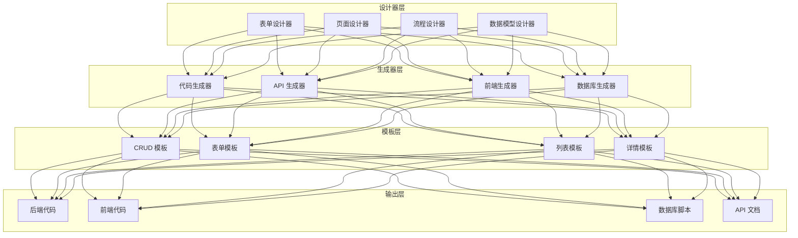

# AlkaidSYS 低代码平台设计

## 📋 文档信息

| 项目 | 内容 |
|------|------|
| **文档名称** | AlkaidSYS 低代码平台设计 |
| **文档版本** | v1.0 |
| **创建日期** | 2025-01-19 |

## 🎯 低代码设计目标

1. **提高效率** - 将开发效率提升 10 倍
2. **降低门槛** - 让非技术人员也能开发应用
3. **标准化** - 统一的代码规范和最佳实践
4. **可扩展** - 支持自定义模板和组件

## 🏗️ 低代码平台架构



## 🔧 1. 代码生成器

### 数据模型定义

```json
{
  "table": {
    "name": "products",
    "comment": "商品表",
    "engine": "InnoDB",
    "charset": "utf8mb4"
  },
  "fields": [
    {
      "name": "id",
      "type": "bigint",
      "length": 20,
      "unsigned": true,
      "auto_increment": true,
      "primary_key": true,
      "comment": "商品ID"
    },
    {
      "name": "tenant_id",
      "type": "bigint",
      "length": 20,
      "unsigned": true,
      "nullable": false,
      "comment": "租户ID"
    },
    {
      "name": "site_id",
      "type": "bigint",
      "length": 20,
      "unsigned": true,
      "nullable": false,
      "comment": "站点ID"
    },
    {
      "name": "category_id",
      "type": "bigint",
      "length": 20,
      "unsigned": true,
      "nullable": false,
      "comment": "分类ID"
    },
    {
      "name": "name",
      "type": "varchar",
      "length": 200,
      "nullable": false,
      "comment": "商品名称"
    },
    {
      "name": "price",
      "type": "decimal",
      "length": "10,2",
      "nullable": false,
      "default": "0.00",
      "comment": "商品价格"
    },
    {
      "name": "stock",
      "type": "int",
      "length": 11,
      "nullable": false,
      "default": 0,
      "comment": "库存"
    },
    {
      "name": "status",
      "type": "tinyint",
      "length": 1,
      "nullable": false,
      "default": 1,
      "comment": "状态:0=下架,1=上架"
    },
    {
      "name": "created_at",
      "type": "timestamp",
      "nullable": false,
      "default": "CURRENT_TIMESTAMP",
      "comment": "创建时间"
    },
    {
      "name": "updated_at",
      "type": "timestamp",
      "nullable": false,
      "default": "CURRENT_TIMESTAMP ON UPDATE CURRENT_TIMESTAMP",
      "comment": "更新时间"
    }
  ],
  "indexes": [
    {
      "name": "idx_tenant_site",
      "fields": ["tenant_id", "site_id"]
    },
    {
      "name": "idx_category",
      "fields": ["category_id"]
    },
    {
      "name": "idx_status",
      "fields": ["status"]
    }
  ]
}
```

### 代码生成服务

```php
<?php
// /app/common/service/CodeGeneratorService.php

namespace app\common\service;

class CodeGeneratorService extends BaseService
{
    /**
     * 生成完整的 CRUD 代码
     */
    public function generate(array $schema): array
    {
        return [
            'migration' => $this->generateMigration($schema),
            'model' => $this->generateModel($schema),
            'controller' => $this->generateController($schema),
            'service' => $this->generateService($schema),
            'validate' => $this->generateValidate($schema),
            'route' => $this->generateRoute($schema),
            'api' => $this->generateApi($schema),
            'view' => $this->generateView($schema),
        ];
    }

    /**
     * 生成数据库迁移
     */
    protected function generateMigration(array $schema): string
    {
        $table = $schema['table']['name'];
        $fields = $schema['fields'];

        $template = <<<'PHP'
<?php

use think\migration\Migrator;
use think\migration\db\Column;

class Create{TableName}Table extends Migrator
{
    public function change()
    {
        $table = $this->table('{table_name}', [
            'engine' => '{engine}',
            'collation' => '{charset}_unicode_ci',
            'comment' => '{comment}',
        ]);

{fields}

{indexes}

        $table->create();
    }
}
PHP;

        $fieldsCode = $this->generateFieldsCode($fields);
        $indexesCode = $this->generateIndexesCode($schema['indexes'] ?? []);

        return str_replace(
            ['{TableName}', '{table_name}', '{engine}', '{charset}', '{comment}', '{fields}', '{indexes}'],
            [
                $this->toPascalCase($table),
                $table,
                $schema['table']['engine'],
                $schema['table']['charset'],
                $schema['table']['comment'],
                $fieldsCode,
                $indexesCode,
            ],
            $template
        );
    }

    /**
     * 生成模型
     */
    protected function generateModel(array $schema): string
    {
        $table = $schema['table']['name'];
        $modelName = $this->toPascalCase($table);

        $template = <<<'PHP'
<?php

namespace app\common\model;

class {ModelName} extends BaseModel
{
    protected $name = '{table_name}';

    protected $globalScope = ['site'];

    protected $hidden = ['deleted_at'];

    protected $type = [
{type_casts}
    ];

{relations}
}
PHP;

        $typeCasts = $this->generateTypeCasts($schema['fields']);
        $relations = $this->generateRelations($schema);

        return str_replace(
            ['{ModelName}', '{table_name}', '{type_casts}', '{relations}'],
            [$modelName, $table, $typeCasts, $relations],
            $template
        );
    }

    /**
     * 生成控制器
     */
    protected function generateController(array $schema): string
    {
        $table = $schema['table']['name'];
        $modelName = $this->toPascalCase($table);
        $controllerName = $modelName . 'Controller';

        $template = <<<'PHP'
<?php

namespace app\admin\controller;

use app\common\controller\BaseController;
use app\common\model\{ModelName};
use app\common\validate\{ModelName}Validate;

class {ControllerName} extends BaseController
{
    /**
     * 列表
     */
    public function index()
    {
        $page = $this->request->param('page', 1);
        $pageSize = $this->request->param('page_size', 15);

        $list = {ModelName}::order('id', 'desc')
            ->paginate([
                'list_rows' => $pageSize,
                'page' => $page,
            ]);

        return $this->paginate(
            $list->items(),
            $list->total(),
            $page,
            $pageSize
        );
    }

    /**
     * 详情
     */
    public function read($id)
    {
        $model = {ModelName}::find($id);
        if (!$model) {
            return $this->error('数据不存在', 404);
        }
        return $this->success($model);
    }

    /**
     * 创建
     */
    public function save()
    {
        $data = $this->request->post();

        try {
            validate({ModelName}Validate::class)->check($data);
        } catch (\think\exception\ValidateException $e) {
            return $this->error($e->getError(), 422);
        }

        $model = {ModelName}::create($data);
        return $this->success($model, '创建成功', 201);
    }

    /**
     * 更新
     */
    public function update($id)
    {
        $model = {ModelName}::find($id);
        if (!$model) {
            return $this->error('数据不存在', 404);
        }

        $data = $this->request->put();

        try {
            validate({ModelName}Validate::class)->scene('update')->check($data);
        } catch (\think\exception\ValidateException $e) {
            return $this->error($e->getError(), 422);
        }

        $model->save($data);
        return $this->success($model, '更新成功');
    }

    /**
     * 删除
     */
    public function delete($id)
    {
        $model = {ModelName}::find($id);
        if (!$model) {
            return $this->error('数据不存在', 404);
        }

        $model->delete();
        return $this->success(null, '删除成功');
    }
}
PHP;

        return str_replace(
            ['{ModelName}', '{ControllerName}'],
            [$modelName, $controllerName],
            $template
        );
    }

    /**
     * 生成验证器
     */
    protected function generateValidate(array $schema): string
    {
        $table = $schema['table']['name'];
        $modelName = $this->toPascalCase($table);
        $validateName = $modelName . 'Validate';

        $rules = $this->generateValidateRules($schema['fields']);

        $template = <<<'PHP'
<?php

namespace app\common\validate;

use think\Validate;

class {ValidateName} extends Validate
{
    protected $rule = [
{rules}
    ];

    protected $message = [
{messages}
    ];

    protected $scene = [
        'update' => ['name', 'price', 'stock', 'status'],
    ];
}
PHP;

        return str_replace(
            ['{ValidateName}', '{rules}', '{messages}'],
            [$validateName, $rules['rules'], $rules['messages']],
            $template
        );
    }

    /**
     * 生成前端 API
     */
    protected function generateApi(array $schema): string
    {
        $table = $schema['table']['name'];
        $apiName = $this->toCamelCase($table);

        $template = <<<'TS'
import { request } from '@/utils/request';

export interface {ModelName} {
{interface}
}

export function get{ModelName}List(params: any) {
  return request({
    url: '/admin/{api_name}',
    method: 'GET',
    params,
  });
}

export function get{ModelName}(id: number) {
  return request({
    url: `/admin/{api_name}/${id}`,
    method: 'GET',
  });
}

export function create{ModelName}(data: Partial<{ModelName}>) {
  return request({
    url: '/admin/{api_name}',
    method: 'POST',
    data,
  });
}

export function update{ModelName}(id: number, data: Partial<{ModelName}>) {
  return request({
    url: `/admin/{api_name}/${id}`,
    method: 'PUT',
    data,
  });
}

export function delete{ModelName}(id: number) {
  return request({
    url: `/admin/{api_name}/${id}`,
    method: 'DELETE',
  });
}
TS;

        $interface = $this->generateTypeScriptInterface($schema['fields']);

        return str_replace(
            ['{ModelName}', '{api_name}', '{interface}'],
            [$this->toPascalCase($table), $apiName, $interface],
            $template
        );
    }

    /**
     * 转换为 PascalCase
     */
    protected function toPascalCase(string $str): string
    {
        return str_replace(' ', '', ucwords(str_replace('_', ' ', $str)));
    }

    /**
     * 转换为 camelCase
     */
    protected function toCamelCase(string $str): string
    {
        return lcfirst($this->toPascalCase($str));
    }
}
```

## 🔧 2. 表单设计器

### 表单配置

```json
{
  "form": {
    "name": "product_form",
    "title": "商品表单",
    "layout": "horizontal",
    "labelWidth": "120px"
  },
  "fields": [
    {
      "name": "name",
      "label": "商品名称",
      "type": "input",
      "required": true,
      "placeholder": "请输入商品名称",
      "rules": [
        { "required": true, "message": "请输入商品名称" },
        { "min": 2, "max": 200, "message": "长度在 2 到 200 个字符" }
      ]
    },
    {
      "name": "category_id",
      "label": "商品分类",
      "type": "select",
      "required": true,
      "options": {
        "api": "/api/categories",
        "labelField": "name",
        "valueField": "id"
      }
    },
    {
      "name": "price",
      "label": "商品价格",
      "type": "number",
      "required": true,
      "min": 0,
      "precision": 2,
      "placeholder": "请输入商品价格"
    },
    {
      "name": "stock",
      "label": "库存",
      "type": "number",
      "required": true,
      "min": 0,
      "placeholder": "请输入库存"
    },
    {
      "name": "images",
      "label": "商品图片",
      "type": "upload",
      "multiple": true,
      "limit": 5,
      "accept": "image/*"
    },
    {
      "name": "description",
      "label": "商品描述",
      "type": "editor",
      "height": "300px"
    },
    {
      "name": "status",
      "label": "状态",
      "type": "radio",
      "options": [
        { "label": "下架", "value": 0 },
        { "label": "上架", "value": 1 }
      ],
      "default": 1
    }
  ]
}
```

## 🔧 3. 页面设计器

### 页面配置

```json
{
  "page": {
    "name": "product_list",
    "title": "商品列表",
    "type": "list"
  },
  "search": {
    "fields": [
      {
        "name": "name",
        "label": "商品名称",
        "type": "input"
      },
      {
        "name": "category_id",
        "label": "分类",
        "type": "select",
        "options": {
          "api": "/api/categories"
        }
      },
      {
        "name": "status",
        "label": "状态",
        "type": "select",
        "options": [
          { "label": "全部", "value": "" },
          { "label": "下架", "value": 0 },
          { "label": "上架", "value": 1 }
        ]
      }
    ]
  },
  "table": {
    "api": "/api/products",
    "columns": [
      {
        "prop": "id",
        "label": "ID",
        "width": "80"
      },
      {
        "prop": "name",
        "label": "商品名称",
        "minWidth": "200"
      },
      {
        "prop": "category.name",
        "label": "分类",
        "width": "120"
      },
      {
        "prop": "price",
        "label": "价格",
        "width": "120",
        "formatter": "currency"
      },
      {
        "prop": "stock",
        "label": "库存",
        "width": "100"
      },
      {
        "prop": "status",
        "label": "状态",
        "width": "100",
        "type": "tag",
        "options": {
          "0": { "label": "下架", "type": "danger" },
          "1": { "label": "上架", "type": "success" }
        }
      },
      {
        "prop": "created_at",
        "label": "创建时间",
        "width": "180",
        "formatter": "datetime"
      }
    ],
    "actions": [
      {
        "label": "编辑",
        "type": "primary",
        "action": "edit"
      },
      {
        "label": "删除",
        "type": "danger",
        "action": "delete",
        "confirm": "确定要删除吗？"
      }
    ]
  },
  "toolbar": {
    "buttons": [
      {
        "label": "新增",
        "type": "primary",
        "icon": "plus",
        "action": "create"
      },
      {
        "label": "批量删除",
        "type": "danger",
        "action": "batchDelete"
      }
    ]
  }
}
```

## 🔧 4. 流程设计器

### 工作流配置

```json
{
  "workflow": {
    "name": "order_approval",
    "title": "订单审批流程",
    "version": "1.0"
  },
  "nodes": [
    {
      "id": "start",
      "type": "start",
      "label": "开始"
    },
    {
      "id": "submit",
      "type": "task",
      "label": "提交订单",
      "assignee": "${initiator}"
    },
    {
      "id": "approve",
      "type": "approval",
      "label": "主管审批",
      "assignee": "${manager}",
      "actions": ["approve", "reject"]
    },
    {
      "id": "finance",
      "type": "approval",
      "label": "财务审批",
      "assignee": "role:finance",
      "condition": "${amount > 10000}",
      "actions": ["approve", "reject"]
    },
    {
      "id": "end",
      "type": "end",
      "label": "结束"
    }
  ],
  "edges": [
    { "from": "start", "to": "submit" },
    { "from": "submit", "to": "approve" },
    { "from": "approve", "to": "finance", "condition": "${approved && amount > 10000}" },
    { "from": "approve", "to": "end", "condition": "${approved && amount <= 10000}" },
    { "from": "approve", "to": "end", "condition": "${rejected}" },
    { "from": "finance", "to": "end" }
  ]
}
```


## ⚠️ 运行环境与 DDL 约束

> 本小节与 `03-data-layer/11-database-evolution-and-migration-strategy.md` 协同，约束低代码在不同环境下的行为。

1. **开发 / 测试环境**：
   - 允许 SchemaBuilder 直接执行建表 / 改表 DDL，以提升迭代效率；
   - 要求同步生成对应迁移脚本草案并提交代码仓库，避免只存在于单一测试库的“孤儿结构”。
2. **预发 / 生产环境**：
   - 禁止 SchemaBuilder 直接连接数据库执行 DDL；
   - 仅允许生成“迁移候选脚本”或结构 Diff 报告，进入统一的迁移流水线；
   - 所有正式迁移必须遵循《数据库演进与迁移策略》中的风险分级、评审与回滚流程。
3. **多租户 / 多站点约束**：
   - 低代码生成表结构时必须遵守《多租户 / 多站点数据建模规范》，自动注入 `tenant_id` / `site_id` 及推荐索引；
   - 不允许在生产环境通过低代码对单个租户执行“结构特例化 DDL”，如确有需要应通过专门迁移设计文档评审。
## 🆚 与 NIUCLOUD 低代码对比

| 特性 | AlkaidSYS | NIUCLOUD | 优势 |
|------|-----------|----------|------|
| **代码生成** | 完整 CRUD | 基础 CRUD | ✅ 更完善 |
| **表单设计器** | 可视化 | 配置文件 | ✅ 更易用 |
| **页面设计器** | 支持 | 不支持 | ✅ 更强大 |
| **流程设计器** | 支持 | 不支持 | ✅ 更灵活 |

---

**最后更新**: 2025-01-19
**文档版本**: v1.0
**维护者**: AlkaidSYS 架构团队

