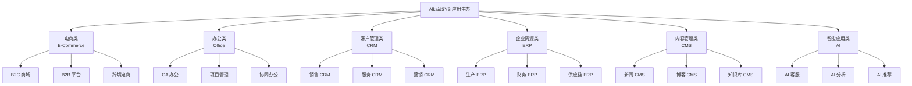
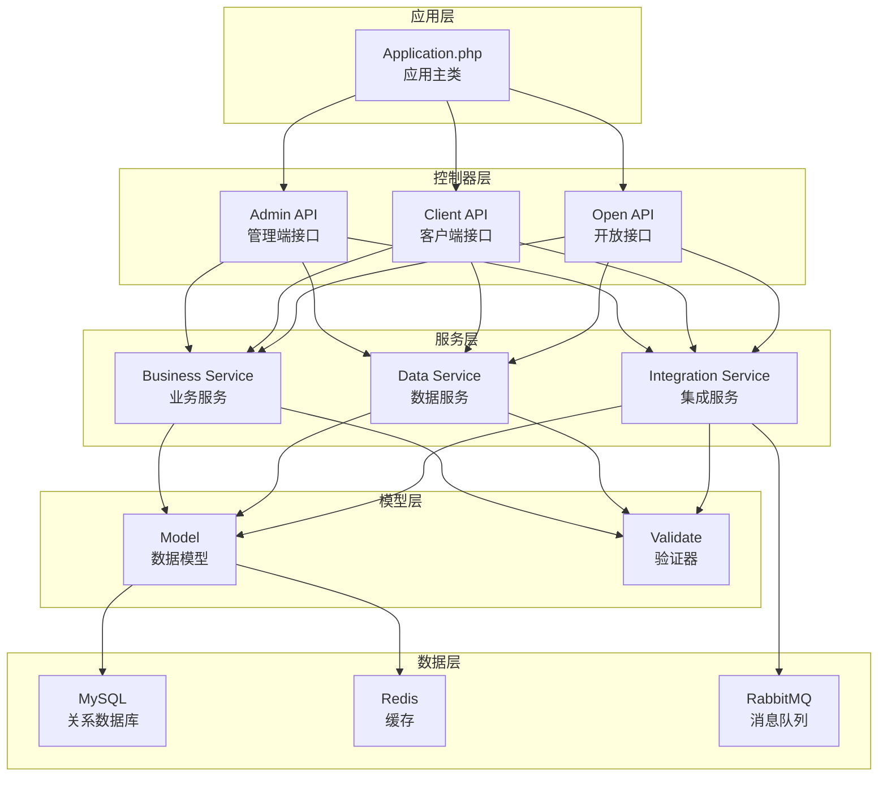
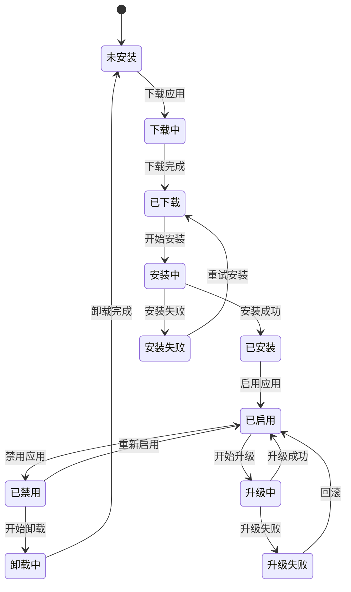

# AlkaidSYS 应用系统设计

## 📋 文档信息

| 项目 | 内容 |
|------|------|
| **文档名称** | AlkaidSYS 应用系统设计 |
| **文档版本** | v1.0 |
| **创建日期** | 2025-01-19 |

## 🎯 应用系统概述

**应用（Application）** 是 AlkaidSYS 的第一层架构，提供完整的业务功能模块。每个应用都是一个独立的业务系统，可以独立安装、配置、使用和卸载。

### 核心特性

1. ✅ **独立性** - 独立的数据库、路由、前端页面
2. ✅ **完整性** - 提供完整的业务功能闭环
3. ✅ **可扩展性** - 支持专属插件生态
4. ✅ **多租户支持** - 支持租户级别的应用管理
5. ✅ **多站点支持** - 支持站点级别的应用配置
6. ✅ **热插拔** - 无需重启即可安装/卸载

## 📦 应用分类体系

### 1. 六大应用类别



### 2. 应用详细分类

#### 2.1 电商类应用（E-Commerce）

| 应用名称 | 核心功能 | 适用场景 |
|---------|---------|---------|
| **B2C 商城** | 商品、订单、购物车、支付、物流 | 在线零售、品牌官网 |
| **B2B 平台** | 询价、报价、批发订单、供应商管理 | 批发市场、企业采购 |
| **跨境电商** | 多币种、多语言、国际物流、清关 | 跨境贸易、海外市场 |
| **社交电商** | 拼团、分销、社群、直播带货 | 社交营销、私域流量 |

#### 2.2 办公类应用（Office Automation）

| 应用名称 | 核心功能 | 适用场景 |
|---------|---------|---------|
| **OA 办公** | 审批、考勤、公告、文档、会议 | 企业内部管理 |
| **项目管理** | 任务、进度、资源、甘特图、看板 | 项目协作、敏捷开发 |
| **协同办公** | 即时通讯、视频会议、文件共享 | 远程办公、团队协作 |
| **知识管理** | 文档库、Wiki、问答、搜索 | 知识沉淀、经验分享 |

#### 2.3 客户管理类应用（CRM）

| 应用名称 | 核心功能 | 适用场景 |
|---------|---------|---------|
| **销售 CRM** | 客户、线索、商机、销售漏斗 | 销售团队管理 |
| **服务 CRM** | 工单、客服、知识库、满意度 | 客户服务、售后支持 |
| **营销 CRM** | 营销活动、邮件营销、客户画像 | 市场营销、客户运营 |

#### 2.4 企业资源类应用（ERP）

| 应用名称 | 核心功能 | 适用场景 |
|---------|---------|---------|
| **生产 ERP** | 生产计划、工单、质检、设备 | 制造业、生产管理 |
| **财务 ERP** | 会计、出纳、报表、预算 | 财务管理、成本控制 |
| **供应链 ERP** | 采购、库存、仓储、物流 | 供应链管理、库存优化 |

#### 2.5 内容管理类应用（CMS）

| 应用名称 | 核心功能 | 适用场景 |
|---------|---------|---------|
| **新闻 CMS** | 文章、分类、标签、评论、专题 | 新闻网站、媒体平台 |
| **博客 CMS** | 博客、作者、订阅、RSS | 个人博客、技术博客 |
| **知识库 CMS** | 文档、目录、搜索、版本控制 | 产品文档、帮助中心 |

#### 2.6 智能应用类应用（AI）

| 应用名称 | 核心功能 | 适用场景 |
|---------|---------|---------|
| **AI 客服** | 智能问答、意图识别、知识图谱 | 客户服务、自动回复 |
| **AI 分析** | 数据分析、预测模型、可视化 | 商业智能、决策支持 |
| **AI 推荐** | 协同过滤、内容推荐、个性化 | 商品推荐、内容推荐 |

## 🏗️ 应用架构设计

### 1. 应用架构图



### 2. 应用目录结构（以电商应用为例）

```
/addon/ecommerce/                    # 电商应用根目录
│
├── manifest.json                    # 应用元数据
├── icon.png                         # 应用图标（256x256）
├── cover.png                        # 应用封面（1200x600）
├── screenshots/                     # 应用截图
│   ├── screenshot1.png
│   ├── screenshot2.png
│   └── screenshot3.png
│
├── app/                             # 后端代码
│   ├── adminapi/                    # Admin API（管理端接口）
│   │   ├── controller/
│   │   │   ├── Product.php          # 商品管理
│   │   │   ├── Category.php         # 分类管理
│   │   │   ├── Order.php            # 订单管理
│   │   │   └── Setting.php          # 设置管理
│   │   ├── middleware/
│   │   │   └── CheckPermission.php  # 权限检查
│   │   └── route/
│   │       └── route.php            # 路由定义
│   │
│   ├── api/                         # Client API（客户端接口）
│   │   ├── controller/
│   │   │   ├── Product.php          # 商品列表
│   │   │   ├── Cart.php             # 购物车
│   │   │   ├── Order.php            # 订单
│   │   │   └── Payment.php          # 支付
│   │   └── route/
│   │       └── route.php
│   │
│   ├── model/                       # 数据模型
│   │   ├── Product.php
│   │   ├── Category.php
│   │   ├── Order.php
│   │   ├── OrderItem.php
│   │   └── Cart.php
│   │
│   ├── service/                     # 服务层
│   │   ├── admin/
│   │   │   ├── ProductService.php
│   │   │   └── OrderService.php
│   │   └── api/
│   │       ├── ProductService.php
│   │       ├── CartService.php
│   │       └── OrderService.php
│   │
│   ├── validate/                    # 验证器
│   │   ├── Product.php
│   │   └── Order.php
│   │
│   ├── dict/                        # 字典
│   │   ├── ProductDict.php
│   │   └── OrderDict.php
│   │
│   ├── job/                         # 队列任务
│   │   ├── OrderAutoClose.php
│   │   └── OrderAutoConfirm.php
│   │
│   └── listener/                    # 事件监听
│       ├── OrderCreated.php
│       └── OrderPaid.php
│
├── admin/                           # Admin 前端（Vue 3 + Vben Admin）
│   ├── views/
│   │   ├── product/
│   │   │   ├── list.vue
│   │   │   ├── add.vue
│   │   │   └── edit.vue
│   │   ├── order/
│   │   │   ├── list.vue
│   │   │   └── detail.vue
│   │   └── setting/
│   │       └── index.vue
│   ├── api/
│   │   └── ecommerce.ts
│   └── routes/
│       └── ecommerce.ts
│
├── web/                             # PC 客户端前端（Vue 3 + Ant Design Vue）
│   ├── pages/
│   │   ├── product/
│   │   │   ├── list.vue
│   │   │   └── detail.vue
│   │   ├── cart/
│   │   │   └── index.vue
│   │   └── order/
│   │       ├── list.vue
│   │       └── detail.vue
│   └── api/
│       └── ecommerce.ts
│
├── mobile/                          # 移动端前端（UniApp）
│   ├── pages/
│   │   ├── product/
│   │   │   ├── list.vue
│   │   │   └── detail.vue
│   │   ├── cart/
│   │   │   └── index.vue
│   │   └── order/
│   │       ├── list.vue
│   │       └── detail.vue
│   └── api/
│       └── ecommerce.js
│
├── sql/                             # 数据库脚本
│   ├── install.sql                  # 安装脚本
│   ├── uninstall.sql                # 卸载脚本
│   └── upgrade/                     # 升级脚本
│       ├── 1.0.0_to_1.1.0.sql
│       └── 1.1.0_to_1.2.0.sql
│
├── config/                          # 配置文件
│   ├── config.php                   # 应用配置
│   ├── menu.php                     # 菜单配置
│   └── dict.php                     # 字典配置
│
├── lang/                            # 多语言
│   ├── zh-cn.php
│   └── en.php
│
├── docs/                            # 文档
│   ├── README.md
│   ├── INSTALL.md
│   └── API.md
│
└── Application.php                  # 应用主类
```

### 3. 应用元数据（manifest.json）

```json
{
  "key": "ecommerce",
  "name": "电子商城",
  "type": "app",
  "category": "ecommerce",
  "version": "1.0.0",
  "description": "功能完整的电子商城应用，支持商品管理、订单管理、购物车、支付、物流等功能",
  "author": "AlkaidSYS Team",
  "author_url": "https://www.alkaidsys.com",
  "author_email": "support@alkaidsys.com",
  "icon": "icon.png",
  "cover": "cover.png",
  "screenshots": [
    "screenshots/screenshot1.png",
    "screenshots/screenshot2.png",
    "screenshots/screenshot3.png"
  ],
  "min_framework_version": "1.0.0",
  "max_framework_version": "2.0.0",
  "dependencies": {
    "apps": [],
    "plugins": []
  },
  "support_terminals": ["admin", "web", "mobile"],
  "support_databases": ["mysql"],
  "price": 0,
  "license": "MIT",
  "tags": ["电商", "商城", "在线购物", "B2C"],
  "install": {
    "sql": "sql/install.sql",
    "menu": "config/menu.php",
    "dict": "config/dict.php",
    "schedule": false,
    "demo_data": false
  },
  "uninstall": {
    "sql": "sql/uninstall.sql",
    "keep_data": false,
    "keep_files": false
  },
  "upgrade": {
    "auto_backup": true,
    "scripts": "sql/upgrade/"
  },
  "config": {
    "default_currency": "CNY",
    "default_language": "zh-cn",
    "enable_cart": true,
    "enable_wishlist": true,
    "enable_review": true
  },
  "permissions": [
    "ecommerce.product.view",
    "ecommerce.product.add",
    "ecommerce.product.edit",
    "ecommerce.product.delete",
    "ecommerce.order.view",
    "ecommerce.order.edit",
    "ecommerce.order.delete"
  ]
}
```

## 🔄 应用生命周期管理

### 1. 生命周期流程图



### 2. 应用主类（Application.php）

```php
<?php
namespace addon\ecommerce;

use app\service\core\addon\CoreAddonBaseService;
use think\facade\Db;

/**
 * 电商应用主类
 */
class Application extends CoreAddonBaseService
{
    /**
     * 应用安装
     */
    public function install(): void
    {
        Db::startTrans();
        try {
            // 1. 执行 SQL 安装脚本
            $this->executeSqlFile('sql/install.sql');
            
            // 2. 安装菜单
            $this->installMenu('config/menu.php');
            
            // 3. 安装字典
            $this->installDict('config/dict.php');
            
            // 4. 初始化配置
            $this->initConfig();
            
            // 5. 创建默认数据
            $this->createDefaultData();
            
            // 6. 触发安装事件
            event('ApplicationInstalled', [
                'app_key' => 'ecommerce',
                'version' => '1.0.0'
            ]);
            
            Db::commit();
        } catch (\Exception $e) {
            Db::rollback();
            throw $e;
        }
    }
    
    /**
     * 应用卸载
     */
    public function uninstall(): void
    {
        Db::startTrans();
        try {
            // 1. 检查是否有依赖的插件
            $this->checkPluginDependencies();
            
            // 2. 卸载所有专属插件
            $this->uninstallPlugins();
            
            // 3. 执行 SQL 卸载脚本
            $this->executeSqlFile('sql/uninstall.sql');
            
            // 4. 删除菜单
            $this->uninstallMenu();
            
            // 5. 删除字典
            $this->uninstallDict();
            
            // 6. 清理配置
            $this->clearConfig();
            
            // 7. 清理文件
            $this->clearFiles();
            
            // 8. 触发卸载事件
            event('ApplicationUninstalled', [
                'app_key' => 'ecommerce'
            ]);
            
            Db::commit();
        } catch (\Exception $e) {
            Db::rollback();
            throw $e;
        }
    }
    
    /**
     * 应用升级
     */
    public function upgrade(string $fromVersion, string $toVersion): void
    {
        Db::startTrans();
        try {
            // 1. 备份数据
            $this->backupData();
            
            // 2. 执行升级脚本
            $this->executeUpgradeScript($fromVersion, $toVersion);
            
            // 3. 更新菜单
            $this->updateMenu();
            
            // 4. 更新字典
            $this->updateDict();
            
            // 5. 更新配置
            $this->updateConfig();
            
            // 6. 触发升级事件
            event('ApplicationUpgraded', [
                'app_key' => 'ecommerce',
                'from_version' => $fromVersion,
                'to_version' => $toVersion
            ]);
            
            Db::commit();
        } catch (\Exception $e) {
            Db::rollback();
            // 回滚到之前的版本
            $this->rollback($fromVersion);
            throw $e;
        }
    }
    
    /**
     * 应用启用
     */
    public function enable(): void
    {
        // 1. 启用路由
        $this->enableRoutes();
        
        // 2. 启用菜单
        $this->enableMenu();
        
        // 3. 启用定时任务
        $this->enableSchedule();
        
        // 4. 触发启用事件
        event('ApplicationEnabled', ['app_key' => 'ecommerce']);
    }
    
    /**
     * 应用禁用
     */
    public function disable(): void
    {
        // 1. 禁用路由
        $this->disableRoutes();
        
        // 2. 禁用菜单
        $this->disableMenu();
        
        // 3. 禁用定时任务
        $this->disableSchedule();
        
        // 4. 触发禁用事件
        event('ApplicationDisabled', ['app_key' => 'ecommerce']);
    }
    
    /**
     * 创建默认数据
     */
    protected function createDefaultData(): void
    {
        // 创建默认分类
        Db::name('ecommerce_category')->insert([
            'name' => '默认分类',
            'sort' => 0,
            'status' => 1,
            'created_at' => time()
        ]);
    }
    
    /**
     * 检查插件依赖
     */
    protected function checkPluginDependencies(): void
    {
        $plugins = Db::name('plugins')
            ->where('app_key', 'ecommerce')
            ->where('status', 1)
            ->column('name');
        
        if (!empty($plugins)) {
            throw new \Exception('请先卸载以下插件：' . implode('、', $plugins));
        }
    }
}
```

## 📝 应用开发示例

### 1. 电商应用示例

#### 商品模型（Product.php）

```php
<?php
namespace addon\ecommerce\app\model;

use app\model\BaseModel;

/**
 * 商品模型
 */
class Product extends BaseModel
{
    protected $name = 'ecommerce_product';

    // 定义字段类型
    protected $type = [
        'id' => 'integer',
        'category_id' => 'integer',
        'price' => 'float',
        'stock' => 'integer',
        'sales' => 'integer',
        'status' => 'integer',
        'created_at' => 'timestamp',
        'updated_at' => 'timestamp'
    ];

    // 关联分类
    public function category()
    {
        return $this->belongsTo(Category::class, 'category_id');
    }

    // 关联图片
    public function images()
    {
        return $this->hasMany(ProductImage::class, 'product_id');
    }

    // 搜索器
    public function searchNameAttr($query, $value)
    {
        $query->where('name', 'like', '%' . $value . '%');
    }

    // 获取器
    public function getPriceAttr($value)
    {
        return number_format($value, 2);
    }
}
```

#### 商品服务（ProductService.php）

```php
<?php
namespace addon\ecommerce\app\service\admin;

use addon\ecommerce\app\model\Product;
use addon\ecommerce\app\model\Category;
use think\facade\Db;

/**
 * 商品服务
 */
class ProductService
{
    /**
     * 获取商品列表
     */
    public function getList(array $params): array
    {
        $query = Product::with(['category', 'images']);

        // 搜索条件
        if (!empty($params['name'])) {
            $query->where('name', 'like', '%' . $params['name'] . '%');
        }

        if (!empty($params['category_id'])) {
            $query->where('category_id', $params['category_id']);
        }

        if (isset($params['status'])) {
            $query->where('status', $params['status']);
        }

        // 排序
        $order = $params['order'] ?? 'id';
        $sort = $params['sort'] ?? 'desc';
        $query->order($order, $sort);

        // 分页
        $page = $params['page'] ?? 1;
        $limit = $params['limit'] ?? 20;

        return $query->paginate([
            'list_rows' => $limit,
            'page' => $page
        ])->toArray();
    }

    /**
     * 创建商品
     */
    public function create(array $data): int
    {
        Db::startTrans();
        try {
            // 创建商品
            $product = Product::create([
                'category_id' => $data['category_id'],
                'name' => $data['name'],
                'description' => $data['description'],
                'price' => $data['price'],
                'stock' => $data['stock'],
                'status' => $data['status'] ?? 1,
                'created_at' => time()
            ]);

            // 保存商品图片
            if (!empty($data['images'])) {
                $this->saveImages($product->id, $data['images']);
            }

            // 触发商品创建事件
            event('ProductCreated', ['product_id' => $product->id]);

            Db::commit();
            return $product->id;
        } catch (\Exception $e) {
            Db::rollback();
            throw $e;
        }
    }

    /**
     * 更新商品
     */
    public function update(int $id, array $data): bool
    {
        Db::startTrans();
        try {
            $product = Product::find($id);
            if (!$product) {
                throw new \Exception('商品不存在');
            }

            // 更新商品信息
            $product->save($data);

            // 更新商品图片
            if (isset($data['images'])) {
                $this->saveImages($id, $data['images']);
            }

            // 触发商品更新事件
            event('ProductUpdated', ['product_id' => $id]);

            Db::commit();
            return true;
        } catch (\Exception $e) {
            Db::rollback();
            throw $e;
        }
    }

    /**
     * 保存商品图片
     */
    protected function saveImages(int $productId, array $images): void
    {
        // 删除旧图片
        Db::name('ecommerce_product_image')
            ->where('product_id', $productId)
            ->delete();

        // 保存新图片
        $data = [];
        foreach ($images as $index => $image) {
            $data[] = [
                'product_id' => $productId,
                'image_url' => $image,
                'sort' => $index,
                'created_at' => time()
            ];
        }

        if (!empty($data)) {
            Db::name('ecommerce_product_image')->insertAll($data);
        }
    }
}
```

### 2. OA 应用示例

#### 审批模型（Approval.php）

```php
<?php
namespace addon\oa\app\model;

use app\model\BaseModel;

/**
 * 审批模型
 */
class Approval extends BaseModel
{
    protected $name = 'oa_approval';

    // 审批状态
    const STATUS_PENDING = 0;   // 待审批
    const STATUS_APPROVED = 1;  // 已通过
    const STATUS_REJECTED = 2;  // 已拒绝
    const STATUS_CANCELLED = 3; // 已撤销

    // 关联申请人
    public function user()
    {
        return $this->belongsTo(\app\model\User::class, 'user_id');
    }

    // 关联审批流程
    public function flow()
    {
        return $this->hasMany(ApprovalFlow::class, 'approval_id');
    }

    // 获取状态名称
    public function getStatusNameAttr($value, $data)
    {
        $statusMap = [
            self::STATUS_PENDING => '待审批',
            self::STATUS_APPROVED => '已通过',
            self::STATUS_REJECTED => '已拒绝',
            self::STATUS_CANCELLED => '已撤销'
        ];

        return $statusMap[$data['status']] ?? '未知';
    }
}
```

#### 审批服务（ApprovalService.php）

```php
<?php
namespace addon\oa\app\service\admin;

use addon\oa\app\model\Approval;
use addon\oa\app\model\ApprovalFlow;
use think\facade\Db;

/**
 * 审批服务
 */
class ApprovalService
{
    /**
     * 创建审批
     */
    public function create(array $data): int
    {
        Db::startTrans();
        try {
            // 创建审批记录
            $approval = Approval::create([
                'user_id' => $data['user_id'],
                'type' => $data['type'],
                'title' => $data['title'],
                'content' => $data['content'],
                'status' => Approval::STATUS_PENDING,
                'created_at' => time()
            ]);

            // 创建审批流程
            $this->createFlow($approval->id, $data['approvers']);

            // 发送审批通知
            $this->sendNotification($approval->id);

            // 触发审批创建事件
            event('ApprovalCreated', ['approval_id' => $approval->id]);

            Db::commit();
            return $approval->id;
        } catch (\Exception $e) {
            Db::rollback();
            throw $e;
        }
    }

    /**
     * 审批处理
     */
    public function process(int $id, int $userId, int $action, string $remark = ''): bool
    {
        Db::startTrans();
        try {
            $approval = Approval::find($id);
            if (!$approval) {
                throw new \Exception('审批不存在');
            }

            // 检查是否是当前审批人
            $flow = ApprovalFlow::where('approval_id', $id)
                ->where('approver_id', $userId)
                ->where('status', 0)
                ->find();

            if (!$flow) {
                throw new \Exception('您不是当前审批人');
            }

            // 更新审批流程
            $flow->save([
                'status' => $action,
                'remark' => $remark,
                'approved_at' => time()
            ]);

            // 如果拒绝，更新审批状态
            if ($action == Approval::STATUS_REJECTED) {
                $approval->save(['status' => Approval::STATUS_REJECTED]);
            } else {
                // 检查是否还有待审批的流程
                $pendingCount = ApprovalFlow::where('approval_id', $id)
                    ->where('status', 0)
                    ->count();

                if ($pendingCount == 0) {
                    // 所有审批人都通过，更新审批状态
                    $approval->save(['status' => Approval::STATUS_APPROVED]);
                }
            }

            // 发送审批结果通知
            $this->sendResultNotification($id, $action);

            // 触发审批处理事件
            event('ApprovalProcessed', [
                'approval_id' => $id,
                'action' => $action
            ]);

            Db::commit();
            return true;
        } catch (\Exception $e) {
            Db::rollback();
            throw $e;
        }
    }

    /**
     * 创建审批流程
     */
    protected function createFlow(int $approvalId, array $approvers): void
    {
        $data = [];
        foreach ($approvers as $index => $approverId) {
            $data[] = [
                'approval_id' => $approvalId,
                'approver_id' => $approverId,
                'step' => $index + 1,
                'status' => 0,
                'created_at' => time()
            ];
        }

        ApprovalFlow::insertAll($data);
    }

    /**
     * 发送审批通知
     */
    protected function sendNotification(int $approvalId): void
    {
        // 获取第一个审批人
        $flow = ApprovalFlow::where('approval_id', $approvalId)
            ->where('step', 1)
            ->find();

        if ($flow) {
            // 发送通知（通过消息队列）
            queue('SendApprovalNotification', [
                'approval_id' => $approvalId,
                'approver_id' => $flow->approver_id
            ]);
        }
    }
}
```

### 3. CRM 应用示例

#### 客户模型（Customer.php）

```php
<?php
namespace addon\crm\app\model;

use app\model\BaseModel;

/**
 * 客户模型
 */
class Customer extends BaseModel
{
    protected $name = 'crm_customer';

    // 客户来源
    const SOURCE_WEB = 1;      // 网站
    const SOURCE_PHONE = 2;    // 电话
    const SOURCE_REFERRAL = 3; // 推荐
    const SOURCE_OTHER = 4;    // 其他

    // 客户等级
    const LEVEL_A = 1; // A 级（重要客户）
    const LEVEL_B = 2; // B 级（普通客户）
    const LEVEL_C = 3; // C 级（潜在客户）

    // 关联负责人
    public function owner()
    {
        return $this->belongsTo(\app\model\User::class, 'owner_id');
    }

    // 关联联系人
    public function contacts()
    {
        return $this->hasMany(Contact::class, 'customer_id');
    }

    // 关联商机
    public function opportunities()
    {
        return $this->hasMany(Opportunity::class, 'customer_id');
    }

    // 关联跟进记录
    public function followups()
    {
        return $this->hasMany(Followup::class, 'customer_id');
    }
}
```

## 🔧 应用开发最佳实践

### 1. 代码规范

- ✅ 遵循 PSR-12 编码规范
- ✅ 使用命名空间隔离代码
- ✅ 使用依赖注入
- ✅ 编写单元测试
- ✅ 添加代码注释

### 2. 数据库设计

- ✅ 使用统一的表前缀（如 `ecommerce_`）
- ✅ 添加必要的索引
- ✅ 使用软删除
- ✅ 记录创建和更新时间
- ✅ 使用事务保证数据一致性

### 3. API 设计

- ✅ 使用 RESTful 风格
- ✅ 统一的响应格式
- ✅ 完善的错误处理
- ✅ API 版本控制
- ✅ 接口文档

### 4. 性能优化

- ✅ 使用缓存（Redis）
- ✅ 数据库查询优化
- ✅ 使用消息队列处理异步任务
- ✅ 前端资源压缩和 CDN
- ✅ 图片懒加载

### 5. 安全性

- ✅ 输入验证和过滤
- ✅ SQL 注入防护
- ✅ XSS 攻击防护
- ✅ CSRF 防护
- ✅ 权限控制

## 🆚 与 NIUCLOUD 对比

| 特性 | AlkaidSYS | NIUCLOUD | 优势 |
|------|-----------|----------|------|
| **应用分类** | 6 大类（电商/OA/CRM/ERP/CMS/AI） | 主要是电商 | ✅ 更全面 |
| **目录结构** | 清晰的分层结构 | 相对简单 | ✅ 更规范 |
| **元数据格式** | JSON 格式 | PHP 数组 | ✅ 更标准 |
| **生命周期** | 完整的状态管理 | 基础管理 | ✅ 更完善 |
| **多终端支持** | Admin/Web/Mobile 完整支持 | 部分支持 | ✅ 更全面 |
| **升级机制** | 自动备份 + 回滚 | 基础升级 | ✅ 更安全 |
| **代码示例** | 多场景完整示例 | 主要是电商 | ✅ 更丰富 |

---

**最后更新**: 2025-01-19
**文档版本**: v1.0
**维护者**: AlkaidSYS 架构团队

