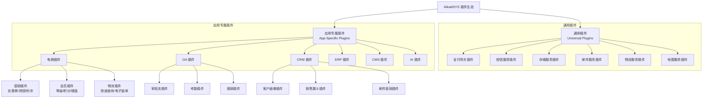
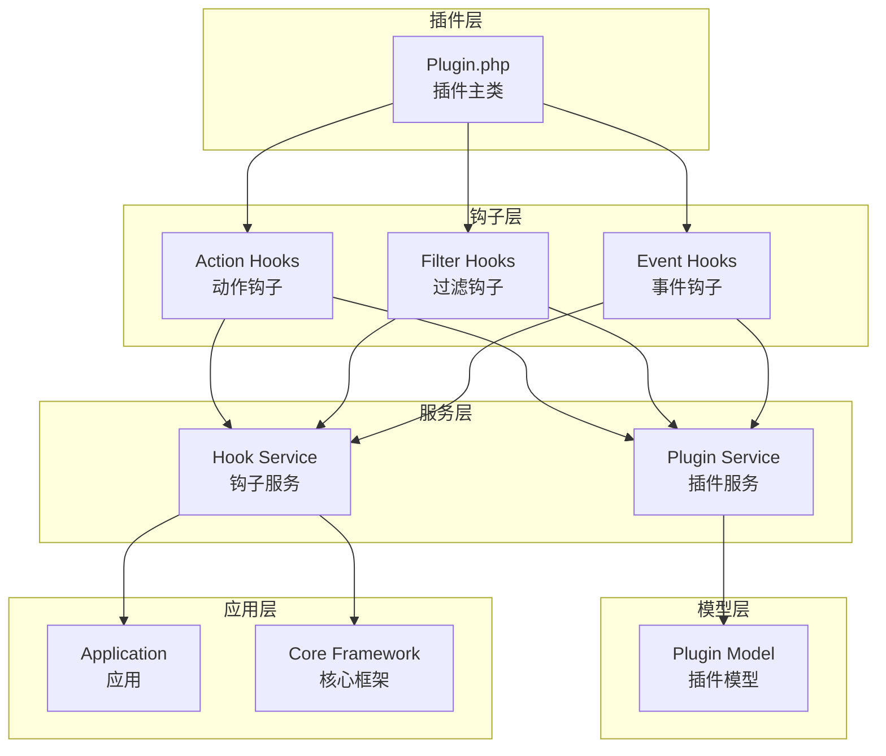
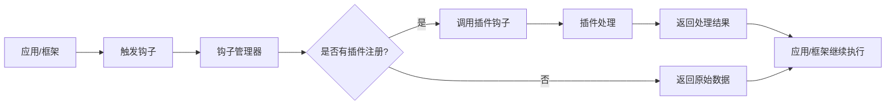
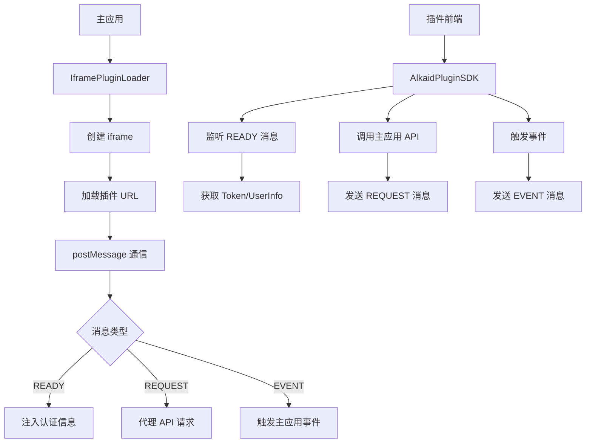
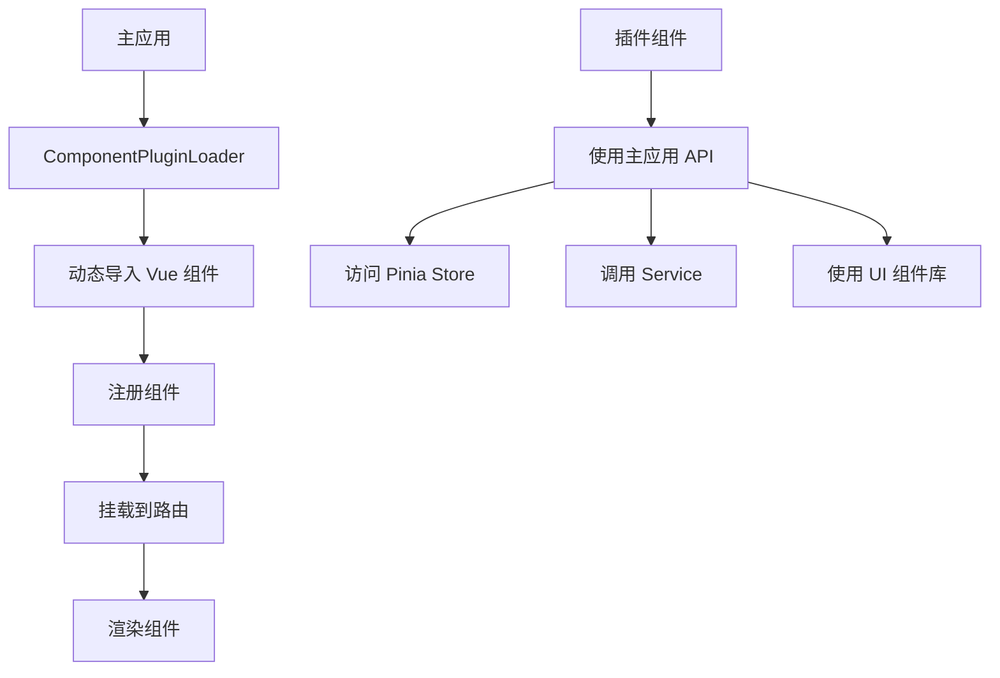

# AlkaidSYS 插件系统设计

## 📋 文档信息

| 项目 | 内容 |
|------|------|
| **文档名称** | AlkaidSYS 插件系统设计 |
| **文档版本** | v2.0 |
| **创建日期** | 2025-01-19 |

## 🎯 插件系统概述

**插件（Plugin）** 是 AlkaidSYS 的第二层架构，提供功能扩展和增强。插件采用**混合加载方案**，根据插件类型选择合适的加载方式，实现灵活的功能扩展。

### 核心特性

1. ✅ **轻量级** - 小巧精悍，专注单一功能
2. ✅ **热插拔** - 无需重启即可安装/卸载
3. ✅ **混合加载** - 支持钩子、iframe、组件三种加载模式
4. ✅ **钩子机制** - 通过钩子扩展功能（官方插件）
5. ✅ **iframe 隔离** - 浏览器原生隔离（第三方插件）
6. ✅ **组件模式** - Vue 组件集成（内部插件）
7. ✅ **依赖管理** - 自动检查和管理依赖
8. ✅ **版本兼容** - 严格的版本兼容性检查
9. ✅ **技术栈无关** - 支持任意前端和后端技术栈

### 混合加载方案

基于 [iframe vs micro-app 深度技术分析](../IFRAME-VS-MICROAPP-ANALYSIS-2025-01-20.md)，AlkaidSYS 采用**混合方案（钩子 + iframe + 组件）**，根据插件类型选择最合适的加载方式：

| 插件类型 | 加载模式 | 隔离级别 | 适用场景 | 性能 | 安全性 |
|---------|---------|---------|---------|------|--------|
| **官方插件** | `isolation_mode: 'none'` | 无隔离 | 支付、短信、存储等通用插件 | ⭐⭐⭐⭐⭐ | ⭐⭐⭐⭐ |
| **内部插件** | `isolation_mode: 'component'` | 组件隔离 | 企业内部定制插件 | ⭐⭐⭐⭐⭐ | ⭐⭐⭐⭐ |
| **第三方插件** | `isolation_mode: 'iframe'` | 完全隔离 | 应用市场第三方插件 | ⭐⭐⭐ | ⭐⭐⭐⭐⭐ |

**核心优势**：
- ✅ **灵活性最高**：支持所有场景，从官方插件到第三方插件
- ✅ **性能可控**：官方插件无额外开销，第三方插件强隔离
- ✅ **安全性可控**：第三方插件使用浏览器原生隔离，最安全
- ✅ **渐进式演进**：可以逐步从钩子机制迁移到 iframe 隔离

## 📦 插件分类体系

### 1. 插件分类架构图



### 2. 通用插件（Universal Plugins）

通用插件可以被所有应用使用，为整个系统提供基础服务。

| 插件类型 | 插件名称 | 核心功能 | 适用场景 |
|---------|---------|---------|---------|
| **支付网关** | 微信支付 | 扫码支付、H5 支付、小程序支付 | 所有需要支付的应用 |
| **支付网关** | 支付宝 | 扫码支付、H5 支付、APP 支付 | 所有需要支付的应用 |
| **支付网关** | Stripe | 信用卡支付、国际支付 | 跨境电商、国际业务 |
| **短信服务** | 阿里云短信 | 短信发送、验证码 | 所有需要短信的应用 |
| **短信服务** | 腾讯云短信 | 短信发送、验证码 | 所有需要短信的应用 |
| **存储服务** | 阿里云 OSS | 文件上传、存储、CDN | 所有需要文件存储的应用 |
| **存储服务** | 七牛云 | 文件上传、存储、CDN | 所有需要文件存储的应用 |
| **邮件服务** | SMTP | 邮件发送、模板 | 所有需要邮件的应用 |
| **邮件服务** | SendGrid | 邮件发送、统计 | 国际业务、营销邮件 |
| **物流服务** | 快递 100 | 快递查询、物流跟踪 | 电商、物流管理 |
| **地图服务** | 高德地图 | 地图显示、定位、路线规划 | 位置服务、配送管理 |

### 3. 应用专属插件（App-Specific Plugins）

应用专属插件只能在特定应用中使用，为应用提供专属功能扩展。

#### 3.1 电商应用插件

| 插件类型 | 插件名称 | 核心功能 | 使用场景 |
|---------|---------|---------|---------|
| **营销插件** | 优惠券 | 满减券、折扣券、兑换券 | 促销活动、用户激励 |
| **营销插件** | 拼团 | 发起拼团、参与拼团、成团规则 | 社交营销、裂变增长 |
| **营销插件** | 秒杀 | 秒杀活动、库存控制、限购 | 限时促销、清库存 |
| **营销插件** | 砍价 | 发起砍价、邀请好友、砍价规则 | 社交营销、拉新 |
| **会员插件** | 会员等级 | 等级体系、升级规则、权益 | 会员管理、用户分层 |
| **会员插件** | 积分系统 | 积分获取、积分消费、积分商城 | 用户激励、忠诚度 |
| **会员插件** | 储值卡 | 充值、消费、赠送 | 预付费、资金沉淀 |
| **物流插件** | 快递查询 | 物流跟踪、签收提醒 | 订单管理、客户服务 |
| **物流插件** | 电子面单 | 面单打印、批量发货 | 发货管理、效率提升 |

#### 3.2 OA 应用插件

| 插件类型 | 插件名称 | 核心功能 | 使用场景 |
|---------|---------|---------|---------|
| **审批流插件** | 请假审批 | 请假申请、审批流程、统计 | 人事管理 |
| **审批流插件** | 报销审批 | 报销申请、审批流程、财务对接 | 财务管理 |
| **审批流插件** | 采购审批 | 采购申请、审批流程、供应商管理 | 采购管理 |
| **考勤插件** | 打卡考勤 | 上下班打卡、GPS 定位、统计 | 考勤管理 |
| **考勤插件** | 排班管理 | 班次设置、排班计划、调班 | 排班管理 |
| **考勤插件** | 加班管理 | 加班申请、加班统计、调休 | 加班管理 |

#### 3.3 CRM 应用插件

| 插件类型 | 插件名称 | 核心功能 | 使用场景 |
|---------|---------|---------|---------|
| **客户画像插件** | 客户标签 | 标签管理、自动打标、标签分析 | 客户分析、精准营销 |
| **客户画像插件** | 行为分析 | 行为跟踪、行为分析、预测 | 客户洞察、销售预测 |
| **销售漏斗插件** | 销售阶段 | 阶段管理、转化率、预测 | 销售管理、业绩分析 |
| **销售漏斗插件** | 销售预测 | 销售预测、目标管理、报表 | 销售计划、目标管理 |
| **邮件营销插件** | 邮件群发 | 邮件模板、群发、统计 | 邮件营销、客户触达 |

## 🏗️ 插件架构设计

### 1. 插件架构图



### 2. 插件目录结构

```
/addon/payment_wechat/               # 微信支付插件
│
├── plugin.json                      # 插件元数据
├── icon.png                         # 插件图标（128x128）
├── cover.png                        # 插件封面（800x400）
├── screenshots/                     # 插件截图
│   ├── screenshot1.png
│   └── screenshot2.png
│
├── app/                             # 后端代码
│   ├── controller/                  # 控制器
│   │   └── Notify.php               # 支付回调
│   ├── service/                     # 服务层
│   │   └── WechatPayService.php    # 微信支付服务
│   ├── model/                       # 模型
│   │   └── PaymentLog.php           # 支付日志
│   └── hooks/                       # 钩子实现
│       ├── PaymentHook.php          # 支付钩子
│       └── RefundHook.php           # 退款钩子
│
├── admin/                           # Admin 前端
│   └── views/
│       └── setting.vue              # 配置页面
│
├── sql/                             # 数据库脚本
│   ├── install.sql                  # 安装脚本
│   └── uninstall.sql                # 卸载脚本
│
├── config/                          # 配置文件
│   └── config.php                   # 插件配置
│
├── lang/                            # 多语言
│   ├── zh-cn.php
│   └── en.php
│
├── docs/                            # 文档
│   ├── README.md
│   └── INSTALL.md
│
└── Plugin.php                       # 插件主类
```

> **环境说明：** 上面的 `sql/install.sql` / `sql/uninstall.sql` 主要用于 **dev/test 环境** 快速初始化和清理插件相关数据库对象，方便本地开发与联调演练。对于 **stage/prod 等正式环境**，所有结构变更必须遵守《数据库演进与迁移策略》（`../03-data-layer/11-database-evolution-and-migration-strategy.md`）和《数据演进蓝皮书》（`../03-data-layer/13-data-evolution-bluebook.md`），通过蓝皮书审批与标准迁移管道执行，插件不得在生产环境中直接执行 DDL 作为安装/卸载的一部分。


### 3. 插件元数据（plugin.json）

#### 3.1 官方插件配置示例（钩子模式）

```json
{
  "key": "payment_wechat",
  "name": "微信支付",
  "type": "plugin",
  "category": "universal",
  "app_key": null,
  "version": "1.0.0",
  "description": "微信支付插件，支持扫码支付、H5 支付、小程序支付、APP 支付等多种支付方式",
  "author": "AlkaidSYS Team",
  "author_url": "https://www.alkaidsys.com",
  "author_email": "support@alkaidsys.com",
  "icon": "icon.png",
  "cover": "cover.png",
  "screenshots": [
    "screenshots/screenshot1.png",
    "screenshots/screenshot2.png"
  ],
  "min_framework_version": "1.0.0",
  "max_framework_version": "2.0.0",
  "min_app_version": null,
  "dependencies": {
    "apps": [],
    "plugins": []
  },
  "price": 199,
  "license": "Commercial",
  "tags": ["支付", "微信", "扫码支付", "H5 支付"],

  "isolation_mode": "none",
  "loader": "HookPluginLoader",

  "install": {
    "sql": "sql/install.sql",
    "config": "config/config.php"
  },
  "uninstall": {
    "sql": "sql/uninstall.sql",
    "keep_data": false
  },
  "hooks": [
    "PaymentCreate",
    "PaymentQuery",
    "PaymentRefund",
    "PaymentNotify"
  ],
  "config": {
    "app_id": "",
    "mch_id": "",
    "api_key": "",
    "cert_path": "",
    "key_path": ""
  }
}
```

#### 3.2 第三方插件配置示例（iframe 模式）

```json
{
  "key": "third_party_crm",
  "name": "第三方 CRM 插件",
  "type": "plugin",
  "category": "app_specific",
  "app_key": "crm",
  "version": "2.0.0",
  "description": "第三方开发的 CRM 插件，提供客户管理、销售漏斗、数据分析等功能",
  "author": "Third Party Developer",
  "author_url": "https://www.example.com",
  "author_email": "dev@example.com",
  "icon": "icon.png",
  "cover": "cover.png",
  "min_framework_version": "1.0.0",
  "max_framework_version": "2.0.0",
  "price": 999,
  "license": "Commercial",
  "tags": ["CRM", "客户管理", "销售"],

  "isolation_mode": "iframe",
  "loader": "IframePluginLoader",
  "iframe_config": {
    "url": "https://crm.example.com/plugin",
    "sandbox": ["allow-scripts", "allow-same-origin", "allow-forms"],
    "backend_url": "https://crm.example.com/api",
    "backend_tech": "python",
    "auth_mode": "jwt"
  },

  "install": {
    "sql": null,
    "config": null
  },
  "uninstall": {
    "sql": null,
    "keep_data": false
  }
}
```

#### 3.3 内部插件配置示例（组件模式）

```json
{
  "key": "custom_dashboard",
  "name": "自定义仪表盘",
  "type": "plugin",
  "category": "internal",
  "app_key": null,
  "version": "1.0.0",
  "description": "企业内部定制的仪表盘插件",
  "author": "Internal Team",
  "author_url": "https://www.company.com",
  "author_email": "internal@company.com",
  "icon": "icon.png",
  "cover": "cover.png",
  "min_framework_version": "1.0.0",
  "max_framework_version": "2.0.0",
  "price": 0,
  "license": "Internal",
  "tags": ["仪表盘", "数据可视化"],

  "isolation_mode": "component",
  "loader": "ComponentPluginLoader",
  "component_config": {
    "component": "CustomDashboard",
    "entry": "resources/views/Dashboard.vue"
  },

  "install": {
    "sql": "sql/install.sql",
    "config": null
  },
  "uninstall": {
    "sql": "sql/uninstall.sql",
    "keep_data": false
  }
}
```

**配置字段说明**：

| 字段 | 类型 | 必填 | 说明 |
|------|------|------|------|
| `isolation_mode` | string | 是 | 隔离模式：`none`（钩子）、`iframe`（iframe 隔离）、`component`（组件） |
| `loader` | string | 是 | 加载器：`HookPluginLoader`、`IframePluginLoader`、`ComponentPluginLoader` |
| `iframe_config` | object | 否 | iframe 模式配置（仅 `isolation_mode: 'iframe'` 时需要） |
| `iframe_config.url` | string | 是 | 插件前端 URL |
| `iframe_config.sandbox` | array | 否 | iframe sandbox 属性，默认 `['allow-scripts', 'allow-same-origin', 'allow-forms']` |
| `iframe_config.backend_url` | string | 否 | 插件后端 API URL（支持异构后端） |
| `iframe_config.backend_tech` | string | 否 | 后端技术栈：`php`、`python`、`go`、`nodejs`、`java` |
| `iframe_config.auth_mode` | string | 否 | 认证模式：`jwt`（默认）、`oauth2` |


警告: Rewrite 请求失败, falling back 到 editor
提示: 更复杂的修改请使用 Editor
> **依赖与版本说明：** 本文中的 `min_framework_version` / `max_framework_version`、`min_app_version`，以及 `dependencies.apps` / `dependencies.plugins` 等字段示例仅用于说明插件元数据的结构。关于应用与插件之间的版本兼容矩阵、依赖冲突解决策略、升级与回滚约束等内容，以 `02-app-plugin-ecosystem` 模块中的“应用与插件依赖与版本策略”设计文档为权威来源，本节不单独形成事实标准。

| `component_config` | object | 否 | 组件模式配置（仅 `isolation_mode: 'component'` 时需要） |
| `component_config.component` | string | 是 | Vue 组件名称 |
| `component_config.entry` | string | 是 | 组件入口文件路径 |

### 4. 插件主类（Plugin.php）

```php
<?php
namespace addon\payment_wechat;

use app\service\core\addon\CorePluginBaseService;
use think\facade\Db;

/**
 * 微信支付插件主类（示例实现）
 *
 * 说明：本示例用于展示支付插件在插件系统中的推荐目录结构、生命周期与钩子集成方式，
 * 实际接入第三方支付时需同时遵守《04-security-performance/11-security-design.md》
 * 与《07-integration-ops/25-system-integration.md》中关于第三方支付、安全与审计的统一规范。
 */
class Plugin extends CorePluginBaseService
{
    /**
     * 插件安装
     */
    public function install(): void
    {
        Db::startTrans();
        try {
            // 1. 执行 SQL 安装脚本
            $this->executeSqlFile('sql/install.sql');

            // 2. 初始化配置
            $this->initConfig();

            // 3. 注册钩子
            $this->registerHooks();

            // 4. 触发安装事件
            event('PluginInstalled', [
                'plugin_key' => 'payment_wechat',
                'version' => '1.0.0'
            ]);

            Db::commit();
        } catch (\Exception $e) {
            Db::rollback();
            throw $e;
        }
    }

    /**
     * 插件卸载
     */
    public function uninstall(): void
    {
        Db::startTrans();
        try {
            // 1. 注销钩子
            $this->unregisterHooks();

            // 2. 执行 SQL 卸载脚本
            $this->executeSqlFile('sql/uninstall.sql');

            // 3. 清理配置
            $this->clearConfig();

            // 4. 触发卸载事件
            event('PluginUninstalled', [
                'plugin_key' => 'payment_wechat'
            ]);

            Db::commit();
        } catch (\Exception $e) {
            Db::rollback();
            throw $e;
        }
    }

    /**
     * 插件启用
     */
    public function enable(): void
    {
        // 注册钩子
        $this->registerHooks();

        // 触发启用事件
        event('PluginEnabled', ['plugin_key' => 'payment_wechat']);
    }

    /**
     * 插件禁用
     */
    public function disable(): void
    {
        // 注销钩子
        $this->unregisterHooks();

        // 触发禁用事件
        event('PluginDisabled', ['plugin_key' => 'payment_wechat']);
    }

    /**
     * 注册钩子
     */
    protected function registerHooks(): void
    {
        // 创建支付钩子
        hook('PaymentCreate', [$this, 'onPaymentCreate']);

        // 查询支付钩子
        hook('PaymentQuery', [$this, 'onPaymentQuery']);

        // 退款钩子
        hook('PaymentRefund', [$this, 'onPaymentRefund']);

        // 支付回调钩子
        hook('PaymentNotify', [$this, 'onPaymentNotify']);
    }

    /**
     * 创建支付钩子处理
     */
    public function onPaymentCreate(array $payment): array
    {
        // 调用微信支付服务
        $service = new \addon\payment_wechat\app\service\WechatPayService();
        $result = $service->createPayment($payment);

        return [
            'payment_id' => $payment['id'],
            'payment_url' => $result['code_url'],
            'qrcode' => $result['qrcode']
        ];
    }

    /**
     * 查询支付钩子处理
     */
    public function onPaymentQuery(array $payment): array
    {
        $service = new \addon\payment_wechat\app\service\WechatPayService();
        return $service->queryPayment($payment['transaction_id']);
    }

    /**
     * 退款钩子处理
     */
    public function onPaymentRefund(array $refund): array
    {
        $service = new \addon\payment_wechat\app\service\WechatPayService();
        return $service->refund($refund);
    }

    /**
     * 支付回调钩子处理
     */
    public function onPaymentNotify(array $data): bool
    {
        $service = new \addon\payment_wechat\app\service\WechatPayService();
        return $service->handleNotify($data);
    }
}
```

## 🔗 钩子机制（Hooks）

> **性能与可观测性说明：** 钩子机制会直接影响请求路径的延迟与稳定性，钩子链路中的异常处理、超时策略与日志上报，应遵守《04-security-performance/10-non-functional-overview.md》和《04-security-performance/15-observability-and-ops-design.md》的统一约束，避免在插件层形成与平台不一致的“局部标准”。


### 1. 钩子系统架构



### 2. 钩子类型

#### 2.1 Action Hooks（动作钩子）

在特定动作执行时触发，不返回值。

```php
// 注册动作钩子
hook('OrderCreated', function($order) {
    // 发送订单创建通知
    sendNotification($order);
});

// 触发动作钩子
do_action('OrderCreated', $order);
```

#### 2.2 Filter Hooks（过滤钩子）

过滤和修改数据，必须返回值。

```php
// 注册过滤钩子
hook('OrderCalculate', function($order) {
    // 应用优惠券折扣
    $order['discount'] = 10;
    $order['total'] -= $order['discount'];
    return $order;
});

// 触发过滤钩子
$order = apply_filter('OrderCalculate', $order);
```

#### 2.3 Event Hooks（事件钩子）

事件监听，支持异步处理。

```php
// 注册事件钩子
event('PaymentSuccess', function($payment) {
    // 异步处理支付成功后的逻辑
    queue('ProcessPaymentSuccess', $payment);
});

// 触发事件钩子
event('PaymentSuccess', $payment);
```

### 3. 钩子优先级

```php
// 注册钩子时指定优先级（数字越小优先级越高）
hook('OrderCalculate', function($order) {
    // 优先级 10
    return $order;
}, 10);

hook('OrderCalculate', function($order) {
    // 优先级 20
    return $order;
}, 20);
```

## 📝 插件开发示例

### 1. 通用插件示例：支付插件

#### 微信支付服务（WechatPayService.php）

```php
<?php
namespace addon\payment_wechat\app\service;

use think\facade\Cache;
use think\facade\Log;

/**
 * 微信支付服务（示例实现）
 *
 * 说明：本示例仅用于说明支付插件的分层结构与调用流程，
 * 实际接入时的签名算法、证书管理、防重放与幂等处理等细节
 * 需以《04-security-performance/11-security-design.md》与
 * 《07-integration-ops/25-system-integration.md》为权威，并优先参考
 * 《08-developer-guides/32-plugin-development-guide.md》中支付插件示例。
 */
class WechatPayService
{
    protected $config;

    public function __construct()
    {
        // 获取插件配置
        $this->config = plugin_config('payment_wechat');
    }

    /**
     * 创建支付
     */
    public function createPayment(array $payment): array
    {
        // 构建支付参数
        $params = [
            'appid' => $this->config['app_id'],
            'mch_id' => $this->config['mch_id'],
            'nonce_str' => $this->getNonceStr(),
            'body' => $payment['subject'],
            'out_trade_no' => $payment['order_no'],
            'total_fee' => $payment['amount'] * 100, // 转换为分
            'spbill_create_ip' => request()->ip(),
            'notify_url' => url('payment_wechat/notify', [], true),
            'trade_type' => 'NATIVE'
        ];

        // 生成签名
        $params['sign'] = $this->generateSign($params);

        // 调用微信支付 API
        $xml = $this->arrayToXml($params);
        $response = $this->httpPost('https://api.mch.weixin.qq.com/pay/unifiedorder', $xml);
        $result = $this->xmlToArray($response);

        if ($result['return_code'] !== 'SUCCESS' || $result['result_code'] !== 'SUCCESS') {
            throw new \Exception('微信支付创建失败：' . ($result['err_code_des'] ?? '未知错误'));
        }

        // 生成二维码
        $qrcode = $this->generateQrcode($result['code_url']);

        return [
            'code_url' => $result['code_url'],
            'qrcode' => $qrcode
        ];
    }

    /**
     * 查询支付
     */
    public function queryPayment(string $transactionId): array
    {
        $params = [
            'appid' => $this->config['app_id'],
            'mch_id' => $this->config['mch_id'],
            'transaction_id' => $transactionId,
            'nonce_str' => $this->getNonceStr()
        ];

        $params['sign'] = $this->generateSign($params);

        $xml = $this->arrayToXml($params);
        $response = $this->httpPost('https://api.mch.weixin.qq.com/pay/orderquery', $xml);
        $result = $this->xmlToArray($response);

        return [
            'status' => $result['trade_state'],
            'transaction_id' => $result['transaction_id'],
            'time_end' => $result['time_end']
        ];
    }

    /**
     * 退款
     */
    public function refund(array $refund): array
    {
        $params = [
            'appid' => $this->config['app_id'],
            'mch_id' => $this->config['mch_id'],
            'nonce_str' => $this->getNonceStr(),
            'transaction_id' => $refund['transaction_id'],
            'out_refund_no' => $refund['refund_no'],
            'total_fee' => $refund['total_amount'] * 100,
            'refund_fee' => $refund['refund_amount'] * 100
        ];

        $params['sign'] = $this->generateSign($params);

        $xml = $this->arrayToXml($params);
        $response = $this->httpPost(
            'https://api.mch.weixin.qq.com/secapi/pay/refund',
            $xml,
            true // 使用证书
        );
        $result = $this->xmlToArray($response);

        if ($result['return_code'] !== 'SUCCESS' || $result['result_code'] !== 'SUCCESS') {
            throw new \Exception('微信退款失败：' . ($result['err_code_des'] ?? '未知错误'));
        }

        return [
            'refund_id' => $result['refund_id'],
            'refund_fee' => $result['refund_fee'] / 100
        ];
    }

    /**
     * 处理支付回调
     */
    public function handleNotify(array $data): bool
    {
        // 验证签名
        if (!$this->verifySign($data)) {
            Log::error('微信支付回调签名验证失败');
            return false;
        }

        // 查询订单状态
        $payment = Db::name('payments')
            ->where('order_no', $data['out_trade_no'])
            ->find();

        if (!$payment) {
            Log::error('微信支付回调订单不存在：' . $data['out_trade_no']);
            return false;
        }

        // 更新支付状态
        Db::name('payments')->where('id', $payment['id'])->update([
            'status' => 'success',
            'transaction_id' => $data['transaction_id'],
            'paid_at' => strtotime($data['time_end'])
        ]);

        // 触发支付成功事件
        event('PaymentSuccess', $payment);

        return true;
    }

    /**
     * 生成签名
     */
    protected function generateSign(array $params): string
    {
        ksort($params);
        $string = urldecode(http_build_query($params));
        $string .= '&key=' . $this->config['api_key'];
        return strtoupper(md5($string));
    }

    /**
     * 生成随机字符串
     */
    protected function getNonceStr(): string
    {
        return md5(uniqid() . mt_rand());
    }
}
```

### 2. 应用专属插件示例：电商优惠券插件

#### 优惠券服务（CouponService.php）

```php
<?php
namespace addon\ecommerce_coupon\app\service;

use addon\ecommerce_coupon\app\model\Coupon;
use addon\ecommerce_coupon\app\model\UserCoupon;
use think\facade\Db;

/**
 * 优惠券服务
 */
class CouponService
{
    // 优惠券类型
    const TYPE_FULL_REDUCTION = 1; // 满减券
    const TYPE_DISCOUNT = 2;       // 折扣券
    const TYPE_EXCHANGE = 3;       // 兑换券

    /**
     * 创建优惠券
     */
    public function create(array $data): int
    {
        Db::startTrans();
        try {
            $coupon = Coupon::create([
                'name' => $data['name'],
                'type' => $data['type'],
                'discount' => $data['discount'],
                'min_amount' => $data['min_amount'] ?? 0,
                'total_count' => $data['total_count'],
                'per_user_limit' => $data['per_user_limit'] ?? 1,
                'start_time' => $data['start_time'],
                'end_time' => $data['end_time'],
                'status' => 1,
                'created_at' => time()
            ]);

            Db::commit();
            return $coupon->id;
        } catch (\Exception $e) {
            Db::rollback();
            throw $e;
        }
    }

    /**
     * 领取优惠券
     */
    public function receive(int $couponId, int $userId): bool
    {
        Db::startTrans();
        try {
            $coupon = Coupon::find($couponId);
            if (!$coupon) {
                throw new \Exception('优惠券不存在');
            }

            // 检查是否已领取
            $receivedCount = UserCoupon::where('coupon_id', $couponId)
                ->where('user_id', $userId)
                ->count();

            if ($receivedCount >= $coupon->per_user_limit) {
                throw new \Exception('已达到领取上限');
            }

            // 检查库存
            if ($coupon->received_count >= $coupon->total_count) {
                throw new \Exception('优惠券已领完');
            }

            // 创建用户优惠券
            UserCoupon::create([
                'coupon_id' => $couponId,
                'user_id' => $userId,
                'status' => 0, // 未使用
                'received_at' => time()
            ]);

            // 更新已领取数量
            $coupon->save(['received_count' => $coupon->received_count + 1]);

            Db::commit();
            return true;
        } catch (\Exception $e) {
            Db::rollback();
            throw $e;
        }
    }

    /**
     * 计算优惠金额
     */
    public function calculateDiscount(Coupon $coupon, float $orderAmount): float
    {
        // 检查最低消费金额
        if ($orderAmount < $coupon->min_amount) {
            return 0;
        }

        $discount = 0;

        switch ($coupon->type) {
            case self::TYPE_FULL_REDUCTION:
                // 满减券
                $discount = $coupon->discount;
                break;

            case self::TYPE_DISCOUNT:
                // 折扣券
                $discount = $orderAmount * (1 - $coupon->discount / 10);
                break;

            case self::TYPE_EXCHANGE:
                // 兑换券
                $discount = $orderAmount;
                break;
        }

        return $discount;
    }
}
```

## 🔌 iframe 加载机制（第三方插件）

### 1. iframe 加载器架构



### 2. IframePluginLoader 实现

详细实现请参考 [iframe vs micro-app 深度技术分析](../IFRAME-VS-MICROAPP-ANALYSIS-2025-01-20.md#技术实现细节)。

**核心特性**：
- ✅ **浏览器原生隔离**：使用 iframe sandbox 属性，最强安全隔离
- ✅ **postMessage 通信**：双向通信机制，支持请求-响应模式
- ✅ **JWT Token 认证**：主应用生成 Token，插件后端验证
- ✅ **技术栈无关**：支持任意前端框架（Vue、React、Angular、原生 HTML）
- ✅ **后端异构支持**：支持 Python、Go、Node.js、Java 等异构后端

### 3. 插件 SDK（alkaid-plugin-sdk.js）

```javascript
// 插件端使用示例
import AlkaidSDK from '@/alkaid-plugin-sdk'

// 等待 SDK 就绪
window.addEventListener('alkaid:ready', (event) => {
  const { token, userInfo, theme } = event.detail
  console.log('插件已就绪', userInfo)
})

// 调用主应用 API
const data = await AlkaidSDK.request('/api/plugin/data', {
  method: 'GET'
})

// 触发事件
AlkaidSDK.emit('custom:event', { data: 'value' })
```

> **安全说明：** 通过 iframe 与异构后端集成时，JWT Token 的签发与验证、跨域策略、回调接口暴露范围等，必须遵守《04-security-performance/11-security-design.md》和《04-security-performance/14-security-baseline-and-dependency-upgrade.md》中的统一要求；示例中的域名、鉴权逻辑仅用于说明架构形态，不建议直接复制到生产环境。


### 4. 后端异构集成

**架构示例**（Python AI 插件）：

```
AlkaidSYS 主应用 (ThinkPHP 8.0)
    ↓ JWT Token 认证
AI 插件后端 (Python + FastAPI)
    ↓
AI 插件前端 (React)
```

**认证流程**：
1. 主应用生成 JWT Token
2. 通过 postMessage 传递给插件前端
3. 插件前端携带 Token 访问插件后端
4. 插件后端验证 Token（共享密钥）

**数据访问**：
- 插件后端通过 API 调用主应用接口
- 主应用提供统一的数据访问 API

---

## 🧩 组件加载机制（内部插件）

### 1. 组件加载器架构



### 2. 组件插件示例

```vue
<!-- /addon/custom_dashboard/resources/views/Dashboard.vue -->
<template>
  <div class="custom-dashboard">
    <a-card title="自定义仪表盘">
      <a-row :gutter="16">
        <a-col :span="6">
          <a-statistic title="总用户数" :value="stats.totalUsers" />
        </a-col>
        <a-col :span="6">
          <a-statistic title="今日新增" :value="stats.todayUsers" />
        </a-col>
      </a-row>
    </a-card>
  </div>
</template>

<script setup lang="ts">
import { ref, onMounted } from 'vue'
import { useUserStore } from '@/stores/user'
import { getDashboardStats } from '@/api/dashboard'

const userStore = useUserStore()
const stats = ref({
  totalUsers: 0,
  todayUsers: 0
})

onMounted(async () => {
  stats.value = await getDashboardStats()
})
</script>
```

**核心特性**：
- ✅ **完全集成**：可以访问主应用的所有 API、Store、组件库
- ✅ **性能最优**：无额外加载开销，与主应用共享资源
- ✅ **开发体验好**：与主应用开发体验一致，调试方便
- ✅ **适用场景**：企业内部定制插件、可信代码

---

## 📊 三种加载模式对比

| 维度 | 钩子模式 | 组件模式 | iframe 模式 |
|------|---------|---------|------------|
| **隔离级别** | 无隔离 | 组件隔离 | 完全隔离 |
| **安全性** | ⭐⭐⭐⭐ | ⭐⭐⭐⭐ | ⭐⭐⭐⭐⭐ |
| **性能** | ⭐⭐⭐⭐⭐ | ⭐⭐⭐⭐⭐ | ⭐⭐⭐ |
| **技术栈无关** | ❌ 仅 PHP | ❌ 仅 Vue 3 | ✅ 任意技术栈 |
| **后端异构** | ❌ 不支持 | ❌ 不支持 | ✅ 支持 |
| **开发体验** | ⭐⭐⭐⭐ | ⭐⭐⭐⭐⭐ | ⭐⭐⭐ |
| **调试难度** | ⭐⭐⭐⭐⭐ | ⭐⭐⭐⭐⭐ | ⭐⭐⭐ |
| **适用场景** | 官方插件 | 内部插件 | 第三方插件 |

---

## 🗺️ 实施路线图

基于 [iframe vs micro-app 深度技术分析](../IFRAME-VS-MICROAPP-ANALYSIS-2025-01-20.md#实施路线图)，插件系统的实施分为 4 个阶段：

### 阶段 1：当前（0-3 个月）- 完善钩子机制

- ✅ 保持现有钩子机制
- 🔨 实现异步钩子支持
- 🔨 实现钩子优先级
- 🔨 实现钩子性能监控
- **预计工作量**：2-3 周

### 阶段 2：中期（3-6 个月）- 引入 iframe 隔离

- 🔨 实现 IframePluginLoader 组件
- 🔨 实现 postMessage 通信机制
- 🔨 开发插件 SDK（alkaid-plugin-sdk.js）
- 🔨 开发插件开发脚手架
- 🔨 编写插件开发文档
- 🔨 开发 2-3 个示例插件
- **预计工作量**：4-6 周

### 阶段 3：长期（6-12 个月）- 支持后端异构

- 🔮 设计后端异构集成方案
- 🔮 实现 JWT Token 认证机制
- 🔮 开发后端插件 SDK
- 🔮 支持 Python/Go/Node.js 后端
- 🔮 完善应用市场
- **预计工作量**：8-12 周

### 阶段 4：未来（12+ 个月）- 性能优化

- 🔮 根据需要考虑 micro-app 或其他方案
- 🔮 实现 iframe 预加载和缓存
- 🔮 优化通信性能
- 🔮 优化开发体验
- **预计工作量**：待定

---

## 🆚 与 NIUCLOUD 对比

| 特性 | AlkaidSYS | NIUCLOUD | 优势 |
|------|-----------|----------|------|
| **插件分类** | 通用插件 + 应用专属插件 | 不明确 | ✅ 更清晰 |
| **加载模式** | 钩子 + iframe + 组件（混合方案） | 仅钩子 | ✅ 更灵活 |
| **钩子机制** | 完整的钩子系统（Action/Filter/Event） | 基础钩子 | ✅ 更强大 |
| **第三方插件** | iframe 隔离，浏览器原生安全 | 不支持 | ✅ 更安全 |
| **技术栈无关** | 支持任意前端和后端技术栈 | 仅 PHP + Vue | ✅ 更开放 |
| **后端异构** | 支持 Python/Go/Node.js/Java | 不支持 | ✅ 更强大 |
| **依赖管理** | 自动检查和管理依赖 | 基础检查 | ✅ 更完善 |
| **版本兼容** | 严格的版本兼容性检查 | 基础检查 | ✅ 更安全 |
| **代码示例** | 多场景完整示例 | 基础示例 | ✅ 更丰富 |

---

**最后更新**: 2025-01-20
**文档版本**: v2.0（基于 iframe vs micro-app 分析优化）
**维护者**: AlkaidSYS 架构团队

