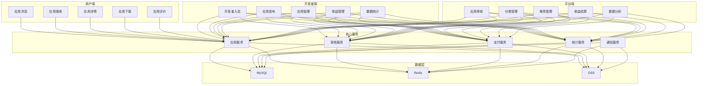
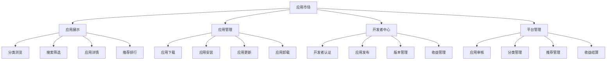
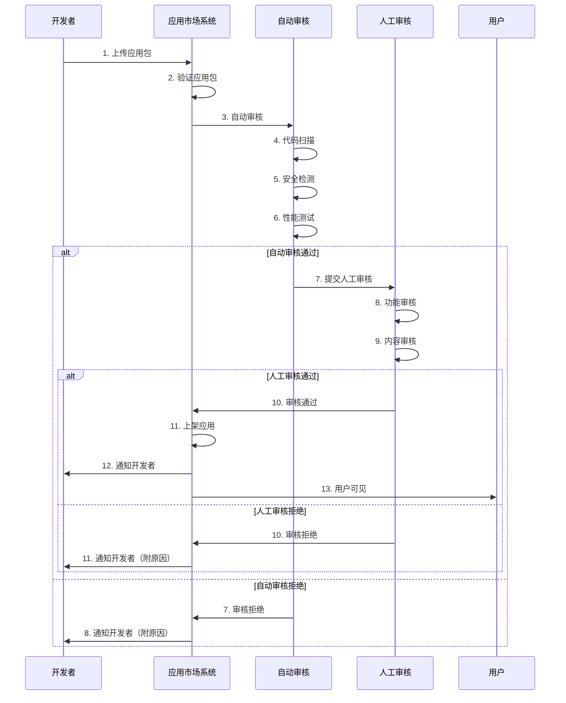
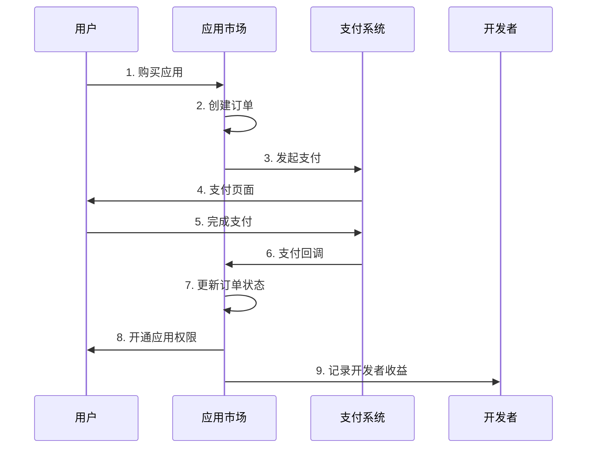

# AlkaidSYS 应用市场设计

## 📋 文档信息

| 项目 | 内容 |
|------|------|
| **文档名称** | AlkaidSYS 应用市场设计 |
| **文档版本** | v1.0 |
| **创建日期** | 2025-01-19 |

## 🎯 应用市场概述

**应用市场（Application Market）** 是 AlkaidSYS 生态系统的核心组成部分，为用户提供丰富的应用选择，为开发者提供应用发布和盈利平台。

### 核心目标

1. ✅ **用户视角** - 方便快捷地发现、下载、安装应用
2. ✅ **开发者视角** - 简单高效地发布、管理、盈利应用
3. ✅ **平台视角** - 构建健康的应用生态，保证应用质量

### 核心功能

- 🔍 应用浏览和搜索
- 📦 应用下载和安装
- 💰 应用购买和支付
- ⭐ 应用评价和反馈
- 📊 应用统计和分析
- 👨‍💻 开发者入驻和认证
- 📝 应用发布和审核
- 💵 收益管理和分成

## 🏗️ 应用市场架构

### 1. 整体架构图



### 2. 功能模块图



## 📊 应用分类体系

### 1. 应用分类

| 一级分类 | 二级分类 | 说明 |
|---------|---------|------|
| **电商类** | B2C 商城、B2B 平台、跨境电商、社交电商 | 电子商务相关应用 |
| **办公类** | OA 办公、项目管理、协同办公、知识管理 | 企业办公相关应用 |
| **客户管理类** | 销售 CRM、服务 CRM、营销 CRM | 客户关系管理应用 |
| **企业资源类** | 生产 ERP、财务 ERP、供应链 ERP | 企业资源计划应用 |
| **内容管理类** | 新闻 CMS、博客 CMS、知识库 CMS | 内容管理系统应用 |
| **智能应用类** | AI 客服、AI 分析、AI 推荐 | 人工智能相关应用 |

### 2. 应用标签

```json
{
  "tags": [
    "电商", "商城", "B2C", "B2B",
    "办公", "OA", "项目管理", "协同",
    "CRM", "客户管理", "销售", "服务",
    "ERP", "生产", "财务", "供应链",
    "CMS", "内容管理", "新闻", "博客",
    "AI", "人工智能", "客服", "分析"
  ]
}
```

## 🔄 应用发布流程

### 1. 发布流程图



### 2. 发布步骤

#### 步骤 1：开发者上传应用

```php
<?php
namespace app\service\market;

use think\facade\Filesystem;
use think\facade\Db;

/**
 * 应用发布服务
 */
class AppPublishService
{
    /**
     * 上传应用包
     */
    public function uploadApp(array $file, int $developerId): array
    {
        Db::startTrans();
        try {
            // 1. 验证文件格式（必须是 .zip）
            if ($file['ext'] !== 'zip') {
                throw new \Exception('应用包必须是 ZIP 格式');
            }
            
            // 2. 验证文件大小（不超过 100MB）
            if ($file['size'] > 100 * 1024 * 1024) {
                throw new \Exception('应用包大小不能超过 100MB');
            }
            
            // 3. 保存文件到临时目录
            $tempPath = runtime_path('temp/apps/');
            $filename = md5(uniqid()) . '.zip';
            $filepath = $tempPath . $filename;
            
            if (!move_uploaded_file($file['tmp_name'], $filepath)) {
                throw new \Exception('文件上传失败');
            }
            
            // 4. 解压应用包
            $extractPath = $tempPath . md5(uniqid()) . '/';
            $zip = new \ZipArchive();
            if ($zip->open($filepath) !== true) {
                throw new \Exception('应用包解压失败');
            }
            $zip->extractTo($extractPath);
            $zip->close();
            
            // 5. 读取应用元数据
            $manifestPath = $extractPath . 'manifest.json';
            if (!file_exists($manifestPath)) {
                throw new \Exception('应用包缺少 manifest.json 文件');
            }
            
            $manifest = json_decode(file_get_contents($manifestPath), true);
            if (!$manifest) {
                throw new \Exception('manifest.json 格式错误');
            }
            
            // 6. 验证应用元数据
            $this->validateManifest($manifest);
            
            // 7. 检查应用是否已存在
            $existingApp = Db::name('applications')
                ->where('key', $manifest['key'])
                ->where('developer_id', $developerId)
                ->find();
            
            if ($existingApp) {
                // 检查版本号
                if (version_compare($manifest['version'], $existingApp['version'], '<=')) {
                    throw new \Exception('新版本号必须大于当前版本号');
                }
            }
            
            // 8. 上传应用包到 OSS
            $ossPath = 'apps/' . $manifest['key'] . '/' . $manifest['version'] . '.zip';
            $ossUrl = $this->uploadToOss($filepath, $ossPath);

            // 8.1 计算包哈希（SHA-256）
            $packageHash = hash_file('sha256', $filepath);

            // 9. 创建应用记录
            $appId = Db::name('applications')->insertGetId([
                'developer_id' => $developerId,
                'key' => $manifest['key'],
                'name' => $manifest['name'],
                'type' => $manifest['type'],
                'category' => $manifest['category'],
                'version' => $manifest['version'],
                'description' => $manifest['description'],
                'icon' => $manifest['icon'],
                'cover' => $manifest['cover'],
                'screenshots' => json_encode($manifest['screenshots']),
                'price' => $manifest['price'],
                'license' => $manifest['license'],
                'tags' => json_encode($manifest['tags']),
                'package_url' => $ossUrl,
                'package_size' => $file['size'],
                'package_hash' => $packageHash,
                'status' => 0, // 待审核
                'created_at' => time()
            ]);
            
            // 10. 创建版本记录
            Db::name('app_versions')->insert([
                'app_id' => $appId,
                'version' => $manifest['version'],
                'package_url' => $ossUrl,
                'package_size' => $file['size'],
                'package_hash' => $packageHash,
                'changelog' => $manifest['changelog'] ?? '',
                'status' => 0, // 待审核
                'created_at' => time()
            ]);
            
            // 11. 提交自动审核
            $this->submitAutoReview($appId);
            
            // 12. 清理临时文件
            $this->cleanupTemp($filepath, $extractPath);
            
            Db::commit();
            
            return [
                'app_id' => $appId,
                'status' => 'pending_review',
                'message' => '应用已提交审核，请耐心等待'
            ];
            
        } catch (\Exception $e) {
            Db::rollback();
            throw $e;
        }
    }
    
    /**
     * 验证应用元数据
     */
    protected function validateManifest(array $manifest): void
    {
        $required = ['key', 'name', 'type', 'category', 'version', 'description'];
        
        foreach ($required as $field) {
            if (empty($manifest[$field])) {
                throw new \Exception("manifest.json 缺少必填字段：{$field}");
            }
        }
        
        // 验证应用 key 格式（只能包含字母、数字、下划线）
        if (!preg_match('/^[a-z0-9_]+$/', $manifest['key'])) {
            throw new \Exception('应用 key 格式错误，只能包含小写字母、数字、下划线');
        }
        
        // 验证版本号格式（必须是 x.y.z 格式）
        if (!preg_match('/^\d+\.\d+\.\d+$/', $manifest['version'])) {
            throw new \Exception('版本号格式错误，必须是 x.y.z 格式');
        }
    }
}
```

#### 步骤 2：自动审核

```php
<?php
namespace app\service\market;

use think\facade\Db;

/**
 * 应用自动审核服务
 */
class AppAutoReviewService
{
    /**
     * 自动审核
     */
    public function review(int $appId): array
    {
        $app = Db::name('applications')->find($appId);
        if (!$app) {
            throw new \Exception('应用不存在');
        }
        
        $result = [
            'app_id' => $appId,
            'passed' => true,
            'issues' => []
        ];
        
        // 1. 代码扫描
        $codeIssues = $this->scanCode($app);
        if (!empty($codeIssues)) {
            $result['passed'] = false;
            $result['issues'] = array_merge($result['issues'], $codeIssues);
        }
        
        // 2. 安全检测
        $securityIssues = $this->checkSecurity($app);
        if (!empty($securityIssues)) {
            $result['passed'] = false;
            $result['issues'] = array_merge($result['issues'], $securityIssues);
        }
        
        // 3. 性能测试
        $performanceIssues = $this->testPerformance($app);
        if (!empty($performanceIssues)) {
            $result['passed'] = false;
            $result['issues'] = array_merge($result['issues'], $performanceIssues);
        }
        
        // 4. 更新审核状态
        if ($result['passed']) {
            // 自动审核通过，提交人工审核
            Db::name('applications')->where('id', $appId)->update([
                'status' => 1, // 待人工审核
                'auto_review_at' => time()
            ]);
            
            // 通知人工审核员
            $this->notifyManualReviewer($appId);
        } else {
            // 自动审核拒绝
            Db::name('applications')->where('id', $appId)->update([
                'status' => -1, // 审核拒绝
                'reject_reason' => json_encode($result['issues']),
                'auto_review_at' => time()
            ]);
            
            // 通知开发者
            $this->notifyDeveloper($appId, 'rejected', $result['issues']);
        }
        
        return $result;
    }
    
    /**
     * 代码扫描
     */
    protected function scanCode(array $app): array
    {
        $issues = [];
        
        // 下载应用包
        $packagePath = $this->downloadPackage($app['package_url']);
        
        // 解压应用包
        $extractPath = $this->extractPackage($packagePath);
        
        // 扫描危险函数
        $dangerousFunctions = ['eval', 'exec', 'system', 'passthru', 'shell_exec'];
        $files = $this->scanDirectory($extractPath, '*.php');
        
        foreach ($files as $file) {
            $content = file_get_contents($file);
            foreach ($dangerousFunctions as $func) {
                if (strpos($content, $func . '(') !== false) {
                    $issues[] = [
                        'type' => 'code',
                        'level' => 'error',
                        'message' => "检测到危险函数：{$func}",
                        'file' => str_replace($extractPath, '', $file)
                    ];
                }
            }
        }
        
        // 清理临时文件
        $this->cleanupTemp($packagePath, $extractPath);
        
        return $issues;
    }
    
    /**
     * 安全检测
     */
    protected function checkSecurity(array $app): array
    {
        $issues = [];
        
        // 检测 SQL 注入风险
        // 检测 XSS 风险
        // 检测 CSRF 风险
        // ...
        
        return $issues;
    }
    
    /**
     * 性能测试
     */
    protected function testPerformance(array $app): array
    {
        $issues = [];
        
        // 检测数据库查询性能
        // 检测内存使用
        // 检测响应时间
        // ...
        
        return $issues;
    }
}
```

#### 步骤 3：人工审核

```php
<?php
namespace app\service\market;

use think\facade\Db;

/**
 * 应用人工审核服务
 */
class AppManualReviewService
{
    /**
     * 人工审核
     */
    public function review(int $appId, int $reviewerId, int $action, string $reason = ''): bool
    {
        Db::startTrans();
        try {
            $app = Db::name('applications')->find($appId);
            if (!$app) {
                throw new \Exception('应用不存在');
            }
            
            if ($app['status'] != 1) {
                throw new \Exception('应用状态不正确');
            }
            
            // 创建审核记录
            Db::name('app_reviews')->insert([
                'app_id' => $appId,
                'reviewer_id' => $reviewerId,
                'action' => $action, // 1-通过 2-拒绝
                'reason' => $reason,
                'created_at' => time()
            ]);
            
            if ($action == 1) {
                // 审核通过，上架应用
                Db::name('applications')->where('id', $appId)->update([
                    'status' => 2, // 已上架
                    'published_at' => time()
                ]);
                
                // 通知开发者
                $this->notifyDeveloper($appId, 'approved');
                
                // 触发应用上架事件
                event('AppPublished', ['app_id' => $appId]);
            } else {
                // 审核拒绝
                Db::name('applications')->where('id', $appId)->update([
                    'status' => -1, // 审核拒绝
                    'reject_reason' => $reason
                ]);
                
                // 通知开发者
                $this->notifyDeveloper($appId, 'rejected', $reason);
            }
            
            Db::commit();
            return true;
        } catch (\Exception $e) {
            Db::rollback();
            throw $e;
        }
    }
}
```

## 📱 应用详情页设计

### 1. 详情页布局

```
┌─────────────────────────────────────────────────────────┐
│  应用图标  应用名称                          [下载/购买] │
│           开发者 | 分类 | 版本 | 更新时间              │
├─────────────────────────────────────────────────────────┤
│  ⭐⭐⭐⭐⭐ 4.8 分 (1,234 评价)                        │
├─────────────────────────────────────────────────────────┤
│  [应用截图轮播]                                         │
├─────────────────────────────────────────────────────────┤
│  应用简介                                               │
│  这是一个功能完整的电子商城应用...                      │
├─────────────────────────────────────────────────────────┤
│  应用信息                                               │
│  • 版本：1.0.0                                          │
│  • 大小：15.6 MB                                        │
│  • 更新时间：2025-01-19                                 │
│  • 兼容版本：AlkaidSYS 1.0.0+                          │
│  • 许可证：MIT                                          │
├─────────────────────────────────────────────────────────┤
│  更新日志                                               │
│  v1.0.0 (2025-01-19)                                    │
│  • 初始版本发布                                         │
│  • 支持商品管理                                         │
│  • 支持订单管理                                         │
├─────────────────────────────────────────────────────────┤
│  用户评价                                               │
│  ⭐⭐⭐⭐⭐ 张三：非常好用的应用！                      │
│  ⭐⭐⭐⭐☆ 李四：功能强大，但有些复杂                  │
└─────────────────────────────────────────────────────────┘
```

### 2. 详情页 API

```php
<?php
namespace app\adminapi\controller\market;

use app\service\market\AppService;

/**
 * 应用市场控制器
 */
class App
{
    /**
     * 获取应用详情
     */
    public function detail()
    {
        $appId = input('id/d', 0);
        
        $service = new AppService();
        $app = $service->getDetail($appId);
        
        return success($app);
    }
}
```

```php
<?php
namespace app\service\market;

use think\facade\Db;

/**
 * 应用服务
 */
class AppService
{
    /**
     * 获取应用详情
     */
    public function getDetail(int $appId): array
    {
        // 获取应用基本信息
        $app = Db::name('applications')
            ->alias('a')
            ->leftJoin('developers d', 'a.developer_id = d.id')
            ->field('a.*, d.name as developer_name, d.avatar as developer_avatar')
            ->where('a.id', $appId)
            ->find();
        
        if (!$app) {
            throw new \Exception('应用不存在');
        }
        
        // 获取应用评分
        $rating = Db::name('app_reviews')
            ->where('app_id', $appId)
            ->avg('rating');
        
        $app['rating'] = round($rating, 1);
        
        // 获取评价数量
        $app['review_count'] = Db::name('app_reviews')
            ->where('app_id', $appId)
            ->count();
        
        // 获取下载数量
        $app['download_count'] = Db::name('app_downloads')
            ->where('app_id', $appId)
            ->count();
        
        // 获取版本历史
        $app['versions'] = Db::name('app_versions')
            ->where('app_id', $appId)
            ->order('created_at', 'desc')
            ->limit(5)
            ->select()
            ->toArray();
        
        // 获取最新评价
        $app['reviews'] = Db::name('app_reviews')
            ->alias('r')
            ->leftJoin('users u', 'r.user_id = u.id')
            ->field('r.*, u.nickname, u.avatar')
            ->where('r.app_id', $appId)
            ->order('r.created_at', 'desc')
            ->limit(10)
            ->select()
            ->toArray();
        
        // 增加浏览次数
        Db::name('applications')
            ->where('id', $appId)
            ->inc('view_count')
            ->update();
        
        return $app;
    }
}
```

## 💰 收费机制

### 1. 收费模式

| 收费模式 | 说明 | 适用场景 |
|---------|------|---------|
| **免费** | 完全免费 | 开源应用、公益应用 |
| **一次性付费** | 购买后永久使用 | 工具类应用、小型应用 |
| **订阅制** | 按月/年订阅 | SAAS 应用、持续服务 |
| **免费试用 + 付费** | 试用期后付费 | 复杂应用、企业应用 |

### 2. 分成比例

| 应用价格 | 平台分成 | 开发者分成 |
|---------|---------|-----------|
| ≤ 99 元 | 30% | 70% |
| 100-499 元 | 25% | 75% |
| 500-999 元 | 20% | 80% |
| ≥ 1000 元 | 15% | 85% |

### 3. 支付流程



## 💾 数据库表设计

### 1. 应用表（applications）

```sql
CREATE TABLE `applications` (
  `id` int(11) unsigned NOT NULL AUTO_INCREMENT COMMENT '应用 ID',
  `developer_id` int(11) unsigned NOT NULL COMMENT '开发者 ID',
  `key` varchar(50) NOT NULL COMMENT '应用唯一标识',
  `name` varchar(100) NOT NULL COMMENT '应用名称',
  `type` varchar(20) NOT NULL DEFAULT 'app' COMMENT '类型：app-应用',
  `category` varchar(50) NOT NULL COMMENT '分类',
  `version` varchar(20) NOT NULL COMMENT '当前版本',
  `description` text COMMENT '应用描述',
  `icon` varchar(255) DEFAULT NULL COMMENT '应用图标',
  `cover` varchar(255) DEFAULT NULL COMMENT '应用封面',
  `screenshots` text COMMENT '应用截图（JSON）',
  `price` decimal(10,2) NOT NULL DEFAULT '0.00' COMMENT '价格',
  `price_type` tinyint(1) NOT NULL DEFAULT '1' COMMENT '收费类型：1-免费 2-一次性 3-订阅',
  `license` varchar(50) DEFAULT NULL COMMENT '许可证',
  `tags` varchar(500) DEFAULT NULL COMMENT '标签（JSON）',
  `package_url` varchar(500) DEFAULT NULL COMMENT '应用包地址',
  `package_size` bigint(20) DEFAULT '0' COMMENT '应用包大小（字节）',
  `package_hash` varchar(64) DEFAULT NULL COMMENT 'SHA-256 包哈希',
  `min_framework_version` varchar(20) DEFAULT NULL COMMENT '最低框架版本',
  `max_framework_version` varchar(20) DEFAULT NULL COMMENT '最高框架版本',
  `status` tinyint(1) NOT NULL DEFAULT '0' COMMENT '状态：0-待审核 1-待人工审核 2-已上架 -1-审核拒绝 -2-已下架',
  `reject_reason` text COMMENT '拒绝原因',
  `view_count` int(11) NOT NULL DEFAULT '0' COMMENT '浏览次数',
  `download_count` int(11) NOT NULL DEFAULT '0' COMMENT '下载次数',
  `rating` decimal(3,1) NOT NULL DEFAULT '0.0' COMMENT '评分',
  `review_count` int(11) NOT NULL DEFAULT '0' COMMENT '评价数量',
  `auto_review_at` int(11) DEFAULT NULL COMMENT '自动审核时间',
  `published_at` int(11) DEFAULT NULL COMMENT '发布时间',
  `created_at` int(11) NOT NULL COMMENT '创建时间',
  `updated_at` int(11) DEFAULT NULL COMMENT '更新时间',
  PRIMARY KEY (`id`),
  UNIQUE KEY `uk_key` (`key`),
  KEY `idx_developer_id` (`developer_id`),
  KEY `idx_category` (`category`),
  KEY `idx_status` (`status`)
) ENGINE=InnoDB DEFAULT CHARSET=utf8mb4 COMMENT='应用表';
```

### 2. 应用版本表（app_versions）

```sql
CREATE TABLE `app_versions` (
  `id` int(11) unsigned NOT NULL AUTO_INCREMENT COMMENT '版本 ID',
  `app_id` int(11) unsigned NOT NULL COMMENT '应用 ID',
  `version` varchar(20) NOT NULL COMMENT '版本号',
  `package_url` varchar(500) DEFAULT NULL COMMENT '应用包地址',
  `package_size` bigint(20) DEFAULT '0' COMMENT '应用包大小（字节）',
  `package_hash` varchar(64) DEFAULT NULL COMMENT 'SHA-256 包哈希',
  `changelog` text COMMENT '更新日志',
  `status` tinyint(1) NOT NULL DEFAULT '0' COMMENT '状态：0-待审核 1-已发布 -1-审核拒绝',
  `download_count` int(11) NOT NULL DEFAULT '0' COMMENT '下载次数',
  `created_at` int(11) NOT NULL COMMENT '创建时间',
  PRIMARY KEY (`id`),
  KEY `idx_app_id` (`app_id`),
  KEY `idx_version` (`version`)
) ENGINE=InnoDB DEFAULT CHARSET=utf8mb4 COMMENT='应用版本表';
```

### 3. 应用评价表（app_reviews）

```sql
CREATE TABLE `app_reviews` (
  `id` int(11) unsigned NOT NULL AUTO_INCREMENT COMMENT '评价 ID',
  `app_id` int(11) unsigned NOT NULL COMMENT '应用 ID',
  `user_id` int(11) unsigned NOT NULL COMMENT '用户 ID',
  `rating` tinyint(1) NOT NULL COMMENT '评分：1-5',
  `content` text COMMENT '评价内容',
  `reply` text COMMENT '开发者回复',
  `reply_at` int(11) DEFAULT NULL COMMENT '回复时间',
  `status` tinyint(1) NOT NULL DEFAULT '1' COMMENT '状态：1-显示 0-隐藏',
  `created_at` int(11) NOT NULL COMMENT '创建时间',
  PRIMARY KEY (`id`),
  KEY `idx_app_id` (`app_id`),
  KEY `idx_user_id` (`user_id`)
) ENGINE=InnoDB DEFAULT CHARSET=utf8mb4 COMMENT='应用评价表';
```

### 4. 应用下载记录表（app_downloads）

```sql
CREATE TABLE `app_downloads` (
  `id` int(11) unsigned NOT NULL AUTO_INCREMENT COMMENT '下载 ID',
  `app_id` int(11) unsigned NOT NULL COMMENT '应用 ID',
  `version_id` int(11) unsigned NOT NULL COMMENT '版本 ID',
  `user_id` int(11) unsigned NOT NULL COMMENT '用户 ID',
  `tenant_id` int(11) unsigned DEFAULT NULL COMMENT '租户 ID',
  `site_id` int(11) unsigned DEFAULT NULL COMMENT '站点 ID',
  `ip` varchar(50) DEFAULT NULL COMMENT 'IP 地址',
  `created_at` int(11) NOT NULL COMMENT '下载时间',
  PRIMARY KEY (`id`),
  KEY `idx_app_id` (`app_id`),
  KEY `idx_user_id` (`user_id`),
  KEY `idx_tenant_id` (`tenant_id`)
) ENGINE=InnoDB DEFAULT CHARSET=utf8mb4 COMMENT='应用下载记录表';
```

### 5. 应用安装记录表（app_installations）

```sql
CREATE TABLE `app_installations` (
  `id` int(11) unsigned NOT NULL AUTO_INCREMENT COMMENT '安装 ID',
  `app_id` int(11) unsigned NOT NULL COMMENT '应用 ID',
  `version` varchar(20) NOT NULL COMMENT '安装版本',
  `tenant_id` int(11) unsigned NOT NULL COMMENT '租户 ID',
  `site_id` int(11) unsigned DEFAULT NULL COMMENT '站点 ID',
  `status` tinyint(1) NOT NULL DEFAULT '1' COMMENT '状态：1-已安装 0-已卸载',
  `config` text COMMENT '应用配置（JSON）',
  `installed_at` int(11) NOT NULL COMMENT '安装时间',
  `uninstalled_at` int(11) DEFAULT NULL COMMENT '卸载时间',
  PRIMARY KEY (`id`),
  UNIQUE KEY `uk_app_tenant_site` (`app_id`, `tenant_id`, `site_id`),
  KEY `idx_tenant_id` (`tenant_id`)
) ENGINE=InnoDB DEFAULT CHARSET=utf8mb4 COMMENT='应用安装记录表';
```

### 6. 应用订单表（app_orders）

```sql
CREATE TABLE `app_orders` (
  `id` int(11) unsigned NOT NULL AUTO_INCREMENT COMMENT '订单 ID',
  `order_no` varchar(50) NOT NULL COMMENT '订单号',
  `app_id` int(11) unsigned NOT NULL COMMENT '应用 ID',
  `user_id` int(11) unsigned NOT NULL COMMENT '用户 ID',
  `tenant_id` int(11) unsigned NOT NULL COMMENT '租户 ID',
  `price` decimal(10,2) NOT NULL COMMENT '应用价格',
  `amount` decimal(10,2) NOT NULL COMMENT '实付金额',
  `platform_fee` decimal(10,2) NOT NULL COMMENT '平台分成',
  `developer_fee` decimal(10,2) NOT NULL COMMENT '开发者分成',
  `payment_method` varchar(50) DEFAULT NULL COMMENT '支付方式',
  `transaction_id` varchar(100) DEFAULT NULL COMMENT '交易号',
  `status` tinyint(1) NOT NULL DEFAULT '0' COMMENT '状态：0-待支付 1-已支付 -1-已取消',
  `paid_at` int(11) DEFAULT NULL COMMENT '支付时间',
  `created_at` int(11) NOT NULL COMMENT '创建时间',
  PRIMARY KEY (`id`),
  UNIQUE KEY `uk_order_no` (`order_no`),
  KEY `idx_app_id` (`app_id`),
  KEY `idx_user_id` (`user_id`)
) ENGINE=InnoDB DEFAULT CHARSET=utf8mb4 COMMENT='应用订单表';
```

## 🎨 前端界面设计

### 1. 应用市场首页（Vue 3 + Ant Design Vue）

```vue
<template>
  <div class="app-market">
    <!-- 顶部搜索栏 -->
    <div class="search-bar">
      <el-input
        v-model="searchKeyword"
        placeholder="搜索应用"
        class="search-input"
        @keyup.enter="handleSearch"
      >
        <template #prefix>
          <el-icon><Search /></el-icon>
        </template>
      </el-input>
      <el-button type="primary" @click="handleSearch">搜索</el-button>
    </div>

    <!-- 分类导航 -->
    <div class="category-nav">
      <el-tabs v-model="activeCategory" @tab-click="handleCategoryChange">
        <el-tab-pane label="全部" name="all" />
        <el-tab-pane label="电商类" name="ecommerce" />
        <el-tab-pane label="办公类" name="office" />
        <el-tab-pane label="客户管理类" name="crm" />
        <el-tab-pane label="企业资源类" name="erp" />
        <el-tab-pane label="内容管理类" name="cms" />
        <el-tab-pane label="智能应用类" name="ai" />
      </el-tabs>
    </div>

    <!-- 推荐应用 -->
    <div class="featured-apps">
      <h2>推荐应用</h2>
      <el-carousel height="300px">
        <el-carousel-item v-for="app in featuredApps" :key="app.id">
          <div class="featured-app" @click="viewApp(app.id)">
            
            <div class="app-info">
              <h3>{{ app.name }}</h3>
              <p>{{ app.description }}</p>
            </div>
          </div>
        </el-carousel-item>
      </el-carousel>
    </div>

    <!-- 应用列表 -->
    <div class="app-list">
      <div class="list-header">
        <h2>应用列表</h2>
        <el-select v-model="sortBy" @change="handleSortChange">
          <el-option label="最新" value="latest" />
          <el-option label="最热" value="popular" />
          <el-option label="评分最高" value="rating" />
        </el-select>
      </div>

      <el-row :gutter="20">
        <el-col
          v-for="app in apps"
          :key="app.id"
          :xs="24"
          :sm="12"
          :md="8"
          :lg="6"
        >
          <el-card class="app-card" @click="viewApp(app.id)">
            
            <h3>{{ app.name }}</h3>
            <p class="app-desc">{{ app.description }}</p>
            <div class="app-meta">
              <el-rate
                v-model="app.rating"
                disabled
                show-score
                text-color="#ff9900"
              />
              <span class="download-count">
                {{ formatNumber(app.download_count) }} 下载
              </span>
            </div>
            <div class="app-footer">
              <span class="price">
                {{ app.price > 0 ? `¥${app.price}` : '免费' }}
              </span>
              <el-button type="primary" size="small">
                {{ app.price > 0 ? '购买' : '下载' }}
              </el-button>
            </div>
          </el-card>
        </el-col>
      </el-row>

      <!-- 分页 -->
      <el-pagination
        v-model:current-page="currentPage"
        v-model:page-size="pageSize"
        :total="total"
        layout="total, prev, pager, next, jumper"
        @current-change="handlePageChange"
      />
    </div>
  </div>
</template>

<script setup lang="ts">
import { ref, onMounted } from 'vue'
import { Search } from '@element-plus/icons-vue'
import { getAppList, getFeaturedApps } from '@/api/market'

const searchKeyword = ref('')
const activeCategory = ref('all')
const sortBy = ref('latest')
const currentPage = ref(1)
const pageSize = ref(20)
const total = ref(0)

const featuredApps = ref([])
const apps = ref([])

// 获取推荐应用
const loadFeaturedApps = async () => {
  const res = await getFeaturedApps()
  featuredApps.value = res.data
}

// 获取应用列表
const loadApps = async () => {
  const res = await getAppList({
    keyword: searchKeyword.value,
    category: activeCategory.value === 'all' ? '' : activeCategory.value,
    sort: sortBy.value,
    page: currentPage.value,
    limit: pageSize.value
  })
  apps.value = res.data.list
  total.value = res.data.total
}

// 搜索
const handleSearch = () => {
  currentPage.value = 1
  loadApps()
}

// 分类切换
const handleCategoryChange = () => {
  currentPage.value = 1
  loadApps()
}

// 排序切换
const handleSortChange = () => {
  currentPage.value = 1
  loadApps()
}

// 分页切换
const handlePageChange = () => {
  loadApps()
}

// 查看应用详情
const viewApp = (appId: number) => {
  // 跳转到应用详情页
  window.location.href = `/market/app/${appId}`
}

// 格式化数字
const formatNumber = (num: number) => {
  if (num >= 10000) {
    return (num / 10000).toFixed(1) + 'w'
  }
  return num
}

onMounted(() => {
  loadFeaturedApps()
  loadApps()
})
</script>

<style scoped lang="scss">
.app-market {
  padding: 20px;

  .search-bar {
    display: flex;
    gap: 10px;
    margin-bottom: 20px;

    .search-input {
      flex: 1;
      max-width: 600px;
    }
  }

  .category-nav {
    margin-bottom: 30px;
  }

  .featured-apps {
    margin-bottom: 40px;

    h2 {
      margin-bottom: 20px;
    }

    .featured-app {
      position: relative;
      height: 300px;
      cursor: pointer;

      img {
        width: 100%;
        height: 100%;
        object-fit: cover;
      }

      .app-info {
        position: absolute;
        bottom: 0;
        left: 0;
        right: 0;
        padding: 20px;
        background: linear-gradient(transparent, rgba(0, 0, 0, 0.8));
        color: white;

        h3 {
          margin: 0 0 10px;
          font-size: 24px;
        }

        p {
          margin: 0;
          font-size: 14px;
        }
      }
    }
  }

  .app-list {
    .list-header {
      display: flex;
      justify-content: space-between;
      align-items: center;
      margin-bottom: 20px;
    }

    .app-card {
      margin-bottom: 20px;
      cursor: pointer;
      transition: all 0.3s;

      &:hover {
        transform: translateY(-5px);
        box-shadow: 0 4px 12px rgba(0, 0, 0, 0.15);
      }

      .app-icon {
        width: 80px;
        height: 80px;
        margin: 0 auto 15px;
        display: block;
        border-radius: 8px;
      }

      h3 {
        margin: 0 0 10px;
        font-size: 16px;
        text-align: center;
      }

      .app-desc {
        margin: 0 0 15px;
        font-size: 14px;
        color: #666;
        height: 40px;
        overflow: hidden;
        text-overflow: ellipsis;
        display: -webkit-box;
        -webkit-line-clamp: 2;
        -webkit-box-orient: vertical;
      }

      .app-meta {
        display: flex;
        justify-content: space-between;
        align-items: center;
        margin-bottom: 15px;

        .download-count {
          font-size: 12px;
          color: #999;
        }
      }

      .app-footer {
        display: flex;
        justify-content: space-between;
        align-items: center;

        .price {
          font-size: 18px;
          font-weight: bold;
          color: #f56c6c;
        }
      }
    }

    .el-pagination {
      margin-top: 30px;
      text-align: center;
    }
  }
}
</style>
```

### 2. 应用详情页（Vue 3 + Ant Design Vue）

```vue
<template>
  <div class="app-detail" v-if="app">
    <!-- 应用头部 -->
    <div class="app-header">
      
      <div class="app-info">
        <h1>{{ app.name }}</h1>
        <div class="app-meta">
          <span>{{ app.developer_name }}</span>
          <span>{{ app.category }}</span>
          <span>v{{ app.version }}</span>
          <span>{{ formatDate(app.updated_at) }}</span>
        </div>
        <div class="app-rating">
          <el-rate v-model="app.rating" disabled show-score />
          <span>({{ app.review_count }} 评价)</span>
        </div>
      </div>
      <div class="app-actions">
        <el-button
          type="primary"
          size="large"
          @click="handleDownload"
          :loading="downloading"
        >
          {{ app.price > 0 ? `购买 ¥${app.price}` : '免费下载' }}
        </el-button>
      </div>
    </div>

    <!-- 应用截图 -->
    <div class="app-screenshots">
      <el-carousel height="400px">
        <el-carousel-item v-for="(screenshot, index) in app.screenshots" :key="index">
          
        </el-carousel-item>
      </el-carousel>
    </div>

    <!-- 应用详情 -->
    <el-tabs v-model="activeTab">
      <el-tab-pane label="应用简介" name="description">
        <div class="app-description" v-html="app.description"></div>
      </el-tab-pane>

      <el-tab-pane label="应用信息" name="info">
        <el-descriptions :column="2" border>
          <el-descriptions-item label="版本">{{ app.version }}</el-descriptions-item>
          <el-descriptions-item label="大小">{{ formatSize(app.package_size) }}</el-descriptions-item>
          <el-descriptions-item label="更新时间">{{ formatDate(app.updated_at) }}</el-descriptions-item>
          <el-descriptions-item label="兼容版本">{{ app.min_framework_version }}+</el-descriptions-item>
          <el-descriptions-item label="许可证">{{ app.license }}</el-descriptions-item>
          <el-descriptions-item label="下载次数">{{ app.download_count }}</el-descriptions-item>
        </el-descriptions>
      </el-tab-pane>

      <el-tab-pane label="更新日志" name="changelog">
        <el-timeline>
          <el-timeline-item
            v-for="version in app.versions"
            :key="version.id"
            :timestamp="formatDate(version.created_at)"
          >
            <h4>v{{ version.version }}</h4>
            <p>{{ version.changelog }}</p>
          </el-timeline-item>
        </el-timeline>
      </el-tab-pane>

      <el-tab-pane label="用户评价" name="reviews">
        <div class="reviews">
          <div v-for="review in app.reviews" :key="review.id" class="review-item">
            <div class="review-header">
              <el-avatar :src="review.avatar" />
              <div class="review-info">
                <div class="review-user">{{ review.nickname }}</div>
                <el-rate v-model="review.rating" disabled />
              </div>
              <div class="review-date">{{ formatDate(review.created_at) }}</div>
            </div>
            <div class="review-content">{{ review.content }}</div>
            <div v-if="review.reply" class="review-reply">
              <strong>开发者回复：</strong>{{ review.reply }}
            </div>
          </div>
        </div>
      </el-tab-pane>
    </el-tabs>
  </div>
</template>

<script setup lang="ts">
import { ref, onMounted } from 'vue'
import { useRoute } from 'vue-router'
import { getAppDetail, downloadApp } from '@/api/market'
import { ElMessage } from 'element-plus'

const route = useRoute()
const appId = ref(Number(route.params.id))
const app = ref(null)
const activeTab = ref('description')
const downloading = ref(false)

// 获取应用详情
const loadAppDetail = async () => {
  const res = await getAppDetail(appId.value)
  app.value = res.data
}

// 下载应用
const handleDownload = async () => {
  if (app.value.price > 0) {
    // 跳转到支付页面
    window.location.href = `/market/pay/${appId.value}`
  } else {
    // 免费下载
    downloading.value = true
    try {
      await downloadApp(appId.value)
      ElMessage.success('下载成功')
    } catch (error) {
      ElMessage.error('下载失败')
    } finally {
      downloading.value = false
    }
  }
}

// 格式化日期
const formatDate = (timestamp: number) => {
  return new Date(timestamp * 1000).toLocaleDateString()
}

// 格式化文件大小
const formatSize = (bytes: number) => {
  if (bytes < 1024) return bytes + ' B'
  if (bytes < 1024 * 1024) return (bytes / 1024).toFixed(2) + ' KB'
  return (bytes / (1024 * 1024)).toFixed(2) + ' MB'
}

onMounted(() => {
  loadAppDetail()
})
</script>
```

## 🆚 与 NIUCLOUD 对比

| 特性 | AlkaidSYS | NIUCLOUD | 优势 |
|------|-----------|----------|------|
| **应用分类** | 6 大类 + 多级分类 | 基础分类 | ✅ 更完善 |
| **审核机制** | 自动审核 + 人工审核 | 人工审核 | ✅ 更高效 |
| **收费模式** | 4 种收费模式 | 基础收费 | ✅ 更灵活 |
| **分成比例** | 阶梯式分成 | 固定分成 | ✅ 更合理 |
| **版本管理** | 完整的版本历史 | 基础管理 | ✅ 更完善 |
| **数据库设计** | 6 张表完整设计 | 基础表设计 | ✅ 更规范 |
| **前端界面** | Vue 3 + Ant Design Vue | 基础界面 | ✅ 更现代 |

---

**最后更新**: 2025-01-19
**文档版本**: v1.0
**维护者**: AlkaidSYS 架构团队

