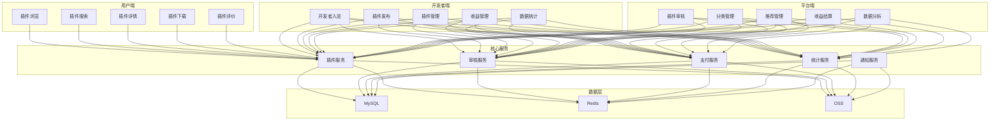
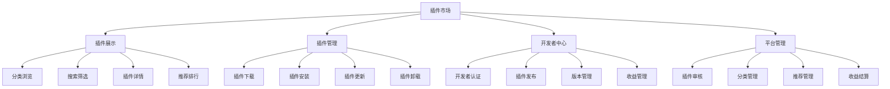
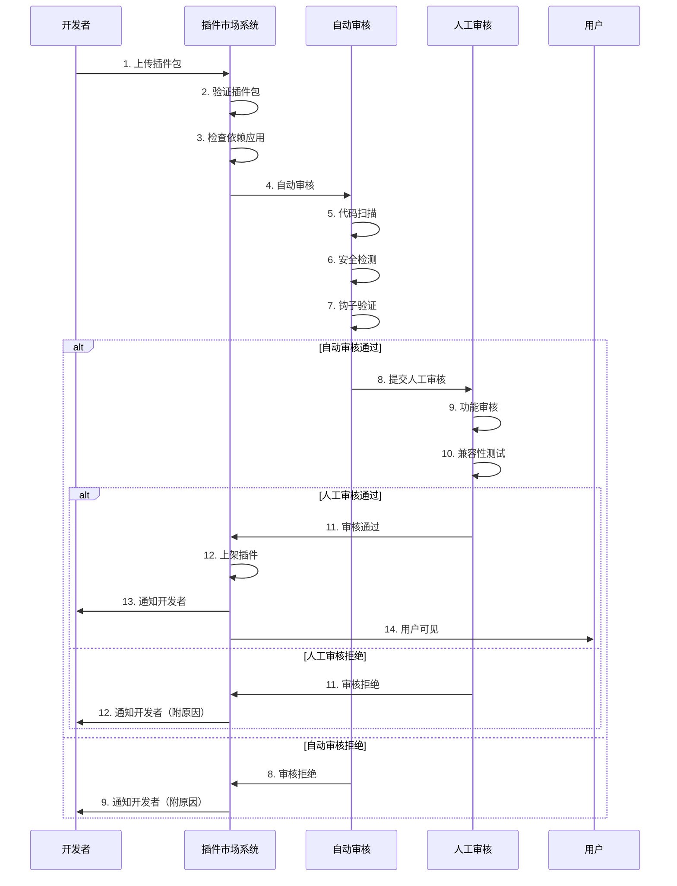

# AlkaidSYS 插件市场设计

## 📋 文档信息

| 项目 | 内容 |
|------|------|
| **文档名称** | AlkaidSYS 插件市场设计 |
| **文档版本** | v1.0 |
| **创建日期** | 2025-01-19 |

## 🎯 插件市场概述

**插件市场（Plugin Market）** 是 AlkaidSYS 生态系统的重要组成部分，为用户提供丰富的插件选择，为开发者提供插件发布和盈利平台。

### 核心目标

1. ✅ **用户视角** - 方便快捷地发现、下载、安装插件
2. ✅ **开发者视角** - 简单高效地发布、管理、盈利插件
3. ✅ **平台视角** - 构建健康的插件生态，保证插件质量

### 核心功能

- 🔍 插件浏览和搜索
- 📦 插件下载和安装
- 💰 插件购买和支付
- ⭐ 插件评价和反馈
- 📊 插件统计和分析
- 👨‍💻 开发者入驻和认证
- 📝 插件发布和审核
- 💵 收益管理和分成

## 🏗️ 插件市场架构

### 1. 整体架构图



### 2. 功能模块图



## 📊 插件分类体系

### 1. 插件分类

#### 1.1 通用插件（Universal Plugins）

| 一级分类 | 二级分类 | 说明 |
|---------|---------|------|
| **支付网关** | 微信支付、支付宝、Stripe、PayPal | 支付相关插件 |
| **短信服务** | 阿里云短信、腾讯云短信、网易云信 | 短信相关插件 |
| **存储服务** | 阿里云 OSS、七牛云、腾讯云 COS | 存储相关插件 |
| **邮件服务** | SMTP、SendGrid、Mailgun | 邮件相关插件 |
| **物流服务** | 快递 100、菜鸟物流、顺丰速运 | 物流相关插件 |
| **地图服务** | 高德地图、百度地图、腾讯地图 | 地图相关插件 |

#### 1.2 应用专属插件（App-Specific Plugins）

| 应用 | 插件分类 | 插件示例 |
|------|---------|---------|
| **电商应用** | 营销插件 | 优惠券、拼团、秒杀、砍价 |
| **电商应用** | 会员插件 | 会员等级、积分系统、储值卡 |
| **电商应用** | 物流插件 | 快递查询、电子面单 |
| **OA 应用** | 审批流插件 | 请假审批、报销审批、采购审批 |
| **OA 应用** | 考勤插件 | 打卡考勤、排班管理、加班管理 |
| **CRM 应用** | 客户画像插件 | 客户标签、行为分析 |
| **CRM 应用** | 销售漏斗插件 | 销售阶段、转化率 |

### 2. 插件标签

```json
{
  "universal_tags": [
    "支付", "微信支付", "支付宝", "Stripe",
    "短信", "阿里云", "腾讯云",
    "存储", "OSS", "七牛云",
    "邮件", "SMTP", "SendGrid",
    "物流", "快递", "地图"
  ],
  "app_specific_tags": {
    "ecommerce": ["营销", "优惠券", "拼团", "秒杀", "会员", "积分"],
    "oa": ["审批", "考勤", "打卡", "排班"],
    "crm": ["客户画像", "销售漏斗", "邮件营销"]
  }
}
```

## 🔄 插件发布流程

### 1. 发布流程图



### 2. 发布步骤

#### 步骤 1：开发者上传插件

```php
<?php
namespace app\service\market;

use think\facade\Filesystem;
use think\facade\Db;

/**
 * 插件发布服务
 */
class PluginPublishService
{
    /**
     * 上传插件包
     */
    public function uploadPlugin(array $file, int $developerId): array
    {
        Db::startTrans();
        try {
            // 1. 验证文件格式（必须是 .zip）
            if ($file['ext'] !== 'zip') {
                throw new \Exception('插件包必须是 ZIP 格式');
            }
            
            // 2. 验证文件大小（不超过 50MB）
            if ($file['size'] > 50 * 1024 * 1024) {
                throw new \Exception('插件包大小不能超过 50MB');
            }
            
            // 3. 保存文件到临时目录
            $tempPath = runtime_path('temp/plugins/');
            $filename = md5(uniqid()) . '.zip';
            $filepath = $tempPath . $filename;
            
            if (!move_uploaded_file($file['tmp_name'], $filepath)) {
                throw new \Exception('文件上传失败');
            }
            
            // 4. 解压插件包
            $extractPath = $tempPath . md5(uniqid()) . '/';
            $zip = new \ZipArchive();
            if ($zip->open($filepath) !== true) {
                throw new \Exception('插件包解压失败');
            }
            $zip->extractTo($extractPath);
            $zip->close();
            
            // 5. 读取插件元数据
            $pluginJsonPath = $extractPath . 'plugin.json';
            if (!file_exists($pluginJsonPath)) {
                throw new \Exception('插件包缺少 plugin.json 文件');
            }
            
            $pluginJson = json_decode(file_get_contents($pluginJsonPath), true);
            if (!$pluginJson) {
                throw new \Exception('plugin.json 格式错误');
            }
            
            // 6. 验证插件元数据
            $this->validatePluginJson($pluginJson);
            
            // 7. 检查依赖应用是否存在
            if (!empty($pluginJson['dependencies']['apps'])) {
                $this->checkAppDependencies($pluginJson['dependencies']['apps']);
            }
            
            // 8. 检查插件是否已存在
            $existingPlugin = Db::name('plugins')
                ->where('key', $pluginJson['key'])
                ->where('developer_id', $developerId)
                ->find();
            
            if ($existingPlugin) {
                // 检查版本号
                if (version_compare($pluginJson['version'], $existingPlugin['version'], '<=')) {
                    throw new \Exception('新版本号必须大于当前版本号');
                }
            }
            
            // 9. 上传插件包到 OSS
            $ossPath = 'plugins/' . $pluginJson['key'] . '/' . $pluginJson['version'] . '.zip';
            $ossUrl = $this->uploadToOss($filepath, $ossPath);

            // 9.1 计算包哈希（SHA-256）
            $packageHash = hash_file('sha256', $filepath);

            // 10. 创建插件记录
            $pluginId = Db::name('plugins')->insertGetId([
                'developer_id' => $developerId,
                'key' => $pluginJson['key'],
                'name' => $pluginJson['name'],
                'type' => $pluginJson['type'],
                'category' => $pluginJson['category'],
                'app_key' => $pluginJson['app_key'] ?? null,
                'version' => $pluginJson['version'],
                'description' => $pluginJson['description'],
                'icon' => $pluginJson['icon'],
                'price' => $pluginJson['price'],
                'license' => $pluginJson['license'],
                'tags' => json_encode($pluginJson['tags']),
                'hooks' => json_encode($pluginJson['hooks']),
                'package_url' => $ossUrl,
                'package_size' => $file['size'],
                'package_hash' => $packageHash,
                'status' => 0, // 待审核
                'created_at' => time()
            ]);
            
            // 11. 创建版本记录
            Db::name('plugin_versions')->insert([
                'plugin_id' => $pluginId,
                'version' => $pluginJson['version'],
                'package_url' => $ossUrl,
                'package_size' => $file['size'],
                'package_hash' => $packageHash,
                'changelog' => $pluginJson['changelog'] ?? '',
                'status' => 0, // 待审核
                'created_at' => time()
            ]);
            
            // 12. 提交自动审核
            $this->submitAutoReview($pluginId);
            
            // 13. 清理临时文件
            $this->cleanupTemp($filepath, $extractPath);
            
            Db::commit();
            
            return [
                'plugin_id' => $pluginId,
                'status' => 'pending_review',
                'message' => '插件已提交审核，请耐心等待'
            ];
            
        } catch (\Exception $e) {
            Db::rollback();
            throw $e;
        }
    }
    
    /**
     * 验证插件元数据
     */
    protected function validatePluginJson(array $pluginJson): void
    {
        $required = ['key', 'name', 'type', 'category', 'version', 'description'];
        
        foreach ($required as $field) {
            if (empty($pluginJson[$field])) {
                throw new \Exception("plugin.json 缺少必填字段：{$field}");
            }
        }
        
        // 验证插件 key 格式（只能包含字母、数字、下划线）
        if (!preg_match('/^[a-z0-9_]+$/', $pluginJson['key'])) {
            throw new \Exception('插件 key 格式错误，只能包含小写字母、数字、下划线');
        }
        
        // 验证版本号格式（必须是 x.y.z 格式）
        if (!preg_match('/^\d+\.\d+\.\d+$/', $pluginJson['version'])) {
            throw new \Exception('版本号格式错误，必须是 x.y.z 格式');
        }
        
        // 验证插件类型
        if (!in_array($pluginJson['type'], ['plugin'])) {
            throw new \Exception('插件类型错误');
        }
        
        // 验证插件分类
        if (!in_array($pluginJson['category'], ['universal', 'app-specific'])) {
            throw new \Exception('插件分类错误');
        }
        
        // 如果是应用专属插件，必须指定 app_key
        if ($pluginJson['category'] === 'app-specific' && empty($pluginJson['app_key'])) {
            throw new \Exception('应用专属插件必须指定 app_key');
        }
    }
    
    /**
     * 检查应用依赖
     */
    protected function checkAppDependencies(array $appKeys): void
    {
        foreach ($appKeys as $appKey) {
            $app = Db::name('applications')
                ->where('key', $appKey)
                ->where('status', 2) // 已上架
                ->find();
            
            if (!$app) {
                throw new \Exception("依赖的应用不存在或未上架：{$appKey}");
            }
        }
    }
}
```

#### 步骤 2：自动审核

```php
<?php
namespace app\service\market;

use think\facade\Db;

/**
 * 插件自动审核服务
 */
class PluginAutoReviewService
{
    /**
     * 自动审核
     */
    public function review(int $pluginId): array
    {
        $plugin = Db::name('plugins')->find($pluginId);
        if (!$plugin) {
            throw new \Exception('插件不存在');
        }
        
        $result = [
            'plugin_id' => $pluginId,
            'passed' => true,
            'issues' => []
        ];
        
        // 1. 代码扫描
        $codeIssues = $this->scanCode($plugin);
        if (!empty($codeIssues)) {
            $result['passed'] = false;
            $result['issues'] = array_merge($result['issues'], $codeIssues);
        }
        
        // 2. 安全检测
        $securityIssues = $this->checkSecurity($plugin);
        if (!empty($securityIssues)) {
            $result['passed'] = false;
            $result['issues'] = array_merge($result['issues'], $securityIssues);
        }
        
        // 3. 钩子验证
        $hookIssues = $this->validateHooks($plugin);
        if (!empty($hookIssues)) {
            $result['passed'] = false;
            $result['issues'] = array_merge($result['issues'], $hookIssues);
        }
        
        // 4. 更新审核状态
        if ($result['passed']) {
            // 自动审核通过，提交人工审核
            Db::name('plugins')->where('id', $pluginId)->update([
                'status' => 1, // 待人工审核
                'auto_review_at' => time()
            ]);
            
            // 通知人工审核员
            $this->notifyManualReviewer($pluginId);
        } else {
            // 自动审核拒绝
            Db::name('plugins')->where('id', $pluginId)->update([
                'status' => -1, // 审核拒绝
                'reject_reason' => json_encode($result['issues']),
                'auto_review_at' => time()
            ]);
            
            // 通知开发者
            $this->notifyDeveloper($pluginId, 'rejected', $result['issues']);
        }
        
        return $result;
    }
    
    /**
     * 验证钩子
     */
    protected function validateHooks(array $plugin): array
    {
        $issues = [];
        
        // 下载插件包
        $packagePath = $this->downloadPackage($plugin['package_url']);
        
        // 解压插件包
        $extractPath = $this->extractPackage($packagePath);
        
        // 读取 plugin.json
        $pluginJson = json_decode(file_get_contents($extractPath . 'plugin.json'), true);
        
        // 检查钩子是否在 Plugin.php 中实现
        $pluginPhpPath = $extractPath . 'Plugin.php';
        if (!file_exists($pluginPhpPath)) {
            $issues[] = [
                'type' => 'hook',
                'level' => 'error',
                'message' => '缺少 Plugin.php 文件'
            ];
        } else {
            $pluginPhpContent = file_get_contents($pluginPhpPath);
            
            foreach ($pluginJson['hooks'] as $hook) {
                // 检查是否有对应的钩子处理方法
                $methodName = 'on' . ucfirst($hook);
                if (strpos($pluginPhpContent, "function {$methodName}") === false) {
                    $issues[] = [
                        'type' => 'hook',
                        'level' => 'error',
                        'message' => "缺少钩子处理方法：{$methodName}"
                    ];
                }
            }
        }
        
        // 清理临时文件
        $this->cleanupTemp($packagePath, $extractPath);
        
        return $issues;
    }
}
```

## 📱 插件详情页设计

### 1. 详情页布局

```
┌─────────────────────────────────────────────────────────┐
│  插件图标  插件名称                          [下载/购买] │
│           开发者 | 分类 | 版本 | 更新时间              │
├─────────────────────────────────────────────────────────┤
│  ⭐⭐⭐⭐⭐ 4.9 分 (567 评价)                         │
├─────────────────────────────────────────────────────────┤
│  插件简介                                               │
│  这是一个微信支付插件，支持扫码支付、H5 支付...         │
├─────────────────────────────────────────────────────────┤
│  插件信息                                               │
│  • 版本：1.0.0                                          │
│  • 大小：2.3 MB                                         │
│  • 分类：通用插件 - 支付网关                            │
│  • 依赖应用：无                                         │
│  • 兼容版本：AlkaidSYS 1.0.0+                          │
│  • 许可证：Commercial                                   │
├─────────────────────────────────────────────────────────┤
│  钩子列表                                               │
│  • PaymentCreate - 创建支付                            │
│  • PaymentQuery - 查询支付                             │
│  • PaymentRefund - 退款                                │
│  • PaymentNotify - 支付回调                            │
├─────────────────────────────────────────────────────────┤
│  更新日志                                               │
│  v1.0.0 (2025-01-19)                                    │
│  • 初始版本发布                                         │
│  • 支持扫码支付                                         │
│  • 支持 H5 支付                                         │
├─────────────────────────────────────────────────────────┤
│  用户评价                                               │
│  ⭐⭐⭐⭐⭐ 王五：非常好用的支付插件！                  │
│  ⭐⭐⭐⭐⭐ 赵六：集成简单，稳定可靠                    │
└─────────────────────────────────────────────────────────┘
```

## 💰 收费机制

### 1. 收费模式

| 收费模式 | 说明 | 适用场景 |
|---------|------|---------|
| **免费** | 完全免费 | 开源插件、公益插件 |
| **一次性付费** | 购买后永久使用 | 工具类插件、小型插件 |
| **订阅制** | 按月/年订阅 | 持续服务的插件 |

### 2. 分成比例

| 插件价格 | 平台分成 | 开发者分成 |
|---------|---------|-----------|
| ≤ 49 元 | 30% | 70% |
| 50-199 元 | 25% | 75% |
| 200-499 元 | 20% | 80% |
| ≥ 500 元 | 15% | 85% |

## 💾 数据库表设计

### 1. 插件表（plugins）

```sql
CREATE TABLE `plugins` (
  `id` int(11) unsigned NOT NULL AUTO_INCREMENT COMMENT '插件 ID',
  `developer_id` int(11) unsigned NOT NULL COMMENT '开发者 ID',
  `key` varchar(50) NOT NULL COMMENT '插件唯一标识',
  `name` varchar(100) NOT NULL COMMENT '插件名称',
  `type` varchar(20) NOT NULL DEFAULT 'plugin' COMMENT '类型：plugin-插件',
  `category` varchar(50) NOT NULL COMMENT '分类：universal-通用 app-specific-应用专属',
  `app_key` varchar(50) DEFAULT NULL COMMENT '依赖应用 key（应用专属插件必填）',
  `version` varchar(20) NOT NULL COMMENT '当前版本',
  `description` text COMMENT '插件描述',
  `icon` varchar(255) DEFAULT NULL COMMENT '插件图标',
  `price` decimal(10,2) NOT NULL DEFAULT '0.00' COMMENT '价格',
  `price_type` tinyint(1) NOT NULL DEFAULT '1' COMMENT '收费类型：1-免费 2-一次性 3-订阅',
  `license` varchar(50) DEFAULT NULL COMMENT '许可证',
  `tags` varchar(500) DEFAULT NULL COMMENT '标签（JSON）',
  `hooks` text COMMENT '钩子列表（JSON）',
  `package_url` varchar(500) DEFAULT NULL COMMENT '插件包地址',
  `package_size` bigint(20) DEFAULT '0' COMMENT '插件包大小（字节）',
  `package_hash` varchar(64) DEFAULT NULL COMMENT 'SHA-256 包哈希',
  `min_framework_version` varchar(20) DEFAULT NULL COMMENT '最低框架版本',
  `max_framework_version` varchar(20) DEFAULT NULL COMMENT '最高框架版本',
  `min_app_version` varchar(20) DEFAULT NULL COMMENT '最低应用版本',
  `status` tinyint(1) NOT NULL DEFAULT '0' COMMENT '状态：0-待审核 1-待人工审核 2-已上架 -1-审核拒绝 -2-已下架',
  `reject_reason` text COMMENT '拒绝原因',
  `view_count` int(11) NOT NULL DEFAULT '0' COMMENT '浏览次数',
  `download_count` int(11) NOT NULL DEFAULT '0' COMMENT '下载次数',
  `rating` decimal(3,1) NOT NULL DEFAULT '0.0' COMMENT '评分',
  `review_count` int(11) NOT NULL DEFAULT '0' COMMENT '评价数量',
  `auto_review_at` int(11) DEFAULT NULL COMMENT '自动审核时间',
  `published_at` int(11) DEFAULT NULL COMMENT '发布时间',
  `created_at` int(11) NOT NULL COMMENT '创建时间',
  `updated_at` int(11) DEFAULT NULL COMMENT '更新时间',
  PRIMARY KEY (`id`),
  UNIQUE KEY `uk_key` (`key`),
  KEY `idx_developer_id` (`developer_id`),
  KEY `idx_category` (`category`),
  KEY `idx_app_key` (`app_key`),
  KEY `idx_status` (`status`)
) ENGINE=InnoDB DEFAULT CHARSET=utf8mb4 COMMENT='插件表';
```

### 2. 插件版本表（plugin_versions）

```sql
CREATE TABLE `plugin_versions` (
  `id` int(11) unsigned NOT NULL AUTO_INCREMENT COMMENT '版本 ID',
  `plugin_id` int(11) unsigned NOT NULL COMMENT '插件 ID',
  `version` varchar(20) NOT NULL COMMENT '版本号',
  `package_url` varchar(500) DEFAULT NULL COMMENT '插件包地址',
  `package_size` bigint(20) DEFAULT '0' COMMENT '插件包大小（字节）',
  `package_hash` varchar(64) DEFAULT NULL COMMENT 'SHA-256 包哈希',
  `changelog` text COMMENT '更新日志',
  `status` tinyint(1) NOT NULL DEFAULT '0' COMMENT '状态：0-待审核 1-已发布 -1-审核拒绝',
  `download_count` int(11) NOT NULL DEFAULT '0' COMMENT '下载次数',
  `created_at` int(11) NOT NULL COMMENT '创建时间',
  PRIMARY KEY (`id`),
  KEY `idx_plugin_id` (`plugin_id`),
  KEY `idx_version` (`version`)
) ENGINE=InnoDB DEFAULT CHARSET=utf8mb4 COMMENT='插件版本表';
```

### 3. 插件评价表（plugin_reviews）

```sql
CREATE TABLE `plugin_reviews` (
  `id` int(11) unsigned NOT NULL AUTO_INCREMENT COMMENT '评价 ID',
  `plugin_id` int(11) unsigned NOT NULL COMMENT '插件 ID',
  `user_id` int(11) unsigned NOT NULL COMMENT '用户 ID',
  `rating` tinyint(1) NOT NULL COMMENT '评分：1-5',
  `content` text COMMENT '评价内容',
  `reply` text COMMENT '开发者回复',
  `reply_at` int(11) DEFAULT NULL COMMENT '回复时间',
  `status` tinyint(1) NOT NULL DEFAULT '1' COMMENT '状态：1-显示 0-隐藏',
  `created_at` int(11) NOT NULL COMMENT '创建时间',
  PRIMARY KEY (`id`),
  KEY `idx_plugin_id` (`plugin_id`),
  KEY `idx_user_id` (`user_id`)
) ENGINE=InnoDB DEFAULT CHARSET=utf8mb4 COMMENT='插件评价表';
```

### 4. 插件下载记录表（plugin_downloads）

```sql
CREATE TABLE `plugin_downloads` (
  `id` int(11) unsigned NOT NULL AUTO_INCREMENT COMMENT '下载 ID',
  `plugin_id` int(11) unsigned NOT NULL COMMENT '插件 ID',
  `version_id` int(11) unsigned NOT NULL COMMENT '版本 ID',
  `user_id` int(11) unsigned NOT NULL COMMENT '用户 ID',
  `tenant_id` int(11) unsigned DEFAULT NULL COMMENT '租户 ID',
  `site_id` int(11) unsigned DEFAULT NULL COMMENT '站点 ID',
  `ip` varchar(50) DEFAULT NULL COMMENT 'IP 地址',
  `created_at` int(11) NOT NULL COMMENT '下载时间',
  PRIMARY KEY (`id`),
  KEY `idx_plugin_id` (`plugin_id`),
  KEY `idx_user_id` (`user_id`),
  KEY `idx_tenant_id` (`tenant_id`)
) ENGINE=InnoDB DEFAULT CHARSET=utf8mb4 COMMENT='插件下载记录表';
```

### 5. 插件安装记录表（plugin_installations）

```sql
CREATE TABLE `plugin_installations` (
  `id` int(11) unsigned NOT NULL AUTO_INCREMENT COMMENT '安装 ID',
  `plugin_id` int(11) unsigned NOT NULL COMMENT '插件 ID',
  `version` varchar(20) NOT NULL COMMENT '安装版本',
  `tenant_id` int(11) unsigned NOT NULL COMMENT '租户 ID',
  `site_id` int(11) unsigned DEFAULT NULL COMMENT '站点 ID',
  `status` tinyint(1) NOT NULL DEFAULT '1' COMMENT '状态：1-已安装 0-已卸载',
  `config` text COMMENT '插件配置（JSON）',
  `installed_at` int(11) NOT NULL COMMENT '安装时间',
  `uninstalled_at` int(11) DEFAULT NULL COMMENT '卸载时间',
  PRIMARY KEY (`id`),
  UNIQUE KEY `uk_plugin_tenant_site` (`plugin_id`, `tenant_id`, `site_id`),
  KEY `idx_tenant_id` (`tenant_id`)
) ENGINE=InnoDB DEFAULT CHARSET=utf8mb4 COMMENT='插件安装记录表';
```

### 6. 应用插件关系表（app_plugin_relations）

```sql
CREATE TABLE `app_plugin_relations` (
  `id` int(11) unsigned NOT NULL AUTO_INCREMENT COMMENT '关系 ID',
  `app_id` int(11) unsigned NOT NULL COMMENT '应用 ID',
  `plugin_id` int(11) unsigned NOT NULL COMMENT '插件 ID',
  `required` tinyint(1) NOT NULL DEFAULT '0' COMMENT '是否必需：1-必需 0-可选',
  `created_at` int(11) NOT NULL COMMENT '创建时间',
  PRIMARY KEY (`id`),
  UNIQUE KEY `uk_app_plugin` (`app_id`, `plugin_id`),
  KEY `idx_app_id` (`app_id`),
  KEY `idx_plugin_id` (`plugin_id`)
) ENGINE=InnoDB DEFAULT CHARSET=utf8mb4 COMMENT='应用插件关系表';
```

## 🎨 前端界面设计

### 1. 插件市场首页（Vue 3 + Ant Design Vue）

```vue
<template>
  <div class="plugin-market">
    <!-- 顶部搜索栏 -->
    <div class="search-bar">
      <el-input
        v-model="searchKeyword"
        placeholder="搜索插件"
        class="search-input"
        @keyup.enter="handleSearch"
      >
        <template #prefix>
          <el-icon><Search /></el-icon>
        </template>
      </el-input>
      <el-button type="primary" @click="handleSearch">搜索</el-button>
    </div>

    <!-- 分类导航 -->
    <div class="category-nav">
      <el-tabs v-model="activeCategory" @tab-click="handleCategoryChange">
        <el-tab-pane label="全部" name="all" />
        <el-tab-pane label="通用插件" name="universal" />
        <el-tab-pane label="电商插件" name="ecommerce" />
        <el-tab-pane label="OA 插件" name="oa" />
        <el-tab-pane label="CRM 插件" name="crm" />
        <el-tab-pane label="ERP 插件" name="erp" />
      </el-tabs>
    </div>

    <!-- 插件列表 -->
    <div class="plugin-list">
      <div class="list-header">
        <h2>插件列表</h2>
        <el-select v-model="sortBy" @change="handleSortChange">
          <el-option label="最新" value="latest" />
          <el-option label="最热" value="popular" />
          <el-option label="评分最高" value="rating" />
        </el-select>
      </div>

      <el-row :gutter="20">
        <el-col
          v-for="plugin in plugins"
          :key="plugin.id"
          :xs="24"
          :sm="12"
          :md="8"
          :lg="6"
        >
          <el-card class="plugin-card" @click="viewPlugin(plugin.id)">
            
            <h3>{{ plugin.name }}</h3>
            <p class="plugin-desc">{{ plugin.description }}</p>
            <div class="plugin-meta">
              <el-tag size="small" :type="getCategoryType(plugin.category)">
                {{ getCategoryName(plugin.category) }}
              </el-tag>
              <el-rate
                v-model="plugin.rating"
                disabled
                show-score
                text-color="#ff9900"
              />
            </div>
            <div class="plugin-footer">
              <span class="price">
                {{ plugin.price > 0 ? `¥${plugin.price}` : '免费' }}
              </span>
              <el-button type="primary" size="small">
                {{ plugin.price > 0 ? '购买' : '下载' }}
              </el-button>
            </div>
          </el-card>
        </el-col>
      </el-row>

      <!-- 分页 -->
      <el-pagination
        v-model:current-page="currentPage"
        v-model:page-size="pageSize"
        :total="total"
        layout="total, prev, pager, next, jumper"
        @current-change="handlePageChange"
      />
    </div>
  </div>
</template>

<script setup lang="ts">
import { ref, onMounted } from 'vue'
import { Search } from '@element-plus/icons-vue'
import { getPluginList } from '@/api/market'

const searchKeyword = ref('')
const activeCategory = ref('all')
const sortBy = ref('latest')
const currentPage = ref(1)
const pageSize = ref(20)
const total = ref(0)

const plugins = ref([])

// 获取插件列表
const loadPlugins = async () => {
  const res = await getPluginList({
    keyword: searchKeyword.value,
    category: activeCategory.value === 'all' ? '' : activeCategory.value,
    sort: sortBy.value,
    page: currentPage.value,
    limit: pageSize.value
  })
  plugins.value = res.data.list
  total.value = res.data.total
}

// 搜索
const handleSearch = () => {
  currentPage.value = 1
  loadPlugins()
}

// 分类切换
const handleCategoryChange = () => {
  currentPage.value = 1
  loadPlugins()
}

// 排序切换
const handleSortChange = () => {
  currentPage.value = 1
  loadPlugins()
}

// 分页切换
const handlePageChange = () => {
  loadPlugins()
}

// 查看插件详情
const viewPlugin = (pluginId: number) => {
  window.location.href = `/market/plugin/${pluginId}`
}

// 获取分类类型
const getCategoryType = (category: string) => {
  return category === 'universal' ? 'success' : 'primary'
}

// 获取分类名称
const getCategoryName = (category: string) => {
  const map = {
    'universal': '通用插件',
    'app-specific': '应用专属'
  }
  return map[category] || category
}

onMounted(() => {
  loadPlugins()
})
</script>

<style scoped lang="scss">
.plugin-market {
  padding: 20px;

  .search-bar {
    display: flex;
    gap: 10px;
    margin-bottom: 20px;

    .search-input {
      flex: 1;
      max-width: 600px;
    }
  }

  .category-nav {
    margin-bottom: 30px;
  }

  .plugin-list {
    .list-header {
      display: flex;
      justify-content: space-between;
      align-items: center;
      margin-bottom: 20px;
    }

    .plugin-card {
      margin-bottom: 20px;
      cursor: pointer;
      transition: all 0.3s;

      &:hover {
        transform: translateY(-5px);
        box-shadow: 0 4px 12px rgba(0, 0, 0, 0.15);
      }

      .plugin-icon {
        width: 64px;
        height: 64px;
        margin: 0 auto 15px;
        display: block;
        border-radius: 8px;
      }

      h3 {
        margin: 0 0 10px;
        font-size: 16px;
        text-align: center;
      }

      .plugin-desc {
        margin: 0 0 15px;
        font-size: 14px;
        color: #666;
        height: 40px;
        overflow: hidden;
        text-overflow: ellipsis;
        display: -webkit-box;
        -webkit-line-clamp: 2;
        -webkit-box-orient: vertical;
      }

      .plugin-meta {
        display: flex;
        justify-content: space-between;
        align-items: center;
        margin-bottom: 15px;
      }

      .plugin-footer {
        display: flex;
        justify-content: space-between;
        align-items: center;

        .price {
          font-size: 18px;
          font-weight: bold;
          color: #f56c6c;
        }
      }
    }

    .el-pagination {
      margin-top: 30px;
      text-align: center;
    }
  }
}
</style>
```

## 🆚 与 NIUCLOUD 对比

| 特性 | AlkaidSYS | NIUCLOUD | 优势 |
|------|-----------|----------|------|
| **插件分类** | 通用插件 + 应用专属插件 | 不明确 | ✅ 更清晰 |
| **审核机制** | 自动审核 + 人工审核 | 人工审核 | ✅ 更高效 |
| **钩子验证** | 自动验证钩子实现 | 基础验证 | ✅ 更严格 |
| **依赖检查** | 自动检查应用依赖 | 基础检查 | ✅ 更完善 |
| **收费模式** | 3 种收费模式 | 基础收费 | ✅ 更灵活 |
| **数据库设计** | 6 张表完整设计 | 基础表设计 | ✅ 更规范 |
| **前端界面** | Vue 3 + Ant Design Vue | 基础界面 | ✅ 更现代 |

---

**最后更新**: 2025-01-19
**文档版本**: v1.0
**维护者**: AlkaidSYS 架构团队

