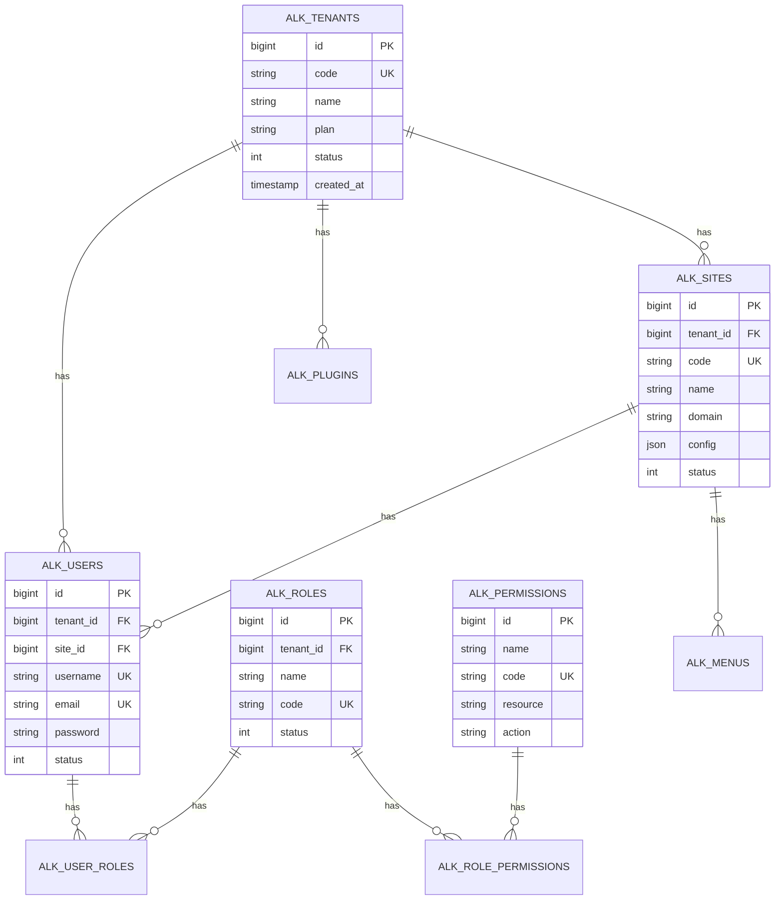

# AlkaidSYS 数据库设计

## 📋 文档信息

| 项目 | 内容 |
|------|------|
| **文档名称** | AlkaidSYS 数据库设计 |
| **文档版本** | v1.0 |
| **创建日期** | 2025-01-19 |

## 🎯 数据库设计目标

1. **高性能** - 优化索引，支持 10K+ 并发查询
2. **可扩展** - 支持分库分表，水平扩展
3. **数据隔离** - 多租户数据严格隔离
4. **数据安全** - 敏感数据加密存储
5. **易维护** - 规范的命名和注释
6. **统一规范** - 主键、唯一索引、分区策略以《多租户 / 多站点数据建模规范》为准，本文件 SQL 为示例实现

## 🏗️ 核心表 ER 图



## 📊 核心表设计

### 1. 租户表（alk_tenants）

```sql
CREATE TABLE `alkaid_tenants` (
  `id` bigint(20) UNSIGNED NOT NULL AUTO_INCREMENT COMMENT '租户ID',
  `code` varchar(50) NOT NULL COMMENT '租户编码',
  `name` varchar(100) NOT NULL COMMENT '租户名称',
  `plan` enum('free','basic','pro','enterprise') NOT NULL DEFAULT 'free' COMMENT '订阅计划',
  `isolation_mode` tinyint(1) NOT NULL DEFAULT 1 COMMENT '隔离模式:1=共享数据库,2=独立数据库,3=混合模式',
  `database_name` varchar(100) DEFAULT NULL COMMENT '独立数据库名称',
  `max_sites` int(11) NOT NULL DEFAULT 1 COMMENT '最大站点数',
  `max_users` int(11) NOT NULL DEFAULT 10 COMMENT '最大用户数',
  `max_storage` bigint(20) NOT NULL DEFAULT 1073741824 COMMENT '最大存储空间(字节)',
  `expired_at` timestamp NULL DEFAULT NULL COMMENT '过期时间',
  `status` tinyint(1) NOT NULL DEFAULT 1 COMMENT '状态:0=禁用,1=启用',
  `created_at` timestamp NOT NULL DEFAULT CURRENT_TIMESTAMP COMMENT '创建时间',
  `updated_at` timestamp NOT NULL DEFAULT CURRENT_TIMESTAMP ON UPDATE CURRENT_TIMESTAMP COMMENT '更新时间',
  `deleted_at` timestamp NULL DEFAULT NULL COMMENT '删除时间',
  PRIMARY KEY (`id`),
  UNIQUE KEY `uk_code` (`code`),
  KEY `idx_plan` (`plan`),
  KEY `idx_status` (`status`),
  KEY `idx_expired_at` (`expired_at`)
) ENGINE=InnoDB DEFAULT CHARSET=utf8mb4 COMMENT='租户表';
```

### 2. 站点表（sites）

```sql
CREATE TABLE `alkaid_sites` (
  `id` bigint(20) UNSIGNED NOT NULL AUTO_INCREMENT COMMENT '站点ID',
  `tenant_id` bigint(20) UNSIGNED NOT NULL COMMENT '租户ID',
  `code` varchar(50) NOT NULL COMMENT '站点编码',
  `name` varchar(100) NOT NULL COMMENT '站点名称',
  `domain` varchar(255) DEFAULT NULL COMMENT '绑定域名',
  `logo` varchar(255) DEFAULT NULL COMMENT 'Logo',
  `config` json DEFAULT NULL COMMENT '站点配置',
  `is_default` tinyint(1) NOT NULL DEFAULT 0 COMMENT '是否默认站点',
  `status` tinyint(1) NOT NULL DEFAULT 1 COMMENT '状态:0=禁用,1=启用',
  `created_at` timestamp NOT NULL DEFAULT CURRENT_TIMESTAMP COMMENT '创建时间',
  `updated_at` timestamp NOT NULL DEFAULT CURRENT_TIMESTAMP ON UPDATE CURRENT_TIMESTAMP COMMENT '更新时间',
  `deleted_at` timestamp NULL DEFAULT NULL COMMENT '删除时间',
  PRIMARY KEY (`id`),
  UNIQUE KEY `uk_tenant_code` (`tenant_id`, `code`),
  UNIQUE KEY `uk_domain` (`domain`),
  KEY `idx_tenant_id` (`tenant_id`),
  KEY `idx_status` (`status`)
) ENGINE=InnoDB DEFAULT CHARSET=utf8mb4 COMMENT='站点表';
```

### 3. 用户表（users）

```sql
CREATE TABLE `alkaid_users` (
  `id` bigint(20) UNSIGNED NOT NULL AUTO_INCREMENT COMMENT '用户ID',
  `tenant_id` bigint(20) UNSIGNED NOT NULL COMMENT '租户ID',
  `site_id` bigint(20) UNSIGNED NOT NULL COMMENT '站点ID',
  `username` varchar(50) NOT NULL COMMENT '用户名',
  `email` varchar(100) DEFAULT NULL COMMENT '邮箱',
  `mobile` varchar(20) DEFAULT NULL COMMENT '手机号',
  `password` varchar(255) NOT NULL COMMENT '密码',
  `nickname` varchar(50) DEFAULT NULL COMMENT '昵称',
  `avatar` varchar(255) DEFAULT NULL COMMENT '头像',
  `gender` tinyint(1) DEFAULT 0 COMMENT '性别:0=未知,1=男,2=女',
  `birthday` date DEFAULT NULL COMMENT '生日',
  `last_login_at` timestamp NULL DEFAULT NULL COMMENT '最后登录时间',
  `last_login_ip` varchar(45) DEFAULT NULL COMMENT '最后登录IP',
  `status` tinyint(1) NOT NULL DEFAULT 1 COMMENT '状态:0=禁用,1=启用',
  `created_at` timestamp NOT NULL DEFAULT CURRENT_TIMESTAMP COMMENT '创建时间',
  `updated_at` timestamp NOT NULL DEFAULT CURRENT_TIMESTAMP ON UPDATE CURRENT_TIMESTAMP COMMENT '更新时间',
  `deleted_at` timestamp NULL DEFAULT NULL COMMENT '删除时间',
  PRIMARY KEY (`id`),
  UNIQUE KEY `uk_tenant_site_username` (`tenant_id`, `site_id`, `username`),
  UNIQUE KEY `uk_tenant_site_email` (`tenant_id`, `site_id`, `email`),
  UNIQUE KEY `uk_tenant_site_mobile` (`tenant_id`, `site_id`, `mobile`),
  KEY `idx_tenant_site` (`tenant_id`, `site_id`),
  KEY `idx_status` (`status`)
) ENGINE=InnoDB DEFAULT CHARSET=utf8mb4 COMMENT='用户表';
```

### 4. 角色表（roles）

```sql
CREATE TABLE `alkaid_roles` (
  `id` bigint(20) UNSIGNED NOT NULL AUTO_INCREMENT COMMENT '角色ID',
  `tenant_id` bigint(20) UNSIGNED NOT NULL COMMENT '租户ID',
  `name` varchar(50) NOT NULL COMMENT '角色名称',
  `code` varchar(50) NOT NULL COMMENT '角色编码',
  `description` varchar(255) DEFAULT NULL COMMENT '角色描述',
  `sort` int(11) NOT NULL DEFAULT 0 COMMENT '排序',
  `status` tinyint(1) NOT NULL DEFAULT 1 COMMENT '状态:0=禁用,1=启用',
  `created_at` timestamp NOT NULL DEFAULT CURRENT_TIMESTAMP COMMENT '创建时间',
  `updated_at` timestamp NOT NULL DEFAULT CURRENT_TIMESTAMP ON UPDATE CURRENT_TIMESTAMP COMMENT '更新时间',
  `deleted_at` timestamp NULL DEFAULT NULL COMMENT '删除时间',
  PRIMARY KEY (`id`),
  UNIQUE KEY `uk_tenant_code` (`tenant_id`, `code`),
  KEY `idx_tenant_id` (`tenant_id`),
  KEY `idx_status` (`status`)
) ENGINE=InnoDB DEFAULT CHARSET=utf8mb4 COMMENT='角色表';
```

### 5. 权限表（permissions）

```sql
CREATE TABLE `alkaid_permissions` (
  `id` bigint(20) UNSIGNED NOT NULL AUTO_INCREMENT COMMENT '权限ID',
  `name` varchar(50) NOT NULL COMMENT '权限名称',
  `code` varchar(100) NOT NULL COMMENT '权限编码',
  `resource` varchar(100) NOT NULL COMMENT '资源',
  `action` varchar(50) NOT NULL COMMENT '操作',
  `description` varchar(255) DEFAULT NULL COMMENT '权限描述',
  `created_at` timestamp NOT NULL DEFAULT CURRENT_TIMESTAMP COMMENT '创建时间',
  `updated_at` timestamp NOT NULL DEFAULT CURRENT_TIMESTAMP ON UPDATE CURRENT_TIMESTAMP COMMENT '更新时间',
  PRIMARY KEY (`id`),
  UNIQUE KEY `uk_code` (`code`),
  KEY `idx_resource_action` (`resource`, `action`)
) ENGINE=InnoDB DEFAULT CHARSET=utf8mb4 COMMENT='权限表';
```

### 6. 用户角色关联表（user_roles）

```sql
CREATE TABLE `alkaid_user_roles` (
  `id` bigint(20) UNSIGNED NOT NULL AUTO_INCREMENT COMMENT 'ID',
  `tenant_id` bigint(20) UNSIGNED NOT NULL COMMENT '租户ID',
  `user_id` bigint(20) UNSIGNED NOT NULL COMMENT '用户ID',
  `role_id` bigint(20) UNSIGNED NOT NULL COMMENT '角色ID',
  `created_at` timestamp NOT NULL DEFAULT CURRENT_TIMESTAMP COMMENT '创建时间',
  PRIMARY KEY (`id`),
  UNIQUE KEY `uk_tenant_user_role` (`tenant_id`, `user_id`, `role_id`),
  KEY `idx_tenant_user` (`tenant_id`, `user_id`),
  KEY `idx_tenant_role` (`tenant_id`, `role_id`)
) ENGINE=InnoDB DEFAULT CHARSET=utf8mb4 COMMENT='用户角色关联表';
```

### 7. 角色权限关联表（role_permissions）

```sql
CREATE TABLE `alkaid_role_permissions` (
  `id` bigint(20) UNSIGNED NOT NULL AUTO_INCREMENT COMMENT 'ID',
  `tenant_id` bigint(20) UNSIGNED NOT NULL COMMENT '租户ID',
  `role_id` bigint(20) UNSIGNED NOT NULL COMMENT '角色ID',
  `permission_id` bigint(20) UNSIGNED NOT NULL COMMENT '权限ID',
  `created_at` timestamp NOT NULL DEFAULT CURRENT_TIMESTAMP COMMENT '创建时间',
  PRIMARY KEY (`id`),
  UNIQUE KEY `uk_tenant_role_permission` (`tenant_id`, `role_id`, `permission_id`),
  KEY `idx_tenant_role` (`tenant_id`, `role_id`)
) ENGINE=InnoDB DEFAULT CHARSET=utf8mb4 COMMENT='角色权限关联表';
```

### 8. 插件表（plugins）

```sql
CREATE TABLE `alkaid_plugins` (
  `id` bigint(20) UNSIGNED NOT NULL AUTO_INCREMENT COMMENT '插件ID',
  `tenant_id` bigint(20) UNSIGNED NOT NULL COMMENT '租户ID',
  `name` varchar(50) NOT NULL COMMENT '插件名称',
  `title` varchar(100) NOT NULL COMMENT '插件标题',
  `version` varchar(20) NOT NULL COMMENT '插件版本',
  `config` json DEFAULT NULL COMMENT '插件配置',
  `status` enum('installed','enabled','disabled') NOT NULL DEFAULT 'installed' COMMENT '状态',
  `installed_at` timestamp NULL DEFAULT NULL COMMENT '安装时间',
  `enabled_at` timestamp NULL DEFAULT NULL COMMENT '启用时间',
  `created_at` timestamp NOT NULL DEFAULT CURRENT_TIMESTAMP COMMENT '创建时间',
  `updated_at` timestamp NOT NULL DEFAULT CURRENT_TIMESTAMP ON UPDATE CURRENT_TIMESTAMP COMMENT '更新时间',
  PRIMARY KEY (`id`),
  UNIQUE KEY `uk_tenant_name` (`tenant_id`, `name`),
  KEY `idx_tenant_id` (`tenant_id`),
  KEY `idx_status` (`status`)
) ENGINE=InnoDB DEFAULT CHARSET=utf8mb4 COMMENT='插件表';
```

### 9. 菜单表（menus）

```sql
CREATE TABLE `alkaid_menus` (
  `id` bigint(20) UNSIGNED NOT NULL AUTO_INCREMENT COMMENT '菜单ID',
  `tenant_id` bigint(20) UNSIGNED NOT NULL COMMENT '租户ID',
  `site_id` bigint(20) UNSIGNED NOT NULL COMMENT '站点ID',
  `parent_id` bigint(20) UNSIGNED NOT NULL DEFAULT 0 COMMENT '父菜单ID',
  `name` varchar(50) NOT NULL COMMENT '菜单名称',
  `title` varchar(100) NOT NULL COMMENT '菜单标题',
  `icon` varchar(100) DEFAULT NULL COMMENT '菜单图标',
  `path` varchar(255) DEFAULT NULL COMMENT '路由路径',
  `component` varchar(255) DEFAULT NULL COMMENT '组件路径',
  `permission` varchar(100) DEFAULT NULL COMMENT '权限标识',
  `sort` int(11) NOT NULL DEFAULT 0 COMMENT '排序',
  `is_hidden` tinyint(1) NOT NULL DEFAULT 0 COMMENT '是否隐藏',
  `is_cache` tinyint(1) NOT NULL DEFAULT 1 COMMENT '是否缓存',
  `status` tinyint(1) NOT NULL DEFAULT 1 COMMENT '状态:0=禁用,1=启用',
  `created_at` timestamp NOT NULL DEFAULT CURRENT_TIMESTAMP COMMENT '创建时间',
  `updated_at` timestamp NOT NULL DEFAULT CURRENT_TIMESTAMP ON UPDATE CURRENT_TIMESTAMP COMMENT '更新时间',
  PRIMARY KEY (`id`),
  KEY `idx_tenant_site` (`tenant_id`, `site_id`),
  KEY `idx_parent_id` (`parent_id`),
  KEY `idx_status` (`status`)
) ENGINE=InnoDB DEFAULT CHARSET=utf8mb4 COMMENT='菜单表';
```

## 🔧 ThinkPHP 8.0 Migration 示例

### 创建租户表迁移

```php
<?php
// /database/migrations/20250101000001_create_tenants_table.php

use think\migration\Migrator;
use think\migration\db\Column;

class CreateTenantsTable extends Migrator
{
    public function change()
    {
        $table = $this->table('tenants', [
            'engine' => 'InnoDB',
            'collation' => 'utf8mb4_unicode_ci',
            'comment' => '租户表',
        ]);
        
        $table->addColumn('code', 'string', [
                'limit' => 50,
                'null' => false,
                'comment' => '租户编码',
            ])
            ->addColumn('name', 'string', [
                'limit' => 100,
                'null' => false,
                'comment' => '租户名称',
            ])
            ->addColumn('plan', 'enum', [
                'values' => ['free', 'basic', 'pro', 'enterprise'],
                'default' => 'free',
                'comment' => '订阅计划',
            ])
            ->addColumn('isolation_mode', 'integer', [
                'limit' => Column::INT_TINY,
                'default' => 1,
                'comment' => '隔离模式:1=共享,2=独立,3=混合',
            ])
            ->addColumn('database_name', 'string', [
                'limit' => 100,
                'null' => true,
                'comment' => '独立数据库名称',
            ])
            ->addColumn('max_sites', 'integer', [
                'default' => 1,
                'comment' => '最大站点数',
            ])
            ->addColumn('max_users', 'integer', [
                'default' => 10,
                'comment' => '最大用户数',
            ])
            ->addColumn('max_storage', 'biginteger', [
                'default' => 1073741824,
                'comment' => '最大存储空间(字节)',
            ])
            ->addColumn('expired_at', 'timestamp', [
                'null' => true,
                'comment' => '过期时间',
            ])
            ->addColumn('status', 'integer', [
                'limit' => Column::INT_TINY,
                'default' => 1,
                'comment' => '状态:0=禁用,1=启用',
            ])
            ->addColumn('created_at', 'timestamp', [
                'default' => 'CURRENT_TIMESTAMP',
                'comment' => '创建时间',
            ])
            ->addColumn('updated_at', 'timestamp', [
                'default' => 'CURRENT_TIMESTAMP',
                'update' => 'CURRENT_TIMESTAMP',
                'comment' => '更新时间',
            ])
            ->addColumn('deleted_at', 'timestamp', [
                'null' => true,
                'comment' => '删除时间',
            ])
            ->addIndex(['code'], ['unique' => true, 'name' => 'uk_code'])
            ->addIndex(['plan'], ['name' => 'idx_plan'])
            ->addIndex(['status'], ['name' => 'idx_status'])
            ->addIndex(['expired_at'], ['name' => 'idx_expired_at'])
            ->create();
    }
}
```

## 📈 索引优化策略

### 1. 联合索引设计原则

```sql
-- ✅ 好的联合索引（遵循最左前缀原则）
ALTER TABLE `users` ADD INDEX `idx_tenant_site_status` (`tenant_id`, `site_id`, `status`);

-- ❌ 不好的索引（顺序不合理）
ALTER TABLE `users` ADD INDEX `idx_status_tenant_site` (`status`, `tenant_id`, `site_id`);

-- 查询示例
SELECT * FROM users 
WHERE tenant_id = 1 AND site_id = 1 AND status = 1;  -- ✅ 使用索引
```

### 2. 覆盖索引

```sql
-- 覆盖索引（包含查询所需的所有字段）
ALTER TABLE `users` ADD INDEX `idx_tenant_site_username_email` 
(`tenant_id`, `site_id`, `username`, `email`);

-- 查询示例（不需要回表）
SELECT username, email FROM users 
WHERE tenant_id = 1 AND site_id = 1;  -- ✅ 使用覆盖索引
```

### 3. 前缀索引

```sql
-- 对长字符串使用前缀索引
ALTER TABLE `users` ADD INDEX `idx_email_prefix` (`email`(20));
```

## 🔄 分库分表策略

### 水平分表（基于 tenant_id）

```php
<?php
// /app/common/service/ShardingService.php

namespace app\common\service;

class ShardingService
{
    /**
     * 获取分表名称
     */
    public function getTableName(string $baseTable, int $tenantId): string
    {
        // 每 1000 个租户一张表
        $suffix = floor($tenantId / 1000);
        return "{$baseTable}_{$suffix}";
    }
    
    /**
     * 创建分表
     */
    public function createShardTable(string $baseTable, int $suffix): void
    {
        $tableName = "{$baseTable}_{$suffix}";
        
        $sql = "CREATE TABLE IF NOT EXISTS `{$tableName}` LIKE `{$baseTable}`";
        Db::execute($sql);
    }
}
```

## 📦 应用市场相关表设计

### 1. 应用表（applications）

```sql
CREATE TABLE `alkaid_applications` (
  `id` int(11) unsigned NOT NULL AUTO_INCREMENT COMMENT '应用 ID',
  `developer_id` int(11) unsigned NOT NULL COMMENT '开发者 ID',
  `key` varchar(50) NOT NULL COMMENT '应用唯一标识',
  `name` varchar(100) NOT NULL COMMENT '应用名称',
  `type` varchar(20) NOT NULL DEFAULT 'app' COMMENT '类型：app-应用',
  `category` varchar(50) NOT NULL COMMENT '分类',
  `version` varchar(20) NOT NULL COMMENT '当前版本',
  `description` text COMMENT '应用描述',
  `icon` varchar(255) DEFAULT NULL COMMENT '应用图标',
  `cover` varchar(255) DEFAULT NULL COMMENT '应用封面',
  `screenshots` text COMMENT '应用截图（JSON）',
  `price` decimal(10,2) NOT NULL DEFAULT '0.00' COMMENT '价格',
  `price_type` tinyint(1) NOT NULL DEFAULT '1' COMMENT '收费类型：1-免费 2-一次性 3-订阅',
  `license` varchar(50) DEFAULT NULL COMMENT '许可证',
  `tags` varchar(500) DEFAULT NULL COMMENT '标签（JSON）',
  `package_url` varchar(500) DEFAULT NULL COMMENT '应用包地址',
  `package_size` bigint(20) DEFAULT '0' COMMENT '应用包大小（字节）',
  `package_hash` varchar(64) DEFAULT NULL COMMENT 'SHA-256 包哈希',
  `min_framework_version` varchar(20) DEFAULT NULL COMMENT '最低框架版本',
  `max_framework_version` varchar(20) DEFAULT NULL COMMENT '最高框架版本',
  `status` tinyint(1) NOT NULL DEFAULT '0' COMMENT '状态：0-待审核 1-待人工审核 2-已上架 -1-审核拒绝 -2-已下架',
  `reject_reason` text COMMENT '拒绝原因',
  `view_count` int(11) NOT NULL DEFAULT '0' COMMENT '浏览次数',
  `download_count` int(11) NOT NULL DEFAULT '0' COMMENT '下载次数',
  `rating` decimal(3,1) NOT NULL DEFAULT '0.0' COMMENT '评分',
  `review_count` int(11) NOT NULL DEFAULT '0' COMMENT '评价数量',
  `auto_review_at` int(11) DEFAULT NULL COMMENT '自动审核时间',
  `published_at` int(11) DEFAULT NULL COMMENT '发布时间',
  `created_at` int(11) NOT NULL COMMENT '创建时间',
  `updated_at` int(11) DEFAULT NULL COMMENT '更新时间',
  PRIMARY KEY (`id`),
  UNIQUE KEY `uk_key` (`key`),
  KEY `idx_developer_id` (`developer_id`),
  KEY `idx_category` (`category`),
  KEY `idx_status` (`status`),
  KEY `idx_rating` (`rating`),
  KEY `idx_download_count` (`download_count`)
) ENGINE=InnoDB DEFAULT CHARSET=utf8mb4 COMMENT='应用表';
```

### 2. 应用版本表（app_versions）

```sql
CREATE TABLE `alkaid_app_versions` (
  `id` int(11) unsigned NOT NULL AUTO_INCREMENT COMMENT '版本 ID',
  `app_id` int(11) unsigned NOT NULL COMMENT '应用 ID',
  `version` varchar(20) NOT NULL COMMENT '版本号',
  `package_url` varchar(500) DEFAULT NULL COMMENT '应用包地址',
  `package_size` bigint(20) DEFAULT '0' COMMENT '应用包大小（字节）',
  `package_hash` varchar(64) DEFAULT NULL COMMENT 'SHA-256 包哈希',
  `changelog` text COMMENT '更新日志',
  `status` tinyint(1) NOT NULL DEFAULT '0' COMMENT '状态：0-待审核 1-已发布 -1-审核拒绝',
  `download_count` int(11) NOT NULL DEFAULT '0' COMMENT '下载次数',
  `created_at` int(11) NOT NULL COMMENT '创建时间',
  PRIMARY KEY (`id`),
  KEY `idx_app_id` (`app_id`),
  KEY `idx_version` (`version`),
  KEY `idx_status` (`status`)
) ENGINE=InnoDB DEFAULT CHARSET=utf8mb4 COMMENT='应用版本表';
```

### 3. 应用评价表（app_reviews）

```sql
CREATE TABLE `alkaid_app_reviews` (
  `id` int(11) unsigned NOT NULL AUTO_INCREMENT COMMENT '评价 ID',
  `app_id` int(11) unsigned NOT NULL COMMENT '应用 ID',
  `user_id` int(11) unsigned NOT NULL COMMENT '用户 ID',
  `rating` tinyint(1) NOT NULL COMMENT '评分：1-5',
  `content` text COMMENT '评价内容',
  `reply` text COMMENT '开发者回复',
  `reply_at` int(11) DEFAULT NULL COMMENT '回复时间',
  `status` tinyint(1) NOT NULL DEFAULT '1' COMMENT '状态：1-显示 0-隐藏',
  `created_at` int(11) NOT NULL COMMENT '创建时间',
  PRIMARY KEY (`id`),
  KEY `idx_app_id` (`app_id`),
  KEY `idx_user_id` (`user_id`),
  KEY `idx_rating` (`rating`)
) ENGINE=InnoDB DEFAULT CHARSET=utf8mb4 COMMENT='应用评价表';
```

### 4. 应用下载记录表（app_downloads）

```sql
CREATE TABLE `alkaid_app_downloads` (
  `id` int(11) unsigned NOT NULL AUTO_INCREMENT COMMENT '下载 ID',
  `app_id` int(11) unsigned NOT NULL COMMENT '应用 ID',
  `version_id` int(11) unsigned NOT NULL COMMENT '版本 ID',
  `user_id` int(11) unsigned NOT NULL COMMENT '用户 ID',
  `tenant_id` int(11) unsigned DEFAULT NULL COMMENT '租户 ID',
  `site_id` int(11) unsigned DEFAULT NULL COMMENT '站点 ID',
  `ip` varchar(50) DEFAULT NULL COMMENT 'IP 地址',
  `created_at` int(11) NOT NULL COMMENT '下载时间',
  PRIMARY KEY (`id`),
  KEY `idx_app_id` (`app_id`),
  KEY `idx_user_id` (`user_id`),
  KEY `idx_tenant_id` (`tenant_id`),
  KEY `idx_created_at` (`created_at`)
) ENGINE=InnoDB DEFAULT CHARSET=utf8mb4 COMMENT='应用下载记录表';
```

### 5. 应用安装记录表（app_installations）

```sql
CREATE TABLE `alkaid_app_installations` (
  `id` int(11) unsigned NOT NULL AUTO_INCREMENT COMMENT '安装 ID',
  `app_id` int(11) unsigned NOT NULL COMMENT '应用 ID',
  `version` varchar(20) NOT NULL COMMENT '安装版本',
  `tenant_id` int(11) unsigned NOT NULL COMMENT '租户 ID',
  `site_id` int(11) unsigned DEFAULT NULL COMMENT '站点 ID',
  `status` tinyint(1) NOT NULL DEFAULT '1' COMMENT '状态：1-已安装 0-已卸载',
  `config` text COMMENT '应用配置（JSON）',
  `installed_at` int(11) NOT NULL COMMENT '安装时间',
  `uninstalled_at` int(11) DEFAULT NULL COMMENT '卸载时间',
  PRIMARY KEY (`id`),
  UNIQUE KEY `uk_app_tenant_site` (`app_id`, `tenant_id`, `site_id`),
  KEY `idx_tenant_id` (`tenant_id`),
  KEY `idx_status` (`status`)
) ENGINE=InnoDB DEFAULT CHARSET=utf8mb4 COMMENT='应用安装记录表';
```

### 6. 应用订单表（app_orders）

```sql
CREATE TABLE `alkaid_app_orders` (
  `id` int(11) unsigned NOT NULL AUTO_INCREMENT COMMENT '订单 ID',
  `order_no` varchar(50) NOT NULL COMMENT '订单号',
  `app_id` int(11) unsigned NOT NULL COMMENT '应用 ID',
  `user_id` int(11) unsigned NOT NULL COMMENT '用户 ID',
  `tenant_id` int(11) unsigned NOT NULL COMMENT '租户 ID',
  `price` decimal(10,2) NOT NULL COMMENT '应用价格',
  `amount` decimal(10,2) NOT NULL COMMENT '实付金额',
  `platform_fee` decimal(10,2) NOT NULL COMMENT '平台分成',
  `developer_fee` decimal(10,2) NOT NULL COMMENT '开发者分成',
  `payment_method` varchar(50) DEFAULT NULL COMMENT '支付方式',
  `transaction_id` varchar(100) DEFAULT NULL COMMENT '交易号',
  `status` tinyint(1) NOT NULL DEFAULT '0' COMMENT '状态：0-待支付 1-已支付 -1-已取消',
  `paid_at` int(11) DEFAULT NULL COMMENT '支付时间',
  `created_at` int(11) NOT NULL COMMENT '创建时间',
  PRIMARY KEY (`id`),
  UNIQUE KEY `uk_order_no` (`order_no`),
  KEY `idx_app_id` (`app_id`),
  KEY `idx_user_id` (`user_id`),
  KEY `idx_status` (`status`)
) ENGINE=InnoDB DEFAULT CHARSET=utf8mb4 COMMENT='应用订单表';
```

## 🔌 插件市场相关表设计

### 1. 插件表（plugins）

```sql
CREATE TABLE `alkaid_plugins` (
  `id` int(11) unsigned NOT NULL AUTO_INCREMENT COMMENT '插件 ID',
  `developer_id` int(11) unsigned NOT NULL COMMENT '开发者 ID',
  `key` varchar(50) NOT NULL COMMENT '插件唯一标识',
  `name` varchar(100) NOT NULL COMMENT '插件名称',
  `type` varchar(20) NOT NULL DEFAULT 'plugin' COMMENT '类型：plugin-插件',
  `category` varchar(50) NOT NULL COMMENT '分类：universal-通用 app-specific-应用专属',
  `app_key` varchar(50) DEFAULT NULL COMMENT '依赖应用 key（应用专属插件必填）',
  `version` varchar(20) NOT NULL COMMENT '当前版本',
  `description` text COMMENT '插件描述',
  `icon` varchar(255) DEFAULT NULL COMMENT '插件图标',
  `price` decimal(10,2) NOT NULL DEFAULT '0.00' COMMENT '价格',
  `price_type` tinyint(1) NOT NULL DEFAULT '1' COMMENT '收费类型：1-免费 2-一次性 3-订阅',
  `license` varchar(50) DEFAULT NULL COMMENT '许可证',
  `tags` varchar(500) DEFAULT NULL COMMENT '标签（JSON）',
  `hooks` text COMMENT '钩子列表（JSON）',
  `package_url` varchar(500) DEFAULT NULL COMMENT '插件包地址',
  `package_size` bigint(20) DEFAULT '0' COMMENT '插件包大小（字节）',
  `package_hash` varchar(64) DEFAULT NULL COMMENT 'SHA-256 包哈希',
  `min_framework_version` varchar(20) DEFAULT NULL COMMENT '最低框架版本',
  `max_framework_version` varchar(20) DEFAULT NULL COMMENT '最高框架版本',
  `min_app_version` varchar(20) DEFAULT NULL COMMENT '最低应用版本',
  `status` tinyint(1) NOT NULL DEFAULT '0' COMMENT '状态：0-待审核 1-待人工审核 2-已上架 -1-审核拒绝 -2-已下架',
  `reject_reason` text COMMENT '拒绝原因',
  `view_count` int(11) NOT NULL DEFAULT '0' COMMENT '浏览次数',
  `download_count` int(11) NOT NULL DEFAULT '0' COMMENT '下载次数',
  `rating` decimal(3,1) NOT NULL DEFAULT '0.0' COMMENT '评分',
  `review_count` int(11) NOT NULL DEFAULT '0' COMMENT '评价数量',
  `auto_review_at` int(11) DEFAULT NULL COMMENT '自动审核时间',
  `published_at` int(11) DEFAULT NULL COMMENT '发布时间',
  `created_at` int(11) NOT NULL COMMENT '创建时间',
  `updated_at` int(11) DEFAULT NULL COMMENT '更新时间',
  PRIMARY KEY (`id`),
  UNIQUE KEY `uk_key` (`key`),
  KEY `idx_developer_id` (`developer_id`),
  KEY `idx_category` (`category`),
  KEY `idx_app_key` (`app_key`),
  KEY `idx_status` (`status`),
  KEY `idx_rating` (`rating`)
) ENGINE=InnoDB DEFAULT CHARSET=utf8mb4 COMMENT='插件表';
```

### 2. 插件版本表（plugin_versions）

```sql
CREATE TABLE `alkaid_plugin_versions` (
  `id` int(11) unsigned NOT NULL AUTO_INCREMENT COMMENT '版本 ID',
  `plugin_id` int(11) unsigned NOT NULL COMMENT '插件 ID',
  `version` varchar(20) NOT NULL COMMENT '版本号',
  `package_url` varchar(500) DEFAULT NULL COMMENT '插件包地址',
  `package_size` bigint(20) DEFAULT '0' COMMENT '插件包大小（字节）',
  `package_hash` varchar(64) DEFAULT NULL COMMENT 'SHA-256 包哈希',
  `changelog` text COMMENT '更新日志',
  `status` tinyint(1) NOT NULL DEFAULT '0' COMMENT '状态：0-待审核 1-已发布 -1-审核拒绝',
  `download_count` int(11) NOT NULL DEFAULT '0' COMMENT '下载次数',
  `created_at` int(11) NOT NULL COMMENT '创建时间',
  PRIMARY KEY (`id`),
  KEY `idx_plugin_id` (`plugin_id`),
  KEY `idx_version` (`version`),
  KEY `idx_status` (`status`)
) ENGINE=InnoDB DEFAULT CHARSET=utf8mb4 COMMENT='插件版本表';
```

### 3. 插件评价表（plugin_reviews）

```sql
CREATE TABLE `alkaid_plugin_reviews` (
  `id` int(11) unsigned NOT NULL AUTO_INCREMENT COMMENT '评价 ID',
  `plugin_id` int(11) unsigned NOT NULL COMMENT '插件 ID',
  `user_id` int(11) unsigned NOT NULL COMMENT '用户 ID',
  `rating` tinyint(1) NOT NULL COMMENT '评分：1-5',
  `content` text COMMENT '评价内容',
  `reply` text COMMENT '开发者回复',
  `reply_at` int(11) DEFAULT NULL COMMENT '回复时间',
  `status` tinyint(1) NOT NULL DEFAULT '1' COMMENT '状态：1-显示 0-隐藏',
  `created_at` int(11) NOT NULL COMMENT '创建时间',
  PRIMARY KEY (`id`),
  KEY `idx_plugin_id` (`plugin_id`),
  KEY `idx_user_id` (`user_id`),
  KEY `idx_rating` (`rating`)
) ENGINE=InnoDB DEFAULT CHARSET=utf8mb4 COMMENT='插件评价表';
```

### 4. 插件下载记录表（plugin_downloads）

```sql
CREATE TABLE `alkaid_plugin_downloads` (
  `id` int(11) unsigned NOT NULL AUTO_INCREMENT COMMENT '下载 ID',
  `plugin_id` int(11) unsigned NOT NULL COMMENT '插件 ID',
  `version_id` int(11) unsigned NOT NULL COMMENT '版本 ID',
  `user_id` int(11) unsigned NOT NULL COMMENT '用户 ID',
  `tenant_id` int(11) unsigned DEFAULT NULL COMMENT '租户 ID',
  `site_id` int(11) unsigned DEFAULT NULL COMMENT '站点 ID',
  `ip` varchar(50) DEFAULT NULL COMMENT 'IP 地址',
  `created_at` int(11) NOT NULL COMMENT '下载时间',
  PRIMARY KEY (`id`),
  KEY `idx_plugin_id` (`plugin_id`),
  KEY `idx_user_id` (`user_id`),
  KEY `idx_tenant_id` (`tenant_id`)
) ENGINE=InnoDB DEFAULT CHARSET=utf8mb4 COMMENT='插件下载记录表';
```

### 5. 插件安装记录表（plugin_installations）

```sql
CREATE TABLE `alkaid_plugin_installations` (
  `id` int(11) unsigned NOT NULL AUTO_INCREMENT COMMENT '安装 ID',
  `plugin_id` int(11) unsigned NOT NULL COMMENT '插件 ID',
  `version` varchar(20) NOT NULL COMMENT '安装版本',
  `tenant_id` int(11) unsigned NOT NULL COMMENT '租户 ID',
  `site_id` int(11) unsigned DEFAULT NULL COMMENT '站点 ID',
  `status` tinyint(1) NOT NULL DEFAULT '1' COMMENT '状态：1-已安装 0-已卸载',
  `config` text COMMENT '插件配置（JSON）',
  `installed_at` int(11) NOT NULL COMMENT '安装时间',
  `uninstalled_at` int(11) DEFAULT NULL COMMENT '卸载时间',
  PRIMARY KEY (`id`),
  UNIQUE KEY `uk_plugin_tenant_site` (`plugin_id`, `tenant_id`, `site_id`),
  KEY `idx_tenant_id` (`tenant_id`),
  KEY `idx_status` (`status`)
) ENGINE=InnoDB DEFAULT CHARSET=utf8mb4 COMMENT='插件安装记录表';
```

### 6. 应用插件关系表（app_plugin_relations）

```sql
CREATE TABLE `alkaid_app_plugin_relations` (
  `id` int(11) unsigned NOT NULL AUTO_INCREMENT COMMENT '关系 ID',
  `app_id` int(11) unsigned NOT NULL COMMENT '应用 ID',
  `plugin_id` int(11) unsigned NOT NULL COMMENT '插件 ID',
  `required` tinyint(1) NOT NULL DEFAULT '0' COMMENT '是否必需：1-必需 0-可选',
  `created_at` int(11) NOT NULL COMMENT '创建时间',
  PRIMARY KEY (`id`),
  UNIQUE KEY `uk_app_plugin` (`app_id`, `plugin_id`),
  KEY `idx_app_id` (`app_id`),
  KEY `idx_plugin_id` (`plugin_id`)
) ENGINE=InnoDB DEFAULT CHARSET=utf8mb4 COMMENT='应用插件关系表';
```

## 👨‍💻 开发者相关表设计

### 1. 开发者表（developers）

```sql
CREATE TABLE `alkaid_developers` (
  `id` int(11) unsigned NOT NULL AUTO_INCREMENT COMMENT '开发者 ID',
  `user_id` int(11) unsigned NOT NULL COMMENT '用户 ID',
  `name` varchar(100) NOT NULL COMMENT '开发者名称',
  `company` varchar(200) DEFAULT NULL COMMENT '公司名称',
  `email` varchar(100) NOT NULL COMMENT '邮箱',
  `phone` varchar(20) DEFAULT NULL COMMENT '电话',
  `website` varchar(255) DEFAULT NULL COMMENT '网站',
  `avatar` varchar(255) DEFAULT NULL COMMENT '头像',
  `description` text COMMENT '简介',
  `status` tinyint(1) NOT NULL DEFAULT '0' COMMENT '状态：0-待认证 1-已认证 -1-认证拒绝',
  `verified_at` int(11) DEFAULT NULL COMMENT '认证时间',
  `created_at` int(11) NOT NULL COMMENT '创建时间',
  `updated_at` int(11) DEFAULT NULL COMMENT '更新时间',
  PRIMARY KEY (`id`),
  UNIQUE KEY `uk_user_id` (`user_id`),
  KEY `idx_status` (`status`)
) ENGINE=InnoDB DEFAULT CHARSET=utf8mb4 COMMENT='开发者表';
```

### 2. 开发者收益表（developer_earnings）

```sql
CREATE TABLE `alkaid_developer_earnings` (
  `id` int(11) unsigned NOT NULL AUTO_INCREMENT COMMENT '收益 ID',
  `developer_id` int(11) unsigned NOT NULL COMMENT '开发者 ID',
  `order_id` int(11) unsigned NOT NULL COMMENT '订单 ID',
  `order_type` varchar(20) NOT NULL COMMENT '订单类型：app-应用 plugin-插件',
  `amount` decimal(10,2) NOT NULL COMMENT '收益金额',
  `platform_fee` decimal(10,2) NOT NULL COMMENT '平台分成',
  `status` tinyint(1) NOT NULL DEFAULT '0' COMMENT '状态：0-待结算 1-已结算',
  `settled_at` int(11) DEFAULT NULL COMMENT '结算时间',
  `created_at` int(11) NOT NULL COMMENT '创建时间',
  PRIMARY KEY (`id`),
  KEY `idx_developer_id` (`developer_id`),
  KEY `idx_order_id` (`order_id`),
  KEY `idx_status` (`status`)
) ENGINE=InnoDB DEFAULT CHARSET=utf8mb4 COMMENT='开发者收益表';
```

## 🆚 与 NIUCLOUD 数据库对比

| 特性 | AlkaidSYS | NIUCLOUD | 优势 |
|------|-----------|----------|------|
| **多租户字段** | tenant_id + site_id | 仅 site_id | ✅ 更严格隔离 |
| **软删除** | deleted_at | 部分支持 | ✅ 更完善 |
| **JSON 字段** | 广泛使用 | 较少使用 | ✅ 更灵活 |
| **索引优化** | 联合索引 + 覆盖索引 | 基础索引 | ✅ 更高效 |
| **分库分表** | 支持 | 不支持 | ✅ 更可扩展 |
| **应用市场表** | 6 张表完整设计 | 基础表 | ✅ 更完善 |
| **插件市场表** | 6 张表完整设计 | 基础表 | ✅ 更完善 |
| **开发者生态表** | 2 张表完整设计 | 无 | ✅ 更完整 |

---

**最后更新**: 2025-01-19
**文档版本**: v1.0
**维护者**: AlkaidSYS 架构团队

