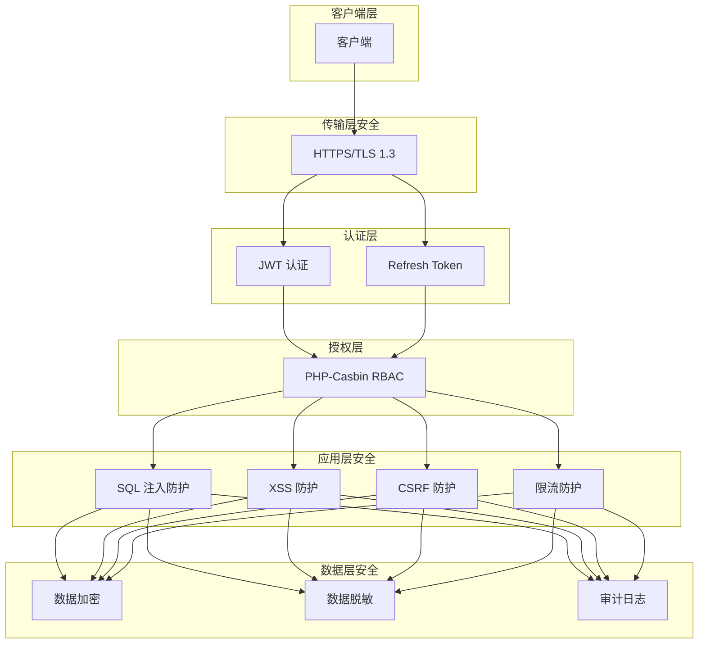

# AlkaidSYS 安全架构设计

## 📋 文档信息

| 项目 | 内容 |
|------|------|
| **文档名称** | AlkaidSYS 安全架构设计 |
| **文档版本** | v1.0 |
| **创建日期** | 2025-01-19 |

## 🔗 关联设计文档

- [术语表（Glossary）](../00-core-planning/99-GLOSSARY.md)
- [安全基线与依赖升级策略](14-security-baseline-and-dependency-upgrade.md)
- [可观测性与运维设计](15-observability-and-ops-design.md)
- [配置与多环境管理设计](../05-deployment-testing/17-configuration-and-environment-management.md)


## 🎯 安全设计目标

1. **认证安全** - JWT Token + Refresh Token 双 Token 机制
2. **授权安全** - PHP-Casbin RBAC 权限控制
3. **传输安全** - HTTPS + TLS 1.3
4. **存储安全** - 敏感数据 AES-256 加密
5. **防护安全** - SQL 注入、XSS、CSRF 防护

## 🏗️ 安全架构图



## 🔐 认证机制

### JWT Token 认证

```php
<?php
// /app/common/service/AuthService.php

namespace app\common\service;

use Firebase\JWT\JWT;
use Firebase\JWT\Key;

class AuthService extends BaseService
{
    protected string $secret;
    protected int $accessTokenExpire = 7200;      // 2小时
    protected int $refreshTokenExpire = 604800;   // 7天

    public function __construct()
    {
        $this->secret = config('app.jwt_secret');
    }

    /**
     * 生成 Access Token
     */
    public function generateAccessToken(int $userId, array $extra = []): string
    {
        $payload = [
            'iss' => env('JWT_ISSUER', 'https://api.alkaidsys.local'),
            'iat' => time(),
            'exp' => time() + $this->accessTokenExpire,
            'user_id' => $userId,
            'tenant_id' => $this->getTenantId(),
            'site_id' => app('request')->siteId(),
            'jti' => $this->generateJti(),  // JWT ID
            ...$extra,
        ];

        return JWT::encode($payload, $this->secret, 'HS256');
    }

    /**
     * 生成 Refresh Token
     */
    public function generateRefreshToken(int $userId): string
    {
        $payload = [
            'iss' => env('JWT_ISSUER', 'https://api.alkaidsys.local'),
            'iat' => time(),
            'exp' => time() + $this->refreshTokenExpire,
            'user_id' => $userId,
            'type' => 'refresh',
            'jti' => $this->generateJti(),
        ];

        $token = JWT::encode($payload, $this->secret, 'HS256');

        // 将 Refresh Token 存储到 Redis（用于撤销）
        $this->storeRefreshToken($userId, $token);

        return $token;
    }

    /**
     * 验证 Token
     */
    public function verifyToken(string $token): array
    {
        try {
            $decoded = JWT::decode($token, new Key($this->secret, 'HS256'));

            // 检查 Token 是否在黑名单中
            if ($this->isTokenBlacklisted($decoded->jti)) {
                throw new \Exception('Token 已失效');
            }

            return (array) $decoded;
        } catch (\Exception $e) {
            throw new \Exception('Token 无效或已过期');
        }
    }
### 🔐 JWT Issuer（iss） 配置与校验策略

- **配置来源**：后端通过 `env('JWT_ISSUER', 'https://api.alkaidsys.local')` 读取 issuer 配置；
- **格式要求**：必须为可解析的域名 / URL，例如：`https://api.alkaidsys.local`、`https://tenant-a.api.alkaidsys.com`；
- **多环境约定**：
  - 开发环境：`https://api.alkaidsys.local`
  - 测试环境：`https://api.test.alkaidsys.com`
  - 生产环境：`https://api.alkaidsys.com`
- **多租户场景**：
  - 支持按租户划分子域名（如 `https://{tenant}.api.alkaidsys.com`），但同一 JWT 服务进程只接受与当前 `JWT_ISSUER` 完全一致的 `iss`；
  - 如需为不同租户使用不同 issuer，应通过网关 / 多实例划分来保证“实例级别的 issuer 一致性”。
- **服务端校验策略**：
  - 所有进入系统的 JWT，在 `JwtService::validateToken()` 中都会校验 `payload['iss'] === $this->issuer`；
  - 任意不匹配的 `iss` 都会被视为非法 token，直接抛出 `Invalid token issuer`；
  - 通过固定 issuer + 域名格式，有利于后续扩展 JWKS 发现与跨服务验证能力。

### 🔄 Refresh Token 轮换与安全策略

- **强制轮换机制**：每次调用 `/v1/auth/refresh` 时，服务端都会：
  1. 使用 `JwtService::validateRefreshToken()` 校验 Refresh Token 的格式/签名、过期时间、issuer、类型以及白名单状态；
  2. 生成新的 Access Token 和新的 Refresh Token；
  3. 删除旧 Refresh Token 对应的白名单记录，并将其 `jti` 加入黑名单；
  4. 将新的 Refresh Token 写入白名单，用于后续刷新。
- **旧 Token 失效时机**：
  - 旧 Refresh Token 在被成功用于刷新后立即失效（白名单删除 + 黑名单加入）；
  - 后续再次使用旧 Token 将触发 `TOKEN_REVOKED` 错误类型。
- **重放攻击检测**：
  - 对于已被撤销或不在白名单中的 Refresh Token，`validateRefreshToken()` 会抛出 `TOKEN_REVOKED` 类型错误；
  - 控制器层会记录审计日志（包含 `user_id`、`tenant_id`、`site_id`、`jti`、`ip` 等），便于后续风控分析。
- **黑名单 TTL 策略**：
  - 黑名单记录默认 TTL 与 Refresh Token 生命周期一致（7 天），通过 `JwtService::revokeToken()` 维护；
  - 如需更长的审计期，可以在后续阶段引入独立的黑名单 TTL 配置（例如 30 天）。


    /**
     * 刷新 Token
     */
    public function refreshToken(string $refreshToken): array
    {
        $payload = $this->verifyToken($refreshToken);

        if ($payload['type'] !== 'refresh') {
            throw new \Exception('无效的 Refresh Token');
        }

        // 检查 Refresh Token 是否存在
        if (!$this->checkRefreshToken($payload['user_id'], $refreshToken)) {
            throw new \Exception('Refresh Token 不存在或已失效');
        }

        // 生成新的 Access Token
        $accessToken = $this->generateAccessToken($payload['user_id']);

        return [
            'access_token' => $accessToken,
            'refresh_token' => $refreshToken,
            'expires_in' => $this->accessTokenExpire,
        ];
    }

    /**
     * 撤销 Token
     */
    public function revokeToken(string $jti): void
    {
        cache("token_blacklist:{$jti}", true, $this->accessTokenExpire);
    }

    /**
     * 检查 Token 是否在黑名单中
     */
    protected function isTokenBlacklisted(string $jti): bool
    {
        return cache("token_blacklist:{$jti}") === true;
    }

    /**
     * 生成 JWT ID
     */
    protected function generateJti(): string
    {
        // 使用加密安全的随机数生成 JTI，避免基于时间的可预测性
        return bin2hex(random_bytes(16));
    }

    /**
     * 存储 Refresh Token
     */
    protected function storeRefreshToken(int $userId, string $token): void
    {
        cache("refresh_token:{$userId}", $token, $this->refreshTokenExpire);
    }

    /**
     * 检查 Refresh Token
     */
    protected function checkRefreshToken(int $userId, string $token): bool
    {
        return cache("refresh_token:{$userId}") === $token;
    }
}
```

### 认证中间件

```php
<?php
// /app/middleware/Auth.php

namespace app\middleware;

use app\common\service\AuthService;

class Auth
{
    public function handle($request, \Closure $next)
    {
        $token = $request->header('Authorization');

        if (!$token) {
            return json([
                'code' => 401,
                'message' => '未提供认证令牌',
                'data' => null,
                'timestamp' => time(),
            ], 401);
        }

        // 移除 "Bearer " 前缀
        $token = str_replace('Bearer ', '', $token);

        try {
            $authService = app(AuthService::class);
            $payload = $authService->verifyToken($token);

            // 将用户信息注入到请求中（使用 Request 实例方法，避免 static/dynamic 属性问题）
            $request->userId($payload['user_id'] ?? null);
            $request->tenantId((int)($payload['tenant_id'] ?? 0));
            $request->siteId((int)($payload['site_id'] ?? 0));

        } catch (\Exception $e) {
            return json([
                'code' => 401,
                'message' => $e->getMessage(),
                'data' => null,
                'timestamp' => time(),
            ], 401);
        }

        return $next($request);
    }
}
```

## 🔑 认证与授权 API 规范（最终版）

本小节定义 `/v1/auth/*` 认证相关 API 的最终契约，所有响应均遵循统一响应结构：

```json
{
  "code": 0,
  "message": "OK",
  "data": {},
  "timestamp": 1705651200,
  "trace_id": "可选，用于排错"
}
```

- `code`: 业务状态码，`0` 表示成功，非 `0` 表示失败（详见错误码表）；
- `message`: 人类可读提示文案；
- `data`: 业务数据或 `null`；
- `trace_id`: 可选，用于前后端联合排错。

### 1. 用户登录（Login）

- 方法：`POST`
- 路径：`/v1/auth/login`
- 认证：不需要
- 描述：根据邮箱与密码进行登录，成功后返回 Access Token、Refresh Token 以及当前用户信息。

**请求体（JSON）示例：**

```json
{
  "email": "admin@example.com",
  "password": "123456"
}
```

**成功响应示例：**

```json
{
  "code": 0,
  "message": "Login successful",
  "data": {
    "access_token": "<JWT Access Token>",
    "refresh_token": "<JWT Refresh Token>",
    "token_type": "Bearer",
    "expires_in": 7200,
    "user": {
      "id": 1,
      "username": "admin",
      "email": "admin@example.com"
    }
  },
  "timestamp": 1705651200
}
```

> 说明：`expires_in` 单位为秒，对应 Access Token 的有效期（默认 2 小时）。Refresh Token 的有效期更长（默认 7 天），仅用于调用刷新接口。

### 2. 用户注册（Register）

- 方法：`POST`
- 路径：`/v1/auth/register`
- 认证：不需要
- 描述：创建新用户账号，并在成功注册后直接返回登录态（Access/Refresh Token + 用户信息）。

**请求体（JSON）示例：**

```json
{
  "username": "alice",
  "email": "alice@example.com",
  "password": "123456",
  "name": "Alice" // 可选，用户显示名称
}
```

**成功响应示例：**

```json
{
  "code": 0,
  "message": "Registration successful",
  "data": {
    "access_token": "<JWT Access Token>",
    "refresh_token": "<JWT Refresh Token>",
    "token_type": "Bearer",
    "expires_in": 7200,
    "user": {
      "id": 2,
      "username": "alice",
      "email": "alice@example.com"
    }
  },
  "timestamp": 1705651200
}
```

### 3. 刷新 Access Token（Refresh）

- 方法：`POST`
- 路径：`/v1/auth/refresh`
- 认证：需要携带 Refresh Token
- 描述：使用仍然有效的 Refresh Token 获取新的 Access Token。

**请求方式：**

- Header：`Authorization: Bearer <Refresh Token>`

**成功响应示例：**

```json
{
  "code": 0,
  "message": "Token refreshed successfully",
  "data": {
    "access_token": "<新的 JWT Access Token>",
    "refresh_token": "<轮换后的新 Refresh Token>",
    "token_type": "Bearer",
    "expires_in": 7200
  },
  "timestamp": 1705651200
}
```

**错误响应示例：**

```json
// 错误响应示例 1：Token 已过期
{
  "code": 2004,
  "message": "Refresh token has expired",
  "data": null,
  "timestamp": 1705651200,
  "trace_id": "abc123"
}

// 错误响应示例 2：Token 已被撤销（可能是重放攻击）
{
  "code": 2007,
  "message": "Refresh token has been revoked or invalidated",
  "data": null,
  "timestamp": 1705651200,
  "trace_id": "def456"
}
```

> 说明：服务端会在内部校验 Refresh Token 的格式/签名、过期时间、issuer、类型以及白名单/黑名单状态，
> 并在每次刷新时**强制轮换 Refresh Token**：签发新的 Refresh Token，同时撤销旧 Token（白名单删除 + 黑名单加入）。

### 4. 获取当前用户信息（Me）

- 方法：`GET`
- 路径：`/v1/auth/me`
- 认证：需要（`Auth` 中间件）
- 描述：基于 Access Token 获取当前登录用户的基础信息与角色列表。

**请求方式：**

- Header：`Authorization: Bearer <Access Token>`

**成功响应示例：**

```json
{
  "code": 0,
  "message": "Success",
  "data": {
    "user": {
      "id": 1,
      "username": "admin",
      "email": "admin@example.com"
    },
    "roles": [1, 2]
  },
  "timestamp": 1705651200
}
```

### 中间件错误响应规范

认证与授权相关的 401/403 响应由 `Auth` 与 `Permission` 中间件统一生成，并遵守统一响应结构：
- 顶层结构始终为：`code` / `message` / `data` / `timestamp` / `trace_id`
- 错误场景下，`data` 统一为 `null`
- 如有字段级错误，可通过 `data.errors` 扩展

- **Auth 中间件**
  - 从请求头 `Authorization: Bearer <Access Token>` 中提取 Access Token；
  - 使用 `JwtService::validateAccessToken()` 校验签名、过期时间、issuer 等信息；
  - 校验通过后，将 `user_id` / `tenant_id` / `site_id` 注入到自定义 `Request` 对象；
  - 任意认证失败（未携带 Token / 无效 / 过期），统一返回 HTTP 401 + 业务 `code = 2001`。

- **Permission 中间件**
  - 依赖 `Auth` 中间件注入的用户上下文（`user_id` / `tenant_id` / `site_id`）；
  - 如果检测到当前请求未认证（缺少用户上下文），则视为认证问题，返回 HTTP 401 + `code = 2001`；
  - 如果已认证但权限不足，则返回 HTTP 403 + 业务 `code = 2002`；
  - 中间件本身不关心业务细节，只负责根据权限判定结果映射到标准错误响应。

**典型中间件错误响应示例：**

```json
// Auth 中间件：未携带或携带无效的 Access Token
{
  "code": 2001,
  "message": "Unauthorized: Token is missing, invalid, or expired",
  "data": null,
  "timestamp": 1705651200,
  "trace_id": "abc123"
}
```

```json
// Permission 中间件：已登录但权限不足
{
  "code": 2002,
  "message": "Forbidden: Insufficient permissions",
  "data": null,
  "timestamp": 1705651200,
  "trace_id": "def456"
}
```


- 服务器内部错误：返回 HTTP 500 + 业务 `code = 5000`。

### Trace 中间件与 trace_id 机制

Trace 中间件负责在整个请求生命周期中维护统一的 `trace_id`，用于请求链路追踪和排错。

- **trace_id 的来源与生成**
  - 优先从请求头 `X-Trace-Id` 读取；
  - 如果不存在，则尝试从 `X-Request-Id` 读取；
  - 如果两个头都不存在，则通过 `bin2hex(random_bytes(16))` 生成一个新的 trace_id；
  - 当 `random_bytes()` 在某些环境下不可用时，回退到 `uniqid('trace_', true)` 生成一个近似唯一的 ID。

- **中间件的职责**
  - 将解析/生成的 trace_id 注入自定义 `app\Request` 对象（通过 `setTraceId()` 方法），后续控制器和服务可以通过 `$request->traceId()` 获取；
  - 将 trace_id 追加到响应头 `X-Trace-Id` 中，便于调用方在客户端日志中关联请求；
  - 与统一响应规范配合，在 JSON 响应中作为可选的顶层字段 `trace_id` 返回，用于前后端联合排错。

- **在系统中的使用场景**
  - 认证与授权相关接口的错误/审计日志会记录 trace_id，尤其是在 Refresh Token 被撤销或疑似重放攻击（业务码 2007）时；
  - 其他业务接口也可以通过 `$request->traceId()` 将 trace_id 透传到下游服务或日志系统，实现端到端链路追踪。

> 实现说明：
> - Trace 中间件定义于 `app/middleware/Trace.php`；
> - 在 `app/middleware.php` 中注册为全局中间件，并放置在中间件数组首位，以确保尽早为后续中间件和控制器提供 trace_id；
> - `AuthController::refresh()` 在记录 Refresh Token 撤销相关的安全审计日志时，会从 `$request->traceId()` 读取当前请求的 trace_id 并写入日志。


### 认证与授权错误码矩阵

下表汇总了认证与授权相关的所有业务错误码，以及对应的 HTTP 状态码、触发场景与 message 示例，便于前后端与运维统一理解：

| 业务码（code） | HTTP 状态码 | 场景描述 | 触发位置 / 来源 | 响应 message 示例 |
| ------------- | ----------- | -------- | ---------------- | ----------------- |
| 2001 | 401 Unauthorized | 未登录 / Token 缺失、无效或过期 | `Auth` 中间件；`Permission` 中间件（检测到未认证） | `"Unauthorized: Token is missing, invalid, or expired"` |
| 2002 | 403 Forbidden | 已登录但权限不足 | `Permission` 中间件（权限判定失败） | `"Forbidden: Insufficient permissions"` |
| 2003 | 401 Unauthorized | Refresh Token 格式错误或签名非法 | `/v1/auth/refresh`（`JwtService::validateRefreshToken`） | `"Invalid refresh token format or signature"` |
| 2004 | 401 Unauthorized | Refresh Token 已过期 | `/v1/auth/refresh`（`JwtService::validateRefreshToken`） | `"Refresh token has expired"` |
| 2005 | 401 Unauthorized | Token issuer 不匹配 | `/v1/auth/refresh`（issuer 校验失败） | `"Token issuer mismatch"` |
| 2006 | 401 Unauthorized | 使用 Access Token 调用 Refresh 接口（type ≠ refresh） | `/v1/auth/refresh`（token 类型校验失败） | `"Expected refresh token, got access token"` |
| 2007 | 401 Unauthorized | Refresh Token 已被撤销或重放（黑名单/白名单命中） | `/v1/auth/refresh`（撤销/重放检测，记录安全审计日志） | `"Refresh token has been revoked or invalidated"` |
| 5000 | 500 Internal Server Error | 服务器内部错误（未捕获异常 / 意外错误） | 全局异常处理 / 统一错误处理器 | `"Internal Server Error"` |


## 🔒 授权机制（PHP-Casbin）

本小节描述授权机制的阶段性路线：

- **Phase 1（当前阶段实现——基于数据库的 RBAC）**：
  - 当前后端通过 `roles`、`permissions`、`role_permissions` 三张表以及 `Permission` 中间件完成 RBAC 鉴权；
  - 该实现作为 Casbin 落地前的过渡方案，需保持与权限码规范（内部 `slug = resource.action`，对外 `code = resource:action`）完全一致。
- **Phase 2（目标架构——基于 PHP-Casbin 的 RBAC，必须落地）**：
  - 本节后续 Casbin 模型配置与 `PermissionService` 代码示例定义了目标态授权引擎；
  - 实施 Phase 2 时，必须以 `PermissionService` 为唯一授权入口，通过适配层将 Phase 1 的数据库策略逐步迁移为 Casbin 策略，而无需修改控制器或中间件的调用方式。

> 设计约束：Casbin 被视为必须实现的目标授权架构；长期绕过 `PermissionService` 或绕过 RBAC 的实现均视为违反本设计。

### Casbin 模型配置

```ini
# /config/casbin-model.conf

[request_definition]
r = sub, obj, act

[policy_definition]
p = sub, obj, act

[role_definition]
g = _, _

[policy_effect]
e = some(where (p.eft == allow))

[matchers]
m = g(r.sub, p.sub) && r.obj == p.obj && r.act == p.act
```

### 授权服务

```php
<?php
// /app/common/service/PermissionService.php

namespace app\common\service;

use Casbin\Enforcer;

class PermissionService extends BaseService
{
    protected Enforcer $enforcer;

    public function __construct()
    {
        $this->enforcer = app(Enforcer::class);
    }

    /**
     * 检查权限
     */
    public function check(int $userId, int $tenantId, string $resource, string $action): bool
    {
        // 通过在资源前加租户前缀的方式实现租户域隔离：tenant:{tenantId}:{resource}
        $scopedResource = "tenant:{$tenantId}:{$resource}";
        return $this->enforcer->enforce(
            "user:{$userId}",
            $scopedResource,
            $action
        );
    }

    /**
     * 添加权限
     */
    public function addPermission(int $tenantId, int $roleId, string $resource, string $action): bool
    {
        // 策略入库同样带上租户前缀，保证跨租户不互相影响
        $scopedResource = "tenant:{$tenantId}:{$resource}";
        return $this->enforcer->addPolicy(
            "role:{$roleId}",
            $scopedResource,
            $action
        );
    }

    /**
     * 分配角色
     */
    public function assignRole(int $userId, int $roleId): bool
    {
        return $this->enforcer->addRoleForUser(
            "user:{$userId}",
            "role:{$roleId}"
        );
    }

    /**
     * 获取用户权限
     */
    public function getUserPermissions(int $userId): array
    {
        return $this->enforcer->getPermissionsForUser("user:{$userId}");
    }
}
```

### 授权中间件

```php
<?php
// /app/middleware/Permission.php

namespace app\middleware;

use app\common\service\PermissionService;

class Permission
{
    public function handle($request, \Closure $next, string $permission)
    {
        // Get current userId & tenantId from Request

        $userId   = $request->userId();
        $tenantId = $request->tenantId();

        // 解析权限（格式：resource:action）
        [$resource, $action] = explode(':', $permission);

        $permissionService = app(PermissionService::class);

        if (!$permissionService->check($userId ?? 0, $tenantId ?? 0, $resource, $action)) {
            return json([
                'code' => 403,
                'message' => '无权限访问',
                'data' => null,
                'timestamp' => time(),
            ], 403);
        }

### API 请求签名与防重放

```php
<?php
// /app/middleware/Signature.php

namespace app\middleware;

use think\facade\Cache;

class Signature
{
    protected int $skew = 300; // 允许的时间偏移（秒）

    public function handle($request, \Closure $next)
    {
        $appKey = $request->header('X-App-Key');
        $timestamp = (int) $request->header('X-Timestamp');
        $nonce = $request->header('X-Nonce');
        $signature = $request->header('X-Signature');

        if (!$appKey || !$timestamp || !$nonce || !$signature) {
            return json(['code' => 400, 'message' => '缺少签名头', 'data' => null, 'timestamp' => time()], 400);
        }

        // 1) 防重放：时间窗口校验
        if (abs(time() - $timestamp) > $this->skew) {
            return json(['code' => 400, 'message' => '请求过期', 'data' => null, 'timestamp' => time()], 400);
        }

        // 2) 防重放：nonce 一次性校验
        $nonceKey = "nonce:{$appKey}:{$nonce}";
        if (Cache::get($nonceKey)) {
            return json(['code' => 400, 'message' => '重复请求', 'data' => null, 'timestamp' => time()], 400);
        }
        Cache::set($nonceKey, 1, $this->skew);

        // 3) 签名校验：HMAC-SHA256(method|path|timestamp|nonce|body)
        $secret = config("app.secrets.{$appKey}");
        if (!$secret) {
            return json(['code' => 401, 'message' => '无效的应用密钥', 'data' => null, 'timestamp' => time()], 401);
        }

        $body = $request->getContent();
        $plain = $request->method() . '|' . $request->url(true) . '|' . $timestamp . '|' . $nonce . '|' . $body;
        $expect = hash_hmac('sha256', $plain, $secret);

        if (!hash_equals($expect, $signature)) {
            return json(['code' => 401, 'message' => '签名校验失败', 'data' => null, 'timestamp' => time()], 401);
        }

        return $next($request);
    }
}
```

> 说明：该签名方案与限流、JWT 并不冲突，适用于开放给第三方的高价值接口。可按需在特定路由组启用。

### 回调签名验签失败与重放攻击示例与审计字段模板

```php
<?php
// 回调入口示例（支付/第三方通知）
public function notify()
{
    $headers = request()->header();
    $body = request()->getContent();
    $ts = (int)($headers['x-timestamp'] ?? 0);
    $nonce = $headers['x-nonce'] ?? '';
    $sig = $headers['x-signature'] ?? '';
    $algo = strtolower($headers['x-signature-algorithm'] ?? 'hmac-sha256');

    // 审计日志关键字段（请求侧）
    $audit = [
        'request_id' => request()->header('x-request-id') ?? uuid_create(),
        'channel' => 'callback',
        'path' => request()->url(true),
        'ip' => request()->ip(),
        'timestamp' => $ts,
        'nonce' => $nonce,
        'algorithm' => $algo,
        'body_sha256' => hash('sha256', $body),
        'received_at' => time(),
    ];

    // 1) 时间窗口
    if (abs(time() - $ts) > 300) {
        $audit['reason'] = 'expired_timestamp';
        $this->auditFail($audit);
        return json(['code' => 400, 'message' => 'expired timestamp'], 400);
    }

    // 2) Nonce 防重放
    $key = sprintf('cb-nonce:%s:%s', $audit['request_id'], $nonce);
    if (cache($key)) {
        $audit['reason'] = 'replay_detected';
        $this->auditFail($audit);
        return json(['code' => 400, 'message' => 'replay detected'], 400);
    }
    cache($key, 1, 300);

    // 3) 验签（默认 HMAC-SHA256，可扩展 RSA/Ed25519）
    $plain = sprintf('%s|%s|%d|%s|%s', strtoupper(request()->method()), request()->url(true), $ts, $nonce, $body);
    $secret = config('app.callback_secret');
    $expect = hash_hmac('sha256', $plain, $secret);
    if (!hash_equals($expect, $sig)) {
        $audit['reason'] = 'invalid_signature';
        $this->auditFail($audit);
        return json(['code' => 401, 'message' => 'invalid signature'], 401);
    }

    // 业务处理...
    $resp = ['code' => 200, 'message' => 'ok'];

    // 审计日志关键字段（响应侧）
    $audit['status'] = 'ok';
    $audit['responded_at'] = time();
    $this->auditOk($audit);

    return json($resp, 200)->header([
        'X-Request-ID' => $audit['request_id'],
        'X-Server-Time' => (string)time(),
    ]);
}

protected function auditFail(array $audit): void
{
    // 持久化失败审计：request_id/path/ip/timestamp/nonce/algorithm/body_sha256/reason/received_at
    \think\facade\Db::name('audit_api')->insert([
        'request_id' => $audit['request_id'], 'channel' => $audit['channel'],
        'path' => $audit['path'], 'ip' => $audit['ip'], 'timestamp' => $audit['timestamp'],
        'nonce' => $audit['nonce'], 'algorithm' => $audit['algorithm'], 'body_sha256' => $audit['body_sha256'],
        'reason' => $audit['reason'] ?? 'unknown', 'status' => 'fail', 'created_at' => date('Y-m-d H:i:s', $audit['received_at'])
    ]);
}

protected function auditOk(array $audit): void
{
    \think\facade\Db::name('audit_api')->insert([
        'request_id' => $audit['request_id'], 'channel' => $audit['channel'], 'path' => $audit['path'],
        'ip' => $audit['ip'], 'timestamp' => $audit['timestamp'], 'nonce' => $audit['nonce'],
        'algorithm' => $audit['algorithm'], 'body_sha256' => $audit['body_sha256'],
        'status' => $audit['status'] ?? 'ok', 'created_at' => date('Y-m-d H:i:s', $audit['received_at']),
        'responded_at' => date('Y-m-d H:i:s', $audit['responded_at'] ?? time()),
    ]);
}
```

> 审计字段模板：request_id、channel、path、ip、timestamp、nonce、algorithm、body_sha256、reason、status、created_at、responded_at。与 03-data-layer/10-api-design 的响应头建议保持一致。


## 🔐 数据加密

### AES-256 加密服务

```php
<?php
// /app/common/service/EncryptService.php

namespace app\common\service;

class EncryptService
{
    protected string $key;
    protected string $cipher = 'AES-256-CBC';

    public function __construct()
    {
        $this->key = config('app.encrypt_key');
    }

    /**
     * 加密
     */
    public function encrypt(string $data): string
    {
        $ivLength = openssl_cipher_iv_length($this->cipher);
        $iv = random_bytes($ivLength);

        $ciphertext = openssl_encrypt(
            $data,
            $this->cipher,
            $this->key,
            OPENSSL_RAW_DATA,
            $iv
        );

        // 将 IV 与密文拼接后进行一次 Base64 编码
        return base64_encode($iv . $ciphertext);
    }

    /**
     * 解密
     */
    public function decrypt(string $data)
    {
        // 先进行 Base64 解码，还原出 IV + 密文
        $raw = base64_decode($data, true);
        if ($raw === false) {
            return false;
        }

        $ivLength = openssl_cipher_iv_length($this->cipher);
        $iv = substr($raw, 0, $ivLength);
        $ciphertext = substr($raw, $ivLength);

        return openssl_decrypt(
            $ciphertext,
            $this->cipher,
            $this->key,
            OPENSSL_RAW_DATA,
            $iv
        );
    }
}
```

### 模型加密字段

```php
<?php
// /app/common/model/User.php

namespace app\common\model;

use app\common\service\EncryptService;

class User extends BaseModel
{
    // 需要加密的字段
    protected array $encrypted = ['mobile', 'id_card'];

    /**
     * 获取器 - 自动解密
     */
    public function getMobileAttr($value)
    {
        if (empty($value)) {
            return $value;
        }

        $encryptService = app(EncryptService::class);
        return $encryptService->decrypt($value);
    }

    /**
     * 修改器 - 自动加密
     */
    public function setMobileAttr($value)
    {
        if (empty($value)) {
            return $value;
        }

        $encryptService = app(EncryptService::class);
        return $encryptService->encrypt($value);
    }
}
```

## 🛡️ 防护机制

### SQL 注入防护

```php
<?php
// ThinkPHP 8.0 默认使用参数绑定，自动防止 SQL 注入

// ✅ 安全的查询（参数绑定）
User::where('username', $username)->find();
User::where('id', 'in', $ids)->select();

// ❌ 不安全的查询（避免使用）
Db::query("SELECT * FROM users WHERE username = '{$username}'");
```

### XSS 防护

```php
<?php
// /app/common/service/XssService.php

namespace app\common\service;

class XssService
{
    /**
     * 过滤 XSS
     */
    public function clean($data)
    {
        if (is_array($data)) {
            return array_map([$this, 'clean'], $data);
        }

        if (is_string($data)) {
            return htmlspecialchars($data, ENT_QUOTES, 'UTF-8');
        }

        return $data;
    }
}

// 中间件
class XssFilter
{
    public function handle($request, \Closure $next)
    {
        $xssService = app(XssService::class);

        // 过滤 GET 参数
        $request->get = $xssService->clean($request->get());

        // 过滤 POST 参数
        $request->post = $xssService->clean($request->post());

        return $next($request);
    }
}
```

### CSRF 防护

```php
<?php
// /app/middleware/VerifyCsrfToken.php

namespace app\middleware;

class VerifyCsrfToken
{
    protected array $except = [
        'api/*',  // API 接口不需要 CSRF 验证
    ];

    public function handle($request, \Closure $next)
    {
        if ($this->shouldSkip($request)) {
            return $next($request);
        }

        $token = $request->header('X-CSRF-TOKEN') ?? $request->post('_token');
        $sessionToken = session('csrf_token');

        if (!$token || !hash_equals($sessionToken, $token)) {
            return json([
                'code' => 419,
                'message' => 'CSRF token 验证失败',
                'data' => null,
                'timestamp' => time(),
            ], 419);
        }

        return $next($request);
    }

    protected function shouldSkip($request): bool
    {
        foreach ($this->except as $pattern) {
            if ($request->is($pattern)) {
                return true;
            }
        }
        return false;
    }
}
```

## 🔍 数据脱敏

```php
<?php
// /app/common/service/MaskService.php

namespace app\common\service;

class MaskService
{
    /**
     * 手机号脱敏
     */
    public function maskMobile(string $mobile): string
    {
        return substr_replace($mobile, '****', 3, 4);
    }

    /**
     * 身份证号脱敏
     */
    public function maskIdCard(string $idCard): string
    {
        return substr_replace($idCard, '**********', 6, 10);
    }

    /**
     * 银行卡号脱敏
     */
    public function maskBankCard(string $bankCard): string
    {
        $length = strlen($bankCard);
        return substr_replace($bankCard, str_repeat('*', $length - 8), 4, $length - 8);
    }

    /**
     * 邮箱脱敏
     */
    public function maskEmail(string $email): string
    {
        [$name, $domain] = explode('@', $email);
        $nameLength = strlen($name);
        $maskLength = max(1, $nameLength - 2);
        $maskedName = substr_replace($name, str_repeat('*', $maskLength), 1, $maskLength);
        return $maskedName . '@' . $domain;
    }
}
```

## 🆚 与 NIUCLOUD 安全对比

| 特性 | AlkaidSYS | NIUCLOUD | 优势 |
|------|-----------|----------|------|
| **认证机制** | JWT + Refresh Token | Session | ✅ 更适合分布式 |
| **授权机制** | PHP-Casbin RBAC | 自定义 RBAC | ✅ 更灵活 |
| **数据加密** | AES-256 | 部分加密 | ✅ 更安全 |
| **Token 撤销** | 支持 | 不支持 | ✅ 更完善 |
| **数据脱敏** | 完整方案 | 基础脱敏 | ✅ 更全面 |

---

**最后更新**: 2025-01-19
**文档版本**: v1.0
**维护者**: AlkaidSYS 架构团队

