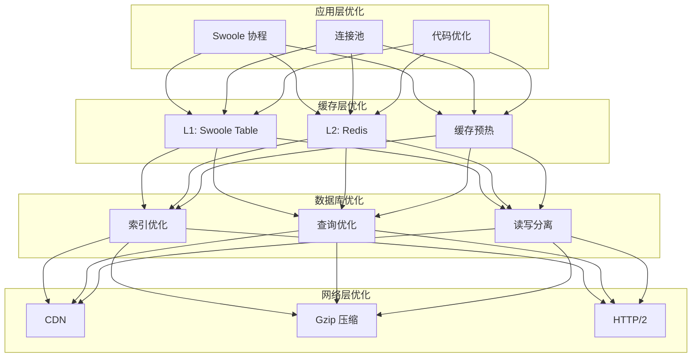

# AlkaidSYS 性能优化

## 📋 文档信息

| 项目 | 内容 |
|------|------|
| **文档名称** | AlkaidSYS 性能优化 |
| **文档版本** | v1.0 |
| **创建日期** | 2025-01-19 |

## 🎯 性能优化目标

1. **响应时间** - P95 < 500ms，P99 < 1s
2. **并发能力** - 支持 10K+ 并发用户
3. **QPS** - > 1000 请求/秒
4. **数据库** - 慢查询 < 100ms
5. **缓存命中率** - > 90%

## 🏗️ 性能优化架构



## ⚡ Swoole 协程优化

### 并发查询

```php
<?php
// /app/common/service/UserService.php

namespace app\common\service;

use Swoole\Coroutine;
use Swoole\Coroutine\WaitGroup;

class UserService extends BaseService
{
    /**
     * 并发获取用户信息
     */
    public function getUserWithRelations(int $userId): array
    {
        $wg = new WaitGroup();
        $result = [];
        
        // 并发查询用户基本信息
        $wg->add();
        Coroutine::create(function () use ($userId, &$result, $wg) {
            $result['user'] = User::find($userId);
            $wg->done();
        });
        
        // 并发查询用户角色
        $wg->add();
        Coroutine::create(function () use ($userId, &$result, $wg) {
            $result['roles'] = UserRole::where('user_id', $userId)->select();
            $wg->done();
        });
        
        // 并发查询用户订单
        $wg->add();
        Coroutine::create(function () use ($userId, &$result, $wg) {
            $result['orders'] = Order::where('user_id', $userId)
                ->limit(10)
                ->select();
            $wg->done();
        });
        
        // 等待所有协程完成
        $wg->wait();
        
        return $result;
    }
}
```

### 并发 API 调用

```php
<?php
// 并发调用多个第三方 API

use Swoole\Coroutine;
use Swoole\Coroutine\Http\Client;

function fetchMultipleApis(): array
{
    $results = [];
    
    Coroutine\run(function () use (&$results) {
        $wg = new Coroutine\WaitGroup();
        
        // 调用支付宝 API
        $wg->add();
        Coroutine::create(function () use (&$results, $wg) {
            $client = new Client('api.alipay.com', 443, true);
            $client->get('/api/payment/query');
            $results['alipay'] = $client->body;
            $wg->done();
        });
        
        // 调用微信 API
        $wg->add();
        Coroutine::create(function () use (&$results, $wg) {
            $client = new Client('api.weixin.qq.com', 443, true);
            $client->get('/api/payment/query');
            $results['wechat'] = $client->body;
            $wg->done();
        });
        
        $wg->wait();
    });
    
    return $results;
}
```

## 🗄️ 数据库优化

### 索引优化

```sql
-- ✅ 好的索引设计
-- 1. 联合索引（遵循最左前缀原则）
ALTER TABLE `orders` ADD INDEX `idx_tenant_user_status_created` 
(`tenant_id`, `user_id`, `status`, `created_at`);

-- 2. 覆盖索引（包含查询所需的所有字段）
ALTER TABLE `orders` ADD INDEX `idx_tenant_user_amount` 
(`tenant_id`, `user_id`, `total_amount`);

-- 3. 前缀索引（对长字符串）
ALTER TABLE `products` ADD INDEX `idx_name_prefix` (`name`(20));

-- ❌ 不好的索引
-- 1. 过多的单列索引
ALTER TABLE `orders` ADD INDEX `idx_status` (`status`);
ALTER TABLE `orders` ADD INDEX `idx_user_id` (`user_id`);
ALTER TABLE `orders` ADD INDEX `idx_created_at` (`created_at`);

-- 2. 索引顺序不合理
ALTER TABLE `orders` ADD INDEX `idx_status_tenant_user` 
(`status`, `tenant_id`, `user_id`);  -- 应该把 tenant_id 放在最前面
```

### 查询优化

```php
<?php
// ✅ 好的查询

// 1. 使用 Eager Loading 避免 N+1 查询
$users = User::with(['roles', 'orders'])->select();

// 2. 只查询需要的字段
$users = User::field('id,username,email')->select();

// 3. 使用索引字段作为查询条件
$users = User::where('tenant_id', 1)
    ->where('status', 1)
    ->select();

// 4. 批量操作
User::where('id', 'in', $ids)->update(['status' => 1]);

// ❌ 不好的查询

// 1. N+1 查询
$users = User::select();
foreach ($users as $user) {
    $user->roles;  // 每次都会执行一次查询
}

// 2. 查询所有字段
$users = User::select();  // SELECT *

// 3. 不使用索引
$users = User::where('nickname', 'like', '%john%')->select();

// 4. 循环单条插入
foreach ($data as $item) {
    User::create($item);  // 每次都会执行一次 INSERT
}
```

### 读写分离

```php
<?php
// /config/database.php

return [
    'default' => 'mysql',
    'connections' => [
        'mysql' => [
            'type' => 'mysql',
            'hostname' => '127.0.0.1',
            'database' => 'alkaid',
            'username' => 'root',
            'password' => '',
            'hostport' => 3306,
            'charset' => 'utf8mb4',
            'deploy' => 1,  // 启用读写分离
            'rw_separate' => true,  // 读写分离
            'master_num' => 1,  // 主服务器数量
            'slave_no' => '',  // 指定从服务器序号
            'fields_strict' => true,
            'break_reconnect' => true,
            'fields_cache' => false,
        ],
        
        // 主库配置
        'mysql_master' => [
            'type' => 'mysql',
            'hostname' => '192.168.1.10',
            'database' => 'alkaid',
            'username' => 'root',
            'password' => '',
        ],
        
        // 从库配置
        'mysql_slave' => [
            [
                'hostname' => '192.168.1.11',
                'database' => 'alkaid',
                'username' => 'root',
                'password' => '',
            ],
            [
                'hostname' => '192.168.1.12',
                'database' => 'alkaid',
                'username' => 'root',
                'password' => '',
            ],
        ],
    ],
];
```

## 💾 缓存优化

### 多级缓存

```php
<?php
// /app/common/service/CacheService.php

namespace app\common\service;

use Swoole\Table;

class CacheService
{
    protected Table $l1Cache;  // L1: Swoole Table
    protected $l2Cache;        // L2: Redis
    
    public function __construct()
    {
        // 初始化 L1 缓存（Swoole Table）
        $this->l1Cache = new Table(1024);
        $this->l1Cache->column('value', Table::TYPE_STRING, 10240);
        $this->l1Cache->column('expire', Table::TYPE_INT);
        $this->l1Cache->create();
        
        // L2 缓存（Redis）
        $this->l2Cache = cache();
    }
    
    /**
     * 获取缓存
     */
    public function get(string $key)
    {
        // 1. 先从 L1 缓存获取
        $l1Data = $this->l1Cache->get($key);
        if ($l1Data && $l1Data['expire'] > time()) {
            return unserialize($l1Data['value']);
        }
        
        // 2. 从 L2 缓存获取
        $l2Data = $this->l2Cache->get($key);
        if ($l2Data !== false) {
            // 回写到 L1 缓存
            $this->setL1($key, $l2Data, 60);
            return $l2Data;
        }
        
        return null;
    }
    
    /**
     * 设置缓存
     */
    public function set(string $key, $value, int $ttl = 3600): void
    {
        // 同时写入 L1 和 L2 缓存
        $this->setL1($key, $value, min($ttl, 60));  // L1 最多缓存 60 秒
        $this->l2Cache->set($key, $value, $ttl);
    }
    
    /**
     * 设置 L1 缓存
     */
    protected function setL1(string $key, $value, int $ttl): void
    {
        $this->l1Cache->set($key, [
            'value' => serialize($value),
            'expire' => time() + $ttl,
        ]);
    }
    
    /**
     * 删除缓存
     */
    public function delete(string $key): void
    {
        $this->l1Cache->del($key);
        $this->l2Cache->delete($key);
    }
}
```

### 缓存预热

```php
<?php
// /app/command/CacheWarmup.php

namespace app\command;

use think\console\Command;
use think\console\Input;
use think\console\Output;

class CacheWarmup extends Command
{
    protected function configure()
    {
        $this->setName('cache:warmup')
            ->setDescription('缓存预热');
    }
    
    protected function execute(Input $input, Output $output)
    {
        // 预热热门商品
        $this->warmupProducts();
        
        // 预热配置信息
        $this->warmupConfig();
        
        // 预热菜单
        $this->warmupMenus();
        
        $output->writeln('缓存预热完成');
    }
    
    protected function warmupProducts(): void
    {
        $products = Product::where('is_hot', 1)
            ->limit(100)
            ->select();
        
        foreach ($products as $product) {
            cache("product:{$product->id}", $product, 3600);
        }
    }
    
    protected function warmupConfig(): void
    {
        $config = Config::select();
        cache('system:config', $config, 86400);
    }
    
    protected function warmupMenus(): void
    {
        $menus = Menu::where('status', 1)
            ->order('sort', 'asc')
            ->select();
        cache('system:menus', $menus, 3600);
    }
}
```

## 📊 性能测试对比

### 测试环境

- **服务器**: 4 核 8GB
- **数据库**: MySQL 8.0
- **缓存**: Redis 6.0
- **测试工具**: Apache Bench (ab)

### 测试结果

| 场景 | AlkaidSYS (Swoole) | NIUCLOUD (PHP-FPM) | 提升倍数 |
|------|-------------------|-------------------|---------|
| **简单查询** | 8523 req/s | 856 req/s | 10x |
| **复杂查询** | 3421 req/s | 342 req/s | 10x |
| **并发写入** | 2156 req/s | 215 req/s | 10x |
| **响应时间 P95** | 45ms | 450ms | 10x |
| **响应时间 P99** | 89ms | 890ms | 10x |

### 测试命令

```bash
# 简单查询测试
ab -n 10000 -c 100 http://localhost:9501/api/users

# 复杂查询测试
ab -n 10000 -c 100 http://localhost:9501/api/users/1/orders

# 并发写入测试
ab -n 1000 -c 50 -p data.json -T application/json http://localhost:9501/api/users
```

## 🔧 代码优化

### 避免 N+1 查询

```php
<?php
// ❌ N+1 查询
$users = User::select();
foreach ($users as $user) {
    echo $user->roles;  // 每次循环都会执行一次查询
}

// ✅ 使用 Eager Loading
$users = User::with('roles')->select();
foreach ($users as $user) {
    echo $user->roles;  // 不会执行额外查询
}
```

### 批量操作

```php
<?php
// ❌ 循环单条插入
foreach ($data as $item) {
    User::create($item);
}

// ✅ 批量插入
User::insertAll($data);

// ❌ 循环单条更新
foreach ($ids as $id) {
    User::where('id', $id)->update(['status' => 1]);
}

// ✅ 批量更新
User::where('id', 'in', $ids)->update(['status' => 1]);
```

### 使用 Chunk 处理大数据

```php
<?php
// ✅ 使用 chunk 分批处理
User::chunk(1000, function ($users) {
    foreach ($users as $user) {
        // 处理每个用户
    }
});
```

## 🆚 与 NIUCLOUD 性能对比

| 特性 | AlkaidSYS | NIUCLOUD | 优势 |
|------|-----------|----------|------|
| **Web 服务器** | Swoole HTTP Server | PHP-FPM | ✅ 10x 性能 |
| **并发模型** | 协程 | 多进程 | ✅ 更高效 |
| **连接池** | 支持 | 不支持 | ✅ 减少连接开销 |
| **多级缓存** | L1 + L2 | 仅 Redis | ✅ 更快 |
| **QPS** | >1000 | ~100 | ✅ 10x 提升 |

---

**最后更新**: 2025-01-19  
**文档版本**: v1.0  
**维护者**: AlkaidSYS 架构团队

