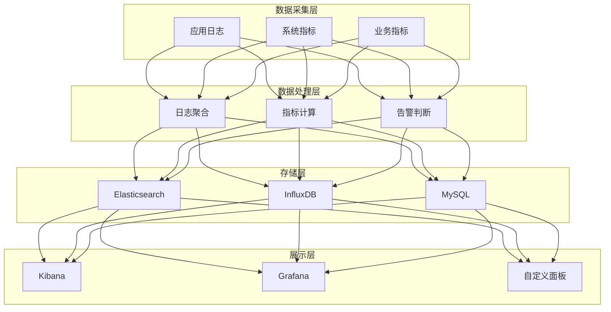

# AlkaidSYS 监控和日志

## 📋 文档信息

| 项目 | 内容 |
|------|------|
| **文档名称** | AlkaidSYS 监控和日志 |
| **文档版本** | v1.0 |
| **创建日期** | 2025-01-19 |

## 🔗 关联设计文档

- [术语表（Glossary）](../00-core-planning/99-GLOSSARY.md)
- [可观测性与运维设计](15-observability-and-ops-design.md)
- [安全架构设计](11-security-design.md)


## 🎯 监控和日志目标

1. **全面监控** - 应用、数据库、缓存、服务器
2. **实时告警** - 异常及时通知
3. **日志分级** - DEBUG、INFO、WARNING、ERROR、CRITICAL
4. **日志分类** - 访问日志、错误日志、业务日志、审计日志
5. **可视化** - 日志查询和分析

## 🏗️ 监控架构



## 📝 日志系统

### 日志配置

```php
<?php
// /config/log.php

return [
    'default' => 'file',
    'channels' => [
        // 文件日志
        'file' => [
            'type' => 'File',
            'path' => runtime_path() . 'log/',
            'level' => ['error', 'warning', 'info', 'debug'],
            'file_size' => 10485760,  // 10MB
            'max_files' => 30,
            'json' => true,  // JSON 格式
        ],

        // 数据库日志
        'database' => [
            'type' => 'Database', // 自定义驱动示例，需实现对应 handler
            'table' => 'system_logs',
            'level' => ['error', 'warning'],
        ],

        // Elasticsearch 日志
        'elasticsearch' => [
            'type' => 'Elasticsearch', // 自定义驱动示例，需实现对应 handler
            'host' => '127.0.0.1:9200',
            'index' => 'alkaid-logs',
            'level' => ['error', 'warning', 'info'],
        ],
    ],
];
```

### 日志服务

```php
<?php
// /app/common/service/LogService.php

namespace app\common\service;

use think\facade\Log;

class LogService
{
    /**
     * 记录访问日志
     */
    public function logAccess(array $data): void
    {
        Log::channel('file')->info('access', [
            'user_id' => $data['user_id'] ?? 0,
            'tenant_id' => $data['tenant_id'] ?? 0,
            'ip' => $data['ip'],
            'method' => $data['method'],
            'url' => $data['url'],
            'params' => $data['params'],
            'response_time' => $data['response_time'],
            'status_code' => $data['status_code'],
            'timestamp' => time(),
        ]);
    }

    /**
     * 记录错误日志
     */
    public function logError(\Throwable $e, array $context = []): void
    {
        Log::channel('file')->error($e->getMessage(), [
            'exception' => get_class($e),
            'file' => $e->getFile(),
            'line' => $e->getLine(),
            'trace' => $e->getTraceAsString(),
            'context' => $context,
            'timestamp' => time(),
        ]);
    }

    /**
     * 记录业务日志
     */
    public function logBusiness(string $action, array $data): void
    {
        Log::channel('file')->info('business', [
            'action' => $action,
            'user_id' => $data['user_id'] ?? 0,
            'tenant_id' => $data['tenant_id'] ?? 0,
            'data' => $data,
            'timestamp' => time(),
        ]);
    }

    /**
     * 记录审计日志
     */
    public function logAudit(string $action, array $data): void
    {
        Log::channel('database')->info('audit', [
            'action' => $action,
            'user_id' => $data['user_id'],
            'tenant_id' => $data['tenant_id'],
            'ip' => $data['ip'],
            'before' => $data['before'] ?? null,
            'after' => $data['after'] ?? null,
            'timestamp' => time(),
        ]);
    }
}
```

### 日志中间件

```php
<?php
// /app/middleware/AccessLog.php

namespace app\middleware;

use app\common\service\LogService;

class AccessLog
{
    public function handle($request, \Closure $next)
    {
        $startTime = microtime(true);

        $response = $next($request);

        $endTime = microtime(true);
        $responseTime = round(($endTime - $startTime) * 1000, 2);

        $logService = app(LogService::class);
        $logService->logAccess([
            'user_id' => $request->userId ?? 0,
            'tenant_id' => $request->tenantId ?? 0,
            'ip' => $request->ip(),
            'method' => $request->method(),
            'url' => $request->url(),
            'params' => $request->param(),
            'response_time' => $responseTime,
            'status_code' => $response->getCode(),
        ]);

        return $response;
    }
}
```

## 📊 性能监控

### APM 监控

```php
<?php
// /app/common/service/ApmService.php

namespace app\common\service;

use think\facade\Log;

class ApmService
{
    /**
     * 记录慢查询
     */
    public function logSlowQuery(string $sql, float $time): void
    {
        if ($time > 100) {  // 超过 100ms
            Log::warning('slow_query', [
                'sql' => $sql,
                'time' => $time,
                'timestamp' => time(),
            ]);
        }
    }

    /**
     * 记录慢接口
     */
    public function logSlowApi(string $url, float $time): void
    {
        if ($time > 500) {  // 超过 500ms
            Log::warning('slow_api', [
                'url' => $url,
                'time' => $time,
                'timestamp' => time(),
            ]);
        }
    }

    /**
     * 记录内存使用
     */
    public function logMemoryUsage(): void
    {
        $memory = memory_get_usage(true);
        $peak = memory_get_peak_usage(true);

        if ($memory > 100 * 1024 * 1024) {  // 超过 100MB
            Log::warning('high_memory', [
                'memory' => $memory,
                'peak' => $peak,
                'timestamp' => time(),
            ]);
        }
    }
}
```

### 系统指标采集

```php
<?php
// /app/command/CollectMetrics.php

namespace app\command;

use think\console\Command;
use think\console\Input;
use think\console\Output;
use think\facade\Db;

class CollectMetrics extends Command
{
    protected function configure()
    {
        $this->setName('metrics:collect')
            ->setDescription('采集系统指标');
    }

    protected function execute(Input $input, Output $output)
    {
        // 采集数据库指标
        $this->collectDatabaseMetrics();

        // 采集缓存指标
        $this->collectCacheMetrics();

        // 采集业务指标
        $this->collectBusinessMetrics();

        $output->writeln('指标采集完成');
    }

    protected function collectDatabaseMetrics(): void
    {
        // 查询数据库连接数
        $connections = Db::query('SHOW STATUS LIKE "Threads_connected"');

        // 查询慢查询数
        $slowQueries = Db::query('SHOW STATUS LIKE "Slow_queries"');

        // 存储到 InfluxDB
        // ...
    }

    protected function collectCacheMetrics(): void
    {
        $info = cache()->handler()->info();

        // 缓存命中率
        $hitRate = $info['keyspace_hits'] / ($info['keyspace_hits'] + $info['keyspace_misses']);

        // 存储到 InfluxDB
        // ...
    }

    protected function collectBusinessMetrics(): void
    {
        // 今日订单数
        $todayOrders = Order::whereTime('created_at', 'today')->count();

        // 今日销售额
        $todaySales = Order::whereTime('created_at', 'today')->sum('total_amount');

        // 存储到 InfluxDB
        // ...
    }
}
```

## 🚨 告警机制

### 告警服务

```php
<?php
// /app/common/service/AlertService.php

namespace app\common\service;

class AlertService
{
    /**
     * 发送告警
     */
    public function send(string $level, string $title, string $message): void
    {
        // 根据级别选择通知方式
        switch ($level) {
            case 'critical':
                $this->sendEmail($title, $message);
                $this->sendSms($message);
                $this->sendDingTalk($title, $message);
                break;
            case 'error':
                $this->sendEmail($title, $message);
                $this->sendDingTalk($title, $message);
                break;
            case 'warning':
                $this->sendDingTalk($title, $message);
                break;
        }
    }

    /**
     * 发送邮件告警
     */
    protected function sendEmail(string $title, string $message): void
    {
        // 发送邮件
    }

    /**
     * 发送短信告警
     */
    protected function sendSms(string $message): void
    {
        // 发送短信
    }

    /**
     * 发送钉钉告警
     */
    protected function sendDingTalk(string $title, string $message): void
    {
        $webhook = config('alert.dingtalk_webhook');

        $data = [
            'msgtype' => 'markdown',
            'markdown' => [
                'title' => $title,
                'text' => "### {$title}\n\n{$message}\n\n> 时间：" . date('Y-m-d H:i:s'),
            ],
        ];

        $ch = curl_init($webhook);
        curl_setopt($ch, CURLOPT_POST, 1);
        curl_setopt($ch, CURLOPT_POSTFIELDS, json_encode($data));
        curl_setopt($ch, CURLOPT_HTTPHEADER, ['Content-Type: application/json']);
        curl_setopt($ch, CURLOPT_RETURNTRANSFER, true);
        curl_exec($ch);
        curl_close($ch);
    }
}
```

### 告警规则

```php
<?php
// /app/command/CheckAlerts.php

namespace app\command;

use think\console\Command;
use think\console\Input;
use think\console\Output;
use app\common\service\AlertService;

class CheckAlerts extends Command
{
    protected function configure()
    {
        $this->setName('alert:check')
            ->setDescription('检查告警规则');
    }

    protected function execute(Input $input, Output $output)
    {
        $alertService = app(AlertService::class);

        // 检查错误率
        $errorRate = $this->getErrorRate();
        if ($errorRate > 0.05) {  // 错误率超过 5%
            $alertService->send('error', '错误率告警', "当前错误率：{$errorRate}");
        }

        // 检查响应时间
        $avgResponseTime = $this->getAvgResponseTime();
        if ($avgResponseTime > 1000) {  // 平均响应时间超过 1s
            $alertService->send('warning', '响应时间告警', "平均响应时间：{$avgResponseTime}ms");
        }

        // 检查数据库连接数
        $dbConnections = $this->getDbConnections();
        if ($dbConnections > 100) {  // 连接数超过 100
            $alertService->send('warning', '数据库连接数告警', "当前连接数：{$dbConnections}");
        }

        $output->writeln('告警检查完成');
    }

    protected function getErrorRate(): float
    {
        // 计算错误率
        return 0.01;
    }

    protected function getAvgResponseTime(): float
    {
        // 计算平均响应时间
        return 450;
    }

    protected function getDbConnections(): int
    {
        // 获取数据库连接数
        return 50;
    }
}
```

## 📈 Grafana 监控面板

### 监控指标

1. **应用指标**
   - QPS（每秒请求数）
   - 响应时间（P50、P95、P99）
   - 错误率
   - 并发用户数

2. **数据库指标**
   - 连接数
   - 慢查询数
   - QPS
   - 缓存命中率

3. **系统指标**
   - CPU 使用率
   - 内存使用率
   - 磁盘使用率
   - 网络流量

4. **业务指标**
   - 订单数
   - 销售额
   - 用户注册数
   - 活跃用户数

## 🆚 与 NIUCLOUD 监控对比

| 特性 | AlkaidSYS | NIUCLOUD | 优势 |
|------|-----------|----------|------|
| **日志格式** | JSON | 文本 | ✅ 更易解析 |
| **日志存储** | ES + MySQL | 文件 | ✅ 更强大 |
| **APM 监控** | 支持 | 不支持 | ✅ 更全面 |
| **告警机制** | 多渠道 | 基础告警 | ✅ 更及时 |
| **可视化** | Grafana + Kibana | 无 | ✅ 更直观 |

---

**最后更新**: 2025-01-19
**文档版本**: v1.0
**维护者**: AlkaidSYS 架构团队

