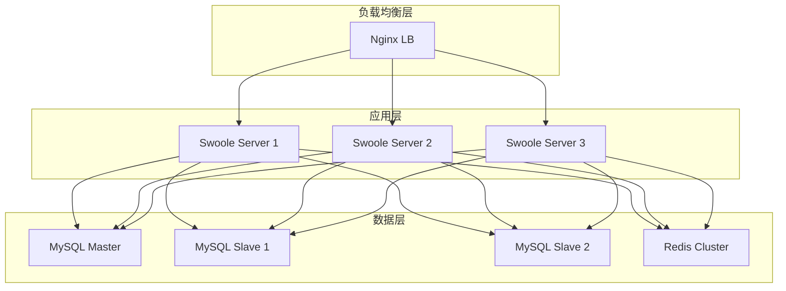

# AlkaidSYS 部署指南

## 📋 文档信息

| 项目 | 内容 |
|------|------|
| **文档名称** | AlkaidSYS 部署指南 |
| **文档版本** | v1.0 |
| **创建日期** | 2025-01-19 |

## 🎯 部署目标

1. **高可用** - 99.9% 可用性
2. **可扩展** - 支持水平扩展
3. **易维护** - 自动化部署和运维
4. **安全性** - 多层安全防护

## 🏗️ 部署架构



## 🔧 环境准备

### 系统要求

```bash
# 操作系统
Ubuntu 22.04 LTS / CentOS 8+

# 软件版本
PHP >= 8.2
Swoole >= 5.0
MySQL >= 8.0
Redis >= 6.0
Nginx >= 1.20
```

### 安装 PHP 8.2

```bash
# Ubuntu
sudo add-apt-repository ppa:ondrej/php
sudo apt update
sudo apt install php8.2-fpm php8.2-cli php8.2-mysql php8.2-redis \
    php8.2-mbstring php8.2-xml php8.2-curl php8.2-zip php8.2-gd

# 验证
php -v
```

### 安装 Swoole 5.0

```bash
# 使用 PECL 安装
pecl install swoole

# 启用扩展
echo "extension=swoole.so" > /etc/php/8.2/cli/conf.d/20-swoole.ini

# 验证
php --ri swoole
```

### 安装 MySQL 8.0

```bash
# Ubuntu
sudo apt install mysql-server-8.0

# 安全配置
sudo mysql_secure_installation

# 创建数据库和用户
mysql -u root -p
CREATE DATABASE alkaid DEFAULT CHARACTER SET utf8mb4 COLLATE utf8mb4_unicode_ci;
CREATE USER 'alkaid'@'%' IDENTIFIED BY 'your_password';
GRANT ALL PRIVILEGES ON alkaid.* TO 'alkaid'@'%';
FLUSH PRIVILEGES;
```

### 安装 Redis 6.0

```bash
# Ubuntu
sudo apt install redis-server

# 配置
sudo vim /etc/redis/redis.conf
# 修改：
# bind 127.0.0.1
# requirepass your_password

# 重启
sudo systemctl restart redis
```

## 📦 应用部署

### 单机部署

```bash
# 1. 克隆代码
git clone https://github.com/alkaid/alkaid-sys.git
cd alkaid-sys

# 2. 安装依赖
composer install --no-dev --optimize-autoloader

# 3. 配置环境变量
cp .env.example .env
vim .env

# 4. 配置环境变量（ThinkPHP 无 key:generate）
# 请在 .env 中设置密钥，例如：
# JWT_SECRET=CHANGE_THIS_IN_PRODUCTION
# APP_ENCRYPT_KEY=your_encrypt_key

# 5. 执行数据库迁移
php think migrate:run

# 6. 缓存配置
php think optimize:config
php think optimize:route

# 7. 启动 Swoole 服务
php think swoole start
```

### Nginx 配置

```nginx
# /etc/nginx/sites-available/alkaid

upstream swoole_backend {
    server 127.0.0.1:9501 weight=1 max_fails=3 fail_timeout=30s;
    server 127.0.0.1:9502 weight=1 max_fails=3 fail_timeout=30s;
    server 127.0.0.1:9503 weight=1 max_fails=3 fail_timeout=30s;
    keepalive 32;
}

server {
    listen 80;
    server_name api.alkaid.com;

    # 重定向到 HTTPS
    return 301 https://$server_name$request_uri;
}

server {
    listen 443 ssl http2;
    server_name api.alkaid.com;

    # SSL 证书
    ssl_certificate /etc/nginx/ssl/alkaid.crt;
    ssl_certificate_key /etc/nginx/ssl/alkaid.key;
    ssl_protocols TLSv1.2 TLSv1.3;
    ssl_ciphers HIGH:!aNULL:!MD5;

    # 日志
    access_log /var/log/nginx/alkaid_access.log;
    error_log /var/log/nginx/alkaid_error.log;

    # Gzip 压缩
    gzip on;
    gzip_types text/plain text/css application/json application/javascript;
    gzip_min_length 1000;

    # 静态文件
    location ~* \.(jpg|jpeg|png|gif|ico|css|js|svg|woff|woff2|ttf|eot)$ {
        root /var/www/alkaid/public;
        expires 30d;
        add_header Cache-Control "public, immutable";
    }

    # API 请求转发到 Swoole
    location / {
        proxy_pass http://swoole_backend;
        proxy_http_version 1.1;
        proxy_set_header Connection "";
        proxy_set_header Host $host;
        proxy_set_header X-Real-IP $remote_addr;
        proxy_set_header X-Forwarded-For $proxy_add_x_forwarded_for;
        proxy_set_header X-Forwarded-Proto $scheme;

        # 超时设置
        proxy_connect_timeout 60s;
        proxy_send_timeout 60s;
        proxy_read_timeout 60s;

        # 缓冲设置
        proxy_buffering off;
        proxy_buffer_size 4k;
    }
}
```

### Systemd 服务配置

```ini
# /etc/systemd/system/alkaid-swoole.service

[Unit]
Description=AlkaidSYS Swoole Server
After=network.target mysql.service redis.service

[Service]
Type=forking
User=www-data
Group=www-data
WorkingDirectory=/var/www/alkaid
ExecStart=/usr/bin/php /var/www/alkaid/think swoole start -d
ExecReload=/usr/bin/php /var/www/alkaid/think swoole reload
ExecStop=/usr/bin/php /var/www/alkaid/think swoole stop
Restart=always
RestartSec=10

[Install]
WantedBy=multi-user.target
```

```bash
# 启用服务
sudo systemctl enable alkaid-swoole
sudo systemctl start alkaid-swoole
sudo systemctl status alkaid-swoole
```

## 🐳 Docker 部署

> 说明：本节 Docker / docker-compose 示例主要面向本地开发 / 测试环境，方便快速启动与联调；生产环境推荐结合下文 Kubernetes 部署小节，并严格遵守《05-deployment-testing/17-configuration-and-environment-management.md》《04-security-performance/10-non-functional-overview.md》中关于多环境配置与非功能性指标的约束。

### Dockerfile

```dockerfile
# /Dockerfile

FROM php:8.2-cli

# 安装系统依赖
RUN apt-get update && apt-get install -y \
    git \
    zip \
    unzip \
    libzip-dev \
    libpng-dev \
    libjpeg-dev \
    libfreetype6-dev \
    && docker-php-ext-configure gd --with-freetype --with-jpeg \
    && docker-php-ext-install -j$(nproc) gd zip pdo_mysql

# 安装 Swoole
RUN pecl install swoole \
    && docker-php-ext-enable swoole

# 安装 Composer
COPY --from=composer:latest /usr/bin/composer /usr/bin/composer

# 设置工作目录
WORKDIR /var/www/alkaid

# 复制代码
COPY . .

# 安装依赖
RUN composer install --no-dev --optimize-autoloader

# 暴露端口
EXPOSE 9501

# 启动命令
CMD ["php", "think", "swoole", "start"]
```

### docker-compose.yml

```yaml
# /docker-compose.yml
# 	1	1
#
#
#
#
#
#
#
#
#
#
#
#
#
#
#
#
#
#
#
#
#
#
#
#
#
#
#
#
#
#
#
#
#
#
#
#
#
#
#
#
#
#
#
#
#
#
#
#
#
#
#
#
#
#
#
#
#

#
#

#
#


version: '3.8'

services:
  app:
    build: .
    ports:
      - "9501:9501"
    volumes:
      - .:/var/www/alkaid
      - ./storage:/var/www/alkaid/storage
    environment:
      - DB_HOST=mysql
      - DB_DATABASE=alkaid
      - DB_USERNAME=alkaid
      - DB_PASSWORD=password
      - REDIS_HOST=redis
    depends_on:
      - mysql
      - redis
    networks:
      - alkaid-network

  mysql:
    image: mysql:8.0
    ports:
      - "3306:3306"
    environment:
      - MYSQL_ROOT_PASSWORD=root
      - MYSQL_DATABASE=alkaid
      - MYSQL_USER=alkaid
      - MYSQL_PASSWORD=password
    volumes:
      - mysql-data:/var/lib/mysql
    networks:
      - alkaid-network

  redis:
    image: redis:6.0
    ports:
      - "6379:6379"
    command: redis-server --requirepass password
    volumes:
      - redis-data:/data
    networks:
      - alkaid-network

  nginx:
    image: nginx:latest
    ports:
      - "80:80"
      - "443:443"
    volumes:
      - ./nginx.conf:/etc/nginx/conf.d/default.conf
      - ./public:/var/www/alkaid/public
    depends_on:
      - app
    networks:
      - alkaid-network

volumes:
  mysql-data:
  redis-data:

networks:
  alkaid-network:
    driver: bridge
```

### 生产环境缓存策略与约束（T1-CACHE-REDIS）

在使用 Docker Compose 或 Kubernetes 部署生产环境时，缓存与 Redis 相关的约束如下：

- 所有生产类环境（APP_ENV=production/prod/stage/staging）必须保证 Redis 服务可用，并通过 `REDIS_HOST`、`REDIS_PORT`、`REDIS_PASSWORD`、`REDIS_DB` 传入；
- 生产类环境不再允许使用 file 缓存：`config/cache.php` 已强制 `cache.default=redis`，并在启动期通过 `CacheEnvironmentGuardService` 做强校验；
- Session 存储已统一切换为通过缓存 store `redis` 使用 Redis（`config/session.php` 使用 `type=cache`、`store=redis`，并在启动期通过 `SessionEnvironmentGuardService` 做强校验）；
- 非生产环境可以通过 `CACHE_DRIVER` 在 `file` / `redis` 之间切换，推荐优先使用 `redis` 以贴近生产配置。

- 【推荐流程】如需在 HTTP + Swoole 实际访问路径下验证 Session 是否写入 Redis，可：
  - 启动 Swoole HTTP 服务：`php think swoole start`（HTTP 监听端口见 `config/swoole.php` 中 `http.port`，当前示例为 8080）；
  - 通过浏览器或 curl 访问调试接口：`GET /debug/session-redis`（例如 `curl http://127.0.0.1:8080/debug/session-redis`）；
  - 在 Redis 容器中执行 `redis-cli MONITOR` / `KEYS "alkaid:session*"` / `GET <实际 session key>` 观察 Session 实际存储情况。

推荐的生产环境变量示例：

```bash
APP_ENV=production
CACHE_DRIVER=redis      # 在生产环境中该变量会被忽略，但保持显式配置更易理解
REDIS_HOST=redis
REDIS_PORT=6379
REDIS_PASSWORD=******   # 如果启用了 Redis 密码
REDIS_DB=0
```

### 多环境 Redis 配置说明（本地 Docker vs 外部 Redis）

- **本地 Docker 开发环境**（使用 `docker compose up`）：
  - `.env` / `.env.example` 中推荐：`REDIS_HOST=redis`、`REDIS_PORT=6379`；
  - `docker-compose.yml` 中 backend 服务通过环境变量 `REDIS_HOST=redis` 指向同一网络下的 `redis` 容器；
  - 通过 `/debug/session-redis` + Redis CLI 可以直接验证本地 Redis 连接与 Session 落盘。
- **测试 / 生产环境（外部 Redis 服务）**：
  - 不再依赖 docker-compose 内置 `redis` 容器，而是通过部署系统注入真实 Redis 集群地址；
  - 仅需在部署时覆写以下环境变量（示例）：
    - `REDIS_HOST=your-redis.internal.example.com`
    - `REDIS_PORT=6379`
    - `REDIS_PASSWORD=***`（如开启密码）
    - `REDIS_DB=0`
  - `config/cache.php` 与 `config/session.php` 会自动复用上述配置；`RedisHealthCheckService` 会在启动期对 `Cache::store('redis')` 做一次读写自检，连接异常时 fail-fast 并打印 host/port 信息。

#### 各环境 Session-Redis 配置步骤（摘要）

- **本地开发（dev/local）**：按上述本地 Docker 配置启动 Redis，访问 `/debug/session-redis` 并在本地 Redis 实例中通过 KEYS/GET 或 MONITOR 验证 Session 与调试 cache key 实际落盘。
- **预发 / 测试（stage/testing）**：
  - 设置 `APP_ENV=stage` 或 `APP_ENV=testing`，并配置外部 Redis 的 `REDIS_*` 变量；
  - 部署后确认服务能正常启动（未被 Cache/Session Guard 拦截），`/debug/session-redis` 返回 200 且在目标 Redis 实例中可观测到 `alkaid:session:*` 相关 key。
- **生产（production/prod）**：
  - 设置 `APP_ENV=production` 或 `APP_ENV=prod`，配置正式 Redis 集群的 `REDIS_*` 变量；
  - 选择低压时段，在受控网络范围内临时开放 `/debug/session-redis`，按 stage 环境同样方式完成一次 Session 落盘验证；
  - 验收通过后，按文档 3.1 小节建议关闭该调试入口或在网关层封禁该路径。

### Session 存储验证（T1-SESSION-REDIS）

#### 验证现状（2025-11-20，修复后）

- ✅ HTTP 路径（使用 `php think run -p 8000` 启动内置服务器）下，`GET /debug/session-redis` 接口返回 200 且 JSON 结构正确。
- ✅ Session 配置为 `type=cache, store=redis, prefix=session:`，应用内读取的配置与设计一致。
- ✅ 应用内通过 Session 门面写入/读取测试值（CLI 命令 `php think test:session-redis` 与 HTTP 调试接口）行为正常，`written_value` 与 `read_value` 一致。
- ✅ 在 Docker 内使用 `redis-cli KEYS "alkaid:session*"` / `GET "alkaid:session:<session_id>"` / `INFO keyspace`，可以观测到 Session 相关 key，例如：`alkaid:session:69cbfb7a8e73205fc43675a0023fdff9`，值为包含 `t1_session_redis_test` 的序列化数据。
- ✅ 使用 `redis-cli MONITOR` 监控期间，分别通过 HTTP 内置服务器与 Swoole HTTP 模式发起 `/debug/session-redis` 调试请求，可以捕获到 `GET alkaid:session:<session_id>`、`SETEX alkaid:t1_session_redis_debug_cache_*`、`SETEX alkaid:session:<session_id>` 等命令，确认两种模式下 Session 均实际写入 Redis。
- ℹ️ Swoole 模式曾在早期版本中因 `think\Container::bind()` 数组绑定错误导致 `php think swoole start` 启动失败；当前已通过规范化服务注册方式修复，该问题在 HTTP + Swoole 场景下均无法重现（保留此条作为历史问题记录与防踩坑提醒）。

> 结论：在本地 docker-compose 环境下，已完成 `Session -> Cache::store('redis') -> Redis` 全链路验证；Session 实际 key `alkaid:session:{session_id}` 可在 Redis 中被观测到，满足 T1-SESSION-REDIS 对“Redis 落盘验证 + 后端溯源”的要求。HTTP 与 Swoole 两种运行模式均已通过 `/debug/session-redis` + Redis MONITOR + KEYS 验证 Session 实际落盘到 Redis，后续仅需在 stage/prod 等生产类环境中复用同一套验证流程。

#### 已知风险点

1. 测试 / 生产环境中实际使用的 Redis 拓扑可能为外部集群，需要在部署阶段确保 `REDIS_HOST` / `REDIS_PORT` / `REDIS_PASSWORD` / `REDIS_DB` 正确注入，并依赖 `RedisHealthCheckService` 在连接异常时 fail-fast；
2. 历史上 Swoole 模式曾出现 DI 容器绑定数组格式错误（`Container::bind(0, 'app\\provider\\CacheEnvironmentGuardService')`），目前在现有代码与配置下已无法复现；后续如新增 Service Provider 或手动调用 `Container::bind()`，需避免向其传入纯索引数组，以防类似问题在新版本中回归。

#### 调试命令示例（本地 Docker 环境）

```bash
# HTTP 场景：启动内置服务器（dev 环境，仅用于联调验证）
docker compose exec backend sh -lc "APP_ENV=dev php think run -p 8000"

# HTTP 场景：访问调试接口（可多次调用，对比不同时间戳与 session_id）
docker compose exec backend sh -lc "curl -sS -D - http://127.0.0.1:8000/debug/session-redis"

# Swoole 场景：启动 Swoole HTTP 服务（HTTP 端口见 config/swoole.php 中 http.port，当下示例为 8080）
docker compose exec backend sh -lc "APP_ENV=dev php think swoole start"

# Swoole 场景：通过 Swoole HTTP 访问调试接口（端口按实际 http.port 调整，这里示例为 8080）
docker compose exec backend sh -lc "curl -sS -m 5 -D - http://127.0.0.1:8080/debug/session-redis"

# 在 Redis 容器中检查 Session 与调试 cache 相关 key 与库情况（以响应中的 session_id 为准）
docker compose exec redis sh -lc "redis-cli KEYS 'alkaid:session*'"
docker compose exec redis sh -lc "redis-cli GET 'alkaid:session:<session_id>'"
docker compose exec redis sh -lc "redis-cli KEYS 'alkaid:t1_session_redis_debug_cache_*'"
docker compose exec redis sh -lc "redis-cli INFO keyspace"

# 可选：开启 MONITOR 后再分别访问 HTTP/Swoole 调试接口，观察 Redis 实际命令
docker compose exec redis sh -lc "redis-cli MONITOR"
```


#### 后续待办（与 T1-SESSION-REDIS 联动）

- 在测试 / 生产环境中复用本地验证方案：结合外部 Redis 集群地址（通过 `REDIS_HOST` 等环境变量注入）与 `RedisHealthCheckService`，在 stage/prod 环境跑一遍 `/debug/session-redis` + Redis CLI / Redis MONITOR 验证，形成上线前检查清单；
- 在完成 stage/prod 验证后，更新整改计划与本小节结论，将当前“本地 Docker 环境已验证 + stage/prod 待确认”的状态调整为“多环境均已完成验收”。


### 可选：RabbitMQ 服务（如使用队列/RPC）

```yaml
# docker-compose 追加服务示例
rabbitmq:
  image: rabbitmq:3-management
  ports:
    - "5672:5672"
    - "15672:15672" # 管理界面
  environment:
    - RABBITMQ_DEFAULT_USER=alkaid
    - RABBITMQ_DEFAULT_PASS=password
  volumes:
    - rabbitmq-data:/var/lib/rabbitmq
  networks:
    - alkaid-network

# 追加卷定义
volumes:
  rabbitmq-data:
```

### 部署命令

```bash
# 构建镜像
docker-compose build

# 启动服务
docker-compose up -d

# 查看日志
docker-compose logs -f app

# 执行迁移
docker-compose exec app php think migrate:run

# 停止服务
docker-compose down
```

## ☸️ Kubernetes 部署

### Deployment 配置

```yaml
# /k8s/deployment.yaml

apiVersion: apps/v1
kind: Deployment
metadata:
  name: alkaid-app
  labels:
    app: alkaid
spec:
  replicas: 3
  selector:
    matchLabels:
      app: alkaid
  template:
    metadata:
      labels:
        app: alkaid
    spec:
      containers:
      - name: alkaid
        image: alkaid/alkaid-sys:latest
        ports:
        - containerPort: 9501
        env:
        - name: DB_HOST
          value: "mysql-service"
        - name: REDIS_HOST
          value: "redis-service"
        resources:
          requests:
            memory: "512Mi"
            cpu: "500m"
          limits:
            memory: "1Gi"
            cpu: "1000m"
        livenessProbe:
          httpGet:
            path: /health
            port: 9501
          initialDelaySeconds: 30
          periodSeconds: 10
        readinessProbe:
          httpGet:
            path: /health
            port: 9501
          initialDelaySeconds: 5
          periodSeconds: 5
```

### Service 配置

```yaml
# /k8s/service.yaml

apiVersion: v1
kind: Service
metadata:
  name: alkaid-service
spec:
  selector:
    app: alkaid
  ports:
  - protocol: TCP
    port: 80
    targetPort: 9501
  type: LoadBalancer
```

## 🔄 CI/CD 流程

### GitHub Actions

```yaml
# /.github/workflows/deploy.yml
# 说明：此为示例部署流程，实际项目需根据环境、权限与发布策略进行裁剪和加固（例如区分 test/stage/prod 环境、引入审批 Gate、使用 Secrets 管理凭据等）。

name: Deploy

on:
  push:
    branches: [ main ]

jobs:
  deploy:
    runs-on: ubuntu-latest

    steps:
    - uses: actions/checkout@v2

    - name: Setup PHP
      uses: shivammathur/setup-php@v2
      with:
        php-version: '8.2'
        extensions: swoole, redis, pdo_mysql

    - name: Install dependencies
      run: composer install

    - name: Run tests
      run: php think test

    - name: Build Docker image
      run: docker build -t alkaid/alkaid-sys:${{ github.sha }} .

    - name: Push to registry
      run: |
        echo ${{ secrets.DOCKER_PASSWORD }} | docker login -u ${{ secrets.DOCKER_USERNAME }} --password-stdin
        docker push alkaid/alkaid-sys:${{ github.sha }}

    - name: Deploy to production
      run: |
        ssh ${{ secrets.SSH_USER }}@${{ secrets.SSH_HOST }} \
          "cd /var/www/alkaid && \
           git pull && \
           composer install --no-dev && \
           php think migrate:run && \
           php think swoole reload"
```

## 🆚 与 NIUCLOUD 部署对比

| 特性 | AlkaidSYS | NIUCLOUD | 优势 |
|------|-----------|----------|------|
| **Web 服务器** | Swoole + Nginx | PHP-FPM + Nginx | ✅ 更高性能 |
| **容器化** | 完整支持 | 基础支持 | ✅ 更易部署 |
| **K8s 支持** | 支持 | 不支持 | ✅ 更易扩展 |
| **CI/CD** | 自动化 | 手动 | ✅ 更高效 |

---

## 📎 CI/CD 增强：文档 / 类型 / 校验（新增）

在现有流水线上追加以下步骤：
- 生成 OpenAPI：php think api:doc（产出 public/api-docs.json）
- 文档校验：npx redocly lint public/api-docs.json（阻断合并）
- 生成 TS 类型：npx openapi-typescript public/api-docs.json -o admin/src/api/types.d.ts
- 产物归档：上传 OpenAPI 与 types.d.ts 作为构建工件

参考步骤见 16-development-workflow “AI 辅助开发闭环”。

### 部署前守护：Schema 漂移检查与同步（新增）

```yaml
# 简化示例：在部署 Job 中加入检查步骤
- name: Schema Drift Check
  run: php think lowcode:migration:diff --all --check

# 可选：仅在批准后执行同步（需人工审批 Gate）
- name: Schema Sync (Approved)
  if: ${{ github.event_name == 'workflow_dispatch' && inputs.approved == 'true' }}
  run: php think lowcode:schema-sync --all --audit-out=build/schema-audit.json
```

> 建议：生产环境默认只检查不自动同步；发现差异时发起变更单与审批，再执行同步并生成审计记录与备份。

---

## 附录


## stage/prod 生产类环境 Session/Redis 验收 Checklist（T1-SESSION-REDIS）

适用范围：

- 环境：`stage` / `prod` 等生产类环境（APP_ENV=stage/staging/production/prod）
- 运行模式：
  - HTTP：`php think run` / PHP-FPM + Nginx / 内置 HTTP 服务器
  - Swoole：`php think swoole start` / systemd/supervisor 托管的 Swoole HTTP
- Redis：外部 Redis 集群 / 云 Redis（与本地 docker-compose 中 redis 容器不同）

---

## 1. 快速验收路径（10 分钟版）

> 当你对部署环境比较熟、只需要做一次上线前 Sanity Check 时，可以先走这一版。

**步骤 Q1～Q6 全部通过，可视为“快速验收通过”；如其中任一失败，请转到详细 Checklist 对应章节。**

1. **Q1：确认环境变量已正确注入**

   - 在应用进程所在机器 / 容器中执行（示例）：

     - Linux/SSH：`printenv | grep -E 'APP_ENV|REDIS_'`
     - Docker：`docker exec -it <backend> env | grep -E 'APP_ENV|REDIS_'`
     - K8s：`kubectl exec -it deploy/backend -c php -- env | grep -E 'APP_ENV|REDIS_'`

   - 快速目视检查：
     - `APP_ENV` 为 `stage` 或 `production`；
     - `REDIS_HOST` 为外部 Redis 域名/IP；
     - `REDIS_PORT`、`REDIS_DB` 为预期值；
     - `REDIS_PASSWORD` 非空（如 Redis 需认证）。

2. **Q2：确认应用能正常启动且未被 Guard 拦截**

   - 查看最近一次发布的应用日志：
     - 无 `RedisHealthCheckService` 抛出的“Redis 连接失败/认证失败”等异常；
     - 无 `SessionEnvironmentGuardService` 抛出的“Session 驱动为 file，不允许在生产类环境使用” 等错误；
     - HTTP / Swoole 服务都处于“Running”状态。

3. **Q3：HTTP 模式下调用 `/debug/session-redis` 成功**

   - 从**内网跳板机**或允许运维访问的机器执行：
     - `curl -k -sS -D - "https://<stage-domain>/debug/session-redis"`
   - 预期：
     - HTTP 状态码 200；
     - 响应 JSON 中包含：
       - `session_id`（非空字符串）；
       - `cache_debug.write_ok = true`；
       - `cache_debug.read_value == cache_debug.written_value`。

4. **Q4：Swoole 模式下（如使用）调用 `/debug/session-redis` 成功**

   - 若前端流量经过 Nginx 代理到 Swoole，直接使用业务域名 + 路由即可：
     - `curl -k -sS -D - "https://<stage-domain>/debug/session-redis"`
   - 若需直接访问 Swoole 端口（例如 8080，参考 `config/swoole.php`）：
     - `curl -sS -D - "http://<swoole-host>:8080/debug/session-redis"`
   - 预期与 Q3 相同。

5. **Q5：Redis 中能看到对应的 Session Key**

   - 通过 `redis-cli` 连接到实际使用的 Redis（建议在 stage 环境执行）：
     - `redis-cli -h <REDIS_HOST> -p <REDIS_PORT> -a '********'`
   - 使用 `/debug/session-redis` 返回的 `session_id`，检查：
     - `KEYS 'alkaid:session*'`（或更安全的 `SCAN`）中包含形如 `alkaid:session:{session_id}` 的 key；
     - `GET "alkaid:session:{session_id}"` 的值中包含 `t1_session_redis_test`（或你配置的测试字段）。

6. **Q6：使用 MONITOR 短暂观察一次完整链路（推荐在 stage 环境）**

   - 在低压时段、对单个 Redis 实例执行：
     - `redis-cli -h <REDIS_HOST> -p <REDIS_PORT> -a '********' MONITOR`
   - 在 10～30 秒窗口内分别发起 HTTP/Swoole 的 `/debug/session-redis` 调用；
   - 预期在 MONITOR 输出中看到：

     - `GET alkaid:session:<session_id>`
     - `SETEX alkaid:t1_session_redis_debug_cache_*`
     - `SETEX alkaid:session:<session_id>`

   - 观察完毕后立即退出 MONITOR（Ctrl+C）。

---

## 2. 详细验收 Checklist

以下按照 **「环境准备 → 配置检查 → 启动验证 → 运行时验证 → Redis 侧证据」** 的顺序展开。  
每个检查项均包含：目的 / 执行 / 预期结果 / 异常处理。

### 一、环境准备

#### 1.1 确认环境与访问方式

- **目的**：确保后续所有操作都在正确的 `stage/prod` 环境上执行，避免误连 dev。
- **执行**：
  - 确认当前操作的是哪台机器 / 哪个集群（例如：`stage-app-01`、`prod-app-01`、K8s namespace 等）；
  - 确定访问应用的方式：
    - 对外业务域名（例如 `https://stage-api.xxx.com`）；
    - 内部 Swoole 服务（例如 `http://10.x.x.x:8080`）；
    - 管理/跳板机（SSH / bastion）；
    - K8s：`kubectl exec` 的 Pod/Deployment 名称。
- **预期结果**：
  - 有一个“本次验收操作环境”的明确标识，例如：“stage 环境，命名空间 `alkaid-stage`，Deployment `alkaid-backend`”。
- **异常处理**：
  - 环境不清楚 → 先与运维/平台同学确认环境命名与访问规则，形成简短说明后再继续。

#### 1.2 环境变量基础检查

- **目的**：确认 Redis 连接所需的关键 ENV 确实已注入运行时容器/进程。
- **执行**（示例，根据实际环境选择其一）：

  - SSH 到应用主机后：

    - `printenv | grep -E 'APP_ENV|REDIS_'`

  - Docker：

    - `docker exec -it <backend-container> env | grep -E 'APP_ENV|REDIS_'`

  - K8s：

    - `kubectl exec -it deploy/alkaid-backend -c php -- env | grep -E 'APP_ENV|REDIS_'`

- **预期结果**（示例）：

  - `APP_ENV=stage` 或 `APP_ENV=production`；
  - `REDIS_HOST=xxx.redis.rds.aliyuncs.com`（或其他外部 Redis 域名/IP）；
  - `REDIS_PORT=6379`；
  - `REDIS_DB` 为预期业务数据库编号（通常 0 或其他约定值）；
  - `REDIS_PASSWORD` 非空（如 Redis 配置了 AUTH）。

- **异常处理**：
  - 某些变量缺失或错误：
    - 与运维同学确认部署配置（Helm values / Ansible vars / systemd EnvironmentFile 等）；
    - 修正后需**重新发布或重启服务**，再回到此步骤重新校验。
  - 注意在文档/工单中记录时，对 `REDIS_PASSWORD` 等敏感值进行脱敏（如仅记录为 `******`）。

#### 1.3 外部 Redis 连通性预检查

- **目的**：在应用之外先验证到外部 Redis 的网络/认证是否正常，减少排错范围。
- **执行**：

  - 通过与应用同网的主机/容器，执行：

    - `redis-cli -h <REDIS_HOST> -p <REDIS_PORT> -a '********' PING`

- **预期结果**：

  - 返回 `PONG`；
  - 无连接超时、拒绝（`Connection refused`）或 `NOAUTH` 等错误。

- **异常处理**：
  - 若网络不通（超时）：
    - 检查安全组、防火墙、VPC 规则；
    - 确认是否需要通过专线或 VPN。
  - 若认证失败：
    - 确认 `REDIS_PASSWORD` 是否更新；
    - 注意云 Redis 常见的“白名单 + 密码”双重校验规则。

---

### 二、配置检查

#### 2.1 Session 与 Cache 配置一致性

- **目的**：确认运行中的代码版本使用的是期望的 Session/Redis 配置（与本地已验证版本一致）。
- **执行**：

  - 确认当前部署镜像/发布包对应的 Git commit 或 Tag，与已在本地 docker-compose 下通过验证的版本一致；
  - 在代码仓中检查以下文件（通常在 CI/CD 发布前完成）：
    - `config/session.php`：
      - `type = 'cache'`
      - `store = 'redis'`
      - `prefix = 'session:'`（最终实际 key 为 `alkaid:session:{session_id}`）
    - `config/cache.php`：
      - `default = 'redis'`（生产类环境）
      - `stores['redis']` 使用 `host/port/password/db` 从 `env('REDIS_...')` 读取。
- **预期结果**：
  - 生产类环境未使用 `file` Session / `file` Cache；
  - 未有额外的 env/配置将 Session 驱动改回 file。
- **异常处理**：
  - 若发现 `type='file'` 或 `default='file'`：
    - 视为配置错误，**不得在 stage/prod 使用该构建**；
    - 回退到上一版或修正配置后重构建，重新走验收流程。

#### 2.2 运行时 Guard 配置确认

- **目的**：确保 `SessionEnvironmentGuardService` / `CacheEnvironmentGuardService` / `RedisHealthCheckService` 已在生产类环境启用。
- **执行**：

  - 检查 `app/service.php` 中是否包含以下 Provider 类名：
    - `CacheEnvironmentGuardService::class`
    - `SessionEnvironmentGuardService::class`
    - `RedisHealthCheckService::class`
  - 在最近一次启动日志中搜索关键字：
    - `SessionEnvironmentGuardService`
    - `CacheEnvironmentGuardService`
    - `RedisHealthCheckService`
- **预期结果**：
  - 日志中**没有**相关 Guard 抛出的异常；
  - 如有日志提示但级别为 INFO/DEBUG（例如打印当前 Redis host），可以作为佐证信息保留。
- **异常处理**：
  - 若 Guard 抛异常阻止启动：
    - 说明配置不满足生产类要求（例如 Session 驱动为 file），应视为成功“挡住错误配置”，必须先解决配置问题再继续验收。

---

### 三、启动验证（含 Guard 与 HealthCheck）

#### 3.1 HTTP 模式启动检查

- **目的**：确认 HTTP 模式（FPM/内置 server）在生产类环境下能够正常启动，并通过 Guard + HealthCheck。
- **执行**（示例）：

  - 使用 systemd 的情况：
    - `sudo systemctl status alkaid-http.service`
  - Docker：
    - `docker ps | grep alkaid-backend`
    - `docker logs --tail=200 alkaid-backend`
  - K8s：
    - `kubectl get pods -n <ns> | grep alkaid-backend`
    - `kubectl logs deploy/alkaid-backend -c php --tail=200`

- **预期结果**：
  - 服务状态为 Running / Active；
  - 日志中未见 Redis 连接失败 / Guard 相关 ERROR。
- **异常处理**：
  - 若服务在启动期即退出：
    - 先阅读日志中 Guard/HealthCheck 抛出的异常信息；
    - 按照配置检查与网络预检查章节逐项排查。

#### 3.2 Swoole 模式启动检查（如使用）

- **目的**：确认 Swoole HTTP 服务在生产类环境下正常运行且未出现容器绑定问题。
- **执行**（示例）：

  - systemd：

    - `sudo systemctl status alkaid-swoole.service`

  - Docker（独立 Swoole 容器）：

    - `docker ps | grep alkaid-swoole`
    - `docker logs --tail=200 alkaid-swoole`

  - K8s：

    - `kubectl get pods -n <ns> | grep alkaid-swoole`
    - `kubectl logs deploy/alkaid-swoole -c php --tail=200`

- **预期结果**：
  - Swoole 进程常驻，监听端口与 `config/swoole.php` 中 `http.port` 一致；
  - 无 `think\Container::bind()` TypeError 等异常栈；
  - 无 Redis 相关连接错误。
- **异常处理**：
  - 若启动失败：
    - 检查是否为 RedisHealthCheck / SessionEnvironmentGuard 的异常（配置问题）；
    - 若出现新的容器绑定错误，需比照当前 `app/service.php` 与历史“数组绑定导致 bind(0, ...)”案例，逐项排查是否有不规范的 `Container::bind()` 使用。

---

### 四、运行时验证（应用视角）

#### 4.1 HTTP 模式下 `/debug/session-redis` 验证

- **目的**：从应用 HTTP 入口验证 Session→Redis 链路。
- **执行**：

  - 从内网可达的环境发起请求，示例：

    - `curl -k -sS -D - "https://<stage-domain>/debug/session-redis"`

- **预期结果**：
  - HTTP 状态码 200；
  - 响应头中无明显 5xx/异常；
  - 响应体 JSON 至少包含：
    - `session_id`：非空；
    - `cache_debug.write_ok = true`；
    - `cache_debug.read_value == cache_debug.written_value`；
    - （可选）`session_debug.t1_session_redis_test` 字段存在。
- **异常处理**：
  - 404 / 403：
    - 可能路由未在该环境启用（例如仅在 APP_ENV!=production 时注册），需临时放开或经网关做限时白名单；
  - 5xx / JSON 中 `write_ok=false`：
    - 检查应用日志中的 Redis 异常；
    - 回到环境变量/网络连通性检查排查。

#### 4.2 Swoole 模式下 `/debug/session-redis` 验证（如使用）

- **目的**：验证通过 Swoole 运行路径时 Session→Redis 行为与 HTTP 模式一致。
- **执行**：

  - 若流量统一经过 Nginx 代理到 Swoole，只需重复 4.1 中的 HTTP 请求（此时由 Nginx 决定走 FPM 或 Swoole）；
  - 若需直连 Swoole（示例端口 8080）：

    - `curl -sS -D - "http://<swoole-host>:8080/debug/session-redis"`

- **预期结果**：
  - 返回结构与 HTTP 模式一致；
  - 若你在短时间内对比两次请求（HTTP vs Swoole），可以在 Redis 中看到同一个 `session_id` 的两次写入。
- **异常处理**：
  - 若仅 Swoole 路径失败：
    - 检查 Swoole 日志中是否有 Redis 相关错误；
    - 比对 HTTP 与 Swoole 进程使用的 env/启动脚本是否一致（例如某些 env 只在 FPM 里注入，Swoole 未同步）。

---

### 五、Redis 侧证据（外部 Redis / 云 Redis）

> 强烈建议在 **stage** 环境完整执行本节；在 **prod** 环境可视情况缩减（例如仅做 KEYS/GET，不使用 MONITOR，或仅在低流量时间短时间启用）。

#### 5.1 KEYS/GET 验证 Session 落盘

- **目的**：验证 `/debug/session-redis` 请求后，Session 与调试 cache 实际写入 Redis。
- **执行**：

  1. 通过 `/debug/session-redis` 获取 `session_id`；
  2. 连接 Redis：

     - `redis-cli -h <REDIS_HOST> -p <REDIS_PORT> -a '********'`

  3. 执行只针对小规模验证的命令（在数据量大时可用 SCAN 替代 KEYS）：
     - `KEYS 'alkaid:session*'`
     - `KEYS 'alkaid:t1_session_redis_debug_cache_*'`
     - `GET "alkaid:session:{session_id}"`

- **预期结果**：
  - `KEYS 'alkaid:session*'` 中至少包含一个 `alkaid:session:{session_id}`；
  - `GET "alkaid:session:{session_id}"` 的值中包含 `t1_session_redis_test` 等标记字段；
  - 若存在多个调试 cache key（不同时间戳），说明多次验证成功写入。
- **异常处理**：
  - KEYS 无匹配：
    - 检查 `/debug/session-redis` 是否确实访问到了使用该 Redis 实例的环境（避免访问了另一个集群）；
    - 检查 `CACHE_DRIVER` / `REDIS_DB` 是否指向预期的 Redis 实例/DB；
  - GET 返回空或不含测试字段：
    - 可能应用仍在使用 file Session 或其他 store，回到配置与 Guard 检查。

#### 5.2 MONITOR 验证整个命令流（优先 stage）

- **目的**：从 Redis 视角，完整观察一次 Session 调试请求产生的读写命令。
- **执行**（在低压时间段进到目标 Redis 实例）：

  1. 在 Redis 上执行：

     - `redis-cli -h <REDIS_HOST> -p <REDIS_PORT> -a '********' MONITOR`

  2. 在 10～30 秒内从 HTTP/Swoole 发起 **1～2 次** `/debug/session-redis` 请求；
  3. 观察 MONITOR 输出中是否出现类似命令：

     - `GET alkaid:session:<session_id>`
     - `SETEX alkaid:t1_session_redis_debug_cache_<timestamp> ...`
     - `GET alkaid:t1_session_redis_debug_cache_<timestamp>`
     - `SETEX alkaid:session:<session_id> ...`

  4. 验证完毕后立即 Ctrl+C 退出 MONITOR。
- **预期结果**：
  - 能在短时间内明确看到一条从 Session 读→写调试 key→再写回 Session 的完整命令序列；
  - 命令中的 `session_id` 与 HTTP 返回的值一致。
- **异常处理**：
  - 若 MONITOR 中完全看不到相关命令：
    - 确认 MONITOR 的节点与应用写入节点一致（某些云 Redis 有 proxy/集群分片）；
    - 确认 `/debug/session-redis` 使用的 Redis 实例就是当前监控的这个。
  - **性能注意**：
    - MONITOR 会打印该实例收到的所有命令，对高并发生产环境有压测影响；
    - 建议：
      - 优先在 stage/灰度环境执行；
      - 若必须在 prod 执行，控制在 **10～30 秒、业务低峰时段、单实例** 内完成。

---

## 3. 安全与生产注意事项

### 3.1 `/debug/session-redis` 在生产环境的使用建议

- **风险点**：
  - 会在 HTTP 层暴露：
    - 当前 Session 的 `session_id`；
    - 与缓存调试相关的内部字段；
  - 如未做访问控制，可能被外部扫描或滥用。
- **建议**：

  1. 路由访问边界：
     - 仅允许在内网/VPN / 跳板机 IP 段访问；
     - 可通过网关/WAF/Nginx 做 IP 白名单或 Basic Auth 保护。
  2. 生命周期管理：
     - 在 stage/prod 验收窗口内临时开启；
     - 验收完成后：
       - 关闭路由注册（例如通过 env 变量 `SESSION_REDIS_DEBUG_ENABLED=false` 控制）；
       - 或在网关层封禁该路径。
  3. 日志与审计：
     - 若验收过程需要在日志/文档中记录响应内容，避免长时间保留带 `session_id` 的原始 JSON；
     - 必要时可对 `session_id` 做部分脱敏。

### 3.2 Redis MONITOR 的生产环境注意事项

- MONITOR 为阻塞式“全量命令监听”，在高 QPS 的实例上会带来：
  - CPU、网络 IO、日志放大；
  - 安全审计风险（命令中可能包含业务参数）。
- 建议：
  - 只在 stage/灰度环境完整执行；
  - 在 prod：
    - 控制时间窗口（10～30 秒）；
    - 选择单实例、低峰时段执行；
    - 不要在多租户共享 Redis 上长时间启用 MONITOR。

### 3.3 敏感信息脱敏

- 在验收文档、工单评论、聊天记录等所有输出中：
  - 不记录明文 `REDIS_PASSWORD`；
  - 不记录完整 Redis 连接串；
  - 如需展示 env 示例，使用占位符：

    - `REDIS_PASSWORD=******`

- 如需存档 MONITOR 输出，请在归档前对其中可能包含的业务参数做脱敏处理（可裁剪为仅保留命令类型与 key 名）。

---

## 4. 常见问题排查指南

### 4.1 `/debug/session-redis` 返回 404 / 403 / 502

- **可能原因**：
  - 路由在该环境未注册；
  - 网关/WAF 拦截；
  - 上游应用实例不可用。
- **排查路径**：
  - 在同环境的应用日志中找该 URI 是否有访问记录；
  - 检查路由注册代码是否受 ENV 控制（例如只在 APP_ENV!=production 时开启）；
  - 与运维确认网关层是否有路径/方法限制。

### 4.2 `/debug/session-redis` 返回 500 或 `write_ok=false`

- **可能原因**：
  - Redis 连接失败（host/port/password/db 错误或网络不通）；
  - RedisHealthCheckService 已经在启动期记录错误，但未阻止该环境的启动（仅在非生产类环境）。
- **排查路径**：
  - 查看应用错误日志（PHP/ThinkPHP log），搜索：
    - `RedisHealthCheckService`
    - `Connection refused`
    - `NOAUTH` / `WRONGPASS` 等；
  - 回到环境变量检查（REDIS_ 系列）与外部 Redis 连通性预检。

### 4.3 接口返回成功但 Redis 中没有 Session Key

- **可能原因**：
  - 使用的 Redis 实例/DB 与你连接的不同；
  - 应用仍在使用 file Session（中间件未生效或配置被覆盖）。
- **排查路径**：
  - 使用与应用同一宿主 / 容器登录 Redis，确认与 `.env`/部署配置一致；
  - 检查：
    - `config/session.php` 与 `config/cache.php`；
    - `\think\middleware\SessionInit` 是否在生产环境的中间件栈中被启用；
  - 重新发起 `/debug/session-redis`，立即在同一实例上执行 KEYS/GET 验证。

### 4.4 启动期被 Guard 拦截

- **症状**：
  - 服务启动失败，日志中出现：
    - “Session 驱动为 file，生产类环境不允许使用”；
    - 或类似 “cache.default !== redis” 的错误。
- **处理建议**：
  - 说明 Guard 正常发挥作用，**禁止在生产类环境使用 file 存储**；
  - 按配置检查章节修正 Session/Cache 配置后重新部署，再次验收。

---

## 5. 验收通过标准与签字模板（可选）

### 5.1 验收通过标准

视 T1-SESSION-REDIS 为在某环境“通过”的最低标准如下：

1. **环境与配置**：
   - APP_ENV 为 stage/production；
   - REDIS_* 变量正确注入，外部 Redis PING 正常；
   - Session 使用 `type=cache, store=redis`，Cache 默认使用 Redis。

2. **启动与 Guard**：
   - HTTP / Swoole 服务均能正常启动（如启用）；
   - 无 RedisHealthCheck/SessionEnvironmentGuard 异常。

3. **应用视角验证**：
   - HTTP 模式下 `/debug/session-redis` 返回 200 且 JSON 正常；
   - 若使用 Swoole，则 Swoole 路径下 `/debug/session-redis` 同样返回正常。

4. **Redis 视角验证**：
   - Redis 中存在 `alkaid:session:{session_id}` 与 `alkaid:t1_session_redis_debug_cache_*` 等 key；
   - 至少在 stage 环境完成一次 MONITOR 级别的操作，观察到完整命令流。

### 5.2 签字确认模板（示例）

可将以下内容复制到整改计划附录或 Confluence：

```markdown
### T1-SESSION-REDIS 生产类环境验收记录

| 环境   | APP_ENV   | HTTP 验收（/debug/session-redis） | Swoole 验收（如适用） | Redis KEYS/GET 验证 | Redis MONITOR 验证 | 结论   | 验收人 | 日期       |
|--------|-----------|-----------------------------------|------------------------|----------------------|---------------------|--------|--------|------------|
| stage  | stage     | ✅ / ❌                          | ✅ / ❌ / N/A          | ✅ / ❌             | ✅ / ❌ / N/A       | 通过/否 |        | YYYY-MM-DD |
| prod   | production| ✅ / ❌                          | ✅ / ❌ / N/A          | ✅ / ❌ / N/A       | ✅ / ❌ / N/A       | 通过/否 |        | YYYY-MM-DD |

> 备注：
> - 本表中 Redis MONITOR 验证项推荐在 stage 环境完成，prod 环境可根据安全/性能策略决定是否必需。
> - 如需长期保留验收记录，请在粘贴 Redis 相关命令输出前处理好敏感信息脱敏。
```

---


**最后更新**: 2025-01-19
**文档版本**: v1.0
**维护者**: AlkaidSYS 架构团队

