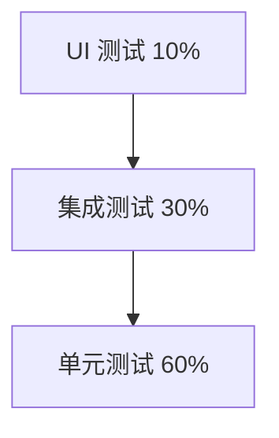

# AlkaidSYS 测试策略

## 📋 文档信息

| 项目 | 内容 |
|------|------|
| **文档名称** | AlkaidSYS 测试策略 |
| **文档版本** | v1.0 |
| **创建日期** | 2025-01-19 |

## 🎯 测试目标

1. **代码覆盖率** - > 80%
2. **单元测试** - 核心业务逻辑 100% 覆盖
3. **集成测试** - API 接口全覆盖
4. **性能测试** - 满足性能指标
5. **安全测试** - 无高危漏洞

## 🏗️ 测试金字塔



## 🧭 环境与阶段测试策略（设计阶段建议）

- **dev（本地/开发环境）**：以单元测试为主，必要时跑少量集成测试，允许使用简化/模拟依赖；
- **test（集成/功能测试环境）**：执行主干集成测试、覆盖关键业务流，定期跑基础安全/性能用例；
- **stage（预发环境）**：在尽可能接近生产的环境下进行全量回归、关键性能与安全验证，作为发布 Gate；
- **prod 前检查**：仅在发布前按《04-security-performance/10-non-functional-overview.md》中定义的非功能性目标抽样验证关键指标。

## 🔧 单元测试

### PHPUnit 配置

```xml
<!-- /phpunit.xml -->

<?xml version="1.0" encoding="UTF-8"?>
<phpunit xmlns:xsi="http://www.w3.org/2001/XMLSchema-instance"
         xsi:noNamespaceSchemaLocation="./vendor/phpunit/phpunit/phpunit.xsd"
         bootstrap="vendor/autoload.php"
         colors="true">
    <testsuites>
        <testsuite name="Unit">
            <directory suffix="Test.php">./tests/Unit</directory>
        </testsuite>
        <testsuite name="Feature">
            <directory suffix="Test.php">./tests/Feature</directory>
        </testsuite>
    </testsuites>
    <coverage processUncoveredFiles="true">
        <include>
            <directory suffix=".php">./app</directory>
        </include>
        <exclude>
            <directory>./app/command</directory>
        </exclude>
    </coverage>
</phpunit>
```

### 单元测试示例

```php
<?php
// /tests/Unit/Service/UserServiceTest.php

namespace tests\Unit\Service;

use PHPUnit\Framework\TestCase;
use app\common\service\UserService;
use app\common\model\User;

class UserServiceTest extends TestCase
{
    protected UserService $userService;

    protected function setUp(): void
    {
        parent::setUp();
        $this->userService = new UserService();
    }

    /**
     * 测试创建用户
     */
    public function testCreateUser()
    {
        $data = [
            'username' => 'testuser',
            'email' => 'test@example.com',
            'password' => '123456',
        ];

        $user = $this->userService->create($data);

        $this->assertInstanceOf(User::class, $user);
        $this->assertEquals('testuser', $user->username);
        $this->assertEquals('test@example.com', $user->email);
        $this->assertTrue(password_verify('123456', $user->password));
    }

    /**
     * 测试用户名重复
     */
    public function testCreateUserWithDuplicateUsername()
    {
        $this->expectException(\Exception::class);
        $this->expectExceptionMessage('用户名已存在');

        // 创建第一个用户
        $this->userService->create([
            'username' => 'testuser',
            'email' => 'test1@example.com',
            'password' => '123456',
        ]);

        // 尝试创建重复用户名的用户
        $this->userService->create([
            'username' => 'testuser',
            'email' => 'test2@example.com',
            'password' => '123456',
        ]);
    }

    /**
     * 测试更新用户
     */
    public function testUpdateUser()
    {
        $user = $this->userService->create([
            'username' => 'testuser',
            'email' => 'test@example.com',
            'password' => '123456',
        ]);

        $updated = $this->userService->update($user->id, [
            'nickname' => 'Test User',
        ]);

        $this->assertEquals('Test User', $updated->nickname);
    }

    /**
     * 测试删除用户
     */
    public function testDeleteUser()
    {
        $user = $this->userService->create([
            'username' => 'testuser',
            'email' => 'test@example.com',
            'password' => '123456',
        ]);

        $result = $this->userService->delete($user->id);

        $this->assertTrue($result);
        $this->assertNull(User::find($user->id));
    }

    protected function tearDown(): void
    {
        // 清理测试数据
        User::where('username', 'testuser')->delete();
        parent::tearDown();
    }
}
```

## 🔗 集成测试

### API 测试示例

```php
<?php
// /tests/Feature/Api/UserApiTest.php

namespace tests\Feature\Api;

use PHPUnit\Framework\TestCase;
use GuzzleHttp\Client;

class UserApiTest extends TestCase
{
    protected Client $client;
    protected string $baseUrl = 'http://localhost:9501';
    protected string $token;

    protected function setUp(): void
    {
        parent::setUp();
        $this->client = new Client(['base_uri' => $this->baseUrl]);

        // 登录获取 Token
        $this->token = $this->login();
    }

    /**
     * 登录
     */
    protected function login(): string
    {
        $response = $this->client->post('/api/v1/auth/login', [
            'json' => [
                'username' => 'admin',
                'password' => '123456',
            ],
        ]);

        $data = json_decode($response->getBody(), true);
        return $data['data']['access_token'];
    }

    /**
     * 测试获取用户列表
     */
    public function testGetUserList()
    {
        $response = $this->client->get('/api/v1/users', [
            'headers' => [
                'Authorization' => "Bearer {$this->token}",
            ],
            'query' => [
                'page' => 1,
                'page_size' => 20,
            ],
        ]);

        $this->assertEquals(200, $response->getStatusCode());

        $data = json_decode($response->getBody(), true);
        $this->assertEquals(200, $data['code']);
        $this->assertArrayHasKey('list', $data['data']);
        $this->assertArrayHasKey('total', $data['data']);
    }

    /**
     * 测试创建用户
     */
    public function testCreateUser()
    {
        $response = $this->client->post('/api/v1/users', [
            'headers' => [
                'Authorization' => "Bearer {$this->token}",
            ],
            'json' => [
                'username' => 'newuser',
                'email' => 'newuser@example.com',
                'password' => '123456',
            ],
        ]);

        $this->assertEquals(201, $response->getStatusCode());

        $data = json_decode($response->getBody(), true);
        $this->assertEquals(201, $data['code']);
        $this->assertEquals('newuser', $data['data']['username']);
    }

    /**
     * 测试更新用户
     */
    public function testUpdateUser()
    {
        // 先创建用户
        $createResponse = $this->client->post('/api/v1/users', [
            'headers' => [
                'Authorization' => "Bearer {$this->token}",
            ],
            'json' => [
                'username' => 'updateuser',
                'email' => 'update@example.com',
                'password' => '123456',
            ],
        ]);

        $createData = json_decode($createResponse->getBody(), true);
        $userId = $createData['data']['id'];

        // 更新用户
        $response = $this->client->put("/api/v1/users/{$userId}", [
            'headers' => [
                'Authorization' => "Bearer {$this->token}",
            ],
            'json' => [
                'nickname' => 'Updated User',
            ],
        ]);

        $this->assertEquals(200, $response->getStatusCode());

        $data = json_decode($response->getBody(), true);
        $this->assertEquals('Updated User', $data['data']['nickname']);
    }

    /**
     * 测试删除用户
     */
    public function testDeleteUser()
    {
        // 先创建用户
        $createResponse = $this->client->post('/api/v1/users', [
            'headers' => [
                'Authorization' => "Bearer {$this->token}",
            ],
            'json' => [
                'username' => 'deleteuser',
                'email' => 'delete@example.com',
                'password' => '123456',
            ],
        ]);

        $createData = json_decode($createResponse->getBody(), true);
        $userId = $createData['data']['id'];

        // 删除用户
        $response = $this->client->delete("/api/v1/users/{$userId}", [
            'headers' => [
                'Authorization' => "Bearer {$this->token}",
            ],
        ]);

        $this->assertEquals(200, $response->getStatusCode());
    }

    /**
     * 测试未授权访问
     */
    public function testUnauthorizedAccess()
    {
        $this->expectException(\GuzzleHttp\Exception\ClientException::class);

        $this->client->get('/api/v1/users');
    }
}
```

## ⚡ 性能测试

### Apache Bench 测试

```bash
# 简单查询测试
ab -n 10000 -c 100 -H "Authorization: Bearer TOKEN" \
   http://localhost:9501/api/v1/users

# 复杂查询测试
ab -n 10000 -c 100 -H "Authorization: Bearer TOKEN" \
   http://localhost:9501/api/v1/users/1/orders

# POST 请求测试
ab -n 1000 -c 50 -p data.json -T application/json \
   -H "Authorization: Bearer TOKEN" \
   http://localhost:9501/api/v1/users
```

### JMeter 测试计划

```xml
<!-- /tests/Performance/user-api.jmx -->

<?xml version="1.0" encoding="UTF-8"?>
<jmeterTestPlan version="1.2">
  <hashTree>
    <TestPlan guiclass="TestPlanGui" testclass="TestPlan" testname="User API Test">
      <elementProp name="TestPlan.user_defined_variables" elementType="Arguments">
        <collectionProp name="Arguments.arguments">
          <elementProp name="BASE_URL" elementType="Argument">
            <stringProp name="Argument.name">BASE_URL</stringProp>
            <stringProp name="Argument.value">http://localhost:9501</stringProp>
          </elementProp>
        </collectionProp>
      </elementProp>
    </TestPlan>
    <hashTree>
      <ThreadGroup guiclass="ThreadGroupGui" testclass="ThreadGroup" testname="Users">
        <intProp name="ThreadGroup.num_threads">100</intProp>
        <intProp name="ThreadGroup.ramp_time">10</intProp>
        <longProp name="ThreadGroup.duration">60</longProp>
      </ThreadGroup>
      <hashTree>
        <HTTPSamplerProxy guiclass="HttpTestSampleGui" testclass="HTTPSamplerProxy" testname="Get Users">
          <stringProp name="HTTPSampler.domain">${BASE_URL}</stringProp>
          <stringProp name="HTTPSampler.path">/api/v1/users</stringProp>
          <stringProp name="HTTPSampler.method">GET</stringProp>
        </HTTPSamplerProxy>
      </hashTree>
    </hashTree>
  </hashTree>
</jmeterTestPlan>
```

## 🔒 安全测试

### OWASP ZAP 扫描

```bash
# 启动 ZAP
docker run -t owasp/zap2docker-stable zap-baseline.py \
  -t http://localhost:9501 \
  -r zap-report.html
```

### SQL 注入测试

```php
<?php
// /tests/Security/SqlInjectionTest.php

namespace tests\Security;

use PHPUnit\Framework\TestCase;
use GuzzleHttp\Client;

class SqlInjectionTest extends TestCase
{
    protected Client $client;

    protected function setUp(): void
    {
        parent::setUp();
        $this->client = new Client(['base_uri' => 'http://localhost:9501']);
    }

    /**
     * 测试 SQL 注入防护
     */
    public function testSqlInjectionProtection()
    {
        $maliciousInputs = [
            "' OR '1'='1",
            "1' UNION SELECT * FROM users--",
            "'; DROP TABLE users--",
        ];

        foreach ($maliciousInputs as $input) {
            $response = $this->client->get('/api/v1/users', [
                'query' => ['username' => $input],
                'http_errors' => false,
            ]);

            // 应该返回正常响应，而不是数据库错误
            $this->assertNotEquals(500, $response->getStatusCode());
        }
    }
}
```

### 签名+时间戳+Nonce 防重放用例模板

```php
<?php
// /tests/Security/SignatureMiddlewareTest.php
namespace tests\Security;

use PHPUnit\Framework\TestCase;
use GuzzleHttp\Client;

class SignatureMiddlewareTest extends TestCase
{
    private Client $client;
    private string $baseUrl = 'http://localhost:9501';
    private string $appKey = 'demo_app_key';
    private string $appSecret = 'demo_app_secret';

    protected function setUp(): void
    {
        $this->client = new Client(['base_uri' => $this->baseUrl, 'http_errors' => false]);
    }

    private function sign(string $method, string $path, int $ts, string $nonce, string $body = ''): string
    {
        $plain = sprintf('%s|%s|%d|%s|%s', strtoupper($method), $path, $ts, $nonce, $body);
        return hash_hmac('sha256', $plain, $this->appSecret);
    }

    public function testRejectExpiredTimestamp()
    {
        $ts = time() - 1000; // 超出 300s 窗口
        $nonce = bin2hex(random_bytes(12));
        $sig = $this->sign('GET', '/api/v1/ping', $ts, $nonce);

        $res = $this->client->get('/api/v1/ping', [
            'headers' => [
                'X-App-Key' => $this->appKey,
                'X-Timestamp' => (string)$ts,
                'X-Nonce' => $nonce,
                'X-Signature' => $sig,
            ],
        ]);
        $this->assertEquals(400, $res->getStatusCode()); // 或 401/403，依实现
    }

    public function testRejectReusedNonce()
    {
        $ts = time();
        $nonce = bin2hex(random_bytes(12));
        $sig = $this->sign('GET', '/api/v1/ping', $ts, $nonce);

        $ok = $this->client->get('/api/v1/ping', [
            'headers' => [
                'X-App-Key' => $this->appKey,
                'X-Timestamp' => (string)$ts,
                'X-Nonce' => $nonce,
                'X-Signature' => $sig,
            ],
        ]);
        $this->assertEquals(200, $ok->getStatusCode());

        // 重放同一 nonce，应被拒绝
        $replay = $this->client->get('/api/v1/ping', [
            'headers' => [
                'X-App-Key' => $this->appKey,
                'X-Timestamp' => (string)$ts,
                'X-Nonce' => $nonce,
                'X-Signature' => $sig,
            ],
        ]);
        $this->assertNotEquals(200, $replay->getStatusCode());
    }
}
```

> 注意：服务端需在 300s 窗内缓存 nonce（如 Redis：SETNX nonce:{appKey}:{nonce} ttl=300），并校验 `abs(now - X-Timestamp) <= 300`；签名字段与校验逻辑需与《04-security-performance/11-security-design.md》中 API 签名与防重放策略保持一致。


## 🏷️ 多租户/多站点测试

- 令牌制作：测试应生成包含 `tenant_id` 与（可选）`site_id` 的 JWT，或按中间件支持传入 `X-Tenant-ID`/`X-Site-ID` 头部。
- 隔离校验：同一资源在不同租户/站点下不可互访，越权应返回 403。

> 说明：多租户/多站点测试用例的设计应与《03-data-layer/12-multi-tenant-data-model-spec.md》《01-architecture-design/04-multi-tenant-design.md》中关于租户/站点隔离的规则保持一致。

```php
<?php
// /tests/MultiTenant/TenantIsolationTest.php
public function testCrossTenantAccessDenied()
{
    $tokenT1 = $this->issueJwt(['uid' => 1, 'tenant_id' => 1]); // 测试 Helper 颁发 JWT
    $res = $this->client->get('/api/v1/tenants/2/orders', [
        'headers' => ['Authorization' => "Bearer $tokenT1"],
        'http_errors' => false,
    ]);
    $this->assertEquals(403, $res->getStatusCode());
}
```

## 📊 测试覆盖率

### 生成覆盖率报告

```bash
# 运行测试并生成覆盖率报告
php think test --coverage-html coverage

# 查看覆盖率
open coverage/index.html
```

### 覆盖率要求

| 类型 | 覆盖率要求 |
|------|-----------|
| **整体覆盖率** | > 80% |
| **Service 层** | > 90% |
| **Model 层** | > 85% |
| **Controller 层** | > 75% |

## 🔄 持续集成

### GitHub Actions 测试

```yaml
# /.github/workflows/test.yml

name: Tests

on: [push, pull_request]

jobs:
  test:
    runs-on: ubuntu-latest

    services:
      mysql:
        image: mysql:8.0
        env:
          MYSQL_ROOT_PASSWORD: root
          MYSQL_DATABASE: alkaid_test
        ports:
          - 3306:3306

      redis:
        image: redis:6.0
        ports:
          - 6379:6379

    steps:
    - uses: actions/checkout@v2

    - name: Setup PHP
      uses: shivammathur/setup-php@v2
      with:
        php-version: '8.2'
        extensions: swoole, redis, pdo_mysql
        coverage: xdebug

    - name: Install dependencies
      run: composer install

    - name: Run tests
      run: php think test --coverage-clover coverage.xml

    - name: Upload coverage
      uses: codecov/codecov-action@v2
      with:
        files: ./coverage.xml
```

## 🆚 与 NIUCLOUD 测试对比

| 特性 | AlkaidSYS | NIUCLOUD | 优势 |
|------|-----------|----------|------|
| **单元测试** | 完整覆盖 | 部分覆盖 | ✅ 更全面 |
| **集成测试** | API 全覆盖 | 基础测试 | ✅ 更完善 |
| **性能测试** | 完整方案 | 无 | ✅ 更专业 |
| **安全测试** | 自动化扫描 | 手动测试 | ✅ 更高效 |
| **覆盖率** | > 80% | < 50% | ✅ 更高 |

---

**最后更新**: 2025-01-19
**文档版本**: v1.0
**维护者**: AlkaidSYS 架构团队

