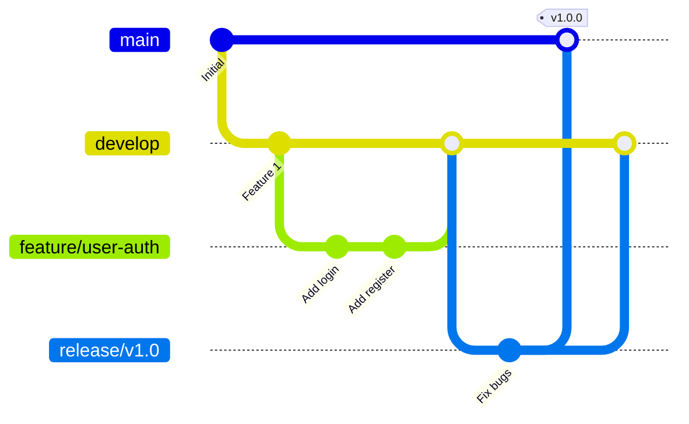

# AlkaidSYS 开发流程

## 📋 文档信息

| 项目 | 内容 |
|------|------|
| **文档名称** | AlkaidSYS 开发流程 |
| **文档版本** | v1.0 |
| **创建日期** | 2025-01-19 |

## 🎯 开发流程目标

1. **规范化** - 统一的开发规范
2. **协作化** - 高效的团队协作
3. **自动化** - 自动化的工作流程
4. **质量化** - 高质量的代码产出

## 🏗️ Git 工作流

### 分支策略



### 分支说明

| 分支类型 | 命名规范 | 说明 |
|---------|---------|------|
| **main** | main | 主分支，生产环境代码 |
| **develop** | develop | 开发分支，最新开发代码 |
| **feature** | feature/功能名 | 功能分支，开发新功能 |
| **bugfix** | bugfix/问题描述 | 修复分支，修复 bug |
| **release** | release/版本号 | 发布分支，准备发布 |
| **hotfix** | hotfix/问题描述 | 热修复分支，紧急修复 |

### 分支操作流程

```bash
# 1. 从 develop 创建功能分支
git checkout develop
git pull origin develop
git checkout -b feature/user-auth

# 2. 开发功能
git add .
git commit -m "feat: add user authentication"

# 3. 推送到远程
git push origin feature/user-auth

# 4. 创建 Pull Request
# 在 GitHub/GitLab 上创建 PR

# 5. Code Review 通过后合并到 develop
git checkout develop
git merge feature/user-auth

# 6. 删除功能分支
git branch -d feature/user-auth
git push origin --delete feature/user-auth
```

## 📝 提交规范

### Commit Message 格式

```
<type>(<scope>): <subject>

<body>

<footer>
```

### Type 类型

| Type | 说明 |
|------|------|
| **feat** | 新功能 |
| **fix** | 修复 bug |
| **docs** | 文档更新 |
| **style** | 代码格式（不影响代码运行） |
| **refactor** | 重构（既不是新功能也不是修复 bug） |
| **perf** | 性能优化 |
| **test** | 测试相关 |
| **chore** | 构建过程或辅助工具的变动 |

### 示例

```bash
# 新功能
git commit -m "feat(auth): add JWT authentication"

# 修复 bug
git commit -m "fix(user): fix user registration validation"

# 文档更新
git commit -m "docs(readme): update installation guide"

# 性能优化
git commit -m "perf(query): optimize database query performance"

# 重构
git commit -m "refactor(service): refactor user service"
```

### Commitlint 配置

```javascript
// /commitlint.config.js

module.exports = {
  extends: ['@commitlint/config-conventional'],
  rules: {
    'type-enum': [
      2,
      'always',
      [
        'feat',
        'fix',
        'docs',
        'style',
        'refactor',
        'perf',
        'test',
        'chore',
        'revert',
      ],
    ],
    'subject-case': [0],
  },
};
```

## 🔧 代码规范

### PHP 代码规范（PSR-12）

```php
<?php

declare(strict_types=1);

namespace App\Service;

use App\Model\User;

/**
 * 用户服务类
 */
class UserService
{
    /**
     * 创建用户
     *
     * @param array $data 用户数据
     * @return User
     */
    public function create(array $data): User
    {
        // 验证数据
        $this->validate($data);
        
        // 创建用户
        $user = User::create([
            'username' => $data['username'],
            'email' => $data['email'],
            'password' => password_hash($data['password'], PASSWORD_DEFAULT),
        ]);
        
        return $user;
    }
    
    /**
     * 验证数据
     *
     * @param array $data
     * @return void
     */
    protected function validate(array $data): void
    {
        if (empty($data['username'])) {
            throw new \InvalidArgumentException('用户名不能为空');
        }
        
        if (empty($data['email'])) {
            throw new \InvalidArgumentException('邮箱不能为空');
        }
    }
}
```

### PHP CS Fixer 配置

```php
<?php
// /.php-cs-fixer.php

$finder = PhpCsFixer\Finder::create()
    ->in(__DIR__ . '/app')
    ->name('*.php')
    ->notName('*.blade.php')
    ->ignoreDotFiles(true)
    ->ignoreVCS(true);

return (new PhpCsFixer\Config())
    ->setRules([
        '@PSR12' => true,
        'array_syntax' => ['syntax' => 'short'],
        'ordered_imports' => ['sort_algorithm' => 'alpha'],
        'no_unused_imports' => true,
        'not_operator_with_successor_space' => true,
        'trailing_comma_in_multiline' => true,
        'phpdoc_scalar' => true,
        'unary_operator_spaces' => true,
        'binary_operator_spaces' => true,
        'blank_line_before_statement' => [
            'statements' => ['break', 'continue', 'declare', 'return', 'throw', 'try'],
        ],
        'phpdoc_single_line_var_spacing' => true,
        'phpdoc_var_without_name' => true,
    ])
    ->setFinder($finder);
```

### TypeScript 代码规范

```typescript
// /apps/admin/.eslintrc.js

module.exports = {
  extends: [
    '@vben/eslint-config',
  ],
  rules: {
    '@typescript-eslint/no-explicit-any': 'warn',
    '@typescript-eslint/no-unused-vars': 'error',
    'vue/multi-word-component-names': 'off',
  },
};
```

## 👥 Code Review 流程

### Pull Request 模板

```markdown
## 变更类型
- [ ] 新功能
- [ ] Bug 修复
- [ ] 文档更新
- [ ] 性能优化
- [ ] 重构

## 变更描述
<!-- 描述本次变更的内容 -->

## 相关 Issue
<!-- 关联的 Issue 编号 -->
Closes #

## 测试
- [ ] 单元测试已通过
- [ ] 集成测试已通过
- [ ] 手动测试已完成

## 检查清单
- [ ] 代码符合规范
- [ ] 已添加必要的注释
- [ ] 已更新相关文档
- [ ] 无新增的 TODO
- [ ] 无调试代码

## 截图
<!-- 如果有 UI 变更，请提供截图 -->
```

### Code Review 检查点

1. **代码质量**
   - 是否符合代码规范
   - 是否有重复代码
   - 是否有过度设计

2. **功能实现**
   - 是否实现了需求
   - 是否有边界情况处理
   - 是否有错误处理

3. **性能**
   - 是否有性能问题
   - 是否有 N+1 查询
   - 是否有不必要的循环

4. **安全**
   - 是否有 SQL 注入风险
   - 是否有 XSS 风险
   - 是否有敏感信息泄露

5. **测试**
   - 是否有单元测试
   - 测试覆盖率是否足够
   - 测试是否通过

## 🚀 发布流程

### 版本号规范（Semantic Versioning）

```
主版本号.次版本号.修订号

例如：1.2.3
- 1: 主版本号（不兼容的 API 修改）
- 2: 次版本号（向下兼容的功能性新增）
- 3: 修订号（向下兼容的问题修正）
```

### 发布检查清单

```markdown
## 发布前检查

### 代码检查
- [ ] 所有测试通过
- [ ] 代码已 Review
- [ ] 无已知 Bug
- [ ] 性能测试通过

### 文档检查
- [ ] API 文档已更新
- [ ] CHANGELOG 已更新
- [ ] README 已更新
- [ ] 升级指南已准备

### 环境检查
- [ ] 数据库迁移脚本已准备
- [ ] 配置文件已更新
- [ ] 依赖包已更新
- [ ] 备份已完成

### 发布步骤
1. 创建 release 分支
2. 更新版本号
3. 更新 CHANGELOG
4. 合并到 main
5. 打 tag
6. 部署到生产环境
7. 验证功能
8. 通知团队
```

### 发布脚本

```bash
#!/bin/bash
# /scripts/release.sh

VERSION=$1

if [ -z "$VERSION" ]; then
    echo "Usage: ./release.sh <version>"
    exit 1
fi

echo "Releasing version $VERSION..."

# 1. 创建 release 分支
git checkout develop
git pull origin develop
git checkout -b release/$VERSION

# 2. 更新版本号
echo $VERSION > VERSION

# 3. 更新 CHANGELOG
echo "## [$VERSION] - $(date +%Y-%m-%d)" >> CHANGELOG.md

# 4. 提交变更
git add .
git commit -m "chore: release $VERSION"

# 5. 合并到 main
git checkout main
git merge release/$VERSION

# 6. 打 tag
git tag -a v$VERSION -m "Release $VERSION"

# 7. 推送
git push origin main
git push origin v$VERSION

# 8. 合并回 develop
git checkout develop
git merge release/$VERSION
git push origin develop

# 9. 删除 release 分支
git branch -d release/$VERSION

echo "Release $VERSION completed!"
```

## 🔄 自动化工作流

### Husky + Lint-staged

```json
// /package.json

{
  "husky": {
    "hooks": {
      "pre-commit": "lint-staged",
      "commit-msg": "commitlint -E HUSKY_GIT_PARAMS"
    }
  },
  "lint-staged": {
    "*.php": [
      "php-cs-fixer fix",
      "git add"
    ],
    "*.{ts,tsx,vue}": [
      "eslint --fix",
      "git add"
    ]
  }
}
```

### GitHub Actions 工作流

> 说明：本节作为 CI 工作流的总体规范，其他文档（如部署指南、测试策略）中的 workflow 示例均视为场景示例，若有冲突以本节约定为准。

```yaml
# /.github/workflows/ci.yml

name: CI

on: [push, pull_request]

jobs:
  lint:
    runs-on: ubuntu-latest
    steps:
      - uses: actions/checkout@v2
      - name: PHP CS Fixer
        run: composer cs-fix -- --dry-run
      - name: ESLint
        run: npm run lint
  
  test:
    runs-on: ubuntu-latest
    steps:
      - uses: actions/checkout@v2
      - name: Run tests
        run: php think test
  
  build:
    runs-on: ubuntu-latest
    needs: [lint, test]
    steps:
      - uses: actions/checkout@v2
      - name: Build
        run: npm run build
```

## 🆚 与 NIUCLOUD 开发流程对比

| 特性 | AlkaidSYS | NIUCLOUD | 优势 |
|------|-----------|----------|------|
| **Git 工作流** | Git Flow | 简单分支 | ✅ 更规范 |
| **提交规范** | Conventional Commits | 无规范 | ✅ 更清晰 |
| **代码规范** | PSR-12 + ESLint | 基础规范 | ✅ 更严格 |
| **Code Review** | 强制 PR | 可选 | ✅ 更严谨 |
| **自动化** | 完整 CI/CD | 部分自动化 | ✅ 更高效 |

---

## 🤖 AI 辅助开发闭环（新增标准）

### 阶段门（Gate）
1) 模板识别：TemplateGeneratorTool 识别需求 → 输出模板与 CLI 命令
2) 代码生成：CodeGeneratorTool 生成骨架/CRUD/前后端
3) 规范校验：CodeValidatorTool 执行 PSR-12、PHPStan、接口规范检查
4) 测试生成：TestGeneratorTool 生成/补齐单元与集成测试
5) 文档生成：api:doc + openapi-typescript 产出 OpenAPI 与 TS 类型
6) 部署准备：变更审查、签名策略、回滚计划

> 相关整体流程与数据演进约束详见《03-data-layer/13-data-evolution-bluebook.md》《01-architecture-design/08-low-code-design.md》。

### PR 检查清单（补充）
- [ ] 通过 CodeValidatorTool 校验（风格/类型/接口规范）
- [ ] OpenAPI 文档与 TS 类型已生成并入库/产物上传
- [ ] 测试新增并通过（含失败路径）
- [ ] 性能与安全检查（限流、签名、权限）

### CI 参考集成
```yaml
jobs:
  ai-pipeline:
    runs-on: ubuntu-latest
    steps:
      - uses: actions/checkout@v4
      - name: PHP Lint & Typecheck
        run: |
          composer cs-fix -- --dry-run
          vendor/bin/phpstan analyse --level=max app
      - name: Run CodeValidatorTool
        run: php think mcp:code-validate app plugin --format=junit --output=build/code-validate.xml
      - name: API Docs & Types
        run: |
          php think api:doc
          npm i -D @redocly/cli openapi-typescript
          npx redocly lint public/api-docs.json
          npx openapi-typescript public/api-docs.json -o admin/src/api/types.d.ts
      - name: Schema Drift Check
        run: |
          # 占位：建议实现 --all 与 --check 选项
          php think lowcode:migration:diff --all --check
      - name: Tests
        run: php think test
```

### CI 任务占位命令说明（新增）

```bash
# 1) 代码规范与接口规范校验（失败返回非零）
php think mcp:code-validate app plugin \
  --format=junit \
  --output=build/code-validate.xml

# 2) Schema 漂移检查（建议实现）
#   --all    ：检查所有 Collection
#   --check  ：只检查不输出文件，发现差异返回非零退出码
php think lowcode:migration:diff --all --check

# 3) 生成与校验 API 文档与类型
php think api:doc
npx redocly lint public/api-docs.json
npx openapi-typescript public/api-docs.json -o admin/src/api/types.d.ts
```

### 返回码与报告格式（新增）

- mcp:code-validate（建议规范）
  - 退出码：
    - 0：通过
    - 1：代码风格错误（PSR-12）
    - 2：类型检查错误（PHPStan 等）
    - 3：接口规范不符合（例如缺少 HookToolProvider 必要方法）
    - 10：工具运行失败（异常/配置错误）
  - 报告（JUnit XML，--format=junit）：
    - testsuite name="CodeValidatorTool" time=... tests=... failures=...
    - testcase name="app/Service/Foo.php:PSR12" time=... <failure message="..."/>
    - testcase name="app/Service/Bar.php:Typecheck" ...

示例（节选）：
```xml
<testsuite name="CodeValidatorTool" tests="3" failures="2" time="0.42">
  <testcase name="app/Service/Foo.php:PSR12" time="0.01">
    <failure message="Line 23: expected 1 blank line before return"/>
  </testcase>
  <testcase name="app/Service/Bar.php:Typecheck" time="0.02">
    <failure message="Parameter $id of App\\Service\\Bar::get expects int, string given"/>
  </testcase>
  <testcase name="app/Tools/MyTool.php:InterfaceCompliance" time="0.01"/>
</testsuite>
```

- lowcode:migration:diff --all --check（建议规范）
  - 退出码：
    - 0：无漂移
    - 4：检测到漂移（存在未同步的 DDL 差异）
    - 10：工具运行失败（异常/权限/连接失败）
  - 输出：
    - 控制台打印差异摘要（表/列/索引/外键 统计）
    - 可选输出详细报告到 build/schema-drift.json（--report=path）

示例（控制台节选）：
```text
[drift] products: +column images TEXT, +index idx_status(status)
[drift] orders: ~column total_amount DECIMAL(10,2)->DECIMAL(12,2)
[summary] tables=2 add=2 modify=1 drop=0
```

### 度量指标（度量看板建议）
- AI 生成占比、交互轮数、构建时长、缺陷密度、回滚率

---

**最后更新**: 2025-01-19  
**文档版本**: v1.0  
**维护者**: AlkaidSYS 架构团队

