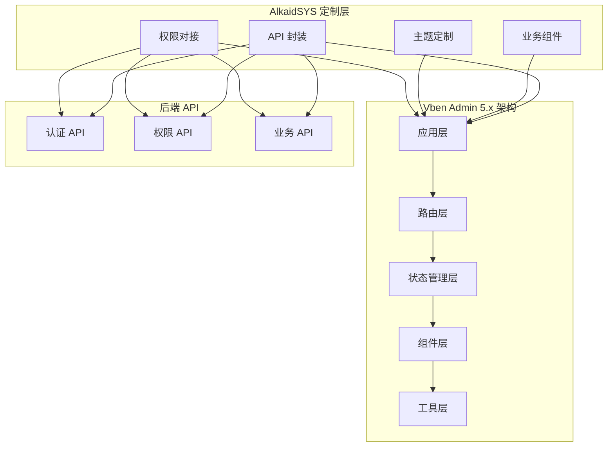

# AlkaidSYS Admin 管理端设计

## 📋 文档信息

| 项目 | 内容 |
|------|------|
| **文档名称** | AlkaidSYS Admin 管理端设计 |
| **文档版本** | v1.0 |
| **创建日期** | 2025-01-19 |

## 🎯 Admin 管理端设计目标

1. **直接使用 Vben Admin 5.x** - 不重复造轮子，节省 6-8 周开发时间
2. **完整的权限对接** - 与后端 PHP-Casbin RBAC 无缝对接
3. **主题定制** - 符合 AlkaidSYS 品牌风格
4. **性能优化** - 首屏加载 < 2s，路由切换 < 300ms
5. **开发体验** - TypeScript + Vite + Turbo，极致的开发体验

## 🏗️ Admin 管理端架构



## 📦 技术栈

### 核心依赖

```json
{
  "name": "@alkaid/admin",
  "version": "1.0.0",
  "private": true,
  "type": "module",
  "scripts": {
    "dev": "vite",
    "build": "vite build",
    "preview": "vite preview",
    "type-check": "vue-tsc --noEmit",
    "lint": "eslint . --ext .vue,.js,.jsx,.cjs,.mjs,.ts,.tsx,.cts,.mts --fix"
  },
  "dependencies": {
    "vue": "^3.5.17",
    "@vben/vite-config": "workspace:*",
    "@vben/stores": "workspace:*",
    "@vben/layouts": "workspace:*",
    "@vben/styles": "workspace:*",
    "@vben/utils": "workspace:*",
    "ant-design-vue": "^4.2.6",
    "pinia": "^3.0.3",
    "vue-router": "^4.5.0",
    "axios": "^1.7.9",
    "@vueuse/core": "^11.4.0",
    "dayjs": "^1.11.13",
    "lodash-es": "^4.17.21"
  },
  "devDependencies": {
    "@vben/eslint-config": "workspace:*",
    "@vben/tsconfig": "workspace:*",
    "@vitejs/plugin-vue": "^5.2.1",
    "@vitejs/plugin-vue-jsx": "^4.1.1",
    "typescript": "^5.8.3",
    "vite": "^7.1.2",
    "vue-tsc": "^2.2.0"
  }
}
```

## 🔧 项目结构

```
apps/admin/
├── src/
│   ├── api/                    # API 接口
│   │   ├── auth.ts            # 认证相关
│   │   ├── user.ts            # 用户管理
│   │   ├── role.ts            # 角色管理
│   │   ├── permission.ts      # 权限管理
│   │   └── menu.ts            # 菜单管理
│   ├── assets/                # 静态资源
│   │   ├── images/
│   │   └── styles/
│   ├── components/            # 业务组件
│   │   ├── TenantSelector/    # 租户选择器
│   │   ├── SiteSelector/      # 站点选择器
│   │   └── UserAvatar/        # 用户头像
│   ├── layouts/               # 布局组件
│   │   └── default/
│   ├── router/                # 路由配置
│   │   ├── index.ts
│   │   ├── routes/
│   │   └── guards/
│   ├── store/                 # 状态管理
│   │   ├── modules/
│   │   │   ├── auth.ts        # 认证状态
│   │   │   ├── user.ts        # 用户状态
│   │   │   ├── tenant.ts      # 租户状态
│   │   │   └── permission.ts  # 权限状态
│   │   └── index.ts
│   ├── utils/                 # 工具函数
│   │   ├── request.ts         # 请求封装
│   │   ├── auth.ts            # 认证工具
│   │   └── permission.ts      # 权限工具
│   ├── views/                 # 页面
│   │   ├── dashboard/         # 仪表盘
│   │   ├── system/            # 系统管理
│   │   │   ├── user/          # 用户管理
│   │   │   ├── role/          # 角色管理
│   │   │   ├── permission/    # 权限管理
│   │   │   └── menu/          # 菜单管理
│   │   ├── tenant/            # 租户管理
│   │   └── site/              # 站点管理
│   ├── App.vue
│   └── main.ts
├── public/
├── index.html
├── vite.config.ts
├── tsconfig.json
└── package.json
```

## 🔐 权限对接

### 1. 认证 API 对接

```typescript
// /apps/admin/src/api/auth.ts

import { request } from '@/utils/request';

export interface LoginParams {
  username: string;
  password: string;
  tenant_code?: string;
}

export interface LoginResult {
  access_token: string;
  refresh_token: string;
  expires_in: number;
  user: {
    id: number;
    username: string;
    email: string;
    nickname: string;
    avatar: string;
    roles: string[];
    permissions: string[];
  };
}

export interface UserInfo {
  id: number;
  username: string;
  email: string;
  nickname: string;
  avatar: string;
  roles: Array<{
    id: number;
    name: string;
    code: string;
  }>;
  permissions: string[];
}

/**
 * 登录
 */
export function login(data: LoginParams) {
  return request<LoginResult>({
    url: '/admin/auth/login',
    method: 'POST',
    data,
  });
}

/**
 * 获取用户信息
 */
export function getUserInfo() {
  return request<UserInfo>({
    url: '/admin/auth/user',
    method: 'GET',
  });
}

/**
 * 刷新 Token
 */
export function refreshToken(refreshToken: string) {
  return request<LoginResult>({
    url: '/admin/auth/refresh',
    method: 'POST',
    data: { refresh_token: refreshToken },
  });
}

/**
 * 登出
 */
export function logout() {
  return request({
    url: '/admin/auth/logout',
    method: 'POST',
  });
}
```

### 2. 认证 Store

```typescript
// /apps/admin/src/store/modules/auth.ts

import { defineStore } from 'pinia';
import { login, getUserInfo, logout, type LoginParams } from '@/api/auth';
import { useAccessStore } from '@vben/stores';
import { router } from '@/router';

interface AuthState {
  user: any;
  roles: string[];
  permissions: string[];
}

export const useAuthStore = defineStore('auth', {
  state: (): AuthState => ({
    user: null,
    roles: [],
    permissions: [],
  }),
  
  getters: {
    isLoggedIn: (state) => !!state.user,
    hasRole: (state) => (role: string) => state.roles.includes(role),
    hasPermission: (state) => (permission: string) => state.permissions.includes(permission),
  },
  
  actions: {
    /**
     * 登录
     */
    async login(params: LoginParams) {
      try {
        const result = await login(params);
        
        // 保存 Token 到 Vben 的 AccessStore
        const accessStore = useAccessStore();
        accessStore.setAccessToken(result.access_token);
        accessStore.setRefreshToken(result.refresh_token);
        
        // 保存用户信息
        this.user = result.user;
        this.roles = result.user.roles;
        this.permissions = result.user.permissions;
        
        // 设置权限码到 Vben
        accessStore.setAccessCodes(result.user.permissions);
        
        return result;
      } catch (error) {
        console.error('Login failed:', error);
        throw error;
      }
    },
    
    /**
     * 获取用户信息
     */
    async fetchUserInfo() {
      try {
        const result = await getUserInfo();
        
        this.user = result;
        this.roles = result.roles.map(r => r.code);
        this.permissions = result.permissions;
        
        // 更新 Vben 的权限码
        const accessStore = useAccessStore();
        accessStore.setAccessCodes(result.permissions);
        
        return result;
      } catch (error) {
        console.error('Fetch user info failed:', error);
        throw error;
      }
    },
    
    /**
     * 登出
     */
    async logout() {
      try {
        await logout();
      } catch (error) {
        console.error('Logout failed:', error);
      } finally {
        // 清除状态
        this.user = null;
        this.roles = [];
        this.permissions = [];
        
        // 清除 Vben 的 Token
        const accessStore = useAccessStore();
        accessStore.setAccessToken(null);
        accessStore.setRefreshToken(null);
        accessStore.setAccessCodes([]);
        
        // 跳转到登录页
        router.push('/login');
      }
    },
    
    /**
     * 重置状态
     */
    reset() {
      this.user = null;
      this.roles = [];
      this.permissions = [];
    },
  },
  
  persist: {
    key: 'alkaid-auth',
    storage: localStorage,
    paths: ['user', 'roles', 'permissions'],
  },
});
```

### 3. 权限指令

```typescript
// /apps/admin/src/directives/permission.ts

import type { App, Directive } from 'vue';
import { useAuthStore } from '@/store/modules/auth';

/**
 * 权限指令
 * 用法：v-permission="'user:create'"
 */
export const permission: Directive = {
  mounted(el, binding) {
    const { value } = binding;
    const authStore = useAuthStore();
    
    if (value && !authStore.hasPermission(value)) {
      el.parentNode?.removeChild(el);
    }
  },
};

/**
 * 角色指令
 * 用法：v-role="'admin'"
 */
export const role: Directive = {
  mounted(el, binding) {
    const { value } = binding;
    const authStore = useAuthStore();
    
    if (value && !authStore.hasRole(value)) {
      el.parentNode?.removeChild(el);
    }
  },
};

/**
 * 注册指令
 */
export function setupPermissionDirective(app: App) {
  app.directive('permission', permission);
  app.directive('role', role);
}
```

### 4. 权限路由守卫

```typescript
// /apps/admin/src/router/guards/permission.ts

import type { Router } from 'vue-router';
import { useAuthStore } from '@/store/modules/auth';
import { useAccessStore } from '@vben/stores';

export function setupPermissionGuard(router: Router) {
  router.beforeEach(async (to, from, next) => {
    const authStore = useAuthStore();
    const accessStore = useAccessStore();
    
    // 白名单路由
    const whiteList = ['/login', '/404', '/403'];
    if (whiteList.includes(to.path)) {
      next();
      return;
    }
    
    // 检查是否登录
    const token = accessStore.accessToken;
    if (!token) {
      next({ path: '/login', query: { redirect: to.fullPath } });
      return;
    }
    
    // 检查是否已获取用户信息
    if (!authStore.user) {
      try {
        await authStore.fetchUserInfo();
      } catch (error) {
        // 获取用户信息失败，清除 Token 并跳转到登录页
        await authStore.logout();
        next({ path: '/login', query: { redirect: to.fullPath } });
        return;
      }
    }
    
    // 检查路由权限
    if (to.meta.permission) {
      const hasPermission = authStore.hasPermission(to.meta.permission as string);
      if (!hasPermission) {
        next({ path: '/403' });
        return;
      }
    }
    
    // 检查角色权限
    if (to.meta.roles) {
      const roles = to.meta.roles as string[];
      const hasRole = roles.some(role => authStore.hasRole(role));
      if (!hasRole) {
        next({ path: '/403' });
        return;
      }
    }
    
    next();
  });
}
```

## 🎨 主题定制

### 1. 主题配置

```typescript
// /apps/admin/src/preferences.ts

import { defineOverridesPreferences } from '@vben/preferences';

export const overridesPreferences = defineOverridesPreferences({
  // 主题
  theme: {
    mode: 'light',
    colorPrimary: '#1890ff',
    colorSuccess: '#52c41a',
    colorWarning: '#faad14',
    colorError: '#f5222d',
    colorInfo: '#1890ff',
  },
  
  // 布局
  layout: {
    mode: 'sidebar',
    sidebarCollapsed: false,
    sidebarWidth: 240,
    headerHeight: 56,
    contentCompact: false,
  },
  
  // 导航
  navigation: {
    accordion: true,
    split: false,
  },
  
  // 标签页
  tabbar: {
    enable: true,
    height: 40,
    keepAlive: true,
    showIcon: true,
    showMaximize: true,
    showMore: true,
    showRefresh: true,
  },
  
  // 页脚
  footer: {
    enable: true,
    fixed: false,
  },
  
  // Logo
  logo: {
    enable: true,
    source: '/logo.svg',
  },
  
  // 过渡动画
  transition: {
    enable: true,
    name: 'fade-slide',
    loading: true,
  },
});
```

### 2. 自定义样式

```scss
// /apps/admin/src/assets/styles/theme.scss

// AlkaidSYS 品牌色
$primary-color: #1890ff;
$success-color: #52c41a;
$warning-color: #faad14;
$error-color: #f5222d;

// 覆盖 Ant Design Vue 变量
:root {
  --ant-primary-color: #{$primary-color};
  --ant-success-color: #{$success-color};
  --ant-warning-color: #{$warning-color};
  --ant-error-color: #{$error-color};
}

// 自定义样式
.alkaid-admin {
  // 侧边栏
  .vben-sidebar {
    background: linear-gradient(180deg, #001529 0%, #002140 100%);
    
    .vben-menu-item {
      &:hover {
        background-color: rgba(255, 255, 255, 0.08);
      }
      
      &.is-active {
        background-color: $primary-color;
      }
    }
  }
  
  // 头部
  .vben-header {
    box-shadow: 0 1px 4px rgba(0, 21, 41, 0.08);
  }
  
  // 内容区
  .vben-content {
    padding: 16px;
    background-color: #f0f2f5;
  }
}
```

## 📱 业务组件

### 1. 租户选择器

```vue
<!-- /apps/admin/src/components/TenantSelector/index.vue -->

<template>
  <a-select
    v-model:value="currentTenant"
    placeholder="选择租户"
    style="width: 200px"
    @change="handleTenantChange"
  >
    <a-select-option
      v-for="tenant in tenants"
      :key="tenant.id"
      :value="tenant.id"
    >
      {{ tenant.name }}
    </a-select-option>
  </a-select>
</template>

<script setup lang="ts">
import { ref, onMounted } from 'vue';
import { useTenantStore } from '@/store/modules/tenant';

const tenantStore = useTenantStore();
const currentTenant = ref<number>();
const tenants = ref<any[]>([]);

onMounted(async () => {
  await loadTenants();
  currentTenant.value = tenantStore.currentTenantId;
});

async function loadTenants() {
  tenants.value = await tenantStore.fetchTenants();
}

function handleTenantChange(tenantId: number) {
  tenantStore.switchTenant(tenantId);
  // 刷新页面数据
  window.location.reload();
}
</script>
```

### 2. 站点选择器

```vue
<!-- /apps/admin/src/components/SiteSelector/index.vue -->

<template>
  <a-select
    v-model:value="currentSite"
    placeholder="选择站点"
    style="width: 200px"
    @change="handleSiteChange"
  >
    <a-select-option
      v-for="site in sites"
      :key="site.id"
      :value="site.id"
    >
      {{ site.name }}
    </a-select-option>
  </a-select>
</template>

<script setup lang="ts">
import { ref, onMounted, watch } from 'vue';
import { useSiteStore } from '@/store/modules/site';
import { useTenantStore } from '@/store/modules/tenant';

const siteStore = useSiteStore();
const tenantStore = useTenantStore();
const currentSite = ref<number>();
const sites = ref<any[]>([]);

onMounted(async () => {
  await loadSites();
  currentSite.value = siteStore.currentSiteId;
});

// 监听租户变化
watch(() => tenantStore.currentTenantId, async () => {
  await loadSites();
});

async function loadSites() {
  sites.value = await siteStore.fetchSites();
}

function handleSiteChange(siteId: number) {
  siteStore.switchSite(siteId);
  // 刷新页面数据
  window.location.reload();
}
</script>
```

## 🔄 请求封装

### 请求拦截器

```typescript
// /apps/admin/src/utils/request.ts

import axios, { type AxiosInstance, type AxiosRequestConfig, type AxiosResponse } from 'axios';
import { message } from 'ant-design-vue';
import { useAccessStore } from '@vben/stores';
import { useAuthStore } from '@/store/modules/auth';
import { useTenantStore } from '@/store/modules/tenant';
import { useSiteStore } from '@/store/modules/site';

const service: AxiosInstance = axios.create({
  baseURL: import.meta.env.VITE_API_BASE_URL,
  timeout: 30000,
});

// 请求拦截器
service.interceptors.request.use(
  (config) => {
    const accessStore = useAccessStore();
    const tenantStore = useTenantStore();
    const siteStore = useSiteStore();
    
    // 添加 Token
    const token = accessStore.accessToken;
    if (token) {
      config.headers.Authorization = `Bearer ${token}`;
    }
    
    // 添加租户和站点信息（与后端约定：优先使用 ID，必要时同时传递 Code 便于审计）
    if (tenantStore.currentTenantId) {
      config.headers['X-Tenant-ID'] = tenantStore.currentTenantId as any;
    }
    if (tenantStore.currentTenantCode) {
      config.headers['X-Tenant-Code'] = tenantStore.currentTenantCode as any;
    }
    if ((siteStore as any).currentSiteId) {
      config.headers['X-Site-ID'] = (siteStore as any).currentSiteId as any;
    }
    if (siteStore.currentSiteCode) {
      config.headers['X-Site-Code'] = siteStore.currentSiteCode as any;
    }
    
    return config;
  },
  (error) => {
    return Promise.reject(error);
  }
);

// 响应拦截器
service.interceptors.response.use(
  (response: AxiosResponse) => {
    const res = response.data;
    
    if (res.code !== 200) {
      message.error(res.message || '请求失败');
      return Promise.reject(new Error(res.message || '请求失败'));
    }
    
    return res.data;
  },
  async (error) => {
    if (error.response?.status === 401) {
      // Token 过期，尝试刷新
      const accessStore = useAccessStore();
      const authStore = useAuthStore();
      
      try {
        const refreshToken = accessStore.refreshToken;
        if (refreshToken) {
          const result = await refreshToken(refreshToken);
          accessStore.setAccessToken(result.access_token);
          accessStore.setRefreshToken(result.refresh_token);
          
          // 重试原请求
          return service(error.config);
        }
      } catch (e) {
        // 刷新失败，跳转登录
        await authStore.logout();
      }
    }
    
    message.error(error.message || '请求失败');
    return Promise.reject(error);
  }
);

export function request<T = any>(config: AxiosRequestConfig): Promise<T> {
  return service(config);
}

export default service;
```

## 📊 动态菜单加载

### 1. 菜单 API

```typescript
// /apps/admin/src/api/menu.ts

import { request } from '@/utils/request';

export interface MenuItem {
  id: number;
  parent_id: number;
  name: string;
  path: string;
  component: string;
  icon: string;
  sort: number;
  permission: string;
  children?: MenuItem[];
}

/**
 * 获取用户菜单
 */
export function getUserMenus() {
  return request<MenuItem[]>({
    url: '/admin/menus/user',
    method: 'GET',
  });
}
```

### 2. 动态路由生成

```typescript
// /apps/admin/src/router/helper.ts

import type { RouteRecordRaw } from 'vue-router';
import type { MenuItem } from '@/api/menu';

const modules = import.meta.glob('../views/**/*.vue');

/**
 * 将菜单转换为路由
 */
export function transformMenuToRoute(menus: MenuItem[]): RouteRecordRaw[] {
  return menus.map(menu => {
    const route: RouteRecordRaw = {
      path: menu.path,
      name: menu.name,
      component: loadComponent(menu.component),
      meta: {
        title: menu.name,
        icon: menu.icon,
        permission: menu.permission,
      },
    };

    if (menu.children && menu.children.length > 0) {
      route.children = transformMenuToRoute(menu.children);
    }

    return route;
  });
}

/**
 * 动态加载组件
 */
function loadComponent(component: string) {
  if (component === 'Layout') {
    return () => import('@/layouts/default/index.vue');
  }

  const path = `../views/${component}.vue`;
  return modules[path];
}
```

### 3. 路由初始化

```typescript
// /apps/admin/src/router/index.ts

import { createRouter, createWebHistory } from 'vue-router';
import { setupPermissionGuard } from './guards/permission';
import { getUserMenus } from '@/api/menu';
import { transformMenuToRoute } from './helper';

// 静态路由
const staticRoutes = [
  {
    path: '/login',
    name: 'Login',
    component: () => import('@/views/auth/login.vue'),
  },
  {
    path: '/404',
    name: 'NotFound',
    component: () => import('@/views/error/404.vue'),
  },
  {
    path: '/403',
    name: 'Forbidden',
    component: () => import('@/views/error/403.vue'),
  },
];

export const router = createRouter({
  history: createWebHistory(import.meta.env.BASE_URL),
  routes: staticRoutes,
});

/**
 * 初始化动态路由
 */
export async function setupDynamicRoutes() {
  try {
    const menus = await getUserMenus();
    const routes = transformMenuToRoute(menus);

    routes.forEach(route => {
      router.addRoute(route);
    });

    // 添加 404 路由（必须在最后）
    router.addRoute({
      path: '/:pathMatch(.*)*',
      redirect: '/404',
    });
  } catch (error) {
    console.error('Setup dynamic routes failed:', error);
  }
}

// 设置路由守卫
setupPermissionGuard(router);

export default router;
```

## 🎯 页面示例

### 1. 用户管理页面

```vue
<!-- /apps/admin/src/views/system/user/index.vue -->

<template>
  <div class="user-management">
    <a-card :bordered="false">
      <!-- 搜索表单 -->
      <a-form layout="inline" :model="searchForm" class="search-form">
        <a-form-item label="用户名">
          <a-input v-model:value="searchForm.username" placeholder="请输入用户名" />
        </a-form-item>
        <a-form-item label="邮箱">
          <a-input v-model:value="searchForm.email" placeholder="请输入邮箱" />
        </a-form-item>
        <a-form-item label="状态">
          <a-select v-model:value="searchForm.status" placeholder="请选择状态" style="width: 120px">
            <a-select-option value="">全部</a-select-option>
            <a-select-option value="1">启用</a-select-option>
            <a-select-option value="0">禁用</a-select-option>
          </a-select>
        </a-form-item>
        <a-form-item>
          <a-button type="primary" @click="handleSearch">搜索</a-button>
          <a-button style="margin-left: 8px" @click="handleReset">重置</a-button>
        </a-form-item>
      </a-form>

      <!-- 工具栏 -->
      <div class="toolbar">
        <a-button type="primary" @click="handleCreate" v-permission="'user:create'">
          <template #icon><PlusOutlined /></template>
          新增用户
        </a-button>
        <a-button danger @click="handleBatchDelete" v-permission="'user:delete'">
          <template #icon><DeleteOutlined /></template>
          批量删除
        </a-button>
      </div>

      <!-- 表格 -->
      <a-table
        :columns="columns"
        :data-source="dataSource"
        :loading="loading"
        :pagination="pagination"
        :row-selection="rowSelection"
        @change="handleTableChange"
      >
        <template #bodyCell="{ column, record }">
          <template v-if="column.key === 'avatar'">
            <a-avatar :src="record.avatar" />
          </template>
          <template v-else-if="column.key === 'status'">
            <a-tag :color="record.status === 1 ? 'success' : 'error'">
              {{ record.status === 1 ? '启用' : '禁用' }}
            </a-tag>
          </template>
          <template v-else-if="column.key === 'action'">
            <a-space>
              <a-button type="link" size="small" @click="handleEdit(record)" v-permission="'user:update'">
                编辑
              </a-button>
              <a-button type="link" size="small" danger @click="handleDelete(record)" v-permission="'user:delete'">
                删除
              </a-button>
            </a-space>
          </template>
        </template>
      </a-table>
    </a-card>

    <!-- 编辑对话框 -->
    <UserModal
      v-model:visible="modalVisible"
      :record="currentRecord"
      @success="handleSuccess"
    />
  </div>
</template>

<script setup lang="ts">
import { ref, reactive, onMounted } from 'vue';
import { message, Modal } from 'ant-design-vue';
import { PlusOutlined, DeleteOutlined } from '@ant-design/icons-vue';
import { getUserList, deleteUser, batchDeleteUser } from '@/api/user';
import UserModal from './components/UserModal.vue';

const loading = ref(false);
const dataSource = ref([]);
const selectedRowKeys = ref([]);
const modalVisible = ref(false);
const currentRecord = ref(null);

const searchForm = reactive({
  username: '',
  email: '',
  status: '',
});

const pagination = reactive({
  current: 1,
  pageSize: 20,
  total: 0,
  showSizeChanger: true,
  showQuickJumper: true,
  showTotal: (total: number) => `共 ${total} 条`,
});

const columns = [
  { title: 'ID', dataIndex: 'id', key: 'id', width: 80 },
  { title: '头像', dataIndex: 'avatar', key: 'avatar', width: 80 },
  { title: '用户名', dataIndex: 'username', key: 'username' },
  { title: '邮箱', dataIndex: 'email', key: 'email' },
  { title: '昵称', dataIndex: 'nickname', key: 'nickname' },
  { title: '状态', dataIndex: 'status', key: 'status', width: 100 },
  { title: '创建时间', dataIndex: 'created_at', key: 'created_at', width: 180 },
  { title: '操作', key: 'action', width: 150, fixed: 'right' },
];

const rowSelection = {
  selectedRowKeys,
  onChange: (keys: any[]) => {
    selectedRowKeys.value = keys;
  },
};

onMounted(() => {
  loadData();
});

async function loadData() {
  loading.value = true;
  try {
    const result = await getUserList({
      page: pagination.current,
      page_size: pagination.pageSize,
      ...searchForm,
    });

    dataSource.value = result.list;
    pagination.total = result.total;
  } catch (error) {
    message.error('加载数据失败');
  } finally {
    loading.value = false;
  }
}

function handleSearch() {
  pagination.current = 1;
  loadData();
}

function handleReset() {
  Object.assign(searchForm, {
    username: '',
    email: '',
    status: '',
  });
  handleSearch();
}

function handleCreate() {
  currentRecord.value = null;
  modalVisible.value = true;
}

function handleEdit(record: any) {
  currentRecord.value = record;
  modalVisible.value = true;
}

function handleDelete(record: any) {
  Modal.confirm({
    title: '确认删除',
    content: `确定要删除用户 ${record.username} 吗？`,
    onOk: async () => {
      try {
        await deleteUser(record.id);
        message.success('删除成功');
        loadData();
      } catch (error) {
        message.error('删除失败');
      }
    },
  });
}

function handleBatchDelete() {
  if (selectedRowKeys.value.length === 0) {
    message.warning('请选择要删除的用户');
    return;
  }

  Modal.confirm({
    title: '确认删除',
    content: `确定要删除选中的 ${selectedRowKeys.value.length} 个用户吗？`,
    onOk: async () => {
      try {
        await batchDeleteUser(selectedRowKeys.value);
        message.success('删除成功');
        selectedRowKeys.value = [];
        loadData();
      } catch (error) {
        message.error('删除失败');
      }
    },
  });
}

function handleTableChange(pag: any) {
  pagination.current = pag.current;
  pagination.pageSize = pag.pageSize;
  loadData();
}

function handleSuccess() {
  modalVisible.value = false;
  loadData();
}
</script>

<style scoped lang="scss">
.user-management {
  .search-form {
    margin-bottom: 16px;
  }

  .toolbar {
    margin-bottom: 16px;

    .ant-btn {
      margin-right: 8px;
    }
  }
}
</style>
```

## 🚀 性能优化

### 1. 路由懒加载

```typescript
// 使用动态 import
const routes = [
  {
    path: '/dashboard',
    component: () => import('@/views/dashboard/index.vue'),
  },
];
```

### 2. 组件懒加载

```vue
<script setup lang="ts">
import { defineAsyncComponent } from 'vue';

const HeavyComponent = defineAsyncComponent(() =>
  import('./components/HeavyComponent.vue')
);
</script>
```

### 3. 虚拟滚动

```vue
<template>
  <a-table
    :virtual="true"
    :scroll="{ y: 500 }"
    :data-source="largeDataSource"
  />
</template>
```

## 📦 应用市场前端设计

### 1. 应用市场首页

```vue
<template>
  <div class="app-market">
    <!-- 搜索栏 -->
    <div class="search-section">
      <a-input-search
        v-model:value="searchKeyword"
        placeholder="搜索应用"
        size="large"
        @search="handleSearch"
      >
        <template #enterButton>
          <a-button type="primary">搜索</a-button>
        </template>
      </a-input-search>
    </div>

    <!-- 分类导航 -->
    <div class="category-section">
      <a-tabs v-model:activeKey="activeCategory" @change="handleCategoryChange">
        <a-tab-pane key="all" tab="全部应用" />
        <a-tab-pane key="ecommerce" tab="电商应用" />
        <a-tab-pane key="oa" tab="OA 应用" />
        <a-tab-pane key="crm" tab="CRM 应用" />
        <a-tab-pane key="erp" tab="ERP 应用" />
        <a-tab-pane key="cms" tab="CMS 应用" />
        <a-tab-pane key="ai" tab="AI 应用" />
      </a-tabs>
    </div>

    <!-- 推荐应用轮播 -->
    <div class="featured-section">
      <h2>推荐应用</h2>
      <a-carousel autoplay>
        <div v-for="app in featuredApps" :key="app.id" class="carousel-item">
          
          <div class="carousel-info">
            <h3>{{ app.name }}</h3>
            <p>{{ app.description }}</p>
            <a-button type="primary" @click="viewApp(app.id)">查看详情</a-button>
          </div>
        </div>
      </a-carousel>
    </div>

    <!-- 应用列表 -->
    <div class="app-list-section">
      <div class="list-header">
        <h2>应用列表</h2>
        <a-select v-model:value="sortBy" style="width: 150px" @change="handleSortChange">
          <a-select-option value="latest">最新</a-select-option>
          <a-select-option value="popular">最热</a-select-option>
          <a-select-option value="rating">评分最高</a-select-option>
        </a-select>
      </div>

      <a-row :gutter="[16, 16]">
        <a-col v-for="app in apps" :key="app.id" :xs="24" :sm="12" :md="8" :lg="6">
          <a-card hoverable class="app-card" @click="viewApp(app.id)">
            <template #cover>
              
            </template>
            <a-card-meta :title="app.name" :description="app.description" />
            <div class="app-meta">
              <a-tag :color="getCategoryColor(app.category)">
                {{ getCategoryName(app.category) }}
              </a-tag>
              <a-rate :value="app.rating" disabled allow-half />
            </div>
            <div class="app-footer">
              <span class="price">{{ app.price > 0 ? `¥${app.price}` : '免费' }}</span>
              <a-button type="primary" size="small">
                {{ app.price > 0 ? '购买' : '下载' }}
              </a-button>
            </div>
          </a-card>
        </a-col>
      </a-row>

      <!-- 分页 -->
      <a-pagination
        v-model:current="currentPage"
        v-model:page-size="pageSize"
        :total="total"
        show-size-changer
        show-quick-jumper
        @change="handlePageChange"
      />
    </div>
  </div>
</template>

<script setup lang="ts">
import { ref, onMounted } from 'vue'
import { getAppList } from '@/api/market/app'

const searchKeyword = ref('')
const activeCategory = ref('all')
const sortBy = ref('latest')
const currentPage = ref(1)
const pageSize = ref(20)
const total = ref(0)

const featuredApps = ref([])
const apps = ref([])

// 加载应用列表
const loadApps = async () => {
  const res = await getAppList({
    keyword: searchKeyword.value,
    category: activeCategory.value === 'all' ? '' : activeCategory.value,
    sort: sortBy.value,
    page: currentPage.value,
    page_size: pageSize.value
  })
  apps.value = res.data.list
  total.value = res.data.total
}

// 搜索
const handleSearch = () => {
  currentPage.value = 1
  loadApps()
}

// 分类切换
const handleCategoryChange = () => {
  currentPage.value = 1
  loadApps()
}

// 排序切换
const handleSortChange = () => {
  currentPage.value = 1
  loadApps()
}

// 分页切换
const handlePageChange = () => {
  loadApps()
}

// 查看应用详情
const viewApp = (appId: number) => {
  window.location.href = `/market/app/${appId}`
}

// 获取分类颜色
const getCategoryColor = (category: string) => {
  const colorMap = {
    'ecommerce': 'blue',
    'oa': 'green',
    'crm': 'orange',
    'erp': 'purple',
    'cms': 'cyan',
    'ai': 'red'
  }
  return colorMap[category] || 'default'
}

// 获取分类名称
const getCategoryName = (category: string) => {
  const nameMap = {
    'ecommerce': '电商',
    'oa': 'OA',
    'crm': 'CRM',
    'erp': 'ERP',
    'cms': 'CMS',
    'ai': 'AI'
  }
  return nameMap[category] || category
}

onMounted(() => {
  loadApps()
})
</script>

<style scoped lang="less">
.app-market {
  padding: 24px;

  .search-section {
    margin-bottom: 24px;
  }

  .category-section {
    margin-bottom: 24px;
  }

  .featured-section {
    margin-bottom: 32px;

    .carousel-item {
      position: relative;
      height: 300px;

      img {
        width: 100%;
        height: 100%;
        object-fit: cover;
      }

      .carousel-info {
        position: absolute;
        bottom: 0;
        left: 0;
        right: 0;
        padding: 20px;
        background: linear-gradient(to top, rgba(0, 0, 0, 0.8), transparent);
        color: white;

        h3 {
          margin: 0 0 8px;
          color: white;
        }

        p {
          margin: 0 0 12px;
          color: rgba(255, 255, 255, 0.9);
        }
      }
    }
  }

  .app-list-section {
    .list-header {
      display: flex;
      justify-content: space-between;
      align-items: center;
      margin-bottom: 16px;
    }

    .app-card {
      cursor: pointer;
      transition: all 0.3s;

      &:hover {
        transform: translateY(-4px);
        box-shadow: 0 4px 12px rgba(0, 0, 0, 0.15);
      }

      :deep(.ant-card-cover) img {
        height: 180px;
        object-fit: cover;
      }

      .app-meta {
        display: flex;
        justify-content: space-between;
        align-items: center;
        margin: 12px 0;
      }

      .app-footer {
        display: flex;
        justify-content: space-between;
        align-items: center;
        margin-top: 12px;

        .price {
          font-size: 18px;
          font-weight: bold;
          color: #f5222d;
        }
      }
    }

    .ant-pagination {
      margin-top: 24px;
      text-align: center;
    }
  }
}
</style>
```

### 2. 应用详情页

```vue
<template>
  <div class="app-detail">
    <!-- 应用头部 -->
    <div class="app-header">
      
      <div class="app-info">
        <h1>{{ app.name }}</h1>
        <div class="app-meta">
          <span>开发者：{{ app.developer?.name }}</span>
          <span>分类：{{ getCategoryName(app.category) }}</span>
          <span>版本：{{ app.version }}</span>
          <span>更新时间：{{ formatDate(app.updated_at) }}</span>
        </div>
        <div class="app-rating">
          <a-rate :value="app.rating" disabled allow-half />
          <span>{{ app.rating }} 分 ({{ app.review_count }} 评价)</span>
        </div>
      </div>
      <div class="app-actions">
        <div class="price">{{ app.price > 0 ? `¥${app.price}` : '免费' }}</div>
        <a-button
          v-if="!app.installed"
          type="primary"
          size="large"
          @click="handleInstall"
        >
          {{ app.price > 0 ? '购买并安装' : '立即安装' }}
        </a-button>
        <a-button v-else type="default" size="large" disabled>
          已安装
        </a-button>
      </div>
    </div>

    <!-- 应用截图 -->
    <div class="app-screenshots">
      <h2>应用截图</h2>
      <a-carousel>
        <div v-for="(screenshot, index) in app.screenshots" :key="index">
          
        </div>
      </a-carousel>
    </div>

    <!-- 应用详情 -->
    <a-tabs default-active-key="description">
      <a-tab-pane key="description" tab="应用介绍">
        <div class="app-description" v-html="app.description"></div>
      </a-tab-pane>

      <a-tab-pane key="info" tab="应用信息">
        <a-descriptions bordered>
          <a-descriptions-item label="应用 Key">{{ app.key }}</a-descriptions-item>
          <a-descriptions-item label="版本">{{ app.version }}</a-descriptions-item>
          <a-descriptions-item label="大小">{{ formatSize(app.package_size) }}</a-descriptions-item>
          <a-descriptions-item label="分类">{{ getCategoryName(app.category) }}</a-descriptions-item>
          <a-descriptions-item label="许可证">{{ app.license }}</a-descriptions-item>
          <a-descriptions-item label="下载量">{{ app.download_count }}</a-descriptions-item>
        </a-descriptions>
      </a-tab-pane>

      <a-tab-pane key="changelog" tab="更新日志">
        <a-timeline>
          <a-timeline-item v-for="version in app.versions" :key="version.version">
            <p><strong>{{ version.version }}</strong> - {{ formatDate(version.created_at) }}</p>
            <pre>{{ version.changelog }}</pre>
          </a-timeline-item>
        </a-timeline>
      </a-tab-pane>

      <a-tab-pane key="reviews" tab="用户评价">
        <div class="reviews-section">
          <div v-for="review in app.reviews" :key="review.id" class="review-item">
            <div class="review-header">
              <a-avatar :src="review.user.avatar" />
              <div class="review-user">
                <div class="user-name">{{ review.user.nickname }}</div>
                <a-rate :value="review.rating" disabled />
              </div>
              <div class="review-date">{{ formatDate(review.created_at) }}</div>
            </div>
            <div class="review-content">{{ review.content }}</div>
            <div v-if="review.reply" class="review-reply">
              <strong>开发者回复：</strong>{{ review.reply }}
            </div>
          </div>
        </div>
      </a-tab-pane>
    </a-tabs>
  </div>
</template>

<script setup lang="ts">
import { ref, onMounted } from 'vue'
import { useRoute } from 'vue-router'
import { getAppDetail, installApp } from '@/api/market/app'
import { message } from 'ant-design-vue'
import dayjs from 'dayjs'

const route = useRoute()
const app = ref({})

// 加载应用详情
const loadAppDetail = async () => {
  const res = await getAppDetail(route.params.id)
  app.value = res.data
}

// 安装应用
const handleInstall = async () => {
  try {
    await installApp(app.value.id)
    message.success('应用安装成功')
    app.value.installed = true
  } catch (error) {
    message.error('应用安装失败')
  }
}

// 格式化日期
const formatDate = (timestamp: number) => {
  return dayjs.unix(timestamp).format('YYYY-MM-DD HH:mm:ss')
}

// 格式化文件大小
const formatSize = (bytes: number) => {
  if (bytes < 1024) return bytes + ' B'
  if (bytes < 1024 * 1024) return (bytes / 1024).toFixed(2) + ' KB'
  return (bytes / (1024 * 1024)).toFixed(2) + ' MB'
}

onMounted(() => {
  loadAppDetail()
})
</script>
```

## 🔌 插件市场前端设计

### 1. 插件市场首页

```vue
<template>
  <div class="plugin-market">
    <!-- 搜索栏 -->
    <div class="search-section">
      <a-input-search
        v-model:value="searchKeyword"
        placeholder="搜索插件"
        size="large"
        @search="handleSearch"
      />
    </div>

    <!-- 分类导航 -->
    <div class="category-section">
      <a-tabs v-model:activeKey="activeCategory" @change="handleCategoryChange">
        <a-tab-pane key="all" tab="全部插件" />
        <a-tab-pane key="universal" tab="通用插件" />
        <a-tab-pane key="ecommerce" tab="电商插件" />
        <a-tab-pane key="oa" tab="OA 插件" />
        <a-tab-pane key="crm" tab="CRM 插件" />
      </a-tabs>
    </div>

    <!-- 插件列表 -->
    <div class="plugin-list-section">
      <a-row :gutter="[16, 16]">
        <a-col v-for="plugin in plugins" :key="plugin.id" :xs="24" :sm="12" :md="8" :lg="6">
          <a-card hoverable class="plugin-card" @click="viewPlugin(plugin.id)">
            <template #cover>
              
            </template>
            <a-card-meta :title="plugin.name" :description="plugin.description" />
            <div class="plugin-meta">
              <a-tag :color="plugin.category === 'universal' ? 'green' : 'blue'">
                {{ plugin.category === 'universal' ? '通用插件' : '应用专属' }}
              </a-tag>
              <a-rate :value="plugin.rating" disabled allow-half />
            </div>
            <div class="plugin-footer">
              <span class="price">{{ plugin.price > 0 ? `¥${plugin.price}` : '免费' }}</span>
              <a-button type="primary" size="small">
                {{ plugin.price > 0 ? '购买' : '下载' }}
              </a-button>
            </div>
          </a-card>
        </a-col>
      </a-row>
    </div>
  </div>
</template>
```

## 🆚 与 NIUCLOUD Admin 对比

| 特性 | AlkaidSYS Admin | NIUCLOUD Admin | 优势 |
|------|----------------|----------------|------|
| **基础框架** | Vben Admin 5.x | Element Plus | ✅ 更现代 |
| **开发工具** | Vite 7 + Turbo | Webpack | ✅ 更快 |
| **类型安全** | TypeScript 5.8 | JavaScript | ✅ 更安全 |
| **状态管理** | Pinia 3.0 | Vuex | ✅ 更简洁 |
| **权限系统** | 完整对接 | 基础对接 | ✅ 更强大 |
| **主题定制** | 完整方案 | 基础定制 | ✅ 更灵活 |
| **动态路由** | 完整支持 | 部分支持 | ✅ 更完善 |
| **性能优化** | 多种优化 | 基础优化 | ✅ 更快 |
| **应用市场** | 完整前端设计 | 无 | ✅ 更完善 |
| **插件市场** | 完整前端设计 | 无 | ✅ 更完善 |

---

**最后更新**: 2025-01-19
**文档版本**: v1.0
**维护者**: AlkaidSYS 架构团队

