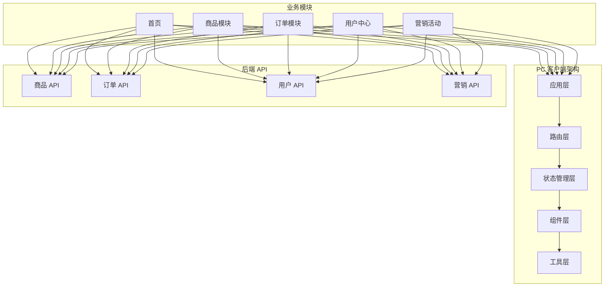

# AlkaidSYS PC 客户端设计

## 📋 文档信息

| 项目 | 内容 |
|------|------|
| **文档名称** | AlkaidSYS PC 客户端设计 |
| **文档版本** | v1.0 |
| **创建日期** | 2025-01-19 |

## 🎯 PC 客户端设计目标

1. **优化 NIUCLOUD Web 端** - 借鉴 Vben 的优秀设计
2. **现代化技术栈** - Vue 3 + Ant Design Vue + Vite
3. **极致性能** - 首屏加载 < 1.5s，路由切换 < 200ms
4. **响应式设计** - 适配 1920px、1440px、1366px 等主流分辨率
5. **SEO 优化** - SSR 支持，提升搜索引擎排名

## 🏗️ PC 客户端架构



## 📦 技术栈

### 核心依赖

```json
{
  "name": "@alkaid/web",
  "version": "1.0.0",
  "private": true,
  "type": "module",
  "scripts": {
    "dev": "vite",
    "build": "vite build",
    "build:ssr": "vite build --ssr",
    "preview": "vite preview",
    "type-check": "vue-tsc --noEmit",
    "lint": "eslint . --ext .vue,.js,.jsx,.cjs,.mjs,.ts,.tsx,.cts,.mts --fix"
  },
  "dependencies": {
    "vue": "^3.5.17",
    "vue-router": "^4.5.0",
    "pinia": "^3.0.3",
    "ant-design-vue": "^4.2.6",
    "@ant-design/icons-vue": "^7.0.1",
    "axios": "^1.7.9",
    "@vueuse/core": "^11.4.0",
    "dayjs": "^1.11.13",
    "lodash-es": "^4.17.21",
    "swiper": "^11.1.15",
    "vue3-lazyload": "^0.3.8"
  },
  "devDependencies": {
    "@vitejs/plugin-vue": "^5.2.1",
    "@vitejs/plugin-vue-jsx": "^4.1.1",
    "typescript": "^5.8.3",
    "vite": "^7.1.2",
    "vite-plugin-compression": "^0.5.1",
    "vite-plugin-imagemin": "^0.6.1",
    "vue-tsc": "^2.2.0",
    "sass": "^1.83.4",
    "autoprefixer": "^10.4.20",
    "postcss": "^8.4.49"
  }
}
```

## 🔧 项目结构

```
apps/web/
├── src/
│   ├── api/                    # API 接口
│   │   ├── product.ts         # 商品接口
│   │   ├── order.ts           # 订单接口
│   │   ├── user.ts            # 用户接口
│   │   └── marketing.ts       # 营销接口
│   ├── assets/                # 静态资源
│   │   ├── images/
│   │   ├── styles/
│   │   │   ├── variables.scss # 变量
│   │   │   ├── mixins.scss    # 混入
│   │   │   └── global.scss    # 全局样式
│   │   └── fonts/
│   ├── components/            # 通用组件
│   │   ├── Header/            # 头部
│   │   ├── Footer/            # 底部
│   │   ├── ProductCard/       # 商品卡片
│   │   ├── Pagination/        # 分页
│   │   └── ImageLazy/         # 图片懒加载
│   ├── composables/           # 组合式函数
│   │   ├── useAuth.ts         # 认证
│   │   ├── useCart.ts         # 购物车
│   │   └── useProduct.ts      # 商品
│   ├── layouts/               # 布局组件
│   │   ├── default.vue        # 默认布局
│   │   └── blank.vue          # 空白布局
│   ├── router/                # 路由配置
│   │   ├── index.ts
│   │   └── routes.ts
│   ├── store/                 # 状态管理
│   │   ├── modules/
│   │   │   ├── auth.ts        # 认证状态
│   │   │   ├── cart.ts        # 购物车状态
│   │   │   ├── product.ts     # 商品状态
│   │   │   └── site.ts        # 站点状态
│   │   └── index.ts
│   ├── utils/                 # 工具函数
│   │   ├── request.ts         # 请求封装
│   │   ├── storage.ts         # 存储封装
│   │   └── format.ts          # 格式化工具
│   ├── views/                 # 页面
│   │   ├── home/              # 首页
│   │   ├── product/           # 商品
│   │   │   ├── list.vue       # 商品列表
│   │   │   └── detail.vue     # 商品详情
│   │   ├── cart/              # 购物车
│   │   ├── order/             # 订单
│   │   │   ├── list.vue       # 订单列表
│   │   │   └── detail.vue     # 订单详情
│   │   ├── user/              # 用户中心
│   │   │   ├── profile.vue    # 个人资料
│   │   │   └── address.vue    # 收货地址
│   │   └── marketing/         # 营销活动
│   ├── App.vue
│   └── main.ts
├── public/
├── index.html
├── vite.config.ts
├── tsconfig.json
└── package.json
```

## 🎨 布局设计

### 1. 默认布局

```vue
<!-- /apps/web/src/layouts/default.vue -->

<template>
  <div class="layout-default">
    <!-- 头部 -->
    <Header />
    
    <!-- 主体内容 -->
    <main class="layout-main">
      <router-view v-slot="{ Component }">
        <transition name="fade-slide" mode="out-in">
          <component :is="Component" />
        </transition>
      </router-view>
    </main>
    
    <!-- 底部 -->
    <Footer />
    
    <!-- 返回顶部 -->
    <el-backtop :right="40" :bottom="40" />
  </div>
</template>

<script setup lang="ts">
import Header from '@/components/Header/index.vue';
import Footer from '@/components/Footer/index.vue';
</script>

<style scoped lang="scss">
.layout-default {
  min-height: 100vh;
  display: flex;
  flex-direction: column;
  
  .layout-main {
    flex: 1;
    padding: 20px 0;
    background-color: #f5f5f5;
  }
}

.fade-slide-enter-active,
.fade-slide-leave-active {
  transition: all 0.3s ease;
}

.fade-slide-enter-from {
  opacity: 0;
  transform: translateX(-20px);
}

.fade-slide-leave-to {
  opacity: 0;
  transform: translateX(20px);
}
</style>
```

### 2. 头部组件

```vue
<!-- /apps/web/src/components/Header/index.vue -->

<template>
  <header class="header">
    <div class="header-top">
      <div class="container">
        <div class="header-top-left">
          <span>欢迎来到 AlkaidSYS 商城</span>
        </div>
        <div class="header-top-right">
          <template v-if="isLoggedIn">
            <el-dropdown @command="handleUserCommand">
              <span class="user-info">
                <el-avatar :size="24" :src="userInfo?.avatar" />
                <span class="username">{{ userInfo?.nickname }}</span>
                <el-icon><ArrowDown /></el-icon>
              </span>
              <template #dropdown>
                <el-dropdown-menu>
                  <el-dropdown-item command="profile">个人中心</el-dropdown-item>
                  <el-dropdown-item command="orders">我的订单</el-dropdown-item>
                  <el-dropdown-item divided command="logout">退出登录</el-dropdown-item>
                </el-dropdown-menu>
              </template>
            </el-dropdown>
          </template>
          <template v-else>
            <a href="/login">登录</a>
            <span class="divider">|</span>
            <a href="/register">注册</a>
          </template>
        </div>
      </div>
    </div>
    
    <div class="header-main">
      <div class="container">
        <div class="header-logo">
          <router-link to="/">
            
          </router-link>
        </div>
        
        <div class="header-search">
          <el-input
            v-model="searchKeyword"
            placeholder="搜索商品"
            @keyup.enter="handleSearch"
          >
            <template #append>
              <el-button :icon="Search" @click="handleSearch" />
            </template>
          </el-input>
        </div>
        
        <div class="header-cart">
          <router-link to="/cart" class="cart-link">
            <el-badge :value="cartCount" :max="99">
              <el-icon :size="24"><ShoppingCart /></el-icon>
            </el-badge>
            <span>购物车</span>
          </router-link>
        </div>
      </div>
    </div>
    
    <div class="header-nav">
      <div class="container">
        <nav class="nav-menu">
          <router-link
            v-for="item in navMenus"
            :key="item.path"
            :to="item.path"
            class="nav-item"
          >
            {{ item.name }}
          </router-link>
        </nav>
      </div>
    </div>
  </header>
</template>

<script setup lang="ts">
import { ref, computed } from 'vue';
import { useRouter } from 'vue-router';
import { ArrowDown, Search, ShoppingCart } from '@element-plus/icons-vue';
import { useAuthStore } from '@/store/modules/auth';
import { useCartStore } from '@/store/modules/cart';

const router = useRouter();
const authStore = useAuthStore();
const cartStore = useCartStore();

const searchKeyword = ref('');

const isLoggedIn = computed(() => authStore.isLoggedIn);
const userInfo = computed(() => authStore.user);
const cartCount = computed(() => cartStore.totalCount);

const navMenus = [
  { name: '首页', path: '/' },
  { name: '全部商品', path: '/products' },
  { name: '新品上市', path: '/products?type=new' },
  { name: '热销商品', path: '/products?type=hot' },
  { name: '限时优惠', path: '/promotions' },
];

function handleSearch() {
  if (searchKeyword.value.trim()) {
    router.push({
      path: '/products',
      query: { keyword: searchKeyword.value },
    });
  }
}

function handleUserCommand(command: string) {
  switch (command) {
    case 'profile':
      router.push('/user/profile');
      break;
    case 'orders':
      router.push('/user/orders');
      break;
    case 'logout':
      authStore.logout();
      break;
  }
}
</script>

<style scoped lang="scss">
.header {
  background-color: #fff;
  box-shadow: 0 2px 8px rgba(0, 0, 0, 0.08);
  
  .container {
    max-width: 1200px;
    margin: 0 auto;
    padding: 0 20px;
  }
  
  .header-top {
    height: 40px;
    line-height: 40px;
    background-color: #f5f5f5;
    font-size: 12px;
    
    .container {
      display: flex;
      justify-content: space-between;
    }
    
    .header-top-right {
      a {
        color: #666;
        text-decoration: none;
        
        &:hover {
          color: #409eff;
        }
      }
      
      .divider {
        margin: 0 8px;
        color: #ddd;
      }
      
      .user-info {
        display: inline-flex;
        align-items: center;
        gap: 8px;
        cursor: pointer;
        
        .username {
          color: #666;
        }
        
        &:hover .username {
          color: #409eff;
        }
      }
    }
  }
  
  .header-main {
    height: 80px;
    
    .container {
      display: flex;
      align-items: center;
      gap: 40px;
      height: 100%;
    }
    
    .header-logo {
      img {
        height: 40px;
      }
    }
    
    .header-search {
      flex: 1;
      
      :deep(.el-input-group) {
        width: 100%;
      }
    }
    
    .header-cart {
      .cart-link {
        display: flex;
        align-items: center;
        gap: 8px;
        color: #333;
        text-decoration: none;
        
        &:hover {
          color: #409eff;
        }
      }
    }
  }
  
  .header-nav {
    height: 50px;
    background-color: #409eff;
    
    .nav-menu {
      display: flex;
      height: 100%;
      
      .nav-item {
        display: flex;
        align-items: center;
        padding: 0 20px;
        color: #fff;
        text-decoration: none;
        transition: background-color 0.3s;
        
        &:hover,
        &.router-link-active {
          background-color: rgba(0, 0, 0, 0.1);
        }
      }
    }
  }
}
</style>
```

## 🛍️ 商品模块

### 1. 商品列表页

```vue
<!-- /apps/web/src/views/product/list.vue -->

<template>
  <div class="product-list">
    <div class="container">
      <div class="list-layout">
        <!-- 侧边栏筛选 -->
        <aside class="list-sidebar">
          <div class="filter-section">
            <h3>分类</h3>
            <ul class="category-list">
              <li
                v-for="category in categories"
                :key="category.id"
                :class="{ active: selectedCategory === category.id }"
                @click="handleCategoryChange(category.id)"
              >
                {{ category.name }}
              </li>
            </ul>
          </div>
          
          <div class="filter-section">
            <h3>价格</h3>
            <el-slider
              v-model="priceRange"
              range
              :min="0"
              :max="10000"
              :step="100"
              @change="handlePriceChange"
            />
            <div class="price-range-text">
              ¥{{ priceRange[0] }} - ¥{{ priceRange[1] }}
            </div>
          </div>
        </aside>
        
        <!-- 商品列表 -->
        <main class="list-main">
          <!-- 排序栏 -->
          <div class="list-toolbar">
            <div class="toolbar-left">
              共 <span class="highlight">{{ total }}</span> 件商品
            </div>
            <div class="toolbar-right">
              <el-radio-group v-model="sortBy" @change="handleSortChange">
                <el-radio-button value="default">默认</el-radio-button>
                <el-radio-button value="sales">销量</el-radio-button>
                <el-radio-button value="price_asc">价格升序</el-radio-button>
                <el-radio-button value="price_desc">价格降序</el-radio-button>
              </el-radio-group>
            </div>
          </div>
          
          <!-- 商品网格 -->
          <div v-loading="loading" class="product-grid">
            <ProductCard
              v-for="product in products"
              :key="product.id"
              :product="product"
            />
          </div>
          
          <!-- 分页 -->
          <div class="list-pagination">
            <el-pagination
              v-model:current-page="currentPage"
              v-model:page-size="pageSize"
              :total="total"
              :page-sizes="[20, 40, 60, 80]"
              layout="total, sizes, prev, pager, next, jumper"
              @current-change="handlePageChange"
              @size-change="handleSizeChange"
            />
          </div>
        </main>
      </div>
    </div>
  </div>
</template>

<script setup lang="ts">
import { ref, reactive, onMounted, watch } from 'vue';
import { useRoute, useRouter } from 'vue-router';
import { getProductList, getCategoryList } from '@/api/product';
import ProductCard from '@/components/ProductCard/index.vue';

const route = useRoute();
const router = useRouter();

const loading = ref(false);
const products = ref([]);
const categories = ref([]);
const total = ref(0);
const currentPage = ref(1);
const pageSize = ref(20);
const selectedCategory = ref(0);
const priceRange = ref([0, 10000]);
const sortBy = ref('default');

onMounted(() => {
  loadCategories();
  loadProducts();
});

watch(() => route.query, () => {
  loadProducts();
});

async function loadCategories() {
  try {
    categories.value = await getCategoryList();
  } catch (error) {
    console.error('Load categories failed:', error);
  }
}

async function loadProducts() {
  loading.value = true;
  try {
    const result = await getProductList({
      page: currentPage.value,
      page_size: pageSize.value,
      category_id: selectedCategory.value || undefined,
      min_price: priceRange.value[0],
      max_price: priceRange.value[1],
      sort_by: sortBy.value,
      keyword: route.query.keyword as string,
    });
    
    products.value = result.list;
    total.value = result.total;
  } catch (error) {
    console.error('Load products failed:', error);
  } finally {
    loading.value = false;
  }
}

function handleCategoryChange(categoryId: number) {
  selectedCategory.value = categoryId;
  currentPage.value = 1;
  loadProducts();
}

function handlePriceChange() {
  currentPage.value = 1;
  loadProducts();
}

function handleSortChange() {
  currentPage.value = 1;
  loadProducts();
}

function handlePageChange() {
  loadProducts();
  window.scrollTo({ top: 0, behavior: 'smooth' });
}

function handleSizeChange() {
  currentPage.value = 1;
  loadProducts();
}
</script>

<style scoped lang="scss">
.product-list {
  .container {
    max-width: 1200px;
    margin: 0 auto;
    padding: 0 20px;
  }
  
  .list-layout {
    display: flex;
    gap: 20px;
  }
  
  .list-sidebar {
    width: 200px;
    flex-shrink: 0;
    
    .filter-section {
      margin-bottom: 30px;
      
      h3 {
        margin-bottom: 15px;
        font-size: 16px;
        font-weight: 600;
      }
      
      .category-list {
        list-style: none;
        padding: 0;
        margin: 0;
        
        li {
          padding: 8px 12px;
          cursor: pointer;
          border-radius: 4px;
          transition: all 0.3s;
          
          &:hover {
            background-color: #f5f5f5;
          }
          
          &.active {
            background-color: #409eff;
            color: #fff;
          }
        }
      }
      
      .price-range-text {
        margin-top: 10px;
        text-align: center;
        color: #666;
        font-size: 14px;
      }
    }
  }
  
  .list-main {
    flex: 1;
    
    .list-toolbar {
      display: flex;
      justify-content: space-between;
      align-items: center;
      margin-bottom: 20px;
      padding: 15px;
      background-color: #fff;
      border-radius: 4px;
      
      .highlight {
        color: #409eff;
        font-weight: 600;
      }
    }
    
    .product-grid {
      display: grid;
      grid-template-columns: repeat(auto-fill, minmax(220px, 1fr));
      gap: 20px;
      margin-bottom: 30px;
    }
    
    .list-pagination {
      display: flex;
      justify-content: center;
      padding: 20px 0;
    }
  }
}
</style>
```

## 🆚 与 NIUCLOUD Web 端对比

| 特性 | AlkaidSYS Web | NIUCLOUD Web | 优势 |
|------|--------------|--------------|------|
| **构建工具** | Vite 7 | Webpack | ✅ 更快 |
| **UI 框架** | Ant Design Vue 4.x | Element Plus 2.x | ✅ 一致性更好 |
| **状态管理** | Pinia 3.0 | Vuex | ✅ 更简洁 |
| **布局设计** | 借鉴 Vben | 传统布局 | ✅ 更现代 |
| **性能优化** | 多种优化 | 基础优化 | ✅ 更快 |

---

**最后更新**: 2025-01-19  
**文档版本**: v1.0  
**维护者**: AlkaidSYS 架构团队

