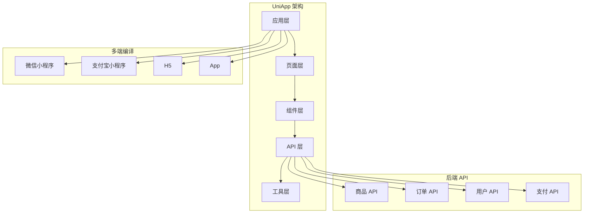

# AlkaidSYS 移动端设计

## 📋 文档信息

| 项目 | 内容 |
|------|------|
| **文档名称** | AlkaidSYS 移动端设计 |
| **文档版本** | v1.0 |
| **创建日期** | 2025-01-19 |

## 🎯 移动端设计目标

1. **优化 NIUCLOUD UniApp 端** - 借鉴 Vben 的优秀设计理念
2. **跨平台支持** - 一套代码，支持微信小程序、支付宝小程序、H5、App
3. **极致性能** - 首屏加载 < 1s，页面切换 < 200ms
4. **原生体验** - 接近原生 App 的流畅体验
5. **离线支持** - 支持离线缓存，弱网环境下也能使用

## 🏗️ 移动端架构



## 📦 技术栈

### 核心依赖

```json
{
  "name": "@alkaid/mobile",
  "version": "1.0.0",
  "private": true,
  "scripts": {
    "dev:mp-weixin": "uni -p mp-weixin",
    "dev:mp-alipay": "uni -p mp-alipay",
    "dev:h5": "uni",
    "dev:app": "uni -p app",
    "build:mp-weixin": "uni build -p mp-weixin",
    "build:mp-alipay": "uni build -p mp-alipay",
    "build:h5": "uni build",
    "build:app": "uni build -p app",
    "type-check": "vue-tsc --noEmit"
  },
  "dependencies": {
    "@dcloudio/uni-app": "^3.0.0-4020920240930001",
    "@dcloudio/uni-app-plus": "^3.0.0-4020920240930001",
    "@dcloudio/uni-components": "^3.0.0-4020920240930001",
    "@dcloudio/uni-h5": "^3.0.0-4020920240930001",
    "@dcloudio/uni-mp-alipay": "^3.0.0-4020920240930001",
    "@dcloudio/uni-mp-weixin": "^3.0.0-4020920240930001",
    "vue": "^3.5.17",
    "pinia": "^3.0.3",
    "pinia-plugin-persistedstate": "^4.1.3"
  },
  "devDependencies": {
    "@dcloudio/types": "^3.4.13",
    "@dcloudio/uni-automator": "^3.0.0-4020920240930001",
    "@dcloudio/uni-cli-shared": "^3.0.0-4020920240930001",
    "@dcloudio/vite-plugin-uni": "^3.0.0-4020920240930001",
    "typescript": "^5.8.3",
    "vite": "^5.4.11",
    "vue-tsc": "^2.2.0",
    "sass": "^1.83.4"
  }
}
```

## 🔧 项目结构

```
apps/mobile/
├── src/
│   ├── api/                    # API 接口
│   │   ├── product.ts         # 商品接口
│   │   ├── order.ts           # 订单接口
│   │   ├── user.ts            # 用户接口
│   │   └── payment.ts         # 支付接口
│   ├── components/            # 通用组件
│   │   ├── ProductCard/       # 商品卡片
│   │   ├── TabBar/            # 底部导航
│   │   ├── NavBar/            # 导航栏
│   │   └── LoadMore/          # 加载更多
│   ├── composables/           # 组合式函数
│   │   ├── useAuth.ts         # 认证
│   │   ├── useCart.ts         # 购物车
│   │   ├── useLocation.ts     # 定位
│   │   └── useShare.ts        # 分享
│   ├── pages/                 # 页面
│   │   ├── index/             # 首页
│   │   │   └── index.vue
│   │   ├── category/          # 分类
│   │   │   └── index.vue
│   │   ├── cart/              # 购物车
│   │   │   └── index.vue
│   │   ├── user/              # 我的
│   │   │   └── index.vue
│   │   ├── product/           # 商品
│   │   │   ├── list.vue       # 商品列表
│   │   │   └── detail.vue     # 商品详情
│   │   ├── order/             # 订单
│   │   │   ├── list.vue       # 订单列表
│   │   │   ├── detail.vue     # 订单详情
│   │   │   └── confirm.vue    # 确认订单
│   │   └── payment/           # 支付
│   │       ├── index.vue      # 支付页面
│   │       └── result.vue     # 支付结果
│   ├── static/                # 静态资源
│   │   └── images/
│   ├── store/                 # 状态管理
│   │   ├── modules/
│   │   │   ├── auth.ts        # 认证状态
│   │   │   ├── cart.ts        # 购物车状态
│   │   │   └── user.ts        # 用户状态
│   │   └── index.ts
│   ├── styles/                # 样式
│   │   ├── variables.scss     # 变量
│   │   ├── mixins.scss        # 混入
│   │   └── common.scss        # 通用样式
│   ├── utils/                 # 工具函数
│   │   ├── request.ts         # 请求封装
│   │   ├── storage.ts         # 存储封装
│   │   ├── auth.ts            # 认证工具
│   │   └── format.ts          # 格式化工具
│   ├── App.vue
│   ├── main.ts
│   ├── manifest.json          # 应用配置
│   └── pages.json             # 页面配置
├── vite.config.ts
├── tsconfig.json
└── package.json
```

## 📱 页面配置

### pages.json

```json
{
  "pages": [
    {
      "path": "pages/index/index",
      "style": {
        "navigationBarTitleText": "首页",
        "enablePullDownRefresh": true
      }
    },
    {
      "path": "pages/category/index",
      "style": {
        "navigationBarTitleText": "分类"
      }
    },
    {
      "path": "pages/cart/index",
      "style": {
        "navigationBarTitleText": "购物车"
      }
    },
    {
      "path": "pages/user/index",
      "style": {
        "navigationBarTitleText": "我的"
      }
    },
    {
      "path": "pages/product/list",
      "style": {
        "navigationBarTitleText": "商品列表",
        "enablePullDownRefresh": true
      }
    },
    {
      "path": "pages/product/detail",
      "style": {
        "navigationBarTitleText": "商品详情"
      }
    },
    {
      "path": "pages/order/list",
      "style": {
        "navigationBarTitleText": "我的订单",
        "enablePullDownRefresh": true
      }
    },
    {
      "path": "pages/order/detail",
      "style": {
        "navigationBarTitleText": "订单详情"
      }
    },
    {
      "path": "pages/order/confirm",
      "style": {
        "navigationBarTitleText": "确认订单"
      }
    },
    {
      "path": "pages/payment/index",
      "style": {
        "navigationBarTitleText": "收银台"
      }
    },
    {
      "path": "pages/payment/result",
      "style": {
        "navigationBarTitleText": "支付结果"
      }
    }
  ],
  "globalStyle": {
    "navigationBarTextStyle": "black",
    "navigationBarTitleText": "AlkaidSYS",
    "navigationBarBackgroundColor": "#FFFFFF",
    "backgroundColor": "#F5F5F5"
  },
  "tabBar": {
    "color": "#999999",
    "selectedColor": "#409EFF",
    "backgroundColor": "#FFFFFF",
    "borderStyle": "black",
    "list": [
      {
        "pagePath": "pages/index/index",
        "text": "首页",
        "iconPath": "static/images/tabbar/home.png",
        "selectedIconPath": "static/images/tabbar/home-active.png"
      },
      {
        "pagePath": "pages/category/index",
        "text": "分类",
        "iconPath": "static/images/tabbar/category.png",
        "selectedIconPath": "static/images/tabbar/category-active.png"
      },
      {
        "pagePath": "pages/cart/index",
        "text": "购物车",
        "iconPath": "static/images/tabbar/cart.png",
        "selectedIconPath": "static/images/tabbar/cart-active.png"
      },
      {
        "pagePath": "pages/user/index",
        "text": "我的",
        "iconPath": "static/images/tabbar/user.png",
        "selectedIconPath": "static/images/tabbar/user-active.png"
      }
    ]
  },
  "condition": {
    "current": 0,
    "list": [
      {
        "name": "商品详情",
        "path": "pages/product/detail",
        "query": "id=1"
      }
    ]
  }
}
```

## 🔐 请求封装

### request.ts

```typescript
// /apps/mobile/src/utils/request.ts

import { useAuthStore } from '@/store/modules/auth';

interface RequestConfig {
  url: string;
  method?: 'GET' | 'POST' | 'PUT' | 'DELETE';
  data?: any;
  header?: any;
  showLoading?: boolean;
  loadingText?: string;
}

interface Response<T = any> {
  code: number;
  message: string;
  data: T;
}

const BASE_URL = import.meta.env.VITE_API_BASE_URL || 'https://api.alkaid.com';

/**
 * 请求封装
 */
export function request<T = any>(config: RequestConfig): Promise<T> {
  const {
    url,
    method = 'GET',
    data,
    header = {},
    showLoading = false,
    loadingText = '加载中...',
  } = config;
  
  // 显示加载提示
  if (showLoading) {
    uni.showLoading({
      title: loadingText,
      mask: true,
    });
  }
  
  return new Promise((resolve, reject) => {
    const authStore = useAuthStore();
    
    // 添加 Token
    const token = authStore.token;
    if (token) {
      header.Authorization = `Bearer ${token}`;
    }
    
    // 添加租户和站点信息（优先 ID，同时传 Code 便于审计/灰度）
    const tenantId = uni.getStorageSync('tenant_id');
    const tenantCode = uni.getStorageSync('tenant_code');
    const siteId = uni.getStorageSync('site_id');
    const siteCode = uni.getStorageSync('site_code');
    if (tenantId) {
      header['X-Tenant-ID'] = tenantId;
    }
    if (tenantCode) {
      header['X-Tenant-Code'] = tenantCode;
    }
    if (siteId) {
      header['X-Site-ID'] = siteId;
    }
    if (siteCode) {
      header['X-Site-Code'] = siteCode;
    }
    
    uni.request({
      url: BASE_URL + url,
      method,
      data,
      header,
      success: (res: any) => {
        if (showLoading) {
          uni.hideLoading();
        }
        
        const response = res.data as Response<T>;
        
        if (response.code === 200) {
          resolve(response.data);
        } else if (response.code === 401) {
          // Token 过期，跳转登录
          authStore.logout();
          uni.showToast({
            title: '登录已过期，请重新登录',
            icon: 'none',
          });
          uni.navigateTo({
            url: '/pages/auth/login',
          });
          reject(new Error(response.message));
        } else {
          uni.showToast({
            title: response.message || '请求失败',
            icon: 'none',
          });
          reject(new Error(response.message));
        }
      },
      fail: (err) => {
        if (showLoading) {
          uni.hideLoading();
        }
        
        uni.showToast({
          title: '网络请求失败',
          icon: 'none',
        });
        reject(err);
      },
    });
  });
}

/**
 * GET 请求
 */
export function get<T = any>(url: string, data?: any, config?: Partial<RequestConfig>): Promise<T> {
  return request<T>({
    url,
    method: 'GET',
    data,
    ...config,
  });
}

/**
 * POST 请求
 */
export function post<T = any>(url: string, data?: any, config?: Partial<RequestConfig>): Promise<T> {
  return request<T>({
    url,
    method: 'POST',
    data,
    ...config,
  });
}

/**
 * PUT 请求
 */
export function put<T = any>(url: string, data?: any, config?: Partial<RequestConfig>): Promise<T> {
  return request<T>({
    url,
    method: 'PUT',
    data,
    ...config,
  });
}

/**
 * DELETE 请求
 */
export function del<T = any>(url: string, data?: any, config?: Partial<RequestConfig>): Promise<T> {
  return request<T>({
    url,
    method: 'DELETE',
    data,
    ...config,
  });
}
```

## 🛍️ 首页设计

### index.vue

```vue
<!-- /apps/mobile/src/pages/index/index.vue -->

<template>
  <view class="home-page">
    <!-- 搜索栏 -->
    <view class="search-bar">
      <view class="search-input" @tap="handleSearch">
        <uni-icons type="search" size="20" color="#999" />
        <text class="search-placeholder">搜索商品</text>
      </view>
    </view>
    
    <!-- 轮播图 -->
    <swiper class="banner-swiper" :indicator-dots="true" :autoplay="true" :interval="3000" :duration="500">
      <swiper-item v-for="(banner, index) in banners" :key="index">
        <image :src="banner.image" mode="aspectFill" @tap="handleBannerClick(banner)" />
      </swiper-item>
    </swiper>
    
    <!-- 分类导航 -->
    <view class="category-nav">
      <view
        v-for="category in categories"
        :key="category.id"
        class="category-item"
        @tap="handleCategoryClick(category)"
      >
        <image :src="category.icon" mode="aspectFit" />
        <text>{{ category.name }}</text>
      </view>
    </view>
    
    <!-- 秒杀活动 -->
    <view class="seckill-section">
      <view class="section-header">
        <view class="header-left">
          <text class="title">限时秒杀</text>
          <view class="countdown">
            <text>{{ countdown.hours }}</text>
            <text class="colon">:</text>
            <text>{{ countdown.minutes }}</text>
            <text class="colon">:</text>
            <text>{{ countdown.seconds }}</text>
          </view>
        </view>
        <view class="header-right" @tap="handleMoreSeckill">
          <text>更多</text>
          <uni-icons type="right" size="16" color="#999" />
        </view>
      </view>
      <scroll-view class="seckill-list" scroll-x>
        <view
          v-for="product in seckillProducts"
          :key="product.id"
          class="seckill-item"
          @tap="handleProductClick(product)"
        >
          <image :src="product.image" mode="aspectFill" />
          <view class="price">
            <text class="current">¥{{ product.seckill_price }}</text>
            <text class="original">¥{{ product.price }}</text>
          </view>
        </view>
      </scroll-view>
    </view>
    
    <!-- 推荐商品 -->
    <view class="recommend-section">
      <view class="section-header">
        <text class="title">为你推荐</text>
      </view>
      <view class="product-grid">
        <ProductCard
          v-for="product in recommendProducts"
          :key="product.id"
          :product="product"
          @click="handleProductClick(product)"
        />
      </view>
      
      <!-- 加载更多 -->
      <LoadMore :status="loadMoreStatus" @loadmore="loadMoreProducts" />
    </view>
  </view>
</template>

<script setup lang="ts">
import { ref, reactive, onMounted, onUnmounted } from 'vue';
import { getBannerList, getCategoryList, getSeckillProducts, getRecommendProducts } from '@/api/product';
import ProductCard from '@/components/ProductCard/index.vue';
import LoadMore from '@/components/LoadMore/index.vue';

const banners = ref([]);
const categories = ref([]);
const seckillProducts = ref([]);
const recommendProducts = ref([]);
const loadMoreStatus = ref<'more' | 'loading' | 'nomore'>('more');
const page = ref(1);
const pageSize = 20;

const countdown = reactive({
  hours: '00',
  minutes: '00',
  seconds: '00',
});

let countdownTimer: number | null = null;

onMounted(() => {
  loadData();
  startCountdown();
});

onUnmounted(() => {
  if (countdownTimer) {
    clearInterval(countdownTimer);
  }
});

// 下拉刷新
onPullDownRefresh(() => {
  page.value = 1;
  loadData().then(() => {
    uni.stopPullDownRefresh();
  });
});

async function loadData() {
  try {
    const [bannersData, categoriesData, seckillData, recommendData] = await Promise.all([
      getBannerList(),
      getCategoryList({ limit: 10 }),
      getSeckillProducts({ limit: 10 }),
      getRecommendProducts({ page: page.value, page_size: pageSize }),
    ]);
    
    banners.value = bannersData;
    categories.value = categoriesData;
    seckillProducts.value = seckillData;
    
    if (page.value === 1) {
      recommendProducts.value = recommendData.list;
    } else {
      recommendProducts.value.push(...recommendData.list);
    }
    
    loadMoreStatus.value = recommendData.list.length < pageSize ? 'nomore' : 'more';
  } catch (error) {
    console.error('Load data failed:', error);
  }
}

function startCountdown() {
  // 计算到下一个整点的倒计时
  const updateCountdown = () => {
    const now = new Date();
    const nextHour = new Date(now);
    nextHour.setHours(now.getHours() + 1, 0, 0, 0);
    
    const diff = nextHour.getTime() - now.getTime();
    const hours = Math.floor(diff / 1000 / 60 / 60);
    const minutes = Math.floor((diff / 1000 / 60) % 60);
    const seconds = Math.floor((diff / 1000) % 60);
    
    countdown.hours = String(hours).padStart(2, '0');
    countdown.minutes = String(minutes).padStart(2, '0');
    countdown.seconds = String(seconds).padStart(2, '0');
  };
  
  updateCountdown();
  countdownTimer = setInterval(updateCountdown, 1000);
}

function handleSearch() {
  uni.navigateTo({
    url: '/pages/search/index',
  });
}

function handleBannerClick(banner: any) {
  if (banner.link) {
    uni.navigateTo({
      url: banner.link,
    });
  }
}

function handleCategoryClick(category: any) {
  uni.navigateTo({
    url: `/pages/product/list?category_id=${category.id}`,
  });
}

function handleMoreSeckill() {
  uni.navigateTo({
    url: '/pages/seckill/index',
  });
}

function handleProductClick(product: any) {
  uni.navigateTo({
    url: `/pages/product/detail?id=${product.id}`,
  });
}

async function loadMoreProducts() {
  if (loadMoreStatus.value !== 'more') {
    return;
  }
  
  loadMoreStatus.value = 'loading';
  page.value++;
  
  try {
    const result = await getRecommendProducts({ page: page.value, page_size: pageSize });
    recommendProducts.value.push(...result.list);
    loadMoreStatus.value = result.list.length < pageSize ? 'nomore' : 'more';
  } catch (error) {
    loadMoreStatus.value = 'more';
    page.value--;
  }
}
</script>

<style scoped lang="scss">
.home-page {
  background-color: #f5f5f5;
  
  .search-bar {
    padding: 20rpx;
    background-color: #fff;
    
    .search-input {
      display: flex;
      align-items: center;
      gap: 10rpx;
      padding: 16rpx 24rpx;
      background-color: #f5f5f5;
      border-radius: 40rpx;
      
      .search-placeholder {
        color: #999;
        font-size: 28rpx;
      }
    }
  }
  
  .banner-swiper {
    height: 360rpx;
    
    image {
      width: 100%;
      height: 100%;
    }
  }
  
  .category-nav {
    display: flex;
    flex-wrap: wrap;
    padding: 20rpx;
    background-color: #fff;
    margin-top: 20rpx;
    
    .category-item {
      display: flex;
      flex-direction: column;
      align-items: center;
      width: 20%;
      margin-bottom: 20rpx;
      
      image {
        width: 80rpx;
        height: 80rpx;
        margin-bottom: 10rpx;
      }
      
      text {
        font-size: 24rpx;
        color: #333;
      }
    }
  }
  
  .seckill-section {
    margin-top: 20rpx;
    padding: 20rpx;
    background-color: #fff;
    
    .section-header {
      display: flex;
      justify-content: space-between;
      align-items: center;
      margin-bottom: 20rpx;
      
      .header-left {
        display: flex;
        align-items: center;
        gap: 20rpx;
        
        .title {
          font-size: 32rpx;
          font-weight: 600;
          color: #333;
        }
        
        .countdown {
          display: flex;
          align-items: center;
          gap: 4rpx;
          
          text {
            display: inline-block;
            padding: 4rpx 8rpx;
            background-color: #ff4d4f;
            color: #fff;
            font-size: 24rpx;
            border-radius: 4rpx;
          }
          
          .colon {
            background-color: transparent;
            color: #ff4d4f;
          }
        }
      }
      
      .header-right {
        display: flex;
        align-items: center;
        gap: 4rpx;
        color: #999;
        font-size: 28rpx;
      }
    }
    
    .seckill-list {
      white-space: nowrap;
      
      .seckill-item {
        display: inline-block;
        width: 200rpx;
        margin-right: 20rpx;
        
        image {
          width: 200rpx;
          height: 200rpx;
          border-radius: 8rpx;
        }
        
        .price {
          margin-top: 10rpx;
          
          .current {
            color: #ff4d4f;
            font-size: 32rpx;
            font-weight: 600;
          }
          
          .original {
            margin-left: 10rpx;
            color: #999;
            font-size: 24rpx;
            text-decoration: line-through;
          }
        }
      }
    }
  }
  
  .recommend-section {
    margin-top: 20rpx;
    padding: 20rpx;
    background-color: #fff;
    
    .section-header {
      margin-bottom: 20rpx;
      
      .title {
        font-size: 32rpx;
        font-weight: 600;
        color: #333;
      }
    }
    
    .product-grid {
      display: flex;
      flex-wrap: wrap;
      gap: 20rpx;
    }
  }
}
</style>
```

## 🆚 与 NIUCLOUD UniApp 端对比

| 特性 | AlkaidSYS Mobile | NIUCLOUD UniApp | 优势 |
|------|-----------------|-----------------|------|
| **TypeScript** | 完整支持 | 部分支持 | ✅ 更安全 |
| **状态管理** | Pinia 3.0 | Vuex | ✅ 更简洁 |
| **请求封装** | 完整封装 | 基础封装 | ✅ 更强大 |
| **组件设计** | 借鉴 Vben | 传统设计 | ✅ 更现代 |
| **性能优化** | 多种优化 | 基础优化 | ✅ 更快 |

---

**最后更新**: 2025-01-19  
**文档版本**: v1.0  
**维护者**: AlkaidSYS 架构团队

