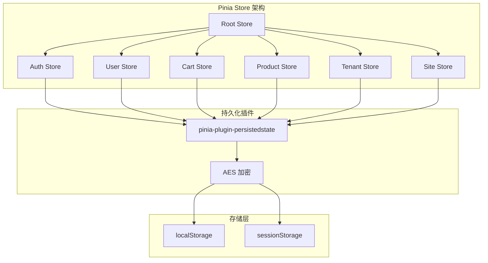

# AlkaidSYS 前端状态管理

## 📋 文档信息

| 项目 | 内容 |
|------|------|
| **文档名称** | AlkaidSYS 前端状态管理 |
| **文档版本** | v1.0 |
| **创建日期** | 2025-01-19 |

## 🎯 状态管理设计目标

1. **统一状态管理** - Admin、Web、Mobile 三端使用统一的状态管理方案
2. **类型安全** - 完整的 TypeScript 类型支持
3. **持久化策略** - 仅持久化非敏感状态；Token/Refresh Token 不持久化（内存态）
4. **数据加密** - 生产环境下敏感数据 AES 加密存储
5. **模块化设计** - 按业务模块拆分 Store

## 🏗️ 状态管理架构



## 📦 核心依赖

```json
{
  "dependencies": {
    "pinia": "^3.0.3",
    "pinia-plugin-persistedstate": "^4.1.3",
    "crypto-js": "^4.2.0"
  }
}
```

## 🔧 Store 初始化

### 1. Pinia 配置

```typescript
// /apps/admin/src/store/index.ts

import { createPinia } from 'pinia';
import piniaPluginPersistedstate from 'pinia-plugin-persistedstate';
import { encryptStorage } from './plugins/encrypt';

const pinia = createPinia();

// 注册持久化插件
pinia.use(piniaPluginPersistedstate);

// 注册加密插件（仅生产环境）
if (import.meta.env.PROD) {
  pinia.use(encryptStorage);
}

export default pinia;
```

### 2. 加密插件

```typescript
// /apps/admin/src/store/plugins/encrypt.ts

import type { PiniaPluginContext } from 'pinia';
import CryptoJS from 'crypto-js';

const SECRET_KEY = import.meta.env.VITE_STORAGE_SECRET_KEY || 'alkaid-secret-key';

/**
 * 加密数据
 */
function encrypt(data: string): string {
  return CryptoJS.AES.encrypt(data, SECRET_KEY).toString();
}

/**
 * 解密数据
 */
function decrypt(data: string): string {
  const bytes = CryptoJS.AES.decrypt(data, SECRET_KEY);
  return bytes.toString(CryptoJS.enc.Utf8);
}

/**
 * 加密存储插件
 */
export function encryptStorage({ store, options }: PiniaPluginContext) {
  // 只对需要加密的 Store 进行加密
  const encryptStores = ['auth', 'user'];
  
  if (!encryptStores.includes(store.$id)) {
    return;
  }
  
  // 重写 persist 配置
  if (options.persist) {
    const persistConfig = Array.isArray(options.persist) ? options.persist : [options.persist];
    
    persistConfig.forEach((config) => {
      const originalSerializer = config.serializer || {
        serialize: JSON.stringify,
        deserialize: JSON.parse,
      };
      
      // 加密序列化
      config.serializer = {
        serialize: (value: any) => {
          const serialized = originalSerializer.serialize(value);
          return encrypt(serialized);
        },
        deserialize: (value: string) => {
          try {
            const decrypted = decrypt(value);
            return originalSerializer.deserialize(decrypted);
          } catch (error) {
            console.error('Decrypt failed:', error);
            return null;
          }
        },
      };
    });
  }
}
```

## 📊 核心 Store 模块

### 1. Auth Store（认证状态）

```typescript
// /apps/admin/src/store/modules/auth.ts

import { defineStore } from 'pinia';
import { login, getUserInfo, logout, refreshToken, type LoginParams } from '@/api/auth';
import { useAccessStore } from '@vben/stores';
import { router } from '@/router';

interface AuthState {
  user: any;
  roles: string[];
  permissions: string[];
  token: string;
  refreshToken: string;
}

export const useAuthStore = defineStore('auth', {
  state: (): AuthState => ({
    user: null,
    roles: [],
    permissions: [],
    token: '',
    refreshToken: '',
  }),
  
  getters: {
    isLoggedIn: (state) => !!state.token,
    hasRole: (state) => (role: string) => state.roles.includes(role),
    hasPermission: (state) => (permission: string) => state.permissions.includes(permission),
    hasAnyPermission: (state) => (permissions: string[]) => 
      permissions.some(p => state.permissions.includes(p)),
    hasAllPermissions: (state) => (permissions: string[]) => 
      permissions.every(p => state.permissions.includes(p)),
  },
  
  actions: {
    /**
     * 登录
     */
    async login(params: LoginParams) {
      try {
        const result = await login(params);
        
        // 保存 Token
        this.token = result.access_token;
        this.refreshToken = result.refresh_token;
        
        // 保存用户信息
        this.user = result.user;
        this.roles = result.user.roles;
        this.permissions = result.user.permissions;
        
        // 同步到 Vben 的 AccessStore
        const accessStore = useAccessStore();
        accessStore.setAccessToken(result.access_token);
        accessStore.setRefreshToken(result.refresh_token);
        accessStore.setAccessCodes(result.user.permissions);
        
        return result;
      } catch (error) {
        console.error('Login failed:', error);
        throw error;
      }
    },
    
    /**
     * 获取用户信息
     */
    async fetchUserInfo() {
      try {
        const result = await getUserInfo();
        
        this.user = result;
        this.roles = result.roles.map((r: any) => r.code);
        this.permissions = result.permissions;
        
        // 同步到 Vben
        const accessStore = useAccessStore();
        accessStore.setAccessCodes(result.permissions);
        
        return result;
      } catch (error) {
        console.error('Fetch user info failed:', error);
        throw error;
      }
    },
    
    /**
     * 刷新 Token
     */
    async refreshToken() {
      try {
        const result = await refreshToken(this.refreshToken);
        
        this.token = result.access_token;
        this.refreshToken = result.refresh_token;
        
        const accessStore = useAccessStore();
        accessStore.setAccessToken(result.access_token);
        accessStore.setRefreshToken(result.refresh_token);
        
        return result;
      } catch (error) {
        console.error('Refresh token failed:', error);
        await this.logout();
        throw error;
      }
    },
    
    /**
     * 登出
     */
    async logout() {
      try {
        await logout();
      } catch (error) {
        console.error('Logout failed:', error);
      } finally {
        this.reset();
        
        const accessStore = useAccessStore();
        accessStore.setAccessToken(null);
        accessStore.setRefreshToken(null);
        accessStore.setAccessCodes([]);
        
        router.push('/login');
      }
    },
    
    /**
     * 重置状态
     */
    reset() {
      this.user = null;
      this.roles = [];
      this.permissions = [];
      this.token = '';
      this.refreshToken = '';
    },
  },
  
  persist: {
    key: 'alkaid-auth',
    storage: localStorage,
    // 仅持久化非敏感信息，令牌仅保留在内存
    paths: ['user', 'roles', 'permissions'],
  },
});
```

### 2. Cart Store（购物车状态）

```typescript
// /apps/web/src/store/modules/cart.ts

import { defineStore } from 'pinia';
import { getCartList, addToCart, updateCartItem, removeCartItem, clearCart } from '@/api/cart';

interface CartItem {
  id: number;
  product_id: number;
  product_name: string;
  product_image: string;
  price: number;
  quantity: number;
  selected: boolean;
}

interface CartState {
  items: CartItem[];
  loading: boolean;
}

export const useCartStore = defineStore('cart', {
  state: (): CartState => ({
    items: [],
    loading: false,
  }),
  
  getters: {
    // 购物车商品数量
    totalCount: (state) => state.items.reduce((sum, item) => sum + item.quantity, 0),
    
    // 已选中商品数量
    selectedCount: (state) => state.items.filter(item => item.selected).length,
    
    // 已选中商品总价
    selectedTotal: (state) => state.items
      .filter(item => item.selected)
      .reduce((sum, item) => sum + item.price * item.quantity, 0),
    
    // 是否全选
    isAllSelected: (state) => state.items.length > 0 && state.items.every(item => item.selected),
  },
  
  actions: {
    /**
     * 获取购物车列表
     */
    async fetchCartList() {
      this.loading = true;
      try {
        const result = await getCartList();
        this.items = result;
      } catch (error) {
        console.error('Fetch cart list failed:', error);
      } finally {
        this.loading = false;
      }
    },
    
    /**
     * 添加到购物车
     */
    async addItem(productId: number, quantity: number = 1) {
      try {
        await addToCart({ product_id: productId, quantity });
        await this.fetchCartList();
      } catch (error) {
        console.error('Add to cart failed:', error);
        throw error;
      }
    },
    
    /**
     * 更新购物车商品数量
     */
    async updateQuantity(itemId: number, quantity: number) {
      try {
        await updateCartItem(itemId, { quantity });
        
        // 本地更新
        const item = this.items.find(i => i.id === itemId);
        if (item) {
          item.quantity = quantity;
        }
      } catch (error) {
        console.error('Update cart item failed:', error);
        throw error;
      }
    },
    
    /**
     * 切换商品选中状态
     */
    async toggleSelected(itemId: number) {
      const item = this.items.find(i => i.id === itemId);
      if (item) {
        item.selected = !item.selected;
        
        try {
          await updateCartItem(itemId, { selected: item.selected });
        } catch (error) {
          // 失败时回滚
          item.selected = !item.selected;
          console.error('Toggle selected failed:', error);
        }
      }
    },
    
    /**
     * 全选/取消全选
     */
    async toggleAllSelected() {
      const selected = !this.isAllSelected;
      
      this.items.forEach(item => {
        item.selected = selected;
      });
      
      try {
        await Promise.all(
          this.items.map(item => updateCartItem(item.id, { selected }))
        );
      } catch (error) {
        console.error('Toggle all selected failed:', error);
        await this.fetchCartList();
      }
    },
    
    /**
     * 删除购物车商品
     */
    async removeItem(itemId: number) {
      try {
        await removeCartItem(itemId);
        this.items = this.items.filter(item => item.id !== itemId);
      } catch (error) {
        console.error('Remove cart item failed:', error);
        throw error;
      }
    },
    
    /**
     * 清空购物车
     */
    async clear() {
      try {
        await clearCart();
        this.items = [];
      } catch (error) {
        console.error('Clear cart failed:', error);
        throw error;
      }
    },
  },
  
  persist: {
    key: 'alkaid-cart',
    storage: localStorage,
    paths: ['items'],
  },
});
```

### 3. Tenant Store（租户状态）

```typescript
// /apps/admin/src/store/modules/tenant.ts

import { defineStore } from 'pinia';
import { getTenantList, switchTenant } from '@/api/tenant';

interface Tenant {
  id: number;
  code: string;
  name: string;
  logo: string;
  status: number;
}

interface TenantState {
  currentTenantId: number;
  currentTenantCode: string;
  tenants: Tenant[];
}

export const useTenantStore = defineStore('tenant', {
  state: (): TenantState => ({
    currentTenantId: 0,
    currentTenantCode: '',
    tenants: [],
  }),
  
  getters: {
    currentTenant: (state) => state.tenants.find(t => t.id === state.currentTenantId),
  },
  
  actions: {
    /**
     * 获取租户列表
     */
    async fetchTenants() {
      try {
        const result = await getTenantList();
        this.tenants = result;
        
        // 如果没有当前租户，设置第一个为当前租户
        if (!this.currentTenantId && result.length > 0) {
          this.currentTenantId = result[0].id;
          this.currentTenantCode = result[0].code;
        }
        
        return result;
      } catch (error) {
        console.error('Fetch tenants failed:', error);
        throw error;
      }
    },
    
    /**
     * 切换租户
     */
    async switchTenant(tenantId: number) {
      try {
        await switchTenant(tenantId);
        
        const tenant = this.tenants.find(t => t.id === tenantId);
        if (tenant) {
          this.currentTenantId = tenant.id;
          this.currentTenantCode = tenant.code;
        }
      } catch (error) {
        console.error('Switch tenant failed:', error);
        throw error;
      }
    },
  },
  
  persist: {
    key: 'alkaid-tenant',
    storage: localStorage,
    paths: ['currentTenantId', 'currentTenantCode', 'tenants'],
  },
});
```

## 🔄 组合式函数

### useAuth

```typescript
// /apps/admin/src/composables/useAuth.ts

import { computed } from 'vue';
import { useAuthStore } from '@/store/modules/auth';

export function useAuth() {
  const authStore = useAuthStore();
  
  const isLoggedIn = computed(() => authStore.isLoggedIn);
  const user = computed(() => authStore.user);
  const roles = computed(() => authStore.roles);
  const permissions = computed(() => authStore.permissions);
  
  function hasRole(role: string) {
    return authStore.hasRole(role);
  }
  
  function hasPermission(permission: string) {
    return authStore.hasPermission(permission);
  }
  
  function hasAnyPermission(permissions: string[]) {
    return authStore.hasAnyPermission(permissions);
  }
  
  function hasAllPermissions(permissions: string[]) {
    return authStore.hasAllPermissions(permissions);
  }
  
  async function login(params: any) {
    return authStore.login(params);
  }
  
  async function logout() {
    return authStore.logout();
  }
  
  return {
    isLoggedIn,
    user,
    roles,
    permissions,
    hasRole,
    hasPermission,
    hasAnyPermission,
    hasAllPermissions,
    login,
    logout,
  };
}
```

### useCart

```typescript
// /apps/web/src/composables/useCart.ts

import { computed } from 'vue';
import { useCartStore } from '@/store/modules/cart';

export function useCart() {
  const cartStore = useCartStore();
  
  const items = computed(() => cartStore.items);
  const totalCount = computed(() => cartStore.totalCount);
  const selectedCount = computed(() => cartStore.selectedCount);
  const selectedTotal = computed(() => cartStore.selectedTotal);
  const isAllSelected = computed(() => cartStore.isAllSelected);
  const loading = computed(() => cartStore.loading);
  
  async function addToCart(productId: number, quantity: number = 1) {
    return cartStore.addItem(productId, quantity);
  }
  
  async function updateQuantity(itemId: number, quantity: number) {
    return cartStore.updateQuantity(itemId, quantity);
  }
  
  async function toggleSelected(itemId: number) {
    return cartStore.toggleSelected(itemId);
  }
  
  async function toggleAllSelected() {
    return cartStore.toggleAllSelected();
  }
  
  async function removeItem(itemId: number) {
    return cartStore.removeItem(itemId);
  }
  
  async function clearCart() {
    return cartStore.clear();
  }
  
  return {
    items,
    totalCount,
    selectedCount,
    selectedTotal,
    isAllSelected,
    loading,
    addToCart,
    updateQuantity,
    toggleSelected,
    toggleAllSelected,
    removeItem,
    clearCart,
  };
}
```

## 🆚 与 NIUCLOUD 状态管理对比

| 特性 | AlkaidSYS | NIUCLOUD | 优势 |
|------|-----------|----------|------|
| **状态管理库** | Pinia 3.0 | Vuex | ✅ 更简洁 |
| **TypeScript** | 完整支持 | 部分支持 | ✅ 更安全 |
| **持久化** | 插件支持 | 手动实现 | ✅ 更方便 |
| **数据加密** | AES 加密 | 无 | ✅ 更安全 |
| **模块化** | 完整模块化 | 部分模块化 | ✅ 更清晰 |

---

**最后更新**: 2025-01-19  
**文档版本**: v1.0  
**维护者**: AlkaidSYS 架构团队

