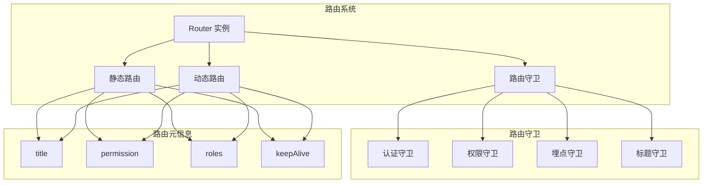

# AlkaidSYS 前端路由设计

## 📋 文档信息

| 项目 | 内容 |
|------|------|
| **文档名称** | AlkaidSYS 前端路由设计 |
| **文档版本** | v1.0 |
| **创建日期** | 2025-01-19 |

## 🎯 路由设计目标

1. **统一路由规范** - Admin、Web 两端使用统一的路由设计规范
2. **动态路由** - 支持基于权限的动态路由生成
3. **路由守卫** - 完善的路由守卫机制（认证、权限、埋点）
4. **路由缓存** - 支持页面缓存（keep-alive）
5. **路由过渡** - 优雅的页面切换动画

## 🏗️ 路由架构



## 📦 核心依赖

```json
{
  "dependencies": {
    "vue-router": "^4.5.0"
  }
}
```

## 🔧 路由配置

### 1. Admin 路由配置

```typescript
// /apps/admin/src/router/index.ts

import { createRouter, createWebHistory } from 'vue-router';
import type { RouteRecordRaw } from 'vue-router';
import { setupRouterGuards } from './guards';

// 静态路由
const staticRoutes: RouteRecordRaw[] = [
  {
    path: '/login',
    name: 'Login',
    component: () => import('@/views/auth/login.vue'),
    meta: {
      title: '登录',
      requiresAuth: false,
    },
  },
  {
    path: '/404',
    name: 'NotFound',
    component: () => import('@/views/error/404.vue'),
    meta: {
      title: '页面不存在',
      requiresAuth: false,
    },
  },
  {
    path: '/403',
    name: 'Forbidden',
    component: () => import('@/views/error/403.vue'),
    meta: {
      title: '无权限',
      requiresAuth: false,
    },
  },
];

// 动态路由（基础布局）
const dynamicRoutes: RouteRecordRaw[] = [
  {
    path: '/',
    name: 'Layout',
    component: () => import('@/layouts/default/index.vue'),
    redirect: '/dashboard',
    children: [
      {
        path: 'dashboard',
        name: 'Dashboard',
        component: () => import('@/views/dashboard/index.vue'),
        meta: {
          title: '仪表盘',
          icon: 'dashboard',
          keepAlive: true,
        },
      },
      {
        path: 'system',
        name: 'System',
        redirect: '/system/user',
        meta: {
          title: '系统管理',
          icon: 'setting',
        },
        children: [
          {
            path: 'user',
            name: 'SystemUser',
            component: () => import('@/views/system/user/index.vue'),
            meta: {
              title: '用户管理',
              permission: 'user:list',
              keepAlive: true,
            },
          },
          {
            path: 'role',
            name: 'SystemRole',
            component: () => import('@/views/system/role/index.vue'),
            meta: {
              title: '角色管理',
              permission: 'role:list',
              keepAlive: true,
            },
          },
          {
            path: 'permission',
            name: 'SystemPermission',
            component: () => import('@/views/system/permission/index.vue'),
            meta: {
              title: '权限管理',
              permission: 'permission:list',
              keepAlive: true,
            },
          },
          {
            path: 'menu',
            name: 'SystemMenu',
            component: () => import('@/views/system/menu/index.vue'),
            meta: {
              title: '菜单管理',
              permission: 'menu:list',
              keepAlive: true,
            },
          },
        ],
      },
      {
        path: 'tenant',
        name: 'Tenant',
        redirect: '/tenant/list',
        meta: {
          title: '租户管理',
          icon: 'team',
        },
        children: [
          {
            path: 'list',
            name: 'TenantList',
            component: () => import('@/views/tenant/list.vue'),
            meta: {
              title: '租户列表',
              permission: 'tenant:list',
              keepAlive: true,
            },
          },
          {
            path: 'detail/:id',
            name: 'TenantDetail',
            component: () => import('@/views/tenant/detail.vue'),
            meta: {
              title: '租户详情',
              permission: 'tenant:view',
              hidden: true,
            },
          },
        ],
      },
      {
        path: 'site',
        name: 'Site',
        redirect: '/site/list',
        meta: {
          title: '站点管理',
          icon: 'global',
        },
        children: [
          {
            path: 'list',
            name: 'SiteList',
            component: () => import('@/views/site/list.vue'),
            meta: {
              title: '站点列表',
              permission: 'site:list',
              keepAlive: true,
            },
          },
          {
            path: 'detail/:id',
            name: 'SiteDetail',
            component: () => import('@/views/site/detail.vue'),
            meta: {
              title: '站点详情',
              permission: 'site:view',
              hidden: true,
            },
          },
        ],
      },
    ],
  },
];

export const router = createRouter({
  history: createWebHistory(import.meta.env.BASE_URL),
  routes: [...staticRoutes, ...dynamicRoutes],
  scrollBehavior(to, from, savedPosition) {
    if (savedPosition) {
      return savedPosition;
    } else {
      return { top: 0 };
    }
  },
});

// 设置路由守卫
setupRouterGuards(router);

export default router;
```

### 2. Web 路由配置

```typescript
// /apps/web/src/router/index.ts

import { createRouter, createWebHistory } from 'vue-router';
import type { RouteRecordRaw } from 'vue-router';
import { setupRouterGuards } from './guards';

const routes: RouteRecordRaw[] = [
  {
    path: '/',
    name: 'Layout',
    component: () => import('@/layouts/default.vue'),
    children: [
      {
        path: '',
        name: 'Home',
        component: () => import('@/views/home/index.vue'),
        meta: {
          title: '首页',
          keepAlive: true,
        },
      },
      {
        path: 'products',
        name: 'ProductList',
        component: () => import('@/views/product/list.vue'),
        meta: {
          title: '商品列表',
          keepAlive: true,
        },
      },
      {
        path: 'product/:id',
        name: 'ProductDetail',
        component: () => import('@/views/product/detail.vue'),
        meta: {
          title: '商品详情',
        },
      },
      {
        path: 'cart',
        name: 'Cart',
        component: () => import('@/views/cart/index.vue'),
        meta: {
          title: '购物车',
          requiresAuth: true,
        },
      },
      {
        path: 'order',
        name: 'Order',
        redirect: '/order/list',
        meta: {
          requiresAuth: true,
        },
        children: [
          {
            path: 'list',
            name: 'OrderList',
            component: () => import('@/views/order/list.vue'),
            meta: {
              title: '我的订单',
              keepAlive: true,
            },
          },
          {
            path: 'detail/:id',
            name: 'OrderDetail',
            component: () => import('@/views/order/detail.vue'),
            meta: {
              title: '订单详情',
            },
          },
          {
            path: 'confirm',
            name: 'OrderConfirm',
            component: () => import('@/views/order/confirm.vue'),
            meta: {
              title: '确认订单',
            },
          },
        ],
      },
      {
        path: 'user',
        name: 'User',
        redirect: '/user/profile',
        meta: {
          requiresAuth: true,
        },
        children: [
          {
            path: 'profile',
            name: 'UserProfile',
            component: () => import('@/views/user/profile.vue'),
            meta: {
              title: '个人资料',
            },
          },
          {
            path: 'address',
            name: 'UserAddress',
            component: () => import('@/views/user/address.vue'),
            meta: {
              title: '收货地址',
            },
          },
        ],
      },
    ],
  },
  {
    path: '/login',
    name: 'Login',
    component: () => import('@/views/auth/login.vue'),
    meta: {
      title: '登录',
      layout: 'blank',
    },
  },
  {
    path: '/:pathMatch(.*)*',
    name: 'NotFound',
    component: () => import('@/views/error/404.vue'),
    meta: {
      title: '页面不存在',
      layout: 'blank',
    },
  },
];

export const router = createRouter({
  history: createWebHistory(import.meta.env.BASE_URL),
  routes,
  scrollBehavior(to, from, savedPosition) {
    if (savedPosition) {
      return savedPosition;
    } else {
      return { top: 0 };
    }
  },
});

setupRouterGuards(router);

export default router;
```

## 🛡️ 路由守卫

### 1. 认证守卫

```typescript
// /apps/admin/src/router/guards/auth.ts

import type { Router } from 'vue-router';
import { useAuthStore } from '@/store/modules/auth';

export function setupAuthGuard(router: Router) {
  router.beforeEach(async (to, from, next) => {
    const authStore = useAuthStore();
    
    // 白名单路由
    const whiteList = ['/login', '/404', '/403'];
    if (whiteList.includes(to.path)) {
      next();
      return;
    }
    
    // 检查是否需要认证
    if (to.meta.requiresAuth !== false) {
      const token = authStore.token;
      if (!token) {
        next({
          path: '/login',
          query: { redirect: to.fullPath },
        });
        return;
      }
      
      // 检查是否已获取用户信息
      if (!authStore.user) {
        try {
          await authStore.fetchUserInfo();
        } catch (error) {
          await authStore.logout();
          next({
            path: '/login',
            query: { redirect: to.fullPath },
          });
          return;
        }
      }
    }
    
    next();
  });
}
```

### 2. 权限守卫

```typescript
// /apps/admin/src/router/guards/permission.ts

import type { Router } from 'vue-router';
import { useAuthStore } from '@/store/modules/auth';

export function setupPermissionGuard(router: Router) {
  router.beforeEach((to, from, next) => {
    const authStore = useAuthStore();
    
    // 检查路由权限
    if (to.meta.permission) {
      const hasPermission = authStore.hasPermission(to.meta.permission as string);
      if (!hasPermission) {
        next({ path: '/403' });
        return;
      }
    }
    
    // 检查角色权限
    if (to.meta.roles) {
      const roles = to.meta.roles as string[];
      const hasRole = roles.some(role => authStore.hasRole(role));
      if (!hasRole) {
        next({ path: '/403' });
        return;
      }
    }
    
    next();
  });
}
```

### 3. 标题守卫

```typescript
// /apps/admin/src/router/guards/title.ts

import type { Router } from 'vue-router';

const DEFAULT_TITLE = 'AlkaidSYS';

export function setupTitleGuard(router: Router) {
  router.afterEach((to) => {
    const title = to.meta.title as string;
    document.title = title ? `${title} - ${DEFAULT_TITLE}` : DEFAULT_TITLE;
  });
}
```

### 4. 埋点守卫

```typescript
// /apps/admin/src/router/guards/analytics.ts

import type { Router } from 'vue-router';

export function setupAnalyticsGuard(router: Router) {
  router.afterEach((to, from) => {
    // 发送页面浏览事件
    if (typeof window !== 'undefined' && (window as any).gtag) {
      (window as any).gtag('config', 'GA_MEASUREMENT_ID', {
        page_path: to.fullPath,
      });
    }
    
    // 自定义埋点
    console.log('Page view:', {
      from: from.fullPath,
      to: to.fullPath,
      timestamp: new Date().toISOString(),
    });
  });
}
```

### 5. 守卫集成

```typescript
// /apps/admin/src/router/guards/index.ts

import type { Router } from 'vue-router';
import { setupAuthGuard } from './auth';
import { setupPermissionGuard } from './permission';
import { setupTitleGuard } from './title';
import { setupAnalyticsGuard } from './analytics';

export function setupRouterGuards(router: Router) {
  setupAuthGuard(router);
  setupPermissionGuard(router);
  setupTitleGuard(router);
  setupAnalyticsGuard(router);
}
```

## 🔄 动态路由

### 1. 菜单转路由

```typescript
// /apps/admin/src/router/helper.ts

import type { RouteRecordRaw } from 'vue-router';

export interface MenuItem {
  id: number;
  parent_id: number;
  name: string;
  path: string;
  component: string;
  icon: string;
  sort: number;
  permission: string;
  children?: MenuItem[];
}

const modules = import.meta.glob('../views/**/*.vue');

/**
 * 将菜单转换为路由
 */
export function transformMenuToRoute(menus: MenuItem[]): RouteRecordRaw[] {
  return menus.map(menu => {
    const route: RouteRecordRaw = {
      path: menu.path,
      name: menu.name,
      component: loadComponent(menu.component),
      meta: {
        title: menu.name,
        icon: menu.icon,
        permission: menu.permission,
      },
    };
    
    if (menu.children && menu.children.length > 0) {
      route.children = transformMenuToRoute(menu.children);
    }
    
    return route;
  });
}

/**
 * 动态加载组件
 */
function loadComponent(component: string) {
  if (component === 'Layout') {
    return () => import('@/layouts/default/index.vue');
  }
  
  const path = `../views/${component}.vue`;
  const componentLoader = modules[path];
  
  if (!componentLoader) {
    console.error(`Component not found: ${path}`);
    return () => import('@/views/error/404.vue');
  }
  
  return componentLoader;
}
```

### 2. 动态添加路由

```typescript
// /apps/admin/src/router/dynamic.ts

import { router } from './index';
import { getUserMenus } from '@/api/menu';
import { transformMenuToRoute } from './helper';

let isDynamicRoutesAdded = false;

/**
 * 初始化动态路由
 */
export async function setupDynamicRoutes() {
  if (isDynamicRoutesAdded) {
    return;
  }
  
  try {
    const menus = await getUserMenus();
    const routes = transformMenuToRoute(menus);
    
    // 添加到布局路由的 children
    const layoutRoute = router.getRoutes().find(r => r.name === 'Layout');
    if (layoutRoute) {
      routes.forEach(route => {
        router.addRoute('Layout', route);
      });
    }
    
    // 添加 404 路由（必须在最后）
    router.addRoute({
      path: '/:pathMatch(.*)*',
      redirect: '/404',
    });
    
    isDynamicRoutesAdded = true;
  } catch (error) {
    console.error('Setup dynamic routes failed:', error);
  }
}

/**
 * 重置动态路由
 */
export function resetDynamicRoutes() {
  isDynamicRoutesAdded = false;
}
```

## 🆚 与 NIUCLOUD 路由对比

| 特性 | AlkaidSYS | NIUCLOUD | 优势 |
|------|-----------|----------|------|
| **动态路由** | 完整支持 | 部分支持 | ✅ 更灵活 |
| **路由守卫** | 多种守卫 | 基础守卫 | ✅ 更完善 |
| **权限控制** | 细粒度控制 | 基础控制 | ✅ 更强大 |
| **路由缓存** | keep-alive | 无 | ✅ 更快 |
| **TypeScript** | 完整支持 | 部分支持 | ✅ 更安全 |

---

**最后更新**: 2025-01-19  
**文档版本**: v1.0  
**维护者**: AlkaidSYS 架构团队

