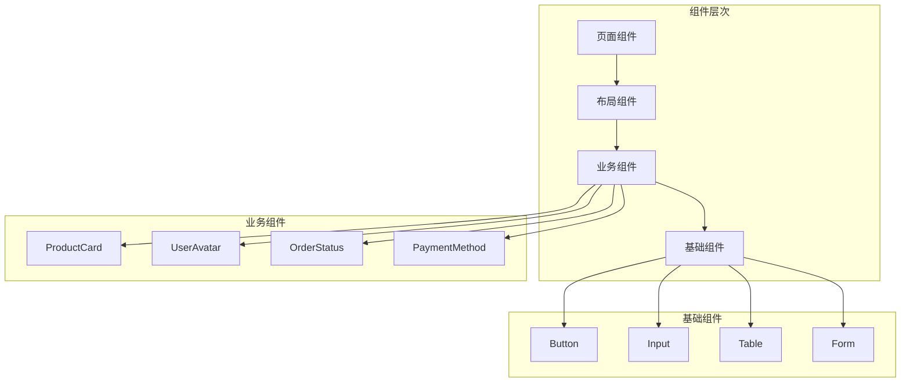

# AlkaidSYS 前端组件设计

## 📋 文档信息

| 项目 | 内容 |
|------|------|
| **文档名称** | AlkaidSYS 前端组件设计 |
| **文档版本** | v1.0 |
| **创建日期** | 2025-01-19 |

## 🎯 组件设计目标

1. **组件复用** - 高度可复用的通用组件
2. **类型安全** - 完整的 TypeScript 类型定义
3. **文档完善** - 每个组件都有详细的文档和示例
4. **性能优化** - 组件级别的性能优化
5. **可访问性** - 符合 WCAG 2.1 标准

## 🏗️ 组件架构



## 📦 组件分类

### 1. 基础组件（来自 UI 库）

- **Ant Design Vue（Admin/Web 端统一）**
  - Button、Input、Select、Table、Form 等

### 2. 通用业务组件

#### ProductCard（商品卡片）

```vue
<!-- /apps/web/src/components/ProductCard/index.vue -->

<template>
  <div class="product-card" @click="handleClick">
    <div class="product-image">
      
      <div v-if="product.tag" class="product-tag">{{ product.tag }}</div>
    </div>
    <div class="product-info">
      <h3 class="product-name">{{ product.name }}</h3>
      <p class="product-desc">{{ product.description }}</p>
      <div class="product-footer">
        <div class="product-price">
          <span class="current">¥{{ product.price }}</span>
          <span v-if="product.original_price" class="original">¥{{ product.original_price }}</span>
        </div>
        <div class="product-sales">已售 {{ product.sales }}</div>
      </div>
    </div>
  </div>
</template>

<script setup lang="ts">
interface Product {
  id: number;
  name: string;
  description: string;
  image: string;
  price: number;
  original_price?: number;
  sales: number;
  tag?: string;
}

interface Props {
  product: Product;
}

interface Emits {
  (e: 'click', product: Product): void;
}

const props = defineProps<Props>();
const emit = defineEmits<Emits>();

function handleClick() {
  emit('click', props.product);
}
</script>

<style scoped lang="scss">
.product-card {
  background-color: #fff;
  border-radius: 8px;
  overflow: hidden;
  cursor: pointer;
  transition: all 0.3s;
  
  &:hover {
    box-shadow: 0 4px 12px rgba(0, 0, 0, 0.1);
    transform: translateY(-4px);
  }
  
  .product-image {
    position: relative;
    width: 100%;
    padding-top: 100%;
    overflow: hidden;
    
    img {
      position: absolute;
      top: 0;
      left: 0;
      width: 100%;
      height: 100%;
      object-fit: cover;
    }
    
    .product-tag {
      position: absolute;
      top: 10px;
      left: 10px;
      padding: 4px 8px;
      background-color: #ff4d4f;
      color: #fff;
      font-size: 12px;
      border-radius: 4px;
    }
  }
  
  .product-info {
    padding: 12px;
    
    .product-name {
      margin: 0 0 8px;
      font-size: 14px;
      font-weight: 500;
      color: #333;
      overflow: hidden;
      text-overflow: ellipsis;
      white-space: nowrap;
    }
    
    .product-desc {
      margin: 0 0 12px;
      font-size: 12px;
      color: #999;
      overflow: hidden;
      text-overflow: ellipsis;
      white-space: nowrap;
    }
    
    .product-footer {
      display: flex;
      justify-content: space-between;
      align-items: center;
      
      .product-price {
        .current {
          color: #ff4d4f;
          font-size: 18px;
          font-weight: 600;
        }
        
        .original {
          margin-left: 8px;
          color: #999;
          font-size: 12px;
          text-decoration: line-through;
        }
      }
      
      .product-sales {
        color: #999;
        font-size: 12px;
      }
    }
  }
}
</style>
```

#### UserAvatar（用户头像）

```vue
<!-- /apps/admin/src/components/UserAvatar/index.vue -->

<template>
  <div class="user-avatar" :class="sizeClass">
    
    <div v-else class="avatar-placeholder">
      {{ initials }}
    </div>
  </div>
</template>

<script setup lang="ts">
import { computed, ref } from 'vue';

interface Props {
  src?: string;
  name?: string;
  size?: 'small' | 'default' | 'large';
}

const props = withDefaults(defineProps<Props>(), {
  size: 'default',
});

const imageError = ref(false);

const sizeClass = computed(() => `avatar-${props.size}`);

const initials = computed(() => {
  if (!props.name) return '?';
  const words = props.name.split(' ');
  if (words.length >= 2) {
    return (words[0][0] + words[1][0]).toUpperCase();
  }
  return props.name.substring(0, 2).toUpperCase();
});

function handleError() {
  imageError.value = true;
}
</script>

<style scoped lang="scss">
.user-avatar {
  display: inline-flex;
  align-items: center;
  justify-content: center;
  border-radius: 50%;
  overflow: hidden;
  background-color: #409eff;
  color: #fff;
  
  &.avatar-small {
    width: 24px;
    height: 24px;
    font-size: 12px;
  }
  
  &.avatar-default {
    width: 40px;
    height: 40px;
    font-size: 16px;
  }
  
  &.avatar-large {
    width: 64px;
    height: 64px;
    font-size: 24px;
  }
  
  img {
    width: 100%;
    height: 100%;
    object-fit: cover;
  }
  
  .avatar-placeholder {
    width: 100%;
    height: 100%;
    display: flex;
    align-items: center;
    justify-content: center;
    font-weight: 600;
  }
}
</style>
```

#### TenantSelector（租户选择器）

```vue
<!-- /apps/admin/src/components/TenantSelector/index.vue -->

<template>
  <a-select
    v-model:value="currentTenant"
    placeholder="选择租户"
    :style="{ width: width }"
    :loading="loading"
    @change="handleChange"
  >
    <a-select-option
      v-for="tenant in tenants"
      :key="tenant.id"
      :value="tenant.id"
    >
      <div class="tenant-option">
        
        <span>{{ tenant.name }}</span>
      </div>
    </a-select-option>
  </a-select>
</template>

<script setup lang="ts">
import { ref, onMounted, watch } from 'vue';
import { useTenantStore } from '@/store/modules/tenant';

interface Props {
  width?: string;
}

interface Emits {
  (e: 'change', tenantId: number): void;
}

const props = withDefaults(defineProps<Props>(), {
  width: '200px',
});

const emit = defineEmits<Emits>();

const tenantStore = useTenantStore();
const currentTenant = ref<number>();
const tenants = ref<any[]>([]);
const loading = ref(false);

onMounted(async () => {
  await loadTenants();
  currentTenant.value = tenantStore.currentTenantId;
});

watch(() => tenantStore.currentTenantId, (newId) => {
  currentTenant.value = newId;
});

async function loadTenants() {
  loading.value = true;
  try {
    tenants.value = await tenantStore.fetchTenants();
  } catch (error) {
    console.error('Load tenants failed:', error);
  } finally {
    loading.value = false;
  }
}

function handleChange(tenantId: number) {
  tenantStore.switchTenant(tenantId);
  emit('change', tenantId);
}
</script>

<style scoped lang="scss">
.tenant-option {
  display: flex;
  align-items: center;
  gap: 8px;
  
  .tenant-logo {
    width: 20px;
    height: 20px;
    border-radius: 4px;
  }
}
</style>
```

#### LoadMore（加载更多）

```vue
<!-- /apps/mobile/src/components/LoadMore/index.vue -->

<template>
  <view class="load-more">
    <view v-if="status === 'loading'" class="loading">
      <uni-icons type="spinner-cycle" size="20" color="#999" />
      <text>加载中...</text>
    </view>
    <view v-else-if="status === 'nomore'" class="nomore">
      <text>没有更多了</text>
    </view>
    <view v-else class="more" @tap="handleLoadMore">
      <text>点击加载更多</text>
    </view>
  </view>
</template>

<script setup lang="ts">
interface Props {
  status: 'more' | 'loading' | 'nomore';
}

interface Emits {
  (e: 'loadmore'): void;
}

const props = defineProps<Props>();
const emit = defineEmits<Emits>();

function handleLoadMore() {
  if (props.status === 'more') {
    emit('loadmore');
  }
}
</script>

<style scoped lang="scss">
.load-more {
  padding: 40rpx 0;
  text-align: center;
  
  .loading,
  .nomore,
  .more {
    display: flex;
    align-items: center;
    justify-content: center;
    gap: 10rpx;
    color: #999;
    font-size: 28rpx;
  }
  
  .more {
    cursor: pointer;
    
    &:active {
      opacity: 0.7;
    }
  }
}
</style>
```

## 🎨 组件样式规范

### 1. CSS 变量

```scss
// /apps/admin/src/assets/styles/variables.scss

// 颜色
$primary-color: #409eff;
$success-color: #67c23a;
$warning-color: #e6a23c;
$danger-color: #f56c6c;
$info-color: #909399;

// 字体
$font-size-base: 14px;
$font-size-small: 12px;
$font-size-large: 16px;

// 间距
$spacing-xs: 4px;
$spacing-sm: 8px;
$spacing-md: 16px;
$spacing-lg: 24px;
$spacing-xl: 32px;

// 圆角
$border-radius-sm: 2px;
$border-radius-md: 4px;
$border-radius-lg: 8px;

// 阴影
$box-shadow-sm: 0 2px 4px rgba(0, 0, 0, 0.08);
$box-shadow-md: 0 4px 8px rgba(0, 0, 0, 0.12);
$box-shadow-lg: 0 8px 16px rgba(0, 0, 0, 0.16);
```

### 2. Mixins

```scss
// /apps/admin/src/assets/styles/mixins.scss

// 文本溢出省略
@mixin text-ellipsis($lines: 1) {
  @if $lines == 1 {
    overflow: hidden;
    text-overflow: ellipsis;
    white-space: nowrap;
  } @else {
    display: -webkit-box;
    -webkit-line-clamp: $lines;
    -webkit-box-orient: vertical;
    overflow: hidden;
  }
}

// Flex 布局
@mixin flex-center {
  display: flex;
  align-items: center;
  justify-content: center;
}

@mixin flex-between {
  display: flex;
  align-items: center;
  justify-content: space-between;
}

// 响应式
@mixin respond-to($breakpoint) {
  @if $breakpoint == 'mobile' {
    @media (max-width: 768px) {
      @content;
    }
  } @else if $breakpoint == 'tablet' {
    @media (min-width: 769px) and (max-width: 1024px) {
      @content;
    }
  } @else if $breakpoint == 'desktop' {
    @media (min-width: 1025px) {
      @content;
    }
  }
}
```

## 📚 组件文档

### Storybook 配置

```typescript
// /.storybook/main.ts

import type { StorybookConfig } from '@storybook/vue3-vite';

const config: StorybookConfig = {
  stories: ['../apps/*/src/**/*.stories.@(js|jsx|ts|tsx)'],
  addons: [
    '@storybook/addon-links',
    '@storybook/addon-essentials',
    '@storybook/addon-interactions',
  ],
  framework: {
    name: '@storybook/vue3-vite',
    options: {},
  },
  docs: {
    autodocs: 'tag',
  },
};

export default config;
```

### 组件 Story 示例

```typescript
// /apps/web/src/components/ProductCard/ProductCard.stories.ts

import type { Meta, StoryObj } from '@storybook/vue3';
import ProductCard from './index.vue';

const meta: Meta<typeof ProductCard> = {
  title: 'Components/ProductCard',
  component: ProductCard,
  tags: ['autodocs'],
  argTypes: {
    product: {
      description: '商品数据',
    },
  },
};

export default meta;
type Story = StoryObj<typeof ProductCard>;

export const Default: Story = {
  args: {
    product: {
      id: 1,
      name: 'iPhone 15 Pro Max',
      description: '全新 A17 Pro 芯片，钛金属设计',
      image: 'https://example.com/iphone.jpg',
      price: 9999,
      original_price: 10999,
      sales: 1234,
      tag: '热销',
    },
  },
};

export const WithoutTag: Story = {
  args: {
    product: {
      id: 2,
      name: 'MacBook Pro 16',
      description: 'M3 Max 芯片，极致性能',
      image: 'https://example.com/macbook.jpg',
      price: 19999,
      sales: 567,
    },
  },
};
```

## 🆚 与 NIUCLOUD 组件对比

| 特性 | AlkaidSYS | NIUCLOUD | 优势 |
|------|-----------|----------|------|
| **TypeScript** | 完整支持 | 部分支持 | ✅ 更安全 |
| **组件文档** | Storybook | 无 | ✅ 更完善 |
| **样式规范** | 统一规范 | 分散 | ✅ 更一致 |
| **可复用性** | 高度复用 | 中等 | ✅ 更高效 |
| **性能优化** | 多种优化 | 基础优化 | ✅ 更快 |

---

**最后更新**: 2025-01-19  
**文档版本**: v1.0  
**维护者**: AlkaidSYS 架构团队

