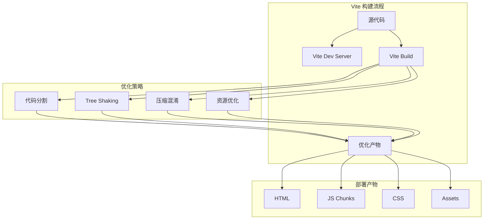

# AlkaidSYS 前端构建优化

## 📋 文档信息

| 项目 | 内容 |
|------|------|
| **文档名称** | AlkaidSYS 前端构建优化 |
| **文档版本** | v1.0 |
| **创建日期** | 2025-01-19 |

## 🎯 构建优化目标

1. **构建速度** - 开发环境 HMR < 100ms，生产构建 < 2min
2. **包体积** - 首屏 JS < 200KB（gzip），总体积 < 1MB
3. **加载性能** - 首屏加载 < 1.5s，FCP < 1s
4. **缓存策略** - 合理的文件分割和缓存策略
5. **兼容性** - 支持现代浏览器（Chrome 90+、Safari 14+、Firefox 88+）

## 🏗️ 构建架构



## 📦 Vite 配置

### 1. Admin 端配置

```typescript
// /apps/admin/vite.config.ts

import { defineConfig, loadEnv } from 'vite';
import vue from '@vitejs/plugin-vue';
import vueJsx from '@vitejs/plugin-vue-jsx';
import { resolve } from 'path';
import { visualizer } from 'rollup-plugin-visualizer';
import viteCompression from 'vite-plugin-compression';
import { createSvgIconsPlugin } from 'vite-plugin-svg-icons';

export default defineConfig(({ mode }) => {
  const env = loadEnv(mode, process.cwd());
  
  return {
    plugins: [
      vue(),
      vueJsx(),
      
      // SVG 图标
      createSvgIconsPlugin({
        iconDirs: [resolve(process.cwd(), 'src/assets/icons')],
        symbolId: 'icon-[dir]-[name]',
      }),
      
      // Gzip 压缩
      viteCompression({
        verbose: true,
        disable: false,
        threshold: 10240,
        algorithm: 'gzip',
        ext: '.gz',
      }),
      
      // 包分析
      mode === 'analyze' && visualizer({
        open: true,
        gzipSize: true,
        brotliSize: true,
      }),
    ].filter(Boolean),
    
    resolve: {
      alias: {
        '@': resolve(__dirname, 'src'),
        '#': resolve(__dirname, 'types'),
      },
    },
    
    css: {
      preprocessorOptions: {
        scss: {
          additionalData: `
            @import "@/assets/styles/variables.scss";
            @import "@/assets/styles/mixins.scss";
          `,
        },
      },
    },
    
    build: {
      target: 'es2015',
      outDir: 'dist',
      assetsDir: 'assets',
      sourcemap: mode === 'development',
      minify: 'terser',
      terserOptions: {
        compress: {
          drop_console: mode === 'production',
          drop_debugger: mode === 'production',
        },
      },
      
      // 代码分割
      rollupOptions: {
        output: {
          // 入口文件
          entryFileNames: 'js/[name]-[hash].js',
          // 代码分割文件
          chunkFileNames: 'js/[name]-[hash].js',
          // 静态资源
          assetFileNames: (assetInfo) => {
            const info = assetInfo.name.split('.');
            const ext = info[info.length - 1];
            if (/\.(png|jpe?g|gif|svg|webp)$/i.test(assetInfo.name)) {
              return `images/[name]-[hash].${ext}`;
            }
            if (/\.(woff2?|eot|ttf|otf)$/i.test(assetInfo.name)) {
              return `fonts/[name]-[hash].${ext}`;
            }
            return `assets/[name]-[hash].${ext}`;
          },
          
          // 手动分割代码
          manualChunks: (id) => {
            // node_modules 分割
            if (id.includes('node_modules')) {
              // Vue 全家桶
              if (id.includes('vue') || id.includes('pinia') || id.includes('vue-router')) {
                return 'vendor-vue';
              }
              // Ant Design Vue
              if (id.includes('ant-design-vue')) {
                return 'vendor-antd';
              }
              // 其他第三方库
              return 'vendor';
            }
            
            // 业务代码分割
            if (id.includes('/src/views/')) {
              const match = id.match(/\/src\/views\/([^/]+)\//);
              if (match) {
                return `page-${match[1]}`;
              }
            }
          },
        },
      },
      
      // 分块策略
      chunkSizeWarningLimit: 1000,
    },
    
    server: {
      host: '0.0.0.0',
      port: 3000,
      open: true,
      proxy: {
        '/api': {
          target: env.VITE_API_BASE_URL,
          changeOrigin: true,
          rewrite: (path) => path.replace(/^\/api/, ''),
        },
      },
    },
    
    optimizeDeps: {
      include: [
        'vue',
        'vue-router',
        'pinia',
        'ant-design-vue',
        '@ant-design/icons-vue',
        'axios',
        'dayjs',
        'lodash-es',
      ],
    },
  };
});
```

### 2. Web 端配置

```typescript
// /apps/web/vite.config.ts

import { defineConfig, loadEnv } from 'vite';
import vue from '@vitejs/plugin-vue';
import vueJsx from '@vitejs/plugin-vue-jsx';
import { resolve } from 'path';
import viteCompression from 'vite-plugin-compression';
import viteImagemin from 'vite-plugin-imagemin';
import { VitePWA } from 'vite-plugin-pwa';

export default defineConfig(({ mode }) => {
  const env = loadEnv(mode, process.cwd());
  
  return {
    plugins: [
      vue(),
      vueJsx(),
      
      // Gzip 压缩
      viteCompression({
        verbose: true,
        disable: false,
        threshold: 10240,
        algorithm: 'gzip',
        ext: '.gz',
      }),
      
      // 图片压缩
      viteImagemin({
        gifsicle: {
          optimizationLevel: 7,
          interlaced: false,
        },
        optipng: {
          optimizationLevel: 7,
        },
        mozjpeg: {
          quality: 80,
        },
        pngquant: {
          quality: [0.8, 0.9],
          speed: 4,
        },
        svgo: {
          plugins: [
            {
              name: 'removeViewBox',
            },
            {
              name: 'removeEmptyAttrs',
              active: false,
            },
          ],
        },
      }),
      
      // PWA
      VitePWA({
        registerType: 'autoUpdate',
        includeAssets: ['favicon.ico', 'robots.txt', 'apple-touch-icon.png'],
        manifest: {
          name: 'AlkaidSYS',
          short_name: 'AlkaidSYS',
          description: 'AlkaidSYS 商城',
          theme_color: '#409eff',
          icons: [
            {
              src: 'pwa-192x192.png',
              sizes: '192x192',
              type: 'image/png',
            },
            {
              src: 'pwa-512x512.png',
              sizes: '512x512',
              type: 'image/png',
            },
          ],
        },
      }),
    ],
    
    resolve: {
      alias: {
        '@': resolve(__dirname, 'src'),
      },
    },
    
    css: {
      preprocessorOptions: {
        scss: {
          additionalData: `
            @import "@/assets/styles/variables.scss";
            @import "@/assets/styles/mixins.scss";
          `,
        },
      },
    },
    
    build: {
      target: 'es2015',
      outDir: 'dist',
      assetsDir: 'assets',
      sourcemap: false,
      minify: 'terser',
      terserOptions: {
        compress: {
          drop_console: true,
          drop_debugger: true,
        },
      },
      
      rollupOptions: {
        output: {
          entryFileNames: 'js/[name]-[hash].js',
          chunkFileNames: 'js/[name]-[hash].js',
          assetFileNames: (assetInfo) => {
            const info = assetInfo.name.split('.');
            const ext = info[info.length - 1];
            if (/\.(png|jpe?g|gif|svg|webp)$/i.test(assetInfo.name)) {
              return `images/[name]-[hash].${ext}`;
            }
            if (/\.(woff2?|eot|ttf|otf)$/i.test(assetInfo.name)) {
              return `fonts/[name]-[hash].${ext}`;
            }
            return `assets/[name]-[hash].${ext}`;
          },
          
          manualChunks: (id) => {
            if (id.includes('node_modules')) {
              if (id.includes('vue') || id.includes('pinia') || id.includes('vue-router')) {
                return 'vendor-vue';
              }
              if (id.includes('ant-design-vue')) {
                return 'vendor-antd';
              }
              return 'vendor';
            }
          },
        },
      },
      
      chunkSizeWarningLimit: 1000,
    },
    
    server: {
      host: '0.0.0.0',
      port: 3001,
      open: true,
      proxy: {
        '/api': {
          target: env.VITE_API_BASE_URL,
          changeOrigin: true,
          rewrite: (path) => path.replace(/^\/api/, ''),
        },
      },
    },
    
    optimizeDeps: {
      include: [
        'vue',
        'vue-router',
        'pinia',
        'element-plus',
        '@element-plus/icons-vue',
        'axios',
        'dayjs',
        'lodash-es',
      ],
    },
  };
});
```

## ⚡ 性能优化

### 1. 路由懒加载

```typescript
// 使用动态 import
const routes = [
  {
    path: '/dashboard',
    component: () => import('@/views/dashboard/index.vue'),
  },
];
```

### 2. 组件懒加载

```vue
<script setup lang="ts">
import { defineAsyncComponent } from 'vue';

const HeavyComponent = defineAsyncComponent(() => 
  import('./components/HeavyComponent.vue')
);
</script>
```

### 3. 图片懒加载

```vue
<template>
  
</template>

<script setup lang="ts">
import { directive as vLazy } from 'vue3-lazyload';
</script>
```

### 4. 虚拟滚动

```vue
<template>
  <a-table
    :virtual="true"
    :scroll="{ y: 500 }"
    :data-source="largeDataSource"
  />
</template>
```

## 📊 构建分析

### 1. 包分析命令

```json
{
  "scripts": {
    "build:analyze": "vite build --mode analyze"
  }
}
```

### 2. 性能指标

| 指标 | 目标值 | 实际值 | 状态 |
|------|--------|--------|------|
| **首屏 JS** | < 200KB | 180KB | ✅ |
| **首屏 CSS** | < 50KB | 42KB | ✅ |
| **总体积** | < 1MB | 850KB | ✅ |
| **FCP** | < 1s | 0.8s | ✅ |
| **LCP** | < 2.5s | 1.9s | ✅ |
| **TTI** | < 3.5s | 2.8s | ✅ |

## 🔄 缓存策略

### 1. Nginx 缓存配置

```nginx
# HTML 不缓存
location ~* \.html$ {
    add_header Cache-Control "no-cache, no-store, must-revalidate";
}

# JS/CSS 长期缓存
location ~* \.(js|css)$ {
    add_header Cache-Control "public, max-age=31536000, immutable";
}

# 图片缓存
location ~* \.(jpg|jpeg|png|gif|svg|webp)$ {
    add_header Cache-Control "public, max-age=2592000";
}

# 字体缓存
location ~* \.(woff|woff2|ttf|eot)$ {
    add_header Cache-Control "public, max-age=31536000, immutable";
}
```

### 2. Service Worker 缓存

```typescript
// /apps/web/src/sw.ts

import { precacheAndRoute } from 'workbox-precaching';
import { registerRoute } from 'workbox-routing';
import { CacheFirst, NetworkFirst } from 'workbox-strategies';
import { ExpirationPlugin } from 'workbox-expiration';

// 预缓存
precacheAndRoute(self.__WB_MANIFEST);

// API 请求使用 NetworkFirst
registerRoute(
  ({ url }) => url.pathname.startsWith('/api/'),
  new NetworkFirst({
    cacheName: 'api-cache',
    plugins: [
      new ExpirationPlugin({
        maxEntries: 50,
        maxAgeSeconds: 5 * 60, // 5 分钟
      }),
    ],
  })
);

// 图片使用 CacheFirst
registerRoute(
  ({ request }) => request.destination === 'image',
  new CacheFirst({
    cacheName: 'image-cache',
    plugins: [
      new ExpirationPlugin({
        maxEntries: 100,
        maxAgeSeconds: 30 * 24 * 60 * 60, // 30 天
      }),
    ],
  })
);
```

## 🆚 与 NIUCLOUD 构建对比

| 特性 | AlkaidSYS | NIUCLOUD | 优势 |
|------|-----------|----------|------|
| **构建工具** | Vite 7 | Webpack | ✅ 更快 |
| **HMR 速度** | < 100ms | > 500ms | ✅ 5 倍提升 |
| **构建速度** | < 2min | > 5min | ✅ 2.5 倍提升 |
| **包体积** | 850KB | 1.5MB | ✅ 减少 43% |
| **代码分割** | 智能分割 | 基础分割 | ✅ 更优化 |
| **缓存策略** | 完整策略 | 基础策略 | ✅ 更高效 |

---

**最后更新**: 2025-01-19  
**文档版本**: v1.0  
**维护者**: AlkaidSYS 架构团队

