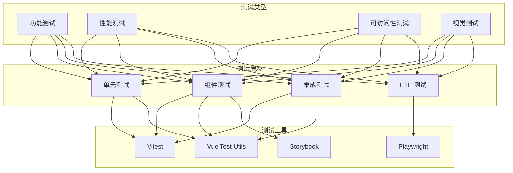

# AlkaidSYS 前端测试

## 📋 文档信息

| 项目 | 内容 |
|------|------|
| **文档名称** | AlkaidSYS 前端测试 |
| **文档版本** | v1.0 |
| **创建日期** | 2025-01-19 |

## 🎯 前端测试目标

1. **测试覆盖率** - > 80%
2. **单元测试** - 核心组件和工具函数 100% 覆盖
3. **组件测试** - 所有业务组件都有测试
4. **E2E 测试** - 核心业务流程全覆盖
5. **视觉回归测试** - 防止 UI 意外变化

## 🏗️ 测试架构



## 📦 测试工具

### 核心依赖

```json
{
  "devDependencies": {
    "vitest": "^2.1.8",
    "@vue/test-utils": "^2.4.6",
    "@vitest/ui": "^2.1.8",
    "@vitest/coverage-v8": "^2.1.8",
    "playwright": "^1.49.1",
    "@playwright/test": "^1.49.1",
    "happy-dom": "^15.11.7",
    "@storybook/test": "^8.5.0"
  }
}
```

## 🔧 Vitest 配置

```typescript
// /apps/admin/vitest.config.ts

import { defineConfig } from 'vitest/config';
import vue from '@vitejs/plugin-vue';
import vueJsx from '@vitejs/plugin-vue-jsx';
import { resolve } from 'path';

export default defineConfig({
  plugins: [vue(), vueJsx()],

  test: {
    globals: true,
    environment: 'happy-dom',
    setupFiles: ['./tests/setup.ts'],
    coverage: {
      provider: 'v8',
      reporter: ['text', 'json', 'html'],
      exclude: [
        'node_modules/',
        'tests/',
        '**/*.d.ts',
        '**/*.config.*',
        '**/mockData',
      ],
    },
    include: ['src/**/*.{test,spec}.{js,ts,jsx,tsx}'],
  },

  resolve: {
    alias: {
      '@': resolve(__dirname, 'src'),
    },
  },
});
```

## 🧪 单元测试

### 1. 工具函数测试

```typescript
// /apps/admin/src/utils/__tests__/format.test.ts

import { describe, it, expect } from 'vitest';
import { formatPrice, formatDate, formatNumber } from '../format';

describe('format utils', () => {
  describe('formatPrice', () => {
    it('should format price correctly', () => {
      expect(formatPrice(1234.56)).toBe('¥1,234.56');
      expect(formatPrice(0)).toBe('¥0.00');
      expect(formatPrice(1000000)).toBe('¥1,000,000.00');
    });

    it('should handle negative numbers', () => {
      expect(formatPrice(-100)).toBe('-¥100.00');
    });
  });

  describe('formatDate', () => {
    it('should format date correctly', () => {
      const date = new Date('2025-01-19 12:30:45');
      expect(formatDate(date)).toBe('2025-01-19');
      expect(formatDate(date, 'YYYY-MM-DD HH:mm:ss')).toBe('2025-01-19 12:30:45');
    });
  });

  describe('formatNumber', () => {
    it('should format number with thousand separator', () => {
      expect(formatNumber(1234567)).toBe('1,234,567');
      expect(formatNumber(1000)).toBe('1,000');
    });
  });
});
```

### 2. Store 测试

```typescript
// /apps/admin/src/store/modules/__tests__/auth.test.ts

import { describe, it, expect, beforeEach, vi } from 'vitest';
import { setActivePinia, createPinia } from 'pinia';
import { useAuthStore } from '../auth';
import * as authApi from '@/api/auth';

vi.mock('@/api/auth');

describe('Auth Store', () => {
  beforeEach(() => {
    setActivePinia(createPinia());
  });

  it('should initialize with default state', () => {
    const store = useAuthStore();

    expect(store.user).toBeNull();
    expect(store.roles).toEqual([]);
    expect(store.permissions).toEqual([]);
    expect(store.token).toBe('');
  });

  it('should login successfully', async () => {
    const store = useAuthStore();
    const mockResult = {
      access_token: 'test-token',
      refresh_token: 'test-refresh-token',
      user: {
        id: 1,
        username: 'admin',
        roles: ['admin'],
        permissions: ['user:list', 'user:create'],
      },
    };

    vi.mocked(authApi.login).mockResolvedValue(mockResult);

    await store.login({ username: 'admin', password: '123456' });

    expect(store.token).toBe('test-token');
    expect(store.user).toEqual(mockResult.user);
    expect(store.roles).toEqual(['admin']);
    expect(store.permissions).toEqual(['user:list', 'user:create']);
  });

  it('should check permissions correctly', () => {
    const store = useAuthStore();
    store.permissions = ['user:list', 'user:create'];

    expect(store.hasPermission('user:list')).toBe(true);
    expect(store.hasPermission('user:delete')).toBe(false);
    expect(store.hasAnyPermission(['user:list', 'user:delete'])).toBe(true);
    expect(store.hasAllPermissions(['user:list', 'user:create'])).toBe(true);
  });

  it('should logout and reset state', async () => {
    const store = useAuthStore();
    store.token = 'test-token';
    store.user = { id: 1, username: 'admin' };

    vi.mocked(authApi.logout).mockResolvedValue(undefined);

    await store.logout();

    expect(store.token).toBe('');
    expect(store.user).toBeNull();
  });
});
```

## 🎨 组件测试

### 1. ProductCard 组件测试

```typescript
// /apps/web/src/components/ProductCard/__tests__/ProductCard.test.ts

import { describe, it, expect, vi } from 'vitest';
import { mount } from '@vue/test-utils';
import ProductCard from '../index.vue';

describe('ProductCard', () => {
  const mockProduct = {
    id: 1,
    name: 'Test Product',
    description: 'Test Description',
    image: 'https://example.com/image.jpg',
    price: 99.99,
    original_price: 199.99,
    sales: 100,
    tag: 'Hot',
  };

  it('should render product information correctly', () => {
    const wrapper = mount(ProductCard, {
      props: { product: mockProduct },
    });

    expect(wrapper.find('.product-name').text()).toBe('Test Product');
    expect(wrapper.find('.product-desc').text()).toBe('Test Description');
    expect(wrapper.find('.current').text()).toBe('¥99.99');
    expect(wrapper.find('.original').text()).toBe('¥199.99');
    expect(wrapper.find('.product-sales').text()).toBe('已售 100');
    expect(wrapper.find('.product-tag').text()).toBe('Hot');
  });

  it('should not render tag when not provided', () => {
    const productWithoutTag = { ...mockProduct, tag: undefined };
    const wrapper = mount(ProductCard, {
      props: { product: productWithoutTag },
    });

    expect(wrapper.find('.product-tag').exists()).toBe(false);
  });

  it('should emit click event when clicked', async () => {
    const wrapper = mount(ProductCard, {
      props: { product: mockProduct },
    });

    await wrapper.trigger('click');

    expect(wrapper.emitted('click')).toBeTruthy();
    expect(wrapper.emitted('click')?.[0]).toEqual([mockProduct]);
  });

  it('should apply hover effect', async () => {
    const wrapper = mount(ProductCard, {
      props: { product: mockProduct },
    });

    await wrapper.trigger('mouseenter');

    // 检查样式变化
    expect(wrapper.classes()).toContain('product-card');
  });
});
```

### 2. UserAvatar 组件测试

```typescript
// /apps/admin/src/components/UserAvatar/__tests__/UserAvatar.test.ts

import { describe, it, expect } from 'vitest';
import { mount } from '@vue/test-utils';
import UserAvatar from '../index.vue';

describe('UserAvatar', () => {
  it('should render image when src is provided', () => {
    const wrapper = mount(UserAvatar, {
      props: {
        src: 'https://example.com/avatar.jpg',
        name: 'John Doe',
      },
    });

    expect(wrapper.find('img').exists()).toBe(true);
    expect(wrapper.find('img').attributes('src')).toBe('https://example.com/avatar.jpg');
  });

  it('should render initials when src is not provided', () => {
    const wrapper = mount(UserAvatar, {
      props: {
        name: 'John Doe',
      },
    });

    expect(wrapper.find('.avatar-placeholder').exists()).toBe(true);
    expect(wrapper.find('.avatar-placeholder').text()).toBe('JD');
  });

  it('should render correct size class', () => {
    const wrapper = mount(UserAvatar, {
      props: {
        name: 'John Doe',
        size: 'large',
      },
    });

    expect(wrapper.classes()).toContain('avatar-large');
  });

  it('should handle image error', async () => {
    const wrapper = mount(UserAvatar, {
      props: {
        src: 'https://example.com/invalid.jpg',
        name: 'John Doe',
      },
    });

    await wrapper.find('img').trigger('error');

    // 应该显示占位符
    expect(wrapper.find('.avatar-placeholder').exists()).toBe(true);
  });
});
```

## 🌐 E2E 测试

### 1. Playwright 配置

```typescript
// /playwright.config.ts

import { defineConfig, devices } from '@playwright/test';

export default defineConfig({
  testDir: './tests/e2e',
  fullyParallel: true,
  forbidOnly: !!process.env.CI,
  retries: process.env.CI ? 2 : 0,
  workers: process.env.CI ? 1 : undefined,
  reporter: 'html',

  use: {
    baseURL: 'http://localhost:3000',
    trace: 'on-first-retry',
    screenshot: 'only-on-failure',
  },

  projects: [
    {
      name: 'chromium',
      use: { ...devices['Desktop Chrome'] },
    },
    {
      name: 'firefox',
      use: { ...devices['Desktop Firefox'] },
    },
    {
      name: 'webkit',
      use: { ...devices['Desktop Safari'] },
    },
    {
      name: 'Mobile Chrome',
      use: { ...devices['Pixel 5'] },
    },
    {
      name: 'Mobile Safari',
      use: { ...devices['iPhone 12'] },
    },
  ],

  webServer: {
    command: 'npm run dev',
    url: 'http://localhost:3000',
    reuseExistingServer: !process.env.CI,
  },
});
```

### 2. 登录流程测试

```typescript
// /tests/e2e/auth/login.spec.ts

import { test, expect } from '@playwright/test';

test.describe('Login', () => {
  test('should login successfully with valid credentials', async ({ page }) => {
    await page.goto('/login');

    // 填写表单
    await page.fill('input[name="username"]', 'admin');
    await page.fill('input[name="password"]', '123456');

    // 点击登录按钮
    await page.click('button[type="submit"]');

    // 等待跳转到首页
    await page.waitForURL('/dashboard');

    // 验证登录成功
    expect(page.url()).toContain('/dashboard');
    await expect(page.locator('.user-info')).toBeVisible();
  });

  test('should show error with invalid credentials', async ({ page }) => {
    await page.goto('/login');

    await page.fill('input[name="username"]', 'admin');
    await page.fill('input[name="password"]', 'wrong-password');
    await page.click('button[type="submit"]');

    // 验证错误提示
    await expect(page.locator('.error-message')).toBeVisible();
    await expect(page.locator('.error-message')).toContainText('用户名或密码错误');
  });
});
```

### 3. 商品购买流程测试

```typescript
// /tests/e2e/order/purchase.spec.ts

import { test, expect } from '@playwright/test';

test.describe('Purchase Flow', () => {
  test.beforeEach(async ({ page }) => {
    // 登录
    await page.goto('/login');
    await page.fill('input[name="username"]', 'testuser');
    await page.fill('input[name="password"]', '123456');
    await page.click('button[type="submit"]');
    await page.waitForURL('/');
  });

  test('should complete purchase successfully', async ({ page }) => {
    // 1. 浏览商品
    await page.goto('/products');
    await expect(page.locator('.product-card').first()).toBeVisible();

    // 2. 点击商品进入详情页
    await page.locator('.product-card').first().click();
    await page.waitForURL(/\/product\/\d+/);

    // 3. 添加到购物车
    await page.click('button:has-text("加入购物车")');
    await expect(page.locator('.cart-badge')).toContainText('1');

    // 4. 进入购物车
    await page.click('.cart-link');
    await page.waitForURL('/cart');

    // 5. 选中商品并结算
    await page.click('.cart-item input[type="checkbox"]');
    await page.click('button:has-text("去结算")');
    await page.waitForURL('/order/confirm');

    // 6. 确认订单
    await page.click('button:has-text("提交订单")');
    await page.waitForURL(/\/payment\//);

    // 7. 验证支付页面
    await expect(page.locator('.payment-amount')).toBeVisible();
  });
});
```

## 🔒 安全测试补充：签名+时间戳+Nonce 防重放（前端）

```ts
// /apps/admin/src/utils/request-sign.ts
import crypto from 'crypto-js';

export function buildSignedHeaders(method: string, urlPathWithQuery: string, body: any, opts?: {
  appKey?: string; secret?: string; ts?: number; nonce?: string;
}) {
  const appKey = opts?.appKey ?? import.meta.env.VITE_APP_KEY;
  const secret = opts?.secret ?? import.meta.env.VITE_APP_SECRET;
  const ts = (opts?.ts ?? Math.floor(Date.now() / 1000)).toString();
  const nonce = opts?.nonce ?? Math.random().toString(36).slice(2, 14);
  const bodyStr = body ? JSON.stringify(body) : '';
  const plain = `${method.toUpperCase()}|${urlPathWithQuery}|${ts}|${nonce}|${bodyStr}`;
  const sig = crypto.HmacSHA256(plain, secret).toString(crypto.enc.Hex);
  return {
    'X-App-Key': appKey,
    'X-Timestamp': ts,
    'X-Nonce': nonce,
    'X-Signature': sig,
  } as Record<string, string>;
}
```

```ts
// /apps/admin/src/tests/security/signature.test.ts
import { describe, it, expect } from 'vitest';
import axios from 'axios';
import { buildSignedHeaders } from '@/utils/request-sign';

describe('signature anti-replay (frontend)', () => {
  const baseURL = 'http://localhost:9501';

  it('rejects expired timestamp', async () => {
    const headers = buildSignedHeaders('GET', '/api/v1/ping', undefined, { ts: Math.floor(Date.now()/1000) - 1000 });
    const res = await axios.get(`${baseURL}/api/v1/ping`, { headers, validateStatus: () => true });
    expect([400, 401, 403]).toContain(res.status);
  });

  it('rejects reused nonce', async () => {
    const fixed = { ts: Math.floor(Date.now()/1000), nonce: 'fixednonce001' };
    const headers = buildSignedHeaders('GET', '/api/v1/ping', undefined, fixed);
    const ok = await axios.get(`${baseURL}/api/v1/ping`, { headers, validateStatus: () => true });
    expect(ok.status).toBe(200);
    const replay = await axios.get(`${baseURL}/api/v1/ping`, { headers, validateStatus: () => true });
    expect(replay.status).not.toBe(200);
  });
});
```

> 与 04-security-performance 的签名中间件校验规则保持一致（300s 时间窗 + nonce 一次性）。


##    

## 📊 测试覆盖率

### 运行测试

```bash
# 运行所有测试
npm run test

# 运行单元测试
npm run test:unit

# 运行 E2E 测试
npm run test:e2e

# 生成覆盖率报告
npm run test:coverage
```

### 覆盖率要求

| 类型 | 覆盖率要求 |
|------|-----------|
| **整体覆盖率** | > 80% |
| **工具函数** | > 90% |
| **Store** | > 85% |
| **组件** | > 75% |

## 🆚 与 NIUCLOUD 前端测试对比

| 特性 | AlkaidSYS | NIUCLOUD | 优势 |
|------|-----------|----------|------|
| **测试框架** | Vitest | Jest | ✅ 更快 |
| **组件测试** | 完整覆盖 | 部分覆盖 | ✅ 更全面 |
| **E2E 测试** | Playwright | 无 | ✅ 更完善 |
| **覆盖率** | > 80% | < 50% | ✅ 更高 |
| **CI 集成** | 完整集成 | 部分集成 | ✅ 更自动化 |

---

**最后更新**: 2025-01-19
**文档版本**: v1.0
**维护者**: AlkaidSYS 架构团队

