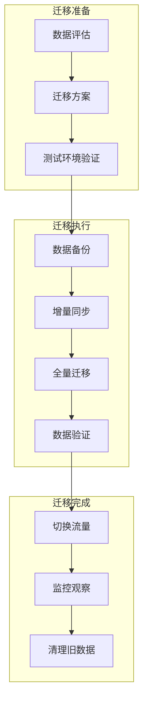
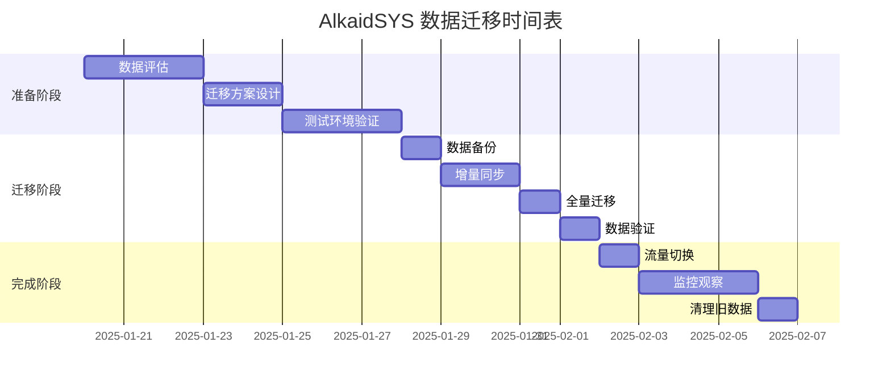

# AlkaidSYS 数据迁移

## 📋 文档信息

| 项目 | 内容 |
|------|------|
| **文档名称** | AlkaidSYS 数据迁移 |
| **文档版本** | v1.0 |
| **创建日期** | 2025-01-19 |

## 🎯 数据迁移目标

1. **零停机迁移** - 最小化业务中断时间
2. **数据完整性** - 确保数据完整无丢失
3. **可回滚** - 支持快速回滚到迁移前状态
4. **性能优化** - 大数据量迁移性能优化

## 🏗️ 数据迁移架构

> 说明：本篇文档从“执行层面”描述具体迁移流程和脚本示例，是对
> 《03-data-layer/11-database-evolution-and-migration-strategy.md》与
> 《03-data-layer/13-data-evolution-bluebook.md》所定义的数据演进流程的落地补充；
> 上述两份文档仍然是数据演进与变更流程的权威来源，实际迁移方案与检查清单如有差异以它们为准。




## 📊 迁移策略

### 1. 迁移方案选择

| 方案 | 适用场景 | 停机时间 | 复杂度 |
|------|---------|---------|--------|
| **全量迁移** | 数据量小（< 10GB） | 2-4 小时 | 低 |
| **增量迁移** | 数据量中等（10-100GB） | < 1 小时 | 中 |
| **双写迁移** | 数据量大（> 100GB） | 几乎为 0 | 高 |

### 2. 迁移时间表



## 🔧 迁移工具

### 1. 数据导出工具

```php
<?php
// /app/command/DataExport.php

namespace app\command;

use think\console\Command;
use think\console\Input;
use think\console\Output;
use think\facade\Db;

class DataExport extends Command
{
    protected function configure()
    {
        $this->setName('data:export')
            ->setDescription('导出数据到 JSON 文件');
    }

    protected function execute(Input $input, Output $output)
    {
        $output->writeln('开始导出数据...');

        $tables = [
            'tenants',
            'sites',
            'users',
            'roles',
            'permissions',
            'products',
            'orders',
        ];

        $exportDir = root_path() . 'runtime/export/' . date('YmdHis');
        if (!is_dir($exportDir)) {
            mkdir($exportDir, 0755, true);
        }

        foreach ($tables as $table) {
            $output->writeln("导出表: {$table}");
            $this->exportTable($table, $exportDir);
        }

        $output->writeln('数据导出完成！');
        $output->writeln("导出目录: {$exportDir}");
    }

    /**
     * 导出单个表
     */
    protected function exportTable(string $table, string $exportDir): void
    {
        $pageSize = 1000;
        $page = 1;
        $total = Db::table($table)->count();
        $totalPages = ceil($total / $pageSize);

        $file = fopen("{$exportDir}/{$table}.json", 'w');
        fwrite($file, "[\n");

        while ($page <= $totalPages) {
            $offset = ($page - 1) * $pageSize;
            $data = Db::table($table)
                ->limit($offset, $pageSize)
                ->select()
                ->toArray();

            foreach ($data as $index => $row) {
                $json = json_encode($row, JSON_UNESCAPED_UNICODE);
                fwrite($file, "  {$json}");

                if ($page < $totalPages || $index < count($data) - 1) {
                    fwrite($file, ",\n");
                } else {
                    fwrite($file, "\n");
                }
            }

            $page++;
        }

        fwrite($file, "]");
        fclose($file);
    }
}
```

### 2. 数据导入工具

```php
<?php
// /app/command/DataImport.php

namespace app\command;

use think\console\Command;
use think\console\Input;
use think\console\input\Argument;
use think\console\Output;
use think\facade\Db;

class DataImport extends Command
{
    protected function configure()
    {
        $this->setName('data:import')
            ->addArgument('dir', Argument::REQUIRED, '导入目录')
            ->setDescription('从 JSON 文件导入数据');
    }

    protected function execute(Input $input, Output $output)
    {
        $dir = $input->getArgument('dir');

        if (!is_dir($dir)) {
            $output->error("目录不存在: {$dir}");
            return;
        }

        $output->writeln('开始导入数据...');

        $tables = [
            'tenants',
            'sites',
            'users',
            'roles',
            'permissions',
            'products',
            'orders',
        ];

        foreach ($tables as $table) {
            $file = "{$dir}/{$table}.json";
            if (!file_exists($file)) {
                $output->warning("文件不存在: {$file}");
                continue;
            }

            $output->writeln("导入表: {$table}");
            $this->importTable($table, $file);
        }

        $output->writeln('数据导入完成！');
    }

    /**
     * 导入单个表
     */
    protected function importTable(string $table, string $file): void
    {
        $json = file_get_contents($file);
        $data = json_decode($json, true);

        if (!$data) {
            return;
        }

        // 分批插入
        $batchSize = 500;
        $batches = array_chunk($data, $batchSize);

        Db::startTrans();
        try {
            foreach ($batches as $batch) {
                Db::table($table)->insertAll($batch);
            }
            Db::commit();
        } catch (\Exception $e) {
            Db::rollback();
            throw $e;

        }
    }
}
```

### 3. 数据验证工具

> 说明：以下 DataValidate 示例仅演示命令骨架，实际实现时应结合《03-data-layer/12-multi-tenant-data-model-spec.md》《01-architecture-design/04-multi-tenant-design.md》，
> 对 `tenant_id`、`site_id` 等关键字段的存在性、引用完整性以及跨库/跨表一致性进行校验，并依据业务表补充更多校验规则。

```php
<?php
// /app/command/DataValidate.php
namespace app\command;

use think\console\Command;
use think\console\Input;
use think\console\Output;
use think\facade\Db;

class DataValidate extends Command
{
    protected function configure()
    {
        $this->setName('data:validate')
            ->setDescription('验证数据完整性');
    }

    protected function execute(Input $input, Output $output)
    {
        $output->writeln('开始验证数据...');

        $tables = [
            'tenants',
            'sites',
            'users',
            'roles',
            'permissions',
            'products',
            'orders',
        ];

        $errors = [];

        foreach ($tables as $table) {
            $output->writeln("验证表: {$table}");
            $tableErrors = $this->validateTable($table);
            if ($tableErrors) {
                $errors[$table] = $tableErrors;
            }
        }

        if (empty($errors)) {
            $output->writeln('<info>数据验证通过！</info>');
        } else {
            $output->writeln('<error>数据验证失败！</error>');
            foreach ($errors as $table => $tableErrors) {
                $output->writeln("表 {$table}:");
                foreach ($tableErrors as $error) {
                    $output->writeln("  - {$error}");
                }
            }
        }
    }

    /**
     * 验证单个表
     */
    protected function validateTable(string $table): array
    {
        $errors = [];

        // 检查记录数
        $count = Db::table($table)->count();
        if ($count === 0) {
            $errors[] = '表为空';
        }

        // 检查主键重复
        $duplicates = Db::table($table)
            ->field('id')
            ->group('id')
            ->having('COUNT(*) > 1')
            ->select();

        if ($duplicates->count() > 0) {
            $errors[] = '存在重复的主键';
        }

        // 检查必填字段
        $requiredFields = $this->getRequiredFields($table);
        foreach ($requiredFields as $field) {
            $nullCount = Db::table($table)
                ->whereNull($field)
                ->count();

            if ($nullCount > 0) {
                $errors[] = "字段 {$field} 存在 {$nullCount} 条空值";
            }
        }

        return $errors;
    }

    /**
     * 获取必填字段
     */
    protected function getRequiredFields(string $table): array
    {
        $fields = [
            'tenants' => ['code', 'name'],
            'sites' => ['tenant_id', 'code', 'name'],
            'users' => ['tenant_id', 'username', 'email'],
            'roles' => ['tenant_id', 'name', 'code'],
            'permissions' => ['name', 'code'],
            'products' => ['tenant_id', 'site_id', 'name', 'price'],
            'orders' => ['tenant_id', 'site_id', 'user_id', 'order_no', 'amount'],
        ];

        return $fields[$table] ?? [];
    }
}
```

## 📝 迁移脚本

> 重要说明（设计阶段）：本节 Shell 脚本均为**示例脚本**，用于说明推荐的迁移步骤与顺序：
> - dev/test 环境可以直接用于演练与验证；
> - stage/prod 环境必须先经过 DBA 与运维评审，按公司标准变更流程改造（例如替换 `root` 账户、补充审计与限流、避免在生产机上直接执行 `mysqldump`/`mysql`/`systemctl` 等命令）。
> 实际落地时，应以《03-data-layer/11-database-evolution-and-migration-strategy.md》《03-data-layer/13-data-evolution-bluebook.md》中关于变更审批、演练与回滚的流程与安全策略为准。
### 1. 全量迁移脚本

```bash
#!/bin/bash
# /scripts/migrate-full.sh

set -e

echo "========================================="
echo "AlkaidSYS 全量数据迁移"
echo "========================================="

# 配置
SOURCE_DB="alkaid_old"
TARGET_DB="alkaid_new"
BACKUP_DIR="/data/backup/$(date +%Y%m%d%H%M%S)"

# 1. 备份源数据库
echo "1. 备份源数据库..."
mkdir -p $BACKUP_DIR
mysqldump -u root -p --single-transaction --routines --triggers --events --databases $SOURCE_DB > $BACKUP_DIR/source.sql
echo "备份完成: $BACKUP_DIR/source.sql"

# 2. 导出数据
echo "2. 导出数据..."
php think data:export

# 3. 创建目标数据库
echo "3. 创建目标数据库..."
mysql -u root -p -e "CREATE DATABASE IF NOT EXISTS $TARGET_DB CHARACTER SET utf8mb4 COLLATE utf8mb4_unicode_ci;"

# 4. 导入表结构
echo "4. 导入表结构..."
# 注意：请先将 .env 中的 DB_DATABASE 指向 $TARGET_DB 再执行迁移
php think migrate:run

# 5. 导入数据
echo "5. 导入数据..."
EXPORT_DIR=$(ls -t runtime/export | head -1)
php think data:import runtime/export/$EXPORT_DIR

# 6. 验证数据
echo "6. 验证数据..."
php think data:validate

# 7. 完成
echo "========================================="
echo "迁移完成！"
echo "========================================="
```

### 2. 增量迁移脚本

```bash
#!/bin/bash
# /scripts/migrate-incremental.sh

set -e

echo "========================================="
echo "AlkaidSYS 增量数据迁移"
echo "========================================="

# 配置
SOURCE_DB="alkaid_old"
TARGET_DB="alkaid_new"
LAST_SYNC_TIME=$(cat /tmp/last_sync_time 2>/dev/null || echo "1970-01-01 00:00:00")

echo "上次同步时间: $LAST_SYNC_TIME"

# 1. 同步新增数据
echo "1. 同步新增数据..."
# 使用 mysqldump 生成 INSERT 语句并导入
mysqldump -u root -p --single-transaction --no-create-info --skip-triggers $SOURCE_DB users --where="created_at > '$LAST_SYNC_TIME'" > /tmp/users_insert.sql
mysql -u root -p $TARGET_DB < /tmp/users_insert.sql

# 2. 同步更新数据
echo "2. 同步更新数据..."
# 同步更新数据（使用 REPLACE 处理主键冲突）
mysqldump -u root -p --single-transaction --no-create-info --skip-triggers --replace $SOURCE_DB users --where="updated_at > '$LAST_SYNC_TIME'" > /tmp/users_update.sql
mysql -u root -p $TARGET_DB < /tmp/users_update.sql

# 3. 更新同步时间
echo "3. 更新同步时间..."
date "+%Y-%m-%d %H:%M:%S" > /tmp/last_sync_time

echo "========================================="
echo "增量同步完成！"
echo "========================================="
```

## 🔄 回滚方案

### 回滚脚本

```bash
#!/bin/bash
# /scripts/rollback.sh

set -e

echo "========================================="
echo "AlkaidSYS 数据回滚"
echo "========================================="

# 配置
BACKUP_DIR=$1

if [ -z "$BACKUP_DIR" ]; then
    echo "错误: 请指定备份目录"
    echo "用法: ./rollback.sh /data/backup/20250119120000"
    exit 1
fi

if [ ! -f "$BACKUP_DIR/source.sql" ]; then
    echo "错误: 备份文件不存在: $BACKUP_DIR/source.sql"
    exit 1
fi

# 1. 确认回滚
read -p "确认要回滚到 $BACKUP_DIR 吗？(yes/no): " confirm
if [ "$confirm" != "yes" ]; then
    echo "取消回滚"
    exit 0
fi

# 2. 停止应用
echo "1. 停止应用..."
systemctl stop alkaid-swoole

# 3. 恢复数据库
echo "2. 恢复数据库..."
mysql -u root -p alkaid < $BACKUP_DIR/source.sql

# 4. 启动应用
echo "3. 启动应用..."
systemctl start alkaid-swoole

echo "========================================="
echo "回滚完成！"
echo "========================================="
```

## 🆚 与 NIUCLOUD 数据迁移对比

| 特性 | AlkaidSYS | NIUCLOUD | 优势 |
|------|-----------|----------|------|
| **迁移工具** | 完整工具链 | 手动迁移 | ✅ 更自动化 |
| **数据验证** | 自动验证 | 手动验证 | ✅ 更可靠 |
| **回滚方案** | 一键回滚 | 手动回滚 | ✅ 更快速 |
| **增量同步** | 支持 | 不支持 | ✅ 更灵活 |
| **文档完善** | 完整文档 | 基础文档 | ✅ 更详细 |

---

**最后更新**: 2025-01-19
**文档版本**: v1.0
**维护者**: AlkaidSYS 架构团队

