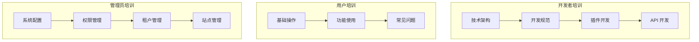
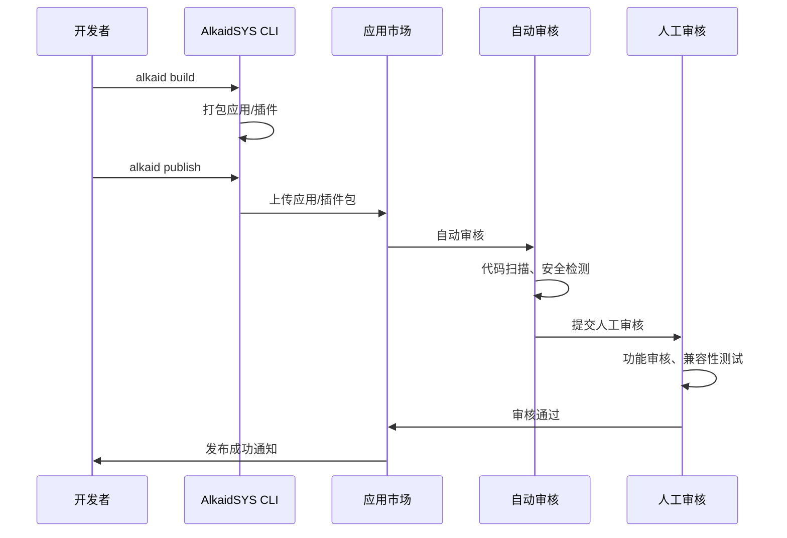

# AlkaidSYS 培训材料

## 📋 文档信息

| 项目 | 内容 |
|------|------|
| **文档名称** | AlkaidSYS 培训材料 |
| **文档版本** | v1.0 |
| **创建日期** | 2025-01-19 |

## 🎯 培训目标

1. **开发者培训** - 掌握 AlkaidSYS 技术架构和开发规范
2. **用户培训** - 熟练使用 AlkaidSYS 各项功能
3. **管理员培训** - 掌握系统配置和权限管理

## 🏗️ 培训体系

> 说明：本培训体系基于 `design/` 目录下的正式设计文档（如《01-architecture-design/02-architecture-design.md》《01-architecture-design/04-multi-tenant-design.md》《03-data-layer/09-database-design.md》《04-security-performance/11-security-design.md》等），
> 具体技术细节与约束以对应设计文档为权威来源，本篇更多聚焦于培训编排与素材组织。




## 👨‍💻 开发者培训

### 1. 技术架构培训

#### 1.1 整体架构

**培训内容**：
- AlkaidSYS 7 层架构设计
- 微服务架构原理
- 多租户架构设计
- 多站点架构设计

**培训时长**：2 小时

**培训材料**：
- PPT：`AlkaidSYS 技术架构.pptx`
- 文档：`01-alkaid-system-overview.md`、`02-architecture-design.md`

**实践练习**：
1. 绘制 AlkaidSYS 架构图
2. 理解多租户隔离机制
3. 理解多站点架构

#### 1.2 技术栈培训

**培训内容**：
- ThinkPHP 8.0 核心特性
- Swoole 5.0+ 协程编程
- Vue 3 Composition API
- Vben Admin 5.x 使用

**培训时长**：4 小时

**培训材料**：
- PPT：`AlkaidSYS 技术栈.pptx`
- 文档：`03-tech-stack-selection.md`

**实践练习**：
1. 创建一个 Swoole HTTP Server
2. 编写一个 ThinkPHP 8.0 控制器
3. 使用 Vue 3 Composition API 创建组件
4. 在 Vben Admin 中添加一个菜单

### 2. 开发规范培训

#### 2.1 代码规范

**培训内容**：
- PSR-12 编码规范
- 命名规范
- 注释规范
- Git 提交规范

**培训时长**：2 小时

**代码示例**：

```php
<?php
// 正确示例

namespace app\admin\controller;

use app\common\model\User;
use think\Request;

/**
 * 用户控制器
 */
class UserController
{
    /**
     * 获取用户列表
     *
     * @param Request $request
     * @return \think\response\Json
     */
    public function index(Request $request)
    {
        $page = $request->param('page', 1);
        $pageSize = $request->param('page_size', 20);

        $list = User::paginate([
            'list_rows' => $pageSize,
            'page' => $page,
        ]);

        return json([
            'code' => 200,
            'message' => 'success',
            'data' => $list,
        ]);
    }
}
```

#### 2.2 数据库规范

**培训内容**：
- 表命名规范
- 字段命名规范
- 索引设计规范
- 迁移文件规范

**培训时长**：2 小时

**代码示例**：

```php
<?php
// 迁移文件示例

use think\migration\Migrator;
use think\migration\db\Column;

class CreateUsersTable extends Migrator
{
    public function change()
    {
        $table = $this->table('users', [
            'id' => false,
            'primary_key' => ['id'],
            'engine' => 'InnoDB',
            'collation' => 'utf8mb4_unicode_ci',
            'comment' => '用户表',
        ]);

        $table->addColumn('id', 'integer', [
            'limit' => 11,
            'signed' => false,
            'identity' => true,
            'comment' => '用户ID',
        ])
        ->addColumn('tenant_id', 'integer', [
            'limit' => 11,
            'signed' => false,
            'comment' => '租户ID',
        ])
        ->addColumn('username', 'string', [
            'limit' => 50,
            'comment' => '用户名',
        ])
        ->addColumn('email', 'string', [
            'limit' => 100,
            'comment' => '邮箱',
        ])
        ->addColumn('created_at', 'datetime', [
            'null' => true,
            'comment' => '创建时间',
        ])
        ->addColumn('updated_at', 'datetime', [
            'null' => true,
            'comment' => '更新时间',
        ])
        ->addIndex(['tenant_id'], ['name' => 'idx_tenant_id'])
        ->addIndex(['username'], ['unique' => true, 'name' => 'uk_username'])
        ->addIndex(['email'], ['unique' => true, 'name' => 'uk_email'])
        ->create();
    }
}
```

### 3. 插件开发培训

#### 3.1 插件结构

**培训内容**：
- 插件目录结构
- 插件配置文件
- 插件生命周期
- 插件钩子机制

**培训时长**：3 小时

**代码示例**：

```php
<?php
// /addons/example/Plugin.php

namespace addons\example;

use app\common\plugin\BasePlugin;

class Plugin extends BasePlugin
{
    /**
     * 插件信息
     */
    public function info(): array
    {
        return [
            'name' => 'example',
            'title' => '示例插件',
            'description' => '这是一个示例插件',
            'version' => '1.0.0',
            'author' => 'AlkaidSYS',
        ];
    }

    /**
     * 插件安装
     */
    public function install(): bool
    {
        // 创建数据表
        // 初始化数据
        return true;
    }

    /**
     * 插件卸载
     */
    public function uninstall(): bool
    {
        // 删除数据表
        // 清理数据
        return true;
    }

    /**
     * 插件启用
     */
    public function enable(): bool
    {
        // 注册路由
        // 注册钩子
        return true;
    }

    /**
     * 插件禁用
     */
    public function disable(): bool
    {
        // 注销路由
        // 注销钩子
        return true;
    }
}
```

### 4. 应用开发培训

#### 4.1 应用开发快速入门

**培训内容**：
- 应用和插件的区别
- 应用目录结构
- manifest.json 配置
- 应用生命周期（install/uninstall/upgrade/enable/disable）
- 数据库迁移（install.sql/uninstall.sql/upgrade.sql）
- 路由和菜单注册
- 前端界面开发

**培训时长**：4 小时

**培训材料**：
- PPT：`AlkaidSYS 应用开发.pptx`
- 文档：`31-application-development-guide.md`

**代码示例**：

```php
<?php
// /addons/applications/ecommerce-shop/Application.php

namespace addons\applications\ecommerce_shop;

use app\common\application\BaseApplication;
use think\facade\Db;

class Application extends BaseApplication
{
    /**
     * 应用安装
     */
    public function install(): bool
    {
        Db::startTrans();
        try {
            // 执行安装 SQL
            $this->executeSqlFile('install.sql');

            // 初始化数据
            $this->initData();

            // 注册菜单
            $this->registerMenus();

            // 注册路由
            $this->registerRoutes();

            // 注册钩子
            $this->registerHooks();

            // 触发事件
            event('ApplicationInstalled', ['app_key' => $this->getKey()]);

            Db::commit();
            return true;
        } catch (\Exception $e) {
            Db::rollback();
            throw $e;
        }
    }

    /**
     * 应用卸载
     */
    public function uninstall(bool $keepData = false): bool
    {
        Db::startTrans();
        try {
            // 注销钩子
            $this->unregisterHooks();

            // 注销路由
            $this->unregisterRoutes();

            // 注销菜单
            $this->unregisterMenus();

            // 删除数据（可选）
            if (!$keepData) {
                $this->executeSqlFile('uninstall.sql');
            }

            // 触发事件
            event('ApplicationUninstalled', ['app_key' => $this->getKey()]);

            Db::commit();
            return true;
        } catch (\Exception $e) {
            Db::rollback();
            throw $e;
        }
    }

    /**
     * 应用升级
     */
    public function upgrade(string $fromVersion, string $toVersion): bool
    {
        // 执行升级 SQL
        $upgradeFile = "upgrade/{$fromVersion}_to_{$toVersion}.sql";
        if (file_exists($this->getPath() . '/database/' . $upgradeFile)) {
            $this->executeSqlFile($upgradeFile);
        }

        return true;
    }
}
```

**实践练习**：
1. 创建一个简单的电商应用（包含商品管理功能）
2. 编写 manifest.json 配置文件
3. 编写 install.sql 和 uninstall.sql
4. 实现应用的安装和卸载功能
5. 开发前端商品列表页面

#### 4.2 应用开发最佳实践

**培训内容**：
- 应用目录结构规范
- 数据库表命名规范（使用应用前缀）
- 路由命名规范
- 菜单设计规范
- 配置管理最佳实践
- 钩子使用最佳实践
- 错误处理和日志记录

**培训时长**：2 小时

**最佳实践示例**：

```php
<?php
// 数据库表命名：使用应用前缀
// 应用 key: ecommerce-shop
// 表名: ecommerce_shop_products, ecommerce_shop_orders

// 路由命名：使用应用前缀
Route::group('ecommerce-shop', function () {
    Route::get('products', 'product/index');
    Route::post('products', 'product/create');
});

// 菜单设计：清晰的层级结构
[
    'title' => '电商管理',
    'icon' => 'shopping-cart',
    'children' => [
        ['title' => '商品管理', 'path' => '/ecommerce-shop/products'],
        ['title' => '订单管理', 'path' => '/ecommerce-shop/orders'],
    ]
]

// 配置管理：使用 config.php
return [
    'payment' => [
        'type' => 'select',
        'title' => '支付方式',
        'options' => ['wechat' => '微信支付', 'alipay' => '支付宝'],
        'default' => 'wechat',
    ],
];
```

#### 4.3 应用开发常见问题

**培训内容**：
- 应用安装失败的排查
- 数据库迁移错误处理
- 路由冲突解决
- 菜单不显示的问题
- 钩子不生效的问题
- 应用升级注意事项

**培训时长**：1 小时

### 5. 插件开发培训

#### 5.1 插件开发快速入门

**培训内容**：
- 插件和应用的区别
- 插件分类（通用插件 vs 应用专属插件）
- 插件目录结构
- plugin.json 配置
- 插件生命周期
- 钩子机制详解（Action/Filter/Event Hooks）
- 钩子优先级

**培训时长**：4 小时

**培训材料**：
- PPT：`AlkaidSYS 插件开发.pptx`
- 文档：`32-plugin-development-guide.md`

**代码示例**：

```php
<?php
// /addons/plugins/universal/payment-wechat/Plugin.php

namespace addons\plugins\universal\payment_wechat;

use app\common\plugin\BasePlugin;

class Plugin extends BasePlugin
{
    /**
     * 注册钩子
     */
    protected function registerHooks(): void
    {
        // 注册支付创建钩子（优先级 10）
        hook('PaymentCreate', [$this, 'onPaymentCreate'], 10);

        // 注册支付查询钩子
        hook('PaymentQuery', [$this, 'onPaymentQuery'], 10);

        // 注册支付退款钩子
        hook('PaymentRefund', [$this, 'onPaymentRefund'], 10);

        // 注册支付回调钩子
        hook('PaymentNotify', [$this, 'onPaymentNotify'], 10);
    }

    /**
     * 处理支付创建
     */
    public function onPaymentCreate(array $params): array
    {
        // 调用微信支付 API
        $result = $this->wechatPayService->create($params);

        return [
            'payment_no' => $result['prepay_id'],
            'payment_data' => $result,
        ];
    }

    /**
     * 处理支付查询
     */
    public function onPaymentQuery(array $params): array
    {
        // 查询微信支付订单状态
        $result = $this->wechatPayService->query($params['payment_no']);

        return [
            'status' => $result['trade_state'],
            'paid_at' => $result['success_time'] ?? null,
        ];
    }
}
```

**实践练习**：
1. 创建一个简单的支付插件（支持微信支付）
2. 编写 plugin.json 配置文件
3. 实现支付创建、查询、退款功能
4. 测试钩子机制
5. 测试钩子优先级

#### 5.2 钩子机制详解

**培训内容**：
- Action Hooks（动作钩子）- 执行代码，无返回值
- Filter Hooks（过滤钩子）- 修改数据，有返回值
- Event Hooks（事件钩子）- 监听系统事件
- 钩子优先级控制
- 多个插件的钩子执行顺序

**培训时长**：2 小时

**代码示例**：

```php
<?php
// Action Hook - 订单创建后执行
do_action('OrderCreated', $order->toArray());

// 插件处理
public function onOrderCreated(array $order): void
{
    // 发送订单通知
    $this->sendOrderNotification($order);
}

// Filter Hook - 修改订单金额
$amount = apply_filter('OrderAmount', $order->amount, $order->toArray());

// 插件处理（优惠券插件，优先级 10）
public function filterOrderAmount(float $amount, array $order): float
{
    if ($order['coupon_id']) {
        $amount = $amount * 0.9; // 9 折
    }
    return $amount;
}

// 插件处理（会员折扣插件，优先级 20）
public function filterOrderAmount(float $amount, array $order): float
{
    if ($order['member_level'] >= 3) {
        $amount = $amount * 0.95; // 95 折
    }
    return $amount;
}

// Event Hook - 监听支付成功事件
event('PaymentSuccess', $payment->toArray());

// 插件处理
public function onPaymentSuccess(array $payment): void
{
    // 更新订单状态
    $this->updateOrderStatus($payment['order_id'], 'paid');
}
```

#### 5.3 插件开发常见问题

**培训内容**：
- 插件安装失败的排查
- 钩子不生效的问题
- 钩子优先级冲突
- 插件依赖管理
- 插件版本兼容性

**培训时长**：1 小时

### 6. 开发者生态培训

#### 6.1 如何成为认证开发者

**培训内容**：
- 开发者注册流程
- 实名认证流程
- 开发者认证流程
- 开发者等级体系（L1-L4）
- 等级提升条件
- 等级权益说明

**培训时长**：1 小时

**培训材料**：
- PPT：`AlkaidSYS 开发者生态.pptx`
- 文档：`06-5-developer-ecosystem-design.md`

**开发者等级体系**：

| 等级 | 名称 | 条件 | 权益 |
|------|------|------|------|
| L1 | 普通开发者 | 完成开发者认证 | 发布免费应用/插件 |
| L2 | 认证开发者 | 发布 3 个应用/插件 + 平均评分 ≥ 4.0 | 发布付费应用/插件 |
| L3 | 金牌开发者 | 发布 10 个应用/插件 + 平均评分 ≥ 4.5 + 总下载量 ≥ 10000 | 更高分成比例 + 优先推荐 |
| L4 | 钻石开发者 | 发布 30 个应用/插件 + 平均评分 ≥ 4.8 + 总下载量 ≥ 100000 | 最高分成比例 + 专属支持 |

#### 6.2 如何发布和推广应用/插件

**培训内容**：
- 应用/插件发布流程
- 应用/插件审核机制（自动审核 + 人工审核）
- 应用/插件定价策略
- 应用/插件推广技巧
- 应用/插件评价管理
- 应用/插件版本更新

**培训时长**：2 小时

**发布流程**：



#### 6.3 如何提高收益

**培训内容**：
- 收益分成机制（基础分成 + 等级加成）
- 定价策略（免费、付费、订阅）
- 提高下载量的技巧
- 提高评分的技巧
- 提升开发者等级
- 收益提现流程

**培训时长**：1 小时

**收益分成机制**：

**基础分成比例**：

| 价格区间 | 平台分成 | 开发者分成 |
|---------|---------|-----------|
| ≤ 49 元 | 30% | 70% |
| 50-199 元 | 25% | 75% |
| 200-499 元 | 20% | 80% |
| ≥ 500 元 | 15% | 85% |

**等级加成**：
- L3 金牌开发者：额外 +5% 分成
- L4 钻石开发者：额外 +10% 分成

**示例**：
- 应用定价 299 元，基础分成 80%（239.2 元）
- L3 金牌开发者：额外 +5%（14.95 元），总计 254.15 元
- L4 钻石开发者：额外 +10%（29.9 元），总计 269.1 元

### 7. API 开发培训

#### 7.1 RESTful API 设计

**培训内容**：
- RESTful 设计原则
- API 版本管理
- 请求/响应格式
- 错误处理

**培训时长**：3 小时

**代码示例**：

```php
<?php
// /app/api/controller/v1/ProductController.php

namespace app\api\controller\v1;

use app\common\model\Product;
use think\Request;

class ProductController
{
    /**
     * 获取商品列表
     * GET /api/v1/products
     */
    public function index(Request $request)
    {
        $page = $request->param('page', 1);
        $pageSize = $request->param('page_size', 20);
        $keyword = $request->param('keyword', '');

        $query = Product::where('status', 1);

        if ($keyword) {
            $query->where('name', 'like', "%{$keyword}%");
        }

        $list = $query->paginate([
            'list_rows' => $pageSize,
            'page' => $page,
        ]);

        return json([
            'code' => 200,
            'message' => 'success',
            'data' => [
                'list' => $list->items(),
                'total' => $list->total(),
                'page' => $page,
                'page_size' => $pageSize,
            ],
        ]);
    }

    /**
     * 获取商品详情
     * GET /api/v1/products/:id
     */
    public function read(int $id)
    {
        $product = Product::find($id);

        if (!$product) {
            return json([
                'code' => 404,
                'message' => '商品不存在',
            ], 404);
        }

        return json([
            'code' => 200,
            'message' => 'success',
            'data' => $product,
        ]);
    }

    /**
     * 创建商品
     * POST /api/v1/products
     */
    public function save(Request $request)
    {
        $data = $request->only([
            'name',
            'description',
            'price',
            'stock',
        ]);

        // 验证数据
        $validate = \think\facade\Validate::make([
            'name' => 'require|max:100',
            'price' => 'require|float|>:0',
            'stock' => 'require|integer|>=:0',
        ]);

        if (!$validate->check($data)) {
            return json([
                'code' => 400,
                'message' => $validate->getError(),
            ], 400);
        }

        $product = Product::create($data);

        return json([
            'code' => 201,
            'message' => 'success',
            'data' => $product,
        ], 201);
    }
}
```

## 👥 用户培训

### 1. 基础操作培训

**培训内容**：
- 登录系统
- 修改个人信息
- 修改密码
- 切换租户/站点

**培训时长**：1 小时

**培训材料**：
- 视频：`AlkaidSYS 基础操作.mp4`
- 文档：`用户操作手册.pdf`

### 2. 功能使用培训

**培训内容**：
- 商品管理
- 订单管理
- 用户管理
- 数据统计

**培训时长**：2 小时

**培训材料**：
- 视频：`AlkaidSYS 功能使用.mp4`
- 文档：`功能使用手册.pdf`

### 3. 常见问题培训

**培训内容**：
- 忘记密码怎么办？
- 如何切换租户？
- 如何导出数据？
- 如何联系客服？

**培训时长**：1 小时

**培训材料**：
- 文档：`常见问题FAQ.pdf`

## 🔧 管理员培训

### 1. 系统配置培训

**培训内容**：
- 系统基础配置
- 支付配置
- 短信配置
- OSS 配置

**培训时长**：2 小时

**配置示例**：

```php
<?php
// /config/payment.php

return [
    // 微信支付
    'wechat' => [
        'app_id' => env('wechat.app_id', ''),
        'mch_id' => env('wechat.mch_id', ''),
        'key' => env('wechat.key', ''),
        'cert_path' => env('wechat.cert_path', ''),
        'key_path' => env('wechat.key_path', ''),
    ],

    // 支付宝
    'alipay' => [
        'app_id' => env('alipay.app_id', ''),
        'private_key' => env('alipay.private_key', ''),
        'public_key' => env('alipay.public_key', ''),
    ],
];
```

### 2. 权限管理培训

**培训内容**：
- 角色管理
- 权限分配
- 用户授权
- 权限测试

**培训时长**：3 小时

**培训材料**：
- PPT：`AlkaidSYS 权限管理.pptx`
- 文档：`11-security-design.md`

### 3. 租户管理培训

**培训内容**：
- 创建租户
- 租户配置
- 租户隔离
- 租户数据管理

**培训时长**：2 小时

**培训材料**：
- PPT：`AlkaidSYS 租户管理.pptx`
- 文档：`04-multi-tenant-design.md`

### 4. 站点管理培训

**培训内容**：
- 创建站点
- 站点配置
- 域名绑定
- 站点数据管理

**培训时长**：2 小时

**培训材料**：
- PPT：`AlkaidSYS 站点管理.pptx`
- 文档：`05-multi-site-design.md`

## 📚 培训计划

### 开发者培训计划

| 天数 | 时间 | 内容 | 讲师 |
|------|------|------|------|
| Day 1 | 09:00-11:00 | 技术架构 | 架构师 |
| Day 1 | 14:00-18:00 | 技术栈 | 技术专家 |
| Day 2 | 09:00-11:00 | 代码规范 | 开发组长 |
| Day 2 | 14:00-16:00 | 数据库规范 | DBA |
| Day 3 | 09:00-12:00 | 插件开发 | 插件专家 |
| Day 3 | 14:00-17:00 | API 开发 | API 专家 |

### 用户培训计划

| 天数 | 时间 | 内容 | 讲师 |
|------|------|------|------|
| Day 1 | 09:00-10:00 | 基础操作 | 产品经理 |
| Day 1 | 10:00-12:00 | 功能使用 | 产品经理 |
| Day 1 | 14:00-15:00 | 常见问题 | 客服主管 |

### 管理员培训计划

| 天数 | 时间 | 内容 | 讲师 |
|------|------|------|------|
| Day 1 | 09:00-11:00 | 系统配置 | 运维工程师 |
| Day 1 | 14:00-17:00 | 权限管理 | 安全专家 |
| Day 2 | 09:00-11:00 | 租户管理 | 架构师 |
| Day 2 | 14:00-16:00 | 站点管理 | 架构师 |

## 🆚 与 NIUCLOUD 培训材料对比

| 特性 | AlkaidSYS | NIUCLOUD | 优势 |
|------|-----------|----------|------|
| **培训体系** | 完整体系 | 基础培训 | ✅ 更系统 |
| **培训材料** | 丰富多样 | 文档为主 | ✅ 更全面 |
| **实践练习** | 大量练习 | 少量练习 | ✅ 更实用 |
| **培训计划** | 详细计划 | 简单计划 | ✅ 更完善 |

---

**最后更新**: 2025-01-19
**文档版本**: v1.0
**维护者**: AlkaidSYS 架构团队

