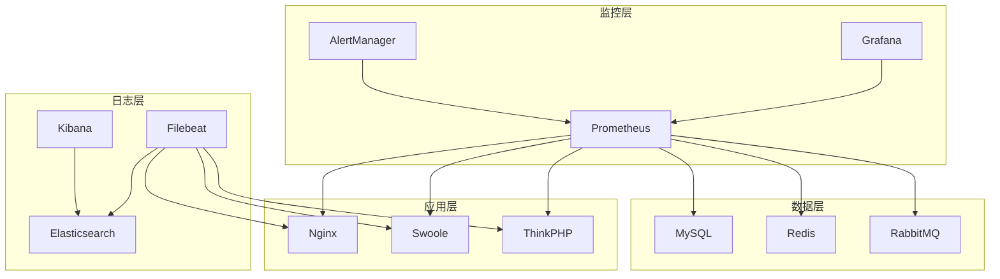
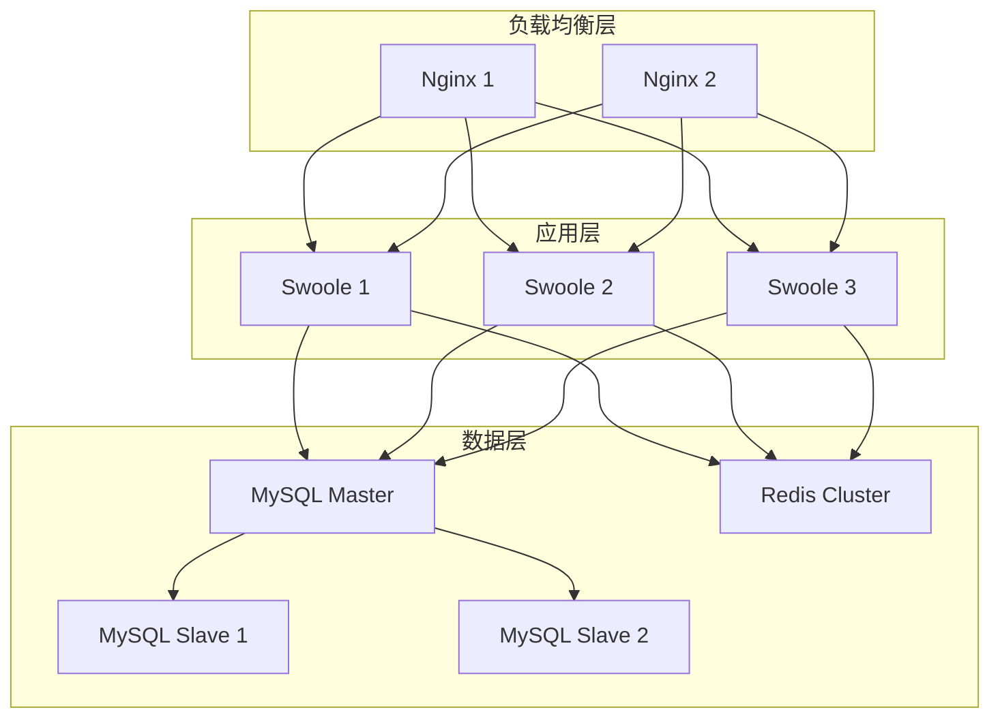
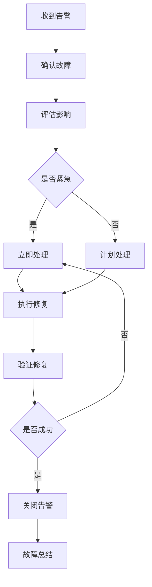

# AlkaidSYS 运维手册

## 📋 文档信息

| 项目 | 内容 |
|------|------|
| **文档名称** | AlkaidSYS 运维手册 |
| **文档版本** | v1.0 |
| **创建日期** | 2025-01-19 |

## 🎯 运维目标

1. **高可用** - 系统可用性 > 99.9%
2. **高性能** - 响应时间 P95 < 500ms
3. **安全稳定** - 零安全事故
4. **快速恢复** - 故障恢复时间 < 30 分钟

## 🏗️ 运维架构

> 说明：本运维手册侧重于日常部署、监控与故障处理，是对《05-deployment-testing/14-deployment-guide.md》《05-deployment-testing/17-configuration-and-environment-management.md》、
> 《04-security-performance/10-non-functional-overview.md》《03-data-layer/13-data-evolution-bluebook.md》等文档的运维视角补充；上述文档仍然是部署拓扑、非功能性目标与数据演进策略的权威来源。




## 🚀 部署流程

### 1. 单机部署

#### 1.1 环境要求

```bash
# 操作系统
CentOS 7.9+ / Ubuntu 20.04+

# PHP
PHP 8.2+
Swoole 5.0+

# 数据库
MySQL 8.0+
Redis 6.0+

# Web 服务器
Nginx 1.20+
```

#### 1.2 部署步骤

```bash
#!/bin/bash
# /scripts/deploy-single.sh

set -e

echo "========================================="
echo "AlkaidSYS 单机部署"
echo "========================================="

# 1. 安装依赖
echo "1. 安装依赖..."
yum install -y git nginx mysql-server redis

# 2. 安装 PHP 8.2
echo "2. 安装 PHP 8.2..."
yum install -y php82 php82-cli php82-fpm php82-mysql php82-redis php82-json php82-mbstring

# 3. 安装 Swoole
echo "3. 安装 Swoole..."
pecl install swoole

# 4. 克隆代码
echo "4. 克隆代码..."
cd /data
git clone https://github.com/alkaid/alkaid-sys.git
cd alkaid-sys

# 5. 安装 Composer 依赖
echo "5. 安装 Composer 依赖..."
composer install --no-dev

# 6. 配置环境变量
echo "6. 配置环境变量..."
cp .env.example .env
# 修改 .env 文件

# 7. 创建数据库
echo "7. 创建数据库..."
mysql -u root -p -e "CREATE DATABASE alkaid CHARACTER SET utf8mb4 COLLATE utf8mb4_unicode_ci;"

# 8. 运行迁移
echo "8. 运行迁移..."
php think migrate:run

# 9. 配置 Nginx
echo "9. 配置 Nginx..."
cp /data/alkaid-sys/deploy/nginx/alkaid.conf /etc/nginx/conf.d/
systemctl reload nginx

# 10. 启动 Swoole
echo "10. 启动 Swoole..."
php think swoole start -d

echo "========================================="
echo "部署完成！"
echo "访问地址: http://your-domain.com"
echo "========================================="
```

### 2. 集群部署

#### 2.1 架构设计



#### 2.2 部署步骤

```bash
#!/bin/bash
# /scripts/deploy-cluster.sh

set -e

echo "========================================="
echo "AlkaidSYS 集群部署"
echo "========================================="

# 1. 部署负载均衡
echo "1. 部署负载均衡..."
ansible-playbook -i inventory/production playbooks/nginx.yml

# 2. 部署应用服务器
echo "2. 部署应用服务器..."
ansible-playbook -i inventory/production playbooks/swoole.yml

# 3. 部署数据库集群
echo "3. 部署数据库集群..."
ansible-playbook -i inventory/production playbooks/mysql.yml

# 4. 部署 Redis 集群
echo "4. 部署 Redis 集群..."
ansible-playbook -i inventory/production playbooks/redis.yml

echo "========================================="
echo "集群部署完成！"

echo "========================================="
```

### 3. Docker 部署

> 说明：本节 Docker/Docker Compose 配置主要用于本地开发与测试环境的快速启动示例；
> 生产环境建议结合 Kubernetes/集群部署方案，并严格遵循《04-security-performance/10-non-functional-overview.md》《05-deployment-testing/14-deployment-guide.md》中关于高可用与安全加固的要求。

#### 3.1 Docker Compose 配置

```yaml
# /docker-compose.yml

version: '3.8'

services:
  nginx:
    image: nginx:1.20
    ports:
      - "80:80"
      - "443:443"
    volumes:
      - ./deploy/nginx/alkaid.conf:/etc/nginx/conf.d/default.conf
      - ./public:/var/www/html/public
    depends_on:
      - swoole
    networks:
      - alkaid-network

  swoole:
    build:
      context: .
      dockerfile: Dockerfile
    ports:
      - "9501:9501"
    volumes:
      - .:/var/www/html
    environment:
      - DB_HOST=mysql
      - DB_PORT=3306
      - DB_DATABASE=alkaid
      - DB_USERNAME=root
      - DB_PASSWORD=root
      - REDIS_HOST=redis
      - REDIS_PORT=6379
    depends_on:
      - mysql
      - redis
    networks:
      - alkaid-network

  mysql:
    image: mysql:8.0
    ports:
      - "3306:3306"
    environment:
      - MYSQL_ROOT_PASSWORD=root
      - MYSQL_DATABASE=alkaid
    volumes:
      - mysql-data:/var/lib/mysql
    networks:
      - alkaid-network

  redis:
    image: redis:6.2
    ports:
      - "6379:6379"
    volumes:
      - redis-data:/data
    networks:
      - alkaid-network

volumes:
  mysql-data:
  redis-data:

networks:
  alkaid-network:
    driver: bridge
```

#### 3.2 Dockerfile

```dockerfile
# /Dockerfile

FROM php:8.2-cli

# 安装系统依赖
RUN apt-get update && apt-get install -y \
    git \
    curl \
    libpng-dev \
    libonig-dev \
    libxml2-dev \
    zip \
    unzip

# 安装 PHP 扩展
RUN docker-php-ext-install pdo_mysql mbstring exif pcntl bcmath gd

# 安装 Swoole
RUN pecl install swoole \
    && docker-php-ext-enable swoole

# 安装 Redis
RUN pecl install redis \
    && docker-php-ext-enable redis

# 安装 Composer
COPY --from=composer:latest /usr/bin/composer /usr/bin/composer

# 设置工作目录
WORKDIR /var/www/html

# 复制代码
COPY . .

# 安装依赖
RUN composer install --no-dev --optimize-autoloader

# 暴露端口
EXPOSE 9501

# 启动命令
CMD ["php", "think", "swoole", "start"]
```

## 📊 监控告警

### 1. Prometheus 配置

```yaml
# /deploy/prometheus/prometheus.yml

global:
  scrape_interval: 15s
  evaluation_interval: 15s

scrape_configs:
  # Swoole 监控
  - job_name: 'swoole'
    static_configs:
      - targets: ['localhost:9502']

  # MySQL 监控
  - job_name: 'mysql'
    static_configs:
      - targets: ['localhost:9104']

  # Redis 监控
  - job_name: 'redis'
    static_configs:
      - targets: ['localhost:9121']

  # Nginx 监控
  - job_name: 'nginx'
    static_configs:
      - targets: ['localhost:9113']
```

### 2. Grafana 仪表盘

**关键指标**：
- QPS（每秒请求数）

> 提示：以下监控指标与告警阈值仅作为起点示例，实际配置应结合《04-security-performance/10-non-functional-overview.md》中定义的 SLO/SLA 目标以及线上观测数据进行调整。

- 响应时间（P50、P95、P99）
- 错误率
- CPU 使用率
- 内存使用率
- 数据库连接数
- Redis 命中率

### 3. AlertManager 告警规则

```yaml
# /deploy/prometheus/alert-rules.yml

groups:
  - name: alkaid-alerts
    interval: 30s
    rules:
      # 高错误率告警
      - alert: HighErrorRate
        expr: rate(http_requests_total{status=~"5.."}[5m]) > 0.05
        for: 5m
        labels:
          severity: critical
        annotations:
          summary: "高错误率告警"
          description: "错误率超过 5%"

      # 高响应时间告警
      - alert: HighResponseTime
        expr: histogram_quantile(0.95, rate(http_request_duration_seconds_bucket[5m])) > 1
        for: 5m
        labels:
          severity: warning
        annotations:
          summary: "高响应时间告警"
          description: "P95 响应时间超过 1 秒"

      # 数据库连接数告警
      - alert: HighDatabaseConnections
        expr: mysql_global_status_threads_connected > 100
        for: 5m
        labels:
          severity: warning
        annotations:
          summary: "数据库连接数过高"
          description: "数据库连接数超过 100"
```

## 🔧 故障处理

### 1. 常见故障

#### 1.1 Swoole 进程异常退出

**现象**：
- Swoole 进程突然退出
- 无法访问服务

**排查步骤**：
```bash
# 1. 查看 Swoole 日志
tail -f runtime/swoole.log

# 2. 查看系统日志
tail -f /var/log/messages

# 3. 检查内存使用
free -h

# 4. 检查磁盘空间
df -h
```

**解决方案**：
```bash
# 1. 重启 Swoole
php think swoole restart

# 2. 如果内存不足，增加内存或优化代码
# 3. 如果磁盘空间不足，清理日志文件
```

#### 1.2 数据库连接超时

**现象**：
- 数据库连接超时
- 大量慢查询

**排查步骤**：
```bash
# 1. 查看数据库连接数
mysql -u root -p -e "SHOW PROCESSLIST;"

# 2. 查看慢查询日志
tail -f /var/log/mysql/slow.log

# 3. 检查数据库性能
mysqladmin -u root -p status
```

**解决方案**：
```bash
# 1. 优化慢查询
# 2. 增加数据库连接池大小
# 3. 增加数据库服务器资源
```

#### 1.3 Redis 内存溢出

**现象**：
- Redis 内存使用率 100%
- 缓存失效

**排查步骤**：
```bash
# 1. 查看 Redis 内存使用
redis-cli INFO memory

# 2. 查看 Redis 键数量
redis-cli DBSIZE

# 3. 查看大键
redis-cli --bigkeys
```

**解决方案**：
```bash
# 1. 清理过期键
redis-cli FLUSHDB

# 2. 增加 Redis 内存
# 3. 优化缓存策略
```

### 2. 故障处理流程



## ⚡ 性能调优

### 1. Swoole 调优

```php
<?php
// /config/swoole.php

return [
    'server' => [
        'worker_num' => swoole_cpu_num() * 2,
        'max_request' => 10000,
        'max_conn' => 10000,
        'task_worker_num' => swoole_cpu_num(),
        'task_max_request' => 5000,
        'enable_coroutine' => true,
        'max_coroutine' => 100000,
        'hook_flags' => SWOOLE_HOOK_ALL,

        // 缓冲区设置
        'buffer_output_size' => 2 * 1024 * 1024,
        'socket_buffer_size' => 128 * 1024 * 1024,

        // 心跳检测
        'heartbeat_check_interval' => 60,
        'heartbeat_idle_time' => 600,
    ],
];
```

### 2. MySQL 调优

```ini
# /etc/my.cnf

[mysqld]
# 连接数
max_connections = 1000

# 缓冲池
innodb_buffer_pool_size = 4G
innodb_buffer_pool_instances = 4

# 日志
innodb_log_file_size = 512M
innodb_log_buffer_size = 16M

# 查询缓存
query_cache_size = 0
query_cache_type = 0

# 慢查询
slow_query_log = 1
long_query_time = 1
```

### 3. Redis 调优

```ini
# /etc/redis.conf

# 内存
maxmemory 4gb
maxmemory-policy allkeys-lru

# 持久化
save 900 1
save 300 10
save 60 10000

# AOF
appendonly yes
appendfsync everysec
```

## 🆚 与 NIUCLOUD 运维对比

| 特性 | AlkaidSYS | NIUCLOUD | 优势 |
|------|-----------|----------|------|
| **部署方式** | 多种方式 | 单机为主 | ✅ 更灵活 |
| **监控告警** | 完整体系 | 基础监控 | ✅ 更完善 |
| **故障处理** | 详细流程 | 简单流程 | ✅ 更规范 |
| **性能调优** | 全面调优 | 部分调优 | ✅ 更深入 |

---

**最后更新**: 2025-01-19
**文档版本**: v1.0
**维护者**: AlkaidSYS 架构团队

