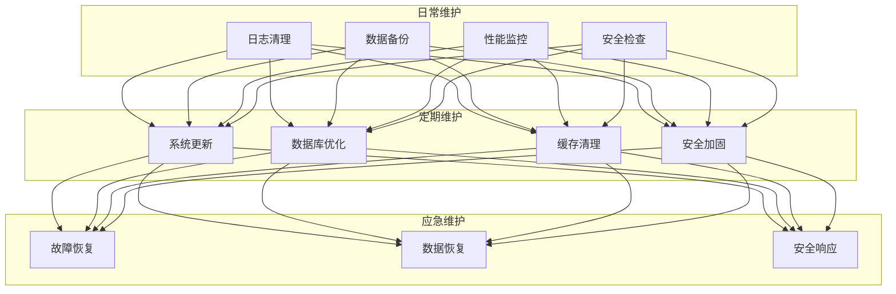
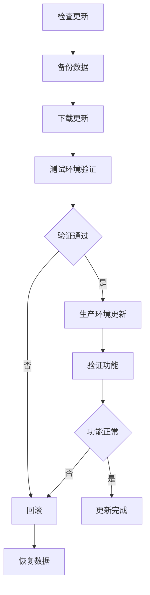
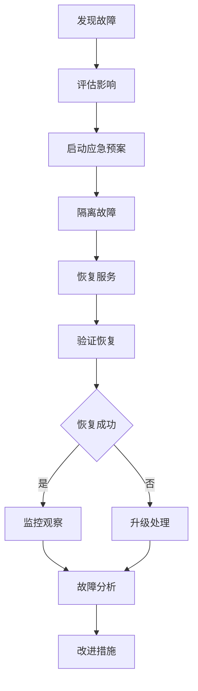

# AlkaidSYS 维护指南

## 📋 文档信息

| 项目 | 内容 |
|------|------|
| **文档名称** | AlkaidSYS 维护指南 |
| **文档版本** | v1.0 |
| **创建日期** | 2025-01-19 |

## 🎯 维护目标

1. **系统稳定** - 保持系统稳定运行
2. **数据安全** - 确保数据安全可靠
3. **性能优化** - 持续优化系统性能
4. **及时更新** - 及时更新系统版本

## 🏗️ 维护体系



## 📅 日常维护

### 1. 日志清理

#### 1.1 清理脚本

```bash
#!/bin/bash
# /scripts/clean-logs.sh

set -e

echo "========================================="
echo "AlkaidSYS 日志清理"
echo "========================================="

# 配置
LOG_DIR="/data/alkaid-sys/runtime/log"
KEEP_DAYS=30

# 1. 清理应用日志
echo "1. 清理应用日志..."
find $LOG_DIR -name "*.log" -mtime +$KEEP_DAYS -delete

# 2. 清理 Swoole 日志
echo "2. 清理 Swoole 日志..."
find /data/alkaid-sys/runtime -name "swoole*.log" -mtime +$KEEP_DAYS -delete

# 3. 清理 Nginx 日志
echo "3. 清理 Nginx 日志..."
find /var/log/nginx -name "*.log" -mtime +$KEEP_DAYS -delete

# 4. 清理 MySQL 日志
echo "4. 清理 MySQL 日志..."
find /var/log/mysql -name "*.log" -mtime +$KEEP_DAYS -delete

echo "========================================="
echo "日志清理完成！"
echo "========================================="
```

#### 1.2 定时任务

```bash
# 添加到 crontab
# 每天凌晨 2 点执行
0 2 * * * /data/alkaid-sys/scripts/clean-logs.sh >> /var/log/clean-logs.log 2>&1
```

### 2. 数据备份

#### 2.1 备份脚本

```bash
#!/bin/bash
# /scripts/backup.sh

set -e

echo "========================================="
echo "AlkaidSYS 数据备份"
echo "========================================="

# 配置
BACKUP_DIR="/data/backup"
DATE=$(date +%Y%m%d%H%M%S)
KEEP_DAYS=7

# 创建备份目录
mkdir -p $BACKUP_DIR/$DATE

# 1. 备份数据库
echo "1. 备份数据库..."
mysqldump -u root -p --single-transaction --routines --triggers --events alkaid > $BACKUP_DIR/$DATE/database.sql
gzip $BACKUP_DIR/$DATE/database.sql

# 2. 备份 Redis
echo "2. 备份 Redis..."
redis-cli SAVE
cp /var/lib/redis/dump.rdb $BACKUP_DIR/$DATE/
gzip $BACKUP_DIR/$DATE/dump.rdb

# 3. 备份代码
echo "3. 备份代码..."
tar -czf $BACKUP_DIR/$DATE/code.tar.gz /data/alkaid-sys

# 4. 备份上传文件
echo "4. 备份上传文件..."
tar -czf $BACKUP_DIR/$DATE/uploads.tar.gz /data/alkaid-sys/public/uploads

# 5. 清理旧备份
echo "5. 清理旧备份..."
find $BACKUP_DIR -type d -mtime +$KEEP_DAYS -exec rm -rf {} \;

# 6. 上传到云存储（可选）
echo "6. 上传到云存储..."
# aws s3 sync $BACKUP_DIR/$DATE s3://alkaid-backup/$DATE

echo "========================================="
echo "备份完成！"
echo "备份目录: $BACKUP_DIR/$DATE"
echo "========================================="
```

#### 2.2 定时任务

```bash
# 添加到 crontab
# 每天凌晨 3 点执行
0 3 * * * /data/alkaid-sys/scripts/backup.sh >> /var/log/backup.log 2>&1
```

### 3. 性能监控

#### 3.1 监控脚本

```bash
#!/bin/bash
# /scripts/monitor.sh

set -e

echo "========================================="
echo "AlkaidSYS 性能监控"
echo "========================================="

# 1. CPU 使用率
echo "1. CPU 使用率:"
top -bn1 | grep "Cpu(s)" | sed "s/.*, *\([0-9.]*\)%* id.*/\1/" | awk '{print 100 - $1"%"}'

# 2. 内存使用率
echo "2. 内存使用率:"
free -m | awk 'NR==2{printf "%.2f%%\n", $3*100/$2 }'

# 3. 磁盘使用率
echo "3. 磁盘使用率:"
df -h | grep -vE '^Filesystem|tmpfs|cdrom' | awk '{ print $5 " " $1 }'

# 4. Swoole 进程状态
echo "4. Swoole 进程状态:"
ps aux | grep swoole | grep -v grep

# 5. MySQL 连接数
echo "5. MySQL 连接数:"
mysql -u root -p -e "SHOW STATUS LIKE 'Threads_connected';"

# 6. Redis 内存使用
echo "6. Redis 内存使用:"
redis-cli INFO memory | grep used_memory_human

echo "========================================="
echo "监控完成！"
echo "========================================="
```

### 4. 安全检查

#### 4.1 安全检查脚本

```bash
#!/bin/bash
# /scripts/security-check.sh

set -e

echo "========================================="
echo "AlkaidSYS 安全检查"
echo "========================================="

# 1. 检查文件权限
echo "1. 检查文件权限..."
find /data/alkaid-sys -type f -perm 0777 -ls

# 2. 检查可疑进程
echo "2. 检查可疑进程..."
ps aux | grep -E 'nc|ncat|netcat' | grep -v grep

# 3. 检查登录失败记录
echo "3. 检查登录失败记录..."
grep "Failed password" /var/log/secure | tail -20

# 4. 检查开放端口
echo "4. 检查开放端口..."
netstat -tuln | grep LISTEN

# 5. 检查防火墙状态
echo "5. 检查防火墙状态..."
systemctl status firewalld

echo "========================================="
echo "安全检查完成！"
echo "========================================="
```

## 🔄 定期维护

### 1. 系统更新

#### 1.1 更新流程



#### 1.2 更新脚本

```bash
#!/bin/bash
# /scripts/update.sh

set -e

echo "========================================="
echo "AlkaidSYS 系统更新"
echo "========================================="

# 1. 备份数据
echo "1. 备份数据..."
/data/alkaid-sys/scripts/backup.sh

# 2. 停止服务
echo "2. 停止服务..."
php think swoole stop

# 3. 拉取最新代码
echo "3. 拉取最新代码..."
cd /data/alkaid-sys
git pull origin main

# 4. 更新依赖
echo "4. 更新依赖..."
composer install --no-dev

# 5. 运行迁移
echo "5. 运行迁移..."
php think migrate:run

# 6. 清理缓存
echo "6. 清理缓存..."
php think cache:clear

# 7. 启动服务
echo "7. 启动服务..."
php think swoole start -d

# 8. 验证服务
echo "8. 验证服务..."
sleep 5
curl -I http://localhost:9501

echo "========================================="
echo "更新完成！"
echo "========================================="
```

### 2. 数据库优化

#### 2.1 优化脚本

```bash
#!/bin/bash
# /scripts/optimize-database.sh

set -e

echo "========================================="
echo "AlkaidSYS 数据库优化"
echo "========================================="

# 1. 分析表
echo "1. 分析表..."
mysql -u root -p alkaid -e "
    ANALYZE TABLE tenants;
    ANALYZE TABLE sites;
    ANALYZE TABLE users;
    ANALYZE TABLE products;
    ANALYZE TABLE orders;
"

# 2. 优化表
echo "2. 优化表..."
mysql -u root -p alkaid -e "
    OPTIMIZE TABLE tenants;
    OPTIMIZE TABLE sites;
    OPTIMIZE TABLE users;
    OPTIMIZE TABLE products;
    OPTIMIZE TABLE orders;
"

# 3. 检查表
echo "3. 检查表..."
mysql -u root -p alkaid -e "
    CHECK TABLE tenants;
    CHECK TABLE sites;
    CHECK TABLE users;
    CHECK TABLE products;
    CHECK TABLE orders;
"

echo "========================================="
echo "数据库优化完成！"
echo "========================================="
```

### 3. 缓存清理

> 警告：以下示例脚本包含 `redis-cli FLUSHDB` 等高风险命令，dev/test 环境可以直接使用；
> 在 stage/prod 环境必须按照公司运维规范改造为对指定实例/指定数据库的精确清理，避免误删生产数据。


#### 3.1 清理脚本

```bash
#!/bin/bash
# /scripts/clear-cache.sh

set -e

echo "========================================="
echo "AlkaidSYS 缓存清理"
echo "========================================="

# 1. 清理应用缓存
echo "1. 清理应用缓存..."
php think cache:clear

# 2. 清理 Redis 缓存
echo "2. 清理 Redis 缓存..."
redis-cli FLUSHDB

# 3. 清理 Opcache
echo "3. 清理 Opcache..."
php -r "opcache_reset();"

# 4. 清理 Swoole Table
echo "4. 清理 Swoole Table..."
php think swoole reload

echo "========================================="
echo "缓存清理完成！"

echo "========================================="
```

### 4. 安全加固

> 说明：本节安全加固脚本仅作为推荐步骤清单示例，实际执行前必须结合操作系统版本与公司安全基线进行审查；
> 尤其是权限相关命令（如 `chmod -R 777`）在生产环境应改为“最小权限原则”配置，并参考《04-security-performance/11-security-design.md》《05-deployment-testing/17-configuration-and-environment-management.md》的要求。
#### 4.1 加固脚本

```bash
#!/bin/bash
# /scripts/security-hardening.sh

set -e

echo "========================================="
echo "AlkaidSYS 安全加固"
echo "========================================="

# 1. 更新系统
echo "1. 更新系统..."
yum update -y

# 2. 配置防火墙
echo "2. 配置防火墙..."
firewall-cmd --permanent --add-service=http
firewall-cmd --permanent --add-service=https
firewall-cmd --reload

# 3. 禁用 root 远程登录
echo "3. 禁用 root 远程登录..."
sed -i 's/PermitRootLogin yes/PermitRootLogin no/' /etc/ssh/sshd_config
systemctl restart sshd

# 4. 配置 fail2ban
echo "4. 配置 fail2ban..."
yum install -y fail2ban
systemctl enable fail2ban
systemctl start fail2ban

# 5. 设置文件权限
echo "5. 设置文件权限..."
chown -R www:www /data/alkaid-sys
chmod -R 755 /data/alkaid-sys
chmod -R 777 /data/alkaid-sys/runtime

echo "========================================="
echo "安全加固完成！"
echo "========================================="
```

## 🚨 应急维护

### 1. 故障恢复

#### 1.1 恢复流程



### 2. 数据恢复

#### 2.1 恢复脚本

```bash
#!/bin/bash
# /scripts/restore.sh

set -e

echo "========================================="
echo "AlkaidSYS 数据恢复"
echo "========================================="

# 配置
BACKUP_DIR=$1

if [ -z "$BACKUP_DIR" ]; then
    echo "错误: 请指定备份目录"
    echo "用法: ./restore.sh /data/backup/20250119030000"
    exit 1
fi

# 1. 停止服务
echo "1. 停止服务..."
php think swoole stop

# 2. 恢复数据库
echo "2. 恢复数据库..."
gunzip < $BACKUP_DIR/database.sql.gz | mysql -u root -p alkaid

# 3. 恢复 Redis
echo "3. 恢复 Redis..."
systemctl stop redis
gunzip < $BACKUP_DIR/dump.rdb.gz > /var/lib/redis/dump.rdb
systemctl start redis

# 4. 恢复代码
echo "4. 恢复代码..."
tar -xzf $BACKUP_DIR/code.tar.gz -C /

# 5. 恢复上传文件
echo "5. 恢复上传文件..."
tar -xzf $BACKUP_DIR/uploads.tar.gz -C /

# 6. 启动服务
echo "6. 启动服务..."
php think swoole start -d

echo "========================================="
echo "数据恢复完成！"
echo "========================================="
```

## 📋 维护检查清单

### 日常检查（每天）

- [ ] 检查系统日志
- [ ] 检查错误日志
- [ ] 检查性能指标
- [ ] 检查备份状态

### 周检查（每周）

- [ ] 清理日志文件
- [ ] 检查磁盘空间
- [ ] 检查数据库性能
- [ ] 检查安全日志

### 月检查（每月）

- [ ] 系统更新
- [ ] 数据库优化
- [ ] 缓存清理
- [ ] 安全加固

### 季度检查（每季度）

- [ ] 全面性能测试
- [ ] 安全审计
- [ ] 灾难恢复演练
- [ ] 文档更新

## 🆚 与 NIUCLOUD 维护对比

| 特性 | AlkaidSYS | NIUCLOUD | 优势 |
|------|-----------|----------|------|
| **维护脚本** | 完整脚本 | 部分脚本 | ✅ 更自动化 |
| **备份恢复** | 自动化 | 半自动化 | ✅ 更可靠 |
| **安全加固** | 完整方案 | 基础方案 | ✅ 更安全 |
| **检查清单** | 详细清单 | 简单清单 | ✅ 更规范 |

---

**最后更新**: 2025-01-19
**文档版本**: v1.0
**维护者**: AlkaidSYS 架构团队

