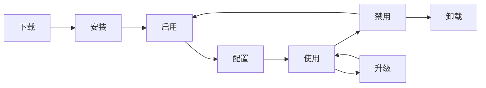

# AlkaidSYS 应用开发指南

## 📋 文档信息

| 项目 | 内容 |
|------|------|
| **文档名称** | AlkaidSYS 应用开发指南 |
| **文档版本** | v1.0 |
| **创建日期** | 2025-01-19 |

## 目录（新增）
- [前端项目使用 @alkaidsys/sdk](#sdk-usage)

## 🎯 应用开发概述

本指南将帮助开发者快速上手 AlkaidSYS 应用开发，从环境搭建到应用发布的完整流程。

### 应用类型

AlkaidSYS 支持 6 大类应用：

| 应用类型 | 说明 | 示例 |
|---------|------|------|
| **电商应用** | 电子商务相关 | 商城、拼团、秒杀 |
| **OA 应用** | 办公自动化 | 审批、考勤、任务 |
| **CRM 应用** | 客户关系管理 | 客户、线索、商机 |
| **ERP 应用** | 企业资源计划 | 采购、库存、财务 |
| **CMS 应用** | 内容管理系统 | 文章、页面、媒体 |
| **AI 应用** | 人工智能应用 | 智能客服、数据分析 |

## 🛠️ 开发环境搭建

### 1. 系统要求

```bash
# 必需环境
- PHP >= 8.2
- MySQL >= 8.0
- Redis >= 6.0
- Composer >= 2.0
- Node.js >= 18.0
- npm >= 9.0

# 推荐环境
- PHP 8.2
- MySQL 8.0
- Redis 7.0
- Swoole 5.0+
```

### 2. 安装 AlkaidSYS 框架

```bash
# 克隆框架代码
git clone https://github.com/alkaid/alkaid-sys.git
cd alkaid-sys

# 安装 PHP 依赖
composer install

# 安装前端依赖
cd admin
npm install

# 配置环境变量
cp .env.example .env
vim .env

# 运行数据库迁移
php think migrate:run

# 启动开发服务器
php think run
```

### 3. 安装 AlkaidSYS CLI 工具

```bash
# 全局安装 CLI 工具
composer global require alkaid/cli

# 验证安装
alkaid --version
```

## 📁 应用目录结构

### 1. 标准目录结构

```
my-ecommerce/                    # 应用根目录
├── manifest.json                # 应用元数据（必需）
├── Application.php              # 应用主类（必需）
├── install.sql                  # 安装 SQL（可选）
├── uninstall.sql                # 卸载 SQL（可选）
├── upgrade/                     # 升级脚本目录
│   ├── 1.0.0_to_1.1.0.sql
│   └── 1.1.0_to_1.2.0.sql
├── config/                      # 配置文件目录
│   ├── app.php                  # 应用配置
│   ├── database.php             # 数据库配置
│   └── routes.php               # 路由配置
├── controller/                  # 控制器目录
│   ├── admin/                   # 后台控制器
│   │   ├── ProductController.php
│   │   └── OrderController.php
│   ├── api/                     # API 控制器
│   │   ├── ProductController.php
│   │   └── OrderController.php
│   └── web/                     # 前台控制器
│       └── IndexController.php
├── model/                       # 模型目录
│   ├── Product.php
│   ├── Order.php
│   └── OrderItem.php
├── service/                     # 服务目录
│   ├── ProductService.php
│   ├── OrderService.php
│   └── CartService.php
├── validate/                    # 验证器目录
│   ├── ProductValidate.php
│   └── OrderValidate.php
├── view/                        # 视图目录
│   ├── admin/                   # 后台视图
│   └── web/                     # 前台视图
├── lang/                        # 语言包目录
│   ├── zh-cn.php
│   └── en-us.php
├── public/                      # 静态资源目录
│   ├── css/
│   ├── js/
│   └── images/
├── admin/                       # 后台前端（Vue 3）
│   ├── src/
│   │   ├── views/
│   │   ├── components/
│   │   └── api/
│   ├── package.json
│   └── vite.config.ts
└── README.md                    # 应用说明文档
```

### 2. 使用 CLI 创建应用

```bash
# 创建应用项目
alkaid init app my-ecommerce

# 进入应用目录
cd my-ecommerce

# 查看目录结构
tree -L 2
```

## 📝 manifest.json 配置详解

### 1. 完整配置示例

```json
{
  "key": "ecommerce",
  "name": "电子商城",
  "type": "app",
  "category": "ecommerce",
  "version": "1.0.0",
  "description": "功能完整的电子商城应用，支持商品管理、订单管理、会员管理等",
  "author": {
    "name": "AlkaidSYS Team",
    "email": "dev@alkaid.com",
    "website": "https://alkaid.com"
  },
  "icon": "icon.png",
  "cover": "cover.png",
  "screenshots": [
    "screenshot1.png",
    "screenshot2.png",
    "screenshot3.png"
  ],
  "price": 0,
  "license": "MIT",
  "tags": ["电商", "商城", "订单", "会员"],
  "min_framework_version": "1.0.0",
  "max_framework_version": "2.0.0",
  "dependencies": {
    "apps": [],
    "plugins": []
  },
  "permissions": [
    "database.read",
    "database.write",
    "file.upload",
    "api.call"
  ],
  "menus": [
    {
      "name": "商品管理",
      "icon": "ShoppingOutlined",
      "route": "/ecommerce/product",
      "children": [
        {
          "name": "商品列表",
          "route": "/ecommerce/product/list"
        },
        {
          "name": "商品分类",
          "route": "/ecommerce/product/category"
        }
      ]
    },
    {
      "name": "订单管理",
      "icon": "FileTextOutlined",
      "route": "/ecommerce/order",
      "children": [
        {
          "name": "订单列表",
          "route": "/ecommerce/order/list"
        },
        {
          "name": "退款管理",
          "route": "/ecommerce/order/refund"
        }
      ]
    }
  ],
  "routes": [
    {
      "path": "/api/ecommerce/product",
      "method": "GET",
      "controller": "api\\ProductController@index"
    },
    {
      "path": "/api/ecommerce/product/:id",
      "method": "GET",
      "controller": "api\\ProductController@detail"
    },
    {
      "path": "/api/ecommerce/order",
      "method": "POST",
      "controller": "api\\OrderController@create"
    }
  ],
  "hooks": [
    "UserLogin",
    "UserLogout",
    "OrderCreated",
    "OrderPaid",
    "OrderShipped"
  ],
  "config": {
    "default_currency": {
      "type": "select",
      "label": "默认货币",
      "options": ["CNY", "USD", "EUR"],
      "default": "CNY"
    },
    "default_language": {
      "type": "select",
      "label": "默认语言",
      "options": ["zh-cn", "en-us"],
      "default": "zh-cn"
    },
    "enable_coupon": {
      "type": "switch",
      "label": "启用优惠券",
      "default": true
    }
  },
  "changelog": "1.0.0 版本发布\n- 商品管理功能\n- 订单管理功能\n- 会员管理功能"
}
```

### 2. 配置字段说明

| 字段 | 类型 | 必填 | 说明 |
|------|------|------|------|
| key | string | 是 | 应用唯一标识（小写字母、数字、下划线） |
| name | string | 是 | 应用名称 |
| type | string | 是 | 类型（固定为 "app"） |
| category | string | 是 | 分类（ecommerce/oa/crm/erp/cms/ai） |
| version | string | 是 | 版本号（x.y.z 格式） |
| description | string | 是 | 应用描述 |
| author | object | 是 | 作者信息 |
| icon | string | 否 | 应用图标 |
| cover | string | 否 | 应用封面 |
| screenshots | array | 否 | 应用截图 |
| price | number | 否 | 价格（0 表示免费） |
| license | string | 否 | 许可证 |
| tags | array | 否 | 标签 |
| dependencies | object | 否 | 依赖项 |
| permissions | array | 否 | 权限列表 |
| menus | array | 否 | 菜单配置 |
| routes | array | 否 | 路由配置 |
| hooks | array | 否 | 钩子列表 |
| config | object | 否 | 配置项 |
| changelog | string | 否 | 更新日志 |
> **依赖与版本说明：** `dependencies` 字段，以及应用在实际实现中可能携带的 `min_framework_version` / `min_app_version` 等约束，其语义和兼容矩阵以 `02-app-plugin-ecosystem` 模块中的“应用与插件依赖与版本策略”设计文档为权威来源。本指南中的示例仅用于说明字段结构，具体版本范围与冲突处理策略请以该设计文档为准。


## 🔄 应用生命周期

### 1. 生命周期钩子



### 2. Application.php 主类

```php
<?php
namespace app\ecommerce;

use alkaid\Application as BaseApplication;
use think\facade\Db;

/**
 * 电子商城应用
 */
class Application extends BaseApplication
{
    /**
     * 安装应用
     */
    public function install(): bool
    {
        try {
            // 1. 执行安装 SQL
            $this->executeSqlFile('install.sql');

            // 2. 初始化数据
            $this->initData();

            // 3. 注册菜单
            $this->registerMenus();

            // 4. 注册路由
            $this->registerRoutes();

            // 5. 注册钩子
            $this->registerHooks();

            // 6. 触发安装事件
            event('ApplicationInstalled', [
                'app_key' => $this->getKey()
            ]);

            return true;

        } catch (\Exception $e) {
            // 回滚安装
            $this->rollbackInstall();
            throw $e;
        }
    }

    /**
     * 卸载应用
     */
    public function uninstall(bool $keepData = false): bool
    {
        try {
            // 1. 注销钩子
            $this->unregisterHooks();

            // 2. 注销路由
            $this->unregisterRoutes();

            // 3. 注销菜单
            $this->unregisterMenus();

            // 4. 清理数据（如果不保留数据）
            if (!$keepData) {
                $this->executeSqlFile('uninstall.sql');
            }

            // 5. 触发卸载事件
            event('ApplicationUninstalled', [
                'app_key' => $this->getKey(),
                'keep_data' => $keepData
            ]);

            return true;

        } catch (\Exception $e) {
            throw $e;
        }
    }

    /**
     * 升级应用
     */
    public function upgrade(string $fromVersion, string $toVersion): bool
    {
        try {
            // 1. 执行升级 SQL
            $upgradeFile = "upgrade/{$fromVersion}_to_{$toVersion}.sql";
            if (file_exists($this->getPath() . $upgradeFile)) {
                $this->executeSqlFile($upgradeFile);
            }

            // 2. 执行升级脚本
            $this->executeUpgradeScript($fromVersion, $toVersion);

            // 3. 更新版本号
            $this->updateVersion($toVersion);

            // 4. 触发升级事件
            event('ApplicationUpgraded', [
                'app_key' => $this->getKey(),
                'from_version' => $fromVersion,
                'to_version' => $toVersion
            ]);

            return true;

        } catch (\Exception $e) {
            throw $e;
        }
    }

    /**
     * 启用应用
     */
    public function enable(): bool
    {
        // 触发启用事件
        event('ApplicationEnabled', [
            'app_key' => $this->getKey()
        ]);

        return true;
    }

    /**
     * 禁用应用
     */
    public function disable(): bool
    {
        // 触发禁用事件
        event('ApplicationDisabled', [
            'app_key' => $this->getKey()
        ]);

        return true;
    }

    /**
     * 初始化数据
     */
    protected function initData(): void
    {
        // 初始化商品分类
        Db::name('ecommerce_categories')->insertAll([
            ['name' => '数码产品', 'sort' => 1, 'created_at' => time()],
            ['name' => '服装鞋包', 'sort' => 2, 'created_at' => time()],
            ['name' => '食品饮料', 'sort' => 3, 'created_at' => time()]
        ]);
    }

    /**
     * 执行 SQL 文件
     */
    protected function executeSqlFile(string $filename): void
    {
        $sqlPath = $this->getPath() . $filename;
        if (!file_exists($sqlPath)) {
            return;
        }

        $sql = file_get_contents($sqlPath);
        $statements = array_filter(explode(';', $sql));

        foreach ($statements as $statement) {
            $statement = trim($statement);
            if (!empty($statement)) {
                Db::execute($statement);
            }
        }
    }
}
```

## 📊 数据库迁移
> 说明：本节示例 SQL 主要用于本地开发 / 测试环境快速建表与联调，**不直接代表生产环境的最终建模与迁移脚本**。
> 多租户字段（如 `tenant_id` / `site_id`）的约束、索引设计以及生产环境迁移流程，请以以下设计文档为权威来源：
> - `01-architecture-design/04-multi-tenant-design.md`
> - `03-data-layer/12-multi-tenant-data-model-spec.md`
> - `03-data-layer/11-database-evolution-and-migration-strategy.md`
> - `03-data-layer/13-data-evolution-bluebook.md`
> 特别是 stage / production 环境必须通过“数据演进蓝皮书 + 迁移策略”中定义的变更流程执行。


### 1. install.sql 示例

```sql
-- 商品表
CREATE TABLE IF NOT EXISTS `ecommerce_products` (
  `id` int(11) unsigned NOT NULL AUTO_INCREMENT COMMENT '商品 ID',
  `tenant_id` int(11) unsigned NOT NULL COMMENT '租户 ID',
  `site_id` int(11) unsigned DEFAULT NULL COMMENT '站点 ID',
  `category_id` int(11) unsigned NOT NULL COMMENT '分类 ID',
  `name` varchar(200) NOT NULL COMMENT '商品名称',
  `price` decimal(10,2) NOT NULL COMMENT '价格',
  `stock` int(11) NOT NULL DEFAULT '0' COMMENT '库存',
  `sales` int(11) NOT NULL DEFAULT '0' COMMENT '销量',
  `status` tinyint(1) NOT NULL DEFAULT '1' COMMENT '状态：1-上架 0-下架',
  `created_at` int(11) NOT NULL COMMENT '创建时间',
  `updated_at` int(11) DEFAULT NULL COMMENT '更新时间',
  PRIMARY KEY (`id`),
  KEY `idx_tenant_id` (`tenant_id`),
  KEY `idx_category_id` (`category_id`),
  KEY `idx_status` (`status`)
) ENGINE=InnoDB DEFAULT CHARSET=utf8mb4 COMMENT='商品表';

-- 订单表
CREATE TABLE IF NOT EXISTS `ecommerce_orders` (
  `id` int(11) unsigned NOT NULL AUTO_INCREMENT COMMENT '订单 ID',
  `tenant_id` int(11) unsigned NOT NULL COMMENT '租户 ID',
  `site_id` int(11) unsigned DEFAULT NULL COMMENT '站点 ID',
  `order_no` varchar(50) NOT NULL COMMENT '订单号',
  `user_id` int(11) unsigned NOT NULL COMMENT '用户 ID',
  `total_amount` decimal(10,2) NOT NULL COMMENT '订单总额',
  `status` tinyint(1) NOT NULL DEFAULT '0' COMMENT '状态：0-待支付 1-已支付 2-已发货 3-已完成 -1-已取消',
  `created_at` int(11) NOT NULL COMMENT '创建时间',
  `paid_at` int(11) DEFAULT NULL COMMENT '支付时间',
  PRIMARY KEY (`id`),
  UNIQUE KEY `uk_order_no` (`order_no`),
  KEY `idx_tenant_id` (`tenant_id`),
  KEY `idx_user_id` (`user_id`),
  KEY `idx_status` (`status`)
) ENGINE=InnoDB DEFAULT CHARSET=utf8mb4 COMMENT='订单表';

-- 订单明细表
CREATE TABLE IF NOT EXISTS `ecommerce_order_items` (
  `id` int(11) unsigned NOT NULL AUTO_INCREMENT COMMENT '明细 ID',
  `order_id` int(11) unsigned NOT NULL COMMENT '订单 ID',
  `product_id` int(11) unsigned NOT NULL COMMENT '商品 ID',
  `product_name` varchar(200) NOT NULL COMMENT '商品名称',
  `price` decimal(10,2) NOT NULL COMMENT '单价',
  `quantity` int(11) NOT NULL COMMENT '数量',
  `total_amount` decimal(10,2) NOT NULL COMMENT '小计',
  PRIMARY KEY (`id`),
  KEY `idx_order_id` (`order_id`),
  KEY `idx_product_id` (`product_id`)
) ENGINE=InnoDB DEFAULT CHARSET=utf8mb4 COMMENT='订单明细表';
```

### 2. uninstall.sql 示例

```sql
-- 删除订单明细表
DROP TABLE IF EXISTS `ecommerce_order_items`;

-- 删除订单表
DROP TABLE IF EXISTS `ecommerce_orders`;

-- 删除商品表
DROP TABLE IF EXISTS `ecommerce_products`;

-- 删除分类表
DROP TABLE IF EXISTS `ecommerce_categories`;
```

### 3. 升级脚本示例（1.0.0_to_1.1.0.sql）

```sql
-- 添加商品图片字段
ALTER TABLE `ecommerce_products`
ADD COLUMN `images` text COMMENT '商品图片（JSON）' AFTER `name`;

-- 添加商品详情字段
ALTER TABLE `ecommerce_products`
ADD COLUMN `detail` text COMMENT '商品详情' AFTER `images`;

-- 添加订单备注字段
ALTER TABLE `ecommerce_orders`
ADD COLUMN `remark` varchar(500) DEFAULT NULL COMMENT '订单备注' AFTER `status`;
```

## 🎨 前端开发

### 1. 后台前端（Vue 3 + Vben Admin）

#### 商品列表页面

```vue
<template>
  <div class="product-list">
    <!-- 搜索栏 -->
    <div class="search-bar">
      <el-form :inline="true" :model="searchForm">
        <el-form-item label="商品名称">
          <el-input v-model="searchForm.name" placeholder="请输入商品名称" />
        </el-form-item>
        <el-form-item label="分类">
          <el-select v-model="searchForm.category_id" placeholder="请选择分类">
            <el-option
              v-for="category in categories"
              :key="category.id"
              :label="category.name"
              :value="category.id"
            />
          </el-select>
        </el-form-item>
        <el-form-item>
          <el-button type="primary" @click="handleSearch">搜索</el-button>
          <el-button @click="handleReset">重置</el-button>
        </el-form-item>
      </el-form>
    </div>

    <!-- 操作栏 -->
    <div class="toolbar">
      <el-button type="primary" @click="handleAdd">新增商品</el-button>
      <el-button type="danger" @click="handleBatchDelete">批量删除</el-button>
    </div>

    <!-- 数据表格 -->
    <el-table
      :data="products"
      @selection-change="handleSelectionChange"
    >
      <el-table-column type="selection" width="55" />
      <el-table-column prop="id" label="ID" width="80" />
      <el-table-column prop="name" label="商品名称" />
      <el-table-column prop="category_name" label="分类" />
      <el-table-column prop="price" label="价格">
        <template #default="{ row }">
          ¥{{ row.price }}
        </template>
      </el-table-column>
      <el-table-column prop="stock" label="库存" />
      <el-table-column prop="sales" label="销量" />
      <el-table-column prop="status" label="状态">
        <template #default="{ row }">
          <el-tag :type="row.status === 1 ? 'success' : 'danger'">
            {{ row.status === 1 ? '上架' : '下架' }}
          </el-tag>
        </template>
      </el-table-column>
      <el-table-column label="操作" width="200">
        <template #default="{ row }">
          <el-button size="small" @click="handleEdit(row)">编辑</el-button>
          <el-button size="small" type="danger" @click="handleDelete(row)">删除</el-button>
        </template>
      </el-table-column>
    </el-table>

    <!-- 分页 -->
    <el-pagination
      v-model:current-page="currentPage"
      v-model:page-size="pageSize"
      :total="total"
      layout="total, prev, pager, next, jumper"
      @current-change="loadProducts"
    />
  </div>
</template>

<script setup lang="ts">
import { ref, onMounted } from 'vue'
import { getProductList, deleteProduct } from '@/api/ecommerce/product'
import { ElMessage, ElMessageBox } from 'element-plus'

const searchForm = ref({
  name: '',
  category_id: ''
})

const categories = ref([])
const products = ref([])
const selectedProducts = ref([])
const currentPage = ref(1)
const pageSize = ref(20)
const total = ref(0)

// 加载商品列表
const loadProducts = async () => {
  const res = await getProductList({
    ...searchForm.value,
    page: currentPage.value,
    page_size: pageSize.value
  })
  products.value = res.data.list
  total.value = res.data.total
}

// 搜索
const handleSearch = () => {
  currentPage.value = 1
  loadProducts()
}

// 重置
const handleReset = () => {
  searchForm.value = {
    name: '',
    category_id: ''
  }
  handleSearch()
}

// 新增
const handleAdd = () => {
  // 跳转到新增页面
  window.location.href = '/ecommerce/product/add'
}

// 编辑
const handleEdit = (row: any) => {
  // 跳转到编辑页面
  window.location.href = `/ecommerce/product/edit/${row.id}`
}

// 删除
const handleDelete = async (row: any) => {
  await ElMessageBox.confirm('确定要删除该商品吗？', '提示', {
    type: 'warning'
  })

  await deleteProduct(row.id)
  ElMessage.success('删除成功')
  loadProducts()
}

// 批量删除
const handleBatchDelete = async () => {
  if (selectedProducts.value.length === 0) {
    ElMessage.warning('请选择要删除的商品')
    return
  }

  await ElMessageBox.confirm(`确定要删除选中的 ${selectedProducts.value.length} 个商品吗？`, '提示', {
    type: 'warning'
  })

  // 批量删除逻辑
  ElMessage.success('删除成功')
  loadProducts()
}

// 选择变化
const handleSelectionChange = (selection: any[]) => {
  selectedProducts.value = selection
}

onMounted(() => {
  loadProducts()
})
</script>
```

### 2. API 接口封装

```typescript
// /admin/src/api/ecommerce/product.ts

import { request } from '@/utils/request'

/**
 * 获取商品列表
 */
export function getProductList(params: any) {
  return request({
    url: '/api/ecommerce/product',
    method: 'get',
    params
  })
}

/**
 * 获取商品详情
 */
export function getProductDetail(id: number) {
  return request({
    url: `/api/ecommerce/product/${id}`,
    method: 'get'
  })
}

/**
 * 创建商品
 */
export function createProduct(data: any) {
  return request({
    url: '/api/ecommerce/product',
    method: 'post',
    data
  })
}

/**
 * 更新商品
 */
export function updateProduct(id: number, data: any) {
  return request({
    url: `/api/ecommerce/product/${id}`,
    method: 'put',
    data
  })
}

/**
 * 删除商品
 */
export function deleteProduct(id: number) {
  return request({
    url: `/api/ecommerce/product/${id}`,
    method: 'delete'
  })
}
```

## 🔌 钩子机制

### 1. 注册钩子

```php
<?php
namespace app\ecommerce;

use alkaid\Application as BaseApplication;

class Application extends BaseApplication
{
    /**
     * 注册钩子
     */
    protected function registerHooks(): void
    {
        // 监听用户登录事件
        hook('UserLogin', function($user) {
            // 记录用户登录日志
            $this->logUserLogin($user);
        });

        // 监听订单创建事件
        hook('OrderCreated', function($order) {
            // 发送订单通知
            $this->sendOrderNotification($order);
        });

        // 监听订单支付事件
        hook('OrderPaid', function($order) {
            // 减少库存
            $this->reduceStock($order);

            // 发送支付成功通知
            $this->sendPaymentNotification($order);
        });
    }

    /**
     * 记录用户登录日志
     */
    protected function logUserLogin(array $user): void
    {
        Db::name('ecommerce_user_logs')->insert([
            'user_id' => $user['id'],
            'action' => 'login',
            'ip' => request()->ip(),
            'created_at' => time()
        ]);
    }

    /**
     * 发送订单通知
     */
    protected function sendOrderNotification(array $order): void
    {
        // 发送短信通知
        sms()->send($order['user_phone'], 'order_created', [
            'order_no' => $order['order_no'],
            'amount' => $order['total_amount']
        ]);
    }

    /**
     * 减少库存
     */
    protected function reduceStock(array $order): void
    {
        $items = Db::name('ecommerce_order_items')
            ->where('order_id', $order['id'])
            ->select();

        foreach ($items as $item) {
            Db::name('ecommerce_products')
                ->where('id', $item['product_id'])
                ->dec('stock', $item['quantity'])
                ->inc('sales', $item['quantity'])
                ->update();
        }
    }
}
```

## 🚀 使用低代码能力快速开发应用

AlkaidSYS 提供强大的低代码能力，帮助开发者快速开发应用，效率提升 40-72 倍。

### 1. 场景 1：使用数据建模插件创建商品模型

**传统方式**（需要 2 小时）：
1. 手动创建数据表 SQL
2. 编写 Model 类
3. 编写字段验证规则

**使用低代码**（只需 2 分钟）：

```bash
# 创建商品数据模型
alkaid lowcode:create-model Product \
  --fields="name:string,price:decimal,stock:integer,category_id:integer,status:select"
```

详细设计请参考：
- [低代码能力概述](../09-lowcode-framework/41-lowcode-overview.md)
- [数据建模插件设计](../09-lowcode-framework/42-lowcode-data-modeling.md)
- [CLI 工具集成设计](../09-lowcode-framework/45-lowcode-cli-integration.md)

## 📦 应用打包和发布

### 1. 打包应用

```bash
# 进入应用目录
cd my-ecommerce

# 构建前端资源
cd admin
npm run build
cd ..

# 打包应用
alkaid build app

# 生成的文件：my-ecommerce-1.0.0.zip

### 3. 包完整性校验（SHA-256）

```bash
# 计算包哈希值（与 02/03 章节的 package_hash 字段一致）
HASH=$(sha256sum my-ecommerce-1.0.0.zip | awk '{print $1}')
echo "SHA-256: $HASH"

# 发布时携带哈希供市场校验
alkaid publish app \
  --file=my-ecommerce-1.0.0.zip \
  --sha256=$HASH \
  --api-key=YOUR_API_KEY \
  --api-secret=YOUR_API_SECRET
```


### 2. 发布应用

```bash
# 方式 1：使用 CLI 工具发布
alkaid publish app \
  --api-key=YOUR_API_KEY \
  --api-secret=YOUR_API_SECRET

# 方式 2：使用 SDK 发布
php publish.php
```

### 2.1 发布 API 示例（含 package_hash）

```bash
# 计算包哈希
HASH=$(sha256sum my-ecommerce-1.0.0.zip | awk '{print $1}')

# 通过 REST API 发布（对齐 03-data-layer/10-api-design.md）
curl -X POST "https://api.alkaid.com/market/apps/publish" \
  -H "Content-Type: application/json" \
  -H "X-App-Key: $APP_KEY" \
  -H "X-Timestamp: $(date +%s)" \
  -H "X-Nonce: $(openssl rand -hex 12)" \
  -H "X-Signature: <HMAC_HEX>" \
  -d '{
    "app_key": "ecommerce",
    "version": "1.0.0",
    "changelog": "初始发布",
    "package_url": "https://cdn.example.com/my-ecommerce-1.0.0.zip",
    "package_hash": "'"$HASH"'",
    "package_size": 12345678
  }'
```

```json
{
  "app_key": "ecommerce",
  "version": "1.0.0",
  "changelog": "初始发布",
  "package_url": "https://cdn.example.com/my-ecommerce-1.0.0.zip",
  "package_hash": "<SHA256_HEX>",
  "package_size": 12345678
}
```

> 安全注意事项：package_hash 使用 SHA-256 十六进制小写；签名头与防重放规则见 04-security-performance 与 03-data-layer/10-api-design 的“签名中间件”章节。


```php
<?php
// publish.php

require 'vendor/autoload.php';

use AlkaidSYS\SDK\AlkaidSDK;

$sdk = new AlkaidSDK(
    'https://api.alkaid.com',
    'YOUR_API_KEY',
    'YOUR_API_SECRET'
);

$result = $sdk->publishApp('my-ecommerce-1.0.0.zip');

if ($result['code'] === 200) {
    echo "应用发布成功！\n";
    echo "应用 ID：" . $result['data']['app_id'] . "\n";
    echo "状态：" . $result['data']['status'] . "\n";
} else {
    echo "应用发布失败：" . $result['message'] . "\n";
}
```

## 🆚 与 NIUCLOUD 对比

| 特性 | AlkaidSYS | NIUCLOUD | 优势 |
|------|-----------|----------|------|
| **CLI 工具** | 完整的 CLI 工具 | 无 | ✅ 更便捷 |
| **生命周期钩子** | 完整的钩子机制 | 基础钩子 | ✅ 更灵活 |
| **前端框架** | Vue 3 + Vben Admin 5.x | Vue 2 | ✅ 更现代 |
| **数据库迁移** | 自动化迁移 | 手动执行 | ✅ 更高效 |
| **打包发布** | 一键打包发布 | 手动打包 | ✅ 更简单 |

---

## 🤖 AI 辅助开发最佳实践（新增）

### 闭环流程（开发者视角）
1) 选择 Prompt 模板 → 生成应用/插件骨架
2) 运行低代码 CLI（数据建模/表单/工作流）
3) 生成/校验 OpenAPI 与 TS 类型（api:doc/openapi-typescript）
4) 运行 CodeValidatorTool + 测试
5) 打包与发布（含 package_hash 与签名中间件）

### API 文档与类型
```bash
php think api:doc
npx openapi-typescript public/api-docs.json -o admin/src/api/types.d.ts
```

## 前端项目使用 @alkaidsys/sdk（新增） <a id="sdk-usage"></a>

```bash
npm i @alkaidsys/sdk
# 生成 OpenAPI 对应的 TS 类型（详见 03-data-layer/10-api-design.md）
npx openapi-typescript public/api-docs.json -o src/types/api.d.ts
```

```ts
import { createClient } from '@alkaidsys/sdk';
import type { components } from '@alkaidsys/sdk/types/api';

type Product = components['schemas']['Product'];

const client = createClient({
  baseUrl: '/api',
  getToken: async () => localStorage.getItem('token') || ''
});

const list = await client.db<Product>('products')
  .select(['id', 'name', 'price'])
  .limit(20)
  .get();
```

- 更多示例与发布指引：`docs/sdk-builder/README.md`、`docs/sdk-builder/examples/usage.ts`

---

**最后更新**: 2025-01-19
**文档版本**: v1.0
**维护者**: AlkaidSYS 架构团队

