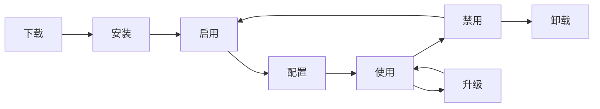

# AlkaidSYS 插件开发指南

## 📋 文档信息

| 项目 | 内容 |
|------|------|
| **文档名称** | AlkaidSYS 插件开发指南 |
| **文档版本** | v1.0 |
| **创建日期** | 2025-01-19 |

## 目录（新增）
- [前端集成 @alkaidsys/sdk](#sdk-plugin-usage)

## 🎯 插件开发概述

本指南将帮助开发者快速上手 AlkaidSYS 插件开发，从环境搭建到插件发布的完整流程。

### 插件类型

AlkaidSYS 支持 2 大类插件：

| 插件类型 | 说明 | 示例 |
|---------|------|------|
| **通用插件** | 跨应用使用 | 支付、短信、存储、邮件 |
| **应用专属插件** | 特定应用使用 | 电商优惠券、OA 审批流 |

## 🛠️ 开发环境搭建

### 1. 系统要求

```bash
# 必需环境（与应用开发相同）
- PHP >= 8.2
- MySQL >= 8.0
- Redis >= 6.0
- Composer >= 2.0

# 推荐环境
- PHP 8.2
- MySQL 8.0
- Redis 7.0
```

### 2. 安装 AlkaidSYS CLI 工具

```bash
# 全局安装 CLI 工具
composer global require alkaid/cli

# 验证安装
alkaid --version
```

## 📁 插件目录结构

### 1. 标准目录结构

```
payment-wechat/                  # 插件根目录
├── plugin.json                  # 插件元数据（必需）
├── Plugin.php                   # 插件主类（必需）
├── install.sql                  # 安装 SQL（可选）
├── uninstall.sql                # 卸载 SQL（可选）
├── config/                      # 配置文件目录
│   └── plugin.php               # 插件配置
├── service/                     # 服务目录
│   ├── WechatPayService.php     # 微信支付服务
│   └── WechatNotifyService.php  # 微信回调服务
├── controller/                  # 控制器目录（可选）
│   └── NotifyController.php     # 回调控制器
├── model/                       # 模型目录（可选）
│   └── PaymentLog.php           # 支付日志模型
├── view/                        # 视图目录（可选）
│   └── config.html              # 配置页面
├── lang/                        # 语言包目录
│   ├── zh-cn.php
│   └── en-us.php
└── README.md                    # 插件说明文档
```

### 2. 使用 CLI 创建插件

```bash
# 创建通用插件
alkaid init plugin payment-wechat --type=universal

# 创建应用专属插件
alkaid init plugin coupon --type=app-specific --app=ecommerce

# 进入插件目录
cd payment-wechat

# 查看目录结构
tree -L 2
```

## 📝 plugin.json 配置详解

### 1. 通用插件配置示例

```json
{
  "key": "payment_wechat",
  "name": "微信支付",
  "type": "plugin",
  "category": "universal",
  "version": "1.0.0",
  "description": "微信支付插件，支持扫码支付、H5 支付、小程序支付等",
  "author": {
    "name": "AlkaidSYS Team",
    "email": "dev@alkaid.com",
    "website": "https://alkaid.com"
  },
  "icon": "icon.png",
  "price": 199,
  "license": "Commercial",
  "tags": ["支付", "微信支付", "扫码支付"],
  "min_framework_version": "1.0.0",
  "max_framework_version": "2.0.0",
  "min_app_version": null,
  "dependencies": {
    "apps": [],
    "plugins": []
  },
  "hooks": [
    "PaymentCreate",
    "PaymentQuery",
    "PaymentRefund",
    "PaymentNotify"
  ],
  "config": {
    "app_id": {
      "type": "text",
      "label": "应用 ID",
      "required": true,
      "placeholder": "请输入微信应用 ID"
    },
    "mch_id": {
      "type": "text",
      "label": "商户号",
      "required": true,
      "placeholder": "请输入微信商户号"
    },
    "api_key": {
      "type": "password",
      "label": "API 密钥",
      "required": true,
      "placeholder": "请输入 API 密钥"
    },
    "cert_path": {
      "type": "file",
      "label": "证书文件",
      "required": false,
      "accept": ".pem"
    },
    "notify_url": {
      "type": "text",
      "label": "回调地址",
      "required": false,
      "default": "/api/payment/wechat/notify"
    }
  },
  "changelog": "1.0.0 版本发布\n- 支持扫码支付\n- 支持 H5 支付\n- 支持小程序支付"
}
```

### 2. 应用专属插件配置示例

```json
{
  "key": "ecommerce_coupon",
  "name": "优惠券插件",
  "type": "plugin",
  "category": "app-specific",
  "app_key": "ecommerce",
  "version": "1.0.0",
  "description": "电商应用专属优惠券插件，支持满减券、折扣券、兑换券等",
  "author": {
    "name": "AlkaidSYS Team",
    "email": "dev@alkaid.com"
  },
  "icon": "icon.png",
  "price": 99,
  "license": "Commercial",
  "tags": ["优惠券", "营销", "电商"],
  "min_framework_version": "1.0.0",
  "max_framework_version": "2.0.0",
  "min_app_version": {"ecommerce": "1.0.0"},
  "dependencies": {
    "apps": [],
    "plugins": []
  },
  "hooks": [
    "OrderCalculate",
    "OrderCreated",
    "CouponUsed"
  ],
  "config": {
    "max_use_count": {
      "type": "number",
      "label": "最大使用次数",
      "default": 1,
      "min": 1,
      "max": 100
    },
    "enable_share": {
      "type": "switch",
      "label": "启用分享",
      "default": true
    }
  }
}
```

### 3. 配置字段说明

| 字段 | 类型 | 必填 | 说明 |
|------|------|------|------|
| key | string | 是 | 插件唯一标识 |
| name | string | 是 | 插件名称 |
| type | string | 是 | 类型（固定为 "plugin"） |
| category | string | 是 | 分类（universal/app-specific） |
| app_key | string | 否 | 依赖应用 key（应用专属插件必填） |
| version | string | 是 | 版本号（x.y.z 格式） |
| description | string | 是 | 插件描述 |
| author | object | 是 | 作者信息 |
| icon | string | 否 | 插件图标 |
| price | number | 否 | 价格（0 表示免费） |
| license | string | 否 | 许可证 |
| tags | array | 否 | 标签 |
| dependencies | object | 否 | 依赖项 |
| hooks | array | 是 | 钩子列表 |
| config | object | 否 | 配置项 |
| changelog | string | 否 | 更新日志 |
> **依赖与版本说明：** `dependencies` 字段、`app_key` 以及插件在实际实现中可能携带的 `min_framework_version` / `min_app_version` 等约束，其语义和兼容矩阵同样以 `02-app-plugin-ecosystem` 模块中的“应用与插件依赖与版本策略”设计文档为权威来源。本指南中的示例仅用于说明字段结构，具体版本要求与兼容策略请以该设计文档为准。


## 🔄 插件生命周期

### 1. 生命周期钩子



### 2. Plugin.php 主类

```php
<?php
namespace plugin\payment_wechat;

use alkaid\Plugin as BasePlugin;
use think\facade\Db;

/**
 * 微信支付插件
 */
class Plugin extends BasePlugin
{
    /**
     * 安装插件
     */
    public function install(): bool
    {
        try {
            // 1. 执行安装 SQL
            $this->executeSqlFile('install.sql');

            // 2. 注册钩子
            $this->registerHooks();

            // 3. 触发安装事件
            event('PluginInstalled', [
                'plugin_key' => $this->getKey()
            ]);

            return true;

        } catch (\Exception $e) {
            throw $e;
        }
    }

    /**
     * 卸载插件
     */
    public function uninstall(bool $keepData = false): bool
    {
        try {
            // 1. 注销钩子
            $this->unregisterHooks();

            // 2. 清理数据（如果不保留数据）
            if (!$keepData) {
                $this->executeSqlFile('uninstall.sql');
            }

            // 3. 触发卸载事件
            event('PluginUninstalled', [
                'plugin_key' => $this->getKey(),
                'keep_data' => $keepData
            ]);

            return true;

        } catch (\Exception $e) {
            throw $e;
        }
    }

    /**
     * 启用插件
     */
    public function enable(): bool
    {
        // 触发启用事件
        event('PluginEnabled', [
            'plugin_key' => $this->getKey()
        ]);

        return true;
    }

    /**
     * 禁用插件
     */
    public function disable(): bool
    {
        // 触发禁用事件
        event('PluginDisabled', [
            'plugin_key' => $this->getKey()
        ]);

        return true;
    }

    /**
     * 注册钩子
     */
    protected function registerHooks(): void
    {
        // 注册支付创建钩子
        hook('PaymentCreate', [$this, 'onPaymentCreate']);

        // 注册支付查询钩子
        hook('PaymentQuery', [$this, 'onPaymentQuery']);

        // 注册支付退款钩子
        hook('PaymentRefund', [$this, 'onPaymentRefund']);

        // 注册支付回调钩子
        hook('PaymentNotify', [$this, 'onPaymentNotify']);
    }

    /**
     * 处理支付创建
     */
    public function onPaymentCreate(array $params): array
    {
        $service = new \plugin\payment_wechat\service\WechatPayService();
        return $service->create($params);
    }

    /**
     * 处理支付查询
     */
    public function onPaymentQuery(array $params): array
    {
        $service = new \plugin\payment_wechat\service\WechatPayService();
        return $service->query($params);
    }

    /**
     * 处理支付退款
     */
    public function onPaymentRefund(array $params): array
    {
        $service = new \plugin\payment_wechat\service\WechatPayService();
        return $service->refund($params);
    }

    /**
     * 处理支付回调
     */
    public function onPaymentNotify(array $params): array
    {
        $service = new \plugin\payment_wechat\service\WechatNotifyService();
        return $service->handle($params);
    }
}
```

## 🔌 钩子机制详解

### 1. 钩子类型

#### Action Hooks（动作钩子）

用于在特定动作发生时执行代码，不返回值。

```php
<?php
// 注册动作钩子
hook('UserLogin', function($user) {
    // 记录用户登录日志
    Db::name('user_login_logs')->insert([
        'user_id' => $user['id'],
        'ip' => request()->ip(),
        'created_at' => time()
    ]);
});

// 触发动作钩子
do_action('UserLogin', $user);
```

#### Filter Hooks（过滤钩子）

用于修改数据，必须返回值。

```php
<?php
// 注册过滤钩子
hook('OrderAmount', function($amount, $order) {
    // 应用优惠券折扣
    if (!empty($order['coupon_id'])) {
        $coupon = Db::name('coupons')->find($order['coupon_id']);
        if ($coupon['type'] === 'discount') {
            $amount = $amount * $coupon['discount'] / 100;
        } elseif ($coupon['type'] === 'reduce') {
            $amount = $amount - $coupon['reduce_amount'];
        }
    }
    return $amount;
});

// 触发过滤钩子
$finalAmount = apply_filter('OrderAmount', $originalAmount, $order);
```

#### Event Hooks（事件钩子）

用于监听系统事件。

```php
<?php
// 注册事件钩子
hook('OrderPaid', function($order) {
    // 发送支付成功通知
    sms()->send($order['user_phone'], 'payment_success', [
        'order_no' => $order['order_no'],
        'amount' => $order['total_amount']
    ]);
});

// 触发事件钩子
event('OrderPaid', $order);
```

### 2. 钩子优先级

```php
<?php
// 注册钩子时指定优先级（数字越小优先级越高）
hook('OrderAmount', function($amount, $order) {
    // 优惠券折扣（优先级 10）
    return $amount * 0.9;
}, 10);

hook('OrderAmount', function($amount, $order) {
    // 会员折扣（优先级 20）
    return $amount * 0.95;
}, 20);

// 执行顺序：优惠券折扣 -> 会员折扣
```

## 💻 插件服务实现

### 1. 微信支付服务

```php
<?php
namespace plugin\payment_wechat\service;

use think\facade\Db;

/**
 * 微信支付服务（示例实现）
 *
 * 说明：本示例用于展示支付插件的推荐分层与钩子集成方式，
 * 实际接入请严格遵守《04-security-performance/11-security-design.md》
 * 与《07-integration-ops/25-system-integration.md》中关于第三方支付的
 * 安全与审计要求，包括但不限于：密钥管理、防重放、幂等处理、
 * TLS 校验、超时与重试策略等。
 */
class WechatPayService
{
    protected $config;

    public function __construct()
    {
        // 获取插件配置
        $this->config = plugin_config('payment_wechat');
    }

    /**
     * 创建支付
     */
    public function create(array $params): array
    {
        // 1. 生成订单号
        $outTradeNo = $this->generateOrderNo();

        // 2. 构建支付参数
        $payParams = [
            'appid' => $this->config['app_id'],
            'mch_id' => $this->config['mch_id'],
            'nonce_str' => md5(uniqid()),
            'body' => $params['body'],
            'out_trade_no' => $outTradeNo,
            'total_fee' => $params['amount'] * 100, // 单位：分
            'spbill_create_ip' => request()->ip(),
            'notify_url' => $this->config['notify_url'],
            'trade_type' => $params['trade_type'] ?? 'NATIVE' // NATIVE-扫码支付
        ];

        // 3. 生成签名
        $payParams['sign'] = $this->generateSign($payParams);

        // 4. 转换为 XML
        $xml = $this->arrayToXml($payParams);

        // 5. 调用微信统一下单接口
        $response = $this->httpPost('https://api.mch.weixin.qq.com/pay/unifiedorder', $xml);

        // 6. 解析响应
        $result = $this->xmlToArray($response);

        if ($result['return_code'] === 'SUCCESS' && $result['result_code'] === 'SUCCESS') {
            // 7. 保存支付记录
            Db::name('payment_logs')->insert([
                'plugin_key' => 'payment_wechat',
                'out_trade_no' => $outTradeNo,
                'transaction_id' => $result['prepay_id'],
                'amount' => $params['amount'],
                'status' => 0, // 待支付
                'created_at' => time()
            ]);

            return [
                'success' => true,
                'out_trade_no' => $outTradeNo,
                'code_url' => $result['code_url'], // 二维码链接
                'prepay_id' => $result['prepay_id']
            ];
        } else {
            return [
                'success' => false,
                'message' => $result['err_code_des'] ?? '支付失败'
            ];
        }
    }

    /**
     * 查询支付
     */
    public function query(array $params): array
    {
        $queryParams = [
            'appid' => $this->config['app_id'],
            'mch_id' => $this->config['mch_id'],
            'out_trade_no' => $params['out_trade_no'],
            'nonce_str' => md5(uniqid())
        ];

        $queryParams['sign'] = $this->generateSign($queryParams);
        $xml = $this->arrayToXml($queryParams);

        $response = $this->httpPost('https://api.mch.weixin.qq.com/pay/orderquery', $xml);
        $result = $this->xmlToArray($response);

        if ($result['return_code'] === 'SUCCESS' && $result['result_code'] === 'SUCCESS') {
            return [
                'success' => true,
                'trade_state' => $result['trade_state'],
                'transaction_id' => $result['transaction_id']
            ];
        } else {
            return [
                'success' => false,
                'message' => $result['err_code_des'] ?? '查询失败'
            ];
        }
    }

    /**
     * 退款
     */
    public function refund(array $params): array
    {
        $refundParams = [
            'appid' => $this->config['app_id'],
            'mch_id' => $this->config['mch_id'],
            'nonce_str' => md5(uniqid()),
            'out_trade_no' => $params['out_trade_no'],
            'out_refund_no' => $this->generateOrderNo(),
            'total_fee' => $params['total_amount'] * 100,
            'refund_fee' => $params['refund_amount'] * 100
        ];

        $refundParams['sign'] = $this->generateSign($refundParams);
        $xml = $this->arrayToXml($refundParams);

        // 退款需要使用证书
        $response = $this->httpPost(
            'https://api.mch.weixin.qq.com/secapi/pay/refund',
            $xml,
            true // 使用证书
        );

        $result = $this->xmlToArray($response);

        if ($result['return_code'] === 'SUCCESS' && $result['result_code'] === 'SUCCESS') {
            return [
                'success' => true,
                'refund_id' => $result['refund_id']
            ];
        } else {
            return [
                'success' => false,
                'message' => $result['err_code_des'] ?? '退款失败'
            ];
        }
    }

    /**
     * 生成签名
     */
    protected function generateSign(array $params): string
    {
        ksort($params);
        $string = urldecode(http_build_query($params));
        $string .= '&key=' . $this->config['api_key'];
        return strtoupper(md5($string));
    }

    /**
     * 生成订单号
     */
    protected function generateOrderNo(): string
    {
        return date('YmdHis') . rand(100000, 999999);
    }

    /**
     * 数组转 XML
     */
    protected function arrayToXml(array $data): string
    {
        $xml = '<xml>';
        foreach ($data as $key => $value) {
            $xml .= "<{$key}>{$value}</{$key}>";
        }
        $xml .= '</xml>';
        return $xml;
    }

    /**
     * XML 转数组
     */
    protected function xmlToArray(string $xml): array
    {
        return json_decode(json_encode(simplexml_load_string($xml)), true);
    }

    /**
     * HTTP POST 请求
     */
    protected function httpPost(string $url, string $data, bool $useCert = false): string
    {
        $ch = curl_init();
        curl_setopt($ch, CURLOPT_URL, $url);
        curl_setopt($ch, CURLOPT_RETURNTRANSFER, true);
        curl_setopt($ch, CURLOPT_POST, true);
        curl_setopt($ch, CURLOPT_POSTFIELDS, $data);

        if ($useCert) {
            curl_setopt($ch, CURLOPT_SSLCERTTYPE, 'PEM');
            curl_setopt($ch, CURLOPT_SSLCERT, $this->config['cert_path']);
            curl_setopt($ch, CURLOPT_SSLKEYTYPE, 'PEM');
            curl_setopt($ch, CURLOPT_SSLKEY, $this->config['key_path']);
        }

        $response = curl_exec($ch);
        curl_close($ch);

        return $response;
    }
}
```

### 2. 微信支付回调服务

```php
<?php
namespace plugin\payment_wechat\service;

use think\facade\Db;

/**
 * 微信支付回调服务（示例实现）
 *
 * 说明：本示例用于展示支付回调的推荐处理流程，
 * 实际接入请严格遵守《04-security-performance/11-security-design.md》
 * 与《07-integration-ops/25-system-integration.md》中关于第三方支付的
 * 安全与审计要求，包括但不限于：签名校验、幂等处理、
 * 日志审计与异常告警等。
 */
class WechatNotifyService
{
    protected $config;

    public function __construct()
    {
        $this->config = plugin_config('payment_wechat');
    }

    /**
     * 处理回调
     */
    public function handle(array $params): array
    {
        // 1. 获取回调数据
        $xml = file_get_contents('php://input');
        $data = $this->xmlToArray($xml);

        // 2. 验证签名
        if (!$this->verifySign($data)) {
            return [
                'success' => false,
                'message' => '签名验证失败'
            ];
        }

        // 3. 验证返回状态
        if ($data['return_code'] !== 'SUCCESS' || $data['result_code'] !== 'SUCCESS') {
            return [
                'success' => false,
                'message' => '支付失败'
            ];
        }

        // 4. 查询支付记录
        $payment = Db::name('payment_logs')
            ->where('out_trade_no', $data['out_trade_no'])
            ->find();

        if (!$payment) {
            return [
                'success' => false,
                'message' => '支付记录不存在'
            ];
        }

        // 5. 防止重复回调
        if ($payment['status'] == 1) {
            return [
                'success' => true,
                'message' => '已处理'
            ];
        }

        // 6. 更新支付状态
        Db::name('payment_logs')
            ->where('id', $payment['id'])
            ->update([
                'transaction_id' => $data['transaction_id'],
                'status' => 1, // 已支付
                'paid_at' => time()
            ]);

        // 7. 触发支付成功事件
        event('PaymentSuccess', [
            'out_trade_no' => $data['out_trade_no'],
            'transaction_id' => $data['transaction_id'],
            'amount' => $data['total_fee'] / 100
        ]);

        return [
            'success' => true,
            'message' => '处理成功'
        ];
    }

    /**
     * 验证签名
     */
    protected function verifySign(array $data): bool
    {
        $sign = $data['sign'];
        unset($data['sign']);

        $generatedSign = $this->generateSign($data);

        return $sign === $generatedSign;
    }

    /**
     * 生成签名
     */
    protected function generateSign(array $params): string
    {
        ksort($params);
        $string = urldecode(http_build_query($params));
        $string .= '&key=' . $this->config['api_key'];
        return strtoupper(md5($string));
    }

    /**
     * XML 转数组
     */
    protected function xmlToArray(string $xml): array
    {
        return json_decode(json_encode(simplexml_load_string($xml)), true);
    }
}
```

## 🔧 开发低代码插件

AlkaidSYS 的低代码能力采用插件化设计，开发者可以扩展低代码能力，例如自定义字段类型、自定义工作流节点等。

### 1. 自定义字段类型

**场景**：为数据建模插件添加自定义的"颜色选择器"字段类型

**实现步骤**：

```php
<?php
// /plugins/custom-fields/field/ColorField.php

namespace plugins\customfields\field;

use app\lowcode\datamodeling\field\FieldInterface;

/**
 * 颜色选择器字段
 */
class ColorField implements FieldInterface
{
    protected string $name;
    protected array $options;

    public function __construct(string $name, array $options = [])
    {
        $this->name = $name;
        $this->options = array_merge([
            'default' => '#000000',
            'format' => 'hex', // hex, rgb, rgba
        ], $options);
    }

    /**
     * 获取字段名称
     */
    public function getName(): string
    {
        return $this->name;
    }

    /**
     * 获取字段类型
     */
    public function getType(): string
    {
        return 'color';
    }

    /**
     * 获取数据库字段定义
     */
    public function getColumnDefinition(): string
    {
        return "VARCHAR(20) DEFAULT '{$this->options['default']}'";
    }

    /**
     * 获取验证规则
     */
    public function getValidationRules(): array
    {
        return [
            'regex' => '/^#[0-9A-Fa-f]{6}$/',
        ];
    }

    /**
     * 格式化输入值
     */
    public function formatInput($value): string
    {
        if ($this->options['format'] === 'hex') {
            return strtoupper($value);
        }
        return $value;
    }

    /**
     * 格式化输出值
     */
    public function formatOutput($value): string
    {
        return $value;
    }
}
```

**注册自定义字段类型**：

```php
<?php
// /plugins/custom-fields/Plugin.php

namespace plugins\customfields;

use app\lowcode\datamodeling\registry\FieldTypeRegistry;
use plugins\customfields\field\ColorField;

class Plugin
{
    /**
     * 插件安装
     */
    public function install(): void
    {
        // 注册自定义字段类型
        FieldTypeRegistry::register('color', ColorField::class);
    }

    /**
     * 插件卸载
     */
    public function uninstall(): void
    {
        // 注销自定义字段类型
        FieldTypeRegistry::unregister('color');
    }
}
```

**使用自定义字段类型**：

```bash
# 创建数据模型时使用自定义字段类型
alkaid lowcode:create-model Product \
  --fields="name:string,color:color,price:decimal"
```

---

### 2. 自定义工作流节点类型

**场景**：为工作流引擎添加自定义的"发送企业微信消息"节点

**实现步骤**：

```php
<?php
// /plugins/workflow-wechat/node/SendWechatMessageNode.php

namespace plugins\workflowwechat\node;

use app\lowcode\workflow\node\NodeInterface;

/**
 * 发送企业微信消息节点
 */
class SendWechatMessageNode implements NodeInterface
{
    /**
     * 获取节点类型
     */
    public function getType(): string
    {
        return 'send_wechat_message';
    }

    /**
     * 获取节点名称
     */
    public function getName(): string
    {
        return '发送企业微信消息';
    }

    /**
     * 获取节点配置 Schema
     */
    public function getConfigSchema(): array
    {
        return [
            'type' => 'object',
            'properties' => [
                'webhook_url' => [
                    'type' => 'string',
                    'title' => 'Webhook URL',
                ],
                'message_type' => [
                    'type' => 'string',
                    'title' => '消息类型',
                    'enum' => ['text', 'markdown'],
                ],
                'content' => [
                    'type' => 'string',
                    'title' => '消息内容',
                ],
            ],
            'required' => ['webhook_url', 'message_type', 'content'],
        ];
    }

    /**
     * 执行节点
     */
    public function execute(array $context): array
    {
        $config = $context['node']['config'];

        // 替换变量
        $content = $this->replaceVariables($config['content'], $context);

        // 发送企业微信消息
        $result = $this->sendWechatMessage(
            $config['webhook_url'],
            $config['message_type'],
            $content
        );

        return [
            'next_node' => $context['node']['next_node'] ?? null,
            'output' => [
                'success' => $result['success'],
                'message' => $result['message'],
            ],
        ];
    }

    /**
     * 发送企业微信消息
     */
    protected function sendWechatMessage(string $webhookUrl, string $messageType, string $content): array
    {
        $data = [
            'msgtype' => $messageType,
            $messageType => [
                'content' => $content,
            ],
        ];

        $ch = curl_init($webhookUrl);
        curl_setopt($ch, CURLOPT_RETURNTRANSFER, true);
        curl_setopt($ch, CURLOPT_POST, true);
        curl_setopt($ch, CURLOPT_POSTFIELDS, json_encode($data));
        curl_setopt($ch, CURLOPT_HTTPHEADER, ['Content-Type: application/json']);

        $response = curl_exec($ch);
        $httpCode = curl_getinfo($ch, CURLINFO_HTTP_CODE);
        curl_close($ch);

        return [
            'success' => $httpCode === 200,
            'message' => $response,
        ];
    }
}
```

**注册自定义节点类型**：

```php
<?php
// /plugins/workflow-wechat/Plugin.php

namespace plugins\workflowwechat;

use app\lowcode\workflow\registry\NodeTypeRegistry;
use plugins\workflowwechat\node\SendWechatMessageNode;

class Plugin
{
    /**
     * 插件安装
     */
    public function install(): void
    {
        // 注册自定义节点类型
        NodeTypeRegistry::register('send_wechat_message', SendWechatMessageNode::class);
    }

    /**
     * 插件卸载
     */
    public function uninstall(): void
    {
        // 注销自定义节点类型
        NodeTypeRegistry::unregister('send_wechat_message');
    }
}
```

详细设计请参考：
- [数据建模插件设计](../09-lowcode-framework/42-lowcode-data-modeling.md)
- [工作流引擎插件设计](../09-lowcode-framework/44-lowcode-workflow.md)
- [框架底层架构优化分析](../09-lowcode-framework/40-lowcode-framework-architecture.md)

## 📦 插件打包和发布

### 1. 打包插件

```bash
# 进入插件目录
cd payment-wechat

# 打包插件
alkaid build plugin

# 生成的文件：payment-wechat-1.0.0.zip
```

### 1.1 包完整性校验（SHA-256）

```bash
# 计算插件包哈希（与 02/03 章节 package_hash 对齐）
HASH=$(sha256sum payment-wechat-1.0.0.zip | awk '{print $1}')
echo "SHA-256: $HASH"

# 发布时携带哈希供市场校验
alkaid publish plugin \
  --file=payment-wechat-1.0.0.zip \
  --sha256=$HASH \
  --api-key=YOUR_API_KEY \
  --api-secret=YOUR_API_SECRET
```

# 生成的文件：payment-wechat-1.0.0.zip
```

### 2. 发布插件

```bash
# 使用 CLI 工具发布
alkaid publish plugin \
  --api-key=YOUR_API_KEY \
  --api-secret=YOUR_API_SECRET
```

### 2.1 发布 API 示例（含 package_hash）

```bash
# 计算插件包哈希
HASH=$(sha256sum payment-wechat-1.0.0.zip | awk '{print $1}')

# 通过 REST API 发布插件（对齐 03-data-layer/10-api-design.md）
curl -X POST "https://api.alkaid.com/market/plugins/publish" \
  -H "Content-Type: application/json" \
  -H "X-App-Key: $APP_KEY" \
  -H "X-Timestamp: $(date +%s)" \
  -H "X-Nonce: $(openssl rand -hex 12)" \
  -H "X-Signature: <HMAC_HEX>" \
  -d '{
    "plugin_key": "payment_wechat",
    "version": "1.0.0",
    "changelog": "初始发布",
    "package_url": "https://cdn.example.com/payment-wechat-1.0.0.zip",
    "package_hash": "'"$HASH"'",
    "package_size": 2345678
  }'
```

```json
{
  "plugin_key": "payment_wechat",
  "version": "1.0.0",
  "changelog": "初始发布",
  "package_url": "https://cdn.example.com/payment-wechat-1.0.0.zip",
  "package_hash": "<SHA256_HEX>",
  "package_size": 2345678
}
```

> 安全注意事项：package_hash 使用 SHA-256 十六进制小写；签名头与防重放规则见 04-security-performance 与 03-data-layer/10-api-design 的“签名中间件”章节。


## 🆚 与 NIUCLOUD 对比

| 特性 | AlkaidSYS | NIUCLOUD | 优势 |
|------|-----------|----------|------|
| **钩子机制** | 3 种钩子类型 | 基础钩子 | ✅ 更灵活 |
| **钩子优先级** | 支持优先级 | 不支持 | ✅ 更可控 |
| **插件分类** | 通用 + 应用专属 | 不明确 | ✅ 更清晰 |
| **配置管理** | 可视化配置 | 手动配置 | ✅ 更便捷 |
| **打包发布** | 一键打包发布 | 手动打包 | ✅ 更简单 |

---

## 🧰 MCP 工具与 HookToolProvider 规范（新增）

### 接口规范
```php
interface HookToolProvider {
    public function getToolMetadata(): array;     // name/description/parameters
    public function execute(Context $context, array $params): mixed;
    public function checkPermission(Context $context): bool;  // 权限校验
    public function validateParams(array $params): bool;      // 参数校验
}
```

### 注册与调用
```php
// 注册（插件 bootstrap 中）
app(HookToolRegistry::class)->register(new \plugins\xxx\tools\YourTool());

// 执行（服务内）
$result = app(HookToolRegistry::class)->execute('your_tool_name', $context, $params);
```

### 最佳实践
- 权限：系统级/租户级/用户级最小化授权；拒绝默认。
- 参数：对必填/范围/格式进行 validateParams 校验；报错信息清晰。
- 可观测性：执行耗时、失败原因写入审计日志。
- 测试：覆盖正常/异常/权限不足/参数非法四类用例。

### PR 校验清单（插件）
- [ ] 提供 getToolMetadata 完整参数定义（含 required/enum/description）
- [ ] checkPermission/validateParams 实现完备
- [ ] 在 16-development-workflow 的 CI 阶段通过 CodeValidatorTool

#### 接口规范检查默认规则（CodeValidatorTool）（新增）

- HookToolProvider 必备
  - 必须实现方法：getToolMetadata/execute/checkPermission/validateParams（签名一致）
  - getToolMetadata 必须包含：name、description、version、parameters（每项含 type、description、required，可选 enum/pattern/min/max）
  - execute 返回结果应为可序列化结构（array/scalar），报错应使用受控异常或标准错误返回，不得抛出未捕获异常
  - checkPermission 实现最小权限原则：无上下文或未授权时必须拒绝
  - validateParams 必须校验必填、类型、长度/范围、模式，并返回明确错误信息
- 文档与类型
  - 类与公共方法需提供 PHPDoc（@param/@return/@throws），补充用途与约束
  - 使用严格类型与类型提示：declare(strict_types=1); 标注参数与返回类型
- 安全与合规
  - 禁止 eval/shell_exec；网络请求必须启用 TLS 校验；不得记录敏感信息（密钥/令牌）
  - 数据库操作使用预处理/参数绑定；用户输入进行校验与清理
- 性能与稳定性
  - 避免 N+1 查询；为集合接口提供分页/限流；长耗时操作建议异步
  - 对外部依赖（HTTP/DB）设置超时与重试上限
- 目录与测试
  - 工具文件位于 plugins/<plugin_key>/tools/
  - 测试位于 tests/plugins/<plugin_key>/tools/，覆盖：正常/异常/权限不足/参数非法
- JUnit 映射约定（用于 mcp:code-validate）
  - testcase.name 形如："{path}:{RuleCategory}"，RuleCategory ∈ {InterfaceCompliance, DocBlock, TypeHint, Security, Performance}

## 前端集成 @alkaidsys/sdk（新增） <a id="sdk-plugin-usage"></a>

为插件提供管理/运营前端时，推荐使用统一 SDK：

```bash
npm i @alkaidsys/sdk
npx openapi-typescript public/api-docs.json -o src/types/api.d.ts
```

```ts
import { createClient } from '@alkaidsys/sdk';
import type { components } from '@alkaidsys/sdk/types/api';

type PluginConfig = components['schemas']['PluginConfig'];

const client = createClient({ baseUrl: '/api', getToken: async () => localStorage.getItem('token') || '' });
const configs = await client.api.get<PluginConfig>('/api/v1/plugins/payment_wechat/config');
```

- 详细说明与示例：`docs/sdk-builder/README.md`、`docs/sdk-builder/examples/usage.ts`

---

**最后更新**: 2025-01-19
**文档版本**: v1.0
**维护者**: AlkaidSYS 架构团队

