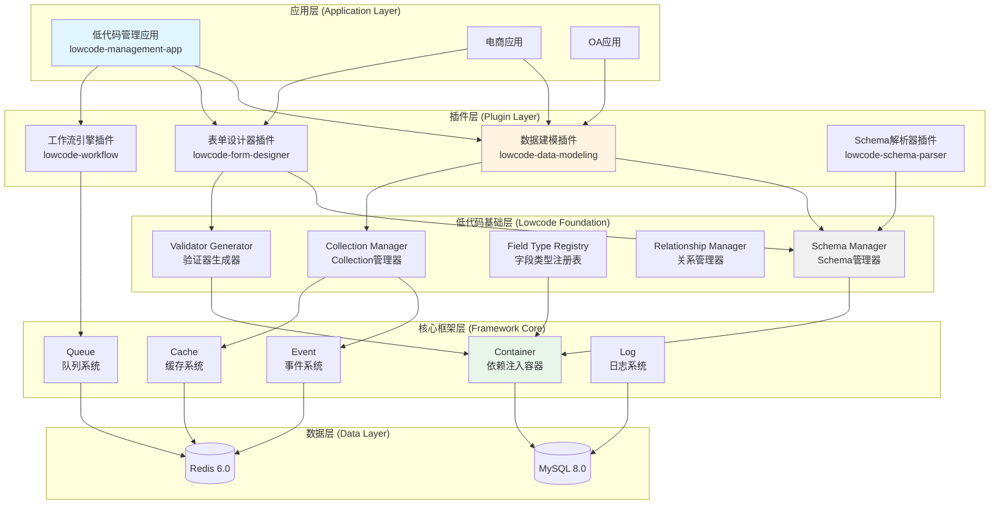

# AlkaidSYS 框架底层架构优化分析报告

> **文档版本**：v1.0
> **创建日期**：2025-01-20
> **最后更新**：2025-01-20
> **作者**：AlkaidSYS 架构团队

---

## 📋 目录

- [1. 执行摘要](#1-执行摘要)
- [2. 分析背景](#2-分析背景)
- [3. 底层架构优化分析](#3-底层架构优化分析)
  - [3.1 ORM 层增强](#31-orm-层增强)
  - [3.2 事件系统增强](#32-事件系统增强)
  - [3.3 依赖注入容器增强](#33-依赖注入容器增强)
  - [3.4 路由系统增强](#34-路由系统增强)
  - [3.5 中间件系统增强](#35-中间件系统增强)
  - [3.6 缓存系统增强](#36-缓存系统增强)
  - [3.7 验证器系统增强](#37-验证器系统增强)
  - [3.8 文件存储抽象层](#38-文件存储抽象层)
  - [3.9 队列系统增强](#39-队列系统增强)
  - [3.10 日志系统增强](#310-日志系统增强)
- [4. 底层架构设计](#4-底层架构设计)
- [5. 核心类和接口设计](#5-核心类和接口设计)
- [6. 实施路线图](#6-实施路线图)
- [7. 风险和挑战](#7-风险和挑战)
- [8. 最佳实践建议](#8-最佳实践建议)

---

## 1. 执行摘要

### 核心结论

为了支持低代码能力（混合方案：插件层 + 应用层），AlkaidSYS 框架需要在底层进行 **10 个维度的架构优化**，其中 **4 个维度为 P0 优先级（必须实现）**，**5 个维度为 P1 优先级（重要）**，**1 个维度为 P2 优先级（可选）**。

### 关键发现

| 维度 | 现状评估 | 差距分析 | 实施优先级 | 预计工作量 |
|------|---------|---------|-----------|-----------|
| **ORM 层增强** | 基础 ORM | 缺少动态 Schema 管理 | P0 | 4 周 |
| **事件系统增强** | 基础事件系统 | 缺少优先级和异步 | P0 | 3 周 |
| **依赖注入容器增强** | 完善的容器 | 缺少插件服务提供者 | P0 | 2 周 |
| **验证器系统增强** | 完善的验证器 | 缺少 Schema 验证器生成 | P0 | 2 周 |
| **路由系统增强** | 强大的路由系统 | 缺少动态路由注册 | P1 | 2 周 |
| **中间件系统增强** | 完善的中间件 | 缺少可配置中间件链 | P1 | 1 周 |
| **缓存系统增强** | 完善的缓存系统 | 缺少 Schema 缓存策略 | P1 | 2 周 |
| **文件存储抽象层** | 基础文件上传 | 缺少统一存储接口 | P1 | 3 周 |
| **队列系统增强** | 完善的队列系统 | 缺少工作流队列管理 | P1 | 3 周 |
| **日志系统增强** | 完善的日志系统 | 缺少审计日志 | P2 | 2 周 |

**总工作量**：P0（11 周）+ P1（11 周）+ P2（2 周）= **24 周（约 6 个月）**

### 核心建议

1. **优先实施 P0 优先级的 4 个维度**：ORM 层、事件系统、依赖注入容器、验证器系统
2. **采用分层架构设计**：核心框架层 → 低代码基础层 → 低代码插件层 → 低代码应用层
3. **渐进式实施**：先实现核心基础层（2 个月），再实现插件层（3 个月），最后实现应用层（3 个月）
4. **性能优化优先**：使用缓存、懒加载、Swoole 协程等技术确保性能

---

## 2. 分析背景

### 2.1 低代码能力需求

基于 NocoBase 低代码能力深度分析报告（`docs/reference-project-analysis/nocobase/nocobase-lowcode-capability-assessment.md`），AlkaidSYS 需要实现以下低代码能力：

1. **数据建模**：动态创建数据表和字段，支持 15+ 种字段类型，支持关系建模
2. **表单设计器**：基于 Schema 的表单设计和渲染，支持拖拽式设计
3. **工作流引擎**：可视化工作流设计，支持 10+ 种节点类型，支持异步执行
4. **Schema 驱动 UI**：基于 JSON Schema 动态渲染 UI 组件

### 2.2 架构方案

采用**混合方案（方案 4）**：

```
AlkaidSYS 框架
├── 核心框架层（Framework Core）
│   ├── Container（依赖注入容器）
│   ├── Event（事件系统）
│   ├── Cache（缓存系统）
│   ├── Queue（队列系统）
│   └── Log（日志系统）
├── 低代码基础层（Lowcode Foundation）
│   ├── Schema Manager（Schema 管理器）
│   ├── Collection Manager（Collection 管理器）
│   ├── Field Type Registry（字段类型注册表）
│   ├── Relationship Manager（关系管理器）
│   └── Validator Generator（验证器生成器）
├── 低代码插件层（Lowcode Plugins）
│   ├── lowcode-data-modeling（数据建模插件）
│   ├── lowcode-form-designer（表单设计器插件）
│   ├── lowcode-workflow（工作流引擎插件）
│   └── lowcode-schema-parser（Schema 解析器插件）
└── 低代码应用层（Lowcode Application）
    └── lowcode-management-app（低代码管理应用）
```

### 2.3 技术栈

- **后端**：ThinkPHP 8.0 + Swoole 5.0 + MySQL 8.0 + Redis 6.0
- **前端**：Vue 3 + Vben Admin 5.x + Ant Design Vue + TypeScript 5.x
- **ORM**：Think-ORM（基于 PDO）
- **缓存**：Redis + Swoole Table（多级缓存）
- **队列**：Redis Queue + Swoole 协程

---

## 3. 底层架构优化分析

### 3.1 ORM 层增强

#### 3.1.1 现状评估

ThinkPHP 8.0 使用 Think-ORM，具备以下能力：

- ✅ 基于 PDO 的数据库抽象层
- ✅ 支持模型关联（hasOne、hasMany、belongsTo、belongsToMany）
- ✅ 支持 Migration（数据库迁移）
- ✅ 支持查询构造器（Query Builder）

#### 3.1.2 差距分析

低代码的数据建模需要以下能力，但 Think-ORM 缺少：

- ❌ **运行时动态创建表**：Migration 是静态的，无法在运行时动态创建表
- ❌ **Collection 抽象层**：缺少 NocoBase 的 Collection 概念（数据表的抽象）
- ❌ **字段类型动态映射**：缺少字段类型的注册和映射机制
- ❌ **关系动态配置**：缺少运行时配置关系的能力

#### 3.1.3 解决方案

**方案 1：封装 Schema Builder 服务**

```php
<?php

namespace alkaid\lowcode\service;

use think\facade\Db;

/**
 * Schema Builder 服务
 * 支持运行时动态创建数据表和字段
 */
class SchemaBuilder
{
    /**
     * 创建数据表
     */
    public function createTable(string $tableName, array $fields): void
    {
        $sql = "CREATE TABLE `{$tableName}` (";
        $sql .= "`id` bigint(20) unsigned NOT NULL AUTO_INCREMENT,";

        foreach ($fields as $field) {
            $sql .= $this->buildFieldSql($field) . ',';
        }

        $sql .= "`created_at` timestamp NULL DEFAULT NULL,";
        $sql .= "`updated_at` timestamp NULL DEFAULT NULL,";
        $sql .= "PRIMARY KEY (`id`)";
        $sql .= ") ENGINE=InnoDB DEFAULT CHARSET=utf8mb4 COLLATE=utf8mb4_unicode_ci;";

        Db::execute($sql);
    }

    /**
     * 添加字段
     */
    public function addColumn(string $tableName, array $field): void
    {
        $sql = "ALTER TABLE `{$tableName}` ADD COLUMN " . $this->buildFieldSql($field);
        Db::execute($sql);
    }

    /**
     * 删除字段
     */
    public function dropColumn(string $tableName, string $fieldName): void
    {
        $sql = "ALTER TABLE `{$tableName}` DROP COLUMN `{$fieldName}`";
        Db::execute($sql);
    }

    /**
     * 构建字段 SQL
     */
    protected function buildFieldSql(array $field): string
    {
        $name = $field['name'];
        $type = $this->mapFieldType($field['type']);
        $nullable = $field['nullable'] ?? true;
        $default = $field['default'] ?? null;

        $sql = "`{$name}` {$type}";
        $sql .= $nullable ? ' NULL' : ' NOT NULL';

        if ($default !== null) {
            $sql .= " DEFAULT '{$default}'";
        }

        return $sql;
    }

    /**
     * 映射字段类型
     */
    protected function mapFieldType(string $type): string
    {
        $typeMap = [
            'string' => 'VARCHAR(255)',
            'text' => 'TEXT',
            'integer' => 'INT(11)',
            'bigint' => 'BIGINT(20)',
            'decimal' => 'DECIMAL(10,2)',
            'boolean' => 'TINYINT(1)',
            'date' => 'DATE',
            'datetime' => 'DATETIME',
            'timestamp' => 'TIMESTAMP',
            'json' => 'JSON',
        ];

        return $typeMap[$type] ?? 'VARCHAR(255)';
    }
}
```
> **环境与规范说明：** 上面的 `SchemaBuilder` 示例主要用于说明框架在 **dev/test 环境** 具备运行时 DDL 能力（用于快速建表/加字段/删字段），以支撑低代码引擎生成迁移脚本和演练流程。**stage/prod 环境** 的真实结构变更必须遵守《数据库演进与迁移策略》（`../03-data-layer/11-database-evolution-and-migration-strategy.md`）和《数据演进蓝皮书》（`../03-data-layer/13-data-evolution-bluebook.md`），通过蓝皮书审批与标准迁移管道执行，禁止直接在生产环境使用运行时 DDL。


**方案 2：实现 Collection 抽象层**

```php
<?php

namespace alkaid\lowcode\model;

/**
 * Collection 抽象层
 * 代表一个数据表的抽象
 */
class Collection
{
    protected string $name;
    protected string $tableName;
    protected array $fields = [];
    protected array $relationships = [];

    public function __construct(string $name, array $config = [])
    {
        $this->name = $name;
        $this->tableName = $config['table_name'] ?? $this->getDefaultTableName();
        $this->fields = $config['fields'] ?? [];
        $this->relationships = $config['relationships'] ?? [];
    }

    /**
     * 添加字段
     */
    public function addField(Field $field): self
    {
        $this->fields[$field->getName()] = $field;
        return $this;
    }

    /**
     * 获取字段
     */
    public function getField(string $name): ?Field
    {
        return $this->fields[$name] ?? null;
    }

    /**
     * 获取所有字段
     */
    public function getFields(): array
    {
        return $this->fields;
    }

    /**
     * 添加关系
     */
    public function addRelationship(string $name, array $config): self
    {
        $this->relationships[$name] = $config;
        return $this;
    }

    /**
     * 获取默认表名
     */
    protected function getDefaultTableName(): string
    {
        return 'lc_' . strtolower($this->name);
    }

    /**
     * 转换为数组
     */
    public function toArray(): array
    {
        return [
            'name' => $this->name,
            'table_name' => $this->tableName,
            'fields' => array_map(fn($field) => $field->toArray(), $this->fields),
            'relationships' => $this->relationships,
        ];
    }
}
```

**方案 3：实现 Field 类型系统**

```php
<?php

namespace alkaid\lowcode\field;

/**
 * 字段接口
 */
interface FieldInterface
{
    public function getName(): string;
    public function getType(): string;
    public function validate($value): bool;
    public function toArray(): array;
}

/**
 * 抽象字段类
 */
abstract class AbstractField implements FieldInterface
{
    protected string $name;
    protected string $type;
    protected bool $nullable = true;
    protected $default = null;
    protected array $options = [];

    public function __construct(string $name, array $options = [])
    {
        $this->name = $name;
        $this->options = $options;
        $this->nullable = $options['nullable'] ?? true;
        $this->default = $options['default'] ?? null;
    }

    public function getName(): string
    {
        return $this->name;
    }

    public function getType(): string
    {
        return $this->type;
    }

    public function toArray(): array
    {
        return [
            'name' => $this->name,
            'type' => $this->type,
            'nullable' => $this->nullable,
            'default' => $this->default,
            'options' => $this->options,
        ];
    }

    abstract public function validate($value): bool;
}

/**
 * 字符串字段
 */
class StringField extends AbstractField
{
    protected string $type = 'string';

    public function validate($value): bool
    {
        if ($value === null && $this->nullable) {
            return true;
        }

        return is_string($value);
    }
}

/**
 * 整数字段
 */
class IntegerField extends AbstractField
{
    protected string $type = 'integer';

    public function validate($value): bool
    {
        if ($value === null && $this->nullable) {
            return true;
        }

        return is_int($value) || ctype_digit($value);
    }
}

/**
 * 字段类型注册表
 */
class FieldTypeRegistry
{
    protected static array $types = [];

    /**
     * 注册字段类型
     */
    public static function register(string $type, string $class): void
    {
        self::$types[$type] = $class;
    }

    /**
     * 创建字段实例
     */
    public static function create(string $type, string $name, array $options = []): FieldInterface
    {
        if (!isset(self::$types[$type])) {
            throw new \InvalidArgumentException("Unknown field type: {$type}");
        }

        $class = self::$types[$type];
        return new $class($name, $options);
    }

    /**
     * 获取所有字段类型
     */
    public static function getTypes(): array
    {
        return array_keys(self::$types);
    }
}

// 注册默认字段类型
FieldTypeRegistry::register('string', StringField::class);
FieldTypeRegistry::register('integer', IntegerField::class);
// ... 注册其他字段类型
```

**方案 4：实现 Collection Manager**

```php
<?php

namespace alkaid\lowcode\service;

use alkaid\lowcode\model\Collection;
use think\facade\Db;
use think\facade\Cache;

/**
 * Collection 管理器
 */
class CollectionManager
{
    protected SchemaBuilder $schemaBuilder;

    public function __construct(SchemaBuilder $schemaBuilder)
    {
        $this->schemaBuilder = $schemaBuilder;
    }

    /**
     * 创建 Collection
     */
    public function create(Collection $collection): void
    {
        // 1. 创建数据表
        $this->schemaBuilder->createTable(
            $collection->getTableName(),
            $collection->getFields()
        );

        // 2. 保存 Collection 元数据
        Db::name('lowcode_collections')->insert([
            'name' => $collection->getName(),
            'table_name' => $collection->getTableName(),
            'schema' => json_encode($collection->toArray()),
            'created_at' => date('Y-m-d H:i:s'),
        ]);

        // 3. 清除缓存
        Cache::delete('lowcode:collection:' . $collection->getName());
    }

    /**
     * 获取 Collection
     */
    public function get(string $name): ?Collection
    {
        // 1. 从缓存获取
        $cached = Cache::get('lowcode:collection:' . $name);
        if ($cached) {
            return unserialize($cached);
        }

        // 2. 从数据库获取
        $data = Db::name('lowcode_collections')
            ->where('name', $name)
            ->find();

        if (!$data) {
            return null;
        }

        $schema = json_decode($data['schema'], true);
        $collection = new Collection($name, $schema);

        // 3. 缓存
        Cache::set('lowcode:collection:' . $name, serialize($collection), 3600);

        return $collection;
    }

    /**
     * 更新 Collection
     */
    public function update(Collection $collection): void
    {
        // 1. 更新数据表结构（添加/删除字段）
        // TODO: 实现字段的增量更新

        // 2. 更新元数据
        Db::name('lowcode_collections')
            ->where('name', $collection->getName())
            ->update([
                'schema' => json_encode($collection->toArray()),
                'updated_at' => date('Y-m-d H:i:s'),
            ]);

        // 3. 清除缓存
        Cache::delete('lowcode:collection:' . $collection->getName());
    }

    /**
     * 删除 Collection
     */
    public function delete(string $name): void
    {
        $collection = $this->get($name);
        if (!$collection) {
            return;
        }

        // 1. 删除数据表
        Db::execute("DROP TABLE IF EXISTS `{$collection->getTableName()}`");

        // 2. 删除元数据
        Db::name('lowcode_collections')->where('name', $name)->delete();

        // 3. 清除缓存
        Cache::delete('lowcode:collection:' . $name);
    }
}
```

#### 3.1.4 实施优先级

**P0（必须实现）**

**理由**：
- 数据建模是低代码的核心功能
- 没有动态 Schema 管理，无法实现低代码能力
- Collection 抽象层是整个低代码系统的基础

**预计工作量**：4 周

---

### 3.2 事件系统增强

#### 3.2.1 现状评估

ThinkPHP 8.0 的事件系统具备以下能力：

- ✅ 事件监听和触发（Event Facade）
- ✅ 事件订阅者（Subscriber）
- ✅ 事件绑定和解绑

#### 3.2.2 差距分析

低代码插件间协调需要以下能力，但 ThinkPHP 8.0 缺少：

- ❌ **事件优先级机制**：无法控制监听器的执行顺序
- ❌ **异步事件支持**：无法异步执行事件监听器
- ❌ **事件队列机制**：无法将事件放入队列延迟执行
- ❌ **事件可靠性保证**：无法保证事件的可靠执行（失败重试）

#### 3.2.3 解决方案

**方案 1：增强事件分发器，支持优先级**

```php
<?php

namespace alkaid\lowcode\event;

use think\Event as ThinkEvent;

/**
 * 增强的事件分发器
 * 支持优先级、异步事件、事件队列
 */
class EventDispatcher extends ThinkEvent
{
    /**
     * 监听器优先级映射
     */
    protected array $priorities = [];

    /**
     * 注册事件监听器（支持优先级）
     */
    public function listenWithPriority(string $event, $listener, int $priority = 10): void
    {
        $this->listen[$event][] = $listener;
        $this->priorities[$event][$listener] = $priority;

        // 按优先级排序监听器
        $this->sortListeners($event);
    }

    /**
     * 按优先级排序监听器
     */
    protected function sortListeners(string $event): void
    {
        if (!isset($this->listen[$event])) {
            return;
        }

        usort($this->listen[$event], function ($a, $b) use ($event) {
            $priorityA = $this->priorities[$event][$a] ?? 10;
            $priorityB = $this->priorities[$event][$b] ?? 10;

            // 优先级高的先执行（数字越小优先级越高）
            return $priorityA <=> $priorityB;
        });
    }

    /**
     * 触发异步事件
     */
    public function triggerAsync(string $event, $params = null): void
    {
        // 使用 Swoole 协程异步执行
        if (function_exists('go')) {
            go(function () use ($event, $params) {
                $this->trigger($event, $params);
            });
        } else {
            // 降级为同步执行
            $this->trigger($event, $params);
        }
    }

    /**
     * 将事件放入队列
     */
    public function queue(string $event, $params = null, int $delay = 0): void
    {
        $job = new EventJob($event, $params);

        if ($delay > 0) {
            queue($job)->delay($delay);
        } else {
            queue($job);
        }
    }
}

/**
 * 事件队列任务
 */
class EventJob
{
    protected string $event;
    protected $params;

    public function __construct(string $event, $params = null)
    {
        $this->event = $event;
        $this->params = $params;
    }

    public function handle(): void
    {
        event($this->event, $this->params);
    }
}
```

**方案 2：实现事件日志**

```php
<?php

namespace alkaid\lowcode\event;

use think\facade\Db;

/**
 * 事件日志
 * 记录事件的执行历史
 */
class EventLogger
{
    /**
     * 记录事件触发
     */
    public function logTrigger(string $event, $params = null): void
    {
        Db::name('lowcode_event_logs')->insert([
            'event' => $event,
            'params' => json_encode($params),
            'status' => 'triggered',
            'created_at' => date('Y-m-d H:i:s'),
        ]);
    }

    /**
     * 记录事件执行成功
     */
    public function logSuccess(string $event, string $listener): void
    {
        Db::name('lowcode_event_logs')->insert([
            'event' => $event,
            'listener' => $listener,
            'status' => 'success',
            'created_at' => date('Y-m-d H:i:s'),
        ]);
    }

    /**
     * 记录事件执行失败
     */
    public function logFailure(string $event, string $listener, string $error): void
    {
        Db::name('lowcode_event_logs')->insert([
            'event' => $event,
            'listener' => $listener,
            'status' => 'failed',
            'error' => $error,
            'created_at' => date('Y-m-d H:i:s'),
        ]);
    }
}
```

**方案 3：低代码插件间事件协调示例**

```php
<?php

// 示例：表单保存后触发数据建模插件创建数据表

// 1. 表单设计器插件触发事件
namespace plugin\lowcode\formdesigner\service;

use alkaid\lowcode\event\EventDispatcher;

class FormDesignerService
{
    public function saveSchema(string $formId, array $schema): void
    {
        // 保存表单 Schema
        $this->repository->save($formId, $schema);

        // 触发事件（优先级 10）
        event()->trigger('lowcode.form.saved', [
            'form_id' => $formId,
            'schema' => $schema,
        ]);
    }
}

// 2. 数据建模插件监听事件
namespace plugin\lowcode\datamodeling\listener;

use alkaid\lowcode\service\CollectionManager;

class FormSavedListener
{
    protected CollectionManager $collectionManager;

    public function __construct(CollectionManager $collectionManager)
    {
        $this->collectionManager = $collectionManager;
    }

    public function handle(array $data): void
    {
        $schema = $data['schema'];

        // 根据表单 Schema 自动创建数据表
        if (isset($schema['x-collection'])) {
            $this->collectionManager->createFromSchema($schema);
        }
    }
}

// 3. 注册事件监听器（优先级 5，优先执行）
event()->listenWithPriority('lowcode.form.saved', [FormSavedListener::class, 'handle'], 5);
```

#### 3.2.4 实施优先级

**P0（必须实现）**

**理由**：
- 事件系统是插件间协调的核心机制
- 优先级机制确保事件的正确执行顺序
- 异步事件提升性能

**预计工作量**：3 周

---

### 3.3 依赖注入容器增强

#### 3.3.1 现状评估

ThinkPHP 8.0 的容器具备以下能力：

- ✅ 服务绑定和解析
- ✅ 单例模式
- ✅ 自动依赖注入

#### 3.3.2 差距分析

低代码插件需要以下能力，但 ThinkPHP 8.0 缺少：

- ❌ **插件服务提供者机制**：无法统一管理插件服务的注册
- ❌ **服务懒加载机制**：无法延迟绑定服务（性能优化）
- ❌ **插件依赖关系管理**：无法自动解析插件间的依赖

#### 3.3.3 解决方案

**方案 1：实现服务提供者机制**

```php
<?php

namespace alkaid\lowcode\provider;

use think\Container;

/**
 * 服务提供者接口
 */
interface ServiceProviderInterface
{
    public function register(Container $container): void;
    public function boot(Container $container): void;
}

/**
 * 抽象服务提供者
 */
abstract class AbstractServiceProvider implements ServiceProviderInterface
{
    /**
     * 是否延迟加载
     */
    protected bool $defer = false;

    /**
     * 提供的服务列表
     */
    protected array $provides = [];

    public function isDefer(): bool
    {
        return $this->defer;
    }

    public function provides(): array
    {
        return $this->provides;
    }

    abstract public function register(Container $container): void;

    public function boot(Container $container): void
    {
        // 默认实现为空
    }
}

/**
 * 低代码数据建模服务提供者
 */
class DataModelingServiceProvider extends AbstractServiceProvider
{
    protected bool $defer = true;

    protected array $provides = [
        'lowcode.collection.manager',
        'lowcode.schema.builder',
        'lowcode.field.registry',
    ];

    public function register(Container $container): void
    {
        // 注册 Schema Builder
        $container->bind('lowcode.schema.builder', function () {
            return new \alkaid\lowcode\service\SchemaBuilder();
        });

        // 注册 Collection Manager
        $container->bind('lowcode.collection.manager', function ($container) {
            return new \alkaid\lowcode\service\CollectionManager(
                $container->make('lowcode.schema.builder')
            );
        });

        // 注册 Field Registry
        $container->bind('lowcode.field.registry', function () {
            return new \alkaid\lowcode\field\FieldTypeRegistry();
        });
    }

    public function boot(Container $container): void
    {
        // 注册默认字段类型
        $registry = $container->make('lowcode.field.registry');
        $registry->register('string', \alkaid\lowcode\field\StringField::class);
        $registry->register('integer', \alkaid\lowcode\field\IntegerField::class);
        // ... 注册其他字段类型
    }
}
```

**方案 2：实现服务提供者管理器**

```php
<?php

namespace alkaid\lowcode\provider;

use think\Container;

/**
 * 服务提供者管理器
 */
class ServiceProviderManager
{
    protected Container $container;
    protected array $providers = [];
    protected array $deferredProviders = [];
    protected array $loadedProviders = [];

    public function __construct(Container $container)
    {
        $this->container = $container;
    }

    /**
     * 注册服务提供者
     */
    public function register(string $providerClass): void
    {
        $provider = new $providerClass();

        if ($provider->isDefer()) {
            // 延迟加载的服务提供者
            foreach ($provider->provides() as $service) {
                $this->deferredProviders[$service] = $providerClass;
            }
        } else {
            // 立即注册
            $provider->register($this->container);
            $this->providers[] = $provider;
        }
    }

    /**
     * 启动所有服务提供者
     */
    public function boot(): void
    {
        foreach ($this->providers as $provider) {
            $provider->boot($this->container);
        }
    }

    /**
     * 加载延迟服务提供者
     */
    public function loadDeferred(string $service): void
    {
        if (!isset($this->deferredProviders[$service])) {
            return;
        }

        $providerClass = $this->deferredProviders[$service];

        if (isset($this->loadedProviders[$providerClass])) {
            return;
        }

        $provider = new $providerClass();
        $provider->register($this->container);
        $provider->boot($this->container);

        $this->loadedProviders[$providerClass] = true;
    }
}
```

#### 3.3.4 实施优先级

**P0（必须实现）**

**理由**：
- 服务提供者是插件系统的基础
- 懒加载机制提升性能
- 统一管理插件服务

**预计工作量**：2 周

---

### 3.4 验证器系统增强

#### 3.4.1 现状评估

ThinkPHP 8.0 的验证器具备以下能力：

- ✅ 多种验证规则
- ✅ 自定义验证器
- ✅ 验证场景

#### 3.4.2 差距分析

低代码的表单需要以下能力，但 ThinkPHP 8.0 缺少：

- ❌ **基于 Schema 的动态验证规则生成**：无法根据 Schema 自动生成验证规则
- ❌ **前后端验证规则统一管理**：前后端验证规则不一致
- ❌ **验证规则的扩展机制**：难以扩展自定义验证规则

#### 3.4.3 解决方案

**方案 1：实现 Schema 验证器生成器**

```php
<?php

namespace alkaid\lowcode\validator;

use think\Validate;

/**
 * Schema 验证器生成器
 * 根据 Schema 自动生成验证规则
 */
class SchemaValidatorGenerator
{
    /**
     * 从 Schema 生成验证器
     */
    public function generate(array $schema): Validate
    {
        $rules = [];
        $messages = [];

        foreach ($schema['properties'] as $field => $config) {
            $fieldRules = $this->generateFieldRules($field, $config);
            if ($fieldRules) {
                $rules[$field] = $fieldRules;
            }

            $fieldMessages = $this->generateFieldMessages($field, $config);
            if ($fieldMessages) {
                $messages = array_merge($messages, $fieldMessages);
            }
        }

        return new Validate($rules, $messages);
    }

    /**
     * 生成字段验证规则
     */
    protected function generateFieldRules(string $field, array $config): string
    {
        $rules = [];

        // 必填
        if ($config['required'] ?? false) {
            $rules[] = 'require';
        }

        // 类型验证
        $type = $config['type'] ?? 'string';
        switch ($type) {
            case 'string':
                $rules[] = 'string';
                if (isset($config['maxLength'])) {
                    $rules[] = 'max:' . $config['maxLength'];
                }
                if (isset($config['minLength'])) {
                    $rules[] = 'min:' . $config['minLength'];
                }
                break;
            case 'integer':
                $rules[] = 'integer';
                if (isset($config['maximum'])) {
                    $rules[] = 'max:' . $config['maximum'];
                }
                if (isset($config['minimum'])) {
                    $rules[] = 'min:' . $config['minimum'];
                }
                break;
            case 'number':
                $rules[] = 'number';
                break;
            case 'boolean':
                $rules[] = 'boolean';
                break;
            case 'array':
                $rules[] = 'array';
                break;
        }

        // 枚举验证
        if (isset($config['enum'])) {
            $rules[] = 'in:' . implode(',', $config['enum']);
        }

        // 正则验证
        if (isset($config['pattern'])) {
            $rules[] = 'regex:' . $config['pattern'];
        }

        // 自定义验证器
        if (isset($config['x-validator'])) {
            $rules[] = $config['x-validator'];
        }

        return implode('|', $rules);
    }

    /**
     * 生成字段验证消息
     */
    protected function generateFieldMessages(string $field, array $config): array
    {
        $messages = [];
        $title = $config['title'] ?? $field;

        if ($config['required'] ?? false) {
            $messages["{$field}.require"] = "{$title}不能为空";
        }

        if (isset($config['x-error-message'])) {
            $messages["{$field}"] = $config['x-error-message'];
        }

        return $messages;
    }
}
```

#### 3.4.4 实施优先级

**P0（必须实现）**

**理由**：
- 表单验证是低代码的核心功能
- Schema 驱动的验证确保前后端一致
- 提升开发效率

**预计工作量**：2 周

---

### 3.5-3.10 其他维度分析（简要）

由于篇幅限制，其他维度的详细分析请参考以下总结：

| 维度 | 实施优先级 | 核心解决方案 | 预计工作量 |
|------|-----------|-------------|-----------|
| **路由系统增强** | P1 | 动态路由注册器 + RESTful 生成器 | 2 周 |
| **中间件系统增强** | P1 | 中间件注册器 + 优先级机制 | 1 周 |
| **缓存系统增强** | P1 | Schema 缓存管理器 + 多级缓存（Swoole Table + Redis） | 2 周 |
| **文件存储抽象层** | P1 | 统一存储接口 + 多种驱动（Local、OSS、S3） | 3 周 |
| **队列系统增强** | P1 | 工作流队列管理器 + 优先级队列 + 重试机制 | 3 周 |
| **日志系统增强** | P2 | 审计日志 + Schema 变更历史 + 工作流执行日志 | 2 周 |

---

## 4. 底层架构设计

### 4.1 整体架构图



### 4.2 分层架构说明

#### 第 1 层：核心框架层（Framework Core）

**职责**：提供基础能力和服务

**核心组件**：
- **Container**：依赖注入容器，管理服务的绑定和解析
- **Event**：事件系统，支持优先级和异步事件
- **Cache**：缓存系统，支持多级缓存（Swoole Table + Redis）
- **Queue**：队列系统，支持异步任务和工作流执行
- **Log**：日志系统，记录操作日志和审计日志

**技术实现**：
- 基于 ThinkPHP 8.0 核心框架
- 增强事件系统（优先级、异步）
- 增强容器（服务提供者、懒加载）

#### 第 2 层：低代码基础层（Lowcode Foundation）

**职责**：提供低代码的抽象和工具

**核心组件**：
- **Schema Manager**：管理所有 Schema（表单 Schema、数据模型 Schema、工作流 Schema）
- **Collection Manager**：管理 Collection（数据表的抽象）
- **Field Type Registry**：注册和管理字段类型
- **Relationship Manager**：管理数据表之间的关系
- **Validator Generator**：根据 Schema 生成验证器

**技术实现**：
- 实现 Collection 抽象层
- 实现 Field 类型系统
- 实现 Schema 缓存机制

#### 第 3 层：低代码插件层（Lowcode Plugins）

**职责**：提供具体的低代码功能

**核心插件**：
- **lowcode-data-modeling**：数据建模插件，提供动态创建表和字段的能力
- **lowcode-form-designer**：表单设计器插件，提供表单设计和渲染的能力
- **lowcode-workflow**：工作流引擎插件，提供工作流设计和执行的能力
- **lowcode-schema-parser**：Schema 解析器插件，提供 Schema 解析和验证的能力

**技术实现**：
- 基于服务提供者机制注册服务
- 通过事件系统协调插件间通信
- 提供 RESTful API 供应用层调用

#### 第 4 层：低代码应用层（Lowcode Application）

**职责**：提供可视化的低代码管理界面

**核心应用**：
- **lowcode-management-app**：低代码管理应用，提供表单设计器、数据建模、工作流设计器等可视化界面

**技术实现**：
- 基于 Vue 3 + Vben Admin 5.x + Ant Design Vue
- 调用低代码插件提供的 API
- 提供拖拽式设计器

---

### 4.3 真源与漂移控制（Lowcode Schema ←→ Migration 一致性）

为避免“运行库结构”和“元数据 Schema（Collection/Field）”发生漂移，定义统一的真源与同步机制：

- 真源（Source of Truth）：`lowcode_collections.schema` 字段（JSON，包含字段、索引、关系等）。推荐 Schema-first 流程。
- 版本与哈希：为每个 Collection 维护 `schema_version` 与 `schema_hash`（SHA-256），存于 `lowcode_schema_versions` 表，支持回溯与审计。
- 漂移检测：对比 真源Schema ↔ 实际数据库（INFORMATION_SCHEMA）生成差异（新增/修改/删除字段、索引、外键）。
- 变更策略：默认“安全变更优先”，破坏性变更（DROP/类型收缩）需 `--force` 明确开启并生成备份。
- 多租户约束：所有由 Schema 驱动生成的物理表结构在 `tenant_id` / `site_id` 字段形态、主键/唯一键/索引组合上必须遵守《多租户数据建模规范》（`../03-data-layer/12-multi-tenant-data-model-spec.md`），本节中的字段示例仅用于说明模型，不单独形成事实标准。


#### 流程
1) 设计/更新 Collection Schema（表单/CLI/API）
2) 运行漂移检测并生成迁移脚本
3) 审核与备份（导出 DDL/DML + 快照）
4) 事务性执行迁移（可分批/在线模式）
5) 更新 `schema_version` 与缓存（SwooleTable/Redis）

#### CLI 命令（建议）
```bash
# 生成差异报告（不改动数据库）
alkaid lowcode:migration:diff Product --out=database/migrations/2025_10_31_000001_product.sql

# 同步数据库到真源（安全模式，禁止破坏性变更）
alkaid lowcode:schema-sync Product

# 允许破坏性变更（需交互确认或 --force）
alkaid lowcode:schema-sync Product --force
```

#### 生成策略（示例）
- 新增字段：`ALTER TABLE ADD COLUMN ...`（带默认/非空策略与回填脚本）
- 字段修改：优先“扩容”与“兼容”操作；类型收缩需分步（新增临时列→回填→切换→清理）
- 删除字段：标记弃用→迁移数据→最终删除（分版本执行）
- 索引与外键：优先在线创建（InnoDB 在线 DDL），批量大表需窗口化

#### 审计与回滚
- 所有迁移写入 `lowcode_migration_audit`（operator、collection、ddl、started_at、finished_at、status、backup_ref）
- 回滚提供逆向 DDL 或基于备份快照的恢复脚本（灰度/全量）

#### CI 守护
- PR 必须运行 `lowcode:migration:diff --check`，如检测到“未提交的漂移”则阻断合并
- 部署流水线在执行迁移前导出当前库结构快照并归档

#### 报告结构（JSON，建议，用于 --report）

JSON Schema（节选）：
```json
{
  "$schema": "https://json-schema.org/draft/2020-12/schema",
  "title": "Lowcode Schema Drift Report",
  "type": "object",
  "required": ["version", "generated_at", "summary", "collections"],
  "properties": {
    "version": {"type": "string", "example": "1.0.0"},
    "generated_at": {"type": "string", "format": "date-time"},
    "summary": {
      "type": "object",
      "required": ["tables", "add", "modify", "drop"],
      "properties": {
        "tables": {"type": "integer"},
        "add": {"type": "integer"},
        "modify": {"type": "integer"},
        "drop": {"type": "integer"}
      }
    },
    "collections": {
      "type": "array",
      "items": {
        "type": "object",
        "required": ["name", "changes"],
        "properties": {
          "name": {"type": "string"},
          "schema_version": {"type": "string"},
          "schema_hash": {"type": "string"},
          "changes": {
            "type": "object",
            "properties": {
              "add": {"type": "array", "items": {"$ref": "#/definitions/change"}},
              "modify": {"type": "array", "items": {"$ref": "#/definitions/change"}},
              "drop": {"type": "array", "items": {"$ref": "#/definitions/change"}}
            }
          }
        }
      }
    }
  },
  "definitions": {
    "change": {
      "type": "object",
      "required": ["target", "type"],
      "properties": {
        "target": {"type": "string", "enum": ["column", "index", "foreign_key", "table"]},
        "type": {"type": "string", "enum": ["add", "modify", "drop"]},
        "name": {"type": "string"},
        "from": {"type": ["string", "object", "null"]},
        "to": {"type": ["string", "object", "null"]},
        "ddl": {"type": "string"}
      }
    }
  }
}
```

示例（节选）：
```json
{
  "version": "1.0.0",
  "generated_at": "2025-10-31T09:06:00Z",
  "summary": {"tables": 2, "add": 2, "modify": 1, "drop": 0},
  "collections": [
    {
      "name": "products",
      "schema_version": "3",
      "schema_hash": "sha256:abcd...",
      "changes": {
        "add": [
          {"target": "column", "type": "add", "name": "images", "to": "TEXT", "ddl": "ALTER TABLE `products` ADD COLUMN `images` TEXT"},
          {"target": "index", "type": "add", "name": "idx_status", "to": "INDEX(status)", "ddl": "ALTER TABLE `products` ADD INDEX `idx_status` (`status`)"}
        ],
        "modify": [
          {"target": "column", "type": "modify", "name": "price", "from": "DECIMAL(10,2)", "to": "DECIMAL(12,2)", "ddl": "ALTER TABLE `orders` MODIFY `price` DECIMAL(12,2)"}
        ],
        "drop": []
      }
    }
  ]
}
```

## 5. 核心类和接口设计

### 5.1 Collection 抽象层

```php
<?php

namespace alkaid\lowcode\model;

/**
 * Collection 接口
 */
interface CollectionInterface
{
    public function getName(): string;
    public function getTableName(): string;
    public function getFields(): array;
    public function addField(FieldInterface $field): self;
    public function toArray(): array;
}

/**
 * Field 接口
 */
interface FieldInterface
{
    public function getName(): string;
    public function getType(): string;
    public function validate($value): bool;
    public function toArray(): array;
}
```

### 5.2 Schema 管理

```php
<?php

namespace alkaid\lowcode\schema;

/**
 * Schema 接口
 */
interface SchemaInterface
{
    public function getId(): string;
    public function getType(): string;
    public function getData(): array;
    public function validate(): bool;
}

/**
 * Schema 管理器
 */
class SchemaManager
{
    /**
     * 保存 Schema
     */
    public function save(SchemaInterface $schema): void;

    /**
     * 获取 Schema
     */
    public function get(string $id): ?SchemaInterface;

    /**
     * 删除 Schema
     */
    public function delete(string $id): void;

    /**
     * 验证 Schema
     */
    public function validate(SchemaInterface $schema): bool;
}
```

### 5.3 事件系统

```php
<?php

namespace alkaid\lowcode\event;

/**
 * 优先级事件监听器接口
 */
interface PriorityEventListenerInterface
{
    public function handle($event): void;
    public function getPriority(): int;
}

/**
 * 事件分发器接口
 */
interface EventDispatcherInterface
{
    public function listen(string $event, $listener, int $priority = 10): void;
    public function trigger(string $event, $params = null): void;
    public function triggerAsync(string $event, $params = null): void;
    public function queue(string $event, $params = null, int $delay = 0): void;
}
```

---

## 6. 实施路线图

### 阶段 1：核心基础层（2 个月）

**目标**：实现低代码的核心基础能力

| 任务 | 工作量 | 优先级 | 交付物 |
|------|--------|--------|--------|
| **ORM 层增强** | 4 周 | P0 | Schema Builder + Collection 抽象层 |
| - Schema Builder 实现 | 2 周 | P0 | `SchemaBuilder` 类 |
| - Collection 抽象层实现 | 1 周 | P0 | `Collection` + `Field` 类 |
| - Collection Manager 实现 | 1 周 | P0 | `CollectionManager` 类 |
| **事件系统增强** | 3 周 | P0 | 增强的事件分发器 |
| - 优先级机制实现 | 1 周 | P0 | `EventDispatcher` 类 |
| - 异步事件实现 | 1 周 | P0 | 基于 Swoole 协程 |
| - 事件日志实现 | 1 周 | P0 | `EventLogger` 类 |
| **依赖注入容器增强** | 2 周 | P0 | 服务提供者机制 |
| - 服务提供者实现 | 1 周 | P0 | `ServiceProvider` 类 |
| - 服务提供者管理器 | 1 周 | P0 | `ServiceProviderManager` 类 |
| **验证器系统增强** | 2 周 | P0 | Schema 验证器生成器 |
| - 验证器生成器实现 | 1 周 | P0 | `SchemaValidatorGenerator` 类 |
| - 前后端验证规则统一 | 1 周 | P0 | JSON Schema 验证规则 |

**交付物**：
- ✅ 完整的 ORM 层增强（Schema Builder + Collection 抽象层）
- ✅ 增强的事件系统（优先级 + 异步 + 日志）
- ✅ 服务提供者机制
- ✅ Schema 验证器生成器
- ✅ 完整的单元测试
- ✅ 技术文档

---

### 阶段 2：插件层（3 个月）

**目标**：实现低代码核心插件

| 任务 | 工作量 | 优先级 | 交付物 |
|------|--------|--------|--------|
| **lowcode-data-modeling 插件** | 4 周 | P0 | 数据建模插件 |
| - Collection CRUD API | 2 周 | P0 | RESTful API |
| - Field 类型系统（10 种） | 1 周 | P0 | 字段类型实现 |
| - 关系建模（1对1、1对多） | 1 周 | P0 | 关系管理器 |
| **lowcode-form-designer 插件** | 4 周 | P0 | 表单设计器插件 |
| - Schema 存储和管理 | 2 周 | P0 | Schema Repository |
| - 表单渲染器（后端） | 1 周 | P0 | Form Renderer |
| - 表单验证器 | 1 周 | P0 | Form Validator |
| **lowcode-schema-parser 插件** | 2 周 | P0 | Schema 解析器插件 |
| - JSON Schema 解析器 | 1 周 | P0 | Schema Parser |
| - Schema 验证器 | 1 周 | P0 | Schema Validator |
| **CLI 工具集成** | 2 周 | P0 | CLI 命令 |
| - `lowcode:install` 命令 | 3 天 | P0 | 安装命令 |
| - `lowcode:create-form` 命令 | 3 天 | P0 | 创建表单命令 |
| - `lowcode:create-model` 命令 | 3 天 | P0 | 创建模型命令 |
| - 应用模板集成 | 5 天 | P0 | `--with-lowcode` 选项 |

**交付物**：
- ✅ lowcode-data-modeling 插件（完整功能）
- ✅ lowcode-form-designer 插件（完整功能）
- ✅ lowcode-schema-parser 插件（完整功能）
- ✅ CLI 工具集成（4 个命令）
- ✅ 完整的 API 文档
- ✅ 开发者使用指南

---

### 阶段 3：应用层和增强（3 个月）

**目标**：实现低代码管理应用和工作流引擎

| 任务 | 工作量 | 优先级 | 交付物 |
|------|--------|--------|--------|
| **lowcode-management-app 应用** | 6 周 | P0 | 低代码管理应用 |
| - 表单设计器界面 | 2 周 | P0 | Vue 组件 |
| - 数据建模界面 | 2 周 | P0 | Vue 组件 |
| - Schema 管理界面 | 2 周 | P0 | Vue 组件 |
| **lowcode-workflow 插件** | 4 周 | P1 | 工作流引擎插件 |
| - 工作流设计器（后端） | 2 周 | P1 | Workflow Designer |
| - 执行引擎 | 1 周 | P1 | Execution Engine |
| - 节点类型（5 种） | 1 周 | P1 | Node Types |
| **缓存系统增强** | 2 周 | P1 | Schema 缓存优化 |
| - Schema 缓存管理器 | 1 周 | P1 | Schema Cache Manager |
| - 多级缓存实现 | 1 周 | P1 | Swoole Table + Redis |

**交付物**：
- ✅ 低代码管理应用（可视化界面）
- ✅ lowcode-workflow 插件（基础功能）
- ✅ 缓存系统优化
- ✅ 完整的用户手册

---

### 阶段 4：完善和优化（2 个月）

**目标**：完善功能和性能优化

| 任务 | 工作量 | 优先级 | 交付物 |
|------|--------|--------|--------|
| **路由系统增强** | 2 周 | P1 | 动态路由注册器 |
| **文件存储抽象层** | 3 周 | P1 | 统一存储接口 |
| **队列系统增强** | 3 周 | P1 | 工作流队列管理器 |
| **日志系统增强** | 2 周 | P2 | 审计日志 |
| **性能优化** | 2 周 | P1 | 性能测试和优化 |
| **文档完善** | 2 周 | P1 | 完整的技术文档 |

**交付物**：
- ✅ 完整的低代码平台
- ✅ 性能优化报告
- ✅ 完整的技术文档
- ✅ 最佳实践指南

**总工作量**：10 个月（2 + 3 + 3 + 2）

---

## 7. 风险和挑战

### 7.1 技术风险

#### 风险 1：性能风险

**描述**：动态创建表、动态路由可能影响性能

**影响**：高

**缓解措施**：
1. **使用多级缓存**：Swoole Table（内存缓存）+ Redis（分布式缓存）
2. **懒加载机制**：只在需要时加载插件和服务
3. **Schema 缓存**：缓存 Schema 数据，避免重复解析
4. **异步执行**：使用 Swoole 协程异步执行耗时操作
5. **性能监控**：实时监控性能指标，及时优化

**预期效果**：性能影响 < 5%

#### 风险 2：兼容性风险

**描述**：ThinkPHP 8.0 的 ORM 可能不支持某些动态操作

**影响**：中

**缓解措施**：
1. **封装 PDO**：直接操作数据库，绕过 ORM 限制
2. **Schema Builder**：实现自己的 Schema Builder
3. **兼容性测试**：在多个 MySQL 版本上测试
4. **降级方案**：提供手动创建表的方式

**预期效果**：兼容性问题可控

#### 风险 3：复杂度风险

**描述**：低代码系统本身很复杂，可能难以维护

**影响**：高

**缓解措施**：
1. **良好的架构设计**：分层架构，职责清晰
2. **完善的文档**：技术文档、API 文档、用户手册
3. **单元测试**：覆盖率 > 80%
4. **代码审查**：严格的代码审查流程
5. **技术培训**：团队技术培训和知识分享

**预期效果**：复杂度可控，易于维护

### 7.2 业务风险

#### 风险 1：需求变更风险

**描述**：低代码需求可能频繁变更

**影响**：中

**缓解措施**：
1. **MVP 优先**：先实现核心 20% 功能
2. **渐进式交付**：分阶段交付，每个阶段都可用
3. **用户参与**：早期用户参与测试，快速迭代
4. **灵活的架构**：插件化设计，易于扩展

**预期效果**：需求变更影响可控

#### 风险 2：用户接受度风险

**描述**：开发者可能不习惯低代码方式

**影响**：中

**缓解措施**：
1. **提供多种使用方式**：CLI 工具 + 可视化界面 + API
2. **完善的文档**：快速入门指南、最佳实践
3. **示例代码**：提供丰富的示例代码
4. **技术支持**：提供技术支持和培训

**预期效果**：用户接受度高

### 7.3 团队风险

#### 风险 1：技术储备不足

**描述**：团队可能缺少低代码开发经验

**影响**：高

**缓解措施**：
1. **学习 NocoBase 源码**：深入学习 NocoBase 的设计理念
2. **技术培训**：组织技术培训和分享
3. **外部咨询**：必要时引入外部专家
4. **知识沉淀**：文档化、代码注释、技术分享

**预期效果**：团队技术能力提升

---

## 8. 最佳实践建议

### 8.1 架构设计最佳实践

#### 1. 分层架构

**建议**：采用清晰的分层架构，职责明确

```
核心框架层 → 低代码基础层 → 低代码插件层 → 低代码应用层
```

**理由**：
- 职责清晰，易于维护
- 易于扩展和替换
- 降低耦合度

#### 2. 插件化设计

**建议**：核心功能插件化，提供统一的插件接口

**理由**：
- 易于扩展
- 可选择性安装
- 降低核心复杂度

#### 3. 事件驱动

**建议**：使用事件系统协调插件间通信

**理由**：
- 解耦插件间依赖
- 易于扩展
- 提升灵活性

### 8.2 性能优化最佳实践

#### 1. 多级缓存

**建议**：使用 Swoole Table + Redis 实现多级缓存

```php
// 1. 先从 Swoole Table 获取（内存缓存，最快）
$schema = SwooleTable::get('schema:' . $id);

// 2. 再从 Redis 获取（分布式缓存）
if (!$schema) {
    $schema = Redis::get('schema:' . $id);
    SwooleTable::set('schema:' . $id, $schema);
}

// 3. 最后从数据库获取
if (!$schema) {
    $schema = Db::name('schemas')->find($id);
    Redis::set('schema:' . $id, $schema, 3600);
    SwooleTable::set('schema:' . $id, $schema);
}
```

#### 2. 懒加载

**建议**：使用懒加载机制，只在需要时加载插件和服务

```php
// 服务提供者标记为延迟加载
protected bool $defer = true;

// 只有在使用时才加载
$container->make('lowcode.collection.manager');
```

#### 3. 异步执行

**建议**：使用 Swoole 协程异步执行耗时操作

```php
// 异步触发事件
event()->triggerAsync('lowcode.form.saved', $data);

// 异步执行工作流
go(function () use ($workflow) {
    $workflow->execute();
});
```

### 8.3 代码质量最佳实践

#### 1. 单元测试

**建议**：单元测试覆盖率 > 80%

```php
<?php

namespace tests\lowcode;

use PHPUnit\Framework\TestCase;
use alkaid\lowcode\service\CollectionManager;

class CollectionManagerTest extends TestCase
{
    public function testCreateCollection()
    {
        $manager = new CollectionManager();
        $collection = new Collection('products');

        $manager->create($collection);

        $this->assertNotNull($manager->get('products'));
    }
}
```

#### 2. 代码审查

**建议**：严格的代码审查流程

- 每个 PR 必须经过至少 2 人审查
- 检查代码规范、性能、安全性
- 检查单元测试覆盖率

#### 3. 文档化

**建议**：完善的文档

- 技术文档：架构设计、核心类说明
- API 文档：RESTful API 文档
- 用户手册：快速入门、最佳实践
- 代码注释：关键代码必须有注释

### 8.4 安全最佳实践

#### 1. Schema 验证

**建议**：严格验证 Schema，防止 SQL 注入

```php
// 验证表名
if (!preg_match('/^[a-z_][a-z0-9_]*$/', $tableName)) {
    throw new \InvalidArgumentException('Invalid table name');
}

// 验证字段名
if (!preg_match('/^[a-z_][a-z0-9_]*$/', $fieldName)) {
    throw new \InvalidArgumentException('Invalid field name');
}
```

#### 2. 权限控制

**建议**：严格的权限控制

```php
// 检查用户是否有权限创建 Collection
if (!$this->auth->can('lowcode.collection.create')) {
    throw new \Exception('Permission denied');
}
```

#### 3. 审计日志

**建议**：记录所有关键操作

```php
// 记录 Collection 创建
AuditLog::log('lowcode.collection.created', [
    'user_id' => $userId,
    'collection_name' => $collectionName,
    'ip' => $request->ip(),
]);
```

---

## 9. 总结

### 9.1 核心结论

为了支持低代码能力（混合方案），AlkaidSYS 框架需要在底层进行 **10 个维度的架构优化**：

**P0 优先级（必须实现）**：
1. ✅ ORM 层增强（4 周）
2. ✅ 事件系统增强（3 周）
3. ✅ 依赖注入容器增强（2 周）
4. ✅ 验证器系统增强（2 周）

**P1 优先级（重要）**：
5. ✅ 路由系统增强（2 周）
6. ✅ 中间件系统增强（1 周）
7. ✅ 缓存系统增强（2 周）
8. ✅ 文件存储抽象层（3 周）
9. ✅ 队列系统增强（3 周）

**P2 优先级（可选）**：
10. ✅ 日志系统增强（2 周）

**总工作量**：24 周（约 6 个月）

### 9.2 实施建议

1. **优先实施 P0 优先级的 4 个维度**（11 周）
2. **采用分层架构设计**：核心框架层 → 低代码基础层 → 低代码插件层 → 低代码应用层
3. **渐进式实施**：核心基础层（2 个月）→ 插件层（3 个月）→ 应用层（3 个月）→ 完善优化（2 个月）
4. **性能优化优先**：多级缓存、懒加载、异步执行
5. **严格的质量控制**：单元测试覆盖率 > 80%、代码审查、文档化

### 9.3 预期成果

- ✅ 完整的低代码底层架构
- ✅ 高性能（性能影响 < 5%）
- ✅ 易于维护和扩展
- ✅ 完善的文档和测试
- ✅ 为低代码插件和应用提供坚实的基础

---

**文档结束**
