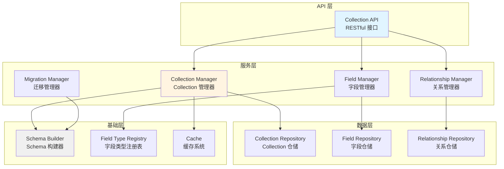

# AlkaidSYS 低代码数据建模插件设计

> **文档版本**：v1.0
> **创建日期**：2025-01-20
> **最后更新**：2025-01-20
> **作者**：AlkaidSYS 架构团队

---

## 📋 目录

- [1. 插件概述](#1-插件概述)
- [2. Collection 抽象层设计](#2-collection-抽象层设计)
- [3. Field 类型系统](#3-field-类型系统)
- [4. 关系建模](#4-关系建模)
- [5. 数据迁移机制](#5-数据迁移机制)
- [6. 数据表结构设计](#6-数据表结构设计)
- [7. API 接口设计](#7-api-接口设计)
- [8. 完整代码示例](#8-完整代码示例)

## 🔗 关联设计文档

- [术语表（Glossary）](../00-core-planning/99-GLOSSARY.md)
- [数据库演进与迁移策略](../03-data-layer/11-database-evolution-and-migration-strategy.md)
- [低代码表单设计器插件设计](43-lowcode-form-designer.md)
- [表单 → 数据建模 → 工作流端到端集成设计](51-form-collection-workflow-end-to-end.md)


---

## 1. 插件概述

### 1.1 插件信息

- **插件名称**：lowcode-data-modeling
- **插件标识**：`alkaid/lowcode-data-modeling`
- **版本**：v1.0.0
- **依赖**：
  - `alkaid/framework` >= 1.0.0
  - `topthink/think-orm` >= 3.0

### 1.2 核心功能

1. **Collection 管理**：创建、更新、删除 Collection（数据表的抽象）
2. **Field 管理**：添加、修改、删除字段
3. **关系建模**：配置表之间的关系（1对1、1对多、多对多）
4. **数据迁移**：自动生成迁移文件，支持版本管理
5. **Schema 缓存**：缓存 Collection Schema，提升性能

### 1.3 架构设计



---

## 2. Collection 抽象层设计

### 2.1 Collection 接口

```php
<?php

namespace alkaid\lowcode\datamodeling\contract;

/**
 * Collection 接口
 */
interface CollectionInterface
{
    /**
     * 获取 Collection 名称
     */
    public function getName(): string;

    /**
     * 获取数据表名
     */
    public function getTableName(): string;

    /**
     * 获取所有字段
     */
    public function getFields(): array;

    /**
     * 添加字段
     */
    public function addField(FieldInterface $field): self;

    /**
     * 获取字段
     */
    public function getField(string $name): ?FieldInterface;

    /**
     * 删除字段
     */
    public function removeField(string $name): self;

    /**
     * 获取所有关系
     */
    public function getRelationships(): array;

    /**
     * 添加关系
     */
    public function addRelationship(string $name, array $config): self;

    /**
     * 转换为数组
     */
    public function toArray(): array;
}
```

### 2.2 Collection 实现类

```php
<?php

namespace alkaid\lowcode\datamodeling\model;

use alkaid\lowcode\datamodeling\contract\CollectionInterface;
use alkaid\lowcode\datamodeling\contract\FieldInterface;

/**
 * Collection 实现类
 */
class Collection implements CollectionInterface
{
    protected string $name;
    protected string $tableName;
    protected array $fields = [];
    protected array $relationships = [];
    protected array $options = [];

    public function __construct(string $name, array $config = [])
    {
        $this->name = $name;
        $this->tableName = $config['table_name'] ?? $this->getDefaultTableName();
        $this->options = $config['options'] ?? [];

        // 初始化字段
        if (isset($config['fields'])) {
            foreach ($config['fields'] as $field) {
                if ($field instanceof FieldInterface) {
                    $this->addField($field);
                }
            }
        }

        // 初始化关系
        if (isset($config['relationships'])) {
            $this->relationships = $config['relationships'];
        }
    }

    public function getName(): string
    {
        return $this->name;
    }

    public function getTableName(): string
    {
        return $this->tableName;
    }

    public function getFields(): array
    {
        return $this->fields;
    }

    public function addField(FieldInterface $field): self
    {
        $this->fields[$field->getName()] = $field;
        return $this;
    }

    public function getField(string $name): ?FieldInterface
    {
        return $this->fields[$name] ?? null;
    }

    public function removeField(string $name): self
    {
        unset($this->fields[$name]);
        return $this;
    }

    public function getRelationships(): array
    {
        return $this->relationships;
    }

    public function addRelationship(string $name, array $config): self
    {
        $this->relationships[$name] = $config;
        return $this;
    }

    public function toArray(): array
    {
        return [
            'name' => $this->name,
            'table_name' => $this->tableName,
            'fields' => array_map(fn($field) => $field->toArray(), $this->fields),
            'relationships' => $this->relationships,
            'options' => $this->options,
        ];
    }

    /**
     * 获取默认表名
     */
    protected function getDefaultTableName(): string
    {
        // 添加 lc_ 前缀，表示 lowcode
        return 'lc_' . strtolower($this->name);
    }
}
```

### 2.3 Collection Manager

```php
<?php

namespace alkaid\lowcode\datamodeling\service;

use alkaid\lowcode\datamodeling\model\Collection;
use alkaid\lowcode\datamodeling\repository\CollectionRepository;
use alkaid\lowcode\service\SchemaBuilder;
use think\facade\Cache;
use think\facade\Event;

/**
 * Collection 管理器
 */
class CollectionManager
{
    protected CollectionRepository $repository;
    protected SchemaBuilder $schemaBuilder;

    public function __construct(
        CollectionRepository $repository,
        SchemaBuilder $schemaBuilder
    ) {
        $this->repository = $repository;
        $this->schemaBuilder = $schemaBuilder;
    }

    /**
     * 创建 Collection
     */
    public function create(Collection $collection): void
    {
        // 1. 创建数据表
        $this->schemaBuilder->createTable(
            $collection->getTableName(),
            $collection->getFields()
        );

        // 2. 保存 Collection 元数据
        $this->repository->save($collection);

        // 3. 触发事件
        Event::trigger('lowcode.collection.created', [
            'collection' => $collection,
        ]);

        // 4. 清除缓存
        $this->clearCache($collection->getName());
    }

    /**
     * 获取 Collection
     */
    public function get(string $name): ?Collection
    {
        // 1. 从缓存获取
        $cacheKey = $this->getCacheKey($name);
        $cached = Cache::get($cacheKey);

        if ($cached) {
            return unserialize($cached);
        }

        // 2. 从数据库获取
        $collection = $this->repository->find($name);

        if ($collection) {
            // 3. 缓存
            Cache::set($cacheKey, serialize($collection), 3600);
        }

        return $collection;
    }

    /**
     * 更新 Collection
     */
    public function update(Collection $collection): void
    {
        // 1. 更新数据表结构
        $this->updateTableSchema($collection);

        // 2. 更新元数据
        $this->repository->update($collection);

        // 3. 触发事件
        Event::trigger('lowcode.collection.updated', [
            'collection' => $collection,
        ]);

        // 4. 清除缓存
        $this->clearCache($collection->getName());
    }

    /**
     * 删除 Collection
     */
    public function delete(string $name): void
    {
        $collection = $this->get($name);

        if (!$collection) {
            return;
        }

        // 1. 删除数据表
        $this->schemaBuilder->dropTable($collection->getTableName());

        // 2. 删除元数据
        $this->repository->delete($name);

        // 3. 触发事件
        Event::trigger('lowcode.collection.deleted', [
            'collection_name' => $name,
        ]);

        // 4. 清除缓存
        $this->clearCache($name);
    }

    /**
     * 更新数据表结构
     */
    protected function updateTableSchema(Collection $collection): void
    {
        // 获取旧的 Collection
        $oldCollection = $this->get($collection->getName());

        if (!$oldCollection) {
            return;
        }

        // 对比字段，找出新增、删除、修改的字段
        $oldFields = $oldCollection->getFields();
        $newFields = $collection->getFields();

        // 新增字段
        foreach ($newFields as $name => $field) {
            if (!isset($oldFields[$name])) {
                $this->schemaBuilder->addColumn(
                    $collection->getTableName(),
                    $field
                );
            }
        }

        // 删除字段
        foreach ($oldFields as $name => $field) {
            if (!isset($newFields[$name])) {
                $this->schemaBuilder->dropColumn(
                    $collection->getTableName(),
                    $name
                );
            }
        }
    }

    /**
     * 获取缓存键
     */
    protected function getCacheKey(string $name): string
    {
        return 'lowcode:collection:' . $name;
    }

    /**
     * 清除缓存
     */
    protected function clearCache(string $name): void
    {
        Cache::delete($this->getCacheKey($name));
    }
}
```

---

## 3. Field 类型系统

### 3.1 支持的字段类型（15+ 种）

| 字段类型 | 数据库类型 | 说明 | 示例 |
|---------|-----------|------|------|
| **string** | VARCHAR(255) | 字符串 | 商品名称 |
| **text** | TEXT | 长文本 | 商品描述 |
| **integer** | INT(11) | 整数 | 库存数量 |
| **bigint** | BIGINT(20) | 大整数 | 用户 ID |
| **decimal** | DECIMAL(10,2) | 小数 | 商品价格 |
| **boolean** | TINYINT(1) | 布尔值 | 是否上架 |
| **date** | DATE | 日期 | 生产日期 |
| **datetime** | DATETIME | 日期时间 | 创建时间 |
| **timestamp** | TIMESTAMP | 时间戳 | 更新时间 |
| **json** | JSON | JSON 数据 | 商品属性 |
| **file** | VARCHAR(255) | 文件路径 | 商品图片 |
| **image** | VARCHAR(255) | 图片路径 | 商品主图 |
| **select** | VARCHAR(50) | 下拉选择 | 商品分类 |
| **radio** | VARCHAR(50) | 单选 | 商品状态 |
| **checkbox** | JSON | 多选 | 商品标签 |

### 3.2 Field 接口

```php
<?php

namespace alkaid\lowcode\datamodeling\contract;

/**
 * 字段接口
 */
interface FieldInterface
{
    /**
     * 获取字段名称
     */
    public function getName(): string;

    /**
     * 获取字段类型
     */
    public function getType(): string;

    /**
     * 获取数据库类型
     */
    public function getDbType(): string;

    /**
     * 验证字段值
     */
    public function validate($value): bool;

    /**
     * 转换为数组
     */
    public function toArray(): array;
}
```

### 3.3 抽象字段类

```php
<?php

namespace alkaid\lowcode\datamodeling\field;

use alkaid\lowcode\datamodeling\contract\FieldInterface;

/**
 * 抽象字段类
 */
abstract class AbstractField implements FieldInterface
{
    protected string $name;
    protected string $type;
    protected string $dbType;
    protected bool $nullable = true;
    protected $default = null;
    protected array $options = [];

    public function __construct(string $name, array $options = [])
    {
        $this->name = $name;
        $this->options = $options;
        $this->nullable = $options['nullable'] ?? true;
        $this->default = $options['default'] ?? null;
    }

    public function getName(): string
    {
        return $this->name;
    }

    public function getType(): string
    {
        return $this->type;
    }

    public function getDbType(): string
    {
        return $this->dbType;
    }

    public function toArray(): array
    {
        return [
            'name' => $this->name,
            'type' => $this->type,
            'db_type' => $this->dbType,
            'nullable' => $this->nullable,
            'default' => $this->default,
            'options' => $this->options,
        ];
    }

    abstract public function validate($value): bool;
}
```

### 3.4 具体字段类型实现

```php
<?php

namespace alkaid\lowcode\datamodeling\field;

/**
 * 字符串字段
 */
class StringField extends AbstractField
{
    protected string $type = 'string';
    protected string $dbType = 'VARCHAR(255)';

    public function validate($value): bool
    {
        if ($value === null && $this->nullable) {
            return true;
        }

        return is_string($value);
    }
}

/**
 * 整数字段
 */
class IntegerField extends AbstractField
{
    protected string $type = 'integer';
    protected string $dbType = 'INT(11)';

    public function validate($value): bool
    {
        if ($value === null && $this->nullable) {
            return true;
        }

        return is_int($value) || ctype_digit($value);
    }
}

/**
 * 小数字段
 */
class DecimalField extends AbstractField
{
    protected string $type = 'decimal';
    protected string $dbType = 'DECIMAL(10,2)';

    public function validate($value): bool
    {
        if ($value === null && $this->nullable) {
            return true;
        }

        return is_numeric($value);
    }
}

/**
 * 布尔字段
 */
class BooleanField extends AbstractField
{
    protected string $type = 'boolean';
    protected string $dbType = 'TINYINT(1)';

    public function validate($value): bool
    {
        if ($value === null && $this->nullable) {
            return true;
        }

        return is_bool($value) || in_array($value, [0, 1, '0', '1']);
    }
}

/**
 * 日期字段
 */
class DateField extends AbstractField
{
    protected string $type = 'date';
    protected string $dbType = 'DATE';

    public function validate($value): bool
    {
        if ($value === null && $this->nullable) {
            return true;
        }

        return strtotime($value) !== false;
    }
}

/**
 * JSON 字段
 */
class JsonField extends AbstractField
{
    protected string $type = 'json';
    protected string $dbType = 'JSON';

    public function validate($value): bool
    {
        if ($value === null && $this->nullable) {
            return true;
        }

        if (is_array($value)) {
            return true;
        }

        if (is_string($value)) {
            json_decode($value);
            return json_last_error() === JSON_ERROR_NONE;
        }

        return false;
    }
}
```

### 3.5 字段类型注册表

```php
<?php

namespace alkaid\lowcode\datamodeling\registry;

use alkaid\lowcode\datamodeling\contract\FieldInterface;
use alkaid\lowcode\datamodeling\field\*;

/**
 * 字段类型注册表
 */
class FieldTypeRegistry
{
    protected static array $types = [];

    /**
     * 注册字段类型
     */
    public static function register(string $type, string $class): void
    {
        self::$types[$type] = $class;
    }

    /**
     * 创建字段实例
     */
    public static function create(string $type, string $name, array $options = []): FieldInterface
    {
        if (!isset(self::$types[$type])) {
            throw new \InvalidArgumentException("Unknown field type: {$type}");
        }

        $class = self::$types[$type];
        return new $class($name, $options);
    }

    /**
     * 获取所有字段类型
     */
    public static function getTypes(): array
    {
        return array_keys(self::$types);
    }

    /**
     * 注册默认字段类型
     */
    public static function registerDefaults(): void
    {
        self::register('string', StringField::class);
        self::register('text', TextField::class);
        self::register('integer', IntegerField::class);
        self::register('bigint', BigintField::class);
        self::register('decimal', DecimalField::class);
        self::register('boolean', BooleanField::class);
        self::register('date', DateField::class);
        self::register('datetime', DatetimeField::class);
        self::register('timestamp', TimestampField::class);
        self::register('json', JsonField::class);
        self::register('file', FileField::class);
        self::register('image', ImageField::class);
        self::register('select', SelectField::class);
        self::register('radio', RadioField::class);
        self::register('checkbox', CheckboxField::class);
    }
}
```

---

## 4. 关系建模

### 4.1 支持的关系类型

| 关系类型 | 说明 | 示例 |
|---------|------|------|
| **hasOne** | 一对一 | 用户 → 用户资料 |
| **hasMany** | 一对多 | 用户 → 订单 |
| **belongsTo** | 属于 | 订单 → 用户 |
| **belongsToMany** | 多对多 | 商品 → 分类 |

### 4.2 关系配置示例

```php
<?php

// 一对一关系：用户 → 用户资料
$userCollection->addRelationship('profile', [
    'type' => 'hasOne',
    'target' => 'user_profiles',
    'foreign_key' => 'user_id',
    'local_key' => 'id',
]);

// 一对多关系：用户 → 订单
$userCollection->addRelationship('orders', [
    'type' => 'hasMany',
    'target' => 'orders',
    'foreign_key' => 'user_id',
    'local_key' => 'id',
]);

// 属于关系：订单 → 用户
$orderCollection->addRelationship('user', [
    'type' => 'belongsTo',
    'target' => 'users',
    'foreign_key' => 'user_id',
    'owner_key' => 'id',
]);

// 多对多关系：商品 → 分类
$productCollection->addRelationship('categories', [
    'type' => 'belongsToMany',
    'target' => 'categories',
    'pivot_table' => 'product_category',
    'foreign_pivot_key' => 'product_id',
    'related_pivot_key' => 'category_id',
]);
```

---

## 5. 数据迁移机制
> **环境边界说明：** 低代码数据建模插件在 **dev/test 环境** 可以通过 `MigrationManager` 快速生成迁移文件并直接演练表结构变更；**stage/prod 环境** 必须以《数据库演进与迁移策略》（`../03-data-layer/11-database-evolution-and-migration-strategy.md`）和《数据演进蓝皮书》（`../03-data-layer/13-data-evolution-bluebook.md`）为权威，走蓝皮书审批 + 标准迁移管道，禁止在生产环境中通过运行时 DDL 直接改表。


### 5.1 迁移文件生成

```php
<?php

namespace alkaid\lowcode\datamodeling\service;

/**
 * 迁移管理器
 */
class MigrationManager
{
    /**
     * 生成迁移文件
     */
    public function generate(Collection $collection): string
    {
        $timestamp = date('YmdHis');
        $filename = "{$timestamp}_create_{$collection->getTableName()}_table.php";
        // ThinkPHP：生成 database/migrations 目录与文件路径（替代 Laravel 的 database_path）
        $dir = rtrim(root_path('database'), DIRECTORY_SEPARATOR) . DIRECTORY_SEPARATOR . 'migrations' . DIRECTORY_SEPARATOR;
        if (!is_dir($dir)) { mkdir($dir, 0755, true); }
        $filepath = $dir . $filename;

        $content = $this->generateMigrationContent($collection);

        file_put_contents($filepath, $content);

        return $filepath;
    }

    /**
     * 生成迁移文件内容
     */
    protected function generateMigrationContent(Collection $collection): string
    {
        $tableName = $collection->getTableName();
        // 使用 ThinkPHP Str::studly 生成迁移类名
        $className = 'Create' . \think\helper\Str::studly($tableName) . 'Table';

        $fields = '';
        foreach ($collection->getFields() as $field) {
            $fields .= $this->generateFieldCode($field);
        }

        return <<<PHP
<?php

use think\migration\Migrator;
use think\migration\db\Column;

class {$className} extends Migrator
{
    public function change()
    {
        \$table = \$this->table('{$tableName}');

{$fields}

        \$table->addTimestamps()
              ->create();
    }
}
PHP;
    }

    /**
     * 生成字段代码
     */
    protected function generateFieldCode(FieldInterface $field): string
    {
        $name = $field->getName();
        $type = $field->getType();
        $nullable = $field->toArray()['nullable'] ? 'true' : 'false';

        return "        \$table->addColumn('{$name}', '{$type}', ['null' => {$nullable}]);\n";
    }
}
```

---

## 6. 数据表结构设计

> **多租户规范说明：** 本节展示的 `lowcode_collections` / `lowcode_fields` 等表结构已经按多租户模式设计（包含 `tenant_id` / `site_id` 及复合索引），但真正的字段形态和索引策略以《多租户数据建模规范》（`../03-data-layer/12-multi-tenant-data-model-spec.md`）为唯一权威。本节示例用于解释 lowcode 元数据模型，不单独形成事实标准。

### 6.1 lowcode_collections 表

```sql
CREATE TABLE `lowcode_collections` (
  `id` bigint(20) unsigned NOT NULL AUTO_INCREMENT,
  `tenant_id` bigint(20) unsigned NOT NULL COMMENT '租户ID',
  `site_id` bigint(20) unsigned DEFAULT '0' COMMENT '站点ID',
  `name` varchar(100) NOT NULL COMMENT 'Collection 名称',
  `table_name` varchar(100) NOT NULL COMMENT '数据表名',
  `title` varchar(200) DEFAULT NULL COMMENT '显示名称',
  `description` text COMMENT '描述',
  `schema` json NOT NULL COMMENT 'Schema 数据',
  `options` json DEFAULT NULL COMMENT '配置选项',
  `created_at` timestamp NULL DEFAULT NULL,
  `updated_at` timestamp NULL DEFAULT NULL,
  PRIMARY KEY (`id`),
  KEY `idx_tenant_site` (`tenant_id`,`site_id`),
  UNIQUE KEY `uk_name` (`tenant_id`,`name`),
  UNIQUE KEY `uk_table_name` (`tenant_id`,`table_name`)
) ENGINE=InnoDB DEFAULT CHARSET=utf8mb4 COMMENT='Collection 元数据表（多租户适配）';
```

### 6.2 lowcode_fields 表

```sql
CREATE TABLE `lowcode_fields` (
  `id` bigint(20) unsigned NOT NULL AUTO_INCREMENT,
  `tenant_id` bigint(20) unsigned NOT NULL COMMENT '租户ID',
  `site_id` bigint(20) unsigned DEFAULT '0' COMMENT '站点ID',
  `collection_id` bigint(20) unsigned NOT NULL COMMENT 'Collection ID',
  `name` varchar(100) NOT NULL COMMENT '字段名称',
  `type` varchar(50) NOT NULL COMMENT '字段类型',
  `db_type` varchar(100) NOT NULL COMMENT '数据库类型',
  `title` varchar(200) DEFAULT NULL COMMENT '显示名称',
  `description` text COMMENT '描述',
  `nullable` tinyint(1) DEFAULT '1' COMMENT '是否可为空',
  `default_value` varchar(255) DEFAULT NULL COMMENT '默认值',
  `options` json DEFAULT NULL COMMENT '配置选项',
  `created_at` timestamp NULL DEFAULT NULL,
  `updated_at` timestamp NULL DEFAULT NULL,
  PRIMARY KEY (`id`),
  KEY `idx_collection_id` (`collection_id`),
  KEY `idx_tenant_site` (`tenant_id`,`site_id`)
) ENGINE=InnoDB DEFAULT CHARSET=utf8mb4 COMMENT='字段元数据表（多租户适配）';
```

---

### 6.3 业务表生成：强制追加 tenant_id/site_id 与复合唯一/索引（最小可执行）

```php
<?php
// 伪代码：SchemaBuilder 在创建业务表时，自动追加多租户字段与索引
use alkaid\lowcode\service\SchemaBuilder;

$schema = [
  // 开发者定义字段
  ['name' => 'code', 'type' => 'string', 'length' => 64, 'nullable' => false],
  ['name' => 'name', 'type' => 'string', 'length' => 200, 'nullable' => false],
];

$builder = app(SchemaBuilder::class);
$builder->createTable('biz_product', $schema, function($table) {
  // 强制追加多租户字段（不可移除）
  $table->addColumn('tenant_id', 'bigint', ['unsigned' => true, 'null' => false, 'comment' => '租户ID']);
  $table->addColumn('site_id', 'bigint', ['unsigned' => true, 'null' => false, 'default' => 0, 'comment' => '站点ID']);
  // 复合唯一与二级索引建议
  $table->addUniqueIndex(['tenant_id','site_id','code'], 'uk_tenant_site_code');
  $table->addIndex(['tenant_id','site_id'], 'idx_tenant_site');
});
```

> 建议：MySQL 8 InnoDB 使用 `tenant_id` 作为分区键或 TiDB/PolarDB 分区策略键；所有查询必须带上 `tenant_id/site_id` 过滤条件，ORM 层通过 BaseModel 全局作用域强制注入。


## 7. API 接口设计

### 7.1 Collection CRUD API

```php
<?php

namespace plugin\lowcode\datamodeling\controller;

use alkaid\lowcode\datamodeling\service\CollectionManager;
use think\Request;

/**
 * Collection API 控制器
 */
class CollectionController
{
    protected CollectionManager $manager;

    public function __construct(CollectionManager $manager)
    {
        $this->manager = $manager;
    }

    /**
     * 获取 Collection 列表
     * GET /api/lowcode/collections
     */
    public function index(Request $request)
    {
        $collections = $this->manager->getAll();

        return json([
            'code' => 0,
            'data' => $collections,
        ]);
    }

    /**
     * 获取单个 Collection
     * GET /api/lowcode/collections/{name}
     */
    public function show(string $name)
    {
        $collection = $this->manager->get($name);

        if (!$collection) {
            return json([
                'code' => 404,
                'message' => 'Collection not found',
            ], 404);
        }

        return json([
            'code' => 0,
            'data' => $collection->toArray(),
        ]);
    }

    /**
     * 创建 Collection
     * POST /api/lowcode/collections
     */
    public function create(Request $request)
    {
        $data = $request->post();

        // 验证数据
        $validate = validate([
            'name' => 'require|alphaDash|unique:lowcode_collections',
            'fields' => 'require|array',
        ]);

        if (!$validate->check($data)) {
            return json([
                'code' => 400,
                'message' => $validate->getError(),
            ], 400);
        }

        // 创建 Collection
        $collection = new Collection($data['name'], $data);
        $this->manager->create($collection);

        return json([
            'code' => 0,
            'message' => 'Collection created successfully',
            'data' => $collection->toArray(),
        ]);
    }

    /**
     * 更新 Collection
     * PUT /api/lowcode/collections/{name}
     */
    public function update(Request $request, string $name)
    {
        $collection = $this->manager->get($name);

        if (!$collection) {
            return json([
                'code' => 404,
                'message' => 'Collection not found',
            ], 404);
        }

        $data = $request->put();

        // 更新 Collection
        // TODO: 实现更新逻辑

        return json([
            'code' => 0,
            'message' => 'Collection updated successfully',
        ]);
    }

    /**
     * 删除 Collection
     * DELETE /api/lowcode/collections/{name}
     */
    public function delete(string $name)
    {
        $this->manager->delete($name);

        return json([
            'code' => 0,
            'message' => 'Collection deleted successfully',
        ]);
    }
}
```

---

**文档结束**


