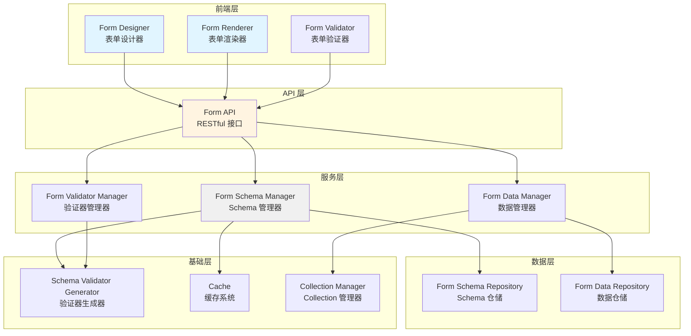

# AlkaidSYS 低代码表单设计器插件设计

> **文档版本**：v1.0
> **创建日期**：2025-01-20
> **最后更新**：2025-01-20
> **作者**：AlkaidSYS 架构团队

---

## 📋 目录

- [1. 插件概述](#1-插件概述)
- [2. Schema 结构设计](#2-schema-结构设计)
- [3. 表单渲染器实现](#3-表单渲染器实现)
- [4. 表单验证器实现](#4-表单验证器实现)
- [5. 表单设计器界面设计](#5-表单设计器界面设计)
- [6. 数据表结构设计](#6-数据表结构设计)
- [7. API 接口设计](#7-api-接口设计)
- [8. 完整代码示例](#8-完整代码示例)

## 🔗 关联设计文档

- [术语表（Glossary）](../00-core-planning/99-GLOSSARY.md)
- [低代码数据建模插件设计](42-lowcode-data-modeling.md)
- [表单 → 数据建模 → 工作流端到端集成设计](51-form-collection-workflow-end-to-end.md)
- [可观测性与运维设计](../04-security-performance/15-observability-and-ops-design.md)


---

## 1. 插件概述

### 1.1 插件信息

- **插件名称**：lowcode-form-designer
- **插件标识**：`alkaid/lowcode-form-designer`
- **版本**：v1.0.0
- **依赖**：
  - `alkaid/framework` >= 1.0.0
  - `alkaid/lowcode-data-modeling` >= 1.0.0
  - `topthink/think-orm` >= 3.0

### 1.2 核心功能

1. **表单 Schema 管理**：创建、更新、删除表单 Schema
2. **表单渲染**：基于 Schema 动态渲染表单（Ant Design Vue）
3. **表单验证**：前后端统一的验证规则
4. **表单设计器**：拖拽式可视化表单设计器
5. **表单提交处理**：自动处理表单数据的保存和更新

### 1.3 架构设计



---

## 2. Schema 结构设计

### 2.1 JSON Schema 标准

表单 Schema 基于 **JSON Schema** 标准，扩展了 `x-component` 和 `x-decorator` 属性用于 UI 渲染。

### 2.2 Schema 结构示例

```json
{
  "type": "object",
  "title": "商品表单",
  "description": "商品信息录入表单",
  "properties": {
    "name": {
      "type": "string",
      "title": "商品名称",
      "description": "请输入商品名称",
      "minLength": 2,
      "maxLength": 50,
      "x-component": "Input",
      "x-decorator": "FormItem",
      "x-decorator-props": {
        "label": "商品名称",
        "required": true,
        "tooltip": "商品名称长度为 2-50 个字符"
      },
      "x-component-props": {
        "placeholder": "请输入商品名称",
        "maxlength": 50,
        "showCount": true
      }
    },
    "price": {
      "type": "number",
      "title": "商品价格",
      "minimum": 0,
      "maximum": 999999.99,
      "x-component": "InputNumber",
      "x-decorator": "FormItem",
      "x-decorator-props": {
        "label": "商品价格",
        "required": true
      },
      "x-component-props": {
        "placeholder": "请输入商品价格",
        "min": 0,
        "max": 999999.99,
        "precision": 2,
        "prefix": "¥"
      }
    },
    "category_id": {
      "type": "integer",
      "title": "商品分类",
      "x-component": "Select",
      "x-decorator": "FormItem",
      "x-decorator-props": {
        "label": "商品分类",
        "required": true
      },
      "x-component-props": {
        "placeholder": "请选择商品分类",
        "options": [
          { "label": "电子产品", "value": 1 },
          { "label": "服装鞋帽", "value": 2 },
          { "label": "食品饮料", "value": 3 }
        ]
      }
    },
    "status": {
      "type": "string",
      "title": "商品状态",
      "enum": ["draft", "published", "offline"],
      "x-component": "Radio",
      "x-decorator": "FormItem",
      "x-decorator-props": {
        "label": "商品状态"
      },
      "x-component-props": {
        "options": [
          { "label": "草稿", "value": "draft" },
          { "label": "已上架", "value": "published" },
          { "label": "已下架", "value": "offline" }
        ]
      }
    },
    "tags": {
      "type": "array",
      "title": "商品标签",
      "items": {
        "type": "string"
      },
      "x-component": "Checkbox",
      "x-decorator": "FormItem",
      "x-decorator-props": {
        "label": "商品标签"
      },
      "x-component-props": {
        "options": [
          { "label": "热销", "value": "hot" },
          { "label": "新品", "value": "new" },
          { "label": "促销", "value": "promotion" }
        ]
      }
    },
    "description": {
      "type": "string",
      "title": "商品描述",
      "maxLength": 500,
      "x-component": "Textarea",
      "x-decorator": "FormItem",
      "x-decorator-props": {
        "label": "商品描述"
      },
      "x-component-props": {
        "placeholder": "请输入商品描述",
        "rows": 4,
        "maxlength": 500,
        "showCount": true
      }
    },
    "images": {
      "type": "array",
      "title": "商品图片",
      "items": {
        "type": "string"
      },
      "x-component": "Upload",
      "x-decorator": "FormItem",
      "x-decorator-props": {
        "label": "商品图片"
      },
      "x-component-props": {
        "listType": "picture-card",
        "maxCount": 5,
        "accept": "image/*"
      }
    },
    "publish_date": {
      "type": "string",
      "format": "date",
      "title": "上架日期",
      "x-component": "DatePicker",
      "x-decorator": "FormItem",
      "x-decorator-props": {
        "label": "上架日期"
      },
      "x-component-props": {
        "placeholder": "请选择上架日期",
        "format": "YYYY-MM-DD"
      }
    }
  },
  "required": ["name", "price", "category_id"],
  "x-layout": {
    "type": "grid",
    "columns": 2,
    "gutter": 16
  }
}
```

### 2.3 支持的组件类型（基于 Ant Design Vue）

| 组件类型 | Ant Design Vue 组件 | 适用数据类型 | 说明 |
|---------|-------------------|------------|------|
| **Input** | a-input | string | 单行文本输入 |
| **Textarea** | a-textarea | string | 多行文本输入 |
| **InputNumber** | a-input-number | number | 数字输入 |
| **Select** | a-select | string/number | 下拉选择 |
| **Radio** | a-radio-group | string/number | 单选 |
| **Checkbox** | a-checkbox-group | array | 多选 |
| **Switch** | a-switch | boolean | 开关 |
| **DatePicker** | a-date-picker | string | 日期选择 |
| **TimePicker** | a-time-picker | string | 时间选择 |
| **RangePicker** | a-range-picker | array | 日期范围选择 |
| **Upload** | a-upload | array | 文件上传 |
| **Cascader** | a-cascader | array | 级联选择 |
| **TreeSelect** | a-tree-select | string/array | 树形选择 |
| **Rate** | a-rate | number | 评分 |
| **Slider** | a-slider | number | 滑块 |

---

## 3. 表单渲染器实现

### 3.1 FormRenderer 组件（Vue 3 + TypeScript）

```vue
<template>
  <a-form
    ref="formRef"
    :model="formData"
    :rules="validationRules"
    :layout="layout"
    v-bind="formProps"
  >
    <a-row v-if="schema['x-layout']?.type === 'grid'" :gutter="schema['x-layout']?.gutter || 16">
      <a-col
        v-for="(field, key) in schema.properties"
        :key="key"
        :span="getColSpan(field)"
      >
        <FormField
          :field-key="key"
          :field-schema="field"
          :form-data="formData"
          @update:value="handleFieldUpdate(key, $event)"
        />
      </a-col>
    </a-row>

    <template v-else>
      <FormField
        v-for="(field, key) in schema.properties"
        :key="key"
        :field-key="key"
        :field-schema="field"
        :form-data="formData"
        @update:value="handleFieldUpdate(key, $event)"
      />
    </template>

    <a-form-item v-if="showSubmit">
      <a-space>
        <a-button type="primary" @click="handleSubmit" :loading="submitting">
          {{ submitText }}
        </a-button>
        <a-button @click="handleReset">
          {{ resetText }}
        </a-button>
      </a-space>
    </a-form-item>
  </a-form>
</template>

<script setup lang="ts">
import { ref, reactive, computed, watch } from 'vue';
import type { FormInstance } from 'ant-design-vue';
import FormField from './FormField.vue';

interface Props {
  schema: Record<string, any>;
  modelValue?: Record<string, any>;
  layout?: 'horizontal' | 'vertical' | 'inline';
  showSubmit?: boolean;
  submitText?: string;
  resetText?: string;
}

const props = withDefaults(defineProps<Props>(), {
  layout: 'horizontal',
  showSubmit: true,
  submitText: '提交',
  resetText: '重置',
});

const emit = defineEmits<{
  (e: 'update:modelValue', value: Record<string, any>): void;
  (e: 'submit', value: Record<string, any>): void;
  (e: 'reset'): void;
}>();

const formRef = ref<FormInstance>();
const formData = reactive<Record<string, any>>(props.modelValue || {});
const submitting = ref(false);

// 生成验证规则
const validationRules = computed(() => {
  const rules: Record<string, any[]> = {};

  Object.entries(props.schema.properties || {}).forEach(([key, field]: [string, any]) => {
    const fieldRules: any[] = [];

    // 必填验证
    if (props.schema.required?.includes(key)) {
      fieldRules.push({
        required: true,
        message: `${field.title || key}不能为空`,
      });
    }

    // 字符串长度验证
    if (field.type === 'string') {
      if (field.minLength) {
        fieldRules.push({
          min: field.minLength,
          message: `${field.title || key}长度不能少于${field.minLength}个字符`,
        });
      }
      if (field.maxLength) {
        fieldRules.push({
          max: field.maxLength,
          message: `${field.title || key}长度不能超过${field.maxLength}个字符`,
        });
      }
    }

    // 数字范围验证
    if (field.type === 'number') {
      if (field.minimum !== undefined) {
        fieldRules.push({
          type: 'number',
          min: field.minimum,
          message: `${field.title || key}不能小于${field.minimum}`,
        });
      }
      if (field.maximum !== undefined) {
        fieldRules.push({
          type: 'number',
          max: field.maximum,
          message: `${field.title || key}不能大于${field.maximum}`,
        });
      }
    }

    // 枚举验证
    if (field.enum) {
      fieldRules.push({
        enum: field.enum,
        message: `${field.title || key}必须是以下值之一：${field.enum.join(', ')}`,
      });
    }

    if (fieldRules.length > 0) {
      rules[key] = fieldRules;
    }
  });

  return rules;
});

// 计算列宽
const getColSpan = (field: any) => {
  const columns = props.schema['x-layout']?.columns || 2;
  const fieldSpan = field['x-decorator-props']?.span;
  return fieldSpan || Math.floor(24 / columns);
};

// 字段值更新
const handleFieldUpdate = (key: string, value: any) => {
  formData[key] = value;
  emit('update:modelValue', formData);
};

// 提交表单
const handleSubmit = async () => {
  try {
    await formRef.value?.validate();
    submitting.value = true;
    emit('submit', formData);
  } catch (error) {
    console.error('表单验证失败:', error);
  } finally {
    submitting.value = false;
  }
};

// 重置表单
const handleReset = () => {
  formRef.value?.resetFields();
  emit('reset');
};

// 监听外部数据变化
watch(() => props.modelValue, (newValue) => {
  if (newValue) {
    Object.assign(formData, newValue);
  }
}, { deep: true });

// 暴露方法
defineExpose({
  validate: () => formRef.value?.validate(),
  resetFields: () => formRef.value?.resetFields(),
  getFieldsValue: () => formData,
});
</script>
```

### 3.2 FormField 组件（动态组件渲染）

```vue
<template>
  <a-form-item
    :label="fieldSchema['x-decorator-props']?.label"
    :name="fieldKey"
    :required="fieldSchema['x-decorator-props']?.required"
    :tooltip="fieldSchema['x-decorator-props']?.tooltip"
    v-bind="fieldSchema['x-decorator-props']"
  >
    <component
      :is="getComponent(fieldSchema['x-component'])"
      v-model:value="fieldValue"
      v-bind="fieldSchema['x-component-props']"
      @change="handleChange"
    />
  </a-form-item>
</template>

<script setup lang="ts">
import { ref, computed, watch } from 'vue';
import {
  Input,
  InputNumber,
  Textarea,
  Select,
  RadioGroup,
  CheckboxGroup,
  Switch,
  DatePicker,
  TimePicker,
  RangePicker,
  Upload,
  Cascader,
  TreeSelect,
  Rate,
  Slider,
} from 'ant-design-vue';

interface Props {
  fieldKey: string;
  fieldSchema: Record<string, any>;
  formData: Record<string, any>;
}

const props = defineProps<Props>();
const emit = defineEmits<{
  (e: 'update:value', value: any): void;
}>();

const fieldValue = ref(props.formData[props.fieldKey]);

// 组件映射
const componentMap: Record<string, any> = {
  Input,
  Textarea,
  InputNumber,
  Select,
  Radio: RadioGroup,
  Checkbox: CheckboxGroup,
  Switch,
  DatePicker,
  TimePicker,
  RangePicker,
  Upload,
  Cascader,
  TreeSelect,
  Rate,
  Slider,
};

// 获取组件
const getComponent = (componentName: string) => {
  return componentMap[componentName] || Input;
};

// 处理值变化
const handleChange = (value: any) => {
  emit('update:value', value);
};

// 监听表单数据变化
watch(() => props.formData[props.fieldKey], (newValue) => {
  fieldValue.value = newValue;
});
</script>
```

---

## 4. 表单验证器实现

### 4.1 后端验证器生成器（PHP）

```php
<?php

namespace alkaid\lowcode\formdesigner\service;

use think\Validate;

/**
 * 表单验证器生成器
 */
class FormValidatorGenerator
{
    /**
     * 从 Schema 生成验证器
     */
    public function generate(array $schema): Validate
    {
        $rules = [];
        $messages = [];

        foreach ($schema['properties'] ?? [] as $field => $config) {
            $fieldRules = $this->generateFieldRules($field, $config, $schema);

            if ($fieldRules) {
                $rules[$field] = $fieldRules;
                $messages = array_merge($messages, $this->generateFieldMessages($field, $config));
            }
        }

        return new Validate($rules, $messages);
    }

    /**
     * 生成字段验证规则
     */
    protected function generateFieldRules(string $field, array $config, array $schema): string
    {
        $rules = [];

        // 必填验证
        if (in_array($field, $schema['required'] ?? [])) {
            $rules[] = 'require';
        }

        // 类型验证
        switch ($config['type']) {
            case 'string':
                // 字符串长度验证
                if (isset($config['minLength'])) {
                    $rules[] = "min:{$config['minLength']}";
                }
                if (isset($config['maxLength'])) {
                    $rules[] = "max:{$config['maxLength']}";
                }
                break;

            case 'number':
            case 'integer':
                $rules[] = 'number';

                // 数字范围验证
                if (isset($config['minimum'])) {
                    $rules[] = "gte:{$config['minimum']}";
                }
                if (isset($config['maximum'])) {
                    $rules[] = "lte:{$config['maximum']}";
                }
                break;

            case 'boolean':
                $rules[] = 'boolean';
                break;

            case 'array':
                $rules[] = 'array';
                break;
        }

        // 枚举验证
        if (isset($config['enum'])) {
            $rules[] = 'in:' . implode(',', $config['enum']);
        }

        // 格式验证
        if (isset($config['format'])) {
            switch ($config['format']) {
                case 'email':
                    $rules[] = 'email';
                    break;
                case 'url':
                    $rules[] = 'url';
                    break;
                case 'date':
                    $rules[] = 'date';
                    break;
            }
        }

        return implode('|', $rules);
    }

    /**
     * 生成字段错误消息
     */
    protected function generateFieldMessages(string $field, array $config): array
    {
        $messages = [];
        $title = $config['title'] ?? $field;

        $messages["{$field}.require"] = "{$title}不能为空";
        $messages["{$field}.number"] = "{$title}必须是数字";
        $messages["{$field}.boolean"] = "{$title}必须是布尔值";
        $messages["{$field}.array"] = "{$title}必须是数组";
        $messages["{$field}.email"] = "{$title}格式不正确";
        $messages["{$field}.url"] = "{$title}格式不正确";
        $messages["{$field}.date"] = "{$title}格式不正确";

        if (isset($config['minLength'])) {
            $messages["{$field}.min"] = "{$title}长度不能少于{$config['minLength']}个字符";
        }
        if (isset($config['maxLength'])) {
            $messages["{$field}.max"] = "{$title}长度不能超过{$config['maxLength']}个字符";
        }
        if (isset($config['minimum'])) {
            $messages["{$field}.gte"] = "{$title}不能小于{$config['minimum']}";
        }
        if (isset($config['maximum'])) {
            $messages["{$field}.lte"] = "{$title}不能大于{$config['maximum']}";
        }
        if (isset($config['enum'])) {
            $messages["{$field}.in"] = "{$title}必须是以下值之一：" . implode('、', $config['enum']);
        }

        return $messages;
    }
}
```

---

## 5. 表单设计器界面设计

### 5.1 FormDesigner 组件（拖拽式设计器）

```vue
<template>
  <div class="form-designer">
    <a-layout>
      <!-- 左侧组件面板 -->
      <a-layout-sider width="250" theme="light" class="component-panel">
        <div class="panel-header">组件库</div>
        <a-collapse v-model:activeKey="activeKeys" :bordered="false">
          <a-collapse-panel key="basic" header="基础组件">
            <draggable
              :list="basicComponents"
              :group="{ name: 'components', pull: 'clone', put: false }"
              :clone="cloneComponent"
              item-key="type"
            >
              <template #item="{ element }">
                <div class="component-item">
                  <component :is="element.icon" />
                  <span>{{ element.label }}</span>
                </div>
              </template>
            </draggable>
          </a-collapse-panel>

          <a-collapse-panel key="advanced" header="高级组件">
            <draggable
              :list="advancedComponents"
              :group="{ name: 'components', pull: 'clone', put: false }"
              :clone="cloneComponent"
              item-key="type"
            >
              <template #item="{ element }">
                <div class="component-item">
                  <component :is="element.icon" />
                  <span>{{ element.label }}</span>
                </div>
              </template>
            </draggable>
          </a-collapse-panel>
        </a-collapse>
      </a-layout-sider>

      <!-- 中间画布区域 -->
      <a-layout-content class="canvas-area">
        <div class="canvas-header">
          <a-space>
            <a-button @click="handlePreview">
              <EyeOutlined />
              预览
            </a-button>
            <a-button @click="handleSave" type="primary">
              <SaveOutlined />
              保存
            </a-button>
            <a-button @click="handleClear" danger>
              <DeleteOutlined />
              清空
            </a-button>
          </a-space>
        </div>

        <div class="canvas-body">
          <a-form :layout="formLayout">
            <draggable
              v-model="formFields"
              group="components"
              item-key="id"
              @change="handleFieldsChange"
            >
              <template #item="{ element, index }">
                <div
                  class="field-wrapper"
                  :class="{ active: selectedFieldIndex === index }"
                  @click="selectField(index)"
                >
                  <FormField
                    :field-key="element.key"
                    :field-schema="element.schema"
                    :form-data="{}"
                  />
                  <div class="field-actions">
                    <a-button
                      size="small"
                      type="text"
                      @click.stop="removeField(index)"
                    >
                      <DeleteOutlined />
                    </a-button>
                  </div>
                </div>
              </template>
            </draggable>

            <a-empty v-if="formFields.length === 0" description="拖拽左侧组件到此处" />
          </a-form>
        </div>
      </a-layout-content>

      <!-- 右侧属性面板 -->
      <a-layout-sider width="300" theme="light" class="property-panel">
        <div class="panel-header">属性配置</div>

        <div v-if="selectedField" class="property-body">
          <a-form layout="vertical">
            <a-form-item label="字段标识">
              <a-input v-model:value="selectedField.key" />
            </a-form-item>

            <a-form-item label="字段标题">
              <a-input v-model:value="selectedField.schema.title" />
            </a-form-item>

            <a-form-item label="占位符">
              <a-input
                v-model:value="selectedField.schema['x-component-props'].placeholder"
              />
            </a-form-item>

            <a-form-item label="是否必填">
              <a-switch
                v-model:checked="selectedField.schema['x-decorator-props'].required"
              />
            </a-form-item>

            <a-form-item
              v-if="selectedField.schema.type === 'string'"
              label="最小长度"
            >
              <a-input-number
                v-model:value="selectedField.schema.minLength"
                :min="0"
              />
            </a-form-item>

            <a-form-item
              v-if="selectedField.schema.type === 'string'"
              label="最大长度"
            >
              <a-input-number
                v-model:value="selectedField.schema.maxLength"
                :min="0"
              />
            </a-form-item>

            <!-- 更多属性配置... -->
          </a-form>
        </div>

        <a-empty v-else description="请选择一个字段" />
      </a-layout-sider>
    </a-layout>

    <!-- 预览对话框 -->
    <a-modal
      v-model:visible="previewVisible"
      title="表单预览"
      width="800px"
      :footer="null"
    >
      <FormRenderer :schema="generatedSchema" />
    </a-modal>
  </div>
</template>

<script setup lang="ts">
import { ref, computed } from 'vue';
import draggable from 'vuedraggable';
import { EyeOutlined, SaveOutlined, DeleteOutlined } from '@ant-design/icons-vue';
import FormRenderer from './FormRenderer.vue';
import FormField from './FormField.vue';

// 基础组件列表
const basicComponents = ref([
  { type: 'Input', label: '单行文本', icon: 'FormOutlined' },
  { type: 'Textarea', label: '多行文本', icon: 'FileTextOutlined' },
  { type: 'InputNumber', label: '数字输入', icon: 'NumberOutlined' },
  { type: 'Select', label: '下拉选择', icon: 'SelectOutlined' },
  { type: 'Radio', label: '单选框', icon: 'CheckCircleOutlined' },
  { type: 'Checkbox', label: '多选框', icon: 'CheckSquareOutlined' },
  { type: 'Switch', label: '开关', icon: 'SwapOutlined' },
  { type: 'DatePicker', label: '日期选择', icon: 'CalendarOutlined' },
]);

// 高级组件列表
const advancedComponents = ref([
  { type: 'Upload', label: '文件上传', icon: 'UploadOutlined' },
  { type: 'Cascader', label: '级联选择', icon: 'ApartmentOutlined' },
  { type: 'TreeSelect', label: '树形选择', icon: 'BranchesOutlined' },
  { type: 'Rate', label: '评分', icon: 'StarOutlined' },
  { type: 'Slider', label: '滑块', icon: 'SliderOutlined' },
]);

const activeKeys = ref(['basic']);
const formFields = ref<any[]>([]);
const selectedFieldIndex = ref<number | null>(null);
const formLayout = ref<'horizontal' | 'vertical'>('horizontal');
const previewVisible = ref(false);

// 选中的字段
const selectedField = computed(() => {
  if (selectedFieldIndex.value !== null) {
    return formFields.value[selectedFieldIndex.value];
  }
  return null;
});

// 生成的 Schema
const generatedSchema = computed(() => {
  const properties: Record<string, any> = {};
  const required: string[] = [];

  formFields.value.forEach((field) => {
    properties[field.key] = field.schema;
    if (field.schema['x-decorator-props']?.required) {
      required.push(field.key);
    }
  });

  return {
    type: 'object',
    properties,
    required,
  };
});

// 克隆组件
const cloneComponent = (component: any) => {
  const id = Date.now();
  const key = `field_${id}`;

  return {
    id,
    key,
    schema: {
      type: getFieldType(component.type),
      title: component.label,
      'x-component': component.type,
      'x-decorator': 'FormItem',
      'x-decorator-props': {
        label: component.label,
        required: false,
      },
      'x-component-props': {
        placeholder: `请输入${component.label}`,
      },
    },
  };
};

// 获取字段类型
const getFieldType = (componentType: string): string => {
  const typeMap: Record<string, string> = {
    Input: 'string',
    Textarea: 'string',
    InputNumber: 'number',
    Select: 'string',
    Radio: 'string',
    Checkbox: 'array',
    Switch: 'boolean',
    DatePicker: 'string',
    Upload: 'array',
    Cascader: 'array',
    TreeSelect: 'string',
    Rate: 'number',
    Slider: 'number',
  };
  return typeMap[componentType] || 'string';
};

// 选择字段
const selectField = (index: number) => {
  selectedFieldIndex.value = index;
};

// 删除字段
const removeField = (index: number) => {
  formFields.value.splice(index, 1);
  if (selectedFieldIndex.value === index) {
    selectedFieldIndex.value = null;
  }
};

// 字段变化
const handleFieldsChange = () => {
  // 处理字段顺序变化
};

// 预览
const handlePreview = () => {
  previewVisible.value = true;
};

// 保存
const handleSave = () => {
  console.log('保存 Schema:', generatedSchema.value);
  // TODO: 调用 API 保存
};

// 清空
const handleClear = () => {
  formFields.value = [];
  selectedFieldIndex.value = null;
};
</script>

<style scoped lang="less">
.form-designer {
  height: 100vh;

  .component-panel,
  .property-panel {
    background: #fff;
    border-right: 1px solid #f0f0f0;

    .panel-header {
      padding: 16px;
      font-weight: 600;
      border-bottom: 1px solid #f0f0f0;
    }

    .component-item {
      padding: 8px 12px;
      margin: 4px 8px;
      background: #fafafa;
      border: 1px solid #d9d9d9;
      border-radius: 4px;
      cursor: move;
      display: flex;
      align-items: center;
      gap: 8px;

      &:hover {
        background: #e6f7ff;
        border-color: #1890ff;
      }
    }
  }

  .canvas-area {
    background: #f5f5f5;

    .canvas-header {
      padding: 16px;
      background: #fff;
      border-bottom: 1px solid #f0f0f0;
    }

    .canvas-body {
      padding: 24px;
      min-height: calc(100vh - 64px);

      .field-wrapper {
        position: relative;
        padding: 12px;
        margin-bottom: 16px;
        background: #fff;
        border: 2px solid transparent;
        border-radius: 4px;
        cursor: pointer;

        &:hover,
        &.active {
          border-color: #1890ff;
        }

        .field-actions {
          position: absolute;
          top: 8px;
          right: 8px;
          opacity: 0;
          transition: opacity 0.3s;
        }

        &:hover .field-actions {
          opacity: 1;
        }
      }
    }
  }

  .property-body {
    padding: 16px;
  }
}
</style>
```

---

## 6. 数据表结构设计

### 6.1 lowcode_forms 表

```sql
CREATE TABLE `lowcode_forms` (
  `id` bigint(20) unsigned NOT NULL AUTO_INCREMENT,
  `tenant_id` bigint(20) unsigned NOT NULL COMMENT '租户ID',
  `site_id` bigint(20) unsigned DEFAULT '0' COMMENT '站点ID',
  `name` varchar(100) NOT NULL COMMENT '表单标识',
  `title` varchar(200) NOT NULL COMMENT '表单标题',
  `description` text COMMENT '表单描述',
  `schema` json NOT NULL COMMENT '表单 Schema',
  `collection_name` varchar(100) DEFAULT NULL COMMENT '关联的 Collection',
  `layout` varchar(20) DEFAULT 'horizontal' COMMENT '表单布局',
  `status` tinyint(1) DEFAULT '1' COMMENT '状态：1-启用，0-禁用',
  `created_at` timestamp NULL DEFAULT NULL,
  `updated_at` timestamp NULL DEFAULT NULL,
  PRIMARY KEY (`id`),
  KEY `idx_tenant_site` (`tenant_id`,`site_id`),
  UNIQUE KEY `uk_tenant_name` (`tenant_id`,`name`),
  KEY `idx_collection_name` (`tenant_id`,`collection_name`)
) ENGINE=InnoDB DEFAULT CHARSET=utf8mb4 COMMENT='表单元数据表（多租户适配）';
```

---

## 7. API 接口设计

### 7.1 Form CRUD API（PHP）

```php
<?php

namespace plugin\lowcode\formdesigner\controller;

use alkaid\lowcode\formdesigner\service\FormSchemaManager;
use alkaid\lowcode\formdesigner\service\FormValidatorGenerator;
use think\Request;

/**
 * 表单 API 控制器
 */
class FormController
{
    protected FormSchemaManager $schemaManager;
    protected FormValidatorGenerator $validatorGenerator;

    public function __construct(
        FormSchemaManager $schemaManager,
        FormValidatorGenerator $validatorGenerator
    ) {
        $this->schemaManager = $schemaManager;
        $this->validatorGenerator = $validatorGenerator;
    }

    /**
     * 获取表单列表
     * GET /api/lowcode/forms
     */
    public function index(Request $request)
    {
        $forms = $this->schemaManager->getAll();

        return json([
            'code' => 0,
            'data' => $forms,
        ]);
    }

    /**
     * 获取单个表单
     * GET /api/lowcode/forms/{name}
     */
    public function show(string $name)
    {
        $form = $this->schemaManager->get($name);

        if (!$form) {
            return json([
                'code' => 404,
                'message' => '表单不存在',
            ], 404);
        }

        return json([
            'code' => 0,
            'data' => $form,
        ]);
    }

    /**
     * 创建表单
     * POST /api/lowcode/forms
     */
    public function create(Request $request)
    {
        $data = $request->post();

        // 验证数据
        $validate = validate([
            'name' => 'require|alphaDash|unique:lowcode_forms',
            'title' => 'require',
            'schema' => 'require|array',
        ]);

        if (!$validate->check($data)) {
            return json([
                'code' => 400,
                'message' => $validate->getError(),
            ], 400);
        }

        // 创建表单
        $form = $this->schemaManager->create($data);

        return json([
            'code' => 0,
            'message' => '表单创建成功',
            'data' => $form,
        ]);
    }

    /**
     * 提交表单数据
     * POST /api/lowcode/forms/{name}/submit
     */
    public function submit(Request $request, string $name)
    {
        $form = $this->schemaManager->get($name);

        if (!$form) {
            return json([
                'code' => 404,
                'message' => '表单不存在',
            ], 404);
        }

        $data = $request->post();

        // 生成验证器并验证
        $validator = $this->validatorGenerator->generate($form['schema']);

        if (!$validator->check($data)) {
            return json([
                'code' => 400,
                'message' => '数据验证失败',
                'errors' => $validator->getError(),
            ], 400);
        }

        // 保存数据到关联的 Collection
        // TODO: 实现数据保存逻辑

        return json([
            'code' => 0,
            'message' => '提交成功',
        ]);
    }
}
```

---

**文档结束**


