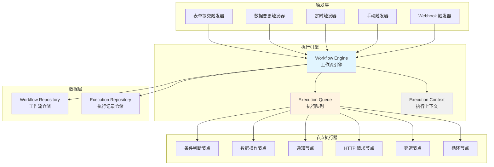

# AlkaidSYS 低代码工作流引擎插件设计

> **文档版本**：v1.0
> **创建日期**：2025-01-20
> **最后更新**：2025-01-20
> **作者**：AlkaidSYS 架构团队

---

## 📋 目录

- [1. 插件概述](#1-插件概述)
- [2. 工作流引擎架构设计](#2-工作流引擎架构设计)
- [3. 触发器系统](#3-触发器系统)
- [4. 节点类型系统](#4-节点类型系统)
- [5. 执行引擎实现](#5-执行引擎实现)
- [6. 变量系统和条件分支](#6-变量系统和条件分支)
- [7. 工作流设计器界面设计](#7-工作流设计器界面设计)
- [8. 数据表结构设计](#8-数据表结构设计)
- [9. API 接口设计](#9-api-接口设计)

## 🔗 关联设计文档

- [术语表（Glossary）](../00-core-planning/99-GLOSSARY.md)
- [低代码数据建模插件设计](42-lowcode-data-modeling.md)
- [低代码表单设计器插件设计](43-lowcode-form-designer.md)
- [表单 → 数据建模 → 工作流端到端集成设计](51-form-collection-workflow-end-to-end.md)
- [可观测性与运维设计](../04-security-performance/15-observability-and-ops-design.md)
- [非功能性总览](../04-security-performance/10-non-functional-overview.md)
- [安全基线与依赖升级策略](../04-security-performance/14-security-baseline-and-dependency-upgrade.md)

---

## 1. 插件概述

### 1.1 插件信息

- **插件名称**：lowcode-workflow
- **插件标识**：`alkaid/lowcode-workflow`
- **版本**：v1.0.0
- **依赖**：
  - `alkaid/framework` >= 1.0.0
  - `alkaid/lowcode-data-modeling` >= 1.0.0
  - `topthink/think-orm` >= 3.0
  - `topthink/think-queue` >= 3.0

### 1.2 核心功能

1. **工作流定义**：创建、更新、删除工作流
2. **触发器管理**：支持 10+ 种触发器类型
3. **节点管理**：支持 10+ 种节点类型
4. **执行引擎**：基于 Swoole 协程的异步执行
5. **变量系统**：支持上下文变量和表达式计算
6. **条件分支**：支持复杂的条件判断和分支逻辑
7. **执行历史**：记录工作流执行历史和日志

### 1.3 架构设计



---

## 2. 工作流引擎架构设计

### 2.1 工作流定义结构

```json
{
  "id": "workflow_001",
  "name": "order_workflow",
  "title": "订单处理工作流",
  "description": "自动处理订单创建后的流程",
  "trigger": {
    "type": "data_created",
    "config": {
      "collection": "orders",
      "conditions": {
        "status": "pending"
      }
    }
  },
  "nodes": [
    {
      "id": "node_001",
      "type": "condition",
      "title": "判断订单金额",
      "config": {
        "expression": "{{trigger.data.total}} > 1000",
        "true_branch": "node_002",
        "false_branch": "node_003"
      }
    },
    {
      "id": "node_002",
      "type": "notification",
      "title": "发送高额订单通知",
      "config": {
        "channel": "email",
        "to": "manager@example.com",
        "subject": "高额订单提醒",
        "content": "订单号：{{trigger.data.order_no}}，金额：{{trigger.data.total}}"
      }
    },
    {
      "id": "node_003",
      "type": "data_update",
      "title": "更新订单状态",
      "config": {
        "collection": "orders",
        "id": "{{trigger.data.id}}",
        "data": {
          "status": "processing"
        }
      }
    }
  ],
  "variables": {
    "manager_email": "manager@example.com",
    "high_amount_threshold": 1000
  }
}
```

### 2.2 核心类设计

```php
<?php

namespace alkaid\lowcode\workflow\model;

/**
 * 工作流模型
 */
class Workflow
{
    protected string $id;
    protected string $name;
    protected string $title;
    protected array $trigger;
    protected array $nodes;
    protected array $variables;
    protected bool $enabled;

    public function __construct(array $data)
    {
        $this->id = $data['id'] ?? uniqid('workflow_');
        $this->name = $data['name'];
        $this->title = $data['title'];
        $this->trigger = $data['trigger'];
        $this->nodes = $data['nodes'] ?? [];
        $this->variables = $data['variables'] ?? [];
        $this->enabled = $data['enabled'] ?? true;
    }

    /**
     * 获取起始节点
     */
    public function getStartNode(): ?array
    {
        return $this->nodes[0] ?? null;
    }

    /**
     * 根据 ID 获取节点
     */
    public function getNode(string $nodeId): ?array
    {
        foreach ($this->nodes as $node) {
            if ($node['id'] === $nodeId) {
                return $node;
            }
        }
        return null;
    }

    /**
     * 转换为数组
     */
    public function toArray(): array
    {
        return [
            'id' => $this->id,
            'name' => $this->name,
            'title' => $this->title,
            'trigger' => $this->trigger,
            'nodes' => $this->nodes,
            'variables' => $this->variables,
            'enabled' => $this->enabled,
        ];
    }
}
```

---

## 3. 触发器系统

### 3.1 支持的触发器类型（10+ 种）

| 触发器类型 | 标识 | 说明 | 使用场景 |
|-----------|------|------|---------|
| **表单提交** | form_submitted | 表单提交时触发 | 表单审批流程 |
| **数据创建** | data_created | 数据创建时触发 | 订单创建后处理 |
| **数据更新** | data_updated | 数据更新时触发 | 状态变更通知 |
| **数据删除** | data_deleted | 数据删除时触发 | 删除前备份 |
| **定时触发** | scheduled | 按计划时间触发 | 定时报表生成 |
| **手动触发** | manual | 手动执行触发 | 批量数据处理 |
| **Webhook** | webhook | 外部 Webhook 触发 | 第三方系统集成 |
| **字段变更** | field_changed | 特定字段变更时触发 | 价格变动通知 |
| **条件满足** | condition_met | 满足特定条件时触发 | 库存预警 |
| **用户操作** | user_action | 用户执行特定操作时触发 | 用户注册欢迎流程 |

### 3.2 触发器接口

```php
<?php

namespace alkaid\lowcode\workflow\trigger;

/**
 * 触发器接口
 */
interface TriggerInterface
{
    /**
     * 获取触发器类型
     */
    public function getType(): string;

    /**
     * 注册触发器
     */
    public function register(array $config): void;

    /**
     * 检查是否应该触发
     */
    public function shouldTrigger(array $context): bool;

    /**
     * 获取触发上下文数据
     */
    public function getContext(): array;
}
```

### 3.3 数据创建触发器实现

```php
<?php

namespace alkaid\lowcode\workflow\trigger;

use think\facade\Event;

/**
 * 数据创建触发器
 */
class DataCreatedTrigger implements TriggerInterface
{
    protected array $config;

    public function getType(): string
    {
        return 'data_created';
    }

    public function register(array $config): void
    {
        $this->config = $config;

        // 监听数据创建事件
        Event::listen('lowcode.collection.data.created', function ($data) {
            if ($this->shouldTrigger(['data' => $data])) {
                // 触发工作流
                $this->triggerWorkflow($data);
            }
        });
    }

    public function shouldTrigger(array $context): bool
    {
        $data = $context['data'];

        // 检查 Collection 是否匹配
        if ($data['collection'] !== $this->config['collection']) {
            return false;
        }

        // 检查条件是否满足
        if (isset($this->config['conditions'])) {
            foreach ($this->config['conditions'] as $field => $value) {
                if ($data['data'][$field] ?? null !== $value) {
                    return false;
                }
            }
        }

        return true;
    }

    public function getContext(): array
    {
        return [
            'trigger' => [
                'type' => $this->getType(),
                'data' => $this->config,
            ],
        ];
    }

    /**
     * 触发工作流
     */
    protected function triggerWorkflow(array $data): void
    {
        // 获取关联的工作流
        $workflows = app(\alkaid\lowcode\workflow\service\WorkflowManager::class)
            ->getByTrigger($this->getType(), $this->config['collection']);

        foreach ($workflows as $workflow) {
            // 创建执行实例
            app(\alkaid\lowcode\workflow\service\WorkflowExecutor::class)
                ->execute($workflow, [
                    'trigger' => [
                        'type' => $this->getType(),
                        'data' => $data['data'],
                    ],
                ]);
        }
    }
}
```

### 3.4 定时触发器实现

```php
<?php

namespace alkaid\lowcode\workflow\trigger;

use think\facade\Queue;

/**
 * 定时触发器
 */
class ScheduledTrigger implements TriggerInterface
{
    protected array $config;

    public function getType(): string
    {
        return 'scheduled';
    }

    public function register(array $config): void
    {
        $this->config = $config;

        // 注册定时任务
        // 支持 cron 表达式：0 0 * * * (每天 0 点)
        $cron = $config['cron'] ?? '0 0 * * *';

        // 使用 ThinkPHP 队列系统
        Queue::later(
            $this->getNextExecutionTime($cron),
            \alkaid\lowcode\workflow\job\ScheduledWorkflowJob::class,
            [
                'workflow_id' => $config['workflow_id'],
                'cron' => $cron,
            ]
        );
    }

    public function shouldTrigger(array $context): bool
    {
        // 定时触发器总是返回 true
        return true;
    }

    public function getContext(): array
    {
        return [
            'trigger' => [
                'type' => $this->getType(),
                'time' => date('Y-m-d H:i:s'),
            ],
        ];
    }

    /**
     * 计算下次执行时间
     */
    protected function getNextExecutionTime(string $cron): int
    {
        // TODO: 实现 cron 表达式解析
        return 3600; // 1 小时后
    }
}
```

---

## 4. 节点类型系统

### 4.1 支持的节点类型（10+ 种）

| 节点类型 | 标识 | 说明 | 使用场景 |
|---------|------|------|---------|
| **条件判断** | condition | 根据条件分支 | 订单金额判断 |
| **数据查询** | data_query | 查询数据 | 查询用户信息 |
| **数据创建** | data_create | 创建数据 | 创建订单记录 |
| **数据更新** | data_update | 更新数据 | 更新订单状态 |
| **数据删除** | data_delete | 删除数据 | 删除过期数据 |
| **发送通知** | notification | 发送通知 | 邮件/短信通知 |
| **HTTP 请求** | http_request | 调用外部 API | 调用支付接口 |
| **延迟执行** | delay | 延迟一段时间 | 延迟 1 小时后执行 |
| **循环** | loop | 循环执行 | 批量处理数据 |
| **子流程** | subprocess | 调用子工作流 | 复杂流程拆分 |
| **脚本执行** | script | 执行自定义脚本 | 复杂业务逻辑 |
| **并行执行** | parallel | 并行执行多个节点 | 同时发送多个通知 |

### 4.2 节点接口

```php
<?php

namespace alkaid\lowcode\workflow\node;

/**
 * 节点接口
 */
interface NodeInterface
{
    /**
     * 获取节点类型
     */
    public function getType(): string;

    /**
     * 执行节点
     */
    public function execute(array $context): array;

    /**
     * 验证节点配置
     */
    public function validate(array $config): bool;
}
```

### 4.3 条件判断节点实现

```php
<?php

namespace alkaid\lowcode\workflow\node;

use alkaid\lowcode\workflow\service\ExpressionEvaluator;

/**
 * 条件判断节点
 */
class ConditionNode implements NodeInterface
{
    protected ExpressionEvaluator $evaluator;

    public function __construct(ExpressionEvaluator $evaluator)
    {
        $this->evaluator = $evaluator;
    }

    public function getType(): string
    {
        return 'condition';
    }

    public function execute(array $context): array
    {
        $config = $context['node']['config'];
        $expression = $config['expression'];

        // 计算表达式
        $result = $this->evaluator->evaluate($expression, $context);

        // 返回下一个节点 ID
        return [
            'next_node' => $result ? $config['true_branch'] : $config['false_branch'],
            'output' => [
                'condition_result' => $result,
            ],
        ];
    }

    public function validate(array $config): bool
    {
        return isset($config['expression'])
            && isset($config['true_branch'])
            && isset($config['false_branch']);
    }
}
```

### 4.4 数据更新节点实现

```php
<?php

namespace alkaid\lowcode\workflow\node;

use alkaid\lowcode\datamodeling\service\CollectionManager;

/**
 * 数据更新节点
 */
class DataUpdateNode implements NodeInterface
{
    protected CollectionManager $collectionManager;

    public function __construct(CollectionManager $collectionManager)
    {
        $this->collectionManager = $collectionManager;
    }

    public function getType(): string
    {
        return 'data_update';
    }

    public function execute(array $context): array
    {
        $config = $context['node']['config'];

        // 获取 Collection
        $collection = $this->collectionManager->get($config['collection']);

        if (!$collection) {
            throw new \Exception("Collection not found: {$config['collection']}");
        }

        // 解析变量
        $id = $this->parseVariable($config['id'], $context);
        $data = $this->parseVariables($config['data'], $context);

        // 更新数据
        $model = $collection->getModel();
        $record = $model::find($id);

        if ($record) {
            $record->save($data);
        }

        return [
            'next_node' => $config['next_node'] ?? null,
            'output' => [
                'updated_id' => $id,
                'updated_data' => $data,
            ],
        ];
    }

    public function validate(array $config): bool
    {
        return isset($config['collection'])
            && isset($config['id'])
            && isset($config['data']);
    }

    /**
     * 解析变量
     */
    protected function parseVariable(string $value, array $context): mixed
    {
        // 解析 {{variable}} 格式的变量
        if (preg_match('/^\{\{(.+)\}\}$/', $value, $matches)) {
            $path = $matches[1];
            return $this->getValueByPath($context, $path);
        }
        return $value;
    }

    /**
     * 解析多个变量
     */
    protected function parseVariables(array $data, array $context): array
    {
        $result = [];
        foreach ($data as $key => $value) {
            if (is_string($value)) {
                $result[$key] = $this->parseVariable($value, $context);
            } else {
                $result[$key] = $value;
            }
        }
        return $result;
    }

    /**
     * 根据路径获取值
     */
    protected function getValueByPath(array $data, string $path): mixed
    {
        $keys = explode('.', $path);
        $value = $data;

        foreach ($keys as $key) {
            if (isset($value[$key])) {
                $value = $value[$key];
            } else {
                return null;
            }
        }

        return $value;
    }
}
```

### 4.5 通知节点实现

```php
<?php

namespace alkaid\lowcode\workflow\node;

use think\facade\Event;

/**
 * 通知节点
 */
class NotificationNode implements NodeInterface
{
    public function getType(): string
    {
        return 'notification';
    }

    public function execute(array $context): array
    {
        $config = $context['node']['config'];

        // 解析变量
        $to = $this->parseVariable($config['to'], $context);
        $subject = $this->parseVariable($config['subject'], $context);
        $content = $this->parseVariable($config['content'], $context);

        // 发送通知
        Event::trigger('lowcode.notification.send', [
            'channel' => $config['channel'],
            'to' => $to,
            'subject' => $subject,
            'content' => $content,
        ]);

        return [
            'next_node' => $config['next_node'] ?? null,
            'output' => [
                'notification_sent' => true,
                'to' => $to,
            ],
        ];
    }

    public function validate(array $config): bool
    {
        return isset($config['channel'])
            && isset($config['to'])
            && isset($config['content']);
    }

    protected function parseVariable(string $value, array $context): string
    {
        // 解析 {{variable}} 格式的变量
        return preg_replace_callback('/\{\{(.+?)\}\}/', function ($matches) use ($context) {
            $path = $matches[1];
            $value = $this->getValueByPath($context, $path);
            return $value ?? '';
        }, $value);
    }

    protected function getValueByPath(array $data, string $path): mixed
    {
        $keys = explode('.', $path);
        $value = $data;

        foreach ($keys as $key) {
            if (isset($value[$key])) {
                $value = $value[$key];
            } else {
                return null;
            }
        }

        return $value;
    }
}
```

---

## 5. 执行引擎实现

### 5.1 工作流执行器（基于 Swoole 协程）

```php
<?php

namespace alkaid\lowcode\workflow\service;

use alkaid\lowcode\workflow\model\Workflow;
use alkaid\lowcode\workflow\node\NodeInterface;
use think\facade\Log;
use Swoole\Coroutine;

/**
 * 工作流执行器
 */
class WorkflowExecutor
{
    protected NodeRegistry $nodeRegistry;
    protected ExecutionLogger $logger;

    public function __construct(
        NodeRegistry $nodeRegistry,
        ExecutionLogger $logger
    ) {
        $this->nodeRegistry = $nodeRegistry;
        $this->logger = $logger;
    }

    /**
     * 执行工作流
     */
    public function execute(Workflow $workflow, array $initialContext = []): string
    {
        // 创建执行记录
        $executionId = $this->createExecution($workflow);

        // 初始化执行上下文
        $context = array_merge([
            'workflow' => $workflow->toArray(),
            'execution_id' => $executionId,
            'variables' => $workflow->toArray()['variables'] ?? [],
        ], $initialContext);

        // 使用 Swoole 协程异步执行
        if (function_exists('go')) {
            go(function () use ($workflow, $context, $executionId) {
                $this->executeWorkflow($workflow, $context, $executionId);
            });
        } else {
            // 同步执行（开发环境）
            $this->executeWorkflow($workflow, $context, $executionId);
        }

        return $executionId;
    }

    /**
     * 执行工作流（内部方法）
     */
    protected function executeWorkflow(Workflow $workflow, array $context, string $executionId): void
    {
        try {
            $this->logger->start($executionId);

            // 获取起始节点
            $currentNode = $workflow->getStartNode();

            while ($currentNode) {
                // 记录节点开始执行
                $this->logger->nodeStart($executionId, $currentNode['id']);

                // 执行节点
                $context['node'] = $currentNode;
                $result = $this->executeNode($currentNode, $context);

                // 记录节点执行结果
                $this->logger->nodeEnd($executionId, $currentNode['id'], $result);

                // 更新上下文
                if (isset($result['output'])) {
                    $context['outputs'][$currentNode['id']] = $result['output'];
                }

                // 获取下一个节点
                $nextNodeId = $result['next_node'] ?? null;
                $currentNode = $nextNodeId ? $workflow->getNode($nextNodeId) : null;
            }

            $this->logger->complete($executionId);
        } catch (\Exception $e) {
            $this->logger->error($executionId, $e->getMessage());
            Log::error("Workflow execution failed: {$e->getMessage()}");
        }
    }

    /**
     * 执行节点
     */
    protected function executeNode(array $node, array $context): array
    {
        $nodeType = $node['type'];
        $nodeExecutor = $this->nodeRegistry->get($nodeType);

        if (!$nodeExecutor) {
            throw new \Exception("Unknown node type: {$nodeType}");
        }

        return $nodeExecutor->execute($context);
    }

    /**
     * 创建执行记录
     */
    protected function createExecution(Workflow $workflow): string
    {
        $executionId = uniqid('exec_');

        // 保存到数据库
        \think\facade\Db::name('lowcode_workflow_executions')->insert([
            'id' => $executionId,
            'workflow_id' => $workflow->toArray()['id'],
            'status' => 'running',
            'started_at' => date('Y-m-d H:i:s'),
        ]);

        return $executionId;
    }
}
```

### 5.2 节点注册表

```php
<?php

namespace alkaid\lowcode\workflow\service;

use alkaid\lowcode\workflow\node\NodeInterface;

/**
 * 节点注册表
 */
class NodeRegistry
{
    protected array $nodes = [];

    /**
     * 注册节点
     */
    public function register(string $type, NodeInterface $node): void
    {
        $this->nodes[$type] = $node;
    }

    /**
     * 获取节点
     */
    public function get(string $type): ?NodeInterface
    {
        return $this->nodes[$type] ?? null;
    }

    /**
     * 获取所有节点类型
     */
    public function getTypes(): array
    {
        return array_keys($this->nodes);
    }
}
```

---

## 6. 变量系统和条件分支

### 6.1 表达式计算器

```php
<?php

namespace alkaid\lowcode\workflow\service;

use Symfony\Component\ExpressionLanguage\ExpressionLanguage;

/**
 * 表达式计算器
 */
class ExpressionEvaluator
{
    /**
     * 计算表达式
     */
    public function evaluate(string $expression, array $context): mixed
    {
        // 替换变量（仍然复用下方 replaceVariables，将 {{ path }} 转换为具体值）
        $expression = $this->replaceVariables($expression, $context);

        // 使用 Symfony ExpressionLanguage 计算表达式，避免 eval 带来的安全风险
        try {
            $language = new ExpressionLanguage();

            $result = $language->evaluate($expression, [
                // 如有需要，可以在表达式中直接访问完整上下文：context.xxx
                'context' => $context,
            ]);

            return $result;
        } catch (\Throwable $e) {
            throw new \RuntimeException("Expression evaluation failed: {$e->getMessage()}", 0, $e);
        }
    }

    /**
     * 替换变量
     */
    protected function replaceVariables(string $expression, array $context): string
    {
        return preg_replace_callback('/\{\{(.+?)\}\}/', function ($matches) use ($context) {
            $path = $matches[1];
            $value = $this->getValueByPath($context, $path);

            // 转换为 PHP 值
            if (is_string($value)) {
                return "'" . addslashes($value) . "'";
            } elseif (is_bool($value)) {
                return $value ? 'true' : 'false';
            } elseif (is_null($value)) {
                return 'null';
            } else {
                return $value;
            }
        }, $expression);
    }

    /**
     * 根据路径获取值
     */
    protected function getValueByPath(array $data, string $path): mixed
    {
        $keys = explode('.', $path);
        $value = $data;

        foreach ($keys as $key) {
            if (isset($value[$key])) {
                $value = $value[$key];
            } else {
                return null;
            }
        }

        return $value;
    }
}
```
> **安全说明：** 本表达式计算器依赖 `symfony/expression-language` 等第三方库，其版本选择与升级策略必须遵守《安全基线与依赖升级策略》（`../04-security-performance/14-security-baseline-and-dependency-upgrade.md`），避免使用存在已知漏洞的版本；同时禁止在自定义节点中引入 `eval` 等不安全执行方式，一切表达式执行应通过经过审计的计算器服务完成。
---

## 7. 工作流设计器界面设计

### 7.1 WorkflowDesigner 组件（Vue 3 + Ant Design Vue）

```vue
<template>
  <div class="workflow-designer">
    <a-layout>
      <!-- 顶部工具栏 -->
      <a-layout-header class="designer-header">
        <a-space>
          <a-button @click="handleSave" type="primary">
            <SaveOutlined />
            保存
          </a-button>
          <a-button @click="handleRun">
            <PlayCircleOutlined />
            运行
          </a-button>
          <a-button @click="handleClear" danger>
            <DeleteOutlined />
            清空
          </a-button>
        </a-space>
      </a-layout-header>

      <!-- 左侧节点面板 -->
      <a-layout>
        <a-layout-sider width="250" theme="light" class="node-panel">
          <div class="panel-header">节点库</div>
          <a-collapse v-model:activeKey="activeKeys" :bordered="false">
            <a-collapse-panel key="logic" header="逻辑节点">
              <div
                v-for="node in logicNodes"
                :key="node.type"
                class="node-item"
                draggable="true"
                @dragstart="handleDragStart($event, node)"
              >
                <component :is="node.icon" />
                <span>{{ node.label }}</span>
              </div>
            </a-collapse-panel>

            <a-collapse-panel key="data" header="数据节点">
              <div
                v-for="node in dataNodes"
                :key="node.type"
                class="node-item"
                draggable="true"
                @dragstart="handleDragStart($event, node)"
              >
                <component :is="node.icon" />
                <span>{{ node.label }}</span>
              </div>
            </a-collapse-panel>

            <a-collapse-panel key="action" header="动作节点">
              <div
                v-for="node in actionNodes"
                :key="node.type"
                class="node-item"
                draggable="true"
                @dragstart="handleDragStart($event, node)"
              >
                <component :is="node.icon" />
                <span>{{ node.label }}</span>
              </div>
            </a-collapse-panel>
          </a-collapse>
        </a-layout-sider>

        <!-- 中间画布区域（使用 LogicFlow 渲染画布） -->
        <a-layout-content
          class="canvas-area"
          @drop="handleDrop"
          @dragover.prevent
        >
          <div class="workflow-canvas" ref="canvasRef"></div>
        </a-layout-content>

        <!-- 右侧属性面板 -->
        <a-layout-sider width="300" theme="light" class="property-panel">
          <div class="panel-header">节点配置</div>

          <div v-if="selectedNode" class="property-body">
            <a-form layout="vertical">
              <a-form-item label="节点标题">
                <a-input v-model:value="selectedNode.data.label" />
              </a-form-item>

              <a-form-item label="节点描述">
                <a-textarea
                  v-model:value="selectedNode.data.description"
                  :rows="3"
                />
              </a-form-item>

              <!-- 根据节点类型显示不同的配置项 -->
              <template v-if="selectedNode.type === 'condition'">
                <a-form-item label="条件表达式">
                  <a-textarea
                    v-model:value="selectedNode.data.config.expression"
                    :rows="3"
                    placeholder="例如：{{trigger.data.total}} > 1000"
                  />
                </a-form-item>
              </template>

              <template v-if="selectedNode.type === 'notification'">
                <a-form-item label="通知渠道">
                  <a-select v-model:value="selectedNode.data.config.channel">
                    <a-select-option value="email">邮件</a-select-option>
                    <a-select-option value="sms">短信</a-select-option>
                    <a-select-option value="wechat">微信</a-select-option>
                  </a-select>
                </a-form-item>

                <a-form-item label="接收人">
                  <a-input v-model:value="selectedNode.data.config.to" />
                </a-form-item>

                <a-form-item label="通知内容">
                  <a-textarea
                    v-model:value="selectedNode.data.config.content"
                    :rows="4"
                  />
                </a-form-item>
              </template>
            </a-form>
          </div>

          <a-empty v-else description="请选择一个节点" />
        </a-layout-sider>
      </a-layout>
    </a-layout>
  </div>
</template>

<script setup lang="ts">
import { ref, onMounted } from 'vue';
import LogicFlow from '@logicflow/core';
import '@logicflow/core/dist/style/index.css';
import {
  SaveOutlined,
  PlayCircleOutlined,
  DeleteOutlined,
} from '@ant-design/icons-vue';

// 逻辑节点
const logicNodes = ref([
  { type: 'condition', label: '条件判断', icon: 'BranchesOutlined' },
  { type: 'loop', label: '循环', icon: 'ReloadOutlined' },
  { type: 'parallel', label: '并行', icon: 'ForkOutlined' },
]);

// 数据节点
const dataNodes = ref([
  { type: 'data_query', label: '数据查询', icon: 'SearchOutlined' },
  { type: 'data_create', label: '数据创建', icon: 'PlusOutlined' },
  { type: 'data_update', label: '数据更新', icon: 'EditOutlined' },
  { type: 'data_delete', label: '数据删除', icon: 'DeleteOutlined' },
]);

// 动作节点
const actionNodes = ref([
  { type: 'notification', label: '发送通知', icon: 'BellOutlined' },
  { type: 'http_request', label: 'HTTP 请求', icon: 'ApiOutlined' },
  { type: 'delay', label: '延迟执行', icon: 'ClockCircleOutlined' },
]);

const activeKeys = ref(['logic', 'data', 'action']);
const nodes = ref<any[]>([]);
const edges = ref<any[]>([]);
const selectedNode = ref<any | null>(null);

// LogicFlow 实例与画布引用
const canvasRef = ref<HTMLElement | null>(null);
let lf: LogicFlow | null = null;

onMounted(() => {
  if (!canvasRef.value) return;

  lf = new LogicFlow({
    container: canvasRef.value!,
    grid: true,
  });

  lf.render({
    nodes: nodes.value,
    edges: edges.value,
  });

  lf.on('node:click', ({ data }) => {
    handleNodeClick({ node: data });
  });
});

// 拖拽开始
const handleDragStart = (event: DragEvent, node: any) => {
  event.dataTransfer!.setData('nodeType', node.type);
  event.dataTransfer!.setData('nodeLabel', node.label);
};

// 放置节点
const handleDrop = (event: DragEvent) => {
  const nodeType = event.dataTransfer!.getData('nodeType');
  const nodeLabel = event.dataTransfer!.getData('nodeLabel');

  const newNode = {
    id: `node_${Date.now()}`,
    type: nodeType,
    position: {
      x: event.offsetX,
      y: event.offsetY,
    },
    data: {
      label: nodeLabel,
      description: '',
      config: {},
    },
  };

  nodes.value.push(newNode);
};

// 节点点击
const handleNodeClick = (event: any) => {
  selectedNode.value = event.node;
};

// 保存
const handleSave = () => {
  const workflow = {
    nodes: nodes.value,
    edges: edges.value,
  };
  console.log('保存工作流:', workflow);
  // TODO: 调用 API 保存
};

// 运行
const handleRun = () => {
  console.log('运行工作流');
  // TODO: 调用 API 运行
};

// 清空
const handleClear = () => {
  nodes.value = [];
  edges.value = [];
  selectedNode.value = null;
};
</script>

<style scoped lang="less">
.workflow-designer {
  height: 100vh;

  .designer-header {
    background: #fff;
    padding: 0 16px;
    border-bottom: 1px solid #f0f0f0;
    display: flex;
    align-items: center;
  }

  .node-panel,
  .property-panel {
    background: #fff;
    border-right: 1px solid #f0f0f0;

    .panel-header {
      padding: 16px;
      font-weight: 600;
      border-bottom: 1px solid #f0f0f0;
    }

    .node-item {
      padding: 8px 12px;
      margin: 4px 8px;
      background: #fafafa;
      border: 1px solid #d9d9d9;
      border-radius: 4px;
      cursor: move;
      display: flex;
      align-items: center;
      gap: 8px;

      &:hover {
        background: #e6f7ff;
        border-color: #1890ff;
      }
    }
  }

  .canvas-area {
    background: #f5f5f5;

    .workflow-canvas {
      width: 100%;
      height: calc(100vh - 64px);
    }
  }

  .property-body {
    padding: 16px;
  }

  .custom-node {
    padding: 12px;
    background: #fff;
    border: 2px solid #1890ff;
    border-radius: 8px;
    min-width: 150px;

    .node-header {
      font-weight: 600;
      margin-bottom: 8px;
    }

    .node-body {
      font-size: 12px;
      color: #666;
    }
  }
}
</style>
```

---

## 8. 数据表结构设计

### 8.1 lowcode_workflows 表

```sql
CREATE TABLE `lowcode_workflows` (
  `id` varchar(50) NOT NULL COMMENT '工作流 ID',
  `tenant_id` bigint(20) unsigned NOT NULL COMMENT '租户ID',
  `site_id` bigint(20) unsigned DEFAULT '0' COMMENT '站点ID',
  `name` varchar(100) NOT NULL COMMENT '工作流标识',
  `title` varchar(200) NOT NULL COMMENT '工作流标题',
  `description` text COMMENT '工作流描述',
  `trigger` json NOT NULL COMMENT '触发器配置',
  `nodes` json NOT NULL COMMENT '节点配置',
  `variables` json DEFAULT NULL COMMENT '变量配置',
  `enabled` tinyint(1) DEFAULT '1' COMMENT '是否启用',
  `created_at` timestamp NULL DEFAULT NULL,
  `updated_at` timestamp NULL DEFAULT NULL,
  PRIMARY KEY (`id`),
  KEY `idx_tenant_site` (`tenant_id`,`site_id`),
  UNIQUE KEY `uk_tenant_name` (`tenant_id`,`name`)
) ENGINE=InnoDB DEFAULT CHARSET=utf8mb4 COMMENT='工作流定义表（多租户适配）';
```

### 8.2 lowcode_workflow_executions 表

```sql
CREATE TABLE `lowcode_workflow_executions` (
  `id` varchar(50) NOT NULL COMMENT '执行 ID',
  `workflow_id` varchar(50) NOT NULL COMMENT '工作流 ID',
  `tenant_id` bigint(20) unsigned NOT NULL COMMENT '租户ID',
  `site_id` bigint(20) unsigned DEFAULT '0' COMMENT '站点ID',
  `status` varchar(20) NOT NULL COMMENT '状态：running/completed/failed',
  `context` json DEFAULT NULL COMMENT '执行上下文',
  `logs` json DEFAULT NULL COMMENT '执行日志',
  `started_at` timestamp NULL DEFAULT NULL COMMENT '开始时间',
  `completed_at` timestamp NULL DEFAULT NULL COMMENT '完成时间',
  `error_message` text COMMENT '错误信息',
  PRIMARY KEY (`id`),
  KEY `idx_workflow_tenant` (`workflow_id`,`tenant_id`),
  KEY `idx_tenant_status` (`tenant_id`,`status`)
) ENGINE=InnoDB DEFAULT CHARSET=utf8mb4 COMMENT='工作流执行记录表（多租户适配）';
```

---

## 9. API 接口设计

### 9.1 Workflow CRUD API

```php
<?php

namespace plugin\lowcode\workflow\controller;

use alkaid\lowcode\workflow\service\WorkflowManager;
use alkaid\lowcode\workflow\service\WorkflowExecutor;
use think\Request;

/**
 * 工作流 API 控制器
 */
class WorkflowController
{
    protected WorkflowManager $manager;
    protected WorkflowExecutor $executor;

    public function __construct(
        WorkflowManager $manager,
        WorkflowExecutor $executor
    ) {
        $this->manager = $manager;
        $this->executor = $executor;
    }

    /**
     * 获取工作流列表
     * GET /api/lowcode/workflows
     */
    public function index(Request $request)
    {
        $workflows = $this->manager->getAll();

        return json([
            'code' => 0,
            'data' => $workflows,
        ]);
    }

    /**
     * 创建工作流
     * POST /api/lowcode/workflows
     */
    public function create(Request $request)
    {
        $data = $request->post();

        $workflow = $this->manager->create($data);

        return json([
            'code' => 0,
            'message' => '工作流创建成功',
            'data' => $workflow,
        ]);
    }

    /**
     * 执行工作流
     * POST /api/lowcode/workflows/{id}/execute
     */
    public function execute(Request $request, string $id)
    {
        $workflow = $this->manager->get($id);

        if (!$workflow) {
            return json([
                'code' => 404,
                'message' => '工作流不存在',
            ], 404);
        }

        $context = $request->post();

        $executionId = $this->executor->execute($workflow, $context);

        return json([
            'code' => 0,
            'message' => '工作流已开始执行',
            'data' => [
                'execution_id' => $executionId,
            ],
        ]);
    }
}
```

---

**文档结束**


