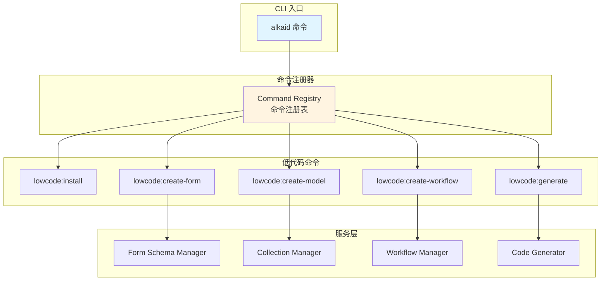

# AlkaidSYS 低代码 CLI 工具集成设计

> **文档版本**：v1.0  
> **创建日期**：2025-01-20  
> **最后更新**：2025-01-20  
> **作者**：AlkaidSYS 架构团队

---

## 📋 目录

- [1. CLI 命令架构设计](#1-cli-命令架构设计)
- [2. 核心命令实现](#2-核心命令实现)
- [3. 应用模板集成](#3-应用模板集成)
- [4. 完整开发者工作流](#4-完整开发者工作流)

---

## 1. CLI 命令架构设计

### 1.1 命令注册机制



### 1.2 命令基类

```php
<?php

namespace alkaid\cli\command;

use think\console\Command;
use think\console\Input;
use think\console\Output;

/**
 * 低代码命令基类
 */
abstract class LowcodeCommand extends Command
{
    /**
     * 询问用户输入
     */
    protected function ask(string $question, string $default = ''): string
    {
        return $this->output->ask($this->input, $question, $default);
    }
    
    /**
     * 询问用户确认
     */
    protected function confirm(string $question, bool $default = false): bool
    {
        return $this->output->confirm($this->input, $question, $default);
    }
    
    /**
     * 选择选项
     */
    protected function choice(string $question, array $choices, $default = null): string
    {
        return $this->output->choice($this->input, $question, $choices, $default);
    }
    
    /**
     * 显示成功消息
     */
    protected function success(string $message): void
    {
        $this->output->writeln("<info>✓ {$message}</info>");
    }
    
    /**
     * 显示错误消息
     */
    protected function error(string $message): void
    {
        $this->output->writeln("<error>✗ {$message}</error>");
    }
    
    /**
     * 显示警告消息
     */
    protected function warning(string $message): void
    {
        $this->output->writeln("<comment>⚠ {$message}</comment>");
    }
}
```

---

## 2. 核心命令实现

### 2.1 lowcode:install 命令

```php
<?php

namespace alkaid\cli\command\lowcode;

use alkaid\cli\command\LowcodeCommand;
use think\console\Input;
use think\console\input\Argument;
use think\console\Output;

/**
 * 安装低代码插件命令
 * 
 * 用法：alkaid lowcode:install
 */
class InstallCommand extends LowcodeCommand
{
    protected function configure()
    {
        $this->setName('lowcode:install')
            ->setDescription('安装低代码插件');
    }
    
    protected function execute(Input $input, Output $output)
    {
        $output->writeln('<info>开始安装低代码插件...</info>');
        
        // 1. 检查依赖
        $this->checkDependencies();
        
        // 2. 安装核心插件
        $this->installCorePlugins();
        
        // 3. 创建数据表
        $this->createTables();
        
        // 4. 注册服务提供者
        $this->registerServiceProviders();
        
        // 5. 发布资源文件
        $this->publishAssets();
        
        $this->success('低代码插件安装成功！');
        
        $output->writeln('');
        $output->writeln('<comment>下一步操作：</comment>');
        $output->writeln('  1. 创建数据模型：alkaid lowcode:create-model Product');
        $output->writeln('  2. 创建表单：alkaid lowcode:create-form product_form');
        $output->writeln('  3. 创建工作流：alkaid lowcode:create-workflow order_workflow');
        
        return 0;
    }
    
    /**
     * 检查依赖
     */
    protected function checkDependencies(): void
    {
        $this->output->writeln('检查依赖...');
        
        // 检查 PHP 版本
        if (version_compare(PHP_VERSION, '8.2.0', '<')) {
            $this->error('PHP 版本必须 >= 8.2.0');
            exit(1);
        }
        
        // 检查 Swoole 扩展
        if (!extension_loaded('swoole')) {
            $this->warning('未检测到 Swoole 扩展，部分功能可能无法使用');
        }
        
        $this->success('依赖检查通过');
    }
    
    /**
     * 安装核心插件
     */
    protected function installCorePlugins(): void
    {
        $this->output->writeln('安装核心插件...');
        
        $plugins = [
            'lowcode-data-modeling',
            'lowcode-form-designer',
            'lowcode-workflow',
            'lowcode-schema-parser',
        ];
        
        foreach ($plugins as $plugin) {
            $this->output->write("  - 安装 {$plugin}...");
            // TODO: 实际安装逻辑
            $this->output->writeln(' <info>完成</info>');
        }
        
        $this->success('核心插件安装完成');
    }
    
    /**
     * 创建数据表
     */
    protected function createTables(): void
    {
        $this->output->writeln('创建数据表...');
        
        // 执行迁移
        $this->call('migrate:run');
        
        $this->success('数据表创建完成');
    }
    
    /**
     * 注册服务提供者
     */
    protected function registerServiceProviders(): void
    {
        $this->output->writeln('注册服务提供者...');
        
        // TODO: 注册服务提供者
        
        $this->success('服务提供者注册完成');
    }
    
    /**
     * 发布资源文件
     */
    protected function publishAssets(): void
    {
        $this->output->writeln('发布资源文件...');
        
        // TODO: 发布前端资源文件
        
        $this->success('资源文件发布完成');
    }
}
```

### 2.2 lowcode:create-form 命令

```php
<?php

namespace alkaid\cli\command\lowcode;

use alkaid\cli\command\LowcodeCommand;
use alkaid\lowcode\formdesigner\service\FormSchemaManager;
use think\console\Input;
use think\console\input\Argument;
use think\console\input\Option;
use think\console\Output;

/**
 * 创建表单命令
 * 
 * 用法：alkaid lowcode:create-form product_form --title="商品表单"
 */
class CreateFormCommand extends LowcodeCommand
{
    protected FormSchemaManager $schemaManager;
    
    public function __construct(FormSchemaManager $schemaManager)
    {
        parent::__construct();
        $this->schemaManager = $schemaManager;
    }
    
    protected function configure()
    {
        $this->setName('lowcode:create-form')
            ->addArgument('name', Argument::REQUIRED, '表单标识')
            ->addOption('title', 't', Option::VALUE_OPTIONAL, '表单标题')
            ->addOption('collection', 'c', Option::VALUE_OPTIONAL, '关联的 Collection')
            ->setDescription('创建表单');
    }
    
    protected function execute(Input $input, Output $output)
    {
        $name = $input->getArgument('name');
        $title = $input->getOption('title') ?: $this->ask('请输入表单标题', $name);
        $collection = $input->getOption('collection') ?: $this->ask('请输入关联的 Collection（可选）', '');
        
        $output->writeln("<info>创建表单：{$name}</info>");
        
        // 交互式添加字段
        $fields = $this->addFields();
        
        // 生成 Schema
        $schema = $this->generateSchema($fields);
        
        // 保存表单
        $this->schemaManager->create([
            'name' => $name,
            'title' => $title,
            'collection_name' => $collection ?: null,
            'schema' => $schema,
        ]);
        
        $this->success("表单 {$name} 创建成功！");
        
        $output->writeln('');
        $output->writeln('<comment>下一步操作：</comment>');
        $output->writeln("  1. 在浏览器中打开：http://localhost:8000/lowcode/form-designer/{$name}");
        $output->writeln("  2. 或使用 API：GET /api/lowcode/forms/{$name}");
        
        return 0;
    }
    
    /**
     * 交互式添加字段
     */
    protected function addFields(): array
    {
        $fields = [];
        
        while (true) {
            $addMore = $this->confirm('是否添加字段？', true);
            
            if (!$addMore) {
                break;
            }
            
            $fieldName = $this->ask('字段名称');
            $fieldTitle = $this->ask('字段标题', $fieldName);
            $fieldType = $this->choice('字段类型', [
                'string' => '字符串',
                'number' => '数字',
                'boolean' => '布尔值',
                'date' => '日期',
                'select' => '下拉选择',
                'textarea' => '多行文本',
            ], 'string');
            
            $component = $this->getComponentByType($fieldType);
            $required = $this->confirm('是否必填？', false);
            
            $fields[] = [
                'name' => $fieldName,
                'title' => $fieldTitle,
                'type' => $fieldType,
                'component' => $component,
                'required' => $required,
            ];
            
            $this->success("字段 {$fieldName} 添加成功");
        }
        
        return $fields;
    }
    
    /**
     * 生成 Schema
     */
    protected function generateSchema(array $fields): array
    {
        $properties = [];
        $required = [];
        
        foreach ($fields as $field) {
            $properties[$field['name']] = [
                'type' => $field['type'],
                'title' => $field['title'],
                'x-component' => $field['component'],
                'x-decorator' => 'FormItem',
                'x-decorator-props' => [
                    'label' => $field['title'],
                    'required' => $field['required'],
                ],
                'x-component-props' => [
                    'placeholder' => "请输入{$field['title']}",
                ],
            ];
            
            if ($field['required']) {
                $required[] = $field['name'];
            }
        }
        
        return [
            'type' => 'object',
            'properties' => $properties,
            'required' => $required,
        ];
    }
    
    /**
     * 根据类型获取组件
     */
    protected function getComponentByType(string $type): string
    {
        $map = [
            'string' => 'Input',
            'number' => 'InputNumber',
            'boolean' => 'Switch',
            'date' => 'DatePicker',
            'select' => 'Select',
            'textarea' => 'Textarea',
        ];
        
        return $map[$type] ?? 'Input';
    }
}
```

### 2.3 lowcode:create-model 命令

```php
<?php

namespace alkaid\cli\command\lowcode;

use alkaid\cli\command\LowcodeCommand;
use alkaid\lowcode\datamodeling\service\CollectionManager;
use alkaid\lowcode\datamodeling\model\Collection;
use alkaid\lowcode\datamodeling\registry\FieldTypeRegistry;
use think\console\Input;
use think\console\input\Argument;
use think\console\input\Option;
use think\console\Output;

/**
 * 创建数据模型命令
 * 
 * 用法：alkaid lowcode:create-model Product --fields="name:string,price:decimal,stock:integer"
 */
class CreateModelCommand extends LowcodeCommand
{
    protected CollectionManager $collectionManager;
    
    public function __construct(CollectionManager $collectionManager)
    {
        parent::__construct();
        $this->collectionManager = $collectionManager;
    }
    
    protected function configure()
    {
        $this->setName('lowcode:create-model')
            ->addArgument('name', Argument::REQUIRED, 'Collection 名称')
            ->addOption('fields', 'f', Option::VALUE_OPTIONAL, '字段定义（格式：name:type,name:type）')
            ->addOption('table', 't', Option::VALUE_OPTIONAL, '数据表名')
            ->setDescription('创建数据模型');
    }
    
    protected function execute(Input $input, Output $output)
    {
        $name = $input->getArgument('name');
        $tableName = $input->getOption('table') ?: 'lc_' . strtolower($name);
        $fieldsOption = $input->getOption('fields');
        
        $output->writeln("<info>创建数据模型：{$name}</info>");
        
        // 解析字段
        $fields = [];
        if ($fieldsOption) {
            $fields = $this->parseFields($fieldsOption);
        } else {
            // 交互式添加字段
            $fields = $this->addFieldsInteractive();
        }
        
        // 创建 Collection
        $collection = new Collection($name, [
            'table_name' => $tableName,
            'fields' => $fields,
        ]);
        
        $this->collectionManager->create($collection);
        
        $this->success("数据模型 {$name} 创建成功！");
        $this->success("数据表 {$tableName} 创建成功！");
        
        $output->writeln('');
        $output->writeln('<comment>下一步操作：</comment>');
        $output->writeln("  1. 生成 CRUD 代码：alkaid lowcode:generate crud {$name}");
        $output->writeln("  2. 创建表单：alkaid lowcode:create-form {$name}_form --collection={$name}");
        
        return 0;
    }
    
    /**
     * 解析字段定义
     */
    protected function parseFields(string $fieldsOption): array
    {
        $fields = [];
        $fieldDefs = explode(',', $fieldsOption);
        
        foreach ($fieldDefs as $fieldDef) {
            [$name, $type] = explode(':', $fieldDef);
            $fields[] = FieldTypeRegistry::create($type, $name);
        }
        
        return $fields;
    }
    
    /**
     * 交互式添加字段
     */
    protected function addFieldsInteractive(): array
    {
        $fields = [];
        
        while (true) {
            $addMore = $this->confirm('是否添加字段？', true);
            
            if (!$addMore) {
                break;
            }
            
            $fieldName = $this->ask('字段名称');
            $fieldType = $this->choice('字段类型', FieldTypeRegistry::getTypes(), 'string');
            
            $fields[] = FieldTypeRegistry::create($fieldType, $fieldName);
            
            $this->success("字段 {$fieldName} 添加成功");
        }
        
        return $fields;
    }
}
```

### 2.4 lowcode:generate 命令

```php
<?php

namespace alkaid\cli\command\lowcode;

use alkaid\cli\command\LowcodeCommand;
use alkaid\lowcode\generator\CrudGenerator;
use think\console\Input;
use think\console\input\Argument;
use think\console\input\Option;
use think\console\Output;

/**
 * 生成代码命令
 * 
 * 用法：alkaid lowcode:generate crud Product
 */
class GenerateCommand extends LowcodeCommand
{
    protected CrudGenerator $generator;
    
    public function __construct(CrudGenerator $generator)
    {
        parent::__construct();
        $this->generator = $generator;
    }
    
    protected function configure()
    {
        $this->setName('lowcode:generate')
            ->addArgument('type', Argument::REQUIRED, '生成类型（crud/controller/model/view）')
            ->addArgument('name', Argument::REQUIRED, 'Collection 名称')
            ->addOption('force', 'f', Option::VALUE_NONE, '强制覆盖已存在的文件')
            ->setDescription('生成代码');
    }
    
    protected function execute(Input $input, Output $output)
    {
        $type = $input->getArgument('type');
        $name = $input->getArgument('name');
        $force = $input->getOption('force');
        
        $output->writeln("<info>生成 {$type} 代码：{$name}</info>");
        
        switch ($type) {
            case 'crud':
                $this->generateCrud($name, $force);
                break;
            case 'controller':
                $this->generateController($name, $force);
                break;
            case 'model':
                $this->generateModel($name, $force);
                break;
            case 'view':
                $this->generateView($name, $force);
                break;
            default:
                $this->error("未知的生成类型：{$type}");
                return 1;
        }
        
        return 0;
    }
    
    /**
     * 生成 CRUD 代码
     */
    protected function generateCrud(string $name, bool $force): void
    {
        $files = $this->generator->generateCrud($name, $force);
        
        foreach ($files as $file) {
            $this->success("生成文件：{$file}");
        }
        
        $this->success('CRUD 代码生成完成！');
    }
    
    /**
     * 生成控制器
     */
    protected function generateController(string $name, bool $force): void
    {
        $file = $this->generator->generateController($name, $force);
        $this->success("生成控制器：{$file}");
    }
    
    /**
     * 生成模型
     */
    protected function generateModel(string $name, bool $force): void
    {
        $file = $this->generator->generateModel($name, $force);
        $this->success("生成模型：{$file}");
    }
    
    /**
     * 生成视图
     */
    protected function generateView(string $name, bool $force): void
    {
        $files = $this->generator->generateView($name, $force);
        
        foreach ($files as $file) {
            $this->success("生成视图：{$file}");
        }
    }
}
```

### 2.5 lowcode:schema-sync 命令（新增）

```php
<?php
namespace alkaid\cli\command\lowcode;

use alkaid\cli\command\LowcodeCommand;
use think\console\Input;
use think\console\input\Argument;
use think\console\input\Option;
use think\console\Output;

/**
 * 同步数据库结构到真源 Schema（安全模式，默认禁止破坏性变更）
 */
class SchemaSyncCommand extends LowcodeCommand
{
    protected function configure()
    {
        $this->setName('lowcode:schema-sync')
            ->addArgument('collection', Argument::OPTIONAL, 'Collection 名称（留空表示全部）')
            ->addOption('all', 'a', Option::VALUE_NONE, '针对全部 Collection 执行')
            ->addOption('force', 'f', Option::VALUE_NONE, '允许破坏性变更')
            ->addOption('audit-out', null, Option::VALUE_REQUIRED, '输出审计记录到文件（JSON/YAML）')
            ->setDescription('同步数据库结构到真源 Schema（安全模式）');
    }

    protected function execute(Input $input, Output $output)
    {
        $name = (string) $input->getArgument('collection');
        $all = (bool) $input->getOption('all');
        $force = (bool) $input->getOption('force');
        $auditOut = (string)($input->getOption('audit-out') ?? '');
        // TODO: 调用差异计算与执行器，按 $all 或 $name 执行，并在完成后输出审计到 $auditOut
        $scope = $all || $name === '' ? 'ALL' : $name;
        $this->success("已同步 {$scope}（force=" . ($force ? 'true' : 'false') . ", auditOut=" . ($auditOut !== '' ? $auditOut : '-') . '）');
        return 0;
    }
}
```

### 2.6 lowcode:migration:diff 命令（新增）

```php
class MigrationDiffCommand extends LowcodeCommand
{
    protected function configure()
    {
        $this->setName('lowcode:migration:diff')
            ->addArgument('collection', Argument::OPTIONAL, 'Collection 名称（留空表示全部）')
            ->addOption('out', 'o', Option::VALUE_REQUIRED, '输出 SQL 文件路径')
            ->addOption('check', 'c', Option::VALUE_NONE, '仅检查不输出 SQL，存在差异返回非零')
            ->addOption('report', 'r', Option::VALUE_REQUIRED, '输出 JSON 报告路径（见 4.3 报告结构）')
            ->addOption('all', 'a', Option::VALUE_NONE, '检查全部 Collection')
            ->setDescription('生成数据库与真源 Schema 的差异脚本/报告');
    }

    protected function execute(Input $input, Output $output)
    {
        // TODO: 生成差异 SQL 到 --out
        $this->success('差异脚本已生成');
        return 0;
    }
}
```

### 2.7 mcp:template 命令（新增）

```php
class McpTemplateCommand extends LowcodeCommand
{
    protected function configure()
    {
        $this->setName('mcp:template')
            ->addOption('prompt', 'p', Option::VALUE_REQUIRED, '自然语言需求')
            ->setDescription('调用 TemplateGeneratorTool 识别模板并输出后续命令建议');
    }

    protected function execute(Input $input, Output $output)
    {
        $prompt = (string) $input->getOption('prompt');
        if ($prompt === '') {
            $prompt = $this->ask('请输入自然语言需求');
        }

        // 1) 载入模板库（YAML）
        $templates = $this->loadTemplates();
        if (empty($templates)) {
            $this->error('未找到任何模板');
            return 1;
        }

        // 2) 简单选择器（可替换为真正的 MCP TemplateGeneratorTool）
        $selected = $this->selectTemplate($templates, $prompt);
        if (!$selected) {
            $this->warning('未匹配到合适模板，列出所有模板供选择');
            $names = array_map(fn($t) => $t['name'] ?? 'unknown', $templates);
            $choice = $this->choice('请选择模板', $names, $names[0] ?? null);
            $selected = $templates[array_search($choice, $names, true)];
        }

        // 3) 填充参数
        $params = $this->fillParameters($selected, $prompt);

        // 4) 渲染命令
        $command = $this->renderCliCommand($selected['cli_command'] ?? '', $params);

        $output->writeln('');
        $this->success('模板识别完成：');
        $output->writeln('  模板: ' . ($selected['name'] ?? 'unknown'));
        $output->writeln('  描述: ' . ($selected['description'] ?? ''));
        $output->writeln('  分类: ' . ($selected['category'] ?? ''));
        $output->writeln('');
        $output->writeln('<comment>建议执行：</comment>');
        $output->writeln('  ' . $command);

        // 5) 打印相关文档
        if (!empty($selected['related_docs'])) {
            $output->writeln('');
            $output->writeln('<comment>相关文档：</comment>');
            foreach ($selected['related_docs'] as $doc) {
                $output->writeln('  - ' . $doc);
            }
        }

        return 0;
    }

    protected function loadTemplates(): array
    {
        $templates = [];
        $dir = rtrim(ROOT_PATH, DIRECTORY_SEPARATOR) . DIRECTORY_SEPARATOR . 'alkaid-system-design' . DIRECTORY_SEPARATOR . 'docs' . DIRECTORY_SEPARATOR . 'prompt-templates';
        if (!is_dir($dir)) {
            return $templates;
        }
        $rii = new \RecursiveIteratorIterator(new \RecursiveDirectoryIterator($dir));
        foreach ($rii as $file) {
            if ($file->isDir()) continue;
            if (!preg_match('/\.ya?ml$/i', $file->getFilename())) continue;
            $path = $file->getPathname();
            $templates[] = $this->parseYaml($path) + ['__path' => $path];
        }
        return array_values(array_filter($templates, fn($t) => is_array($t)));
    }

    protected function parseYaml(string $path): array
    {
        // 优先使用 PECL yaml，否则回退到 Symfony Yaml（需依赖）
        if (function_exists('yaml_parse_file')) {
            $data = yaml_parse_file($path);
            return is_array($data) ? $data : [];
        }
        if (class_exists('Symfony\\Component\\Yaml\\Yaml')) {
            return \Symfony\\Component\\Yaml\\Yaml::parseFile($path) ?? [];
        }
        // 最简回退：不解析
        return [];
    }

    protected function selectTemplate(array $templates, string $prompt): ?array
    {
        $p = $prompt;
        // 极简关键字匹配（可替换为 MCP/LLM 实现）
        foreach ($templates as $tpl) {
            $name = ($tpl['name'] ?? '') . ' ' . ($tpl['description'] ?? '') . ' ' . ($tpl['category'] ?? '');
            if ((str_contains($p, '分销') || str_contains($p, 'distribution')) && str_contains($name, 'distribution')) return $tpl;
            if ((str_contains($p, 'CRUD') || str_contains($p, '模型') || str_contains($p, '表单')) && ($tpl['category'] ?? '') === 'crud') return $tpl;
            if ((str_contains($p, 'API') || str_contains($p, '接口')) && ($tpl['category'] ?? '') === 'api') return $tpl;
        }
        return $templates[0] ?? null;
    }

    protected function fillParameters(array $tpl, string $prompt): array
    {
        $params = [];
        foreach (($tpl['parameters'] ?? []) as $param) {
            $name = $param['name'] ?? '';
            $required = (bool)($param['required'] ?? false);
            $default = $param['default'] ?? null;
            $desc = $param['description'] ?? $name;
            // 未来可从 prompt 里抽取，这里交互式询问
            $value = $default;
            if ($required || $this->confirm("设置参数 {$name} ({$desc})?", $required)) {
                $value = $this->ask("{$name}", is_scalar($default) ? (string)$default : json_encode($default));
            }
            $params[$name] = $value;
        }
        return $params;
    }

    protected function renderCliCommand(string $template, array $params): string
    {
        $cmd = $template;
        foreach ($params as $k => $v) {
            if (is_array($v)) $v = json_encode($v, JSON_UNESCAPED_UNICODE);
            $cmd = str_replace('{{' . $k . '}}', (string)$v, $cmd);
        }
        return $cmd;
    }
}
```

> 说明：生产环境推荐使用 MCP TemplateGeneratorTool 与 Mustache/Handlebars 等模板引擎；上例为便于理解的最小可行演示。

### 2.8 依赖与渲染器（Mustache + Symfony Yaml）

```bash
# 安装依赖（推荐）
composer require symfony/yaml:^6.0 mustache/mustache:^2.14
```

示例渲染代码：
```php
use Mustache_Engine;

protected function renderTemplate(string $tpl, array $params): string
{
    $m = new Mustache_Engine(['escape' => function($v){ return $v; }]);
    return $m->render($tpl, $this->normalizeParams($params));
}

protected function normalizeParams(array $params): array
{
    // 将 JSON 字符串字段解码为数组，便于模板 {{#if}} / 列表渲染
    $out = [];
    foreach ($params as $k => $v) {
        if (is_string($v) && $this->looksLikeJson($v)) {
            $decoded = json_decode($v, true);
            $out[$k] = $decoded ?? $v;
        } else {
            $out[$k] = $v;
        }
    }
    return $out;
}

protected function looksLikeJson(string $v): bool
{
    return str_starts_with(trim($v), '{') || str_starts_with(trim($v), '[');
}
```

> 说明：模板文件的 `template` 与 `cli_command` 字段均可使用 Mustache 语法，支持条件与列表渲染。

### 2.10 CI 占位命令建议（新增）

```bash
# 代码校验占位：返回非零即失败
php think mcp:code-validate app plugin --format=junit --output=build/code-validate.xml

# Schema 差异检查占位：建议实现 --all 与 --check
php think lowcode:migration:diff --all --check

# 文档与类型
php think api:doc
npx redocly lint public/api-docs.json
npx openapi-typescript public/api-docs.json -o admin/src/api/types.d.ts
```

### 2.11 与 MCP TemplateGeneratorTool 集成（示例）

```php
use Alkaid\Plugin\HookToolRegistry;

protected function callMcpTemplateTool(string $prompt): ?array
{
    try {
        /** @var HookToolRegistry $registry */
        $registry = app(HookToolRegistry::class);
        $result = $registry->execute('template-generator', [
            'prompt' => $prompt,
        ]);
        // 期望返回：type, template, filled_template, cli_command, related_docs, examples
        if (is_array($result) && !empty($result['template'])) {
            return $result;
        }
    } catch (\Throwable $e) {
        // 回退到本地模板匹配
    }
    return null;
}

protected function execute(Input $input, Output $output)
{
    $prompt = (string) $input->getOption('prompt') ?: $this->ask('请输入自然语言需求');

    // A. 优先尝试 MCP 工具
    if ($mcp = $this->callMcpTemplateTool($prompt)) {
        $this->success('来自 MCP 的推荐：');
        $output->writeln('  模板: ' . ($mcp['template'] ?? ''));
        if (!empty($mcp['cli_command'])) {
            $output->writeln('<comment>建议执行：</comment>');
            $output->writeln('  ' . $mcp['cli_command']);
        }
        return 0;
    }

    // B. 回退本地模板（保留之前逻辑）
    // ...
}
```

---

## 3. 应用模板集成

### 3.1 --with-lowcode 选项实现

```php
<?php

namespace alkaid\cli\command;

use think\console\Command;
use think\console\Input;
use think\console\input\Argument;
use think\console\input\Option;
use think\console\Output;

/**
 * 初始化应用命令（扩展）
 * 
 * 用法：alkaid init app my-app --with-lowcode
 */
class InitAppCommand extends Command
{
    protected function configure()
    {
        $this->setName('init:app')
            ->addArgument('name', Argument::REQUIRED, '应用名称')
            ->addOption('with-lowcode', null, Option::VALUE_NONE, '集成低代码能力')
            ->setDescription('初始化应用');
    }
    
    protected function execute(Input $input, Output $output)
    {
        $name = $input->getArgument('name');
        $withLowcode = $input->getOption('with-lowcode');
        
        $output->writeln("<info>创建应用：{$name}</info>");
        
        // 1. 创建应用目录结构
        $this->createAppStructure($name);
        
        // 2. 如果启用低代码，安装低代码插件
        if ($withLowcode) {
            $output->writeln('<info>集成低代码能力...</info>');
            $this->call('lowcode:install');
            
            // 3. 创建示例数据模型
            $this->createExampleModels($name);
        }
        
        $output->writeln('');
        $output->writeln("<info>✓ 应用 {$name} 创建成功！</info>");
        
        if ($withLowcode) {
            $output->writeln('');
            $output->writeln('<comment>低代码能力已集成，您可以：</comment>');
            $output->writeln('  1. 创建数据模型：alkaid lowcode:create-model Product');
            $output->writeln('  2. 创建表单：alkaid lowcode:create-form product_form');
            $output->writeln('  3. 生成 CRUD：alkaid lowcode:generate crud Product');
        }
        
        return 0;
    }
    
    /**
     * 创建应用目录结构
     */
    protected function createAppStructure(string $name): void
    {
        // TODO: 创建应用目录结构
    }
    
    /**
     * 创建示例数据模型
     */
    protected function createExampleModels(string $name): void
    {
        // TODO: 创建示例数据模型
    }
}
```

---

## 4. 完整开发者工作流

### 4.1 场景 1：快速开发电商应用

```bash
# 1. 创建应用（集成低代码）
alkaid init app my-ecommerce --with-lowcode

# 2. 创建商品数据模型
alkaid lowcode:create-model Product \
  --fields="name:string,price:decimal,stock:integer,category_id:integer,status:select"

# 3. 创建商品表单
alkaid lowcode:create-form product_form \
  --title="商品表单" \
  --collection=Product

# 4. 生成商品 CRUD 代码
alkaid lowcode:generate crud Product

# 5. 创建订单工作流
alkaid lowcode:create-workflow order_workflow \
  --title="订单处理工作流"

# 6. 启动开发服务器
alkaid serve
```

### 4.2 场景 2：扩展现有应用

```bash
# 1. 进入应用目录
cd my-app

# 2. 安装低代码插件
alkaid lowcode:install

# 3. 创建新的数据模型
alkaid lowcode:create-model Leave \
  --fields="user_id:integer,start_date:date,end_date:date,reason:text,status:select"

# 4. 创建请假表单
alkaid lowcode:create-form leave_form \
  --title="请假申请表单" \
  --collection=Leave

# 5. 创建审批工作流
alkaid lowcode:create-workflow leave_approval_workflow \
  --title="请假审批工作流"

# 6. 生成 CRUD 代码
alkaid lowcode:generate crud Leave
```

---

**文档结束**
