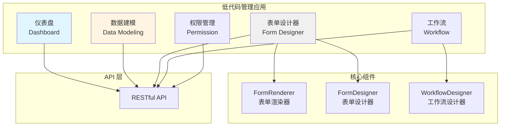

# AlkaidSYS 低代码管理应用设计

> **文档版本**：v1.0  
> **创建日期**：2025-01-20  
> **最后更新**：2025-01-20  
> **作者**：AlkaidSYS 架构团队

---

## 📋 目录

- [1. 管理应用架构设计](#1-管理应用架构设计)
- [2. 核心界面实现](#2-核心界面实现)
- [3. 路由和菜单设计](#3-路由和菜单设计)
- [4. 完整代码示例](#4-完整代码示例)

---

## 1. 管理应用架构设计

### 1.1 应用结构

```
lowcode-management-app/
├── src/
│   ├── views/                    # 页面视图
│   │   ├── dashboard/            # 仪表盘
│   │   ├── data-modeling/        # 数据建模
│   │   │   ├── CollectionList.vue
│   │   │   ├── CollectionEditor.vue
│   │   │   └── FieldEditor.vue
│   │   ├── form-designer/        # 表单设计器
│   │   │   ├── FormList.vue
│   │   │   ├── FormDesigner.vue
│   │   │   └── FormPreview.vue
│   │   ├── workflow/             # 工作流
│   │   │   ├── WorkflowList.vue
│   │   │   ├── WorkflowDesigner.vue
│   │   │   └── ExecutionHistory.vue
│   │   └── settings/             # 设置
│   │       ├── PermissionManagement.vue
│   │       └── SystemSettings.vue
│   ├── components/               # 组件
│   │   ├── FormRenderer/         # 表单渲染器
│   │   ├── FormDesigner/         # 表单设计器
│   │   ├── WorkflowDesigner/     # 工作流设计器
│   │   └── common/               # 通用组件
│   ├── api/                      # API 接口
│   │   ├── collection.ts
│   │   ├── form.ts
│   │   └── workflow.ts
│   ├── router/                   # 路由
│   │   └── index.ts
│   ├── store/                    # 状态管理
│   │   ├── modules/
│   │   │   ├── collection.ts
│   │   │   ├── form.ts
│   │   │   └── workflow.ts
│   │   └── index.ts
│   └── App.vue
├── package.json
└── vite.config.ts
```

### 1.2 模块划分



---

## 2. 核心界面实现

### 2.1 数据建模界面（CollectionList.vue）

```vue
<template>
  <div class="collection-list">
    <a-page-header title="数据建模" sub-title="管理数据表和字段">
      <template #extra>
        <a-button type="primary" @click="handleCreate">
          <PlusOutlined />
          新建 Collection
        </a-button>
      </template>
    </a-page-header>
    
    <a-card>
      <a-table
        :columns="columns"
        :data-source="collections"
        :loading="loading"
        row-key="id"
      >
        <template #bodyCell="{ column, record }">
          <template v-if="column.key === 'fields'">
            <a-tag v-for="field in record.fields" :key="field.name">
              {{ field.name }}
            </a-tag>
          </template>
          
          <template v-if="column.key === 'action'">
            <a-space>
              <a-button type="link" @click="handleEdit(record)">
                编辑
              </a-button>
              <a-button type="link" @click="handleViewData(record)">
                查看数据
              </a-button>
              <a-popconfirm
                title="确定要删除吗？"
                @confirm="handleDelete(record)"
              >
                <a-button type="link" danger>
                  删除
                </a-button>
              </a-popconfirm>
            </a-space>
          </template>
        </template>
      </a-table>
    </a-card>
    
    <!-- 创建/编辑对话框 -->
    <a-modal
      v-model:visible="modalVisible"
      :title="modalTitle"
      width="800px"
      @ok="handleSubmit"
    >
      <CollectionEditor
        ref="editorRef"
        :collection="currentCollection"
      />
    </a-modal>
  </div>
</template>

<script setup lang="ts">
import { ref, onMounted } from 'vue';
import { message } from 'ant-design-vue';
import { PlusOutlined } from '@ant-design/icons-vue';
import { getCollections, deleteCollection } from '@/api/collection';
import CollectionEditor from './CollectionEditor.vue';

const columns = [
  { title: 'Collection 名称', dataIndex: 'name', key: 'name' },
  { title: '显示名称', dataIndex: 'title', key: 'title' },
  { title: '数据表名', dataIndex: 'table_name', key: 'table_name' },
  { title: '字段', key: 'fields' },
  { title: '创建时间', dataIndex: 'created_at', key: 'created_at' },
  { title: '操作', key: 'action', width: 200 },
];

const collections = ref([]);
const loading = ref(false);
const modalVisible = ref(false);
const modalTitle = ref('新建 Collection');
const currentCollection = ref(null);
const editorRef = ref();

// 加载数据
const loadData = async () => {
  loading.value = true;
  try {
    const res = await getCollections();
    collections.value = res.data;
  } catch (error) {
    message.error('加载失败');
  } finally {
    loading.value = false;
  }
};

// 创建
const handleCreate = () => {
  modalTitle.value = '新建 Collection';
  currentCollection.value = null;
  modalVisible.value = true;
};

// 编辑
const handleEdit = (record: any) => {
  modalTitle.value = '编辑 Collection';
  currentCollection.value = record;
  modalVisible.value = true;
};

// 删除
const handleDelete = async (record: any) => {
  try {
    await deleteCollection(record.name);
    message.success('删除成功');
    loadData();
  } catch (error) {
    message.error('删除失败');
  }
};

// 查看数据
const handleViewData = (record: any) => {
  // TODO: 跳转到数据查看页面
};

// 提交
const handleSubmit = async () => {
  const valid = await editorRef.value?.validate();
  if (valid) {
    modalVisible.value = false;
    loadData();
  }
};

onMounted(() => {
  loadData();
});
</script>

<style scoped lang="less">
.collection-list {
  padding: 24px;
}
</style>
```

### 2.2 表单设计器界面（FormDesigner.vue）

已在 `43-lowcode-form-designer.md` 中详细实现，此处引用。

### 2.3 工作流设计器界面（WorkflowDesigner.vue）

已在 `44-lowcode-workflow.md` 中详细实现，此处引用。

### 2.4 权限管理界面（PermissionManagement.vue）

```vue
<template>
  <div class="permission-management">
    <a-page-header title="权限管理" sub-title="管理角色和权限">
      <template #extra>
        <a-button type="primary" @click="handleCreateRole">
          <PlusOutlined />
          新建角色
        </a-button>
      </template>
    </a-page-header>
    
    <a-row :gutter="16">
      <!-- 左侧角色列表 -->
      <a-col :span="8">
        <a-card title="角色列表">
          <a-list
            :data-source="roles"
            :loading="loading"
          >
            <template #renderItem="{ item }">
              <a-list-item
                :class="{ active: selectedRole?.id === item.id }"
                @click="selectRole(item)"
              >
                <a-list-item-meta>
                  <template #title>
                    {{ item.name }}
                  </template>
                  <template #description>
                    {{ item.description }}
                  </template>
                </a-list-item-meta>
                
                <template #actions>
                  <a-button type="link" size="small" @click.stop="handleEditRole(item)">
                    编辑
                  </a-button>
                  <a-popconfirm
                    title="确定要删除吗？"
                    @confirm="handleDeleteRole(item)"
                  >
                    <a-button type="link" size="small" danger @click.stop>
                      删除
                    </a-button>
                  </a-popconfirm>
                </template>
              </a-list-item>
            </template>
          </a-list>
        </a-card>
      </a-col>
      
      <!-- 右侧权限配置 -->
      <a-col :span="16">
        <a-card v-if="selectedRole" title="权限配置">
          <a-tree
            v-model:checkedKeys="checkedPermissions"
            checkable
            :tree-data="permissionTree"
            :field-names="{ title: 'name', key: 'id', children: 'children' }"
            @check="handlePermissionChange"
          />
          
          <a-divider />
          
          <a-space>
            <a-button type="primary" @click="handleSavePermissions">
              保存权限
            </a-button>
            <a-button @click="handleResetPermissions">
              重置
            </a-button>
          </a-space>
        </a-card>
        
        <a-empty v-else description="请选择一个角色" />
      </a-col>
    </a-row>
  </div>
</template>

<script setup lang="ts">
import { ref, onMounted } from 'vue';
import { message } from 'ant-design-vue';
import { PlusOutlined } from '@ant-design/icons-vue';
import { getRoles, getPermissions, updateRolePermissions } from '@/api/permission';

const roles = ref([]);
const permissionTree = ref([]);
const selectedRole = ref(null);
const checkedPermissions = ref([]);
const loading = ref(false);

// 加载角色
const loadRoles = async () => {
  loading.value = true;
  try {
    const res = await getRoles();
    roles.value = res.data;
  } catch (error) {
    message.error('加载角色失败');
  } finally {
    loading.value = false;
  }
};

// 加载权限树
const loadPermissions = async () => {
  try {
    const res = await getPermissions();
    permissionTree.value = res.data;
  } catch (error) {
    message.error('加载权限失败');
  }
};

// 选择角色
const selectRole = (role: any) => {
  selectedRole.value = role;
  checkedPermissions.value = role.permissions || [];
};

// 保存权限
const handleSavePermissions = async () => {
  try {
    await updateRolePermissions(selectedRole.value.id, checkedPermissions.value);
    message.success('保存成功');
  } catch (error) {
    message.error('保存失败');
  }
};

// 重置权限
const handleResetPermissions = () => {
  checkedPermissions.value = selectedRole.value.permissions || [];
};

onMounted(() => {
  loadRoles();
  loadPermissions();
});
</script>

<style scoped lang="less">
.permission-management {
  padding: 24px;
  
  .active {
    background: #e6f7ff;
  }
}
</style>
```

---

## 3. 路由和菜单设计

### 3.1 路由配置

```typescript
// src/router/index.ts
import { createRouter, createWebHistory } from 'vue-router';
import type { RouteRecordRaw } from 'vue-router';

const routes: RouteRecordRaw[] = [
  {
    path: '/lowcode',
    name: 'Lowcode',
    component: () => import('@/layouts/BasicLayout.vue'),
    meta: { title: '低代码管理' },
    children: [
      {
        path: 'dashboard',
        name: 'LowcodeDashboard',
        component: () => import('@/views/dashboard/Index.vue'),
        meta: { title: '仪表盘', icon: 'DashboardOutlined' },
      },
      {
        path: 'data-modeling',
        name: 'DataModeling',
        meta: { title: '数据建模', icon: 'DatabaseOutlined' },
        children: [
          {
            path: 'collections',
            name: 'CollectionList',
            component: () => import('@/views/data-modeling/CollectionList.vue'),
            meta: { title: 'Collection 列表' },
          },
          {
            path: 'collections/:name',
            name: 'CollectionEditor',
            component: () => import('@/views/data-modeling/CollectionEditor.vue'),
            meta: { title: 'Collection 编辑', hidden: true },
          },
        ],
      },
      {
        path: 'form-designer',
        name: 'FormDesigner',
        meta: { title: '表单设计器', icon: 'FormOutlined' },
        children: [
          {
            path: 'forms',
            name: 'FormList',
            component: () => import('@/views/form-designer/FormList.vue'),
            meta: { title: '表单列表' },
          },
          {
            path: 'forms/:name',
            name: 'FormDesignerEditor',
            component: () => import('@/views/form-designer/FormDesigner.vue'),
            meta: { title: '表单设计', hidden: true },
          },
        ],
      },
      {
        path: 'workflow',
        name: 'Workflow',
        meta: { title: '工作流', icon: 'ApartmentOutlined' },
        children: [
          {
            path: 'workflows',
            name: 'WorkflowList',
            component: () => import('@/views/workflow/WorkflowList.vue'),
            meta: { title: '工作流列表' },
          },
          {
            path: 'workflows/:id',
            name: 'WorkflowDesigner',
            component: () => import('@/views/workflow/WorkflowDesigner.vue'),
            meta: { title: '工作流设计', hidden: true },
          },
          {
            path: 'executions',
            name: 'ExecutionHistory',
            component: () => import('@/views/workflow/ExecutionHistory.vue'),
            meta: { title: '执行历史' },
          },
        ],
      },
      {
        path: 'settings',
        name: 'Settings',
        meta: { title: '设置', icon: 'SettingOutlined' },
        children: [
          {
            path: 'permissions',
            name: 'PermissionManagement',
            component: () => import('@/views/settings/PermissionManagement.vue'),
            meta: { title: '权限管理' },
          },
          {
            path: 'system',
            name: 'SystemSettings',
            component: () => import('@/views/settings/SystemSettings.vue'),
            meta: { title: '系统设置' },
          },
        ],
      },
    ],
  },
];

const router = createRouter({
  history: createWebHistory(),
  routes,
});

export default router;
```

### 3.2 菜单配置

```typescript
// src/config/menu.ts
export const menuConfig = [
  {
    key: 'dashboard',
    icon: 'DashboardOutlined',
    label: '仪表盘',
    path: '/lowcode/dashboard',
  },
  {
    key: 'data-modeling',
    icon: 'DatabaseOutlined',
    label: '数据建模',
    children: [
      {
        key: 'collections',
        label: 'Collection 列表',
        path: '/lowcode/data-modeling/collections',
      },
    ],
  },
  {
    key: 'form-designer',
    icon: 'FormOutlined',
    label: '表单设计器',
    children: [
      {
        key: 'forms',
        label: '表单列表',
        path: '/lowcode/form-designer/forms',
      },
    ],
  },
  {
    key: 'workflow',
    icon: 'ApartmentOutlined',
    label: '工作流',
    children: [
      {
        key: 'workflows',
        label: '工作流列表',
        path: '/lowcode/workflow/workflows',
      },
      {
        key: 'executions',
        label: '执行历史',
        path: '/lowcode/workflow/executions',
      },
    ],
  },
  {
    key: 'settings',
    icon: 'SettingOutlined',
    label: '设置',
    children: [
      {
        key: 'permissions',
        label: '权限管理',
        path: '/lowcode/settings/permissions',
      },
      {
        key: 'system',
        label: '系统设置',
        path: '/lowcode/settings/system',
      },
    ],
  },
];
```

---

## 4. 完整代码示例

### 4.1 API 接口封装

```typescript
// src/api/collection.ts
import request from '@/utils/request';

export interface Collection {
  id: string;
  name: string;
  title: string;
  table_name: string;
  fields: any[];
  created_at: string;
}

// 获取 Collection 列表
export function getCollections() {
  return request.get<Collection[]>('/api/lowcode/collections');
}

// 获取单个 Collection
export function getCollection(name: string) {
  return request.get<Collection>(`/api/lowcode/collections/${name}`);
}

// 创建 Collection
export function createCollection(data: Partial<Collection>) {
  return request.post('/api/lowcode/collections', data);
}

// 更新 Collection
export function updateCollection(name: string, data: Partial<Collection>) {
  return request.put(`/api/lowcode/collections/${name}`, data);
}

// 删除 Collection
export function deleteCollection(name: string) {
  return request.delete(`/api/lowcode/collections/${name}`);
}
```

```typescript
// src/api/form.ts
import request from '@/utils/request';

export interface Form {
  id: string;
  name: string;
  title: string;
  schema: any;
  collection_name?: string;
  created_at: string;
}

// 获取表单列表
export function getForms() {
  return request.get<Form[]>('/api/lowcode/forms');
}

// 获取单个表单
export function getForm(name: string) {
  return request.get<Form>(`/api/lowcode/forms/${name}`);
}

// 创建表单
export function createForm(data: Partial<Form>) {
  return request.post('/api/lowcode/forms', data);
}

// 更新表单
export function updateForm(name: string, data: Partial<Form>) {
  return request.put(`/api/lowcode/forms/${name}`, data);
}

// 删除表单
export function deleteForm(name: string) {
  return request.delete(`/api/lowcode/forms/${name}`);
}

// 提交表单数据
export function submitForm(name: string, data: any) {
  return request.post(`/api/lowcode/forms/${name}/submit`, data);
}
```

---

**文档结束**
