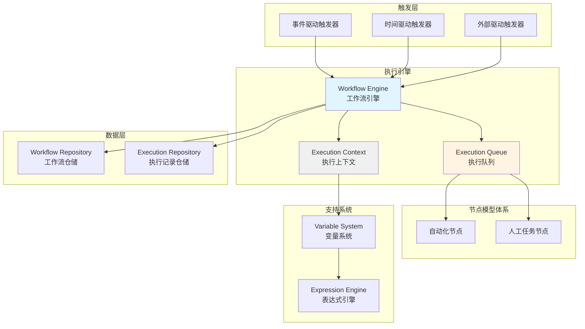

# AlkaidSYS 工作流后端统一引擎详细设计

> **文档版本**：v2.0  
> **创建日期**：2025-01-20  
> **最后更新**：2025-01-20  
> **作者**：AlkaidSYS 架构团队

---

## 📋 目录

- [1. 引擎概述](#1-引擎概述)
- [2. 节点模型体系设计](#2-节点模型体系设计)
- [3. 触发器系统设计](#3-触发器系统设计)
- [4. 执行引擎设计](#4-执行引擎设计)
- [5. 变量系统设计](#5-变量系统设计)
- [6. 表达式引擎设计](#6-表达式引擎设计)
- [7. 数据库设计](#7-数据库设计)
- [8. API 接口设计](#8-api-接口设计)

---

## 1. 引擎概述

### 1.1 插件信息

- **插件名称**：lowcode-workflow-engine
- **插件标识**：`alkaid/lowcode-workflow-engine`
- **版本**：v2.0.0
- **依赖**：
  - `alkaid/framework` >= 1.0.0
  - `alkaid/lowcode-data-modeling` >= 1.0.0
  - `topthink/think-orm` >= 3.0
  - `topthink/think-queue` >= 3.0
  - `symfony/expression-language` >= 6.0

### 1.2 核心功能

1. **统一的节点模型体系**：支持审批节点 + 自动化节点
2. **触发器系统**：支持 10+ 种触发器类型
3. **执行引擎**：基于 Swoole 协程的异步执行
4. **变量系统**：支持上下文变量和表达式计算
5. **表达式引擎**：支持 `{{expression}}` 语法
6. **数据库设计**：流程定义 + 流程实例 + 执行记录

### 1.3 架构设计



---

## 2. 节点模型体系设计

### 2.1 核心设计理念

**关键洞察**：审批流可以看作是自动化工作流的一个特例，只是增加了"人工任务节点"。

**节点分类**：
1. **自动化节点**（Auto-Execute Nodes）：execute() 方法立即返回结果（SUCCESS 或 FAILED）
2. **人工任务节点**（Human Task Nodes）：execute() 方法返回 PENDING 状态，等待人工完成后再继续

### 2.2 抽象基类设计

**借鉴 Ingenious 的节点模型设计**：

```php
<?php

namespace Alkaid\Workflow\Engine\Models;

use Alkaid\Workflow\Engine\Execution\ExecutionContext;
use Alkaid\Workflow\Engine\Execution\NodeExecutionResult;

/**
 * 节点模型抽象基类
 * 
 * 借鉴 Ingenious 的设计理念：
 * 1. 使用模板方法模式
 * 2. 支持前置/后置拦截器
 * 3. 输入边和输出边的设计
 */
abstract class NodeModel
{
    protected string $id;
    protected string $type;
    protected string $name;
    protected array $config = [];
    protected array $inputs = [];  // 输入边
    protected array $outputs = []; // 输出边
    protected ?string $preInterceptors = null;
    protected ?string $postInterceptors = null;
    
    public function __construct(array $data)
    {
        $this->id = $data['id'];
        $this->type = $data['type'];
        $this->name = $data['name'] ?? '';
        $this->config = $data['config'] ?? [];
    }
    
    /**
     * 执行节点（模板方法模式）
     */
    public function execute(ExecutionContext $context): NodeExecutionResult
    {
        // 执行前置拦截器
        $this->execPreInterceptors($context);
        
        // 执行节点逻辑
        $result = $this->exec($context);
        
        // 执行后置拦截器
        $this->execPostInterceptors($context);
        
        return $result;
    }
    
    /**
     * 子类必须实现的执行逻辑
     */
    abstract protected function exec(ExecutionContext $context): NodeExecutionResult;
    
    /**
     * 验证节点配置
     */
    abstract public function validate(): bool;
    
    /**
     * 执行前置拦截器
     */
    protected function execPreInterceptors(ExecutionContext $context): void
    {
        if ($this->preInterceptors) {
            // 执行前置拦截器逻辑
        }
    }
    
    /**
     * 执行后置拦截器
     */
    protected function execPostInterceptors(ExecutionContext $context): void
    {
        if ($this->postInterceptors) {
            // 执行后置拦截器逻辑
        }
    }
    
    /**
     * 添加输入边
     */
    public function addInput(string $edgeId): void
    {
        $this->inputs[] = $edgeId;
    }
    
    /**
     * 添加输出边
     */
    public function addOutput(string $edgeId): void
    {
        $this->outputs[] = $edgeId;
    }
    
    /**
     * 获取下一个节点ID
     */
    protected function getNextNodeId(): ?string
    {
        return $this->outputs[0] ?? null;
    }
    
    // Getters
    public function getId(): string { return $this->id; }
    public function getType(): string { return $this->type; }
    public function getName(): string { return $this->name; }
    public function getConfig(): array { return $this->config; }
}
```

### 2.3 节点执行结果

```php
<?php

namespace Alkaid\Workflow\Engine\Execution;

/**
 * 节点执行结果
 */
class NodeExecutionResult
{
    public const STATUS_SUCCESS = 'SUCCESS';
    public const STATUS_PENDING = 'PENDING';
    public const STATUS_FAILED = 'FAILED';
    
    public function __construct(
        public string $status,
        public array $data = [],
        public ?string $nextNodeId = null,
        public ?string $error = null
    ) {}
    
    public function isSuccess(): bool
    {
        return $this->status === self::STATUS_SUCCESS;
    }
    
    public function isPending(): bool
    {
        return $this->status === self::STATUS_PENDING;
    }
    
    public function isFailed(): bool
    {
        return $this->status === self::STATUS_FAILED;
    }
}
```

### 2.4 自动化节点示例

**HTTP 请求节点**：

```php
<?php

namespace Alkaid\Workflow\Engine\Nodes\Automation;

use Alkaid\Workflow\Engine\Models\NodeModel;
use Alkaid\Workflow\Engine\Execution\ExecutionContext;
use Alkaid\Workflow\Engine\Execution\NodeExecutionResult;
use Alkaid\Workflow\Engine\Services\ExpressionEngine;
use Illuminate\Support\Facades\Http;

/**
 * HTTP 请求节点
 * 
 * 借鉴 n8n 的设计理念：
 * 1. 支持多种 HTTP 方法（GET、POST、PUT、DELETE）
 * 2. 支持变量替换（URL、Headers、Body）
 * 3. 支持表达式计算
 */
class HttpRequestNode extends NodeModel
{
    protected function exec(ExecutionContext $context): NodeExecutionResult
    {
        $expressionEngine = app(ExpressionEngine::class);
        
        // 解析 URL（支持变量）
        $url = $expressionEngine->parseTemplate(
            $this->config['url'], // "https://api.example.com/orders/{{trigger.data.id}}"
            $context->getAllVariables()
        );
        
        // 解析请求方法
        $method = $this->config['method'] ?? 'GET';
        
        // 解析请求头（支持变量）
        $headers = [];
        if (isset($this->config['headers'])) {
            foreach ($this->config['headers'] as $key => $value) {
                $headers[$key] = $expressionEngine->parseTemplate($value, $context->getAllVariables());
            }
        }
        
        // 解析请求体（支持变量）
        $body = null;
        if (isset($this->config['body'])) {
            $body = $expressionEngine->parseTemplate(
                $this->config['body'],
                $context->getAllVariables()
            );
            $body = json_decode($body, true);
        }
        
        try {
            // 发送 HTTP 请求
            $response = Http::withHeaders($headers)->$method($url, $body);
            
            return new NodeExecutionResult(
                status: NodeExecutionResult::STATUS_SUCCESS,
                data: [
                    'status_code' => $response->status(),
                    'headers' => $response->headers(),
                    'body' => $response->json()
                ],
                nextNodeId: $this->getNextNodeId()
            );
        } catch (\Exception $e) {
            return new NodeExecutionResult(
                status: NodeExecutionResult::STATUS_FAILED,
                error: $e->getMessage()
            );
        }
    }
    
    public function validate(): bool
    {
        return isset($this->config['url']) && isset($this->config['method']);
    }
}
```

**条件判断节点**：

```php
<?php

namespace Alkaid\Workflow\Engine\Nodes\Automation;

use Alkaid\Workflow\Engine\Models\NodeModel;
use Alkaid\Workflow\Engine\Execution\ExecutionContext;
use Alkaid\Workflow\Engine\Execution\NodeExecutionResult;
use Alkaid\Workflow\Engine\Services\ExpressionEngine;

/**
 * 条件判断节点
 */
class ConditionNode extends NodeModel
{
    protected function exec(ExecutionContext $context): NodeExecutionResult
    {
        $expressionEngine = app(ExpressionEngine::class);
        
        // 获取条件表达式
        $expression = $this->config['expression']; // "trigger.data.total > 1000"
        
        // 计算表达式
        $result = $expressionEngine->evaluate($expression, $context->getAllVariables());
        
        // 根据结果选择下一个节点
        $nextNodeId = $result ? $this->config['true_branch'] : $this->config['false_branch'];
        
        return new NodeExecutionResult(
            status: NodeExecutionResult::STATUS_SUCCESS,
            data: ['condition_result' => $result],
            nextNodeId: $nextNodeId
        );
    }
    
    public function validate(): bool
    {
        return isset($this->config['expression']) 
            && isset($this->config['true_branch']) 
            && isset($this->config['false_branch']);
    }
}
```

### 2.5 人工任务节点示例

**人工任务节点**：

```php
<?php

namespace Alkaid\Workflow\Engine\Nodes\Approval;

use Alkaid\Workflow\Engine\Models\NodeModel;
use Alkaid\Workflow\Engine\Execution\ExecutionContext;
use Alkaid\Workflow\Engine\Execution\NodeExecutionResult;
use Alkaid\Workflow\Engine\Models\HumanTask;

/**
 * 人工任务节点
 * 
 * 借鉴 Ingenious 的设计理念：
 * 1. 创建待办任务
 * 2. 返回 PENDING 状态
 * 3. 等待人工完成后再继续
 */
class HumanTaskNode extends NodeModel
{
    protected function exec(ExecutionContext $context): NodeExecutionResult
    {
        // 创建待办任务
        $task = $this->createTask($context);
        
        // 返回 PENDING 状态，等待人工完成
        return new NodeExecutionResult(
            status: NodeExecutionResult::STATUS_PENDING,
            data: ['task_id' => $task->id],
            nextNodeId: null // 等待人工完成后再确定下一个节点
        );
    }
    
    /**
     * 创建待办任务
     */
    protected function createTask(ExecutionContext $context): HumanTask
    {
        return HumanTask::create([
            'instance_id' => $context->getInstance()->id,
            'node_id' => $this->id,
            'task_type' => 'approval',
            'title' => $this->config['title'] ?? $this->name,
            'description' => $this->config['description'] ?? '',
            'form_data' => $this->config['form_data'] ?? [],
            'assignee' => $this->config['assignee'],
            'status' => 'pending'
        ]);
    }
    
    /**
     * 人工完成任务后调用
     */
    public function complete(string $taskId, array $result): void
    {
        // 更新任务状态
        $task = HumanTask::find($taskId);
        $task->update([
            'status' => 'completed',
            'result' => $result,
            'completed_at' => now()
        ]);
        
        // 继续执行后续节点
        $context = $this->getExecutionContext($task->instance_id);
        $context->setData($result);
        
        $nextNodeId = $this->getNextNodeId();
        if ($nextNodeId) {
            app(WorkflowEngine::class)->executeNode($nextNodeId, $context);
        }
    }
    
    public function validate(): bool
    {
        return isset($this->config['assignee']);
    }
}
```

---

## 3. 触发器系统设计

### 3.1 触发器接口

**借鉴 n8n 的触发器系统设计**：

```php
<?php

namespace Alkaid\Workflow\Engine\Triggers;

use Alkaid\Workflow\Engine\Models\Workflow;

/**
 * 触发器接口
 */
interface TriggerInterface
{
    /**
     * 获取触发器类型
     */
    public function getType(): string;
    
    /**
     * 注册触发器
     */
    public function register(Workflow $workflow, array $config): void;
    
    /**
     * 取消注册
     */
    public function unregister(Workflow $workflow): void;
    
    /**
     * 检查是否应该触发
     */
    public function shouldTrigger(array $context): bool;
}
```

### 3.2 触发器分类

**1. 事件驱动触发器**（Event-Driven Triggers）：
- FormSubmittedTrigger（表单提交触发器）
- DataCreatedTrigger（数据创建触发器）
- DataUpdatedTrigger（数据更新触发器）
- DataDeletedTrigger（数据删除触发器）
- FieldChangedTrigger（字段变更触发器）
- UserActionTrigger（用户操作触发器）

**2. 时间驱动触发器**（Time-Driven Triggers）：
- ScheduledTrigger（定时触发器）
- CronTrigger（Cron 表达式触发器）

**3. 外部驱动触发器**（External Triggers）：
- WebhookTrigger（Webhook 触发器）
- ManualTrigger（手动触发器）

### 3.3 触发器实现示例

**数据创建触发器**：

```php
<?php

namespace Alkaid\Workflow\Engine\Triggers\EventDriven;

use Alkaid\Workflow\Engine\Triggers\TriggerInterface;
use Alkaid\Workflow\Engine\Models\Workflow;
use Alkaid\Workflow\Engine\Services\WorkflowEngine;
use Illuminate\Support\Facades\Event;

/**
 * 数据创建触发器
 */
class DataCreatedTrigger implements TriggerInterface
{
    public function getType(): string
    {
        return 'data_created';
    }
    
    public function register(Workflow $workflow, array $config): void
    {
        // 注册事件监听器
        Event::listen('data.created', function($event) use ($workflow, $config) {
            // 检查是否满足触发条件
            if ($this->shouldTrigger($event, $config)) {
                // 触发工作流
                app(WorkflowEngine::class)->execute($workflow, [
                    'trigger' => 'data_created',
                    'data' => $event->data,
                    'collection' => $event->collection
                ]);
            }
        });
    }
    
    public function unregister(Workflow $workflow): void
    {
        // 取消事件监听器
        Event::forget('data.created');
    }
    
    public function shouldTrigger(array $context): bool
    {
        // 实现触发条件检查逻辑
        return true;
    }
    
    protected function evaluateConditions(array $data, array $conditions): bool
    {
        foreach ($conditions as $key => $value) {
            if (!isset($data[$key]) || $data[$key] !== $value) {
                return false;
            }
        }
        return true;
    }
}
```

**Webhook 触发器**：

```php
<?php

namespace Alkaid\Workflow\Engine\Triggers\External;

use Alkaid\Workflow\Engine\Triggers\TriggerInterface;
use Alkaid\Workflow\Engine\Models\Workflow;
use Alkaid\Workflow\Engine\Services\WorkflowEngine;
use Illuminate\Http\Request;
use Illuminate\Http\Response;

/**
 * Webhook 触发器
 */
class WebhookTrigger implements TriggerInterface
{
    public function getType(): string
    {
        return 'webhook';
    }
    
    public function register(Workflow $workflow, array $config): void
    {
        // 生成唯一的 Webhook URL
        $webhookUrl = $this->generateWebhookUrl($workflow->id);
        
        // 保存 Webhook 配置
        $this->saveWebhookConfig($workflow->id, $webhookUrl, $config);
    }
    
    public function unregister(Workflow $workflow): void
    {
        // 删除 Webhook 配置
        $this->deleteWebhookConfig($workflow->id);
    }
    
    public function shouldTrigger(array $context): bool
    {
        return true;
    }
    
    /**
     * Webhook 端点
     */
    public function handleWebhook(Request $request, string $workflowId): Response
    {
        // 验证签名
        if (!$this->verifySignature($request)) {
            return json(['error' => 'Invalid signature'], 401);
        }
        
        // 获取工作流
        $workflow = Workflow::find($workflowId);
        
        // 触发工作流
        app(WorkflowEngine::class)->execute($workflow, [
            'trigger' => 'webhook',
            'data' => $request->all(),
            'headers' => $request->headers->all()
        ]);
        
        return json(['success' => true]);
    }
    
    protected function generateWebhookUrl(string $workflowId): string
    {
        // 使用 ThinkPHP URL 生成器生成绝对地址
        return (string) url('workflow/webhook', ['id' => $workflowId, 'token' => $this->generateToken()], false, true);
    }
    
    protected function generateToken(): string
    {
        return bin2hex(random_bytes(32));
    }
    
    protected function verifySignature(Request $request): bool
    {
        // 实现签名验证逻辑
        return true;
    }
}
```

---

## 4. 执行引擎设计

### 4.1 工作流引擎

**基于 Swoole 协程的异步执行**：

```php
<?php

namespace Alkaid\Workflow\Engine\Services;

use Alkaid\Workflow\Engine\Models\Workflow;
use Alkaid\Workflow\Engine\Models\WorkflowInstance;
use Alkaid\Workflow\Engine\Models\NodeModel;
use Alkaid\Workflow\Engine\Execution\ExecutionContext;
use Alkaid\Workflow\Engine\Execution\NodeExecutionResult;

/**
 * 工作流引擎
 */
class WorkflowEngine
{
    /**
     * 执行工作流
     */
    public function execute(Workflow $workflow, array $triggerData): WorkflowInstance
    {
        // 1. 创建执行实例
        $instance = $this->createExecutionInstance($workflow, $triggerData);
        
        // 2. 创建执行上下文
        $context = new ExecutionContext($instance, $triggerData);
        
        // 3. 从开始节点开始执行
        $startNode = $workflow->getStartNode();
        
        // 4. 使用 Swoole 协程异步执行
        go(function() use ($startNode, $context) {
            $this->executeNode($startNode, $context);
        });
        
        return $instance;
    }
    
    /**
     * 执行节点
     */
    public function executeNode(NodeModel $node, ExecutionContext $context): void
    {
        // 记录节点开始执行
        $this->logNodeStart($node, $context);
        
        // 执行节点
        $result = $node->execute($context);
        
        // 记录节点执行结果
        $this->logNodeResult($node, $result);
        
        // 根据执行结果决定下一步
        if ($result->isSuccess()) {
            // 保存节点输出数据
            $context->setNodeOutput($node->getId(), $result->data);
            
            // 继续执行下一个节点
            $nextNode = $this->getNextNode($result->nextNodeId);
            if ($nextNode) {
                $this->executeNode($nextNode, $context);
            } else {
                // 流程结束
                $this->completeExecution($context);
            }
        } elseif ($result->isPending()) {
            // 等待人工处理，暂停执行
            $this->pauseExecution($context, $result);
        } elseif ($result->isFailed()) {
            // 执行失败，记录错误
            $this->failExecution($context, $result->error);
        }
    }
    
    protected function createExecutionInstance(Workflow $workflow, array $triggerData): WorkflowInstance
    {
        return WorkflowInstance::create([
            'workflow_id' => $workflow->id,
            'workflow_name' => $workflow->name,
            'workflow_version' => $workflow->version,
            'trigger_type' => $triggerData['trigger'] ?? 'manual',
            'trigger_data' => $triggerData,
            'status' => 'running',
            'started_at' => now()
        ]);
    }
    
    protected function completeExecution(ExecutionContext $context): void
    {
        $context->getInstance()->update([
            'status' => 'completed',
            'completed_at' => now()
        ]);
    }
    
    protected function pauseExecution(ExecutionContext $context, NodeExecutionResult $result): void
    {
        $context->getInstance()->update([
            'status' => 'pending',
            'current_node_id' => $result->data['task_id'] ?? null
        ]);
    }
    
    protected function failExecution(ExecutionContext $context, ?string $error): void
    {
        $context->getInstance()->update([
            'status' => 'failed',
            'error_message' => $error,
            'completed_at' => now()
        ]);
    }
}
```

---

## 5. 变量系统设计

### 5.1 执行上下文

```php
<?php

namespace Alkaid\Workflow\Engine\Execution;

use Alkaid\Workflow\Engine\Models\WorkflowInstance;
use Alkaid\Workflow\Engine\Models\Workflow;

/**
 * 执行上下文
 *
 * 管理工作流执行过程中的所有变量
 */
class ExecutionContext
{
    protected array $variables = [];
    protected Workflow $workflow;
    protected WorkflowInstance $instance;

    public function __construct(WorkflowInstance $instance, array $triggerData)
    {
        $this->instance = $instance;
        $this->workflow = $instance->workflow;

        // 初始化变量
        $this->variables = [
            'trigger' => $triggerData,
            'workflow' => [
                'id' => $this->workflow->id,
                'name' => $this->workflow->name,
                'version' => $this->workflow->version
            ],
            'execution' => [
                'id' => $this->instance->id,
                'started_at' => $this->instance->started_at->toIso8601String()
            ],
            'nodes' => []
        ];
    }

    /**
     * 设置变量
     */
    public function setVariable(string $key, mixed $value): void
    {
        data_set($this->variables, $key, $value);
    }

    /**
     * 获取变量
     */
    public function getVariable(string $key): mixed
    {
        return data_get($this->variables, $key);
    }

    /**
     * 设置节点输出数据
     */
    public function setNodeOutput(string $nodeId, array $data): void
    {
        $this->variables['nodes'][$nodeId] = $data;
    }

    /**
     * 获取节点输出数据
     */
    public function getNodeOutput(string $nodeId): ?array
    {
        return $this->variables['nodes'][$nodeId] ?? null;
    }

    /**
     * 获取所有变量
     */
    public function getAllVariables(): array
    {
        return $this->variables;
    }

    /**
     * 获取工作流实例
     */
    public function getInstance(): WorkflowInstance
    {
        return $this->instance;
    }

    /**
     * 获取工作流定义
     */
    public function getWorkflow(): Workflow
    {
        return $this->workflow;
    }
}
```

---

## 6. 表达式引擎设计

### 6.1 表达式引擎

**借鉴 n8n 的表达式引擎设计，使用 Symfony Expression Language**：

```php
<?php

namespace Alkaid\Workflow\Engine\Services;

use Symfony\Component\ExpressionLanguage\ExpressionLanguage;
use Alkaid\Workflow\Engine\Exceptions\ExpressionEvaluationException;

/**
 * 表达式引擎
 *
 * 支持 {{expression}} 语法
 */
class ExpressionEngine
{
    protected ExpressionLanguage $expressionLanguage;

    public function __construct()
    {
        $this->expressionLanguage = new ExpressionLanguage();

        // 注册自定义函数
        $this->registerFunctions();
    }

    /**
     * 计算表达式
     */
    public function evaluate(string $expression, array $variables): mixed
    {
        try {
            return $this->expressionLanguage->evaluate($expression, $variables);
        } catch (\Exception $e) {
            throw new ExpressionEvaluationException(
                "Failed to evaluate expression: {$expression}",
                0,
                $e
            );
        }
    }

    /**
     * 解析模板字符串（支持 {{expression}} 语法）
     */
    public function parseTemplate(string $template, array $variables): string
    {
        return preg_replace_callback('/\{\{(.+?)\}\}/', function($matches) use ($variables) {
            $expression = trim($matches[1]);
            $result = $this->evaluate($expression, $variables);
            return is_scalar($result) ? (string)$result : json_encode($result);
        }, $template);
    }

    /**
     * 注册自定义函数
     */
    protected function registerFunctions(): void
    {
        // 日期函数
        $this->expressionLanguage->register('now', function() {
            return 'date("Y-m-d H:i:s")';
        }, function() {
            return date('Y-m-d H:i:s');
        });

        $this->expressionLanguage->register('today', function() {
            return 'date("Y-m-d")';
        }, function() {
            return date('Y-m-d');
        });

        // 字符串函数
        $this->expressionLanguage->register('upper', function($str) {
            return "strtoupper({$str})";
        }, function($arguments, $str) {
            return strtoupper($str);
        });

        $this->expressionLanguage->register('lower', function($str) {
            return "strtolower({$str})";
        }, function($arguments, $str) {
            return strtolower($str);
        });

        $this->expressionLanguage->register('trim', function($str) {
            return "trim({$str})";
        }, function($arguments, $str) {
            return trim($str);
        });

        // 数组函数
        $this->expressionLanguage->register('length', function($arr) {
            return "count({$arr})";
        }, function($arguments, $arr) {
            return count($arr);
        });

        $this->expressionLanguage->register('first', function($arr) {
            return "reset({$arr})";
        }, function($arguments, $arr) {
            return reset($arr);
        });

        $this->expressionLanguage->register('last', function($arr) {
            return "end({$arr})";
        }, function($arguments, $arr) {
            return end($arr);
        });

        // 数学函数
        $this->expressionLanguage->register('abs', function($num) {
            return "abs({$num})";
        }, function($arguments, $num) {
            return abs($num);
        });

        $this->expressionLanguage->register('round', function($num, $precision = 0) {
            return "round({$num}, {$precision})";
        }, function($arguments, $num, $precision = 0) {
            return round($num, $precision);
        });
    }
}
```

### 6.2 支持的表达式语法

```javascript
// 1. 变量引用
{{trigger.data.id}}
{{trigger.data.total}}
{{nodes.node_001.response.status}}
{{workflow.name}}
{{execution.id}}

// 2. 条件表达式
{{trigger.data.total > 1000}}
{{trigger.data.status == 'pending'}}
{{trigger.data.total > 1000 and trigger.data.status == 'pending'}}
{{trigger.data.total > 1000 or trigger.data.priority == 'high'}}

// 3. 函数调用
{{upper(trigger.data.name)}}
{{lower(trigger.data.email)}}
{{length(trigger.data.items)}}
{{now()}}
{{today()}}

// 4. 三元表达式
{{trigger.data.total > 1000 ? 'high' : 'low'}}
{{trigger.data.status == 'pending' ? '待处理' : '已处理'}}

// 5. 数组访问
{{trigger.data.items[0].name}}
{{trigger.data.items[0].price}}
{{first(trigger.data.items)}}
{{last(trigger.data.items)}}

// 6. 复杂表达式
{{round(trigger.data.total * 0.1, 2)}}
{{upper(trim(trigger.data.name))}}
```

---

## 7. 数据库设计

### 7.1 核心表设计

**借鉴 Ingenious 的数据库设计理念**：

**1. workflow_definitions（工作流定义表）**：

```sql
CREATE TABLE `workflow_definitions` (
  `id` bigint unsigned NOT NULL AUTO_INCREMENT,
  `name` varchar(100) NOT NULL COMMENT '工作流名称',
  `title` varchar(200) NOT NULL COMMENT '工作流标题',
  `description` text COMMENT '工作流描述',
  `type` varchar(50) NOT NULL COMMENT '工作流类型：approval/automation/hybrid',
  `trigger` json NOT NULL COMMENT '触发器配置',
  `nodes` json NOT NULL COMMENT '节点配置',
  `edges` json NOT NULL COMMENT '边配置',
  `variables` json COMMENT '全局变量',
  `version` int NOT NULL DEFAULT 1 COMMENT '版本号',
  `is_active` tinyint NOT NULL DEFAULT 1 COMMENT '是否激活',
  `is_published` tinyint NOT NULL DEFAULT 0 COMMENT '是否发布',
  `created_by` bigint unsigned COMMENT '创建人',
  `updated_by` bigint unsigned COMMENT '更新人',
  `created_at` timestamp NULL DEFAULT NULL,
  `updated_at` timestamp NULL DEFAULT NULL,
  `deleted_at` timestamp NULL DEFAULT NULL,
  PRIMARY KEY (`id`),
  KEY `idx_name` (`name`),
  KEY `idx_type` (`type`),
  KEY `idx_is_active` (`is_active`)
) ENGINE=InnoDB DEFAULT CHARSET=utf8mb4 COMMENT='工作流定义表';
```

**2. workflow_instances（工作流实例表）**：

```sql
CREATE TABLE `workflow_instances` (
  `id` bigint unsigned NOT NULL AUTO_INCREMENT,
  `workflow_id` bigint unsigned NOT NULL COMMENT '工作流定义ID',
  `workflow_name` varchar(100) NOT NULL COMMENT '工作流名称（冗余）',
  `workflow_version` int NOT NULL COMMENT '工作流版本（冗余）',
  `trigger_type` varchar(50) NOT NULL COMMENT '触发类型',
  `trigger_data` json COMMENT '触发数据',
  `status` varchar(50) NOT NULL COMMENT '状态：running/completed/failed/cancelled/pending',
  `current_node_id` varchar(100) COMMENT '当前节点ID',
  `variables` json COMMENT '执行变量',
  `error_message` text COMMENT '错误信息',
  `started_at` timestamp NULL COMMENT '开始时间',
  `completed_at` timestamp NULL COMMENT '完成时间',
  `created_at` timestamp NULL DEFAULT NULL,
  `updated_at` timestamp NULL DEFAULT NULL,
  PRIMARY KEY (`id`),
  KEY `idx_workflow_id` (`workflow_id`),
  KEY `idx_status` (`status`),
  KEY `idx_started_at` (`started_at`)
) ENGINE=InnoDB DEFAULT CHARSET=utf8mb4 COMMENT='工作流实例表';
```

**3. workflow_node_executions（节点执行记录表）**：

```sql
CREATE TABLE `workflow_node_executions` (
  `id` bigint unsigned NOT NULL AUTO_INCREMENT,
  `instance_id` bigint unsigned NOT NULL COMMENT '工作流实例ID',
  `node_id` varchar(100) NOT NULL COMMENT '节点ID',
  `node_type` varchar(50) NOT NULL COMMENT '节点类型',
  `node_name` varchar(200) COMMENT '节点名称',
  `status` varchar(50) NOT NULL COMMENT '状态：success/pending/failed',
  `input_data` json COMMENT '输入数据',
  `output_data` json COMMENT '输出数据',
  `error_message` text COMMENT '错误信息',
  `started_at` timestamp NULL COMMENT '开始时间',
  `completed_at` timestamp NULL COMMENT '完成时间',
  `created_at` timestamp NULL DEFAULT NULL,
  `updated_at` timestamp NULL DEFAULT NULL,
  PRIMARY KEY (`id`),
  KEY `idx_instance_id` (`instance_id`),
  KEY `idx_node_id` (`node_id`),
  KEY `idx_status` (`status`)
) ENGINE=InnoDB DEFAULT CHARSET=utf8mb4 COMMENT='节点执行记录表';
```

**4. workflow_human_tasks（人工任务表）**：

```sql
CREATE TABLE `workflow_human_tasks` (
  `id` bigint unsigned NOT NULL AUTO_INCREMENT,
  `instance_id` bigint unsigned NOT NULL COMMENT '工作流实例ID',
  `node_id` varchar(100) NOT NULL COMMENT '节点ID',
  `node_execution_id` bigint unsigned NOT NULL COMMENT '节点执行记录ID',
  `task_type` varchar(50) NOT NULL COMMENT '任务类型：approval/countersign',
  `title` varchar(200) NOT NULL COMMENT '任务标题',
  `description` text COMMENT '任务描述',
  `form_data` json COMMENT '表单数据',
  `assignee` bigint unsigned NOT NULL COMMENT '处理人',
  `status` varchar(50) NOT NULL COMMENT '状态：pending/completed/rejected/cancelled',
  `result` json COMMENT '处理结果',
  `completed_at` timestamp NULL COMMENT '完成时间',
  `created_at` timestamp NULL DEFAULT NULL,
  `updated_at` timestamp NULL DEFAULT NULL,
  PRIMARY KEY (`id`),
  KEY `idx_instance_id` (`instance_id`),
  KEY `idx_assignee` (`assignee`),
  KEY `idx_status` (`status`)
) ENGINE=InnoDB DEFAULT CHARSET=utf8mb4 COMMENT='人工任务表';
```

**5. workflow_triggers（触发器注册表）**：

```sql
CREATE TABLE `workflow_triggers` (
  `id` bigint unsigned NOT NULL AUTO_INCREMENT,
  `workflow_id` bigint unsigned NOT NULL COMMENT '工作流定义ID',
  `trigger_type` varchar(50) NOT NULL COMMENT '触发器类型',
  `trigger_config` json NOT NULL COMMENT '触发器配置',
  `webhook_url` varchar(500) COMMENT 'Webhook URL',
  `webhook_token` varchar(100) COMMENT 'Webhook Token',
  `is_active` tinyint NOT NULL DEFAULT 1 COMMENT '是否激活',
  `created_at` timestamp NULL DEFAULT NULL,
  `updated_at` timestamp NULL DEFAULT NULL,
  PRIMARY KEY (`id`),
  KEY `idx_workflow_id` (`workflow_id`),
  KEY `idx_trigger_type` (`trigger_type`)
) ENGINE=InnoDB DEFAULT CHARSET=utf8mb4 COMMENT='触发器注册表';
```

---

## 8. API 接口设计

### 8.1 工作流管理 API

```php
<?php

namespace Alkaid\Workflow\Engine\Controllers;

use Alkaid\Framework\Http\Controller;
use Alkaid\Workflow\Engine\Models\Workflow;
use Alkaid\Workflow\Engine\Services\WorkflowEngine;
use Illuminate\Http\Request;
use Illuminate\Http\JsonResponse;

/**
 * 工作流管理控制器
 */
class WorkflowController extends Controller
{
    /**
     * 创建工作流
     */
    public function create(Request $request): JsonResponse
    {
        $validated = $request->validate([
            'name' => 'required|string|max:100',
            'title' => 'required|string|max:200',
            'description' => 'nullable|string',
            'type' => 'required|in:approval,automation,hybrid',
            'trigger' => 'required|array',
            'nodes' => 'required|array',
            'edges' => 'required|array',
            'variables' => 'nullable|array'
        ]);

        $workflow = Workflow::create($validated);

        return json([
            'success' => true,
            'data' => $workflow
        ]);
    }

    /**
     * 更新工作流
     */
    public function update(Request $request, string $id): JsonResponse
    {
        $workflow = Workflow::findOrFail($id);

        $validated = $request->validate([
            'name' => 'string|max:100',
            'title' => 'string|max:200',
            'description' => 'nullable|string',
            'type' => 'in:approval,automation,hybrid',
            'trigger' => 'array',
            'nodes' => 'array',
            'edges' => 'array',
            'variables' => 'nullable|array'
        ]);

        $workflow->update($validated);

        return json([
            'success' => true,
            'data' => $workflow
        ]);
    }

    /**
     * 删除工作流
     */
    public function delete(string $id): JsonResponse
    {
        $workflow = Workflow::findOrFail($id);
        $workflow->delete();

        return json([
            'success' => true
        ]);
    }

    /**
     * 执行工作流
     */
    public function execute(Request $request, string $id): JsonResponse
    {
        $workflow = Workflow::findOrFail($id);

        $triggerData = $request->all();

        $instance = app(WorkflowEngine::class)->execute($workflow, $triggerData);

        return json([
            'success' => true,
            'data' => $instance
        ]);
    }

    /**
     * 查询执行记录
     */
    public function getExecutions(string $id): JsonResponse
    {
        $workflow = Workflow::findOrFail($id);

        $instances = $workflow->instances()
            ->orderBy('started_at', 'desc')
            ->paginate(20);

        return json([
            'success' => true,
            'data' => $instances
        ]);
    }
}
```

---

**最后更新**：2025-01-20
**文档版本**：v2.0
**维护者**：AlkaidSYS 架构团队
