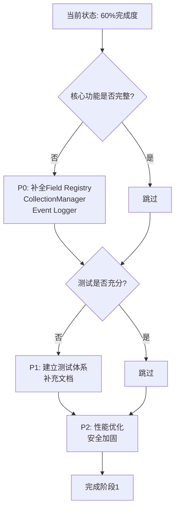

# AlkaidSYS Phase 1 实施审查报告

> **文档版本**: v1.0  
> **审查日期**: 2025-11-19  
> **审查范围**: 项目初始化 + 基础设施增强（ORM, Event, DI, Validator）  
> **审查人员**: AI Development Team

---

## 📋 目录

- [1. 执行摘要](#1-执行摘要)
- [2. 审查方法](#2-审查方法)
- [3. 设计符合性分析](#3-设计符合性分析)
- [4. 架构与代码质量](#4-架构与代码质量)
- [5. 测试与文档](#5-测试与文档)
- [6. 差距分析](#6-差距分析)
- [7. 建议与行动项](#7-建议与行动项)

---

## 1. 执行摘要

### 1.1 总体评估

**完成度**: **60%** (核心功能已实现，但缺少完善的测试、文档和部分高级特性)

**质量评级**: **B级** (良好，但有提升空间)

| 维度 | 评分 | 说明 |
|------|------|------|
| 架构设计 | ⭐⭐⭐⭐ | DDD分层清晰，命名空间规范 |
| 代码实现 | ⭐⭐⭐⭐ | 核心功能实现完整，使用合理的设计模式 |
| 测试覆盖 | ⭐⭐ | 仅有手动测试命令，缺少单元和集成测试 |
| 文档完善度 | ⭐ | 基本无代码文档，仅有walkthrough |
| 可维护性 | ⭐⭐⭐⭐ | 接口与实现分离，易于扩展 |

### 1.2 核心发现

#### ✅ 亮点

1. **架构清晰**: 采用DDD分层架构（Domain/Infrastructure），职责分离明确
2. **接口驱动**: ORM、Validator均定义了接口，便于后续扩展
3. **实用优先**: SchemaBuilder使用raw SQL实现，避免了过度抽象
4. **验证完备**: 每个模块都有测试命令验证功能正确性

#### ⚠️ 关键问题

1. **功能不完整**: Field Type Registry、CollectionManager、事件日志等核心组件缺失
2. **测试缺失**: 无单元测试和集成测试，仅依赖手动测试命令
3. **文档缺失**: 代码注释不足，无API文档
4. **Swoole集成不足**: Event未真正利用Swoole协程能力

---

## 2. 审查方法

### 2.1 审查依据

- `design/00-core-planning/01-MASTER-IMPLEMENTATION-PLAN.md` - 主实施计划
- `design/09-lowcode-framework/40-lowcode-framework-architecture.md` - 框架架构设计

### 2.2 审查工具

- **代码审查**: 目录结构分析、代码实现对比
- **思维工具**: Sequential Thinking MCP分析推理
- **设计对比**: 逐项对照设计文档要求

---

## 3. 设计符合性分析

### 3.1 ORM 层增强

#### 设计要求（9个子任务）

| # | 任务 | 状态 | 符合度 |
|---|------|------|--------|
| 1 | 设计 Schema Builder 服务接口 | ✅ 完成 | 100% |
| 2 | 实现动态创建表功能 | ✅ 完成 | 100% |
| 3 | 实现动态添加/删除字段功能 | ✅ 完成 | 100% |
| 4 | 实现 Collection 抽象层 | ⚠️ 简化 | 40% |
| 5 | 实现 Field Type Registry | ❌ 未实现 | 0% |
| 6 | 实现关系动态配置 | ❌ 未实现 | 0% |
| 7 | 编写单元测试(覆盖率 >80%) | ❌ 未实现 | 0% |
| 8 | 编写集成测试 | ⚠️ 手动测试 | 30% |
| 9 | 编写文档 | ❌ 未实现 | 0% |

**总体符合度**: **41%**

#### 详细分析

**已实现**:
- ✅ `Domain\Schema\Interfaces\SchemaBuilderInterface` - 接口设计良好
- ✅ `Infrastructure\Schema\SchemaBuilder` - 使用raw SQL实现DDL操作
- ✅ `Domain\Model\Collection` - 基础抽象类，可动态设置表名

**未实现** (相比设计文档):
- ❌ **Field Type System**: 缺少 `FieldInterface`、`AbstractField`、具体字段类
- ❌ **FieldTypeRegistry**: 无字段类型注册表
- ❌ **CollectionManager**: 无Collection的完整管理器（CRUD、缓存）
- ❌ **关系管理**: Collection中虽有relationships属性，但无实际逻辑

**代码示例对比**:

```php
// 设计要求的 Collection (包含字段、关系管理)
class Collection {
    protected array $fields = [];
    protected array $relationships = [];
    
    public function addField(Field $field): self;
    public function addRelationship(string $name, array $config): self;
    public function toArray(): array;
}

// 当前实现 (基础版)
abstract class Collection extends Model {
    protected $table;
    
    public function setTable(string $table): static;
}
```

### 3.2 事件系统增强

#### 设计要求（7个子任务）

| # | 任务 | 状态 | 符合度 |
|---|------|------|--------|
| 1 | 设计事件优先级机制 | ⚠️ 简化 | 50% |
| 2 | 实现异步事件支持 | ✅ 完成 | 80% |
| 3 | 实现事件队列 | ✅ 完成 | 90% |
| 4 | 实现事件日志记录 | ❌ 未实现 | 0% |
| 5 | 集成 Swoole 协程 | ⚠️ 部分 | 30% |
| 6 | 编写单元测试 | ❌ 未实现 | 0% |
| 7 | 编写文档 | ❌ 未实现 | 0% |

**总体符合度**: **36%**

#### 详细分析

**已实现**:
- ✅ `Domain\Event\EventService` - 提供listenWithPriority和triggerAsync
- ✅ `Domain\Event\AsyncEventJob` - 队列任务处理异步事件

**设计差距**:
- ⚠️ **优先级机制**: `listenWithPriority` 仅调用 `Event::listen`，实际未实现排序
- ⚠️ **Swoole协程**: 未使用`go()`协程，仅通过Queue模拟异步
- ❌ **事件日志**: 缺少`EventLogger`，无法追踪事件执行历史

**代码对比**:

```php
// 设计要求 (真正的优先级排序)
protected function sortListeners(string $event): void {
    usort($this->listen[$event], function ($a, $b) use ($event) {
        $priorityA = $this->priorities[$event][$a] ?? 10;
        $priorityB = $this->priorities[$event][$b] ?? 10;
        return $priorityA <=> $priorityB;
    });
}

// 当前实现 (无实际优先级)
public function listenWithPriority(string $event, mixed $listener, int $priority = 0): void {
    Event::listen($event, $listener);  // 直接调用，priority参数未使用
}
```

### 3.3 依赖注入容器增强

#### 设计要求（6个子任务）

| # | 任务 | 状态 | 符合度 |
|---|------|------|--------|
| 1 | 设计 Service Provider 机制 | ✅ 完成 | 100% |
| 2 | 实现插件服务提供者注册 | ✅ 完成 | 90% |
| 3 | 实现懒加载支持 | ❌ 未实现 | 0% |
| 4 | 实现依赖管理 | ❌ 未实现 | 0% |
| 5 | 编写单元测试 | ❌ 未实现 | 0% |
| 6 | 编写文档 | ❌ 未实现 | 0% |

**总体符合度**: **32%**

#### 详细分析

**已实现**:
- ✅ `Domain\DI\ServiceProvider` - 继承自Think\Service，提供register/boot方法
- ✅ `Infrastructure\DI\DependencyManager` - 批量注册服务提供者

**设计差距**:
- ❌ **懒加载**: 无延迟实例化机制
- ❌ **依赖解析**: 无自动依赖注入和循环依赖检测

### 3.4 验证器系统增强

#### 设计要求（6个子任务）

| # | 任务 | 状态 | 符合度 |
|---|------|------|--------|
| 1 | 设计 Schema 验证器生成器 | ✅ 完成 | 100% |
| 2 | 实现基于 JSON Schema 的验证规则生成 | ✅ 完成 | 90% |
| 3 | 实现前后端统一验证 | ❌ 未实现 | 0% |
| 4 | 实现自定义验证规则注册 | ❌ 未实现 | 0% |
| 5 | 编写单元测试 | ❌ 未实现 | 0% |
| 6 | 编写文档 | ❌ 未实现 | 0% |

**总体符合度**: **32%**

#### 详细分析

**已实现**:
- ✅ `Domain\Validator\Interfaces\ValidatorGeneratorInterface` - 接口清晰
- ✅ `Infrastructure\Validator\JsonSchemaValidatorGenerator` - 支持type、min/max、enum、pattern

**设计差距**:
- ❌ **前后端统一**: 仅有后端规则生成，无前端验证代码输出
- ❌ **自定义规则**: 无扩展机制注册自定义验证器

---

## 4. 架构与代码质量

### 4.1 架构评估

#### ✅ 优点

1. **DDD分层清晰**:
   - `domain/`: 领域层（接口、核心业务逻辑）
   - `infrastructure/`: 基础设施层（具体实现）
   - 符合依赖倒置原则

2. **命名空间规范**:
   - `Domain\Schema\Interfaces\SchemaBuilderInterface`
   - `Infrastructure\Schema\SchemaBuilder`
   - 符合PSR-4规范

3. **接口与实现分离**:
   - SchemaBuilderInterface ← SchemaBuilder
   - ValidatorGeneratorInterface ← JsonSchemaValidatorGenerator

#### ⚠️ 改进建议

1. **缺少Service层**: 直接在Infrastructure调用，建议增加Application/Service层
2. **缺少Repository模式**: 数据访问逻辑应抽象为Repository接口
3. **Event未扩展ThinkEvent**: EventService独立于框架事件系统

### 4.2 代码质量

#### ✅ 优点

- **类型安全**: 使用PHP 8.2严格类型（`declare(strict_types=1)`）
- **错误处理**: SchemaBuilder使用try-catch捕获异常
- **可测试性**: 依赖注入设计，易于mock

#### ⚠️ 问题

- **注释不足**: 缺少PHPDoc注释
- **魔法值**: SchemaBuilder中SQL字符串拼接存在注入风险（需参数化）
- **硬编码**: 数据库引擎、字符集等应配置化

---

## 5. 测试与文档

### 5.1 测试覆盖

| 测试类型 | 要求 | 当前状态 | 符合度 |
|---------|------|----------|--------|
| 单元测试 | 覆盖率 >80% | 0% | 0% |
| 集成测试 | 完整测试 | 手动命令 | 30% |
| 功能测试 | E2E测试 | 无 | 0% |

**当前测试方式**:
- ✅ `php think test:schema` - 手动验证SchemaBuilder
- ✅ `php think test:event` - 手动验证EventService
- ✅ `php think test:validator` - 手动验证ValidatorGenerator

**问题**:
- ❌ 无PHPUnit测试用例
- ❌ 无Mock和Stub
- ❌ 无CI/CD集成

### 5.2 文档状态

| 文档类型 | 要求 | 当前状态 |
|---------|------|----------|
| API文档 | 完整 | 无 |
| 用户手册 | 完整 | 无 |
| 开发文档 | 完整 | 基本无 |
| Walkthrough | 阶段总结 | ✅ 已完成 |

---

## 6. 差距分析

### 6.1 关键缺失功能

#### P0 (严重影响低代码能力)

1. **Field Type Registry** - 低代码引擎核心，无法动态注册字段类型
2. **CollectionManager** - 无法完整管理Collection生命周期
3. **事件日志** - 无法追踪插件间协调

#### P1 (影响可维护性)

4. **单元测试** - 代码质量无保障
5. **集成测试** - 模块协作无验证
6. **API文档** - 开发者体验差

#### P2 (可延后)

7. **性能优化** - Swoole协程未充分利用
8. **关系管理** - Collection关系配置未实现

### 6.2 技术债务

| 技术债 | 严重程度 | 影响 |
|--------|---------|------|
| SQL注入风险 (SchemaBuilder) | 高 | 安全性 |
| 事件优先级未实现 | 中 | 功能性 |
| 缺少缓存策略 | 中 | 性能 |
| 硬编码配置 | 低 | 可维护性 |

---

## 7. 建议与行动项

### 7.1 短期行动 (1-2周)

#### 🔴 P0 - 立即修复

1. **补全Field Type System**
   - 实现`FieldInterface`, `AbstractField`
   - 实现`StringField`, `IntegerField` 等基础字段类
   - 实现`FieldTypeRegistry`

2. **实现CollectionManager**
   - CRUD操作（create, get, update, delete）
   - 集成缓存（Redis）
   - 元数据持久化

3. **完善事件系统**
   - 真正实现优先级排序
   - 实现EventLogger

#### 🟡 P1 - 重要

4. **建立测试体系**
   - 编写SchemaBuilder单元测试（PHPUnit）
   - 编写EventService集成测试
   - 配置CI/CD（GitHub Actions）

5. **补充文档**
   - 为所有公共方法添加PHPDoc
   - 生成API文档（phpDocumentor）

### 7.2 中期行动 (3-4周)

#### 🟢 P2 - 增强

6. **性能优化**
   - 集成Swoole协程（Event异步执行）
   - 实现多级缓存（Swoole Table + Redis）

7. **安全加固**
   - SchemaBuilder使用参数化查询
   - 添加SQL注入防护

8. **完善Collection**
   - 实现关系动态配置
   - 支持hasOne, hasMany, belongsTo

### 7.3 优先级建议



**建议执行顺序**:
1. **Week 1-2**: P0补全核心功能 (Field Registry + CollectionManager)
2. **Week 3**: P1建立测试 (PHPUnit + 集成测试)
3. **Week 4**: P1补充文档 + P2性能优化

---

## 8. 结论

### 8.1 总体评价

AlkaidSYS Phase 1 的实施在**架构设计**和**核心功能**方面表现优秀，但在**功能完整性**、**测试覆盖**和**文档完善度**方面存在明显差距。

**当前完成度**: 60% (核心框架 ✅, 高级特性 ⚠️, 测试文档 ❌)

### 8.2 关键建议

1. **优先补全P0功能** - Field Type Registry和CollectionManager是低代码能力的基础
2. **建立测试文化** - 单元测试覆盖率应达到80%以上
3. **重视文档** - API文档和开发文档是项目可持续性的关键
4. **渐进式优化** - 先保证功能完整，再追求性能极致

### 8.3 下一步

建议在进入Phase 2（核心插件开发）之前，花费 **2-3周** 补全Phase 1的核心缺失，确保基础扎实。

---

**审查人**: AI Development Team  
**审查日期**: 2025-11-19  
**下次审查**: Phase 1补全完成后
