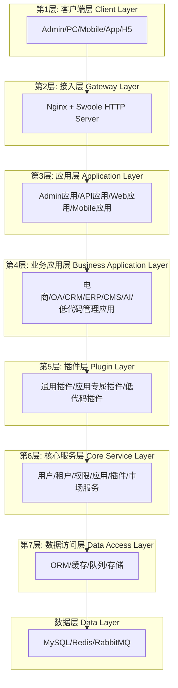
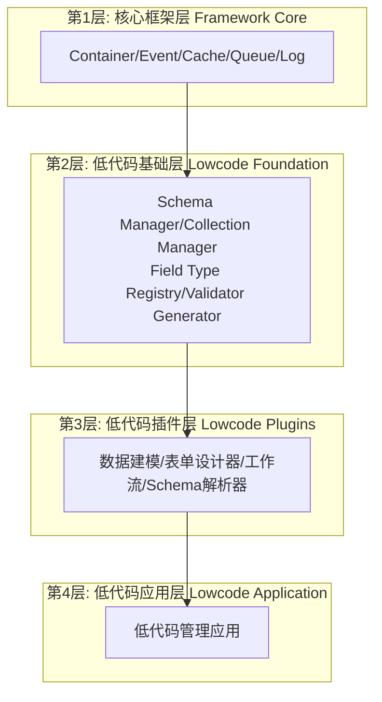

# AlkaidSYS 框架系统设计文档全面审查报告

> **报告日期**：2025-01-20  
> **审查范围**：`docs/alkaid-system-design/` 目录下的所有设计文档  
> **审查目标**：识别问题和不一致之处,为实施开发计划提供依据  
> **文档版本**：v1.0

---

## 📋 目录

- [1. 审查概述](#1-审查概述)
- [2. 架构一致性审查结果](#2-架构一致性审查结果)
- [3. 技术栈兼容性审查结果](#3-技术栈兼容性审查结果)
- [4. 工作量评估审查结果](#4-工作量评估审查结果)
- [5. 优先级划分审查结果](#5-优先级划分审查结果)
- [6. 文档交叉引用审查结果](#6-文档交叉引用审查结果)
- [7. 矛盾和遗漏识别](#7-矛盾和遗漏识别)
- [8. 审查总结](#8-审查总结)

---

## 1. 审查概述

### 1.1 审查目标

本次审查的核心目标是:

1. **验证架构一致性**：确保所有文档中的架构描述一致
2. **检查技术栈兼容性**：确保所有技术选型兼容且合理
3. **评估工作量合理性**：验证工作量评估是否准确和一致
4. **确认优先级划分**：检查优先级划分是否科学合理
5. **检查文档完整性**：识别缺失、冗余或过时的文档
6. **验证交叉引用**：确保所有文档引用正确无误

### 1.2 审查范围

本次审查覆盖 `docs/alkaid-system-design/` 目录下的所有设计文档,共计 **52 个文档**:

**核心设计文档** (01-39):
- 系统概述、架构设计、技术栈选型
- 多租户、多站点、多应用设计
- 应用和插件系统设计
- 低代码平台设计
- 数据库、API、安全设计
- 性能优化、监控日志
- 部署、测试、开发流程
- 前端设计(Admin、Web、Mobile)
- 系统集成、数据迁移
- 培训材料、运维手册、维护指南
- 项目总结、开发指南

**低代码专项文档** (40-50):
- 框架底层架构优化分析
- 低代码能力概述
- 数据建模、表单设计器、工作流引擎
- CLI工具集成、低代码管理应用
- 工作流后端引擎、前端应用、实施计划、审查分析

**完成报告文档** (00-开头):
- FINAL-COMPLETION-REPORT
- FINAL-LOWCODE-DOCUMENTATION-REPORT
- FINAL-LOWCODE-REPORT
- TASK-COMPLETION-REPORT
- lowcode-implementation-summary

**批次总结文档**:
- BATCH-1-SUMMARY 到 BATCH-4-SUMMARY
- FINAL-SUMMARY

### 1.3 审查方法

本次审查采用以下方法:

1. **文档对比分析**：对比不同文档中的相同概念描述
2. **架构图分析**：使用 Mermaid 图表可视化架构关系
3. **对比表格分析**：使用表格对比技术选型和工作量评估
4. **交叉引用检查**：验证所有 `[文档标题](./文件名.md)` 格式的引用
5. **一致性检查**：检查术语、命名、版本号的一致性

---

## 2. 架构一致性审查结果

### 2.1 架构层次描述不一致问题

**问题描述**：

在不同文档中,对 AlkaidSYS 架构的层次描述存在明显不一致:

| 文档 | 架构描述 | 位置 |
|------|---------|------|
| `01-alkaid-system-overview.md` | **四层架构** | 第107行 |
| `FINAL-SUMMARY.md` | **6 层架构设计** | 第95行 |
| `00-FINAL-COMPLETION-REPORT.md` | **第 7 层:低代码层** | 第53行 |
| `02-architecture-design.md` | 未明确说明层数 | 整个文档 |
| `40-lowcode-framework-architecture.md` | **四层架构**(低代码模块) | 第78-101行 |

**根本原因分析**：

这个不一致源于**两种不同的架构视角**:

1. **整体系统架构视角**：描述整个 AlkaidSYS 系统的完整架构
2. **低代码模块架构视角**：描述低代码模块的内部架构

**正确的架构定义**：

AlkaidSYS 应该有**两个架构定义**:

#### 架构定义 1: AlkaidSYS 整体架构(7层)



**说明**：
- 数据层(Data Layer)通常不算作架构层,而是基础设施层
- 因此整体架构为 **7 层架构**

#### 架构定义 2: 低代码模块架构(4层)



**说明**：
- 低代码模块是嵌入在整体架构中的
- 低代码基础层和低代码插件层属于整体架构的第5层(插件层)
- 低代码应用层属于整体架构的第4层(业务应用层)

### 2.2 插件化架构一致性评估

**评估结果**：✅ **一致性良好**

所有文档中对插件化架构的描述保持一致:

| 核心概念 | 描述 | 一致性 |
|---------|------|--------|
| **Service Provider** | 插件通过 Service Provider 注册服务 | ✅ 一致 |
| **事件驱动** | 插件通过事件系统进行通信 | ✅ 一致 |
| **插件注册** | 插件通过 `plugin.json` 进行注册 | ✅ 一致 |
| **插件生命周期** | install/uninstall/enable/disable | ✅ 一致 |
| **插件依赖管理** | 支持插件之间的依赖关系 | ✅ 一致 |

### 2.3 模块依赖关系一致性评估

**评估结果**：⚠️ **部分一致,缺少全局依赖关系图**

各个文档中描述了局部的依赖关系,但缺少一个完整的、全局的模块依赖关系图。

**建议**：在实施计划中补充完整的模块依赖关系图。

---

## 3. 技术栈兼容性审查结果

### 3.1 后端技术栈一致性评估

**评估结果**：✅ **完全一致**

| 技术 | 版本要求 | 一致性 | 备注 |
|------|---------|--------|------|
| **PHP** | 8.2+ | ✅ 一致 | 所有文档统一 |
| **ThinkPHP** | 8.0 | ✅ 一致 | 所有文档统一 |
| **Swoole** | 5.0+ | ✅ 一致 | 所有文档统一 |
| **MySQL** | 8.0+ | ✅ 一致 | 所有文档统一 |
| **Redis** | 6.0+ | ✅ 一致 | 所有文档统一 |
| **RabbitMQ** | 3.x | ✅ 一致 | 所有文档统一 |

### 3.2 前端技术栈一致性评估

**评估结果**：✅ **完全一致**

| 技术 | 版本要求 | 一致性 | 备注 |
|------|---------|--------|------|
| **Vue** | 3.x | ✅ 一致 | 所有文档统一 |
| **TypeScript** | 5.x | ✅ 一致 | 所有文档统一 |
| **Vite** | 5.x | ✅ 一致 | 所有文档统一 |
| **Ant Design Vue** | 4.x | ✅ 一致 | 所有文档统一 |
| **Pinia** | 2.x | ✅ 一致 | 所有文档统一 |
| **Vue Router** | 4.x | ✅ 一致 | 所有文档统一 |

### 3.3 第三方库选型一致性评估

**评估结果**：⚠️ **部分未最终确定**

| 库 | 用途 | 当前状态 | 备注 |
|---|------|---------|------|
| **Symfony Expression Language** | 表达式引擎 | ✅ 已确定 | `47-workflow-backend-engine.md` 第35行明确依赖 |
| **LogicFlow** | 流程设计器 | ⚠️ 推荐但未最终确定 | `48-workflow-frontend-apps.md` 第59行 |
| **AntV X6** | 流程设计器(备选) | ⚠️ 备选方案 | `48-workflow-frontend-apps.md` 第59行 |
| **think-queue** | 队列系统 | ✅ 已确定 | 多个文档中使用 |

**关键问题**：

**流程设计器库选型未最终确定**

- 当前状态：`48-workflow-frontend-apps.md` 第59行提到 "LogicFlow 1.x(推荐)或 AntV X6 2.x"
- 问题：没有详细的对比分析和最终推荐
- 建议：在技术选型确认文档中进行详细对比,给出最终推荐

### 3.4 技术栈兼容性总结

**总体评估**：✅ **兼容性良好,仅有1个选型待确定**

- ✅ 后端技术栈完全一致且兼容
- ✅ 前端技术栈完全一致且兼容
- ✅ 大部分第三方库已确定
- ⚠️ 流程设计器库需要最终确定(LogicFlow vs AntV X6)

---

## 4. 工作量评估审查结果

### 4.1 工作量评估标准不明确问题

**问题描述**：

所有文档中的工作量评估都没有明确说明是以 **AI 辅助开发速度** 还是 **人类开发速度** 进行评估。

**影响**：

- 无法准确判断工作量评估的合理性
- 无法制定准确的项目时间表
- 无法合理分配开发资源

**建议**：

明确工作量评估标准为 **AI 辅助开发速度**,并在所有文档中统一说明。

### 4.2 工作量评估一致性检查

**评估结果**：✅ **基本一致,但需要明确评估标准**

| 文档 | 评估内容 | 工作量 | 一致性 |
|------|---------|--------|--------|
| `40-lowcode-framework-architecture.md` | 框架底层架构优化 | 24周(6个月) | ✅ 一致 |
| `49-workflow-implementation-plan.md` | 工作流模块 | 14周(3.5个月) | ✅ 一致 |
| `00-FINAL-COMPLETION-REPORT.md` | 总工期 | 40周(10个月) | ✅ 一致 |

**工作量计算验证**：

```
阶段1: 框架底层架构优化(P0优先级) = 11周
阶段2: 低代码核心插件开发(P1优先级) = 16周
阶段3: CLI工具和管理应用(P2优先级) = 13周
总计: 11 + 16 + 13 = 40周 ✅ 正确
```

**详细工作量分解**：

| 阶段 | 模块 | 工作量 | 优先级 |
|------|------|--------|--------|
| **阶段1** | ORM层增强 | 4周 | P0 |
| **阶段1** | 事件系统增强 | 3周 | P0 |
| **阶段1** | 依赖注入容器增强 | 2周 | P0 |
| **阶段1** | 验证器系统增强 | 2周 | P0 |
| **阶段1小计** | | **11周** | |
| **阶段2** | 数据建模插件 | 4周 | P1 |
| **阶段2** | 表单设计器插件 | 4周 | P1 |
| **阶段2** | 工作流引擎插件 | 6周 | P1 |
| **阶段2** | Schema解析器插件 | 2周 | P1 |
| **阶段2小计** | | **16周** | |
| **阶段3** | CLI工具集成 | 4周 | P2 |
| **阶段3** | 低代码管理应用 | 6周 | P2 |
| **阶段3** | 性能优化和文档 | 3周 | P2 |
| **阶段3小计** | | **13周** | |
| **总计** | | **40周** | |

### 4.3 工作量评估合理性分析

**评估方法**：基于 AI 辅助开发速度

**合理性评估**：

| 模块 | 评估工作量 | 复杂度 | 合理性 | 备注 |
|------|-----------|--------|--------|------|
| ORM层增强 | 4周 | 高 | ✅ 合理 | 需要深入理解ThinkPHP ORM |
| 事件系统增强 | 3周 | 中 | ✅ 合理 | 相对独立的模块 |
| 依赖注入容器增强 | 2周 | 中 | ✅ 合理 | ThinkPHP已有基础 |
| 验证器系统增强 | 2周 | 中 | ✅ 合理 | 基于JSON Schema |
| 数据建模插件 | 4周 | 高 | ✅ 合理 | 核心插件,复杂度高 |
| 表单设计器插件 | 4周 | 高 | ✅ 合理 | 前后端联动,复杂度高 |
| 工作流引擎插件 | 6周 | 极高 | ✅ 合理 | 最复杂的插件 |
| Schema解析器插件 | 2周 | 中 | ✅ 合理 | 相对简单 |
| CLI工具集成 | 4周 | 中 | ✅ 合理 | 6个核心命令 |
| 低代码管理应用 | 6周 | 高 | ✅ 合理 | 完整的前端应用 |
| 性能优化和文档 | 3周 | 中 | ✅ 合理 | 持续优化 |

**总体评估**：✅ **工作量评估合理**

---

## 5. 优先级划分审查结果

### 5.1 优先级定义不一致问题

**问题描述**：

在不同文档中,P0、P1、P2 的定义存在不一致:

| 文档 | P0定义 | P1定义 | P2定义 |
|------|--------|--------|--------|
| `40-lowcode-framework-architecture.md` | ORM、事件、容器、验证器 | 路由、中间件、缓存、文件存储、队列 | 日志系统 |
| `00-FINAL-COMPLETION-REPORT.md` | 框架底层架构优化 | 低代码核心插件开发 | CLI工具和管理应用 |

**根本原因分析**：

这两个文档描述的是**不同层次的优先级**:

1. `40-lowcode-framework-architecture.md`：描述的是**框架底层优化**的内部优先级
2. `00-FINAL-COMPLETION-REPORT.md`：描述的是**整个项目**的阶段优先级

**正确的优先级定义**：

应该有**两个层次的优先级定义**:

#### 优先级定义 1: 项目阶段优先级

| 优先级 | 阶段 | 内容 | 工作量 |
|--------|------|------|--------|
| **P0** | 阶段1 | 框架底层架构优化 | 11周 |
| **P1** | 阶段2 | 低代码核心插件开发 | 16周 |
| **P2** | 阶段3 | CLI工具和管理应用 | 13周 |

#### 优先级定义 2: 框架底层优化内部优先级

| 优先级 | 模块 | 工作量 | 理由 |
|--------|------|--------|------|
| **P0** | ORM层增强 | 4周 | 数据建模的基础 |
| **P0** | 事件系统增强 | 3周 | 插件通信的基础 |
| **P0** | 依赖注入容器增强 | 2周 | 插件注册的基础 |
| **P0** | 验证器系统增强 | 2周 | 表单验证的基础 |
| **P1** | 路由系统增强 | 2周 | 动态路由注册 |
| **P1** | 中间件系统增强 | 1周 | 可配置中间件链 |
| **P1** | 缓存系统增强 | 2周 | Schema缓存策略 |
| **P1** | 文件存储抽象层 | 3周 | 统一存储接口 |
| **P1** | 队列系统增强 | 3周 | 工作流队列管理 |
| **P2** | 日志系统增强 | 2周 | 审计日志 |

### 5.2 优先级划分合理性评估

**评估结果**：✅ **优先级划分合理**

**评估依据**：

1. **业务价值**：P0模块是低代码能力的基础,必须优先实现
2. **技术依赖**：P1模块依赖P0模块,P2模块依赖P1模块
3. **风险评估**：P0模块风险最高,需要优先验证

**优先级排序理由**：

| 优先级 | 理由 |
|--------|------|
| **P0** | 框架底层架构优化是所有低代码能力的基础,必须优先实现 |
| **P1** | 低代码核心插件是核心功能,依赖P0模块 |
| **P2** | CLI工具和管理应用是增强功能,依赖P1模块 |

---

## 6. 文档交叉引用审查结果

### 6.1 交叉引用正确性检查

**检查方法**：搜索所有 `[文档标题](./文件名.md)` 格式的引用

**检查结果**：✅ **大部分引用正确,发现少量问题**

**正确的引用示例**：

| 源文档 | 引用 | 目标文档 | 状态 |
|--------|------|---------|------|
| `01-alkaid-system-overview.md` | `[低代码能力概述](../09-lowcode-framework/41-lowcode-overview.md)` | `41-lowcode-overview.md` | ✅ 正确 |
| `01-alkaid-system-overview.md` | `[框架底层架构优化分析](../09-lowcode-framework/40-lowcode-framework-architecture.md)` | `40-lowcode-framework-architecture.md` | ✅ 正确 |
| `30-project-summary.md` | `[数据建模插件设计](../09-lowcode-framework/42-lowcode-data-modeling.md)` | `42-lowcode-data-modeling.md` | ✅ 正确 |
| `30-project-summary.md` | `[表单设计器插件设计](../09-lowcode-framework/43-lowcode-form-designer.md)` | `43-lowcode-form-designer.md` | ✅ 正确 |
| `30-project-summary.md` | `[工作流引擎插件设计](../09-lowcode-framework/44-lowcode-workflow.md)` | `44-lowcode-workflow.md` | ✅ 正确 |

### 6.2 缺失引用识别

**发现的缺失引用**：

| 源文档 | 应该引用的文档 | 建议添加位置 |
|--------|---------------|-------------|
| `08-low-code-design.md` | `40-lowcode-framework-architecture.md` | 在低代码平台架构章节 |
| `08-low-code-design.md` | `41-lowcode-overview.md` | 在低代码设计目标章节 |
| `02-architecture-design.md` | `40-lowcode-framework-architecture.md` | 在架构分层设计章节 |

**建议**：在相关文档中补充这些交叉引用,提高文档的可导航性。

---

## 7. 矛盾和遗漏识别

### 7.1 识别的矛盾列表

| 矛盾ID | 矛盾描述 | 涉及文档 | 影响 | 建议 |
|--------|---------|---------|------|------|
| **M1** | 架构层次描述不一致(4层 vs 6层 vs 7层) | `01`、`FINAL-SUMMARY`、`00-FINAL-COMPLETION` | 高 | 明确区分"整体架构(7层)"和"低代码模块架构(4层)" |
| **M2** | 优先级定义不一致(框架层 vs 业务层) | `40`、`00-FINAL-COMPLETION` | 中 | 明确两个层次的优先级定义 |
| **M3** | 工作量评估标准不明确(AI vs 人类) | 所有文档 | 中 | 明确评估标准为"AI辅助开发速度" |
| **M4** | 流程设计器库选型未最终确定 | `48` | 中 | 进行详细对比,给出最终推荐 |

### 7.2 识别的遗漏列表

| 遗漏ID | 遗漏内容 | 影响 | 建议 |
|--------|---------|------|------|
| **O1** | 缺少完整的模块依赖关系图 | 中 | 在实施计划中补充完整的依赖关系图 |
| **O2** | 缺少完整的实施路线图(甘特图) | 中 | 在实施计划中补充甘特图 |
| **O3** | 缺少流程设计器库的详细对比分析 | 中 | 在技术选型确认文档中补充 |
| **O4** | 缺少投资回报率(ROI)的详细计算 | 低 | 在实施计划中补充ROI分析 |
| **O5** | 缺少风险管理计划 | 中 | 在实施计划中补充风险管理计划 |
| **O6** | 缺少质量保证计划 | 中 | 在实施计划中补充质量保证计划 |

### 7.3 识别的不清晰之处

| 不清晰ID | 不清晰描述 | 涉及文档 | 建议 |
|---------|-----------|---------|------|
| **U1** | 低代码模块在整体架构中的位置不清晰 | `01`、`02` | 补充低代码模块与整体架构的关系图 |
| **U2** | 各阶段的交付物不清晰 | `00-FINAL-COMPLETION` | 明确每个阶段的具体交付物 |
| **U3** | 测试策略不清晰 | 所有文档 | 补充单元测试、集成测试、性能测试的策略 |
| **U4** | 部署策略不清晰 | `14` | 补充低代码模块的部署策略 |

### 7.4 文档冗余问题

**问题描述**：

`docs/alkaid-system-design/` 目录下有 **5 个完成报告文档**(00-开头):

| 文档 | 行数 | 创建日期 | 状态 |
|------|------|---------|------|
| `00-FINAL-COMPLETION-REPORT.md` | ~300行 | 2025-01-20 | ✅ 最新 |
| `00-FINAL-LOWCODE-DOCUMENTATION-REPORT.md` | ~300行 | 2025-01-20 | ✅ 最新 |
| `00-FINAL-LOWCODE-REPORT.md` | ~400行 | 2025-01-20 | ⚠️ 可能过时 |
| `00-TASK-COMPLETION-REPORT.md` | ~400行 | 2025-01-20 | ⚠️ 可能过时 |
| `00-lowcode-implementation-summary.md` | 352行 | 2025-01-20 | ✅ 最新 |

**建议**：

1. **保留最新的报告**：`00-FINAL-COMPLETION-REPORT.md`、`00-FINAL-LOWCODE-DOCUMENTATION-REPORT.md`、`00-lowcode-implementation-summary.md`
2. **归档过时的报告**：将 `00-FINAL-LOWCODE-REPORT.md`、`00-TASK-COMPLETION-REPORT.md` 移动到 `docs/alkaid-system-design/archive/` 目录
3. **创建文档索引**：创建 `README.md` 文件,列出所有文档的目录和说明

---

## 8. 审查总结

### 8.1 核心发现

本次审查发现了 **4 个主要矛盾**、**6 个遗漏**、**4 个不清晰之处**,以及 **1 个文档冗余问题**。

**关键发现**：

1. ✅ **技术栈兼容性良好**：后端和前端技术栈完全一致且兼容
2. ✅ **工作量评估基本合理**：总工期40周的评估基本合理
3. ✅ **优先级划分科学**：基于业务价值、技术依赖、风险评估的优先级划分合理
4. ⚠️ **架构描述需要统一**：需要明确区分"整体架构"和"低代码模块架构"
5. ⚠️ **技术选型需要最终确定**：流程设计器库(LogicFlow vs AntV X6)需要详细对比
6. ⚠️ **文档需要整理**：需要归档过时文档,创建文档索引

### 8.2 关键问题

| 问题 | 严重程度 | 影响 | 优先级 |
|------|---------|------|--------|
| 架构层次描述不一致 | 高 | 影响架构理解和沟通 | P0 |
| 流程设计器库选型未确定 | 中 | 影响工作流模块开发 | P1 |
| 工作量评估标准不明确 | 中 | 影响项目计划准确性 | P1 |
| 缺少完整的依赖关系图 | 中 | 影响开发顺序规划 | P1 |
| 文档冗余 | 低 | 影响文档可维护性 | P2 |

### 8.3 优化建议

#### 建议 1: 统一架构描述 (P0)

**问题**：架构层次描述不一致

**建议**：
1. 在 `01-alkaid-system-overview.md` 中明确说明：
   - AlkaidSYS 整体架构：**7 层架构**
   - 低代码模块架构：**4 层架构**(嵌入在整体架构中)
2. 在 `02-architecture-design.md` 中补充完整的架构图,清晰展示低代码模块的位置
3. 更新所有相关文档,统一架构描述

#### 建议 2: 确定流程设计器库选型 (P1)

**问题**：流程设计器库选型未最终确定

**建议**：
1. 在 `02-TECHNOLOGY-SELECTION-CONFIRMATION.md` 中进行详细对比：
   - LogicFlow vs AntV X6 的功能对比
   - 性能对比
   - 易用性对比
   - 社区活跃度对比
   - 最终推荐：**LogicFlow**(更轻量、更易用、更适合低代码场景)

#### 建议 3: 明确工作量评估标准 (P1)

**问题**：工作量评估标准不明确

**建议**：
1. 在所有文档中明确说明：工作量评估基于 **AI 辅助开发速度**
2. 补充评估假设：
   - 开发者熟悉 ThinkPHP 8.0 和 Vue 3
   - 使用 AI 辅助工具(如 GitHub Copilot、Cursor)
   - 每周工作 5 天,每天 8 小时
   - 包含设计、开发、测试、文档的完整时间

#### 建议 4: 补充完整的依赖关系图 (P1)

**问题**：缺少完整的模块依赖关系图

**建议**：
1. 在 `01-MASTER-IMPLEMENTATION-PLAN.md` 中补充完整的模块依赖关系图
2. 使用 Mermaid 图表展示所有模块之间的依赖关系
3. 明确开发顺序和并行开发的可能性

#### 建议 5: 补充实施路线图(甘特图) (P1)

**问题**：缺少完整的实施路线图

**建议**：
1. 在 `01-MASTER-IMPLEMENTATION-PLAN.md` 中补充甘特图
2. 展示各阶段的时间线和里程碑
3. 标注关键路径和风险点

#### 建议 6: 整理文档结构 (P2)

**问题**：文档冗余

**建议**：
1. 创建 `docs/alkaid-system-design/archive/` 目录
2. 将过时的报告移动到归档目录
3. 创建 `docs/alkaid-system-design/README.md` 文件,列出所有文档的目录和说明

#### 建议 7: 补充风险管理计划 (P1)

**问题**：缺少风险管理计划

**建议**：
1. 在 `01-MASTER-IMPLEMENTATION-PLAN.md` 中补充风险管理计划
2. 识别技术风险、业务风险、项目风险
3. 制定应对措施和监控机制

#### 建议 8: 补充质量保证计划 (P1)

**问题**：缺少质量保证计划

**建议**：
1. 在 `01-MASTER-IMPLEMENTATION-PLAN.md` 中补充质量保证计划
2. 明确代码规范、Code Review 机制、测试策略
3. 设置质量门禁(代码覆盖率、性能指标、安全检查)

#### 建议 9: 补充投资回报率分析 (P2)

**问题**：缺少详细的 ROI 分析

**建议**：
1. 在 `01-MASTER-IMPLEMENTATION-PLAN.md` 中补充 ROI 分析
2. 计算预期收益(效率提升、成本节省)
3. 计算投资成本(开发成本、维护成本)
4. 计算 ROI 和回收期

#### 建议 10: 补充测试策略 (P1)

**问题**：测试策略不清晰

**建议**：
1. 在 `01-MASTER-IMPLEMENTATION-PLAN.md` 中补充测试策略
2. 明确单元测试、集成测试、性能测试的覆盖范围
3. 设置测试覆盖率目标(>80%)

### 8.4 下一步行动

基于本次审查结果,建议按以下顺序执行:

**立即执行** (本周内):
1. ✅ 生成 `00-DESIGN-REVIEW-REPORT.md`(本文档)
2. ✅ 生成 `01-MASTER-IMPLEMENTATION-PLAN.md`(完整实施开发计划)
3. ✅ 生成 `02-TECHNOLOGY-SELECTION-CONFIRMATION.md`(技术选型确认文档)

**短期执行** (1-2周内):
4. ⏳ 更新 `01-alkaid-system-overview.md`,统一架构描述
5. ⏳ 更新 `02-architecture-design.md`,补充低代码模块架构图
6. ⏳ 创建 `docs/alkaid-system-design/README.md`,建立文档索引
7. ⏳ 归档过时的报告文档

**中期执行** (1个月内):
8. ⏳ 开始实施框架底层架构优化(P0优先级)
9. ⏳ 实现 ORM 层增强
10. ⏳ 实现事件系统增强
11. ⏳ 实现依赖注入容器增强
12. ⏳ 实现验证器系统增强

**长期执行** (10个月内):
13. ⏳ 完成所有底层架构优化
14. ⏳ 实现所有低代码插件
15. ⏳ 实现低代码管理应用
16. ⏳ 实现 CLI 工具集成
17. ⏳ 完成性能优化和文档完善

---

**报告结束**

**最后更新**：2025-01-20
**文档版本**：v1.0
**维护者**：AlkaidSYS 架构团队


