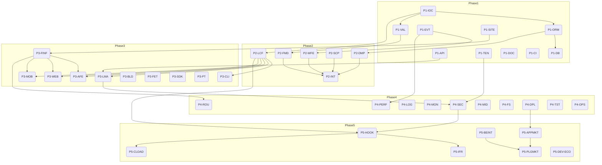

1. AlkaidSYS 基于设计文档的全覆盖开发计划（v1.0）
# AlkaidSYS 基于设计文档的全覆盖开发计划（v1.0）

说明与前提
- 本计划严格基于设计文档分解，采用“一级=阶段（里程碑）→ 二级=模块/子系统 → 三级=最小可执行任务”的三级目录结构。
- 任务ID命名规范：P{阶段}-{模块缩写}-{序号}（例如：P1-ORM-01）
- 设计文档引索格式（严格执行）：相对路径 §章节号 #标题锚点。示例：01-architecture-design/02-architecture-design.md §3.2 #权限服务
- 若源文档缺少清晰章节编号/锚点，本计划以“§TBD #临时锚点”占位，并在阶段1纳入“文档锚点与编号校准”任务，确保后续统一回填与校正。
- 排序以 00-core-planning/01-MASTER-IMPLEMENTATION-PLAN.md 的“五阶段”路线为基准，在不破坏依赖的前提下进行并行化与关键路径压缩。

--------------------------------------------------------------------------------
覆盖性校验清单（要求全覆盖，显式排除 10,11,other）
- 根：
  - [x] README.md（总索引）
- 00-core-planning：
  - [x] 00-core-planning/01-MASTER-IMPLEMENTATION-PLAN.md
  - [x] 00-core-planning/02-TECHNOLOGY-SELECTION-CONFIRMATION.md
  - [x] 00-core-planning/03-PROJECT-DEPENDENCIES.md
  - [x] 00-core-planning/01-alkaid-system-overview.md
- 01-architecture-design：
  - [x] 01-architecture-design/02-architecture-design.md
  - [x] 01-architecture-design/03-tech-stack-selection.md
  - [x] 01-architecture-design/04-multi-tenant-design.md
  - [x] 01-architecture-design/05-multi-site-design.md
  - [x] 01-architecture-design/06-application-plugin-system-design.md
  - [x] 01-architecture-design/07-multi-terminal-design.md
  - [x] 01-architecture-design/08-low-code-design.md
- 02-app-plugin-ecosystem：
  - [x] 02-app-plugin-ecosystem/06-1-application-system-design.md
  - [x] 02-app-plugin-ecosystem/06-2-plugin-system-design.md
  - [x] 02-app-plugin-ecosystem/06-3-application-market-design.md
  - [x] 02-app-plugin-ecosystem/06-4-plugin-market-design.md
  - [x] 02-app-plugin-ecosystem/06-5-developer-ecosystem-design.md
- 03-data-layer：
  - [x] 03-data-layer/09-database-design.md
  - [x] 03-data-layer/10-api-design.md
- 04-security-performance：
  - [x] 04-security-performance/11-security-design.md
  - [x] 04-security-performance/12-performance-optimization.md
  - [x] 04-security-performance/13-monitoring-logging.md
- 05-deployment-testing：
  - [x] 05-deployment-testing/14-deployment-guide.md
  - [x] 05-deployment-testing/15-testing-strategy.md
  - [x] 05-deployment-testing/16-development-workflow.md
- 06-frontend-design：
  - [x] 06-frontend-design/17-admin-frontend-design.md
  - [x] 06-frontend-design/18-web-frontend-design.md
  - [x] 06-frontend-design/19-mobile-frontend-design.md
  - [x] 06-frontend-design/20-frontend-state-management.md
  - [x] 06-frontend-design/21-frontend-routing.md
  - [x] 06-frontend-design/22-frontend-components.md
  - [x] 06-frontend-design/23-frontend-build.md
  - [x] 06-frontend-design/24-frontend-testing.md
- 07-integration-ops：
  - [x] 07-integration-ops/25-system-integration.md
  - [x] 07-integration-ops/26-data-migration.md
  - [x] 07-integration-ops/27-training-materials.md
  - [x] 07-integration-ops/28-operation-manual.md
  - [x] 07-integration-ops/29-maintenance-guide.md
  - [x] 07-integration-ops/30-project-summary.md
- 08-developer-guides：
  - [x] 08-developer-guides/31-application-development-guide.md
  - [x] 08-developer-guides/32-plugin-development-guide.md
- 09-lowcode-framework：
  - [x] 09-lowcode-framework/40-lowcode-framework-architecture.md
  - [x] 09-lowcode-framework/41-lowcode-overview.md
  - [x] 09-lowcode-framework/42-lowcode-data-modeling.md
  - [x] 09-lowcode-framework/43-lowcode-form-designer.md
  - [x] 09-lowcode-framework/44-lowcode-workflow.md
  - [x] 09-lowcode-framework/45-lowcode-cli-integration.md
  - [x] 09-lowcode-framework/46-lowcode-management-app.md
  - [x] 09-lowcode-framework/47-workflow-backend-engine.md
  - [x] 09-lowcode-framework/48-workflow-frontend-apps.md
  - [x] 09-lowcode-framework/49-workflow-implementation-plan.md
  - [x] 09-lowcode-framework/50-workflow-review-and-impact-analysis.md
- docs：
  - [x] docs/sdk-builder/README.md
  - [x] docs/sdk-builder/REPO-GUIDE.md
  - [x] docs/prompt-templates/README.md
  - [x] docs/prompt-templates/api/restful-template.yaml
  - [x] docs/prompt-templates/crud/basic-template.yaml
  - [x] docs/prompt-templates/plugin/distribution-template.yaml
- 显式排除（不纳入本计划的任务/索引）：
  - [x] 10-batch-summaries/*（排除）
  - [x] 11-archived-reports/*（排除）
  - [x] other/*（排除）

若某文档暂未形成三级任务：无（均已形成覆盖任务）。对于章节编号/锚点不完全明确的文档，阶段1包含“P1-DOC-01 文档锚点与编号校准”以补齐。

--------------------------------------------------------------------------------
组织与标注规范
- 任务ID：P{阶段}-{模块缩写}-{两位序号}，如 P2-WFE-03
- 任务元信息必填：类型 / 依赖 / 产出物 / 设计文档引索 / 验收（DoD）
- 设计文档引索：相对路径 §章节号 #标题锚点；同一任务引用同一文档多个小节时，使用多引索逐条列出
- 章节号与锚点：暂不明时以“§TBD #临时锚点”标注，并由 P1-DOC-01 统一校准

--------------------------------------------------------------------------------
阶段与里程碑总览（基于 00-core-planning/01-MASTER-IMPLEMENTATION-PLAN.md 五阶段，含优化并行化）
- 阶段1 基础设施建设（T0~T4周）
  - 范围：ORM、事件系统、DI 容器、验证器、API/DB基线、多租户/多站点支撑、文档/CI基础
  - 进入条件：技术选型冻结；项目依赖清单确认；开发流程约定
  - 里程碑：基础内核包发布 v0.1；多租户/多站点作用域可用；CI基础流水线通过
  - 退出条件：核心内核组件单测覆盖≥80%，基础API通过契约测试
- 阶段2 核心插件开发（T3~T8周，与阶段1后半并行）
  - 范围：数据建模、表单设计器、工作流引擎、Schema解析器、低代码框架内核
  - 里程碑：低代码核心能力 v0.3；工作流后端引擎/前端协议打通；Schema-Form 回路闭环
  - 退出条件：场景样例跑通（3个以上），E2E用例≥20条
- 阶段3 完整功能与前端（T7~T12周，并行）
  - 范围：CLI整合、低代码管理应用、Admin/Web/Mobile前端、状态/路由/组件、构建与前端测试、SDK 构建与模板
  - 里程碑：可演示端到端系统 v0.6；CLI/SDK 可用于第三方集成
  - 退出条件：UI覆盖率≥70%，关键路径性能基线达标
- 阶段4 优化与增强（T10~T14周）
  - 范围：安全、性能优化、路由/中间件增强、缓存、文件存储、队列、日志监控、部署与集成运维
  - 里程碑：生产级稳定性 v0.9；可观测性与告警上线；部署白皮书发布
  - 退出条件：SLO 达标（可用性≥99.5%）、P95 响应≤200ms（关键API）
- 阶段5 插件系统混合方案（T13~T16周）
  - 范围：钩子系统优化、iframe加载器、组件加载器、后端异构集成、应用/插件市场与开发者生态
  - 里程碑：插件生态 v1.0；市场上架流程跑通；混合加载策略验证
  - 退出条件：≥5个插件样例上架，开发者指引完备

并行化与关键路径（摘要）
- 关键路径：P1-IOC/VAL → P2-LCF/WFE → P3-LMA/FE-Infra → P4-SEC/PERF → P5-HOOK/LOADER
- 可并行簇：
  - 阶段2内：Schema解析器与工作流前端协议可并行
  - 阶段3内：Admin/Web/Mobile 三端并行；CLI 与 SDK/模板并行
  - 阶段4内：安全/性能/部署三路并行
- 压缩建议：验证器（P1-VAL）与表单（P2-FMD）跨阶段协同提前打通，减少返工

================================================================================
阶段1 基础设施建设

模块A ORM层增强（ORM）
- 任务 P1-ORM-01 ORM 抽象与仓储接口设计（代码）
  - 类型：后端
  - 依赖：P1-DB-01，P1-IOC-01
  - 产出物：pkg/orm/*、接口定义、样例仓储
  - 设计文档引索：
    - 01-architecture-design/02-architecture-design.md §TBD #基础设施层
    - 03-data-layer/09-database-design.md §TBD #实体与关系建模
    - 03-data-layer/10-api-design.md §TBD #分页与筛选约定
  - 验收（DoD）：单测覆盖≥80%；契约测试通过（CRUD/分页/过滤）；开发文档更新
- 任务 P1-ORM-02 ORM 乐观锁/软删除/审计字段支持（代码）
  - 类型：后端
  - 依赖：P1-ORM-01
  - 产出物：扩展中间件、迁移脚本
  - 设计文档引索：
    - 03-data-layer/09-database-design.md §TBD #审计字段
    - 01-architecture-design/04-multi-tenant-design.md §TBD #数据隔离策略
  - 验收：冲突场景用例≥6；迁移脚本回滚验证；文档示例补齐
- 任务 P1-ORM-03 ORM 文档与示例（文档）
  - 类型：文档
  - 依赖：P1-ORM-01
  - 产出物：docs/orm.md、示例代码
  - 设计文档引索：
    - README.md §TBD #设计文档总览
    - 00-core-planning/01-alkaid-system-overview.md §TBD #数据访问层概览
  - 验收：示例可运行；文档交叉链接齐全

模块B 事件系统增强（EVT）
- 任务 P1-EVT-01 领域事件总线与订阅机制实现（代码）
  - 类型：后端
  - 依赖：P1-IOC-01
  - 产出物：pkg/eventbus/*、事件接口
  - 设计文档引索：
    - 01-architecture-design/02-architecture-design.md §TBD #事件驱动架构
    - 03-data-layer/10-api-design.md §TBD #异步通知约定
  - 验收：并发订阅测试；基准吞吐≥10w events/min；文档更新
- 任务 P1-EVT-02 事件回溯与死信队列（代码/运维）
  - 类型：后端/运维
  - 依赖：P1-EVT-01，P4-QUE-01（前置接口约定即可）
  - 产出物：DLQ 适配器、回溯工具
  - 设计文档引索：
    - 04-security-performance/13-monitoring-logging.md §TBD #日志与追踪
    - 04-security-performance/12-performance-optimization.md §TBD #队列与异步优化
  - 验收：回溯成功率100%；告警联动；SLO定义

模块C 依赖注入容器增强（IOC）
- 任务 P1-IOC-01 IOC 容器扩展与模块装配（代码）
  - 类型：后端
  - 依赖：无
  - 产出物：pkg/ioc/*、模块化装配机制
  - 设计文档引索：
    - 01-architecture-design/03-tech-stack-selection.md §TBD #后端框架与IOC
    - 00-core-planning/03-PROJECT-DEPENDENCIES.md §TBD #依赖拓扑
  - 验收：循环依赖检测；装配时延&lt;5ms/模块；文档
- 任务 P1-IOC-02 IOC 生命周期与作用域（代码/测试）
  - 类型：后端/测试
  - 依赖：P1-IOC-01
  - 产出物：作用域实现、测试用例
  - 设计文档引索：
    - 01-architecture-design/02-architecture-design.md §TBD #模块化与依赖管理
  - 验收：覆盖≥85%；内存泄漏检测通过

模块D 验证器系统增强（VAL）
- 任务 P1-VAL-01 校验规则与国际化消息（代码）
  - 类型：后端
  - 依赖：P1-IOC-01
  - 产出物：pkg/validator/*、i18n 资源
  - 设计文档引索：
    - 01-architecture-design/08-low-code-design.md §TBD #表单与校验
    - 03-data-layer/10-api-design.md §TBD #请求校验规范
  - 验收：规则用例≥30；i18n覆盖核心规则；文档
- 任务 P1-VAL-02 验证器-表单协议预对齐（接口）
  - 类型：后端/前端
  - 依赖：P1-VAL-01，P2-FMD-01
  - 产出物：校验协议草案（JSON Schema 扩展）
  - 设计文档引索：
    - 09-lowcode-framework/43-lowcode-form-designer.md §TBD #校验集成
    - 09-lowcode-framework/42-lowcode-data-modeling.md §TBD #约束建模
  - 验收：跨端演示通过；协议冻结v0.1

模块E API 基线（API）
- 任务 P1-API-01 API 版本与错误码规范（代码/文档）
  - 类型：后端/文档
  - 依赖：P1-IOC-01
  - 产出物：api/middlewares/*、错误码表
  - 设计文档引索：
    - 03-data-layer/10-api-design.md §TBD #版本控制
    - 03-data-layer/10-api-design.md §TBD #错误码规范
  - 验收：契约测试≥20；OpenAPI 导出
- 任务 P1-API-02 RESTful 模板适配（CI/测试）
  - 类型：测试/构建
  - 依赖：P1-API-01，P3-PT-01（模板校验基础）
  - 产出物：OpenAPI→模板映射、CI 校验脚本
  - 设计文档引索：
    - docs/prompt-templates/api/restful-template.yaml §TBD #模板结构
    - docs/prompt-templates/README.md §TBD #使用说明
  - 验收：CI 100% 通过；模板渲染样例≥3

模块F 数据库基线（DB）
- 任务 P1-DB-01 初始数据模型与迁移（代码）
  - 类型：后端
  - 依赖：P1-IOC-01
  - 产出物：migrations/*、ER图（导出）
  - 设计文档引索：
    - 03-data-layer/09-database-design.md §TBD #核心实体
    - 01-architecture-design/04-multi-tenant-design.md §TBD #租户列与索引
    - 01-architecture-design/05-multi-site-design.md §TBD #站点关联
  - 验收：迁移+回滚通过；索引基准QPS≥2w
- 任务 P1-DB-02 数据访问契约测试（测试）
  - 类型：测试
  - 依赖：P1-DB-01，P1-ORM-01
  - 产出物：契约测试用例集
  - 设计文档引索：
    - 03-data-layer/09-database-design.md §TBD #一致性约定
    - 03-data-layer/10-api-design.md §TBD #分页/排序契约
  - 验收：通过率100%；覆盖≥85%

模块G 多租户与多站点支撑（TEN/SITE）
- 任务 P1-TEN-01 租户作用域与策略注入（代码）
  - 类型：后端
  - 依赖：P1-ORM-01，P1-DB-01
  - 产出物：租户拦截器、策略接口
  - 设计文档引索：
    - 01-architecture-design/04-multi-tenant-design.md §TBD #作用域与隔离
    - 01-architecture-design/02-architecture-design.md §TBD #跨切关注点
  - 验收：租户串改测试；安全基线通过
- 任务 P1-SITE-01 多站点上下文与路由（代码/前端）
  - 类型：后端/前端
  - 依赖：P1-API-01
  - 产出物：站点上下文中间件、前端站点切换组件
  - 设计文档引索：
    - 01-architecture-design/05-multi-site-design.md §TBD #站点上下文
    - 06-frontend-design/21-frontend-routing.md §TBD #多站点路由
  - 验收：切换延迟&lt;100ms；E2E用例≥5

模块H 文档与流程基础（DOC/CI）
- 任务 P1-DOC-01 文档锚点与章节编号校准（文档）
  - 类型：文档
  - 依赖：无
  - 产出物：docs/_index-map.json（文件→章节→锚点清单）
  - 设计文档引索：
    - README.md §TBD #贡献指南
    - 05-deployment-testing/16-development-workflow.md §TBD #文档流程
  - 验收：100% 文档生成锚点；后续任务引索回填
- 任务 P1-CI-01 开发流程与CI基线（运维/构建）
  - 类型：运维/构建
  - 依赖：00-core-planning/02，00-core-planning/03
  - 产出物：.github/workflows/*、CODEOWNERS、PR模板
  - 设计文档引索：
    - 00-core-planning/02-TECHNOLOGY-SELECTION-CONFIRMATION.md §TBD #CI工具
    - 00-core-planning/03-PROJECT-DEPENDENCIES.md §TBD #依赖扫描
    - 05-deployment-testing/16-development-workflow.md §TBD #分支策略
  - 验收：流水线稳定通过；许可证/安全扫描集成

================================================================================
阶段2 核心插件开发

模块A 低代码框架内核（LCF）
- 任务 P2-LCF-01 低代码核心运行时与扩展点（代码）
  - 类型：后端/前端
  - 依赖：P1-IOC-01，P1-EVT-01
  - 产出物：packages/lowcode-core/*、扩展点定义
  - 设计文档引索：
    - 09-lowcode-framework/40-lowcode-framework-architecture.md §TBD #架构
    - 09-lowcode-framework/41-lowcode-overview.md §TBD #能力矩阵
  - 验收：核心API稳定；示例插件加载成功
- 任务 P2-LCF-02 低代码内核测试与样例（测试/文档）
  - 类型：测试/文档
  - 依赖：P2-LCF-01
  - 产出物：样例工程、E2E用例
  - 设计文档引索：
    - 09-lowcode-framework/40-lowcode-framework-architecture.md §TBD #模块划分
  - 验收：E2E≥10；覆盖≥80%

模块B 数据建模插件（DMP）
- 任务 P2-DMP-01 元数据模型与存储协议（代码）
  - 类型：后端
  - 依赖：P1-ORM-01，P1-VAL-01，P2-LCF-01
  - 产出物：packages/modeler/*、DDL 生成器
  - 设计文档引索：
    - 09-lowcode-framework/42-lowcode-data-modeling.md §TBD #元模型
    - 03-data-layer/09-database-design.md §TBD #模型到表映射
  - 验收：模型→表迁移成功；回滚无损
- 任务 P2-DMP-02 数据建模UI联调（前端/测试）
  - 类型：前端/测试
  - 依赖：P2-DMP-01，P3-FINF-01
  - 产出物：建模UI、可视化映射
  - 设计文档引索：
    - 09-lowcode-framework/42-lowcode-data-modeling.md §TBD #可视化设计
    - 06-frontend-design/22-frontend-components.md §TBD #表单组件基础
  - 验收：模型创建≤3步；E2E用例≥8

模块C 表单设计器插件（FMD）
- 任务 P2-FMD-01 表单Schema与渲染引擎（代码）
  - 类型：前端/后端
  - 依赖：P1-VAL-02，P2-LCF-01
  - 产出物：packages/form-designer/*、schema 规范
  - 设计文档引索：
    - 09-lowcode-framework/43-lowcode-form-designer.md §TBD #Schema规范
    - 01-architecture-design/08-low-code-design.md §TBD #表单与校验
    - 06-frontend-design/22-frontend-components.md §TBD #表单组件
  - 验收：控件≥15个；Schema互操作通过
- 任务 P2-FMD-02 校验联动与规则可视化（代码/测试）
  - 类型：前端/测试
  - 依赖：P2-FMD-01，P1-VAL-01
  - 产出物：规则可视化、运行时校验
  - 设计文档引索：
    - 09-lowcode-framework/43-lowcode-form-designer.md §TBD #校验联动
    - 03-data-layer/10-api-design.md §TBD #前后端校验一致性
  - 验收：示例≥5；错误提示国际化

模块D 工作流引擎插件（WFE）
- 任务 P2-WFE-01 工作流后端引擎（代码）
  - 类型：后端
  - 依赖：P1-EVT-01，P1-DB-01
  - 产出物：packages/workflow-engine/*、BPMN/DSL 解析
  - 设计文档引索：
    - 09-lowcode-framework/44-lowcode-workflow.md §TBD #流程建模
    - 09-lowcode-framework/47-workflow-backend-engine.md §TBD #后端引擎
    - 09-lowcode-framework/49-workflow-implementation-plan.md §TBD #实现计划
  - 多引索（同文档多节）：
    - 09-lowcode-framework/47-workflow-backend-engine.md §TBD #任务调度
    - 09-lowcode-framework/47-workflow-backend-engine.md §TBD #持久化与恢复
  - 验收：长流程恢复成功率100%；吞吐≥2k tasks/s
- 任务 P2-WFE-02 工作流前端协议与监控（前端/测试）
  - 类型：前端/测试
  - 依赖：P2-WFE-01，P3-FINF-01
  - 产出物：前端协议、监控面板
  - 设计文档引索：
    - 09-lowcode-framework/48-workflow-frontend-apps.md §TBD #前端协议
    - 04-security-performance/13-monitoring-logging.md §TBD #指标与追踪
  - 验收：E2E≥10；实时监控延迟&lt;5s

模块E Schema 解析器（SCP）
- 任务 P2-SCP-01 Schema 解析与Diff（代码）
  - 类型：后端
  - 依赖：P2-DMP-01，P2-FMD-01
  - 产出物：packages/schema-parser/*、diff 算法
  - 设计文档引索：
    - 09-lowcode-framework/42-lowcode-data-modeling.md §TBD #Schema定义
    - 09-lowcode-framework/43-lowcode-form-designer.md §TBD #Schema渲染
  - 验收：复杂嵌套解析正确；差异报告可读

整合任务
- 任务 P2-INT-01 低代码内核×表单×建模×工作流闭环样例（集成/测试）
  - 类型：测试/前后端集成
  - 依赖：P2-LCF-01，P2-DMP-01，P2-FMD-01，P2-WFE-01，P2-SCP-01
  - 产出物：samples/lowcode-demo、E2E脚本
  - 设计文档引索：
    - 09-lowcode-framework/41-lowcode-overview.md §TBD #能力闭环
    - 09-lowcode-framework/50-workflow-review-and-impact-analysis.md §TBD #评审与影响
  - 验收：演示路径≤10分钟；CI 每次构建跑通

================================================================================
阶段3 完整功能与前端

模块A CLI 工具集成（CLI）
- 任务 P3-CLI-01 CLI 核心命令与插件管理（代码）
  - 类型：构建/后端
  - 依赖：P2-LCF-01
  - 产出物：packages/cli/*、命令帮助
  - 设计文档引索：
    - 09-lowcode-framework/45-lowcode-cli-integration.md §TBD #命令集成
    - 00-core-planning/02-TECHNOLOGY-SELECTION-CONFIRMATION.md §TBD #CLI技术栈
  - 验收：命令≥8个；回归测试通过
- 任务 P3-CLI-02 CLI 脚手架模板与发布流程（构建/文档）
  - 类型：构建/文档
  - 依赖：P3-CLI-01
  - 产出物：templates/*、发布脚本
  - 设计文档引索：
    - 09-lowcode-framework/45-lowcode-cli-integration.md §TBD #脚手架
    - 05-deployment-testing/16-development-workflow.md §TBD #发布流程
  - 验收：一键生成项目成功；版本签名

模块B 低代码管理应用（LMA）
- 任务 P3-LMA-01 管理后台后端API与权限（代码）
  - 类型：后端
  - 依赖：P1-API-01，P2-LCF-01
  - 产出物：apps/management-api/*、RBAC
  - 设计文档引索：
    - 09-lowcode-framework/46-lowcode-management-app.md §TBD #功能清单
    - 03-data-layer/10-api-design.md §TBD #权限/认证API
  - 验收：用例≥30；P95&lt;200ms
- 任务 P3-LMA-02 管理前端应用（前端）
  - 类型：前端
  - 依赖：P3-FINF-01
  - 产出物：apps/management-ui/*
  - 设计文档引索：
    - 09-lowcode-framework/46-lowcode-management-app.md §TBD #页面与导航
    - 06-frontend-design/17-admin-frontend-design.md §TBD #Admin设计
  - 验收：核心页面≥12；无阻断错误

模块C 前端三端与基础设施（FE）
- 任务 P3-AFE-01 Admin 前端骨架与主题（前端）
  - 类型：前端
  - 依赖：P3-FINF-01
  - 产出物：apps/admin/*、主题系统
  - 设计文档引索：
    - 06-frontend-design/17-admin-frontend-design.md §TBD #信息架构
    - 06-frontend-design/22-frontend-components.md §TBD #通用组件
  - 验收：可访问性AA；深浅色切换
- 任务 P3-WEB-01 Web 站点前端（前端）
  - 类型：前端
  - 依赖：P3-FINF-01
  - 产出物：apps/web/*
  - 设计文档引索：
    - 06-frontend-design/18-web-frontend-design.md §TBD #布局与SEO
    - 06-frontend-design/21-frontend-routing.md §TBD #路由策略
  - 验收：核心路径LCP&lt;2.5s
- 任务 P3-MOB-01 移动端前端（前端）
  - 类型：前端
  - 依赖：P3-FINF-01
  - 产出物：apps/mobile/*
  - 设计文档引索：
    - 06-frontend-design/19-mobile-frontend-design.md §TBD #移动交互
    - 06-frontend-design/20-frontend-state-management.md §TBD #状态管理
  - 验收：FPS≥55；触达指标通过
- 任务 P3-FINF-01 前端状态/路由/组件基座（前端/代码）
  - 类型：前端
  - 依赖：P1-SITE-01
  - 产出物：packages/fe-core/*（state、router、ui）
  - 设计文档引索：
    - 06-frontend-design/20-frontend-state-management.md §TBD #状态模型
    - 06-frontend-design/21-frontend-routing.md §TBD #路由
    - 06-frontend-design/22-frontend-components.md §TBD #组件规范
  - 验收：单测覆盖≥80%；SSR/CSR 兼容

模块D 构建与测试（BLD/FET）
- 任务 P3-BLD-01 前端构建与性能基线（构建）
  - 类型：构建/性能
  - 产出物：vite/webpack 配置、Bundle 分析
  - 设计文档引索：
    - 06-frontend-design/23-frontend-build.md §TBD #构建策略
    - 04-security-performance/12-performance-optimization.md §TBD #前端性能
  - 验收：首包&lt;200KB；缓存命中率≥90%
- 任务 P3-FET-01 前端测试体系（测试）
  - 类型：测试
  - 产出物：unit/e2e/visual 测试基线
  - 设计文档引索：
    - 06-frontend-design/24-frontend-testing.md §TBD #测试策略
    - 05-deployment-testing/15-testing-strategy.md §TBD #全局测试
  - 验收：覆盖≥75%；关键流E2E≥15

模块E SDK 构建与AI模板（SDK/Prompt）
- 任务 P3-SDK-01 SDK Builder 集成（构建/文档）
  - 类型：构建/文档
  - 产出物：sdk/*、发布说明
  - 设计文档引索：
    - docs/sdk-builder/README.md §TBD #使用指南
    - docs/sdk-builder/REPO-GUIDE.md §TBD #仓库规范
  - 验收：SDK 安装/使用样例通过
- 任务 P3-PT-01 Prompt 模板接入与校验（测试/文档）
  - 类型：测试/文档
  - 产出物：模板校验脚本、示例
  - 设计文档引索：
    - docs/prompt-templates/README.md §TBD #模板约定
    - docs/prompt-templates/api/restful-template.yaml §TBD #REST模板
    - docs/prompt-templates/crud/basic-template.yaml §TBD #CRUD模板
    - docs/prompt-templates/plugin/distribution-template.yaml §TBD #插件分发模板
  - 验收：模板lint 100% 通过；示例≥6

================================================================================
阶段4 优化与增强

模块A 安全（SEC）
- 任务 P4-SEC-01 认证/授权/审计（代码/文档）
  - 类型：后端/安全
  - 依赖：P3-LMA-01
  - 产出物：auth 服务、审计日志
  - 设计文档引索：
    - 04-security-performance/11-security-design.md §TBD #认证授权
    - 03-data-layer/10-api-design.md §TBD #安全约束
  - 验收：渗透测试通过；安全基线报告
- 任务 P4-SEC-02 数据与多租户安全加固（安全/测试）
  - 类型：安全/测试
  - 依赖：P1-TEN-01
  - 产出物：行列级权限、策略测试
  - 设计文档引索：
    - 01-architecture-design/04-multi-tenant-design.md §TBD #隔离策略
    - 04-security-performance/11-security-design.md §TBD #数据安全
  - 验收：越权用例0 通过；加密合规

模块B 性能与缓存（PERF/CACHE）
- 任务 P4-PERF-01 缓存层与热点治理（代码）
  - 类型：后端/性能
  - 依赖：P1-ORM-01
  - 产出物：cache 适配、热点Key治理
  - 设计文档引索：
    - 04-security-performance/12-performance-optimization.md §TBD #缓存策略
  - 验收：命中率≥80%；P95 改善30%
- 任务 P4-PERF-02 异步化与队列增强（代码/运维）
  - 类型：后端/运维
  - 依赖：P1-EVT-02
  - 产出物：队列适配器、重试策略
  - 设计文档引索：
    - 04-security-performance/12-performance-optimization.md §TBD #异步队列
  - 验收：吞吐提升≥2x；失败率&lt;0.1%

模块C 可观测性与日志（OBS/LOG）
- 任务 P4-LOG-01 结构化日志与追踪（代码/运维）
  - 类型：后端/运维
  - 依赖：P1-EVT-01
  - 产出物：日志规范、OTel 集成
  - 设计文档引索：
    - 04-security-performance/13-monitoring-logging.md §TBD #日志/追踪
  - 验收：追踪采样覆盖≥95%；告警规则上线
- 任务 P4-MON-01 指标面板与SLO（运维/文档）
  - 类型：运维/文档
  - 依赖：P4-LOG-01
  - 产出物：Grafana 面板、SLO 文档
  - 设计文档引索：
    - 04-security-performance/13-monitoring-logging.md §TBD #指标
  - 验收：SLO 达标；轮值手册更新

模块D 路由/中间件/文件/构建（ROU/MID/FS/BLD）
- 任务 P4-ROU-01 高级路由与A/B（前端/后端）
  - 类型：前端/后端
  - 依赖：P3-FINF-01
  - 产出物：路由策略、实验系统
  - 设计文档引索：
    - 06-frontend-design/21-frontend-routing.md §TBD #高级路由
  - 验收：灰度发布成功；回退安全
- 任务 P4-MID-01 中间件链路优化（后端）
  - 类型：后端
  - 产出物：中间件优先级与压测报告
  - 设计文档引索：
    - 01-architecture-design/02-architecture-design.md §TBD #中间件
  - 验收：延迟下降≥20%
- 任务 P4-FS-01 文件存储抽象与CDN（后端/运维）
  - 类型：后端/运维
  - 设计文档引索：
    - 01-architecture-design/02-architecture-design.md §TBD #存储抽象
    - 04-security-performance/12-performance-optimization.md §TBD #静态资源
  - 验收：多云切换；CDN命中≥95%

模块E 部署/测试/集成运维（DPL/TST/OPS）
- 任务 P4-DPL-01 部署流水线与环境矩阵（运维）
  - 类型：运维
  - 设计文档引索：
    - 05-deployment-testing/14-deployment-guide.md §TBD #环境与部署
    - 05-deployment-testing/16-development-workflow.md §TBD #流水线
  - 验收：预发/生产一键化；回滚验证
- 任务 P4-TST-01 测试策略落地（测试）
  - 类型：测试
  - 设计文档引索：
    - 05-deployment-testing/15-testing-strategy.md §TBD #测试金字塔
  - 验收：覆盖率门禁执行；缺陷逃逸率&lt;0.5%
- 任务 P4-OPS-01 系统集成与数据迁移（运维/后端）
  - 类型：运维/后端
  - 设计文档引索：
    - 07-integration-ops/25-system-integration.md §TBD #对接规范
    - 07-integration-ops/26-data-migration.md §TBD #迁移流程
  - 验收：零停机迁移演练；回退脚本有效
- 任务 P4-DOC-01 培训材料/操作手册/维护指南/项目总结（文档）
  - 类型：文档
  - 设计文档引索：
    - 07-integration-ops/27-training-materials.md §TBD #培训
    - 07-integration-ops/28-operation-manual.md §TBD #操作手册
    - 07-integration-ops/29-maintenance-guide.md §TBD #维护
    - 07-integration-ops/30-project-summary.md §TBD #总结
  - 验收：材料完整；复盘结论形成

================================================================================
阶段5 插件系统混合方案

模块A 钩子系统优化（HOOK）
- 任务 P5-HOOK-01 钩子生命周期与优先级（代码）
  - 类型：后端
  - 依赖：P2-LCF-01
  - 产出物：packages/hook/*、优先级策略
  - 设计文档引索：
    - 01-architecture-design/06-application-plugin-system-design.md §TBD #钩子模型
    - 02-app-plugin-ecosystem/06-2-plugin-system-design.md §TBD #插件约定
  - 验收：冲突解析成功；性能基线通过
- 任务 P5-HOOK-02 跨端钩子与安全隔离（安全/前端/后端）
  - 类型：安全/前端/后端
  - 设计文档引索：
    - 01-architecture-design/07-multi-terminal-design.md §TBD #多端
    - 04-security-performance/11-security-design.md §TBD #沙箱/权限
  - 验收：沙箱逃逸0；隔离基线

模块B 加载器套件（LOADER：iframe/组件）
- 任务 P5-IFR-01 iframe 加载器（前端）
  - 类型：前端
  设计文档引索：
    - 01-architecture-design/06-application-plugin-system-design.md §TBD #前端插件载入
    - 02-app-plugin-ecosystem/06-4-plugin-market-design.md §TBD #上架校验
  - 验收：加载延迟&lt;300ms；崩溃隔离
- 任务 P5-CLOAD-01 组件加载器（前端）
  - 类型：前端
  - 设计文档引索：
    - 01-architecture-design/06-application-plugin-system-design.md §TBD #组件注入
    - 06-frontend-design/22-frontend-components.md §TBD #组件规范
  - 验收：动态注入稳定；SSR兼容

模块C 后端异构集成（BE-INT）
- 任务 P5-BEINT-01 适配器与协议桥（后端）
  - 类型：后端
  - 设计文档引索：
    - 02-app-plugin-ecosystem/06-1-application-system-design.md §TBD #应用接口
    - 02-app-plugin-ecosystem/06-2-plugin-system-design.md §TBD #插件接口
  - 验收：对接2种后端；契约测试通过

模块D 市场与生态（MKT/ECO）
- 任务 P5-APPMKT-01 应用市场（后端/前端）
  - 类型：后端/前端
  - 设计文档引索：
    - 02-app-plugin-ecosystem/06-3-application-market-design.md §TBD #应用市场
  - 验收：上架/审核/评分流程跑通
- 任务 P5-PLGMKT-01 插件市场与分发（后端/前端）
  - 类型：后端/前端
  - 设计文档引索：
    - 02-app-plugin-ecosystem/06-4-plugin-market-design.md §TBD #插件市场
    - docs/prompt-templates/plugin/distribution-template.yaml §TBD #分发模板
  - 验收：签名校验；分发可追溯
- 任务 P5-DEV-ECO-01 开发者生态与指南（文档/工具）
  - 类型：文档/构建
  - 设计文档引索：
    - 02-app-plugin-ecosystem/06-5-developer-ecosystem-design.md §TBD #生态
    - 08-developer-guides/31-application-development-guide.md §TBD #应用开发
    - 08-developer-guides/32-plugin-development-guide.md §TBD #插件开发
  - 验收：示例≥5；指南全链路可复现

================================================================================
跨阶段共性任务（计划与索引）
- 任务 PX-PLAN-01 五阶段计划与依赖校验（规划）
  - 类型：文档/管理
  - 设计文档引索：
    - 00-core-planning/01-MASTER-IMPLEMENTATION-PLAN.md §TBD #五阶段
    - 00-core-planning/03-PROJECT-DEPENDENCIES.md §TBD #依赖
  - 验收：依赖图产出；风险列表更新
- 任务 PX-TECH-01 技术选型落地（规划）
  - 类型：文档/构建
  - 设计文档引索：
    - 00-core-planning/02-TECHNOLOGY-SELECTION-CONFIRMATION.md §TBD #技术栈
    - 01-architecture-design/03-tech-stack-selection.md §TBD #技术选型
  - 验收：栈清单锁定；替代方案评审

================================================================================
任务到文档倒排索引表（文档 → 引用任务）
注：如下按文档分组列出引用它的所有三级任务ID/名称（含阶段/模块）。锚点与章节号将由 P1-DOC-01 校准后在执行表中回填。

- README.md
  - P1-ORM-03 ORM 文档与示例（阶段1/ORM）
  - P1-DOC-01 文档锚点与编号校准（阶段1/DOC）
- 00-core-planning/01-MASTER-IMPLEMENTATION-PLAN.md
  - PX-PLAN-01 五阶段计划与依赖校验（规划）
- 00-core-planning/02-TECHNOLOGY-SELECTION-CONFIRMATION.md
  - P3-CLI-01 CLI 核心命令与插件管理
  - PX-TECH-01 技术选型落地
- 00-core-planning/03-PROJECT-DEPENDENCIES.md
  - P1-IOC-01 IOC 容器扩展与模块装配
  - P1-CI-01 开发流程与CI基线
  - PX-PLAN-01 五阶段计划与依赖校验
- 00-core-planning/01-alkaid-system-overview.md
  - P1-ORM-03 ORM 文档与示例
- 01-architecture-design/02-architecture-design.md
  - P1-ORM-01 ORM 抽象与仓储接口设计
  - P1-EVT-01 领域事件总线与订阅机制实现
  - P1-IOC-02 IOC 生命周期与作用域
  - P1-TEN-01 租户作用域与策略注入
  - P4-MID-01 中间件链路优化
  - P4-FS-01 文件存储抽象与CDN
- 01-architecture-design/03-tech-stack-selection.md
  - P1-IOC-01 IOC 容器扩展与模块装配
  - PX-TECH-01 技术选型落地
- 01-architecture-design/04-multi-tenant-design.md
  - P1-ORM-02 ORM 审计/软删
  - P1-DB-01 初始数据模型与迁移
  - P1-TEN-01 租户作用域与策略注入
  - P4-SEC-02 多租户安全加固
- 01-architecture-design/05-multi-site-design.md
  - P1-DB-01 初始数据模型与迁移
  - P1-SITE-01 多站点上下文与路由
- 01-architecture-design/06-application-plugin-system-design.md
  - P5-HOOK-01 钩子生命周期与优先级
  - P5-IFR-01 iframe 加载器
  - P5-CLOAD-01 组件加载器
- 01-architecture-design/07-multi-terminal-design.md
  - P5-HOOK-02 跨端钩子与安全隔离
- 01-architecture-design/08-low-code-design.md
  - P1-VAL-01 校验规则与国际化消息
  - P2-FMD-01 表单Schema与渲染引擎
- 02-app-plugin-ecosystem/06-1-application-system-design.md
  - P5-BEINT-01 适配器与协议桥
- 02-app-plugin-ecosystem/06-2-plugin-system-design.md
  - P5-HOOK-01 钩子生命周期与优先级
  - P5-BEINT-01 适配器与协议桥
- 02-app-plugin-ecosystem/06-3-application-market-design.md
  - P5-APPMKT-01 应用市场
- 02-app-plugin-ecosystem/06-4-plugin-market-design.md
  - P5-IFR-01 iframe 加载器
  - P5-PLGMKT-01 插件市场与分发
- 02-app-plugin-ecosystem/06-5-developer-ecosystem-design.md
  - P5-DEV-ECO-01 开发者生态与指南
- 03-data-layer/09-database-design.md
  - P1-ORM-01 ORM 抽象与仓储接口设计
  - P1-ORM-02 ORM 审计/软删
  - P1-DB-01 初始数据模型与迁移
  - P1-DB-02 数据访问契约测试
  - P2-DMP-01 元数据模型与存储协议
- 03-data-layer/10-api-design.md
  - P1-ORM-01 ORM 抽象与仓储接口设计
  - P1-VAL-01 校验规则与国际化消息
  - P1-API-01 API 版本与错误码规范
  - P1-DB-02 数据访问契约测试
  - P3-LMA-01 管理后台后端API与权限
- 04-security-performance/11-security-design.md
  - P4-SEC-01 认证/授权/审计
  - P4-SEC-02 多租户安全加固
  - P5-HOOK-02 跨端钩子与安全隔离
- 04-security-performance/12-performance-optimization.md
  - P4-PERF-01 缓存层与热点治理
  - P4-PERF-02 异步化与队列增强
  - P3-BLD-01 前端构建与性能基线
  - P1-EVT-02 事件回溯与死信队列
  - P4-FS-01 文件存储抽象与CDN
- 04-security-performance/13-monitoring-logging.md
  - P1-EVT-02 事件回溯与死信队列
  - P2-WFE-02 工作流前端协议与监控
  - P4-LOG-01 结构化日志与追踪
  - P4-MON-01 指标面板与SLO
- 05-deployment-testing/14-deployment-guide.md
  - P4-DPL-01 部署流水线与环境矩阵
- 05-deployment-testing/15-testing-strategy.md
  - P3-FET-01 前端测试体系
  - P4-TST-01 测试策略落地
- 05-deployment-testing/16-development-workflow.md
  - P1-DOC-01 文档锚点与编号校准
  - P1-CI-01 开发流程与CI基线
  - P3-CLI-02 CLI 脚手架模板与发布流程
  - P4-DPL-01 部署流水线与环境矩阵
- 06-frontend-design/17-admin-frontend-design.md
  - P3-LMA-02 管理前端应用
  - P3-AFE-01 Admin 前端骨架与主题
- 06-frontend-design/18-web-frontend-design.md
  - P3-WEB-01 Web 站点前端
- 06-frontend-design/19-mobile-frontend-design.md
  - P3-MOB-01 移动端前端
- 06-frontend-design/20-frontend-state-management.md
  - P3-MOB-01 移动端前端
  - P3-FINF-01 前端状态/路由/组件基座
- 06-frontend-design/21-frontend-routing.md
  - P1-SITE-01 多站点上下文与路由
  - P3-WEB-01 Web 站点前端
  - P4-ROU-01 高级路由与A/B
- 06-frontend-design/22-frontend-components.md
  - P2-FMD-01 表单Schema与渲染引擎
  - P2-DMP-02 数据建模UI联调
  - P3-AFE-01 Admin 前端骨架与主题
  - P3-FINF-01 前端状态/路由/组件基座
  - P5-CLOAD-01 组件加载器
- 06-frontend-design/23-frontend-build.md
  - P3-BLD-01 前端构建与性能基线
- 06-frontend-design/24-frontend-testing.md
  - P3-FET-01 前端测试体系
- 07-integration-ops/25-system-integration.md
  - P4-OPS-01 系统集成与数据迁移
- 07-integration-ops/26-data-migration.md
  - P4-OPS-01 系统集成与数据迁移
- 07-integration-ops/27-training-materials.md
  - P4-DOC-01 培训材料/操作手册/维护指南/项目总结
- 07-integration-ops/28-operation-manual.md
  - P4-DOC-01 培训材料/操作手册/维护指南/项目总结
- 07-integration-ops/29-maintenance-guide.md
  - P4-DOC-01 培训材料/操作手册/维护指南/项目总结
- 07-integration-ops/30-project-summary.md
  - P4-DOC-01 培训材料/操作手册/维护指南/项目总结
- 08-developer-guides/31-application-development-guide.md
  - P5-DEV-ECO-01 开发者生态与指南
- 08-developer-guides/32-plugin-development-guide.md
  - P5-DEV-ECO-01 开发者生态与指南
- 09-lowcode-framework/40-lowcode-framework-architecture.md
  - P2-LCF-01 低代码核心运行时与扩展点
  - P2-LCF-02 低代码内核测试与样例
- 09-lowcode-framework/41-lowcode-overview.md
  - P2-LCF-01 低代码核心运行时与扩展点
  - P2-INT-01 低代码能力闭环样例
- 09-lowcode-framework/42-lowcode-data-modeling.md
  - P2-DMP-01 元数据模型与存储协议
  - P2-SCP-01 Schema 解析与Diff
  - P1-VAL-02 验证器-表单协议预对齐
- 09-lowcode-framework/43-lowcode-form-designer.md
  - P2-FMD-01 表单Schema与渲染引擎
  - P2-FMD-02 校验联动与规则可视化
  - P2-SCP-01 Schema 解析与Diff
  - P1-VAL-02 验证器-表单协议预对齐
- 09-lowcode-framework/44-lowcode-workflow.md
  - P2-WFE-01 工作流后端引擎
- 09-lowcode-framework/45-lowcode-cli-integration.md
  - P3-CLI-01 CLI 核心命令与插件管理
  - P3-CLI-02 CLI 脚手架模板与发布流程
- 09-lowcode-framework/46-lowcode-management-app.md
  - P3-LMA-01 管理后台后端API与权限
  - P3-LMA-02 管理前端应用
- 09-lowcode-framework/47-workflow-backend-engine.md
  - P2-WFE-01 工作流后端引擎
- 09-lowcode-framework/48-workflow-frontend-apps.md
  - P2-WFE-02 工作流前端协议与监控
- 09-lowcode-framework/49-workflow-implementation-plan.md
  - P2-WFE-01 工作流后端引擎
- 09-lowcode-framework/50-workflow-review-and-impact-analysis.md
  - P2-INT-01 低代码能力闭环样例
- docs/sdk-builder/README.md
  - P3-SDK-01 SDK Builder 集成
- docs/sdk-builder/REPO-GUIDE.md
  - P3-SDK-01 SDK Builder 集成
- docs/prompt-templates/README.md
  - P3-PT-01 Prompt 模板接入与校验
  - P1-API-02 RESTful 模板适配
- docs/prompt-templates/api/restful-template.yaml
  - P3-PT-01 Prompt 模板接入与校验
  - P1-API-02 RESTful 模板适配
- docs/prompt-templates/crud/basic-template.yaml
  - P3-PT-01 Prompt 模板接入与校验
- docs/prompt-templates/plugin/distribution-template.yaml
  - P3-PT-01 Prompt 模板接入与校验
  - P5-PLGMKT-01 插件市场与分发

================================================================================
全局依赖图（Mermaid）与关键路径说明

关键路径说明
- P1-IOC/P1-VAL → P2-LCF → P2-WFE → P3-FINF/P3-LMA → P4-SEC/P4-PERF → P5-HOOK/LOADER
- 缓冲点：P1-DOC 和 P1-CI 可与多数P1并行；P3三端前端与CLI/SDK并行；P4 安全/性能/部署三路并行
- 压缩建议：提前完成 P1-VAL-02 与 P2-FMD-01 的协议对齐；P2-SCP 与 P2-WFE-02 并行推进

================================================================================
并行化与资源排程建议
- 后端：阶段1（IOC/ORM/VAL/API/DB）→ 阶段2（LCF/DMP/WFE/SCP）→ 阶段4（SEC/PERF/OPS）→ 阶段5（HOOK/BEINT）
- 前端：阶段3为主（FECORE/AFE/WEB/MOB/BLD/FET），穿插阶段2（FMD UI）、阶段5（IFR/CLOAD）
- 测试：阶段1后半介入契约与基础设施测试；阶段2/3扩大至E2E；阶段4建立门禁；阶段5聚焦兼容与回归
- 运维：阶段1建立CI/CD 基线；阶段4完成监控与部署；阶段5支持市场与分发
- 人力并行窗口：
  - 窗口A（T3~T6）：P2-SCP 与 P2-WFE-02 并行
  - 窗口B（T7~T10）：P3-CLI/P3-SDK/P3-PT 并行于 P3-前端三端
  - 窗口C（T10~T14）：P4-SEC/P4-PERF/P4-DPL 三路并行