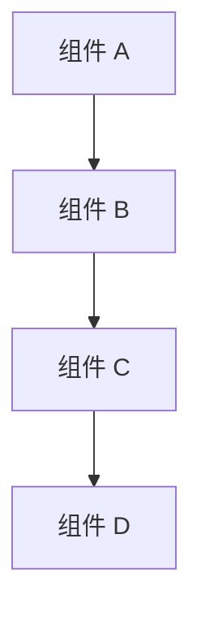
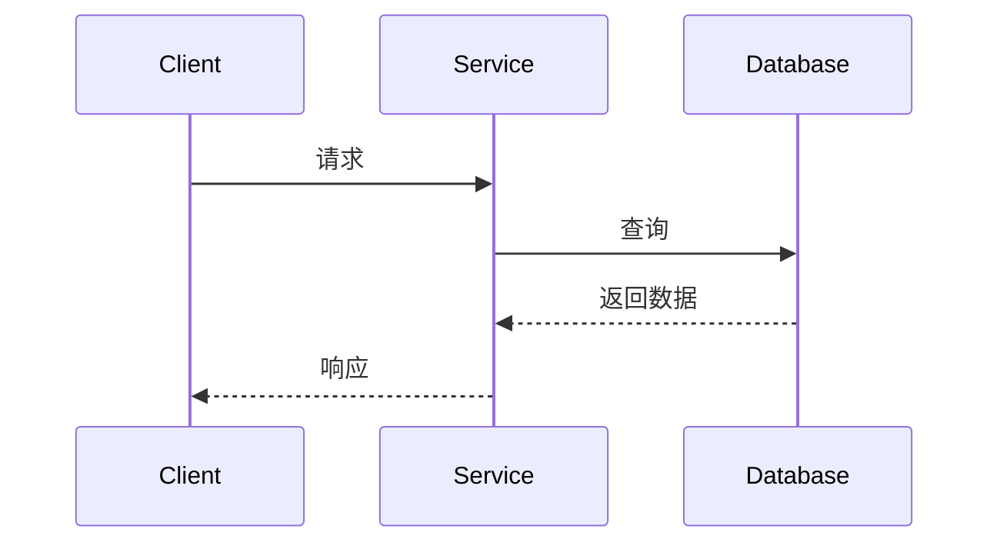
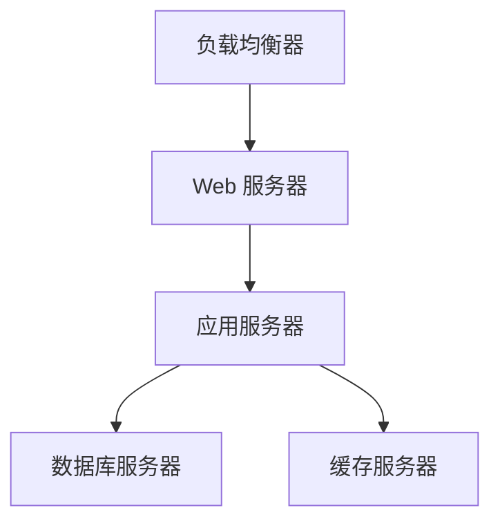

# AlkaidSYS 文档结构优化指南

> **文档版本**：v1.0
> **创建日期**：2025-11-01
> **最后更新**：2025-11-01
> **维护者**：架构团队

---

## 📋 目录

- [1. 文档知识库架构](#1-文档知识库架构)
- [2. 交叉引用体系](#2-交叉引用体系)
- [3. 版本号管理](#3-版本号管理)
- [4. 文档模板](#4-文档模板)
- [5. 文档导航](#5-文档导航)

---

## 1. 文档知识库架构

### 1.1 目录结构

```
docs/
├── README.md                              # 文档首页
├── navigation.md                          # 全局导航
├── 00-overview/                           # 总览文档
│   ├── README.md                          # 总览索引
│   ├── project-introduction.md            # 项目介绍
│   ├── architecture-overview.md           # 架构概览
│   ├── roadmap.md                         # 路线图
│   └── contributing-guide.md              # 贡献指南
│
├── 01-architecture/                       # 架构设计
│   ├── README.md                          # 架构索引
│   ├── overview.md                        # 整体架构
│   ├── multi-tenant.md                    # 多租户架构
│   ├── plugin-system.md                   # 插件系统
│   ├── data-layer.md                      # 数据层设计
│   ├── api-design.md                      # API 架构
│   └── security-architecture.md           # 安全架构
│
├── 02-technology/                         # 技术栈
│   ├── README.md                          # 技术栈索引
│   ├── frontend.md                        # 前端技术
│   ├── backend.md                         # 后端技术
│   ├── database.md                        # 数据库技术
│   ├── caching.md                         # 缓存技术
│   └── message-queue.md                   # 消息队列
│
├── 03-implementation/                     # 实现细节
│   ├── README.md                          # 实现索引
│   ├── application-system.md              # 应用系统
│   ├── plugin-development.md              # 插件开发
│   ├── lowcode-framework.md               # 低代码框架
│   ├── workflow-engine.md                 # 工作流引擎
│   └── third-party-integration.md         # 第三方集成
│
├── 04-development/                        # 开发指南
│   ├── README.md                          # 开发索引
│   ├── coding-standards.md                # 编码规范
│   ├── git-workflow.md                    # Git 工作流
│   ├── testing-guide.md                   # 测试指南
│   ├── debugging-guide.md                 # 调试指南
│   └── deployment-guide.md                # 部署指南
│
├── 05-operations/                         # 运维指南
│   ├── README.md                          # 运维索引
│   ├── installation-guide.md              # 安装指南
│   ├── configuration-guide.md             # 配置指南
│   ├── monitoring.md                      # 监控指南
│   ├── troubleshooting.md                 # 故障排查
│   └── performance-tuning.md              # 性能调优
│
├── 06-security/                           # 安全指南
│   ├── README.md                          # 安全索引
│   ├── authentication.md                  # 身份认证
│   ├── authorization.md                   # 权限控制
│   ├── data-protection.md                 # 数据保护
│   ├── security-best-practices.md         # 安全最佳实践
│   └── compliance.md                      # 合规性
│
├── 07-api/                                # API 文档
│   ├── README.md                          # API 索引
│   ├── overview.md                        # API 概览
│   ├── authentication.md                  # API 认证
│   ├── endpoints/                         # 端点文档
│   │   ├── auth.md                        # 认证接口
│   │   ├── user.md                        # 用户接口
│   │   └── application.md                 # 应用接口
│   └── examples/                          # 示例代码
│       ├── curl-examples.md               # cURL 示例
│       └── js-examples.md                 # JavaScript 示例
│
├── 08-components/                         # 组件文档
│   ├── README.md                          # 组件索引
│   ├── overview.md                        # 组件概览
│   ├── ui-components.md                   # UI 组件
│   ├── form-components.md                 # 表单组件
│   ├── chart-components.md                # 图表组件
│   └── custom-components.md               # 自定义组件
│
├── 09-integrations/                       # 集成指南
│   ├── README.md                          # 集成索引
│   ├── payment-gateways.md                # 支付网关
│   ├── sms-services.md                    # 短信服务
│   ├── cloud-storage.md                   # 云存储
│   └── analytics.md                       # 分析服务
│
└── 10-changelog/                          # 变更日志
    ├── README.md                          # 变更日志索引
    ├── v1.0.0.md                          # v1.0.0 版本
    ├── v1.1.0.md                          # v1.1.0 版本
    └── migration-guides/                   # 迁移指南
        ├── v1.0-to-v1.1.md                # v1.0 到 v1.1
        └── breaking-changes.md             # 破坏性变更
```

### 1.2 文档索引文件

```markdown
# 文档目录

## 快速导航

### 🔗 核心文档
- [项目介绍](00-overview/project-introduction.md)
- [架构概览](01-architecture/overview.md)
- [开发指南](04-development/coding-standards.md)

### 📚 技术栈
- [前端技术](02-technology/frontend.md)
- [后端技术](02-technology/backend.md)
- [数据库技术](02-technology/database.md)

### 🛠️ 实现指南
- [应用系统](03-implementation/application-system.md)
- [插件开发](03-implementation/plugin-development.md)
- [低代码框架](03-implementation/lowcode-framework.md)

### 🔐 安全指南
- [身份认证](06-security/authentication.md)
- [权限控制](06-security/authorization.md)
- [安全最佳实践](06-security/security-best-practices.md)

### 📊 API 文档
- [API 概览](07-api/overview.md)
- [认证接口](07-api/endpoints/auth.md)
- [用户接口](07-api/endpoints/user.md)

---

## 文档统计

- 总文档数：50+ 篇
- 最后更新：2025-11-01
- 下次更新：2025-12-01

---

## 贡献指南

欢迎贡献文档！请阅读 [贡献指南](00-overview/contributing-guide.md) 了解如何参与。
```

---

## 2. 交叉引用体系

### 2.1 链接命名规范

```markdown
# 链接类型示例

## 1. 内部文档链接
[架构概览](01-architecture/overview.md)
[插件开发指南](03-implementation/plugin-development.md)

## 2. 锚点链接
[查看架构设计](01-architecture/overview.md#架构设计)
[了解多租户](01-architecture/multi-tenant.md#多租户模式)

## 3. 交叉引用链接
[多租户架构设计](01-architecture/multi-tenant.md) 与 [插件系统](01-architecture/plugin-system.md) 紧密相关。

[前端技术栈](02-technology/frontend.md#技术选型) 中使用了 [Vue 3](https://vuejs.org/) 框架。

## 4. 相对路径链接
请参考上级文档：[项目介绍](../00-overview/project-introduction.md)

## 5. 相关文档
**相关文档**：
- [API 设计规范](01-architecture/api-design.md)
- [数据层设计](01-architecture/data-layer.md)

**后续文档**：
- [插件开发](03-implementation/plugin-development.md)
- [低代码框架](03-implementation/lowcode-framework.md)
```

### 2.2 文档链接检查工具

```javascript
// tools/doc-link-checker.js
const fs = require('fs');
const path = require('path');
const matter = require('gray-matter');

// 提取 Markdown 文件中的所有链接
function extractLinks(content) {
  const linkRegex = /\[([^\]]+)\]\(([^)]+)\)/g;
  const links = [];
  let match;

  while ((match = linkRegex.exec(content)) !== null) {
    links.push({
      text: match[1],
      url: match[2],
      line: content.substring(0, match.index).split('\n').length,
    });
  }

  return links;
}

// 检查链接是否存在
function checkLinkExists(linkUrl, currentFile, allFiles) {
  // 跳过外部链接
  if (linkUrl.startsWith('http') || linkUrl.startsWith('#')) {
    return true;
  }

  // 处理锚点
  const [urlPath, anchor] = linkUrl.split('#');

  // 如果是相对路径，转换为绝对路径
  let absolutePath;
  if (urlPath.startsWith('/')) {
    absolutePath = urlPath;
  } else {
    absolutePath = path.join(path.dirname(currentFile), urlPath);
  }

  // 检查文件是否存在
  if (!fs.existsSync(absolutePath)) {
    return false;
  }

  return true;
}

// 验证所有文档链接
function validateLinks() {
  const docsDir = './docs';
  const errors = [];

  // 遍历所有 Markdown 文件
  const walkDir = (dir) => {
    const files = fs.readdirSync(dir);

    files.forEach((file) => {
      const filePath = path.join(dir, file);
      const stat = fs.statSync(filePath);

      if (stat.isDirectory()) {
        walkDir(filePath);
      } else if (file.endsWith('.md')) {
        const content = fs.readFileSync(filePath, 'utf-8');
        const links = extractLinks(content);

        links.forEach((link) => {
          if (!checkLinkExists(link.url, filePath, [])) {
            errors.push({
              file: filePath,
              line: link.line,
              text: link.text,
              url: link.url,
            });
          }
        });
      }
    });
  };

  walkDir(docsDir);

  if (errors.length > 0) {
    console.error('发现以下链接错误：');
    errors.forEach((error) => {
      console.error(`- ${error.file}:${error.line}`);
      console.error(`  链接：${error.text} (${error.url})`);
    });
    process.exit(1);
  } else {
    console.log('所有链接验证通过！');
  }
}

validateLinks();
```

---

## 3. 版本号管理

### 3.1 版本号规范

```
语义化版本 (SemVer)：MAJOR.MINOR.PATCH

MAJOR：不兼容的 API 变更
MINOR：向后兼容的功能性新增
PATCH：向后兼容的问题修正

示例：
v1.0.0 - 初始版本
v1.1.0 - 新增多租户支持（向后兼容）
v1.1.1 - 修复多租户数据隔离问题
v2.0.0 - 重大重构，不向后兼容
```

### 3.2 版本历史记录

```markdown
# docs/10-changelog/README.md

# 变更日志

本文档记录了 AlkaidSYS 系统的所有版本变更。

## 版本命名规则

- **主版本号** (Major)：不兼容的 API 变更
- **次版本号** (Minor)：向后兼容的功能新增
- **修订号** (Patch)：向后兼容的问题修正

## 版本列表

### v1.0.0 (2025-01-19)
- 初始版本发布
- 核心框架完成
- [查看详情](v1.0.0.md)

### v1.1.0 (2025-02-20)
- 新增多租户支持
- 优化插件系统
- [查看详情](v1.1.0.md)

### v1.2.0 (2025-03-25)
- 新增低代码框架
- 改进 API 设计
- [查看详情](v1.2.0.md)

## 迁移指南

- [v1.0 → v1.1](migration-guides/v1.0-to-v1.1.md)
- [v1.1 → v1.2](migration-guides/v1.1-to-v1.2.md)

---

## 提交变更日志

每次发布新版本时，请：

1. 在对应版本文件中记录变更
2. 创建迁移指南（如果需要）
3. 更新此索引文件
4. 更新所有相关文档中的版本信息

### 变更类型

- **新增** (Added)：新功能
- **变更** (Changed)：现有功能变更
- **废弃** (Deprecated)：即将移除功能
- **移除** (Removed)：移除功能
- **修复** (Fixed)：bug 修复
- **安全** (Security)：安全漏洞修复
```

### 3.3 版本更新脚本

```javascript
// tools/version-updater.js
const fs = require('fs');
const path = require('path');

// 更新文档中的版本信息
function updateVersionInDocs(newVersion) {
  const version = newVersion.replace('v', '');

  // 要更新的文件列表
  const filesToUpdate = [
    'README.md',
    'docs/00-overview/project-introduction.md',
    'docs/01-architecture/overview.md',
    'docs/02-technology/frontend.md',
  ];

  filesToUpdate.forEach((file) => {
    if (fs.existsSync(file)) {
      let content = fs.readFileSync(file, 'utf-8');

      // 替换版本信息
      content = content.replace(
        /version:\s*v?\d+\.\d+\.\d+/gi,
        `version: v${version}`
      );

      fs.writeFileSync(file, content);
      console.log(`已更新：${file}`);
    }
  });
}

// 创建新版本文档
function createVersionDocs(newVersion) {
  const versionDir = path.join('docs/10-changelog', newVersion);

  if (!fs.existsSync(versionDir)) {
    fs.mkdirSync(versionDir, { recursive: true });
  }

  // 创建版本变更日志
  const changelogPath = path.join(versionDir, `${newVersion}.md`);
  const changelogContent = `# ${newVersion}

> 发布日期：${new Date().toISOString().split('T')[0]}

## 新增功能

## 变更

## 修复

## 安全

## 迁移指南

---

**文档版本**：${newVersion}
**维护者**：AlkaidSYS 架构团队
`;

  fs.writeFileSync(changelogPath, changelogContent);
  console.log(`已创建：${changelogPath}`);
}

// 更新导航中的版本信息
function updateNavigation(newVersion) {
  const navPath = 'docs/navigation.md';

  if (fs.existsSync(navPath)) {
    let content = fs.readFileSync(navPath, 'utf-8');

    // 更新当前版本
    content = content.replace(
      /当前版本：v?\d+\.\d+\.\d+/gi,
      `当前版本：${newVersion}`
    );

    fs.writeFileSync(navPath, content);
    console.log(`已更新导航：${navPath}`);
  }
}

module.exports = {
  updateVersionInDocs,
  createVersionDocs,
  updateNavigation,
};
```

---

## 4. 文档模板

### 4.1 通用文档模板

```markdown
# 文档标题

> **文档版本**：v1.0
> **创建日期**：YYYY-MM-DD
> **最后更新**：YYYY-MM-DD
> **维护者**：维护团队

---

## 📋 目录

- [1. 概述](#1-概述)
- [2. 详细说明](#2-详细说明)
- [3. 示例代码](#3-示例代码)
- [4. 最佳实践](#4-最佳实践)
- [5. 注意事项](#5-注意事项)
- [6. 相关文档](#6-相关文档)

---

## 1. 概述

简要描述文档的目的、范围和读者。

### 1.1 目的
说明文档要解决什么问题。

### 1.2 范围
说明文档涵盖哪些内容。

### 1.3 读者
说明文档的目标读者。

---

## 2. 详细说明

详细描述相关内容。

### 2.1 子标题
具体内容。

---

## 3. 示例代码

```typescript
// 代码示例
const example = 'Hello World';
```

---

## 4. 最佳实践

列出相关最佳实践。

---

## 5. 注意事项

重要提醒和注意事项。

---

## 6. 相关文档

**相关文档**：
- [文档 A](path/to/doc-a.md)
- [文档 B](path/to/doc-b.md)

**后续文档**：
- [文档 C](path/to/doc-c.md)

---

## 📝 检查清单

### 内容检查
- [ ] 内容完整准确
- [ ] 示例代码可运行
- [ ] 链接有效
- [ ] 格式统一

### 代码检查
- [ ] 符合编码规范
- [ ] 类型定义完整
- [ ] 注释清晰
- [ ] 测试覆盖

---

**最后更新**：YYYY-MM-DD
**文档版本**：v1.0
**维护者**：维护团队
```

### 4.2 API 文档模板

```markdown
# API 接口文档

> **文档版本**：v1.0
> **基础 URL**：`https://api.alkaidsys.com/v1`
> **认证方式**：Bearer Token

---

## 概述

### 认证

所有 API 请求都需要在请求头中包含认证令牌：

```http
Authorization: Bearer {token}
```

### 响应格式

所有 API 响应都遵循统一格式：

```json
{
  "code": 200,
  "message": "success",
  "data": {},
  "timestamp": 1698825600
}
```

### 状态码

| 状态码 | 说明 |
|--------|------|
| 200 | 请求成功 |
| 400 | 请求参数错误 |
| 401 | 未授权 |
| 403 | 禁止访问 |
| 404 | 资源不存在 |
| 500 | 服务器错误 |

---

## 用户接口

### 获取用户列表

获取当前用户可访问的用户列表。

**请求**

```http
GET /users
```

**参数**

| 参数 | 类型 | 必填 | 说明 |
|------|------|------|------|
| page | integer | 否 | 页码，默认 1 |
| pageSize | integer | 否 | 每页数量，默认 20 |
| keyword | string | 否 | 搜索关键词 |

**响应**

```json
{
  "code": 200,
  "message": "success",
  "data": {
    "list": [
      {
        "id": 1,
        "name": "张三",
        "email": "zhangsan@example.com",
        "createdAt": "2025-01-01T00:00:00Z"
      }
    ],
    "total": 100,
    "page": 1,
    "pageSize": 20
  }
}
```

**示例**

```bash
curl -X GET "https://api.alkaidsys.com/v1/users?page=1&pageSize=20" \
  -H "Authorization: Bearer {token}"
```

---

### 创建用户

创建新用户。

**请求**

```http
POST /users
```

**请求体**

```json
{
  "name": "李四",
  "email": "lisi@example.com",
  "password": "password123",
  "roleId": 1
}
```

**参数**

| 参数 | 类型 | 必填 | 说明 |
|------|------|------|------|
| name | string | 是 | 用户姓名 |
| email | string | 是 | 邮箱地址 |
| password | string | 是 | 密码 |
| roleId | integer | 否 | 角色 ID |

**响应**

```json
{
  "code": 201,
  "message": "success",
  "data": {
    "id": 2,
    "name": "李四",
    "email": "lisi@example.com",
    "createdAt": "2025-01-01T00:00:00Z"
  }
}
```

**示例**

```bash
curl -X POST "https://api.alkaidsys.com/v1/users" \
  -H "Content-Type: application/json" \
  -H "Authorization: Bearer {token}" \
  -d '{
    "name": "李四",
    "email": "lisi@example.com",
    "password": "password123",
    "roleId": 1
  }'
```

---

## 错误码

| 错误码 | 说明 |
|--------|------|
| 1001 | 用户不存在 |
| 1002 | 邮箱已存在 |
| 1003 | 密码错误 |
| 2001 | 权限不足 |

---

## 限制

- 请求频率限制：1000 请求/小时
- 请求体大小限制：10MB

---

**基础 URL**：`https://api.alkaidsys.com/v1`
**文档版本**：v1.0
**最后更新**：YYYY-MM-DD
```

### 4.3 架构文档模板

```markdown
# 架构设计文档

> **文档版本**：v1.0
> **创建日期**：YYYY-MM-DD
> **最后更新**：YYYY-MM-DD
> **维护者**：架构团队

---

## 📋 文档信息

| 项目 | 内容 |
|------|------|
| **文档名称** | 文档标题 |
| **版本** | v1.0 |
| **创建日期** | YYYY-MM-DD |
| **维护团队** | 架构团队 |

---

## 🎯 设计目标

### 核心目标
1. 目标一
2. 目标二
3. 目标三

### 设计原则
- 原则一
- 原则二
- 原则三

---

## 🏗️ 架构设计

### 1. 整体架构图



### 2. 分层设计

```
┌────────────────────────┐
│        展示层            │
├────────────────────────┤
│        业务层            │
├────────────────────────┤
│        数据层            │
├────────────────────────┤
│        基础设施层          │
└────────────────────────┘
```

### 3. 核心组件

#### 3.1 组件 A
- **功能**：描述
- **输入**：
- **输出**：

#### 3.2 组件 B
- **功能**：描述
- **输入**：
- **输出**：

---

## 📊 数据流设计

### 数据流程



---

## 🔄 生命周期

### 组件生命周期
1. 初始化
2. 运行
3. 停止
4. 销毁

---

## 🔐 安全设计

### 安全措施
1. 措施一
2. 措施二
3. 措施三

---

## 🚀 性能优化

### 优化策略
1. 缓存策略
2. 数据库优化
3. 异步处理

---

## 🔧 部署架构

### 部署拓扑



---

## 📈 扩展性设计

### 水平扩展
- 支持负载均衡
- 支持集群部署

### 垂直扩展
- 支持资源动态调整

---

## 🛠️ 实现细节

### 代码结构

```
src/
├── components/
│   ├── ComponentA.ts
│   └── ComponentB.ts
├── services/
│   └── ServiceA.ts
└── utils/
    └── UtilityA.ts
```

### 关键代码

```typescript
// 示例代码
interface Example {
  id: number;
  name: string;
}

const example: Example = {
  id: 1,
  name: '示例',
};
```

---

## 🧪 测试策略

### 单元测试
- 测试覆盖率 > 80%

### 集成测试
- API 测试
- 端到端测试

---

## 📊 监控与运维

### 监控指标
- CPU 使用率
- 内存使用率
- 响应时间
- 错误率

### 日志策略
- 结构化日志
- 日志分级
- 日志聚合

---

## ⚠️ 注意事项

### 限制
- 限制一
- 限制二

### 兼容性
- 浏览器兼容性
- 数据库版本兼容性

---

## 🔗 相关文档

**架构文档**：
- [文档 A](path/to/doc-a.md)
- [文档 B](path/to/doc-b.md)

**设计文档**：
- [文档 C](path/to/doc-c.md)

**实现文档**：
- [文档 D](path/to/doc-d.md)

---

## 📝 变更记录

| 日期 | 版本 | 变更内容 | 作者 |
|------|------|---------|------|
| YYYY-MM-DD | v1.0 | 初始版本 | 作者 |

---

**最后更新**：YYYY-MM-DD
**文档版本**：v1.0
**维护者**：架构团队
```

---

## 5. 文档导航

### 5.1 全局导航文件

```markdown
# docs/navigation.md

# 文档导航

## 📚 文档分类

### 00. 总览
- [项目介绍](00-overview/project-introduction.md)
- [架构概览](01-architecture/overview.md)
- [路线图](00-overview/roadmap.md)
- [贡献指南](00-overview/contributing-guide.md)

### 01. 架构设计
- [整体架构](01-architecture/overview.md)
- [多租户架构](01-architecture/multi-tenant.md)
- [插件系统](01-architecture/plugin-system.md)
- [数据层设计](01-architecture/data-layer.md)
- [API 架构](01-architecture/api-design.md)
- [安全架构](01-architecture/security-architecture.md)

### 02. 技术栈
- [前端技术](02-technology/frontend.md)
- [后端技术](02-technology/backend.md)
- [数据库技术](02-technology/database.md)
- [缓存技术](02-technology/caching.md)
- [消息队列](02-technology/message-queue.md)

### 03. 实现细节
- [应用系统](03-implementation/application-system.md)
- [插件开发](03-implementation/plugin-development.md)
- [低代码框架](03-implementation/lowcode-framework.md)
- [工作流引擎](03-implementation/workflow-engine.md)
- [第三方集成](03-implementation/third-party-integration.md)

### 04. 开发指南
- [编码规范](04-development/coding-standards.md)
- [Git 工作流](04-development/git-workflow.md)
- [测试指南](04-development/testing-guide.md)
- [调试指南](04-development/debugging-guide.md)
- [部署指南](04-development/deployment-guide.md)

### 05. 运维指南
- [安装指南](05-operations/installation-guide.md)
- [配置指南](05-operations/configuration-guide.md)
- [监控指南](05-operations/monitoring.md)
- [故障排查](05-operations/troubleshooting.md)
- [性能调优](05-operations/performance-tuning.md)

### 06. 安全指南
- [身份认证](06-security/authentication.md)
- [权限控制](06-security/authorization.md)
- [数据保护](06-security/data-protection.md)
- [安全最佳实践](06-security/security-best-practices.md)
- [合规性](06-security/compliance.md)

### 07. API 文档
- [API 概览](07-api/overview.md)
- [API 认证](07-api/authentication.md)
- [认证接口](07-api/endpoints/auth.md)
- [用户接口](07-api/endpoints/user.md)
- [应用接口](07-api/endpoints/application.md)

### 08. 组件文档
- [组件概览](08-components/overview.md)
- [UI 组件](08-components/ui-components.md)
- [表单组件](08-components/form-components.md)
- [图表组件](08-components/chart-components.md)
- [自定义组件](08-components/custom-components.md)

### 09. 集成指南
- [支付网关](09-integrations/payment-gateways.md)
- [短信服务](09-integrations/sms-services.md)
- [云存储](09-integrations/cloud-storage.md)
- [分析服务](09-integrations/analytics.md)

### 10. 变更日志
- [变更日志索引](10-changelog/README.md)
- [v1.0.0](10-changelog/v1.0.0.md)
- [v1.1.0](10-changelog/v1.1.0.md)
- [v1.2.0](10-changelog/v1.2.0.md)
- [迁移指南](10-changelog/migration-guides/)

---

## 🔍 快速搜索

### 搜索技巧

1. **标题搜索**：使用 `#` 搜索文档标题
2. **内容搜索**：使用全文搜索
3. **标签搜索**：使用 `tag:标签名` 搜索特定标签

### 搜索示例

- `Vue 3` - 搜索 Vue 3 相关文档
- `#架构` - 搜索架构相关文档
- `tag:安全` - 搜索安全相关文档

---

## 📊 文档统计

| 分类 | 文档数 | 最近更新 |
|------|--------|----------|
| 总览 | 4 | 2025-11-01 |
| 架构 | 6 | 2025-11-01 |
| 技术栈 | 5 | 2025-11-01 |
| 实现 | 5 | 2025-11-01 |
| 开发 | 5 | 2025-11-01 |
| 运维 | 5 | 2025-11-01 |
| 安全 | 5 | 2025-11-01 |
| API | 5 | 2025-11-01 |
| 组件 | 5 | 2025-11-01 |
| 集成 | 4 | 2025-11-01 |
| 变更 | 5 | 2025-11-01 |
| **总计** | **54** | **2025-11-01** |

---

## 🔗 外部链接

- [Vue 3 官方文档](https://vuejs.org/)
- [Ant Design Vue](https://antdv.com/)
- [TypeScript](https://www.typescriptlang.org/)
- [ThinkPHP 官网](https://www.thinkphp.cn/)

---

**最后更新**：2025-11-01
**维护者**：AlkaidSYS 文档团队
```

---

## 📝 实施检查清单

### 文档结构检查
- [ ] 所有文档都有统一的目录结构
- [ ] 所有索引文件都已创建
- [ ] 所有文档都遵循统一的命名规范
- [ ] 所有文档都有正确的文件扩展名

### 链接检查
- [ ] 所有内部链接都已验证
- [ ] 所有外部链接都是有效的
- [ ] 交叉引用关系清晰
- [ ] 锚点链接正确

### 版本管理检查
- [ ] 版本号遵循语义化规范
- [ ] 所有文档中的版本信息已更新
- [ ] 变更日志完整记录
- [ ] 迁移指南已创建

### 模板检查
- [ ] 所有文档类型都有对应的模板
- [ ] 模板内容完整准确
- [ ] 模板格式统一
- [ ] 模板易于理解和使用

---

**最后更新**：2025-11-01
**文档版本**：v1.0
**维护者**：AlkaidSYS 架构团队
