# AlkaidSYS 开发 Backlog（2025-11-25）

## 元信息

- 生成日期：2025-11-25
- 基准文档：
  - docs/todo/development-backlog-2025-11-23.md
  - docs/todo/低代码 Collection 多租户改造多阶段路线.md
- 审查方法：基于 codebase-retrieval / search_for_pattern / view 交叉验证关键模块（低代码多租户、限流、权限、错误码、分页、CLI、DI 等）
- 主要状态变更摘录（相对于 2025-11-23 backlog）：
  - [DONE] 验证错误码统一（4001→422）：ExceptionHandle::render 已将 ValidateException 映射为 HTTP 422 + code=422
  - [DONE] 分页结构统一：ApiController::paginate 返回 { list, total, page, page_size, total_pages }
  - [PARTIAL] 低代码 Collection 多租户 P0：Form/Request 多租户已落地，但 CollectionManager / FormDataManager / Controller 签名未统一
  - [NOT_STARTED] Casbin 授权引擎、Workflow 引擎、插件系统、CLI 工具、DI 增强仍无实现代码
  - [NEW] 从 2025-11-23 backlog 补齐了应用系统、BaseModel 作用域优化、API 签名中间件、技术栈与配置修正、文档/部署/监控/i18n 等中长期任务（自 T-036 起编号）

## 任务分组与列表

> 说明：任务 ID 全局唯一（T-xxx），优先级 P0/P1/P2，状态取值：NOT_STARTED / PARTIAL / DONE。deps 为强依赖。

### 组 A：低代码 & 多租户

- [T-001] (P0, 状态: DONE) 低代码 Collection 接口多租户 P0（Controller/Service/Repository 签名统一，禁止从 body 读取 tenant_id，统一使用 Request::tenantId，已完成 Feature Test）
  - 代码证据：CollectionManager::get/delete 已引入 tenantId 参数；CollectionController::index/read/update/delete 统一从 Request::tenantId 获取租户上下文且忽略请求体中的 tenant_id；FormDataManager 调用 CollectionManager::get 时透传 tenantId
  - deps: （无）；被依赖: T-002, T-003, T-020
- [T-002] (P1, 状态: DONE) lowcode_collections 表租户化 + Repository 多租户过滤（为表新增 tenant_id/site_id 字段及唯一索引，Repository 全部查询按 tenant_id 过滤）
  - 已完成内容：
    - 已执行迁移脚本：`20251125000001_add_tenant_site_to_lowcode_collections_table.php`，为 `lowcode_collections` 增加 `tenant_id`/`site_id` 字段并创建唯一索引 `uk_tenant_name(tenant_id, name)`
    - 已改造核心文件：`infrastructure/Lowcode/Collection/Repository/CollectionRepository.php`、`infrastructure/Lowcode/Collection/Service/CollectionManager.php`
    - 数据迁移策略：采用策略 A，将历史数据全部标记为 `tenant_id=0, site_id=0` 作为系统模板空间
    - 缓存升级：CollectionManager 从全局 key `lowcode:collection:{name}` 升级为租户维度 key `lowcode:collection:{tenantId}:{name}`
    - 测试覆盖：新增 Repository/Manager 层多租户单元测试，并通过与 T-001 P0 相关 Feature/Unit Test 的兼容性回归
  - deps: T-001
- [T-003] (P2, 状态: NOT_STARTED) 动态业务数据表多租户隔离（由 Collection 驱动的业务表 schema 与访问路径必须包含 tenant_id/site_id 并做隔离校验）
  - 代码证据：FormDataManager 已按 tenant/site 选取 schema，但 Collection 元数据与二级表结构尚未多租户化
  - deps: T-002
- [T-004] (P1, 状态: NOT_STARTED) 前端多租户上下文管理与请求头集成（统一 Tenant Store，自动注入 X-Tenant-ID/X-Site-ID 请求头）
  - 代码证据：frontend/** 中未发现 X-Tenant-ID 或 useTenantStore 等实现，当前仅后端测试手动设置该头部
  - deps: T-001

### 组 B：授权 & 权限 & 安全

- [T-010] (P0, 状态: DONE) 权限基线集成（后端 PermissionService + /v1/auth/me & /v1/auth/codes；前端基于 resource:action 的权限数组接入 Vben Access）
  - 代码证据：见 2025-11-23 backlog 中的提交记录与测试说明，本轮未发现与之冲突的变更
  - deps: （无）；被依赖: T-011, T-012
- [T-011] (P0, 状态: NOT_STARTED) Casbin 授权引擎接入（基于现有权限模型的策略存储与决策引擎、路由中间件集成）
  - 代码证据：composer.json 中无 casbin 相关依赖，代码中未检索到 casbin / php-casbin / Enforcer 等实现
  - deps: T-010, T-033
- [T-012] (P1, 状态: NOT_STARTED) 权限相关测试与迁移补齐（角色/权限表迁移、策略变更回滚策略、关键路径 Feature Test）
  - 代码证据：当前测试覆盖主要集中在认证与基础权限校验，未见 Casbin 或高级策略相关测试
  - deps: T-010, T-011, T-032
- [T-044] (P2, 状态: NOT_STARTED) 权限集成后续优化（异常信息收敛、AuthController DI、测试命令规范、PSR-12 统一）
  - 代码证据：docs/todo/development-backlog-2025-11-23.md §404-443 中列出的 4 条“后端权限集成后续优化项”目前仍以文档形式存在，代码与 backlog 中均未单独跟踪
  - deps: T-010, T-032

### 组 C：限流 & 网关 & 可观测性

- [T-020] (P0, 状态: NOT_STARTED) Redis Token Bucket 限流中间件（替换/补充现有固定时间窗口算法，支持租户/用户/路由多维度令牌桶）
  - 代码证据：app/middleware/RateLimit 目前实现为固定窗口计数 + 过期时间，未发现 Token Bucket 算法或对应测试
  - deps: T-001, T-021
- [T-021] (P1, 状态: PARTIAL) Nginx 网关接入与路由治理（统一接入层、透传 X-Tenant-ID / X-Trace-Id 等头部，分环境配置与熔断限流策略）
  - 代码证据：deploy/nginx/alkaid.api.conf 已包含基础 CORS 与租户相关头部配置，但尚无 stage/prod 接入与策略验证代码
  - deps: （无）；被依赖: T-020, T-022
- [T-022] (P1, 状态: PARTIAL) Trace ID & 日志可观测性收尾（确保所有 API 响应都带 trace_id，关键路径记录租户/用户/trace 上下文）
  - 代码证据：ApiController::success/error 已统一注入 trace_id；ExceptionHandle::render 也支持 trace_id，但仍需针对所有控制器与中间件做覆盖率检查
  - deps: （无）；被依赖: T-021
- [T-041] (P2, 状态: NOT_STARTED) 可观测性与运维监控能力增强（认证/权限失败、慢查询、缓存命中率与性能指标）
  - 代码证据：docs/todo/development-backlog-2025-11-23.md 中“[P2] 可观测性与运维监控能力增强”条目标记为未完成，代码中尚未见统一的指标采集与告警配置
  - deps: T-021, T-022

### 组 D：基础设施 & 工具 & 规范

- [T-030] (P1, 状态: NOT_STARTED) CLI 工具体系（基于 think console 的 alkaid:* 命令族，用于迁移/低代码运维/调试）
  - 代码证据：config/console.php 仅注册了 test:* 系列命令，未见生产级 CLI 命令
  - deps: T-032
- [T-031] (P1, 状态: NOT_STARTED) DI 容器增强（插件与模块化服务的自动注册、依赖注入与生命周期管理）
  - 代码证据：Infrastructure\\DI\\DependencyManager 目前仅提供手动 registerProvider(s) 包装，未见自动发现或更高级 DI 功能
  - deps: （无）；被依赖: T-034, T-035
- [T-032] (P1, 状态: PARTIAL) 测试与迁移体系补齐（关键业务流的 Feature Test、低代码相关迁移的幂等与回滚策略）
  - 代码证据：已存在若干 Feature/Unit Test 与迁移脚本，但与设计文档中“关键路径全覆盖”的目标仍有差距
  - deps: （无）；被依赖: T-012, T-030, T-034, T-035, T-037, T-044, T-046
- [T-033] (P0, 状态: PARTIAL) 技术规范文档重写与收敛（API 规范、错误码矩阵、多租户规范、权限/限流规范等）
  - 代码证据：docs/technical-specs 下已存在若干新版规范文档，但旧规范仍部分存在且与实现存在出入（例如错误码/分页状态已更新而文档未同步）；原 2025-11-23 backlog 将本项归类为 P0“阻塞性问题”
  - deps: （无）；被依赖: T-001, T-011, T-020, T-039, T-040, T-042, T-043
- [T-036] (P1, 状态: NOT_STARTED) 应用系统基础设施（Application System 基类与生命周期）
  - 代码证据：docs/todo/development-backlog-2025-11-23.md 中“[P1] 应用系统基础设施（Application System）”条目标记为 0%；代码中无 BaseApplication/ApplicationManager 实现，也无 addons/apps 应用目录
  - deps: T-031
- [T-037] (P1, 状态: NOT_STARTED) BaseModel 全局作用域性能与 CLI 行为优化
  - 代码证据：app/model/BaseModel.php 第55-95行注册 tenant/site 全局作用域，2025-11-23 backlog 中对应 P1 条目仍为未完成；CLI 环境下全局作用域可能带来性能与行为风险
  - deps: T-001, T-033
- [T-038] (P1, 状态: NOT_STARTED) 关键技术栈与配置修正（PHP/DB/Expression/Swoole 等）
  - 代码证据：composer.json 中 PHP 约束为 >=8.0.0；config/database.php 中 deploy=0；config/swoole.php 连接池配置存在但未启用；与 2025-11-23 backlog“[P1] 关键技术栈与配置修正”描述一致
  - deps: T-033
- [T-039] (P2, 状态: NOT_STARTED) 文档与注释规范统一（含 API 文档与 PHPDoc）
  - 代码证据：docs/todo/development-backlog-2025-11-23.md 中“[P2] 文档与注释规范统一（含 API 文档）”列为未完成，当前 app/controller 与部分 Service/Repository 仍缺少完整 PHPDoc 与一致的注释风格
  - deps: T-033
- [T-040] (P2, 状态: NOT_STARTED) 配置与部署文档 + 环境变量校验完善
  - 代码证据：.env.example 内容不完整，config/*.php 中大量 env() 调用无集中校验；对应 2025-11-23 backlog 中“[P2] 配置与部署文档 + 环境变量校验完善”任务
  - deps: T-033, T-038
- [T-042] (P2, 状态: NOT_STARTED) 代码与架构规范化（魔法数字、DI 使用、格式化）
  - 代码证据：code-review-issues 文档中的 M-008/M-009/M-010 等问题仍存在；app/controller 与若干 Service 中存在硬编码错误码、new 直接实例化与未统一的格式化风格
  - deps: T-031, T-033
- [T-043] (P2, 状态: NOT_STARTED) 路由文档化与自动化校验
  - 代码证据：route/lowcode.php 中路由顺序问题虽已修复，但 2025-11-23 backlog 中“[P2] 路由文档化与自动化校验”仍未落地；当前缺少系统化路由文档与顺序校验脚本
  - deps: T-033
- [T-045] (P3, 状态: NOT_STARTED) 错误消息国际化与多语言支持
  - 代码证据：docs/todo/development-backlog-2025-11-23.md 中“[P3] 错误消息国际化与多语言支持”任务仍为未完成；app/middleware/Auth.php 及部分控制器中仍存在中文/英文硬编码错误提示
  - deps: T-039
- [T-046] (P3, 状态: NOT_STARTED) 测试遗留小问题清理（弃用 API 与 skipped 用例）
  - 代码证据：旧 backlog 中“[P3] 测试遗留小问题清理”指出 tests/Feature/Lowcode/FormApiTest.php 使用 setAccessible 等弃用 API，部分事件测试用例仍通过 markTestSkipped 跳过
  - deps: T-032
- [T-047] (P3, 状态: NOT_STARTED) 代码现代化与局部性能微优化
  - 代码证据：多个 Repository/Service 仍大量使用 PHP 7 风格循环与手写 hydrate，复杂逻辑缺少解释性注释；对应用整体无立即阻塞影响但属于长期技术债（对应 2025-11-23 backlog 中“[P3] 代码现代化与局部性能微优化”）
  - deps: T-042
- [T-034] (P2, 状态: NOT_STARTED) Workflow 引擎（流程建模、节点执行器、状态持久化及与低代码表单的集成）
  - 代码证据：代码库中未发现 WorkflowEngine/NodeModel 等实现，当前仅有设计层面的规划
  - deps: T-031, T-032
- [T-035] (P2, 状态: NOT_STARTED) 插件系统（插件包加载、启停管理、事件钩子机制，与 DependencyManager/CLI 的联动）
  - 代码证据：仅有基础的 DependencyManager，未见完整插件生命周期与管理实现
  - deps: T-031, T-032

## Mermaid 任务关系图（概要版）

```mermaid
flowchart TD
  classDef p0 fill:#ffe5e5,stroke:#ff4d4f,stroke-width:2px;
  classDef p1 fill:#fff7e6,stroke:#faad14,stroke-width:1.5px;
  classDef p2 fill:#e6f4ff,stroke:#1890ff,stroke-width:1.5px;
  classDef p3 fill:#f5f5f5,stroke:#bfbfbf,stroke-width:1px;
  classDef critical stroke:#d40000,stroke-width:3px;

  subgraph G_A[组A 低代码 & 多租户]
    T001[T-001 P0 Collection 多租户接口 P0]
    T002[T-002 P1 lowcode_collections 表租户化]
    T003[T-003 P2 动态表多租户隔离]
    T004[T-004 P1 前端多租户上下文]
  end

  subgraph G_B[组B 授权 & 权限 & 安全]
    T010[T-010 P0 权限基线集成]
    T011[T-011 P0 Casbin 授权引擎]
    T012[T-012 P1 权限测试与迁移]
    T044[T-044 P2 权限集成后续优化]
  end

  subgraph G_C[组C 限流 & 网关 & 可观测性]
    T020[T-020 P0 Token Bucket 限流]
    T021[T-021 P1 Nginx 网关接入]
    T022[T-022 P1 Trace & 日志收尾]
    T041[T-041 P2 可观测性与监控增强]
  end

  subgraph G_D[组D 基础设施 & 工具 & 规范]
    T030[T-030 P1 CLI 工具体系]
    T031[T-031 P1 DI 容器增强]
    T032[T-032 P1 测试 & 迁移体系]
    T033[T-033 P0 技术规范文档重写]
    T036[T-036 P1 应用系统基础设施]
    T037[T-037 P1 BaseModel 作用域优化]
    T038[T-038 P1 技术栈与配置修正]
    T039[T-039 P2 文档与注释规范]
    T040[T-040 P2 配置与部署文档]
    T042[T-042 P2 代码与架构规范化]
    T043[T-043 P2 路由文档与校验]
    T045[T-045 P3 错误消息国际化]
    T046[T-046 P3 测试遗留清理]
    T047[T-047 P3 代码现代化与微优化]
    T034[T-034 P2 Workflow 引擎]
    T035[T-035 P2 插件系统]
  end

  %% 强依赖（实线）
  T001 --> T002 --> T003
  T001 --> T020
  T010 --> T011 --> T012
  T021 --> T020
  T033 --> T011
  T033 --> T020
  T032 --> T034
  T032 --> T035
  T033 --> T039
  T033 --> T040
  T033 --> T042
  T033 --> T043
  T031 --> T036
  T001 --> T037
  T032 --> T037
  T021 --> T041
  T022 --> T041
  T010 --> T044
  T032 --> T044
  T031 --> T044
  T039 --> T045
  T032 --> T046
  T042 --> T047

  %% 弱依赖 / 建议顺序（虚线）
  T004 -.-> T001
  T022 -.-> T021
  T030 -.-> T020
  T031 -.-> T034
  T031 -.-> T035
  T038 -.-> T040
  T039 -.-> T047

  %% 优先级样式
  class T001,T010,T011,T020,T033 p0;
  class T002,T004,T012,T021,T022,T030,T031,T032,T036,T037,T038 p1;
  class T003,T034,T035,T039,T040,T041,T042,T043,T044 p2;
  class T045,T046,T047 p3;

  %% 关键路径（示例：多租户 Collection → TokenBucket → Casbin）
  class T001,T002,T003,T020,T011 critical;
```

