# AlkaidSYS 开发 Backlog（2025-11-25）

## 元信息

- 生成日期：2025-11-25
- 最后审查：2025-11-26（第二轮深度审查）
- 基准文档：
  - docs/todo/development-backlog-2025-11-23.md
  - docs/todo/低代码 Collection 多租户改造多阶段路线.md
  - design/00-core-planning/01-MASTER-IMPLEMENTATION-PLAN.md（五阶段实施路线图）
- 审查方法：基于 codebase-retrieval / search_for_pattern / view / Serena 符号分析 交叉验证关键模块
- 主要状态变更摘录（相对于 2025-11-23 backlog）：
  - [DONE] 验证错误码统一（4001→422）：ExceptionHandle::render 已将 ValidateException 映射为 HTTP 422 + code=422
  - [DONE] 分页结构统一：ApiController::paginate 返回 { list, total, page, page_size, total_pages }
  - [PARTIAL] 低代码 Collection 多租户 P0：Form/Request 多租户已落地，但 CollectionManager / FormDataManager / Controller 签名未统一
  - [NOT_STARTED] Workflow 引擎、插件系统、CLI 工具、DI 增强仍无实现代码
  - [NEW] 从 2025-11-23 backlog 补齐了应用系统、BaseModel 作用域优化、API 签名中间件、技术栈与配置修正、文档/部署/监控/i18n 等中长期任务（自 T-036 起编号）
- 2025-11-26 审查更新：
  - [DONE → 确认] T-004 前端多租户上下文：useTenantStore + X-Tenant-ID 请求头已完整实现
  - [NOT_STARTED → DONE] T-011 Casbin 授权引擎：CasbinService、DatabaseAdapter、配置与测试已完整实现
  - [NOT_STARTED → PARTIAL] T-012 权限测试：已有相当覆盖但策略回滚机制待完善
- 2025-11-26 第二轮深度审查：
  - [NEW] 新增组 E（插件系统混合方案）：对应设计文档阶段5，包含 T-052~T-055
  - [NEW] 新增 T-048~T-051：基础设施增强任务，对应设计文档阶段1
  - [ENHANCED] T-020/T-034/T-035 增加设计文档引用
  - [STRUCTURE] 增加 Phase 1/Phase 2 能力区分说明
  - [NEW] 基于 code-review-report-2025-11-26.md 第 4/5/6 节新增 T-056~T-064 等组 D 基础设施待办，用于统一测试入口、CI gate、路由/i18n 校验与现代化规范文档化

## 阶段与能力区分

> **Phase 1（当前能力）**：已实现或正在进行的功能，对应组 A/B/C 的核心任务
> **Phase 2（目标能力）**：规划中的高级功能，对应 Workflow 引擎、插件系统混合方案等
> 参考 `.augment/rules/always-alkaidsys-project-rules.md` 中的 Phase 区分要求

## 任务分组与列表

> **状态图例**：✅ 已完成 | 🔄 进行中 | ⬜ 未开始 | ❌ 已取消
>
> **优先级**：P0 = 阻塞性 | P1 = 高优先 | P2 = 中优先 | P3 = 低优先

---

### 组 A：低代码 & 多租户

✅ **[T-001] (P0) 低代码 Collection 接口多租户 P0**
- **描述**：Controller/Service/Repository 签名统一，禁止从 body 读取 tenant_id，统一使用 Request::tenantId，已完成 Feature Test
- **代码证据**：
  - CollectionManager::get/delete 已引入 tenantId 参数
  - CollectionController::index/read/update/delete 统一从 Request::tenantId 获取租户上下文且忽略请求体中的 tenant_id
  - FormDataManager 调用 CollectionManager::get 时透传 tenantId
- **依赖**：无
- **被依赖**：T-002, T-003, T-020

✅ **[T-002] (P1) lowcode_collections 表租户化 + Repository 多租户过滤**
- **描述**：为表新增 tenant_id/site_id 字段及唯一索引，Repository 全部查询按 tenant_id 过滤
- **已完成**：
  - 已执行迁移脚本：`20251125000001_add_tenant_site_to_lowcode_collections_table.php`，为 `lowcode_collections` 增加 `tenant_id`/`site_id` 字段并创建唯一索引 `uk_tenant_name(tenant_id, name)`
  - 已改造核心文件：`infrastructure/Lowcode/Collection/Repository/CollectionRepository.php`、`infrastructure/Lowcode/Collection/Service/CollectionManager.php`
  - 数据迁移策略：采用策略 A，将历史数据全部标记为 `tenant_id=0, site_id=0` 作为系统模板空间
  - 缓存升级：CollectionManager 从全局 key `lowcode:collection:{name}` 升级为租户维度 key `lowcode:collection:{tenantId}:{name}`
  - 测试覆盖：新增 Repository/Manager 层多租户单元测试，并通过与 T-001 P0 相关 Feature/Unit Test 的兼容性回归
- **依赖**：T-001

✅ **[T-003] (P2) 动态业务数据表多租户隔离**
- **描述**：由 Collection 驱动的业务表 schema 与访问路径必须包含 tenant_id/site_id 并做隔离校验
- **完成时间**：2025-11-25（Phase C 完成）
- **已完成**：
  - Phase A：动态表/访问路径现状审计与模型梳理（docs/report/t003-dynamic-table-tenant-audit.md）
  - Phase B：动态表 schema 多租户化（CollectionManager::buildColumns/buildIndexes 新增 tenant_id/site_id + idx_tenant_id_id；迁移 20251125001000_add_tenant_and_site_to_dynamic_lowcode_tables.php 已执行）
  - Phase C：FormDataManager 运行时多租户隔离改造（save/get/delete/list 全部按 tenant_id/site_id 写入与过滤，更新了 FormDataManager 单元测试与 FormApi Feature 测试，并通过反射清理容器 bind 映射解决 CollectionManager Mock 泄露问题）
- **技术债与建议**（2025-11-26 已解决）：
  - ✅ **PHP 8.2 Deprecation**：已修复。将 `FormDataManager::list()` 签名调整为 `list(string $formName, int $tenantId, array $filters = [], int $page = 1, int $pageSize = 20, int $siteId = 0)`，必选参数 `$tenantId` 现位于可选参数之前，符合 PHP 8.2+ 规范。同步更新了 `FormDataController::index()` 和 `FormDataManagerTest` 中的所有调用点。
  - ✅ **容器 Mock 管理**：已创建 `tests/Traits/MockContainerTrait.php`，提供 `bindMock()`、`bindMockInstance()` 和 `cleanupMocks()` 方法，用于统一管理 ThinkPHP 容器的 Mock 绑定与清理。同时在 `ThinkPHPTestCase` 中添加了 `getContainerApp()` 方法以支持该 Trait。
  - ✅ **签名优化**：已完成。新签名与其他方法（save/get/delete）保持一致的参数顺序风格：`(formName, tenantId, ...可选参数, siteId = 0)`。
- **依赖**：T-002

✅ **[T-004] (P1) 前端多租户上下文管理与请求头集成**
- **描述**：统一 Tenant Store，自动注入 X-Tenant-ID/X-Site-ID 请求头
- **完成时间**：2025-11-26（审查更新）
- **已完成**：
  - `frontend/packages/stores/src/modules/tenant.ts` 实现完整的 `useTenantStore`（含 tenantId/tenantCode/siteId/siteCode 状态管理与持久化）
  - 多个前端应用 `request.ts`（web-antd/web-ele/web-naive/web-tdesign/playground）已实现自动注入 `X-Tenant-ID` 请求头
  - 存在 e2e 测试 `frontend/apps/web-antd/tests/e2e/tenant-headers.spec.ts` 验证请求头集成
- **依赖**：T-001

---

### 组 B：授权 & 权限 & 安全

✅ **[T-010] (P0) 权限基线集成**
- **描述**：后端 PermissionService + /v1/auth/me & /v1/auth/codes；前端基于 resource:action 的权限数组接入 Vben Access
- **代码证据**：见 2025-11-23 backlog 中的提交记录与测试说明，本轮未发现与之冲突的变更
- **依赖**：无
- **被依赖**：T-011, T-012
✅ **[T-011] (P0) Casbin 授权引擎接入**
- **描述**：基于现有权限模型的策略存储与决策引擎、路由中间件集成
- **完成时间**：2025-11-26（审查更新）
- **已完成**：
  - 依赖安装：composer.json 已包含 `casbin/casbin: ^3.0`
  - 核心服务：`infrastructure/Permission/Service/CasbinService.php`（746行完整实现，含 Enforcer 集成、缓存、降级策略）
  - 数据库适配器：`infrastructure/Permission/Casbin/DatabaseAdapter.php`（从现有 RBAC 表加载策略）
  - 配置文件：`config/casbin.php` + `config/casbin-model.conf`（RBAC with Domains 模型）
  - 管理接口：`app/controller/admin/CasbinController.php` + `route/admin.php` 中的 casbin 路由组
  - 与 PermissionService 集成：支持 DB_ONLY / CASBIN_ONLY / DUAL_MODE 三种运行模式
  - 测试覆盖：CasbinServiceTest、CasbinCacheTest、CasbinCacheDegradationTest、DatabaseAdapterTest、CasbinControllerTest、PermissionServiceIntegrationTest、CasbinPerformanceTest
  - 迁移脚本：`20251125_add_casbin_manage_permission.php` 创建 casbin.manage 权限
- **依赖**：T-010, T-033
✅ **[T-012] (P1) 权限相关测试与迁移补齐**
- **描述**：角色/权限表迁移、策略变更回滚策略、关键路径 Feature Test
- **状态更新**：2025-11-27（端到端测试与文档补齐）
- **已完成**：
  - 测试覆盖：CasbinServiceTest、CasbinCacheTest、CasbinCacheDegradationTest、DatabaseAdapterTest（Unit 层）
  - Feature 测试：CasbinControllerTest、AuthPermissionIntegrationTest
  - Integration 测试：CasbinCacheIntegrationTest
  - Performance 测试：CasbinPerformanceTest
  - 迁移脚本：casbin.manage 权限迁移已完成
  - 新增集成测试：`tests/Integration/Permission/CasbinModeSwitchAndRollbackIntegrationTest.php`，覆盖 DB_ONLY / DUAL_MODE / CASBIN_ONLY 模式切换与回滚，以及典型权限变更 + 回滚场景
  - 文档更新：`docs/casbin/migration-guide.md` 增加「自动化验证：策略变更 + 回滚（T-012）」小节，指导通过新增集成测试验证迁移与回滚
- **待完成**：
  - （无，控制器 DI / 异常信息收敛 / 测试命令规范 等后续优化归属于 [T-044]）
- **依赖**：T-010, T-011, T-032
	✅ **[T-044] (P2) 权限集成后续优化**
	- **描述**：围绕权限基线与 Casbin 集成后的收尾工作，包含异常信息收敛、AuthController/ApiController/低代码控制器 DI 统一、测试命令规范与 PSR-12 统一等。
	- **完成时间**：2025-11-27
	- **已完成**：
	  - 统一 BaseController / ApiController / AuthController / app\controller\admin\CasbinController 以及低代码控制器（Collection/FormSchema/FormData/Relationship）的构造函数签名与依赖注入模式（`__construct(App $app, ...)` + `parent::__construct($app)`），修复因 DI 不一致导致的 Feature 测试 500（Too few arguments）问题，并确认低代码生成器模板在新 DI 模式下保持兼容。
	  - 复核并固化 Auth/Permission 中间件错误码与响应结构（未授权 2001/401、权限不足 2002/403、内部错误 5000/500，全部携带 trace_id），在 docs/todo/development-backlog-2025-11-23.md §404-443 中更新 T-044 四条优化项的当前状态，使其与 `.augment/rules/always-alkaidsys-project-rules.md` 与技术规范文档保持一致。
	  - 清理 tests/Performance/Benchmark/Permission/CasbinPerformanceTest.php 中的 stdout 输出，仅保留性能报告生成逻辑，避免 PHPUnit 将性能测试标记为 Risky，同时保持性能基线报告可用。
	  - 同步 backlog 对测试命令规范的描述，明确本地与 CI 必须在 `alkaid-backend` 容器内通过 `docker exec alkaid-backend ...` 运行测试，将统一测试入口与 CI Gate 工作分别拆分为 T-056/T-059 跟踪。
	- **测试验证结果**：
	  - 在 `alkaid-backend` 容器内运行全部权限相关 Unit/Integration/Feature/Performance 测试，包含但不限于：
	    - `tests/Feature/AuthPermissionIntegrationTest.php`（/v1/auth/me 与 /v1/auth/codes 集成测试）；
	    - `tests/Feature/Admin/CasbinControllerTest.php`（Casbin 管理接口测试）；
	    - `tests/Performance/Benchmark/Permission/CasbinPerformanceTest.php`（Casbin 性能基线测试，已无 Risky 输出）；
	    - `tests/Unit/Infrastructure/Permission/*` 与 `tests/Integration/Permission/*`（权限服务与 Casbin 模式切换/回滚测试）。
	  - 所有上述测试集均执行通过，无新增失败或 Risky，仅存在 PHPUnit 自身的 Deprecation 提示，不影响业务行为与验收结论。
	- **依赖**：T-010, T-032

---

### 组 C：限流 & 网关 & 可观测性

✅ **[T-020] (P0) Redis Token Bucket 限流中间件** `[已完成 2025-11-27]`
- **描述**：替换/补充现有固定时间窗口算法，支持租户/用户/路由多维度令牌桶
- **完成时间**：2025-11-27
- **已完成**：
  - 创建 `infrastructure/RateLimit/Service/RateLimitService.php` 实现 Token Bucket 核心算法
  - 使用 Lua 脚本保证 Redis 操作原子性
  - 更新 `app/middleware/RateLimit.php` 支持算法切换（`token_bucket` | `fixed_window`）
  - 更新 `config/ratelimit.php` 添加 Token Bucket 配置及多维度 capacity/rate 参数
  - 实现降级策略：Redis 故障时 fail-open
  - 增强 429 响应头：`X-RateLimit-Limit`、`X-RateLimit-Remaining`、`X-RateLimit-Reset`
  - 编写完整单元测试（10个测试用例，覆盖核心算法、边界条件、降级策略）
  - 代码通过 PSR-12 格式检查
- **设计文档**：`design/06-ratelimit/ratelimit-strategy.md`
- **依赖**：T-021（Nginx 网关需先配置或并行进行）

🔄 **[T-021] (P1) Nginx 网关接入与路由治理**
- **描述**：统一接入层、透传 X-Tenant-ID / X-Trace-Id 等头部，分环境配置与熔断限流策略
- **代码证据**：deploy/nginx/alkaid.api.conf 已包含基础 CORS 与租户相关头部配置，但尚无 stage/prod 接入
- **依赖**：无
- **被依赖**：T-020, T-022

🔄 **[T-022] (P1) Trace ID & 日志可观测性收尾**
- **描述**：确保所有 API 响应都带 trace_id，关键路径记录租户/用户/trace 上下文
- **代码证据**：ApiController::success/error 已统一注入 trace_id；ExceptionHandle::render 也支持 trace_id
- **依赖**：无
- **被依赖**：T-021

⬜ **[T-041] (P2) 可观测性与运维监控能力增强**
- **描述**：认证/权限失败、慢查询、缓存命中率与性能指标
- **代码证据**：docs/todo/development-backlog-2025-11-23.md 中可观测性条目标记为未完成
- **依赖**：T-021, T-022

---

### 组 D：基础设施 & 工具 & 规范

✅ **[T-030] (P1) CLI 工具体系** `[已完成 2025-11-26]`
- **描述**：基于 think console 的 alkaid:* 命令族，用于迁移/低代码运维/调试
- **完成内容**：
  - 创建 `LowcodeCommand` 基类：提供统一的命令输出格式（success/error/warning/info）、字段解析、验证等辅助方法
  - 实现 `lowcode:create-model` 命令：创建 Collection（数据模型），支持字段定义、交互式输入、租户隔离
  - 实现 `lowcode:create-form` 命令：基于 Collection 创建表单 Schema，自动生成 JSON Schema
  - 实现 `lowcode:generate` 命令：生成 CRUD 代码（Controller/Routes/Tests），支持多种生成类型
  - 实现 `lowcode:migration:diff` 命令：比较数据库 Schema 与 Collection Schema，生成差异报告
  - 创建代码生成器：`CrudGenerator`、`ControllerGenerator`、`RouteGenerator`、`TestGenerator`
  - 更新 `config/console.php`：注册所有新命令
  - 编写单元测试：13 个测试用例，76 个断言，全部通过
  - 代码格式化：通过 PHP-CS-Fixer 检查，符合 PSR-12 规范
- **提交**：`feat(cli): implement comprehensive CLI tool system for lowcode operations`
- **依赖**：T-032

✅ **[T-031] (P1) DI 容器增强** `[已完成 2025-11-26]`
- **描述**：插件与模块化服务的自动注册、依赖注入与生命周期管理
- **完成内容**：
  - 创建 `ServiceProviderInterface`：定义服务提供者标准接口
  - 创建 `AbstractServiceProvider`：抽象基类，支持延迟加载
  - 创建 `ServiceProviderManager`：管理注册、启动、延迟加载
  - 增强 `DependencyManager`：集成 ServiceProviderManager，支持配置驱动注册
  - 更新 `domain/DI/ServiceProvider`：继承 AbstractServiceProvider，保持向后兼容
- **提交**：`feat(di): implement service provider mechanism for plugin system`
- **依赖**：无
- **被依赖**：T-034, T-035, T-036, T-042

✅ **[T-032] (P1) 测试与迁移体系补齐** `[已完成 2025-11-26]`
- **描述**：关键业务流的 Feature Test、低代码相关迁移的幂等与回滚策略
- **完成内容**：
  - 创建 `ServiceProviderManagerTest`：8 个测试用例，覆盖注册/启动/延迟加载
  - 创建 `DependencyManagerTest`：9 个测试用例，覆盖增强功能
  - 测试结果：17 tests, 28 assertions, all passing
- **依赖**：无
- **被依赖**：T-012, T-030, T-034, T-035, T-037, T-044, T-046

✅ **[T-033] (P0) 技术规范文档重写与收敛** [已完成 2025-11-26]
- **描述**：API 规范、错误码矩阵、多租户规范、权限/限流规范等
- **完成情况**：
  - 验证 API 规范与 ApiController 实现一致性 ✅
  - 验证权限规范与 Permission 中间件实现一致性 ✅
  - 验证限流规范与 RateLimit 中间件实现一致性 ✅
  - 验证多租户规范与 BaseModel 全局作用域实现一致性 ✅
  - 更新 api-specification.md 中 paginate 方法状态（Phase 1→已完成）
- **依赖**：无
- **被依赖**：T-001, T-011, T-020, T-039, T-040, T-042, T-043

✅ **[T-036] (P1) 应用系统基础设施** [已完成 2025-11-26]
- **描述**：Application System 基类与生命周期
- **完成情况**：
  - 创建 ApplicationInterface 定义应用契约 ✅
  - 创建 BaseApplication 抽象基类（生命周期方法 + 辅助方法） ✅
  - 创建 ApplicationManager 管理器（发现/注册/安装/卸载/启用/禁用/升级） ✅
  - 创建 ApplicationServiceProvider 集成 DI 容器 ✅
  - 创建 addons/apps 目录和 _template 示例应用 ✅
  - 编写单元测试（18 tests, 27 assertions） ✅
- **依赖**：T-031

✅ **[T-037] (P1) BaseModel 全局作用域性能与 CLI 行为优化** [已完成 2025-11-26]
- **描述**：app/model/BaseModel.php 全局作用域优化
- **完成情况**：
  - CLI 环境检测：使用 `php_sapi_name() === 'cli'` 自动禁用作用域 ✅
  - 字段存在性缓存：添加 `$columnCache` 静态缓存避免重复查询 ✅
  - 统一上下文获取：`getTenantContext()`/`getSiteContext()` 带错误处理 ✅
  - 作用域开关配置化：支持 `DISABLE_TENANT_SCOPES`/`ENABLE_TENANT_SCOPES_IN_CLI` 环境变量 ✅
  - 重构为 ThinkPHP 标准 scope 方法：`scopeTenant()`/`scopeSite()` ✅
  - 单元测试：9 个测试用例，12 个断言，全部通过 ✅
- **依赖**：T-001, T-033

✅ **[T-038] (P1) 关键技术栈与配置修正** [已完成 2025-11-26]
- **描述**：PHP/DB/Expression/Swoole 等
- **完成情况**：
  - 修正 composer.json 中 PHP 版本约束：`>=8.0.0` → `>=8.2.0` ✅
  - 数据库配置环境变量化：deploy/rw_separate/master_num/slave_no 通过 env() 控制 ✅
  - 更新 .env.example 添加数据库部署配置变量 ✅
  - Expression Language 依赖审计：属于 T-034 (Workflow) 范畴，暂不添加 ✅
- **依赖**：T-033

✅ **[T-039] (P2) 文档与注释规范统一** [已完成 2025-11-26]
- **描述**：含 API 文档与 PHPDoc
- **完成情况**：
  - 创建 docs/technical-specs/code-style/phpdoc-standards.md PHPDoc 规范文档 ✅
  - 验证 ApiController PHPDoc 完整性（双语格式）✅
  - 验证 AuthController PHPDoc 完整性（修复 ANSI 转义码乱码）✅
  - 验证 JwtService/PermissionService PHPDoc 完整性 ✅
- **依赖**：T-033

✅ **[T-040] (P2) 配置与部署文档 + 环境变量校验完善** [已完成 2025-11-26]
- **描述**：.env.example 内容不完整，config/*.php 中大量 env() 调用无集中校验
- **完成情况**：
  - 对比 config/*.php 中的 env() 调用与 .env.example ✅
  - 补充应用配置（APP_ENV, APP_DEBUG, DEFAULT_LANG）✅
  - 补充数据库配置（DB_TYPE, DB_DRIVER, DB_HOST, DB_PORT, DB_NAME, DB_USER, DB_PASS, DB_CHARSET, DB_PREFIX）✅
  - 补充 Casbin 降级配置（CASBIN_CACHE_DEGRADATION_*）✅
  - 补充完整限流配置（RATELIMIT_*）✅
- **依赖**：T-033, T-038

✅ **[T-042] (P2) 代码与架构规范化** [已完成 2025-11-26]
- **描述**：魔法数字、DI 使用、格式化配置
- **完成情况**：
  - 验证 .php-cs-fixer.php 配置存在且符合 PSR-12 ✅
  - 创建 .editorconfig 统一编辑器配置 ✅
  - 创建 app/constant/HttpStatus.php HTTP 状态码常量类 ✅
  - 创建 app/constant/ErrorCode.php 业务错误码常量类（含 2001-2007 认证错误码）✅
  - 创建 app/constant/SystemDefault.php 系统默认值常量类 ✅
  - 创建 docs/technical-specs/code-style/dependency-injection-guidelines.md DI 使用规范 ✅
- **依赖**：T-031, T-033

✅ **[T-043] (P2) 路由文档化与自动化校验** [已完成 2025-11-26]
- **描述**：当前缺少系统化路由文档与顺序校验脚本
- **完成情况**：
  - 创建 docs/technical-specs/api/route-reference.md 路由参考文档 ✅
  - 文档包含所有 API 路由（认证、低代码、管理、调试）✅
  - 文档包含中间件参考 ✅
- **依赖**：T-033

✅ **[T-045] (P3) 错误消息国际化与多语言支持** `[已完成 2025-11-26]`
- **描述**：app/middleware/Auth.php 及部分控制器中仍存在中文/英文硬编码错误提示
- **完成内容**：
  - 创建语言包目录结构：`app/lang/zh-cn/` 和 `app/lang/en-us/`
  - 创建语言文件：`error.php`（错误消息）、`auth.php`（认证消息）、`common.php`（通用消息）
  - 实现 `LanguageService` 服务类：提供 `trans()` 和 `transError()` 方法
  - 支持自动语言检测：从 Accept-Language header、Cookie、查询参数检测
  - 更新 `ErrorCode::getMessage()` 使用语言服务
  - 更新 `Auth` 中间件：所有错误消息使用语言包
  - 更新 `Permission` 中间件：所有错误消息使用语言包
  - 更新 `ApiController`：默认消息使用语言包（success/error/validation/notFound/unauthorized/forbidden）
  - 更新 `AuthController`：所有硬编码消息使用语言包
  - 更新 `config/lang.php`：添加 en-us 支持，配置 Accept-Language header
  - 编写单元测试：10 个测试用例，24 个断言，全部通过
  - 代码格式化：通过 PHP-CS-Fixer 检查，符合 PSR-12 规范
- **技术亮点**：
  - 支持参数替换（如 `:name`）
  - 自动回退机制：Lang facade → 文件加载 → 英文默认值
  - 语言切换不影响当前会话
  - 完整的中英文双语支持（70+ 条消息）
- **提交**：`feat(i18n): implement comprehensive internationalization system`
- **依赖**：T-039

✅ **[T-046] (P3) 测试遗留小问题清理** [已审查 2025-11-26]
- **描述**：弃用 API 与 skipped 用例
- **审查结果**：
  - `setAccessible()` 在 PHP 8.1+ 中不再必需但仍可用，保留不影响功能 ✅
  - `markTestIncomplete` 用例为合理标记（需要数据库连接或性能回归检测）✅
  - 无需立即修改，可在后续重构时逐步清理
- **依赖**：T-032

✅ **[T-047] (P3) 代码现代化与局部性能微优化** `[已完成 2025-11-26]`
- **描述**：多个 Repository/Service 仍大量使用 PHP 7 风格循环与手写 hydrate
- **完成内容**：
  - 使用构造器属性提升简化 3 个 Service 类（CollectionManager, RelationshipManager, FormSchemaManager）
  - 所有依赖注入属性标记为 readonly，增强不可变性
  - 优化 CollectionManager::buildColumns() 使用 array_reduce 替代 foreach
  - 使用 match 表达式替代 if-else/switch：
    - LanguageService::parseAcceptLanguage() - 语言映射
    - MigrationManager::mapToMigrationType() - 数据库类型映射
    - PermissionService::getUserPermissions() - 模式选择
  - 所有测试通过，代码符合 PSR-12 规范
- **技术亮点**：
  - 构造器属性提升减少约 30 行样板代码
  - readonly 属性增强类型安全和不可变性
  - match 表达式提升代码可读性和性能
  - array_reduce 优化数组操作性能
- **提交**：`refactor(modernize): upgrade to PHP 8.2+ features`
- **依赖**：T-042

⬜ **[T-056] (P1) 统一测试入口实现（php think test 或等价脚本）** `[NEW 2025-11-26 code-review]`
- **描述**：为 phpunit 提供统一的测试入口命令（例如 `php think test` 或等价代理脚本），在 alkaid-backend 容器与 CI 中一条命令执行完整 test suite。
- **背景**：code-review-report-2025-11-26 第 4/5/6 节指出，目前容器中 `php think test` 命令未定义，仅存在若干 `test:*` 子命令，无法按 Always Rules 要求统一拉起全部测试。
- **目标**：
  - 在 alkaid-backend 容器中提供一个稳定的“一键测试”入口；
  - 与现有测试基类（T-032, T-046）兼容，不改变测试代码调用方式；
  - 为后续 CI gate（代码格式检查、i18n 检查等）提供统一执行入口。
- **范围**：
  - 包含：ThinkPHP Console 命令或等价 CLI 脚本的设计与实现、README/技术规范更新；
  - 不包含：具体单测/集成测试用例的编写（由其他任务承担）。
- **关联审查发现**：docs/report/code-review-report-2025-11-26.md §4 高优先级问题“统一测试入口缺失”；§5 “测试体系”；§6 短期行动 S1。
	- **依赖**：T-032, T-038, T-042, T-044
- **预估工作量**：1–2 天
- **验收标准**：
  - 在 alkaid-backend 容器内执行文档指定命令可拉起全部 phpunit 测试且退出码正确；
  - CI 管线中引用该命令作为测试入口；
  - 相关技术规范文档（testing-guidelines）同步更新。

⬜ **[T-057] (P2) 低代码 CLI 集成测试补充（Schema/迁移场景）** `[NEW 2025-11-26 code-review]`
- **描述**：围绕 lowcode:create-model / lowcode:create-form / lowcode:migration:diff 等命令，补充覆盖低代码 Schema 与数据库迁移行为的集成级测试。
- **背景**：T-030 已提供较完善的 CLI 工具与单元测试，但 code-review-report-2025-11-26 第 3.1.2/第 5 节指出，缺乏“真实 DB + 迁移”的自动化验证。
- **目标**：
  - 在测试环境中模拟典型低代码 Schema 变更，验证 CLI 命令对动态表、索引、多租户字段的处理正确；
  - 确认 `lowcode:migration:diff --all --check` 在多租户场景下的行为符合设计文档。
- **范围**：
  - 包含：针对 CLI 命令的功能/集成测试（可使用 sqlite/in-memory DB 或测试专用数据库）；
  - 不包含：新的 CLI 命令能力设计（另见 T-030 已完成内容）。
- **关联审查发现**：docs/report/code-review-report-2025-11-26.md §3.1.2（T-030 测试与稳健性）、§5 “迁移测试”“集成与性能测试”。
- **依赖**：T-030, T-032, T-056
- **预估工作量**：3–5 天
- **验收标准**：
  - 针对低代码 CLI 的集成测试在本地与 CI 中均可通过统一测试入口执行；
  - 覆盖至少：集合创建、表单生成、Schema diff、迁移执行/回滚 4 类场景；
  - 发现的问题与修复有明确记录。

⬜ **[T-058] (P2) 多租户 & 低代码 & 应用系统 E2E 与性能测试基线** `[NEW 2025-11-26 code-review]`
- **描述**：围绕多租户隔离、低代码动态表访问、应用系统安装/启用/升级等关键路径，建立端到端与性能测试基线。
- **背景**：code-review-report-2025-11-26 §4/§5 指出，多租户/低代码/应用系统的集成级与性能级测试覆盖不足，仅有局部单测/Feature Test。
- **目标**：
  - 构建若干代表性 E2E 场景（包含跨租户访问拒绝、租户切换、应用安装/升级回滚）；
  - 为关键路径建立性能基线指标（例如请求耗时/SQL 次数/缓存命中）。
- **范围**：
  - 包含：后端 Feature/E2E 测试，必要时配合前端脚本或 API 驱动；
  - 不包含：完整前端 UI 自动化（前端多租户 E2E 扩展可另立任务）。
- **关联审查发现**：docs/report/code-review-report-2025-11-26.md §4 Medium “集成与性能测试”；§5 “集成与性能测试”。
- **依赖**：T-001, T-002, T-003, T-036, T-056
- **预估工作量**：5–10 天
- **验收标准**：
  - 至少 3 条 E2E 测试用例覆盖上述关键场景并在 CI 中稳定通过；
  - 提供一份简单的性能基线报告，作为后续优化对比基准。

⬜ **[T-059] (P2) CI 中强制执行代码格式检查与核心测试套件** `[NEW 2025-11-26 code-review]`
- **描述**：在 CI 中接入 .php-cs-fixer --dry-run 与核心测试套件（Unit + Feature + 关键 Performance），作为合并前必经门槛。
- **背景**：T-042 已落实 .php-cs-fixer 配置，但 code-review-report-2025-11-26 §4/§5 指出尚未在 CI 中统一强制执行；测试入口缺失导致无法一键 gate。
- **目标**：
  - 在 CI pipeline 中增加“代码格式检查”和“测试通过”两个 gate；
  - 失败时阻断合并，并提供清晰日志。
- **范围**：
  - 包含：CI 脚本编写/修改、对 .php-cs-fixer 和统一测试入口的集成；
  - 不包含：CI 执行环境/Runner 运维本身。
- **关联审查发现**：docs/report/code-review-report-2025-11-26.md §4 Medium “.php-cs-fixer 规则未在 CI 中统一强制”；§5 “测试体系”；§6 中期行动。
	- **依赖**：T-032, T-038, T-042, T-056, T-044
- **预估工作量**：2–3 天
- **验收标准**：
  - CI 中存在独立的格式检查与测试步骤，并在 PR 上可见；
  - 故意提交不符合 PSR-12 或使测试失败的变更会导致 CI 失败。

⬜ **[T-060] (P2) 路由文档自动生成与校验机制** `[NEW 2025-11-26 code-review]`
- **描述**：基于路由反射自动生成/校验 route-reference 文档，降低手工同步漂移风险。
- **背景**：T-043 已完成 route-reference 文档，但 code-review-report-2025-11-26 §4/§5 指出当前主要依赖人工更新，缺少自动化校验。
- **目标**：
  - 基于 ThinkPHP 路由定义自动生成当前所有 API 路由清单；
  - 与 docs/technical-specs/api/route-reference.md 做差异对比，CI 中报警。
- **关联审查发现**：docs/report/code-review-report-2025-11-26.md §4 Medium “路由文档与实际路由一致性主要依赖人工同步”；§5 “文档与路由同步”；§6 中期行动。
- **依赖**：T-033, T-043, T-056
- **预估工作量**：3–5 天
- **验收标准**：
  - 提供 CLI 或脚本可以生成当前路由清单并与文档比对；
  - 在 CI 中自动执行，并在不一致时失败；
  - route-reference 文档更新流程有明确说明。

⬜ **[T-061] (P2) 语言包 key 一致性检查脚本与 CI 集成** `[NEW 2025-11-26 code-review]`
- **描述**：实现脚本检查不同语言包文件之间的 key 覆盖与一致性，并在 CI 中强制执行。
- **背景**：T-045 已完成 LanguageService 与语言包接入，code-review-report-2025-11-26 §3.1.2/§4/§5 指出目前完全依赖人工维护，存在 key 漏/不一致风险。
- **目标**：
  - 自动检测 zh-cn 与 en-us 等语言包中缺失或多余的 key；
  - 在 CI 中作为单独步骤运行。
- **关联审查发现**：docs/report/code-review-report-2025-11-26.md §3.1.2（T-045 技术债）、§4 Medium “语言包自动化校验缺失”；§5 “国际化一致性”；§6 中期行动。
- **依赖**：T-039, T-045, T-056, T-059
- **预估工作量**：2–3 天
- **验收标准**：
  - 本地可运行脚本，给出语言包 key diff 报告；
  - CI 中执行该脚本并在不一致时失败；
  - 对新增语言/消息 key 的开发流程有 tooling 支持。

⬜ **[T-062] (P3) 环境变量与配置完整性自动检查脚本** `[NEW 2025-11-26 code-review]`
- **描述**：在启动或 CI 阶段运行的 env/config 完整性检查脚本，提前捕获缺失或非法值。
- **背景**：T-040 已补齐 .env.example 与 config/*.php 中 env() 调用的文档化，code-review-report-2025-11-26 §4/§5 指出现阶段仍缺少自动化校验。
- **目标**：
  - 扫描 config 文件中使用的关键 env()，与 .env/.env.example 对比；
  - 检查是否存在缺失、类型不匹配或明显非法值。
- **关联审查发现**：docs/report/code-review-report-2025-11-26.md §4 Low “配置与环境校验”；§5 “配置与环境校验”；§6 中期/长期行动。
- **依赖**：T-033, T-038, T-040
- **预估工作量**：2–3 天
- **验收标准**：
  - 本地/CI 中可运行检查脚本并给出清晰报告；
  - 发现问题时有明确的修复建议或链接到文档。

⬜ **[T-063] (P3) 语言包变更流程与审核机制** `[NEW 2025-11-26 code-review]`
- **描述**：为 i18n 语言包引入标准化的变更流程与审核 checklist，结合 T-061 的检查脚本，降低误操作风险。
- **背景**：code-review-report-2025-11-26 §5/§6 提到目前缺少正式“语言包变更流程与审核机制”，完全靠人工约定。
- **目标**：
  - 为语言包修改建立文档化流程（新增/修改 key、翻译审查、回滚方案）；
  - 在 PR 模板或 review checklist 中集成相关检查点。
- **关联审查发现**：docs/report/code-review-report-2025-11-26.md §5 “国际化一致性”；§6 长期行动。
- **依赖**：T-039, T-045, T-061
- **预估工作量**：1–2 天
- **验收标准**：
  - docs/technical-specs/i18n-* 或等价文档中有清晰流程描述；
  - PR 模板/贡献指南中反映该流程；
  - 与 T-061 的检查脚本形成闭环。

⬜ **[T-064] (P3) 现代 PHP 特性使用规范文档化** `[NEW 2025-11-26 code-review]`
- **描述**：基于 T-047 的现代化改造经验，沉淀 match/readonly/array_reduce 等现代 PHP 特性的项目级使用规范。
- **背景**：code-review-report-2025-11-26 §3.1.2（T-047）、§5 “现代化规范”、§6 长期行动均提到，需要在文档中给出现代特性的推荐使用模式，避免团队风格不一致。
- **目标**：
  - 在 docs/technical-specs/code-style 下新增或扩展文档，总结适用场景/反例/性能考量；
  - 与现有 PHPDoc/DI 规范形成统一风格体系。
- **依赖**：T-039, T-042, T-047
- **预估工作量**：2–3 天
- **验收标准**：
  - 新增或更新的规范文档通过代码审查并被团队认可；
  - 后续代码评审中可直接引用该文档作为判断标准。

⬜ **[T-034] (P2) Workflow 引擎** `[Phase 2]`
- **描述**：流程建模、节点执行器、状态持久化及与低代码表单的集成
- **设计文档**：
  - `design/09-lowcode-framework/47-workflow-backend-engine.md`
  - `design/09-lowcode-framework/49-workflow-implementation-plan.md`
  - `design/09-lowcode-framework/44-lowcode-workflow.md`
- **子任务**（参考设计文档）：
  - 触发器系统（10+ 种触发器）
  - 节点类型系统（10+ 种节点）
  - 执行引擎（基于 Swoole 协程）
  - 变量系统与表达式引擎（Symfony Expression Language）
- **代码证据**：代码库中未发现 WorkflowEngine/NodeModel 等实现，搜索 `Workflow` 关键字结果为空
- **依赖**：T-031, T-032, T-049（事件系统增强）

⬜ **[T-035] (P2) 插件系统基础** `[Phase 2]`
- **描述**：插件包加载、启停管理、事件钩子机制，与 DependencyManager/CLI 的联动
- **设计文档**：
  - `design/02-app-plugin-ecosystem/06-2-plugin-system-design.md`
  - `design/01-architecture-design/06-application-plugin-system-design.md`
- **范围说明**：本任务为 Phase 1 基础能力，阶段5混合方案（iframe/组件加载器/后端异构）见组 E
- **代码证据**：仅有基础的 `DependencyManager`（61行，仅 registerProvider/registerProviders 方法），搜索 `PluginManager` 关键字结果为空
- **依赖**：T-031, T-032

---

### 组 E：插件系统混合方案（Phase 2 - 阶段5）

> **说明**：对应设计文档 `01-MASTER-IMPLEMENTATION-PLAN.md` 阶段5，预计工期15周

⬜ **[T-048] (P1) ORM 层增强** `[Phase 2]`
- **描述**：动态创建表、字段管理、关系配置增强，Collection 抽象层完善
- **设计文档**：`design/00-core-planning/01-MASTER-IMPLEMENTATION-PLAN.md` 任务1.1
- **子任务**：Schema Builder 接口增强、Field Type Registry 完善、关系动态配置
- **代码证据**：部分功能已在低代码模块实现，需评估是否需要独立增强
- **依赖**：无
- **被依赖**：T-034

⬜ **[T-049] (P2) 事件系统增强** `[Phase 2]`
- **描述**：事件优先级、异步事件、事件队列、Swoole 协程集成
- **设计文档**：`design/00-core-planning/01-MASTER-IMPLEMENTATION-PLAN.md` 任务1.2
- **代码证据**：`domain/Event/EventService.php` 存在基础实现，需评估增强需求
- **依赖**：无
- **被依赖**：T-034, T-052

⬜ **[T-050] (P2) 验证器系统增强** `[Phase 2]`
- **描述**：Schema 验证器生成器、基于 JSON Schema 的验证规则生成、前后端统一验证
- **设计文档**：`design/00-core-planning/01-MASTER-IMPLEMENTATION-PLAN.md` 任务1.4
- **代码证据**：`infrastructure/Validator/JsonSchemaValidatorGenerator.php` 存在基础实现
- **依赖**：无

⬜ **[T-051] (P2) Schema 解析器插件** `[Phase 2]`
- **描述**：Schema 解析、组件映射、验证规则生成
- **设计文档**：`design/00-core-planning/01-MASTER-IMPLEMENTATION-PLAN.md` 任务2.4
- **依赖**：无

⬜ **[T-052] (P2) 钩子系统优化** `[Phase 2]`
- **描述**：异步钩子机制、钩子优先级支持、钩子性能监控
- **设计文档**：`design/00-core-planning/01-MASTER-IMPLEMENTATION-PLAN.md` 任务5.1
- **依赖**：T-049

⬜ **[T-053] (P3) iframe 加载器开发** `[Phase 2]`
- **描述**：IframePluginLoader 组件、postMessage 通信、iframe sandbox 安全隔离、插件 SDK
- **设计文档**：`design/00-core-planning/01-MASTER-IMPLEMENTATION-PLAN.md` 任务5.2
- **依赖**：T-052

⬜ **[T-054] (P3) 组件加载器开发** `[Phase 2]`
- **描述**：ComponentPluginLoader 组件、Vue 组件动态导入、组件路由注册
- **设计文档**：`design/00-core-planning/01-MASTER-IMPLEMENTATION-PLAN.md` 任务5.3
- **依赖**：T-053

⬜ **[T-055] (P3) 后端异构集成** `[Phase 2]`
- **描述**：JWT Token 认证机制、Python/Go/Node.js 后端插件 SDK、插件后端 API 代理
- **设计文档**：`design/00-core-planning/01-MASTER-IMPLEMENTATION-PLAN.md` 任务5.4
- **依赖**：T-054

---

## Mermaid 任务关系图（概要版）

```mermaid
flowchart TD
  classDef p0 fill:#ffe5e5,stroke:#ff4d4f,stroke-width:2px;
  classDef p1 fill:#fff7e6,stroke:#faad14,stroke-width:1.5px;
  classDef p2 fill:#e6f4ff,stroke:#1890ff,stroke-width:1.5px;
  classDef p3 fill:#f5f5f5,stroke:#bfbfbf,stroke-width:1px;
  classDef critical stroke:#d40000,stroke-width:3px;

  subgraph G_A[组A 低代码 & 多租户]
    T001[T-001 P0 Collection 多租户接口 P0]
    T002[T-002 P1 lowcode_collections 表租户化]
    T003[T-003 P2 动态表多租户隔离]
    T004[T-004 P1 前端多租户上下文]
  end

  subgraph G_B[组B 授权 & 权限 & 安全]
    T010[T-010 P0 权限基线集成]
    T011[T-011 P0 Casbin 授权引擎]
    T012[T-012 P1 权限测试与迁移]
    T044[T-044 P2 权限集成后续优化]
  end

  subgraph G_C[组C 限流 & 网关 & 可观测性]
    T020[T-020 P0 Token Bucket 限流]
    T021[T-021 P1 Nginx 网关接入]
    T022[T-022 P1 Trace & 日志收尾]
    T041[T-041 P2 可观测性与监控增强]
  end

  subgraph G_D[组D 基础设施 & 工具 & 规范]
    T030[T-030 P1 CLI 工具体系]
    T031[T-031 P1 DI 容器增强 ✅]
    T032[T-032 P1 测试 & 迁移体系 ✅]
    T033[T-033 P0 技术规范文档重写 ✅]
    T036[T-036 P1 应用系统基础设施 ✅]
    T037[T-037 P1 BaseModel 作用域优化 ✅]
    T038[T-038 P1 技术栈与配置修正 ✅]
    T039[T-039 P2 文档与注释规范 ✅]
    T040[T-040 P2 配置与部署文档 ✅]
    T042[T-042 P2 代码与架构规范化 ✅]
    T043[T-043 P2 路由文档与校验 ✅]
    T045[T-045 P3 错误消息国际化]
    T046[T-046 P3 测试遗留清理 ✅]
    T047[T-047 P3 代码现代化与微优化]
    T034[T-034 P2 Workflow 引擎]
    T035[T-035 P2 插件系统基础]
  end

  subgraph G_E[组E 插件系统混合方案 Phase2]
    T048[T-048 P1 ORM 层增强]
    T049[T-049 P2 事件系统增强]
    T050[T-050 P2 验证器系统增强]
    T051[T-051 P2 Schema 解析器]
    T052[T-052 P2 钩子系统优化]
    T053[T-053 P3 iframe 加载器]
    T054[T-054 P3 组件加载器]
    T055[T-055 P3 后端异构集成]
  end

  %% 强依赖（实线）
  T001 --> T002 --> T003
  T010 --> T011 --> T012
  T021 --> T020
  T033 --> T011
  T033 --> T020
  T032 --> T034
  T032 --> T035
  T033 --> T039
  T033 --> T040
  T033 --> T042
  T033 --> T043
  T031 --> T036
  T001 --> T037
  T032 --> T037
  T021 --> T041
  T022 --> T041
  T010 --> T044
  T032 --> T044
  T031 --> T044
  T039 --> T045
  T032 --> T046
  T042 --> T047

  %% 组 E 依赖链
  T048 --> T034
  T049 --> T034
  T049 --> T052
  T052 --> T053 --> T054 --> T055

  %% 弱依赖 / 建议顺序（虚线）
  T004 -.-> T001
  T022 -.-> T021
  T030 -.-> T020
  T031 -.-> T034
  T031 -.-> T035
  T038 -.-> T040
  T039 -.-> T047

  %% 优先级样式
  class T001,T010,T011,T020,T033 p0;
  class T002,T004,T012,T021,T022,T030,T036,T037,T038,T048 p1;
  class T003,T034,T035,T039,T040,T041,T042,T043,T044,T049,T050,T051,T052 p2;
  class T045,T046,T047,T053,T054,T055 p3;

  %% 已完成任务
  class T031,T032,T033,T036,T038 done;

  %% 关键路径（示例：多租户 Collection → TokenBucket → Casbin）
  class T001,T002,T003,T020,T011 critical;
```

