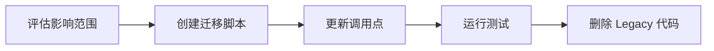
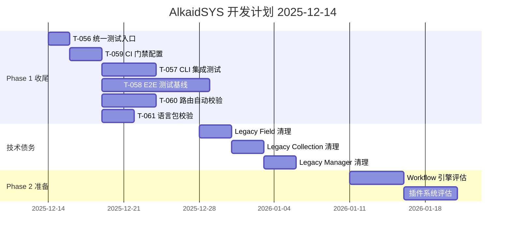
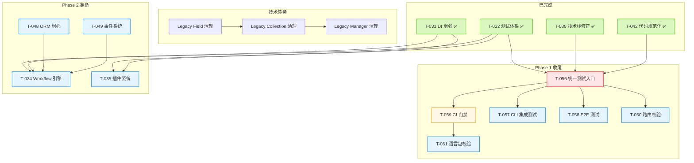

# AlkaidSYS 开发计划

> **生成日期**: 2025-12-14  
> **基准文档**: `docs/todo/plan/project-status-report-2025-12-14.md`  
> **参考规范**: `.augment/rules/always-alkaidsys-project-rules.md`

---

## 执行摘要

本开发计划基于项目现状报告，将待完成任务按优先级分级，并规划 Phase 1 收尾、技术债务偿还、Phase 2 准备等工作。

### 计划概览

| 阶段 | 时间范围 | 主要目标 |
|------|----------|----------|
| Phase 1 收尾 | 第 1-2 周 | 完成测试体系、CI 门禁 |
| 技术债务偿还 | 第 2-4 周 | 清理 Legacy 代码、补充测试 |
| Phase 2 准备 | 第 4-6 周 | 评估并启动 Workflow/插件系统 |

---

## 一、优先级排序的任务列表

### P0 - 阻塞性任务 (必须立即处理)

| 任务 ID | 描述 | 预估工作量 | 依赖 | 状态 |
|---------|------|------------|------|------|
| ~~T-056~~ | ~~统一测试入口实现~~ | ~~1-2 天~~ | ~~T-032, T-038~~ | ✅ 完成 (2025-12-14) |

### P1 - 高优先级任务 (本周完成)

| 任务 ID | 描述 | 预估工作量 | 依赖 | 状态 |
|---------|------|------------|------|------|
| ~~T-059~~ | ~~CI 代码格式检查与测试门禁~~ | ~~2-3 天~~ | ~~T-056~~ | ✅ 完成 (2025-12-14) |
| T-065 | 修复 RateLimit 单元测试失败 | 1-2 天 | T-056 | 待处理 |

### P2 - 中优先级任务 (2-4 周内完成)

| 任务 ID | 描述 | 预估工作量 | 依赖 | 状态 |
|---------|------|------------|------|------|
| T-057 | 低代码 CLI 集成测试补充 | 3-5 天 | T-056 | 待处理 |
| T-058 | 多租户 E2E 与性能测试基线 | 5-10 天 | T-056 | 待处理 |
| T-060 | 路由文档自动生成与校验 | 3-5 天 | T-056 | 待处理 |
| T-061 | 语言包 key 一致性检查 | 2-3 天 | T-059 | 待处理 |
| T-034 | Workflow 引擎 (Phase 2) | 待评估 | T-031, T-032 | 待处理 |
| T-035 | 插件系统基础 (Phase 2) | 待评估 | T-031, T-032 | 待处理 |

### P3 - 低优先级任务 (按需完成)

| 任务 ID | 描述 | 预估工作量 | 依赖 |
|---------|------|------------|------|
| T-062 | 环境变量完整性检查 | 2-3 天 | T-040 |
| T-063 | 语言包变更流程 | 1-2 天 | T-061 |
| T-064 | 现代 PHP 特性规范 | 2-3 天 | T-047 |

---

## 二、Phase 1 收尾计划

### 2.1 第一周: 测试体系建设

#### 目标
- 实现统一测试入口
- 配置 CI 门禁

#### 任务分解

**T-056: 统一测试入口实现**

```bash
# 目标命令
docker exec -it alkaid-backend php think test

# 验收标准
1. 在 alkaid-backend 容器内执行可拉起全部 phpunit 测试
2. 退出码正确反映测试结果
3. 技术规范文档同步更新
```

**实现步骤**:
1. 创建 `app/command/TestCommand.php` 继承 ThinkPHP Console Command
2. 封装 PHPUnit 执行逻辑，支持 `--testsuite`、`--filter` 等参数
3. 在 `config/console.php` 中注册命令
4. 更新 `docs/technical-specs/testing-guidelines.md`

**T-059: CI 代码格式检查与测试门禁**

```yaml
# GitHub Actions 示例
name: CI Gate
on: [push, pull_request]
jobs:
  lint:
    runs-on: ubuntu-latest
    steps:
      - uses: actions/checkout@v4
      - name: PHP-CS-Fixer Check
        run: docker exec alkaid-backend ./vendor/bin/php-cs-fixer fix --dry-run --diff
  test:
    runs-on: ubuntu-latest
    steps:
      - uses: actions/checkout@v4
      - name: Run Tests
        run: docker exec alkaid-backend php think test
```

### 2.2 第二周: 测试补充

#### 目标
- 补充低代码 CLI 集成测试
- 建立多租户 E2E 测试基线

#### 任务分解

**T-057: 低代码 CLI 集成测试**

覆盖场景:
1. `lowcode:create-model` - 创建 Collection
2. `lowcode:create-form` - 创建表单 Schema
3. `lowcode:migration:diff` - Schema 差异检测
4. 迁移执行与回滚

**T-058: 多租户 E2E 测试**

覆盖场景:
1. 跨租户访问拒绝 (HTTP 403)
2. 租户切换后数据隔离
3. 应用安装/升级/回滚

---

## 三、技术债务偿还计划

### 3.1 Legacy 代码清理 (第 2-3 周)

#### 清理顺序



#### 清理批次

**批次 1: Field 类型系统**
- 删除: `domain/Field/*`
- 保留: `infrastructure/Lowcode/Collection/Field/*`
- 影响: 需检查是否有直接引用

**批次 2: Collection 模型**
- 删除: `domain/Model/Collection.php`
- 保留: `domain/Lowcode/Collection/Model/Collection.php`
- 影响: 需更新 import 语句

**批次 3: CollectionManager**
- 删除: `infrastructure/Collection/CollectionManager.php`
- 保留: `infrastructure/Lowcode/Collection/Service/CollectionManager.php`
- 影响: 需更新 DI 绑定

**批次 4: FieldTypeRegistry**
- 删除: `infrastructure/Field/FieldTypeRegistry.php`
- 保留: `infrastructure/Lowcode/Collection/Field/FieldFactory.php`
- 影响: 需更新字段类型注册逻辑

### 3.2 自动化校验工具 (第 3-4 周)

**T-060: 路由文档自动校验**

```php
// app/command/RouteValidateCommand.php
class RouteValidateCommand extends Command
{
    protected function execute(Input $input, Output $output)
    {
        // 1. 获取所有注册路由
        // 2. 解析 route-reference.md
        // 3. 比对差异
        // 4. 输出报告
    }
}
```

**T-061: 语言包 key 校验**

```php
// app/command/LangValidateCommand.php
class LangValidateCommand extends Command
{
    protected function execute(Input $input, Output $output)
    {
        // 1. 加载 zh-cn 语言包
        // 2. 加载 en-us 语言包
        // 3. 比对 key 差异
        // 4. 输出报告
    }
}
```

---

## 四、Phase 2 准备工作

### 4.1 Workflow 引擎评估 (第 4-5 周)

#### 设计文档参考
- `design/09-lowcode-framework/47-workflow-backend-engine.md`
- `design/09-lowcode-framework/49-workflow-implementation-plan.md`
- `design/09-lowcode-framework/44-lowcode-workflow.md`

#### 核心组件

| 组件 | 描述 | 依赖 |
|------|------|------|
| 触发器系统 | 10+ 种触发器类型 | 事件系统 |
| 节点类型系统 | 10+ 种节点类型 | 表达式引擎 |
| 执行引擎 | 基于 Swoole 协程 | think-swoole |
| 变量系统 | Symfony Expression Language | 新增依赖 |

#### 前置条件
1. T-049 事件系统增强完成
2. 评估 Symfony Expression Language 集成方案
3. 确认 Swoole 协程执行模型

### 4.2 插件系统评估 (第 5-6 周)

#### 设计文档参考
- `design/02-app-plugin-ecosystem/06-2-plugin-system-design.md`
- `design/01-architecture-design/06-application-plugin-system-design.md`

#### 混合方案组件

| 组件 | 描述 | 优先级 |
|------|------|--------|
| 钩子系统优化 | 异步钩子、优先级 | P2 |
| iframe 加载器 | postMessage 通信 | P3 |
| 组件加载器 | Vue 动态导入 | P3 |
| 后端异构集成 | Python/Go/Node SDK | P3 |

#### 前置条件
1. T-035 插件系统基础完成
2. T-052 钩子系统优化完成
3. 前端插件 SDK 设计确认

---

## 五、测试补充计划

### 5.1 测试覆盖率目标

| 类型 | 当前估算 | 目标 | 差距 |
|------|----------|------|------|
| 整体覆盖率 | ~65% | > 80% | +15% |
| Service 层 | ~75% | > 90% | +15% |
| Model 层 | ~70% | > 85% | +15% |
| Controller 层 | ~60% | > 75% | +15% |

### 5.2 需要新增的测试用例

#### 低代码 CLI 测试 (T-057)

| 测试场景 | 测试类型 | 优先级 |
|----------|----------|--------|
| Collection 创建 | Integration | P2 |
| Form Schema 生成 | Integration | P2 |
| Migration diff | Integration | P2 |
| 迁移执行/回滚 | Integration | P2 |

#### 多租户 E2E 测试 (T-058)

| 测试场景 | 测试类型 | 优先级 |
|----------|----------|--------|
| 跨租户访问拒绝 | E2E | P2 |
| 租户切换数据隔离 | E2E | P2 |
| 应用安装/升级 | E2E | P2 |

#### 性能测试基线 (T-058)

| 测试场景 | 指标 | 基线值 |
|----------|------|--------|
| Collection 列表查询 | 响应时间 | < 100ms |
| Form 数据提交 | 响应时间 | < 200ms |
| 权限检查 | 响应时间 | < 10ms |

---

## 六、里程碑与时间线

### 6.1 里程碑定义

| 里程碑 | 目标日期 | 交付物 | 状态 |
|--------|----------|--------|------|
| M1: 测试体系就绪 | 2025-12-21 | T-056, T-059 完成 | ✅ 已完成 (2025-12-14) |
| M1.5: 测试稳定 | 2025-12-18 | T-065 完成，所有 Unit 测试通过 | 进行中 |
| M2: Phase 1 收尾 | 2025-12-28 | T-057, T-058, T-060, T-061 完成 | 待处理 |
| M3: 技术债务清理 | 2026-01-11 | Legacy 代码清理完成 | 待处理 |
| M4: Phase 2 启动 | 2026-01-18 | Workflow/插件系统评估完成 | 待处理 |

### 6.2 甘特图



---

## 七、依赖关系图



---

## 八、执行建议

### 8.1 本周重点 (2025-12-14 ~ 2025-12-21)

1. ~~**Day 1-2**: 完成 T-056 统一测试入口~~ ✅ 已完成 (2025-12-14)
   - ✅ 创建 `app/command/TestCommand.php`
   - ✅ 更新测试文档
   - ✅ 验证在容器内可执行

2. ~~**Day 3-5**: 完成 T-059 CI 门禁~~ ✅ 已完成 (2025-12-14)
   - ✅ 配置 GitHub Actions (`.github/workflows/backend-php-cs-fixer.yml`)
   - ✅ 添加 PHP-CS-Fixer 格式检查步骤
   - ✅ 添加 PHPUnit 测试执行步骤

3. **Day 3-5 (剩余时间)**: 完成 T-065 修复 RateLimit 测试
   - 调查 6 个失败的 RateLimit 单元测试
   - 修复 Token Bucket 时间相关测试问题
   - 确保所有 Unit 测试通过

### 8.2 下周重点 (2025-12-21 ~ 2025-12-28)

1. **并行执行**:
   - T-057 低代码 CLI 集成测试
   - T-060 路由自动校验
   - T-061 语言包校验

2. **持续进行**:
   - T-058 E2E 测试基线 (跨两周)

### 8.3 风险缓解

| 风险 | 缓解措施 |
|------|----------|
| 测试入口实现复杂度超预期 | 可先用简单脚本包装 phpunit |
| CI 环境配置问题 | 提前验证 Docker 镜像可用性 |
| Legacy 代码清理影响范围大 | 分批次清理，每批次独立测试 |

---

## 九、资源需求

### 9.1 人力资源

| 角色 | 任务 | 工作量 |
|------|------|--------|
| 后端开发 | T-056, T-057, T-060, T-061 | 2-3 周 |
| DevOps | T-059 | 1 周 |
| QA | T-058 | 1-2 周 |

### 9.2 技术资源

| 资源 | 用途 | 状态 |
|------|------|------|
| GitHub Actions | CI/CD | 需配置 |
| Docker 镜像 | 测试环境 | 已就绪 |
| 测试数据库 | 集成测试 | 已就绪 |

---

## 十、附录

### A. 命令执行规范

所有后端命令必须在 `alkaid-backend` 容器内执行:

```bash
# 运行测试
docker exec -it alkaid-backend php think test

# 代码格式检查
docker exec -it alkaid-backend ./vendor/bin/php-cs-fixer fix --dry-run --diff

# 运行迁移
docker exec -it alkaid-backend php think migrate:run
```

### B. 相关文档链接

- 项目现状报告: `docs/todo/plan/project-status-report-2025-12-14.md`
- 开发 Backlog: `docs/todo/development-backlog-2025-11-25.md`
- 主实施计划: `design/00-core-planning/01-MASTER-IMPLEMENTATION-PLAN.md`
- 项目规则: `.augment/rules/always-alkaidsys-project-rules.md`

---

**计划制定者**: Augment Agent
**最后更新**: 2025-12-14

