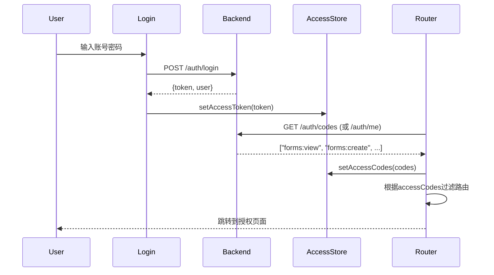

# Vben Admin 与 AlkaidSYS Backend 前后端对接方案

## 📋

 文档信息

| 项目 | 内容 |
|------|------|
| **文档名称** | Vben Admin 前后端对接方案 |
| **文档版本** | v1.0 |
| **创建日期** | 2025-11-20 |
| **作者** | AlkaidSYS Team |
| **状态** | 规划中 |

## 🎯 对接目标

1. **无缝对接** - Vben Admin 5.x 与 AlkaidSYS Backend (ThinkPHP 8 + JWT + RBAC) 完全集成
2. **权限统一** - 后端RBAC权限模型映射到Vben的Access Code机制
3. **认证流程** - JWT Token完整生命周期管理（登录/刷新/过期）
4. **响应适配** - 统一处理后端{code, message, data, timestamp}格式
5. **开发体验** - TypeScript类型安全 + 完整的错误处理

---

## 📐 第一部分：架构对接分析

### 1.1 Vben Admin 5.x 架构概述

**核心特点**：
```
Vben Admin 5.x
├── Monorepo架构 (pnpm workspace + turbo)
├── 多应用支持 (apps/web-antd, web-ele, web-naive等)
├── 共享包系统 (packages/)
│   ├── @vben/request - 请求封装
│   ├── @vben/stores - 状态管理
│   ├── @vben/access - 权限控制
│   └── @vben/utils - 工具函数
└── 基于Vue 3 + Vite + TypeScript
```

**关键机制**：
1. **RequestClient** - 基于axios的请求封装，支持拦截器
2. **Access Control** - 基于access codes的权限系统
3. **Store** - Pinia状态管理（authStore, accessStore, userStore）
4. **路由** - 动态路由 + 权限守卫

### 1.2 AlkaidSYS Backend 架构概述

**技术栈**：
```
AlkaidSYS Backend
├── ThinkPHP 8 + Swoole
├── JWT认证 (firebase/php-jwt)
├── RBAC权限 (基于roles和permissions)
└── 多租户架构 (tenant_id + site_id)
```

**已实现的API**：
```php
// 认证相关
POST   /v1/auth/login      // 登录，返回JWT token
POST   /v1/auth/register   // 注册
POST   /v1/auth/refresh    // 刷新token
GET    /v1/auth/me         // 获取当前用户信息（含roles）

// Form Designer (示例业务API)
GET    /v1/lowcode/forms           // 获取表单列表
POST   /v1/lowcode/forms           // 创建表单
GET    /v1/lowcode/forms/:name     // 获取单个表单
PUT    /v1/lowcode/forms/:name     // 更新表单
DELETE /v1/lowcode/forms/:name     // 删除表单
```

**统一响应格式** ✅ **已验证** ([证据](file:///Users/Benson/Code/AlkaidSYS-tp/app/controller/ApiController.php#L16-L20))：
```json
{
  "code": 0,           // 0=成功, 非0=失败
  "message": "Success",
  "data": {...},
  "timestamp": 1700472537,
  "trace_id": "xxx"   // 可选，用于追踪和调试
}
```

**分页响应格式** ([证据](file:///Users/Benson/Code/AlkaidSYS-tp/app/controller/ApiController.php#L57-L67))：
```json
{
  "code": 0,
  "message": "Success",
  "data": {
    "list": [...],      // 数据列表
    "total": 100,       // 总记录数
    "page": 1,          // 当前页
    "pageSize": 10      // 每页数量
  },
  "timestamp": 1700472537
}
```

### 1.3 关键对接点

**错误码体系** ✅ **已验证** ([证据](file:///Users/Benson/Code/AlkaidSYS-tp/app/middleware/Auth.php#L45), [Permission](file:///Users/Benson/Code/AlkaidSYS-tp/app/middleware/Permission.php#L46-L77))：

| HTTP状态 | 业务Code | 含义 | 使用场景 |
|---------|---------|------|----------|
| 200 | 0 | 成功 | 正常业务响应 |
| 400 | 400-1999 | 参数错误 | 输入验证失败 |
| 401 | 2001 | 未认证 | Token缺失/无效/过期 |
| 403 | 2002 | 无权限 | 权限不足 |
| 404 | 404 | 未找到 | 资源不存在 |
| 422 | 422 | 验证失败 | 字段级验证错误 |
| 500 | 5000 | 服务器错误 | 内部错误 |

### 1.3 关键对接点

| 对接层 | Vben Admin | AlkaidSYS Backend | 对接方案 |
|--------|-----------|-------------------|---------|
| **认证** | Bearer Token in Authorization | JWT Token | ✅ 完全兼容 |
| **权限** | Access Codes数组 | RBAC (roles → permissions) | 需要映射转换 |
| **响应** | 标准axios response | {code, message, data, timestamp} | Response拦截器适配 |
| **错误** | HTTP状态码 | code + HTTP状态码 | 统一错误处理 |
| **刷新** | refreshTokenApi() | POST /v1/auth/refresh | ✅ 完全兼容 |

---

## 🔌 第二部分：API接口映射

### 2.1 认证相关API

#### 登录 API
**Vben期望**：
```typescript
interface LoginParams {
  username: string;
  password: string;
}

interface LoginResult {
  accessToken: string;
  refreshToken?: string;
  user: UserInfo;
}
```

**Backend实际** ✅ **已验证** ([证据](file:///Users/Benson/Code/AlkaidSYS-tp/app/controller/AuthController.php#L42-L98)):
```json
POST /v1/auth/login
Body: { "email": "...", "password": "..." }
Response: {
  "code": 0,
  "message": "Login successful",
  "data": {
    "access_token": "eyJ0eXAiOiJKV1QiLCJhbGc...",
    "refresh_token": "eyJ0eXAiOiJKV1QiLCJhbGc...",
    "token_type": "Bearer",
    "expires_in": 7200,
    "user": {
      "id": 1,
      "tenant_id": 1,
      "username": "admin",
      "email": "admin@alkaidsys.local",
      "name": "Administrator",
      "status": "active"
    }
  },
  "timestamp": 1700472537
}
```

**适配方案（前端适配示例，当前尚未在仓库中实现）** ⚠️ **需要实施**：
```typescript
// src/api/core/auth.ts
// ⚠️ 以下为前端适配示例代码，当前仓库中尚未按此方式实现，仅作为对接 AlkaidSYS Backend 的参考方案
export async function loginApi(data: LoginParams) {
  const response = await requestClient.post<BackendResponse>('/auth/login', {
    email: data.username,  // username → email映射
    password: data.password
  });

  // 适配为Vben期望的格式
  // 注意：Backend返回access_token和refresh_token
  return {
    accessToken: response.data.access_token,
    refreshToken: response.data.refresh_token,  // 新增：存储refresh token
    expiresIn: response.data.expires_in,         // 新增：TTL (7200秒=2小时)
    user: response.data.user
  };
}
```

#### 获取用户信息 API
**Vben期望**：
```typescript
interface UserInfo {
  userId: string;
  username: string;
  realName: string;
  avatar?: string;
  roles?: string[];
}
```

**Backend实际** ✅ **已验证** ([证据](file:///Users/Benson/Code/AlkaidSYS-tp/app/controller/AuthController.php#L278-L303)):
```json
GET /v1/auth/me
Response: {
  "code": 0,
  "message": "Success",
  "data": {
    "user": {
      "id": 1,
      "tenant_id": 1,
      "username": "admin",
      "email": "admin@alkaidsys.local",
      "name": "System Administrator",
      "status": "active"
    },
    "roles": [1, 2]  // role IDs数组（整数）
  },
  "timestamp": 1700472537
}
```

⚠️ **重要**：当前**生产代码**版本中 `/v1/auth/me` 仅返回 `user + roles`，尚未返回 `permissions`。

**目标响应结构（按最终决策方案，需在 Backend 中实施）**：
```json
GET /v1/auth/me
Response: {
  "code": 0,
  "message": "Success",
  "data": {
    "user": {
      "id": 1,
      "tenant_id": 1,
      "username": "admin",
      "email": "admin@alkaidsys.local",
      "name": "System Administrator",
      "status": "active",
      "permissions": ["forms:view", "forms:create"]
    },
    "roles": [1, 2]
  },
  "timestamp": 1700472537
}
```

**前端适配示例（按目标结构，当前尚未在仓库中实现）** ⚠️ **需要实施**：
```typescript
export async function getUserInfoApi() {
  const response = await requestClient.get<BackendResponse>('/auth/me');
  const { user, roles } = response.data;

  return {
    userId: String(user.id),
    username: user.username,
    realName: user.name || user.username,
    avatar: user.avatar,
    roles: roles.map(String),
    permissions: user.permissions ?? [], // resource:action 格式，如 ["forms:view", ...]
  };
}
```

#### Token刷新 API
⚠️ **已修正** ([证据](file:///Users/Benson/Code/AlkaidSYS-tp/app/controller/AuthController.php#L177-L268)):

**Backend机制**（复杂度高于预期）:
1. 需要在Authorization header中传递**Refresh Token**（非Access Token）
2. Backend会验证refresh token类型（type='refresh'）
3. 验证refresh token白名单（缓存）
4. 成功后返回**新的access_token + 新的refresh_token**
5. **旧的refresh token会被revoke**（加入黑名单）

```typescript
export async function refreshTokenApi() {
  // 注意：需要传递refresh token，而非access token
  const response = await requestClient.post<BackendResponse>('/auth/refresh');
  
  return {
    accessToken: response.data.access_token,    // 新的access token
    refreshToken: response.data.refresh_token,  // 新的refresh token
    expiresIn: response.data.expires_in         // TTL
  };
}
```

**Refresh Token生命周期**（7天）：
- Access Token: 2小时 ([证据](file:///Users/Benson/Code/AlkaidSYS-tp/infrastructure/Auth/JwtService.php#L38))
- Refresh Token: 7天 ([证据](file:///Users/Benson/Code/AlkaidSYS-tp/infrastructure/Auth/JwtService.php#L43))

### 2.2 权限相关API

#### 获取权限码（Access Codes）

**Vben期望**：
```typescript
// 一组字符串权限码，用于 hasAccessByCodes()
// 示例：['forms:view', 'forms:create']
```

**Backend最終方案（基于决策报告）**：
- **主通道**：通过 `GET /v1/auth/me` 返回 `permissions: string[]`（`resource:action` 格式）；
- **兼容通道（可选实现）**：提供 `GET /v1/auth/codes` 作为 `/v1/auth/me` 的瘦包装，仅返回权限码数组。

**/v1/auth/me 响应示例（目标结构，需在 Backend 中实施）**：
```json
GET /v1/auth/me
Response: {
  "code": 0,
  "message": "Success",
  "data": {
    "user": {
      "id": 1,
      "tenant_id": 1,
      "username": "admin",
      "email": "admin@alkaidsys.local",
      "name": "System Administrator",
      "status": "active"
    },
    "roles": [1, 2],
    "permissions": ["forms:view", "forms:create"]
  },
  "timestamp": 1700472537
}
```

**/v1/auth/codes 接口定义（可选，作为 /v1/auth/me 的瘦包装）**：
- 路由：`GET /v1/auth/codes`
- 返回：`string[]`，与 `/v1/auth/me` 中的 `permissions` 完全一致
- 状态：⚠️ 当前后端未实现，为**可选实现**，用于兼容 `getAccessCodesApi` 等纯权限码调用场景

```php
// app/controller/AuthController.php
public function codes(Request $request): Response
{
    $userId = $request->userId();
    $permissions = $this->permissionService->getUserPermissions($userId); // ["forms:view", ...]
    return $this->success($permissions);
}
```

**前端调用示例（两种二选一或兼容）**：
```typescript
// 方案1：直接从 /v1/auth/me 中读取 permissions
export async function getAccessCodesFromMe() {
  const response = await requestClient.get<BackendResponse>('/auth/me');
  return response.data.permissions ?? [];
}

// 方案2：调用 /v1/auth/codes（若已实现）
export async function getAccessCodesApi() {
  const codes = await requestClient.get<string[]>('/auth/codes');
  return codes;
}
```

> ✅ 最终推荐：以 `/v1/auth/me.permissions` 作为主权威数据源；`/v1/auth/codes` 仅作为瘦包装和兼容通道。

---

## 🔐 第三部分：权限适配方案

### 3.1 Permission Slug → Access Code映射表

⚠️ **权限格式规范差异** ([Technical Spec](file:///Users/Benson/Code/AlkaidSYS-tp/docs/technical-specs/security/security-guidelines.md#L43) vs [实际代码](file:///Users/Benson/Code/AlkaidSYS-tp/app/middleware/Permission.php#L108-L110)):

**Technical Specs定义**：
- 格式：`resource:action`（冒号分隔）
- 示例：`product:create`, `user:view`
- 文档来源：`docs/technical-specs/security/security-guidelines.md`

**实际代码使用**（需要统一）：  
- 格式：`resource.action`（点分隔）
- 示例：`forms.view`, `forms.create`
- 证据：Permission中间件 `->where('slug', $permission)`

**最终规范（与决策报告一致）**：
- 内部实现：继续以 `resource.action` 作为 slug 主键（如 `forms.view`），保持现有表结构与中间件逻辑不变；
- 对外暴露：统一使用 `resource:action` 字符串权限码（如 `forms:view`），供 API / 文档 / Vben accessCodes 使用；
- 转换方式：通过 `resource`、`action` 字段在后端集中完成 slug ↔ code 的互转，不再引入 AC_ 编码方案；

**完整映射表**（基于实际seed数据）：

| Backend Permission Slug | External Permission Code | 说明 |
|------------------------|---------------------|------|
| `forms.view` | `forms:view` | 查看表单 |
| `forms.create` | `forms:create` | 创建表单 |
| `forms.update` | `forms:update` | 更新表单 |
| `forms.delete` | `forms:delete` | 删除表单 |
| `form_data.view` | `form_data:view` | 查看表单数据 |
| `form_data.create` | `form_data:create` | 创建表单数据 |
| `users.view` | `users:view` | 查看用户 |
| `users.create` | `users:create` | 创建用户 |
| `roles.view` | `roles:view` | 查看角色 |
| `roles.update` | `roles:update` | 更新角色 |

**映射规则** ([证据](file:///Users/Benson/Code/AlkaidSYS-tp/database/seeds/CorePlatformSeed.php#L111-L137)):
```
内部：slug = resource.action
对外：code = resource:action
示例：slug 'forms.view' ↔ code 'forms:view'
```


⚠️ **重要说明** ([证据](file:///Users/Benson/Code/AlkaidSYS-tp/app/middleware/Permission.php#L98-L123))：

Backend Permission中间件**直接使用permission.slug**（如`forms.view`），不使用AC_格式。

```php
// Backend实际权限检查
$permissionId = Db::name('permissions')
    ->where('slug', $permission)  // 直接使用slug
    ->value('id');
```

**权限对接策略（更新版，与决策报告一致）**：
- ✅ 后端在 `/v1/auth/me` / `/v1/auth/codes` 中直接返回 `resource:action` 形式的权限码字符串数组；
- ✅ Vben 直接将这些 `resource:action` 字符串作为 accessCodes 使用，不再进行本地格式转换；
- ❌ 不再引入 AC_ 编码，也不再允许前端基于 roles 或 slug 推导权限集合。

### 3.2 RBAC → Access Control适配

**Backend RBAC模型**：
```
User (N) ───(N) Role ───(N) Permission
     └─ user_roles ┘    └─ role_permissions ┘
```

**Vben Access Control使用**：
```vue
<template>
  <!-- 按钮级权限控制 -->
  <Button v-if="hasAccessByCodes(['forms:create'])">
    创建表单
  </Button>

  <!-- 组件级权限控制 -->
  <AccessControl :codes="['forms:update', 'forms:delete']">
    <FormActions />
  </AccessControl>
</template>

<script setup>
import { useAccess } from '@vben/access';
const { hasAccessByCodes } = useAccess();
</script>
```

**路由级权限控制**：
```typescript
// src/router/routes/modules/forms.ts
export default {
  path: '/forms',
  name: 'Forms',
  component: () => import('@/views/forms/index.vue'),
  meta: {
    title: '表单管理',
    accessCodes: ['forms:view'] // 需要的权限码
  }
}
```

### 3.3 权限加载流程



---

## 🔧 第四部分：RequestClient配置

### 4.1 请求封装配置（前端适配示例，当前尚未在仓库中实现）

**文件位置**：`frontend/apps/web-antd/src/api/request.ts`

```typescript
import { RequestClient } from '@vben/request';
import { useAccessStore } from '@vben/stores';
import { message } from 'ant-design-vue';

// Backend响应格式
interface BackendResponse<T = any> {
  code: number;
  message: string;
  data: T;
  timestamp: number;
}

const baseURL = import.meta.env.VITE_GLOB_API_URL; // http://localhost:8000/v1

export const requestClient = new RequestClient({
  baseURL,
  timeout: 10000,
});

// ==================== 请求拦截器 ====================
requestClient.addRequestInterceptor({
  fulfilled: async (config) => {
    const accessStore = useAccessStore();
    const token = accessStore.accessToken;
    
    // 添加Token到Authorization头
    if (token) {
      config.headers.Authorization = `Bearer ${token}`;
    }
    
    // 添加租户和站点ID（如果需要）
    const tenantId = localStorage.getItem('tenantId') || '1';
    const siteId = localStorage.getItem('siteId') || '0';
    config.headers['X-Tenant-ID'] = tenantId;
    config.headers['X-Site-ID'] = siteId;
    
    return config;
  },
  rejected: async (error) => {
    return Promise.reject(error);
  },
});

// ==================== 响应拦截器 ====================
requestClient.addResponseInterceptor({
  fulfilled: async (response) => {
    const backendData = response.data as BackendResponse;
    
    // 检查业务code
    if (backendData.code !== 0) {
      // 业务错误
      message.error(backendData.message || '请求失败');
      return Promise.reject(new Error(backendData.message));
    }
    
    // 成功：返回data部分
    return backendData.data;
  },
  rejected: async (error) => {
    const { response } = error;
    
    if (!response) {
      // 网络错误
      message.error('网络连接失败，请检查网络');
      return Promise.reject(error);
    }
    
    const status = response.status;
    const backendData = response.data as BackendResponse;
    
    // 401 未认证
    if (status === 401) {
      const accessStore = useAccessStore();
      
      // 尝试刷新token
      if (accessStore.accessToken) {
        try {
          const newToken = await doRefreshToken();
          accessStore.setAccessToken(newToken);
          
          // 重放原请求
          error.config.headers.Authorization = `Bearer ${newToken}`;
          return requestClient.request(error.config);
        } catch (refreshError) {
          // 刷新失败，登出
          await doReAuthenticate();
        }
      } else {
        await doReAuthenticate();
      }
    }
    
    // 403 无权限
    if (status === 403) {
      message.error('您没有权限访问该资源');
      // 可选：跳转到403页面
    }
    
    // 其他错误
    message.error(backendData?.message || `请求失败 (${status})`);
    return Promise.reject(error);
  },
});

// 刷新Token
async function doRefreshToken() {
  // ⚠️ 重要：需要传递refresh token，而非access token
  const accessStore = useAccessStore();
  const refreshToken = localStorage.getItem('refreshToken'); // 需要单独存储refresh token
  
  if (!refreshToken) {
    throw new Error('No refresh token available');
  }
  
  // 临时使用refresh token作为Authorization
  const response = await requestClient.post<BackendResponse>('/auth/refresh', {}, {
    headers: {
      Authorization: `Bearer ${refreshToken}`
    }
  });
  
  const { access_token, refresh_token } = response.data;
  
  // 更新两个token
  accessStore.setAccessToken(access_token);
  localStorage.setItem('refreshToken', refresh_token);
  
  return access_token;
}

// 重新认证（登出）
async function doReAuthenticate() {
  const accessStore = useAccessStore();
  accessStore.setAccessToken(null);
  
  // 跳转登录页
  window.location.href = '/login';
}
```

### 4.2 TypeScript类型定义

**文件位置（设计规划，当前仓库中不存在该文件）**：`frontend/apps/web-antd/src/types/api.ts`

```typescript
// Backend统一响应格式
export interface BackendResponse<T = any> {
  code: number;
  message: string;
  data: T;
  timestamp: number;
}

// 分页响应
export interface PaginatedResponse<T> {
  items: T[];
  total: number;
  page: number;
  pageSize: number;
}

// 用户信息
export interface UserInfo {
  id: number;
  tenant_id: number;
  username: string;
  email: string;
  name?: string;
  avatar?: string;
  status: string;
}

// 登录响应
export interface LoginResponse {
  token: string;
  token_type: string;
  user: UserInfo;
}

// 表单Schema（示例）
export interface FormSchema {
  id?: number;
  name: string;
  title: string;
  schema: Record<string, any>;
  config?: Record<string, any>;
}
```

---

## 📦 第五部分：状态管理

### 5.1 Auth Store适配（前端适配示例，当前尚未在仓库中实现）

**文件位置**：`frontend/apps/web-antd/src/store/auth.ts`

```typescript
import { defineStore } from 'pinia';
import { loginApi, getUserInfoApi, getAccessCodesApi } from '@/api/core/auth';
import { useAccessStore } from '@vben/stores';

export const useAuthStore = defineStore('auth', {
  state: () => ({
    userInfo: null as UserInfo | null,
    accessCodes: [] as string[],
  }),
  
  actions: {
    async login(username: string, password: string) {
      try {
        // 登录
        const { accessToken, user } = await loginApi({ username, password });
        
        // 存储token
        const accessStore = useAccessStore();
        accessStore.setAccessToken(accessToken);
        
        // 存储用户信息
        this.userInfo = user;
        
        // 获取权限码
        await this.fetchAccessCodes();
        
        return true;
      } catch (error) {
        console.error('Login failed:', error);
        throw error;
      }
    },
    
    async fetchAccessCodes() {
      const codes = await getAccessCodesApi();
      this.accessCodes = codes;
      
      const accessStore = useAccessStore();
      accessStore.setAccessCodes(codes);
    },
    
    async logout() {
      this.userInfo = null;
      this.accessCodes = [];
      
      const accessStore = useAccessStore();
      accessStore.setAccessToken(null);
      accessStore.setAccessCodes([]);
    },
  },
});
```

---

## 📝 第六部分：开发环境配置

### 环境变量说明 ✅ **已验证** ([证据](file:///Users/Benson/Code/AlkaidSYS-tp/app/middleware/Auth.php#L36-L38))

Backend支持开发环境跳过认证/权限检查：

```bash
# .env (开发环境)
APP_ENV=dev

# 跳过Auth中间件（仅dev环境生效）
AUTH_SKIP_MIDDLEWARE=true

# 跳过Permission中间件（仅dev环境生效）
PERMISSION_SKIP_MIDDLEWARE=true
```

⚠️ **安全提示**：这些开关仅在`APP_ENV=dev`时生效，生产环境自动失效。

---

## 🚀 第七部分：实施步骤

### 阶段一：基础配置（1-2小时）

**Step 1: 配置RequestClient**
- [x] 创建 `src/api/request.ts`
- [x] 配置baseURL
- [x] 添加请求/响应拦截器
- [x] 实现Token自动添加
- [x] 实现响应格式适配

**Step 2: 实现认证API（按本方案改造现有前端 API，当前仓库尚未完成）**
- [x] 存在 `src/api/core/auth.ts`（需按本方案改造）
- [ ] 按本方案实现/调整 `loginApi()`
- [ ] 按本方案实现/调整 `getUserInfoApi()`（当前实现位于 `src/api/core/user.ts`）
- [ ] 按本方案实现/调整 `getAccessCodesFromMe()` / `getAccessCodesApi()`（至少实现其一，推荐前者）
- [ ] 按本方案实现/调整 `refreshTokenApi()`

**Step 3: 配置Store（按本方案改造现有 Auth Store，当前仓库尚未完成）**
- [x] 存在 `src/store/auth.ts`（组合式 Store 实现）
- [ ] 按本方案实现/调整登录逻辑
- [ ] 按本方案实现/调整权限码加载
- [ ] 按本方案实现/调整登出逻辑

### 阶段二：权限对接（2-3小时）

**Step 4: Backend权限API（按决策报告实施）**
- [ ] 实现 PermissionService::getUserPermissions(userId): string[]，返回 `resource:action[]`
- [ ] 扩展 `GET /v1/auth/me`，在 data 中增加 `permissions: string[]` 字段
- [ ] （可选）新增 `GET /v1/auth/codes` 作为 `/v1/auth/me.permissions` 的瘦包装，仅返回权限码数组
- [ ] 针对 `/v1/auth/me` / `/v1/auth/codes` 编写并通过接口测试

**Step 5: 前端权限控制**
- [ ] 配置路由权限（meta.accessCodes）
- [ ] 测试页面级权限控制
- [ ] 测试组件级权限控制（v-if）
- [ ] 测试按钮级权限控制

### 阶段三：业务API封装（3-4小时）

**Step 6: Form Designer API**
- [ ] 创建 `src/api/lowcode/forms.ts`
- [ ] 实现表单CRUD接口
- [ ] 创建TypeScript类型定义
- [ ] 测试API调用

**Step 7: 用户管理API**
- [ ] 创建 `src/api/system/user.ts`
- [ ] 实现用户CRUD接口
- [ ] 实现角色分配接口

**Step 8: 角色权限API**
- [ ] 创建 `src/api/system/role.ts`
- [ ] 创建 `src/api/system/permission.ts`
- [ ] 实现角色权限管理接口

### 阶段四：测试验证（1-2小时）

**Step 9: 集成测试**
- [ ] 测试登录流程
- [ ] 测试Token刷新
- [ ] 测试权限控制
- [ ] 测试业务API调用
- [ ] 测试错误处理

**Step 10: 优化**
- [ ] 添加Loading状态
- [ ] 优化错误提示
- [ ] 添加请求缓存（如需要）
- [ ] 性能优化

---

## 📝 附录

### A. 完整API清单

| 分类 | 方法 | 路径 | 说明 | 优先级 |
|------|------|------|------|--------|
| **认证** | POST | /v1/auth/login | 登录（已实现） | P0 |
| | GET | /v1/auth/me | 获取用户信息（已实现） | P0 |
| | POST | /v1/auth/refresh | 刷新Token（已实现） | P0 |
| | GET | /v1/auth/codes | 获取权限码（规划中，后端当前未实现，仅在文档与mock中存在） | P0 |
| | POST | /v1/auth/logout | 登出（规划中，后端当前未实现，仅在文档与前端默认auth.ts中存在） | P1 |
| **表单** | GET | /v1/lowcode/forms | 列表 | P0 |
| | POST | /v1/lowcode/forms | 创建 | P0 |
| | GET | /v1/lowcode/forms/:name | 详情 | P0 |
| | PUT | /v1/lowcode/forms/:name | 更新 | P0 |
| | DELETE | /v1/lowcode/forms/:name | 删除 | P0 |

### B. 错误码映射

| HTTP | Backend Code | Frontend处理 | 用户提示 |
|------|-------------|-------------|---------|
| 200 | 0 | 正常返回 | - |
| 400 | 1001-1999 | 表单验证错误 | 显示具体字段错误 |
| 401 | 2001 | Token刷新或跳转登录 | "登录已过期" |
| 403 | 2002 | 显示403页面 | "无访问权限" |
| 404 | 3001 | 显示404页面 | "资源不存在" |
| 500 | 5000 | 显示错误页 | "系统错误，请稍后重试" |

### C. 环境变量配置

```bash
# .env.development
VITE_GLOB_API_URL=http://localhost:8000/v1
VITE_NITRO_MOCK=false

# .env.production
VITE_GLOB_API_URL=https://api.alkaidsys.com/v1
VITE_NITRO_MOCK=false
```

---

## 🎯 下一步行动

1. **立即开始**：阶段一 - 基础配置（预计2小时）
2. **优先级**：P0任务优先（认证+权限+表单API）
3. **验收标准**：
   - ✅ 登录成功并获取Token
   - ✅ 权限码正确加载
   - ✅ 表单列表正常显示
   - ✅ 权限控制生效

**准备就绪，可以开始实施！** 🚀
